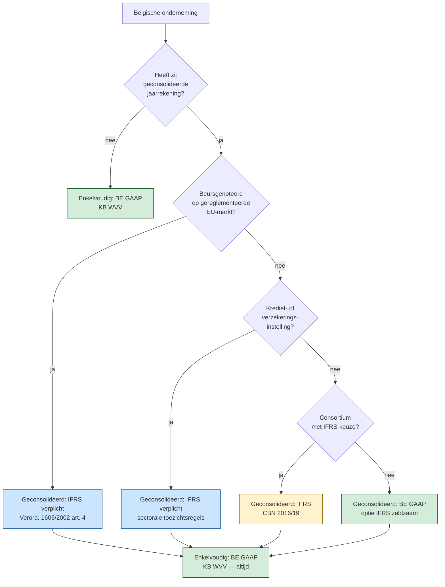

# IFRS-toepassingsgebied in België — wie moet en wie mag? ⚖️

> [!summary] Korte inhoud
> In België is IFRS-toepassing zeer beperkt. **Verplicht** is IFRS alleen voor de geconsolideerde jaarrekening van (1) op een gereglementeerde markt genoteerde Belgische ondernemingen, en (2) Belgische kredietinstellingen en verzekeringsondernemingen (op grond van sectorale toezich….

> [!info] Specialisatie van: [[verplichte-ifrs-eu-beursgenoteerden]]

In België is IFRS-toepassing zeer beperkt. **Verplicht** is IFRS alleen voor de geconsolideerde jaarrekening van (1) op een gereglementeerde markt genoteerde Belgische ondernemingen, en (2) Belgische kredietinstellingen en verzekeringsondernemingen (op grond van sectorale toezichtsregels). **Toegestaan** (optie) is IFRS voor de geconsolideerde jaarrekening van een Belgische niet-beursgenoteerde moeder die uitdrukkelijk voor IFRS kiest en daarvoor toestemming krijgt — én voor de geconsolideerde jaarrekening van een consortium dat tot één enkel rapporteringsstelsel wil overgaan (Commissie voor Boekhoudkundige Normen, CBN, 2016/19). **Voor de enkelvoudige (statutaire) jaarrekening van een vennootschap** is IFRS in België niét toegestaan — die volgt altijd Belgisch GAAP (KB WVV).

_Bron: EU-IFRS-verordening 1606/2002 art. 4 + CBN 2016/19_

## Bouwstenen

### Geconsolideerd niveau: vier scenario's ⚖️

Voor de **geconsolideerde** jaarrekening kent België vier situaties: (1) **verplicht IFRS** — beursgenoteerden + financiële instellingen; (2) **optie IFRS** — niet-beursgenoteerde moeder mag kiezen (zelden gedaan); (3) **verplicht Belgisch GAAP** — alle andere groepen; (4) **consortium**: één gemeenschappelijke standaard verplicht — meestal Belgisch GAAP, IFRS mag onder voorwaarden.

**Waarom?** Het regelgevende kader weegt de **kosten** van IFRS-rapportering (specialistische kennis, software, externe rapportering) tegen de **baten** (vergelijkbaarheid voor beleggers). Voor beursgenoteerde groepen wegen de baten zwaar; voor familiebedrijven niet.

Antwerpse Investments NV (niet-beursgenoteerde holding, € 1.250.000.000 balanstotaal) had IFRS kunnen overwegen voor haar consolidatie maar koos voor Belgisch GAAP — minder kost, voldoende voor haar Belgische financiers.

_Grondslag: EU-IFRS-verordening 1606/2002 art. 4 jo. art. 5; CBN 2016/19_

### Enkelvoudig niveau: altijd Belgisch GAAP 🔗

De wettelijke (statutaire) jaarrekening van een Belgische vennootschap — die dient voor uitkeerbaarheid, kapitaalbescherming en fiscale aangifte — volgt **altijd** Belgisch GAAP. Geen optie om IFRS te kiezen voor enkelvoudige cijfers. (De negatieve claim — IFRS NIET toegestaan voor enkelvoudige jaarrekening — is afgeleid uit het ontbreken van een Belgische art. 5-omzetting van Verord. 1606/2002; geen rechtstreekse positieve regel.)

**Waarom?** De statutaire jaarrekening is de **rechtsgrondslag** voor dividenden en winstbelasting. Het Belgisch systeem koppelt die rechtsgevolgen aan Belgisch GAAP — overschakelen naar IFRS zou de fiscaal-juridische infrastructuur ondermijnen.

Zelena Bio NV publiceert dus elk jaar **twee** verschillende jaarrekeningen: één in IFRS (geconsolideerd, voor de beurs) en één in Belgisch GAAP (enkelvoudig, voor de Nationale Bank en de fiscus). Beide zijn rechtsgeldig en hebben verschillende doelen.

_Grondslag: KB WVV (geen optie tot IFRS voor enkelvoudig)_

### Consortium-uitzondering (CBN 2016/19) ⚖️

Bij een **consortium** (horizontale groep zonder moeder, art. 1:19 WVV) moeten de leden samen één geconsolideerde jaarrekening opstellen. Als één lid beursgenoteerd is, geldt IFRS voor het geheel. Anders mag het consortium kiezen tussen Belgisch GAAP en IFRS — maar dezelfde keuze geldt voor alle leden.

**Waarom?** Een consortium presenteert zich aan derden als één economische groep; verschillende standaarden binnen het consortium zouden de geconsolideerde cijfers incoherent maken.

Industria Antwerpen NV en Jachthaven Jezus-Eik NV vormen een consortium onder gemeenschappelijke leiding van Pieter Vermeulen. Geen van beide is beursgenoteerd → ze kiezen Belgisch GAAP voor hun gezamenlijke geconsolideerde jaarrekening (eenvoudiger, goedkoper).

_Grondslag: CBN 2016/19_

### Wijziging boekhoudkundig referentiestelsel (CBN 2022/08) ⚖️

Een onderneming die wisselt van een buitenlands stelsel (typisch IFRS) **naar BE GAAP** voor haar **statutaire** jaarrekening volgt CBN 2022/08: continuïteitsbeginsel blijft gelden (openingsbalans = eindbalans vorig boekjaar), maar afwijkende waarderingen worden herwerkt via eigen-vermogen-rekeningen; vergelijkende cijfers worden aangepast via een concordantietabel in de toelichting. De **omgekeerde** richting (BE GAAP → IFRS, typisch voor geconsolideerde jaarrekening bij nieuwe beursnotering) valt onder **IFRS 1**, niet onder CBN 2022/08. CBN 2022/08 dekt niét de geconsolideerde jaarrekening.

**Waarom?** Een stelselwissel raakt de fundamenten van de cijferbasis. CBN 2022/08 voorkomt zowel een ongedocumenteerde 'reset' (continuïteit blijft staan) als een mechanische doorrekening die in strijd is met BE GAAP (uitzondering bij twee cumulatieve voorwaarden).

Aurelia Holding NV verliest in 2027 haar GVV-status; vanaf boekjaar 2028 moet zij haar statutaire jaarrekening terug in BE GAAP opstellen. Per 1 januari 2028 herwerkt ze MVA, financiële vaste activa en geldbeleggingen naar BE-GAAP-conforme waardering; de vergelijkende cijfers 2027 worden in een concordantietabel toegelicht.

_Grondslag: CBN 2022/08 (BE-bestemming, statutair); IFRS 1 voor IFRS-bestemming_

## In de praktijk

<h3 id="belgische-bijkantoren-van-buitenlandse-vennootschappen">Belgische bijkantoren van buitenlandse vennootschappen</h3>

> [!tip]- Belgische bijkantoren van buitenlandse vennootschappen
> Een Belgisch bijkantoor van een buitenlandse vennootschap (bv. Kappers Köln GmbH met bijkantoor in Antwerpen) heeft géén eigen Belgische boekhoudverplichting voor zijn 'enkelvoudige' cijfers — het Belgisch boekhoudrecht is op zo'n bijkantoor niet van toepassing. Het bijkantoor neerlegt wél de buitenlandse jaarrekening van de moedervennootschap, vertaald in EUR en in een van de nationale talen. ⚖️

<h3 id="brexit-impact-op-ifrs-erkenning">Brexit-impact op IFRS-erkenning</h3>

> [!tip]- Brexit-impact op IFRS-erkenning
> Een Britse beursgenoteerde vennootschap is sinds 1 januari 2021 een 'derde land'-vennootschap. UK-IFRS geldt niet automatisch als EU-IFRS. Voor een Belgische dochter van zo'n UK-moeder die binnen de EU-IFRS-vrijstellingen wil blijven (art. 23 Richtlijn 2013/34), is nodig dat de UK-jaarrekening als 'gelijkwaardig' wordt erkend. ⚖️

<h3 id="wat-ziet-de-stagiair-in-een-dossier">Wat ziet de stagiair in een dossier?</h3>

> [!tip]- Wat ziet de stagiair in een dossier?
> Drie concrete signalen waaruit een stagiair afleidt welk stelsel van toepassing is op een dossier: (1) **prospectus of jaarverslag** vermeldt 'gereglementeerde markt' of een notering op Euronext-hoofdmarkt → geconsolideerd onder IFRS; vermelding 'Euronext Growth' of 'MTF' → géén art. 4-verplichting. (2) **statuut van de moeder** in de bedrijfsfiche: erkend als kredietinstelling (NBB-licentie) of verzekeringsmaatschappij (FSMA) → geconsolideerd IFRS sectoraal verplicht. (3) **consortium-vermelding** in de toelichting bij de geconsolideerde jaarrekening → check CBN 2016/19 voor de keuze van het rapporteringsstelsel. 🔗

## Valkuilen

> [!warning]- Niet verwarren: 'beursgenoteerd' in art. 4 Verordening 1606/2002 betekent **gereglementeerde markt** (Euronext, MTS, ...) — NIET een multila…
> ⚠️ Niet verwarren: 'beursgenoteerd' in art. 4 Verordening 1606/2002 betekent **gereglementeerde markt** (Euronext, MTS, ...) — NIET een multilaterale handelsfaciliteit (MTF) zoals Euronext Growth. Een onderneming alleen op Euronext Growth genoteerd is dus NIET verplicht IFRS toe te passen. ⚖️
>
> _Bron: Verordening 1606/2002 art. 4 (verwijzing naar 'gereglementeerde markt')_

> [!warning]- Een Belgische niet-beursgenoteerde moeder mag NIET vrijwillig naar IFRS overschakelen voor haar enkelvoudige jaarrekening
> ⚠️ Een Belgische niet-beursgenoteerde moeder mag NIET vrijwillig naar IFRS overschakelen voor haar enkelvoudige jaarrekening. Wil de moeder toch IFRS-cijfers? Dan moet zij ze als parallelle (informele) rapportering naast de wettelijke jaarrekening leveren. 🔗
>
> _Bron: Belgische praktijk_

## Zie ook

- **Vereist kennis van**: [[consortium]]
- **Wordt voorondersteld in** (1): [[bepalen-toepasselijkheid-ifrs-belgie]]- **Triggert** (1): [[wijziging-boekhoudkundig-referentiestelsel]]
## Illustraties

#### Beslisboom — welk stelsel voor welke Belgische jaarrekening? ⚖️
_Twee assen: jaarrekening-niveau (geconsolideerd / enkelvoudig) × notering-status. Pijl uit een blok = 'leidt tot'._

_Bron: Verord. 1606/2002 art. 4-5 + CBN 2016/19 + KB WVV_

## Voorbeelden

Zelena Bio NV (beursgenoteerd op Euronext Brussel, € 350.000.000 omzet groep) is verplicht IFRS toe te passen op haar **geconsolideerde** jaarrekening. Voor haar **enkelvoudige** jaarrekening blijft KB WVV (Belgisch GAAP) van toepassing. Rotex Roeselare NV (grote NV, niet beursgenoteerd, € 80.000.000 omzet) past op beide niveaus Belgisch GAAP toe — geen IFRS, niet verplicht en niet toegestaan voor haar enkelvoudige rekening.

## Bronnen

[^1]: `EU-IFRS-verordening-1606-2002__art_4`
[^2]: `EU-IFRS-verordening-1606-2002__art_2`
[^3]: `CBN-2016-19-consortium-toepasselijke-rapporteringsstandaard-vrijstelling-van-subconsolidatie-update-0__sec_toepasselijke-rapporteringsstandaard`
[^4]: `CBN-2022-14-belgische-bijkantoren-van-buitenlandse-vennootschappen-toepassing-van-het-belgisch__sec_toepassingsgebied-van-het-belgisch-boekhoudrecht`
[^5]: `CBN-2022-08-wijziging-van-het-boekhoudkundig-referentiestelsel__sec_inleiding`
[^6]: `CBN-2019-04-gevolgen-op-gebied-van-financiele-rapportering-als-gevolg-van-de-brexit-0__sec_de-vorm-waarin-de-jaarrekening-en-de-geconsolideerde-jaarrek_part2`
[^7]: `EU-IFRS-verordening-1606-2002__art_5`
