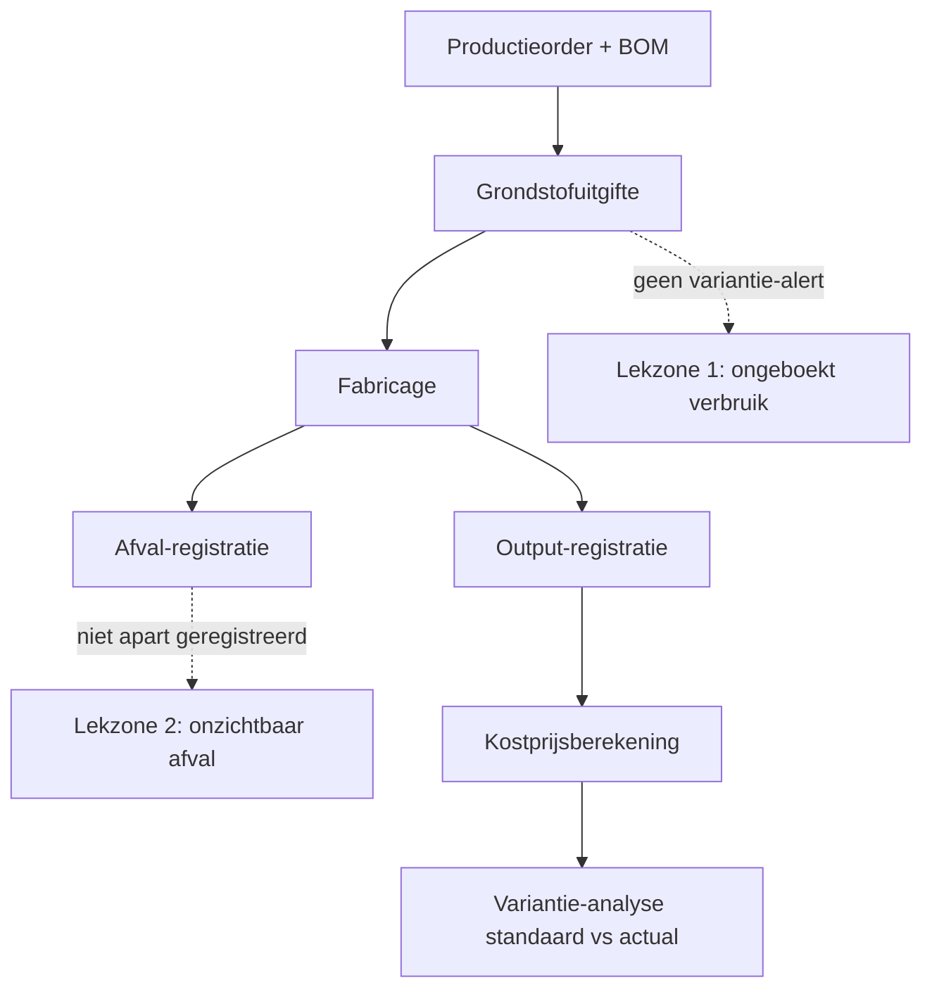

# Productiecyclus en interne controle 🔗

De productiecyclus transformeert grondstoffen via arbeid en machine-uren naar afgewerkte producten. Interne controle focust op correcte voorraadregistratie, kostprijsberekening en kwaliteitscontrole. Voor productiebedrijven (industrie, ambacht, bestellingen in uitvoering) is dit doorgaans de meest risicovolle cyclus voor zowel waardering als fraude (afval-fraude, ghost-output). Stagiairs komen dit tegen bij audits van industriële klanten of CBN 132/7-toepassingen.

> [!summary] Korte inhoud
> Interne controle in de productiecyclus is het geheel van maatregelen die de stadia productieplanning → grondstofuitgifte → fabricage → voorraad gereed product → kostprijsberekening beheersen, met als doel rendementsverlies, voorraadafwijkingen, foute kostenverdeling en niet-geboe….

> [!info] Behoort tot: [[cyclus-analyse-ic]]

Interne controle in de productiecyclus is het geheel van maatregelen die de stadia productieplanning → grondstofuitgifte → fabricage → voorraad gereed product → kostprijsberekening beheersen, met als doel rendementsverlies, voorraadafwijkingen, foute kostenverdeling en niet-geboekt afval te voorkomen of te detecteren.

## Bouwstenen

### BOM-tracking en grondstofuitgifte 🤖

Voor elke productieorder wordt de stuklijst (bill of materials, BOM) gevolgd; afwijking tussen BOM en werkelijk verbruik wordt opgevolgd.

**Waarom?** Zonder BOM-tracking blijft afval onzichtbaar en kan diefstal van grondstoffen niet gedetecteerd worden.

**In de praktijk**: In een ERP-systeem wordt elke uitgifte uit het grondstoffenmagazijn gekoppeld aan een productieorder; periodieke yield-rapporten tonen welke order significant van de BOM afwijkt.

_Grondslag: Productie-IC-doctrine_

### Output-registratie en afval-boeking 🤖

Voltooide producten en uitval/afval worden afzonderlijk geregistreerd bij elke productiestap.

**Waarom?** Afval niet boeken betekent voorraad te hoog gewaardeerd; tegelijk is een hoog afvalpercentage een signaal voor proces-inefficiëntie of diefstal.

**In de praktijk**: Bij elke voltooide eenheid scant de operator zowel de output als de uitval; het ERP boekt automatisch in voorraad gereed product en in een aparte afval-rekening.

_Grondslag: Productie-IC-doctrine + KB 21.10.2018 voorraadwaardering_

### Kostprijsberekening en variantie-analyse 🤖

Grondstoffenkost, directe arbeid en overhead worden toegewezen aan voltooide producten; standaardkost wordt vergeleken met actuele kost.

**Waarom?** Verkeerde kostprijs leidt tot verkeerde voorraadwaardering en daardoor tot verkeerd brutoresultaat. Variantie-analyse detecteert sluipende inefficiënties.

Bij Yperse Werkplaats BV is de standaardkost per stuk € 80, de actuele kost over Q4 stijgt naar € 92. Variantie van € 12 per stuk × 4.000 stuks = € 48.000 negatieve variantie — directe Maandanalyse triggert onderzoek naar materiaalprijzen en yield. _(Yperse Werkplaats BV)_ 🤖

_Grondslag: KB WVV art. 3:43 e.v. (waardering voorraden) + CBN 132/7_

### Functiescheiding productie-magazijn-boekhouding 🤖

Productie-operatoren, magazijnpersoneel en boekhouders zijn verschillende personen met verschillende systeem-rollen.

**Waarom?** Een operator die zelf de voorraad mag aanpassen kan eigen rendementsproblemen onzichtbaar maken.

_Grondslag: [[functiescheiding]] §toepassing-productie_

## Berekening

### Procesgang productiecyclus — stappen + IC-haakpunten

### 1. Productieplanning en uitgifte grondstoffen

Productieorder aanmaken; grondstoffen uit magazijn uitgeven volgens stuklijst.

**Waarom?** Zonder formele uitgifte tracking is verdwijnen van grondstoffen niet detecteerbaar.

**📥 Input**:
- Vraagprognose → **volumes** _(ERP-record)_

**📤 Output**:
- Productieorder + uitgiftebon → **BOM-uitgifte** _(ERP-record)_

**🛠️ Hoe**:

1. Productieorder met BOM in ERP.
2. Magazijnier geeft uit; ERP boekt voorraadafname.
3. Afwijking BOM ↔ werkelijk verbruik: opvolgen.

**Grondslag**: Productie-IC-doctrine

### 2. Productie-uitvoering en rapportering

Voltooide producten boeken naar voorraad gereed product; afval/uitval apart boeken.

**Waarom?** Afval niet boeken leidt tot overgewaardeerde voorraad en sluiert proces-inefficiëntie.

**📥 Input**:
- Productieorder → **verwachte output** _(ERP-record)_

**📤 Output**:
- Voorraad gereed product + afval-rekening → **aantallen, waarde** _(boeking)_

**🛠️ Hoe**:

1. Operator scant voltooide eenheid + uitval.
2. ERP boekt automatisch in voorraad gereed product.
3. Periodieke yield-analyse per machine en operator.

**Grondslag**: Productie-IC-doctrine

### 3. Kostprijsberekening en voorraadwaardering

Grondstoffenkost + directe arbeid + overhead toewijzen aan voltooide producten; variantie-analyse maandelijks.

**Waarom?** Verkeerde kostprijs leidt tot verkeerde voorraadwaardering en verkeerd brutoresultaat.

**📥 Input**:
- Werkelijke productie + standaardkost → **uren, materialen, overhead** _(kostenkengetal)_

**📤 Output**:
- Adjusted voorraadwaardering → **boekwaarde** _(boeking)_

**🛠️ Hoe**:

1. Maandelijks: actual cost rekenen op basis van werkelijke productie.
2. Vergelijk met standaardkost; analyseer variantie.
3. Adjustments boeken indien materiële afwijking.

**Grondslag**: KB WVV art. 3:43 e.v. voorraadwaardering

## Valkuilen

> [!warning]- Bestellingen in uitvoering (rekening 37) volgen een aparte waarderingslogica volgens CBN 132/7
> ⚠️ Bestellingen in uitvoering (rekening 37) volgen een aparte waarderingslogica volgens CBN 132/7. Niet zomaar als voorraad gereed product behandelen — de POC (percentage of completion) raakt de resultatenrekening anders. ⚖️
>
> _Bron: CBN 132/7_

> [!warning]- Een ERP met standaard-kost-functionaliteit verbergt vaak grote actual-variances
> ⚠️ Een ERP met standaard-kost-functionaliteit verbergt vaak grote actual-variances. Audit-stap: bevraag het variantie-rapport en de afronding-mechanismes — soms zit een fout in de overhead-allocatie verstopt. 🤖

## Zie ook

- **Vereist kennis van**: [[functiescheiding]]
- **Vereist kennis van**: [[voorraadcyclus-ic]]
- **Wordt voorondersteld in** (1): [[voorraadcyclus-ic]]
## Voorbeelden

### BOM-variantie onthult ongeboekt afval bij Naaiatelier Ninove BV

_Personages: Naaiatelier Ninove BV, Marleen De Cock, Tom Lefèvre_

Naaiatelier Ninove BV produceert werkpakken op maat. De stuklijst (BOM) voor model 'Aurora-XL' voorziet 2,4 meter stof per pak. Bedrijfsleider Marleen De Cock vraagt accountant Tom Lefèvre te controleren waarom de brutomarge het afgelopen kwartaal van 38% naar 24% zakte zonder dat de verkoopprijzen daalden. Tom analyseert de werkelijke uitgifte tegenover de BOM-norm en ontdekt een systematische over-uitgifte van 0,6 meter per pak — gemiddeld 25% afval per pak, dubbel de gebruikelijke 12,5%.

1. Cijferanalyse: 4.200 pakken × 0,6 m extra × € 14/m = € 35.280 ongeboekt afval (of diefstal).
2. IC-zwakte: bouwsteen 'BOM-tracking en grondstofuitgifte' wordt geregistreerd maar er bestaat geen automatisch waarschuwingssignaal bij variantie > 10%. Bouwsteen 'Output-registratie en afval-boeking' niet apart geregistreerd — afval ging in de algemene 'uitgifte'-pot.
3. Root-cause-onderzoek: 30% van de over-uitgifte blijkt legitiem (nieuwe stoftrein vereist hertraining); 70% is grondstoffendiefstal door één operator die rollen meeneemt — gedetecteerd via camera-review.
4. Remediëring: ERP-alert ingesteld op BOM-variantie > 10% per productieorder. Wekelijkse uitgiftefiche verplicht door magazijnier én productieverantwoordelijke ondertekend (functiescheiding 'productie-magazijn-boekhouding').
_Productiecyclus — controlepoorten + lekzones_

#### Correctieboeking ontdekt afval (40% legitiem deel)
| Rekening | Debet | Credit |
|---|---:|---:|
| 6094 — Voorraadwijzigingen grondstoffen (afval) _(Niet-geboekt grondstoffenverbruik Q3)_ | 35280 |  |
| 31 — Voorraden grondstoffen |  | 35280 |

🔗

## Bronnen

[^1]: `CBN-132-7-voorraden-en-bestellingen-in-uitvoering__sec_begrip`
