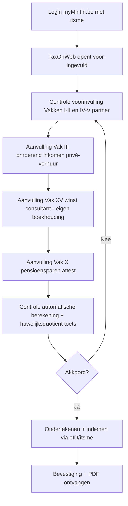

# Aangifte personenbelasting

_Procedure_

📋 Regeling · 📅 Gebeurtenis · Anchors: `2.2.III` · `2.2.IV` · `2.2.taak.1` · `2.2.taak.2` · Wave: `skeleton-pb-venb-2026-05-28`

> [!info] 📝 **Concept** — content gevuld door cluster-extract; niet door mens-verify gegaan.

**Afk.**: Aangifte PB — **Synoniemen**: PB-aangifte · déclaration IPP · déclaration personne physique — **Vertalingen**: fr: déclaration à l'impôt des personnes physiques

## Definitie

📖 De aangifte personenbelasting is de jaarlijkse procedure waarbij een aan de PB onderworpen belastingplichtige (rijksinwoner) zijn belastbare inkomsten van het inkomstenjaar aan de administratie meldt voor het vestigen van de aanslag. De aangifte bestaat uit twee delen — deel 1 voor alle particulieren (persoonlijke gegevens, gezinslast, onroerend/roerend/divers inkomen, pensioen, aftrekken, voorheffingen), en deel 2 voor zelfstandigen en bedrijfsleiders (winst, baten, bedrijfsleidersbezoldigingen). Ze kan op papier of elektronisch (TaxOnWeb) worden ingediend; voor eenvoudige situaties stuurt de fiscus automatisch een voorstel van vereenvoudigde aangifte (VVA) dat als aangifte geldt na bevestiging of correctie.

<small>📚 WIB92 — art. 305 — _wettekst_ · WIB92 — art. 307 — _wettekst_ · WIB92 — art. 308 — _wettekst_ · aangifte-PB-2025-bezoldigingen — Voorbereiding aangifte PB AJ 2025 — deel 1 + 2 structuur — _aangifte_</small>

## Substantie

📖 Praktisch: de aangifte is geen formaliteit maar een data-verzameling die direct de belastingberekening voedt. Voor elke inkomstencategorie zijn er specifieke vakken en codes (typisch 4-cijferige codes per kolom — kolom 1 voor belastingplichtige/oudste partner, kolom 2 voor jongste partner). De vakken worden in vaste volgorde gepresenteerd, parallel aan de WIB92-structuur (eerst gezinscontext + persoonlijke gegevens, dan onroerend, dan roerend, dan beroep, dan divers, dan aftrekken/verminderingen). Voorinvulling door de fiscus (TaxOnWeb): bedrijfsvoorheffing, fiches 281 (loon, pensioen, werkloosheid), roerende inkomsten met RV bekend bij fiscus — de stagiair controleert en vult aan. De aangifte fungeert als juridische verklaring (gewaarmerkt, gedagtekend, ondertekend); valse of onvolledige aangifte triggert administratieve verhogingen (10-200 %) en eventueel strafrechtelijke vervolging.

<small>📚 WIB92 — art. 307 §2 — _wettekst_ · aangifte-PB-2025-bezoldigingen — Kolom 1 = belastingplichtige, Kolom 2 = partner — vak-structuur — _aangifte_ · cluster-extract-agent (opus-4.7-1M) — _ai_model_ — (2026-05-28)</small>

## Rationale

🔗 De ratio legis is fiscale zelfaangifte: in een massa-belasting waar miljoenen belastingplichtigen jaarlijks worden belast, kan de fiscus niet zelfstandig elk inkomensbestanddeel opsporen. De aangifteplicht legt op de belastingplichtige de last om de relevante feiten te declareren — gecombineerd met sanctiekader bij niet-aangifte. Voorinvulling via TaxOnWeb (sinds 2003) en VVA (sinds AJ 2010) reduceren de administratieve last voor eenvoudige situaties, maar verplaatsen tegelijk de controle naar 'bevestigen wat ingevuld is' — wat eigen risico's opent (fouten in voorinvulling bevestigen = persoonlijk verantwoordelijk).

<small>📚 WIB92 — art. 305 — _wettekst_ · WIB92 — art. 307bis — _wettekst_ · cluster-extract-agent (opus-4.7-1M) — _ai_model_ — (2026-05-28)</small>

## Gebruikscontext

**Status**: `in-voege` · basis: WIB92 art. 305-311 + KB/WIB92 + Wet 7-2-2026 (digitalisatie)

Aangifteplicht is stabiel sinds WIB92. TaxOnWeb beschikbaar sinds 2003, jaarlijks uitgebreid met voorinvulling. Vanaf 2026 stappenplan naar verplichte elektronische aangifte (art. 305 lid 2-4 — datum vastgesteld door de Koning; uiterlijk 2028).

**✅ Voor**
- 📖 Elke aan de PB onderworpen belastingplichtige (rijksinwoner) die in het inkomstenjaar belastbare inkomsten heeft verkregen of die door de fiscus is aangeschreven om een aangifte in te dienen. Bij overlijden in het inkomstenjaar: erfgenamen, algemene legatarissen of begiftigden vervullen de plicht voor het overledene.

**🚫 Niet voor**
- 🔗 Belastingplichtigen die een Voorstel van Vereenvoudigde Aangifte (VVA) ontvangen en akkoord gaan met de inhoud — geen eigen aangifte indienen, het VVA fungeert als aangifte. Indien echter correcties nodig zijn, moet de belastingplichtige binnen de termijn reageren via TaxOnWeb of papier (anders geldt het VVA als definitief).

**📋 Voorwaarden**
- 📖 Vormvereisten (art. 307 §2): formulier ingevuld conform de daarin vermelde aanduidingen, gewaarmerkt, gedagtekend en ondertekend. Voor papieren aangifte: handgeschreven handtekening. Voor TaxOnWeb: authenticatie via eID of itsme = gelijkwaardige ondertekening. Aangifte moet verzonden worden aan de dienst die op het formulier is vermeld (art. 307 §4) — typisch het centrum waaronder de woonplaats valt.
- 📖 Verplichte vermeldingen op de aangifte (art. 307 §1/1): (a) buitenlandse bank-, wissel-, krediet- of spaarrekeningen + nummers melden bij Centraal Aanspreekpunt; (b) buitenlandse levensverzekeringen; (c) juridische constructies (Kaaiman-belasting); (d) winwin-leningen (kredietgever-hoedanigheid).

**▶️ Trigger start**
- 🔗 Het verkrijgen van belastbare inkomsten als rijksinwoner in een inkomstenjaar triggert de aangifteplicht voor dat AJ. De fiscus stuurt een aangifteformulier (papier) of geeft toegang tot TaxOnWeb (voor-ingevuld) in maart-april van het aanslagjaar.

**⏹ Trigger einde**
- 📖 Aangifte-indiening (papier verzonden, TaxOnWeb bevestigd) sluit de aangifte-fase af. Erna start de aanslag-fase: vestiging van de aanslag door de fiscus binnen wettelijke termijnen (art. 359 WIB92: 30 juni van het jaar volgend op het AJ, met verlengingen).

**👍 Voordeel**
- 🔗 TaxOnWeb met voorinvulling: bespaart aanzienlijke tijd — de fiscus heeft via fiches 281.10 (loon), 281.11 (werkloosheid), 281.12 (pensioen), 281.20 (bedrijfsleider) etc. al de meeste gegevens, plus roerende voorheffing en bedrijfsvoorheffing. Aangifte sneller indienen → snellere aanslag → snellere terugbetaling indien teveel BV ingehouden.

**⚠️ Risico**
- 📖 Niet-aangifte of laattijdige aangifte: ambtshalve aanslag (art. 351) op grond van geschatte inkomens, met belastingverhoging 10-200 % (art. 444 WIB92) afhankelijk van eerdere overtredingen + opzet. Onjuiste aangifte (bewust verzwijgen of onjuist weergeven): zelfde sanctiekader + strafrechtelijke vervolging mogelijk bij fiscale fraude (art. 449 WIB92).
- 🔗 Voorinvulling = niet automatisch correct. De belastingplichtige blijft persoonlijk verantwoordelijk voor de inhoud van de aangifte — als de voorinvulling fout is (bv. fiche niet ontvangen, dubbel ingevuld, verkeerde rubriek), is het aan de aangever om te corrigeren. Foutje bevestigen = eigen fout.

## Bouwstenen

### ⚙️ Deel 1 — alle particulieren  
_`mechanisme`_

**Substantie**: 📖 Deel 1 van de aangifte PB is voor alle particulieren (werknemers, gepensioneerden, ambtenaren, alleenstaanden, gezinnen). Vakken in vaste volgorde: Vak I (persoonlijke gegevens + bankrekening), Vak II (persoonlijke gegevens + gezinslast — burgerlijke staat, kinderen ten laste, ouderdom/handicap), Vak III (onroerende inkomsten — kadastraal inkomen of werkelijke huur), Vak IV (wedden, lonen, werkloosheidsuitkeringen, vervangingsinkomsten), Vak V (pensioenen), Vak VI (vooruitbetaalde inkomsten + privé-onderhoudsuitkeringen), Vak VII (roerende inkomsten — optioneel aangeven indien voordeliger), Vak VIII (diverse inkomsten), Vak IX (interesten en kapitaalaflossingen + bouwen/verbouwen — gewestelijk), Vak X (federale uitgaven gevend recht op belastingvermindering — giften, dienstencheques, pensioensparen), Vak XI (verminderingen + voorheffingen).

<small>📚 aangifte-PB-2025-bezoldigingen — Vak IV — Wedden, lonen + Vakken III bezoldigingen — _aangifte_ · aangifte-PB-2025-bezoldigingen — Structuur deel 1 vakken III + IV gewestonafhankelijk; vak VIII pensioen — _aangifte_</small>

### ⚙️ Deel 2 — zelfstandigen + bedrijfsleiders  
_`mechanisme`_

**Substantie**: 📖 Deel 2 wordt enkel ingediend door belastingplichtigen met beroepsinkomsten uit zelfstandige activiteit, vrij beroep, of als bedrijfsleider (art. 30 + 32 WIB92). Vakken: Vak XV — winst van nijverheids-, handels- of landbouwondernemingen; Vak XVI — baten van vrije beroepen, ambten, posten of andere winstgevende bezigheden; Vak XVII — bezoldigingen van bedrijfsleiders (art. 32 — bestuurders, zaakvoerders, vereffenaars + leidende functies). Per vak: bruto-inkomsten, beroepskosten (forfait of werkelijk), sociale bijdragen, voorafbetalingen, voorheffingen, stopzettingsmeerwaarden (afzonderlijk belastbaar, art. 171).

<small>📚 WIB92 — art. 30 — _wettekst_ · WIB92 — art. 32 — _wettekst_ · aangifte-PB-2025-stopzetting — Aangifte PB aanslagjaar 2025 — codes stopzettingsmeerwaarden — _aangifte_</small>

### 📜 Papieren aangifte  
_`regel`_

📖 Papier blijft mogelijk (afnemend gebruikt, ~5-10 % van aangiftes). Aanvraag van papieren formulier verloopt automatisch voor wie het vorige jaar op papier indiende, of via expliciete aanvraag. Het formulier komt per post in mei van het aanslagjaar. Termijn: einde juni (~30 juni) — exact gepubliceerd in BS per AJ. Verplicht in te vullen volgens de aanwijzingen op het formulier, gewaarmerkt + gedagtekend + ondertekend (art. 307 §2). Voor wie tax-on-web onbereikbaar is (geen internet/eID) blijft papier een volwaardig alternatief.

<small>📚 WIB92 — art. 307 §2 — _wettekst_ · WIB92 — art. 308 §1 — _wettekst_</small>

### 📜 Elektronische aangifte — TaxOnWeb  
_`regel`_

📖 TaxOnWeb (myMinfin.be) is het officiële elektronische platform voor de PB-aangifte. Toegang via eID of itsme. De fiscus vult voorraad-data al in (bedrijfsvoorheffing, fiches 281.x, roerende voorheffing, vorige jaar — referentie). Termijn voor wie zelf indient: einde juli (typisch 15 juli — exacte datum per AJ). Verlenging tot 16 oktober wanneer buitenlandse beroepsinkomsten, of art. 23 §1 1°-2°-inkomsten zonder forfait, of bepaalde bezoldigingen meewerkende echtgenoot (art. 308/1 lid 1). Voor mandatarissen (boekhouder/accountant) die voor cliënten indienen: einde oktober (cf. mandataris-protocol). Aangifte = gewaarmerkt + ondertekend door eID-authenticatie (art. 307bis).

<small>📚 WIB92 — art. 307bis — _wettekst_ · WIB92 — art. 308/1 lid 1 — _wettekst_ · WIB92 — art. 308/1 lid 2 — _wettekst_</small>

### ↪️ Voorstel van Vereenvoudigde Aangifte (VVA)  
_`uitzondering`_

🔗 Voor belastingplichtigen met eenvoudige fiscale situatie (typisch: enkel werknemer met loon + RV-onderhevige spaargelden, geen onroerend bezit verhuurd, geen zelfstandige activiteit, geen complexe aftrekken) stuurt de fiscus automatisch een 'Voorstel van Vereenvoudigde Aangifte' (VVA). Dit voorstel bevat alle gekende gegevens + berekende belasting + saldo. Twee scenario's: (a) gegevens correct → niets te doen, het VVA wordt automatisch de definitieve aangifte; (b) gegevens niet correct of onvolledig → de belastingplichtige reageert via TaxOnWeb of een speciaal antwoordformulier binnen 1 maand (typisch tegen einde juni-juli). Geen tijdige reactie = stilzwijgende aanvaarding van het VVA.

<small>📚 cluster-extract-agent (opus-4.7-1M) — _ai_model_ — (2026-05-28) · WIB92 — art. 306 — _wettekst_</small>

### 📜 Kolom 1 vs kolom 2 — partner-toerekening  
_`regel`_

📖 Bij gezamenlijke aangifte (gehuwden/wettelijk samenwonenden zonder feitelijke scheiding): de aangifte heeft per inkomen-rubriek twee kolommen. Kolom 1 = belastingplichtige / oudste partner (per geboortedatum). Kolom 2 = jongste partner. Per inkomstenbron moet correct toegerekend worden — een fout in toerekening kan het huwelijksquotient verstoren en de aanslag onjuist beïnvloeden. Voor inkomsten die niet aan een partner toewijsbaar zijn (gemeenschappelijke onroerende goederen) wordt 50/50 verdeeld of conform huwelijksvermogensstelsel.

<small>📚 aangifte-PB-2025-bezoldigingen — 'Kolom 1 = belastingplichtige (of oudste bij gezamenlijke aangifte). Kolom 2 = partner (jongste bij gezamenlijke aangifte).' — _aangifte_</small>

### ⚙️ Vakken + codes-structuur  
_`mechanisme`_

**Substantie**: 📖 Elk vak bevat één of meerdere rubrieken; elke rubriek is genummerd met een 4-cijferige code per kolom (oude conventie: code 1XXX = kolom 1, code 2XXX = kolom 2, vanaf AJ 2010 numerieke conventies). Codes verwijzen naar de cijferzakboekje-tabellen voor tarieven/plafonds en zijn de identifiers in de Tax-Calc-module van de fiscus. De code-conventie wijzigt jaarlijks (sommige rubrieken verdwijnen, andere komen erbij — bv. nieuwe gewestelijke maatregelen). De officiële 'Voorbereiding van de aangifte PB' (FOD Financiën, jaarlijks) is de canonieke gids — beschikbaar in deel 1 (Vlaams Gewest) en deel 2 (alle gewesten) + 'Toelichting' per deel.

<small>📚 aangifte-PB-2025-bezoldigingen — URL deel 1 Vlaams Gewest + deel 2 alle gewesten + toelichting — _aangifte_</small>

## Voorbeelden

### 💡 Werknemer-particulier met VVA — niets te doen 🔗

_Dhr. Janssen, alleenstaande, werknemer in industrie, brutoloon 38.000 EUR (BV ingehouden 7.200), heeft 1 spaarrekening (250 EUR interest, geen aangifteplicht), eigen woning bewoond. Geen kinderen, geen schenkingen, geen bijzondere aftrekken. Inkomstenjaar 2025 = AJ 2026._

**Berekening:**
- Stap 1 — Mei AJ 2026: Dhr. Janssen ontvangt VVA per post + via myMinfin.be.
- Stap 2 — VVA bevat: identificatie + gezinslast 'alleenstaande', vak III leeg (eigen woning, geen aangifte verplicht), vak IV brutoloon 38.000 EUR + BV 7.200 (uit fiche 281.10), spaarinteresten gedekt door RV-vrijstelling.
- Stap 3 — VVA toont berekening: belastbaar inkomen ≈ 32.500 EUR (na forfait), federale belasting na vermindering ≈ 6.500 EUR, gemeentebelasting (Antwerpen 8 %) ≈ 520 EUR, totaal ≈ 7.020 EUR.
- Stap 4 — Saldo: 7.200 (BV) − 7.020 = +180 EUR terug te krijgen.
- Stap 5 — Dhr. Janssen controleert VVA, alles correct → doet niets. VVA = definitieve aangifte.
- Stap 6 — Aanslag wordt gevestigd in najaar AJ 2026, aanslagbiljet volgt, 180 EUR wordt teruggestort.

→ **Resultaat**: VVA-procedure: geen actie van de belastingplichtige nodig wanneer alles correct is. Slechts ~1/3 van de particulieren krijgt VVA — voor de rest blijft de actieve aangifte (papier of TaxOnWeb) nodig.

<small>📚 cluster-extract-agent (opus-4.7-1M) — _ai_model_ — (2026-05-28)</small>

### 💡 Zelfstandige + deel 2 — TaxOnWeb-walkthrough 🔗

_Mevr. Peeters, zelfstandige consultant, gehuwd (man werknemer 45K EUR). Eigen omzet 75.000 EUR, werkelijke beroepskosten 18.000 EUR. Heeft pensioensparen 990 EUR. Tweede woning verhuurd aan particulier (KI 1.200 geïndexeerd). 1 kind ten laste._

| Vak | Inhoud | Kolom 1 (Mevr. Peeters) | Kolom 2 (echtgenoot) |
| --- | --- | --- | --- |
| I-II | Gezinslast: 1 kind ten laste (toerekenen aan hoogstverdiener M) | — | Kind 1 |
| III | Onroerende inkomsten: KI 1.200 (verhuurd particulier) | 600 EUR (50 %) | 600 EUR (50 %) |
| IV | Wedde echtgenoot 45.000 EUR (fiche 281.10) | — | 45.000 EUR + BV |
| X | Pensioensparen 990 EUR | 990 EUR | — |
| XV | Winsten consultant: omzet 75.000, kosten 18.000, beroepsinkomen 57.000 | 57.000 EUR | — |

Workflow Mevr. Peeters via TaxOnWeb:

Termijn: TaxOnWeb basis-termijn (einde juli) wordt voor Mevr. Peeters verlengd tot 16 oktober omdat ze art. 23 §1 1°-2°-inkomsten (winst) heeft zonder forfait (art. 308/1 lid 1 streepje 2). Of: mandataris (de accountant) dient in tot einde oktober via mandataris-protocol.

<small>📚 WIB92 — art. 23 — _wettekst_ · WIB92 — art. 308/1 — _wettekst_ · cluster-extract-agent (opus-4.7-1M) — _ai_model_ — (2026-05-28)</small>

### 💡 Termijnen-overzicht aangifte PB AJ 2026 📖

_Conceptuele tabel met termijnen per indieningskanaal en situatie._

| Kanaal | Situatie | Indicatieve uiterste datum AJ 2026 |
| --- | --- | --- |
| Papier | Standaard situatie | 30 juni 2026 |
| TaxOnWeb | Standaard zelf indienen | 15 juli 2026 (typisch) |
| TaxOnWeb | Zelfstandige met winst/baten of buitenlandse beroepsinkomsten (art. 308/1 lid 1) | 16 oktober 2026 |
| Mandataris (accountant) | Indienen voor cliënt via mandataris-protocol | Einde oktober 2026 (~31 oktober) |
| VVA | Geen reactie nodig → automatische bevestiging | Termijn antwoord-formulier ~ einde juni |
| Forfaitaire grondslagen art. 342 | Aangifte op basis van forfaits | 15 januari volgend jaar (art. 308/1 lid 3) |

<small>📚 WIB92 — art. 308 — _wettekst_ · WIB92 — art. 308/1 — _wettekst_ · cluster-extract-agent (opus-4.7-1M) — _ai_model_ — (2026-05-28)</small>

## Valkuilen

### ⚠️ Voorinvulling blind bevestigen

**Verkeerde assumptie**: De voorinvulling van TaxOnWeb is altijd correct, dus hoeft niet gecontroleerd te worden.

**Kernpunt**: Voorinvulling is gebaseerd op fiches die werkgevers/banken eerder dat jaar hebben overgemaakt — fouten zijn mogelijk (verkeerde rubriek, dubbel ingevuld, ontbrekende fiche). De belastingplichtige blijft persoonlijk verantwoordelijk voor de inhoud (art. 307 §2 + 307bis). Een verkeerde voorinvulling bevestigen = eigen fout, met administratieve verhoging bij latere correctie door de fiscus.

<small>📚 WIB92 — art. 307 §2 — _wettekst_ · WIB92 — art. 307bis — _wettekst_ · cluster-extract-agent (opus-4.7-1M) — _ai_model_ — (2026-05-28)</small>

### ⚠️ Verplichte vermeldingen vergeten (art. 307 §1/1)

**Verkeerde assumptie**: Buitenlandse rekeningen die geen inkomsten genereren hoeven niet gemeld.

**Kernpunt**: Art. 307 §1/1 verplicht het melden van het BESTAAN van buitenlandse rekeningen, levensverzekeringen en juridische constructies — ongeacht of ze inkomsten opbrachten. Bij CAP-aanmelding moet bovendien de rekeningnummer + bank + land gemeld worden. Niet-melding = administratieve boete + risico op fiscale fraude-onderzoek (FATCA/CRS-uitwisseling).

<small>📚 WIB92 — art. 307 §1/1 — _wettekst_</small>

### ⚠️ Termijn 30 juni / 15 juli verwarren met aanslag-termijn

**Verkeerde assumptie**: De aangifte-termijn (juni-juli) is hetzelfde als de aanslag-termijn van de fiscus.

**Kernpunt**: Aangifte-termijn (juni-juli AJ) is wanneer DE BELASTINGPLICHTIGE moet indienen. Aanslag-termijn (art. 359 — 30 juni van het jaar na het AJ, met verlengingen tot 30 juni AJ+3) is wanneer DE FISCUS de aanslag moet vestigen. Twee verschillende deadlines, verschillende actoren. Stagiair die door elkaar haalt verliest punten op procedurevragen.

<small>📚 WIB92 — art. 308 — _wettekst_ · WIB92 — art. 359 — _wettekst_</small>

### ⚠️ Mandataris-termijn als persoonlijke termijn gebruiken

**Verkeerde assumptie**: Wie via een accountant indient, geniet automatisch oktober-termijn — kan dus rustig wachten.

**Kernpunt**: De mandataris-termijn (einde oktober) is een collectieve verlenging voor erkende mandatarissen (accountants/boekhouders) die voor meerdere cliënten indienen via een gestructureerd protocol — niet voor de belastingplichtige zelf. Een particulier die zelf indient via TaxOnWeb blijft gebonden aan einde juli (tenzij wettelijke verlenging art. 308/1).

<small>📚 WIB92 — art. 308/1 — _wettekst_ · cluster-extract-agent (opus-4.7-1M) — _ai_model_ — (2026-05-28)</small>

## Accountant-perspectieven

### Eigen kantoor — mandataris voor particulieren

_De accountant die als erkend mandataris voor meerdere cliënten (typisch zelfstandigen, vrije beroepen, bedrijfsleiders) de aangifte PB indient via Tax-on-web mandataris-protocol._

#### 💰 Fiscaal adviseur

##### 👣 Documentenverzameling vóór aangifte  
_`stap`_

🔗 Per cliënt verzamelen vóór TaxOnWeb-sessie: fiches 281.x (verzameld op myMinfin via volmacht), bankafschriften buitenlandse rekeningen (voor CAP-melding), giften-attesten, pensioensparen-attesten, dienstencheques-jaaroverzicht, fiscale attesten kinderoppas, eventueel attest gewestelijke premies (renovatie, isolatie), winwin-leningen, immo-attesten (KI tweede verblijf, huurcontract). Een checklist per cliënt-archetype (werknemer / zelfstandige / bedrijfsleider / gepensioneerde) voorkomt vergetelheid.

<small>📚 cluster-extract-agent (opus-4.7-1M) — _ai_model_ — (2026-05-28)</small>

##### 👣 Controle voorinvulling — niet blind aannemen  
_`stap`_

🔗 Open elk dossier eerst de voorinvulling-rapport (TaxOnWeb genereert PDF). Vergelijk regel-per-regel met de fysieke fiches die de cliënt aanleverde. Typische discrepanties: (a) ontbrekende fiche van tijdelijk werkgever; (b) dividenden ontbreken (geen RV bekend bij fiscus); (c) buitenlandse pensioen niet voor-ingevuld; (d) fiches 281.50 (vergoedingen bestuurders) ontbreken bij bedrijfsleider. Documenteer afwijking + correctie in werkpapieren.

<small>📚 cluster-extract-agent (opus-4.7-1M) — _ai_model_ — (2026-05-28)</small>

##### 📜 Deel 2 zorgvuldig vullen — basis voor sociale bijdragen  
_`regel`_

🔗 Voor zelfstandigen-cliënten: deel 2 (vak XV/XVI) is niet alleen relevant voor de PB, maar ook voor de bijdragen aan het sociaal verzekeringsfonds (RSVZ) — het netto-beroepsinkomen wordt door de fiscus drie jaar later aan het fonds doorgespeeld voor definitieve sociale-bijdrage-vaststelling. Een fout in deel 2 cascadeert dus naar zowel PB als sociale bijdragen + naar de pensioenopbouw van de cliënt. Strikte aansluiting op de boekhouding (jaarrekening zelfstandige eenmanszaak) is essentieel.

<small>📚 cluster-extract-agent (opus-4.7-1M) — _ai_model_ — (2026-05-28)</small>

#### 🧭 Adviseur

##### 🧭 Optimalisatie-check op aftrekken (mei van AJ)  
_`vuistregel`_

🔗 Bij voorbereiding aangifte: nagaan of cliënt belastingverminderingen heeft 'vergeten' aan te wenden in het inkomstenjaar — pensioensparen (max 990 EUR / 1.270 EUR niveau geïndexeerd), giften (≥ 40 EUR per organisatie), dienstencheques (Vlaanderen 90 % vermindering). Voor volgend jaar: adviseer storting pensioensparen vóór 31 december, plan grote giften, raadpleeg kinderoppas-vergoedingen. Aangifte-moment is ook gespreks-trigger voor jaar-na-jaar planning.

<small>📚 cluster-extract-agent (opus-4.7-1M) — _ai_model_ — (2026-05-28)</small>

## Verder lezen (scope-out)

- → Belastingberekening na aangifte → [[belastingberekening-pb]] _(moet-verwijzen)_
- → Aanslagbiljet (output) → [[aanslagbiljet-pb]] _(moet-verwijzen)_
- ↪ Algemene aangifteplicht-fiscaal (overzicht) → [[aangifteplicht]] _(mag-verwijzen)_
- ↪ Concrete vakken/codes (Cijferzakboekje + aangifte-PB-walkthrough-bronnen) — geen apart concept-record, zie aangifte-PB-2025-bezoldigingen.md in bronnen-corpus _(mag-verwijzen)_
- ↪ Aangifte vennootschapsbelasting (Biztax — parallelle procedure) → [[aangifte-vennootschapsbelasting]] _(mag-verwijzen)_

## Relaties

### `valt_onder`
- [[personenbelasting]] — Procedure-record onder Σ-hoofdrecord personenbelasting.
### `triggert`
- [[belastingberekening-pb]] — Ingediende aangifte voedt de berekeningscascade van de fiscus.
- [[aanslagbiljet-pb]] — Berekening → aanslag → biljet als finale procedurestap.
### `vergelijkbaar_met`
- [[aangifte-vennootschapsbelasting]]
    - **Gelijkenissen**:
        - Beide jaarlijkse aangiften aan FOD Financiën met administratieve verhogingen bij niet-naleving
        - Beide elektronische platform-gebaseerd (TaxOnWeb voor PB, Biztax voor VenB)
        - Beide kennen voor-/voorinvulling-mechanisme
        - Beide hebben vermeldingen rond buitenlandse rekeningen + juridische constructies
    - **Verschillen**:
        - PB-aangifte volgt kalenderjaar; VenB-aangifte volgt boekjaar (kan afwijken)
        - PB-aangifte op naam van natuurlijke persoon; VenB-aangifte op naam van rechtspersoon (KBO-nummer)
        - PB-termijn ~ juli; VenB-termijn ~ 7 maanden na boekjaar-einde
        - PB kent VVA (Voorstel Vereenvoudigde Aangifte); VenB niet — vennootschappen moeten steeds actief aangeven
        - PB-vakken zijn georganiseerd per inkomstencategorie (4 cat); VenB-vakken zijn georganiseerd rond reserves + uiteenzetting van de winst + aftrekken
    - ⚠️ **Verwarringsrisico**: Stagiairs verwarren regelmatig codes (PB: 1XXX/2XXX per kolom; VenB: 1XXX zonder kolomonderscheid; codes overlappen letterlijk). Voor PB-zaakvoerder met vennootschap dient men beide aangiften in te dienen — kort na elkaar (PB einde juli, VenB einde september-oktober naargelang boekjaar) en strikt gescheiden te houden in dossier.
### `vereist`
- [[personenbelasting]] — Onderworpenheid aan PB is voorwaarde voor aangifteplicht (art. 305).
