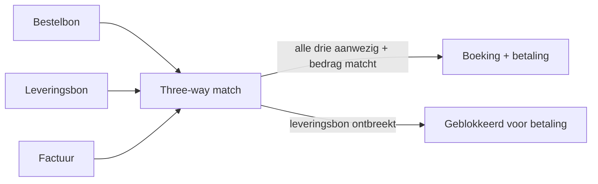

# Aankoopcyclus en interne controle 🤖

De aankoopcyclus is de keten die loopt van behoefte tot betaling van een leverancier. Interne controle in deze cyclus richt zich op het voorkomen van ongeoorloofde aankopen, fictieve leveranciers en dubbele betalingen. Drempelautorisaties, functiescheiding en de three-way match (bestelbon ↔ leveringsbon ↔ factuur) vormen de ruggengraat. Stagiairs komen dit tegen bij walkthroughs van procurement-processen en bij KMO-controle-opdrachten waar de aankoopstroom een hoog frauderisico draagt.

> [!summary] Korte inhoud
> Interne controle in de aankoopcyclus is het geheel van organisatorische en geautomatiseerde maatregelen die de stadia behoefte → bestelling → ontvangst → factuur → betaling beheersen, met als doel ongeautoriseerde of fictieve aankopen, dubbele betalingen en kickbacks te voorkomen….

> [!info] Behoort tot: [[cyclus-analyse-ic]]

Interne controle in de aankoopcyclus is het geheel van organisatorische en geautomatiseerde maatregelen die de stadia behoefte → bestelling → ontvangst → factuur → betaling beheersen, met als doel ongeautoriseerde of fictieve aankopen, dubbele betalingen en kickbacks te voorkomen of te detecteren.

## Bouwstenen

### Drempelautorisaties op bestellingen 🤖

Goedkeuringsbevoegdheid wordt verdeeld over rollen op basis van bedragsgrenzen, met dubbele handtekening boven een hogere drempel.

**Waarom?** Voorkomt onbevoegde uitgaven en bouwt een natuurlijke detectie-laag in voor ongebruikelijke aankoopvolumes.

**In de praktijk**: In een KMO ondertekent de inkoper tot een eerste drempel, de financieel directeur tot een tweede drempel en daarboven steeds twee personen samen met voorafgaande melding aan het bestuur.

Bij Yperse Werkplaats BV bestelt productie € 35.000 grondstoffen. Drempel € 25.000 wordt overschreden: dubbele handtekening door financieel directeur David Maes en algemeen directeur Pieter Vermeulen + voorafgaande melding aan de raad van bestuur. _(Yperse Werkplaats BV, David Maes, Pieter Vermeulen)_ 🤖

_Grondslag: Delegatie-procuratie-doctrine + ISA 315 Bijlage 6 (autorisatie-controles)_

### Three-way match 🤖

Bestelbon, leveringsbon en factuur worden tegen elkaar afgezet voor de factuur wordt geboekt en betaald.

**Waarom?** Detecteert facturen voor niet-bestelde of niet-geleverde goederen, prijsafwijkingen en btw-fouten — een centrale anti-fraude controle.

**In de praktijk**: In een ERP-systeem wordt de factuur pas vrijgegeven voor boeking wanneer de drie documenten matchen op aantal, prijs en totaal binnen vooraf gedefinieerde toleranties.

Bij Yperse Werkplaats BV haalt boekhouder Cindy Demeyer voor factuur Acerta de bestelbon (300 stuks × € 12) en de leveringsbon (300 stuks ontvangen) op. Factuur vermeldt 320 stuks × € 12 — afwijking → terug naar inkoper voor opheldering vóór boeking. _(Yperse Werkplaats BV, Cindy Demeyer)_ 🤖

_Grondslag: Audit-doctrine + ISA 315 Bijlage 5 (geautomatiseerde three-way match als toepassings-IC)_

### Functiescheiding bestellen-ontvangen-boeken-betalen 🤖

De rollen besteller, ontvanger, boeker en betaler worden door verschillende personen ingevuld.

**Waarom?** Wie tegelijk bestelt, ontvangt, boekt én betaalt kan fictieve facturen aanmaken en uitbetalen zonder dat iemand het ziet.

Inkoper Tom Lefèvre plaatst bestellingen; magazijnier Bart Vandenberghe tekent voor ontvangst; boekhouder Cindy Demeyer boekt de factuur; financieel directeur David Maes geeft de betaling vrij. Geen rol valt samen met een andere. _(Tom Lefèvre, Bart Vandenberghe, Cindy Demeyer, David Maes)_ 🤖

_Grondslag: [[functiescheiding]] §toepassing-aankoop_

### Leveranciersbestand-hygiëne 🤖

Aanmaken, wijzigen en deactiveren van leveranciers verloopt via een afzonderlijk goedkeuringsproces, los van het bestelproces.

**Waarom?** Fictieve leveranciers en gewijzigde bankrekeningnummers zijn klassieke fraude-vectoren; controle op masterdata sluit deze af.

**In de praktijk**: Wijzigingen van bankrekening van een leverancier worden altijd telefonisch geverifieerd via een eerder bekend nummer, nooit via een nummer uit de e-mail die de wijziging aanvraagt.

_Grondslag: Audit-doctrine — anti-business-email-compromise_

## Berekening

### Procesgang aankoopcyclus — stappen + IC-haakpunten

### 1. Behoeftebepaling en bestelaanvraag

De aanvrager identificeert wat nodig is en doet een formele bestelaanvraag via een standaardformulier of ERP-module.

**Waarom?** Zonder formele aanvraag riskeer je dubbele of niet-geautoriseerde aankopen.

**📥 Input**:
- Behoefte-trigger → **specificatie** _(bedrijfsproces)_

**📤 Output**:
- Bestelaanvraag → **leverancier, hoeveelheid, prijs, kostencentrum** _(ERP-record)_

**🛠️ Hoe**:

1. Aanvraag via standaardformulier of ERP-module.
2. Specificeer leverancier, hoeveelheid, prijs, kostencentrum.
3. Verstuur naar autoriserende verantwoordelijke.

**Grondslag**: Audit-cyclus-doctrine

### 2. Autorisatie volgens drempel

Goedkeuring door bevoegde persoon volgens delegatie-procuratie op basis van bedrag.

**Waarom?** Onbevoegd aankopen leidt tot ongeautoriseerde uitgaven of kickbacks bij bevriende leveranciers.

**📥 Input**:
- Bestelaanvraag → **bedrag** _(ERP-record)_

**📤 Output**:
- Goedgekeurde bestelbon → **handtekening(en)** _(ERP-record)_

**🛠️ Hoe**:

Toepassen drempelmatrix; boven hoogste drempel: dubbele handtekening + voorafgaande mededeling aan raad van bestuur.

**Grondslag**: [[functiescheiding]] §autorisaties

### 3. Bestelling versturen en ontvangst

Bestelling wordt verzonden naar leverancier; bij ontvangst worden goederen geteld en gecontroleerd tegen bestelbon.

**Waarom?** Zonder ontvangstcontrole riskeer je 'paying for nothing' — facturen betalen voor goederen die nooit zijn geleverd.

**📥 Input**:
- Bestelbon → **aantallen, specificaties** _(ERP-record)_

**📤 Output**:
- Leveringsbon → **ontvangstbevestiging** _(ERP-record)_

**🛠️ Hoe**:

1. Bestelbon in ERP creëert verwacht-record.
2. Magazijnier controleert leveringsbon tegen bestelbon (aantal, kwaliteit).
3. Tekent voor ontvangst; bestelbon wordt 'geleverd' gestempeld.
4. Bij afwijking: meld direct aan inkoper + boekhouding.

**Grondslag**: Cyclus-three-way-match-principe

### 4. Factuurcontrole en boeking

Boekhouder controleert factuur tegen bestelbon én leveringsbon (three-way match) vóór boeking.

**Waarom?** Three-way match detecteert facturen voor niet-bestelde of niet-geleverde goederen, prijsafwijkingen en btw-fouten.

**📥 Input**:
- Factuur + bestelbon + leveringsbon → **aantal, prijs, totaal, btw** _(match-input)_

**📤 Output**:
- Geboekte aankoopfactuur → **rekening, btw-code** _(boeking)_

**🛠️ Hoe**:

1. Boekhouder haalt bestelbon en leveringsbon op.
2. Vergelijkt aantal, prijs, totaal, btw.
3. Bij match: boek in ERP onder juiste kostencentrum.
4. Bij afwijking: terug naar inkoper.

**Grondslag**: Three-way-match-doctrine

### 5. Betaling

Betaling uitvoeren door iemand anders dan de boeker, met handtekening volgens drempels.

**Waarom?** Wie boekt én betaalt kan fictieve facturen aanmaken en uitbetalen — scheiding is essentieel.

**📥 Input**:
- Geboekte factuur → **vervaldatum, IBAN** _(betalingsorder)_

**📤 Output**:
- Bankuittreksel → **uitgevoerde betaling** _(banktransactie)_

**🛠️ Hoe**:

1. Financieel directeur selecteert facturen voor betaling.
2. Digitale ondertekening in bankplatform.
3. Bedragen boven hoogste drempel: dubbele digitale ondertekening.
4. Periodieke review bankuittreksels door zaakvoerder.

**Grondslag**: [[functiescheiding]] §betaling

## Valkuilen

> [!warning]- Spoedaankopen omzeilen vaak de hele procedure
> ⚠️ Spoedaankopen omzeilen vaak de hele procedure. Definieer expliciet uitzonderingsprotocol (welke bedragen, welke autorisatie achteraf, welke termijn voor inhaalcontrole). 🤖

> [!warning]- Persoonlijke aankopen via bedrijfsrekening zijn verduistering
> ⚠️ Persoonlijke aankopen via bedrijfsrekening zijn verduistering. Klassieke detectie: ongebruikelijke leveranciers, ongewone factuuradressen, recurrente kleine bedragen onder de eerste drempel. 🤖

> [!warning]- Een ERP dat three-way match niet hard afdwingt geeft schijnzekerheid
> ⚠️ Een ERP dat three-way match niet hard afdwingt geeft schijnzekerheid. Audit-stap: toets de tolerantie-parameters en het percentage handmatig vrijgegeven mismatches. 🤖

## Zie ook

- **Vereist kennis van**: [[functiescheiding]]
- **Vereist kennis van**: [[beheersactiviteiten]]

## Voorbeelden

### Three-way match betrapt fictieve leverancier bij Meubelzaak Mertens BV

_Personages: Meubelzaak Mertens BV, Pieter Vermeulen, Marleen De Cock_

Meubelzaak Mertens BV is een handels-BV met vijftien medewerkers. Aankoopverantwoordelijke Pieter Vermeulen kan in het ERP zowel leveranciers aanmaken als bestelbons goedkeuren onder € 5.000. Hij maakt een fictieve leverancier 'Houthandel Vermeulen' aan en boekt elke maand twee facturen van € 4.500 voor 'plaatmateriaal'. Boekhoudster Marleen De Cock detecteert het patroon pas wanneer ze een three-way-match-rapport instelt en de afwezige leveringsbons opvallen.

1. IC-zwakte: Pieter combineert masterdata-beheer leveranciers + bestelautorisatie onder de drempel — bouwsteen 'Functiescheiding bestellen-ontvangen-boeken-betalen' en 'Leveranciersbestand-hygiëne' beide doorbroken.
2. Detectie: Marleen voert een query 'facturen geboekt zonder gekoppelde leveringsbon' over Q1 — 6 facturen × € 4.500 = € 27.000 zonder enige fysieke ontvangst.
3. Remediëring: leveranciersaanmaak wordt verplaatst naar de zaakvoerder; de drempel van € 5.000 wordt verlaagd naar € 1.500; het ERP wordt zo geparametreerd dat boeking pas mogelijk is na koppeling aan een leveringsbon.
4. Audit-implicatie: dit is fraudetypologie 'billing schemes' (oneigenlijke toe-eigening van activa, ACFE). Aangifte cel financiële informatie + ontslag om dringende reden.
#### Fictieve aankoopboeking die de three-way match zou hebben tegengehouden
| Rekening | Debet | Credit |
|---|---:|---:|
| 604 — Aankoop handelsgoederen | 3719 |  |
| 411 — Terug te vorderen btw | 781 |  |
| 440 — Leveranciers _(Houthandel Vermeulen — geen leveringsbon)_ |  | 4500 |

_Three-way match — controlepoort die de fraude zou blokkeren_

🤖

