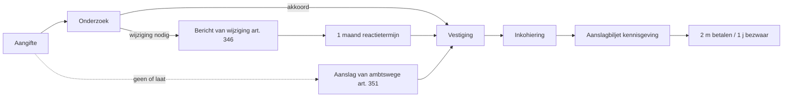

# Aanslagcyclus

_Procedure_

📅 Gebeurtenis · Anchors: `2.5.II` · Wave: `fase2-fiscale-beginselen-2026-05-28`

> [!info] 📝 **Concept** — content gevuld door cluster-extract; niet door mens-verify gegaan.

**Synoniemen**: aanslagprocedure · fiscale cyclus per aanslagjaar

## Definitie

🔗 De aanslagcyclus is de gestructureerde reeks stappen die de fiscus doorloopt om voor een gegeven aanslagjaar de belasting te vestigen, in te kohieren en aan de belastingplichtige ter kennis te brengen. De cyclus start bij de aangifte door de belastingplichtige (of het ontbreken ervan) en eindigt bij de uitvoerbare titel die de basis vormt voor invordering en eventueel bezwaar.

<small>📚 WIB92 — art. 305 — _wettekst_ · WIB92 — art. 351 — _wettekst_ · cluster-extract-agent (opus-4.7-1M) — _ai_model_ — (2026-05-28)</small>

## Substantie

🔗 Voor de stagiair is de aanslagcyclus de 'kalender' van fiscaal recht: hij vertelt wat wanneer gebeurt, wat de fiscus moet doen, wat de belastingplichtige kan/moet doen, en welke termijnen lopen. Inkohiering is het sleutelmoment — daarvoor bestaat de schuld nog niet als opeisbare titel, daarna wel. De berichten van wijziging (art. 346) en aanslag van ambtswege (art. 351) zijn de twee centrale 'communicatie-momenten' waarop een cliënt dringend juridisch advies nodig heeft.

<small>📚 WIB92 — art. 346 — _wettekst_ · WIB92 — art. 351 — _wettekst_ · cluster-extract-agent (opus-4.7-1M) — _ai_model_ — (2026-05-28)</small>

## Gebruikscontext

**Status**: `in-voege` · basis: WIB92 Titel VII (vestiging en inning van de belastingen)

## Bouwstenen

### 👣 Stap 1 — Aangifte  
_`stap`_

📖 De belastingplichtige dient binnen de wettelijke termijn de aangifte in (art. 305 WIB92 e.v.). Bij niet- of laattijdige aangifte: de fiscus kan ambtshalve aanslagen (art. 351).

<small>📚 WIB92 — art. 305 — _wettekst_</small>

### 👣 Stap 2 — Onderzoek  
_`stap`_

📖 De fiscus controleert de aangifte op interne coherentie en vergelijkt met externe informatie (loonopgaven 281-bestanden, bankgegevens via CAP, gegevensuitwisseling internationale verdragen). Op basis daarvan kan onderzoek volgen: vraag om inlichtingen (art. 316 WIB92), boekenonderzoek ter plaatse (art. 315 WIB92 voor btw, art. 322 voor PB/VenB), vraag aan derden (art. 322).

<small>📚 WIB92 — art. 315 — _wettekst_ · WIB92 — art. 316 — _wettekst_ · WIB92 — art. 322 — _wettekst_</small>

### 👣 Stap 3 — Bericht van wijziging (indien correctie)  
_`stap`_

📖 Wenst de fiscus de aangifte te corrigeren, dan stuurt hij eerst een bericht van wijziging (art. 346 WIB92) waarin hij de voorgenomen aanpassingen motiveert. De belastingplichtige heeft 1 maand (verlengbaar bij gemotiveerd verzoek) om opmerkingen te formuleren. Slechts na dit overleg kan de fiscus de gewijzigde aanslag vestigen. Het bericht van wijziging is een waarborg-mechanisme: zonder bericht is een gewijzigde aanslag ongeldig (vormvereiste, vernietigbaar).

<small>📚 WIB92 — art. 346 — _wettekst_</small>

### 👣 Stap 4 — Vestiging van de aanslag  
_`stap`_

📖 De ambtenaar vestigt de aanslag — dit is de juridische beslissing die het belastingbedrag bepaalt. Voor PB en VenB binnen de aanslagtermijn van art. 353 WIB92 (3, 5 of 10 jaar). Vestiging gebeurt door opname van de aanslag in een 'kohier' (lijst van aanslagen).

<small>📚 WIB92 — art. 353 — _wettekst_ · WIB92 — art. 354 — _wettekst_</small>

### 👣 Stap 5 — Inkohiering  
_`stap`_

📖 Inkohiering = opname van de aanslag in het kohier door de bevoegde ambtenaar, met datum. Dit is het juridisch sleutelmoment: vanaf de inkohiering bestaat een uitvoerbare titel — de fiscus kan invorderen. Tevens beginnen vanaf hier de termijnen voor betaling (2 maanden) en voor bezwaar (binnen 1 jaar volgens art. 371 WIB92). Het kohier moet uitvoerbaar verklaard zijn door de bevoegde ambtenaar voor het rechtskracht heeft.

<small>📚 WIB92 — art. 304 — _wettekst_ · WIB92 — art. 371 — _wettekst_</small>

### 👣 Stap 6 — Kennisgeving (aanslagbiljet)  
_`stap`_

📖 Het aanslagbiljet wordt naar de belastingplichtige verzonden (papier of MyMinFin-eBox). Het vermeldt het ingekohierd bedrag, de wettelijke vermelding 'binnen 2 maanden betalen', informatie over bezwaarrecht en termijnen. De datum van verzending (poststempel of elektronische ontvangstbevestiging) start de bezwaartermijn van 1 jaar (art. 371 WIB92).

<small>📚 WIB92 — art. 371 — _wettekst_</small>

### 💡 Gewone aanslag  
_`begrip`_

📖 De gewone aanslag vloeit voort uit een normale aangifte zonder geschil. De fiscus aanvaardt de aangifte en vestigt de aanslag binnen de gewone termijn (art. 353 WIB92, in beginsel uiterlijk 30 juni van het jaar na het aanslagjaar; verlengd tot 31 december indien laattijdige aangifte vóór verzending aanslag van ambtswege).

<small>📚 WIB92 — art. 353 — _wettekst_</small>

### 💡 Aanslag van ambtswege  
_`begrip`_

📖 De fiscus raamt zelf de belastbare grondslag wanneer de belastingplichtige niet of laattijdig aangeeft, niet antwoordt op vragen om inlichtingen, of de boekhouding niet voorlegt (art. 351 WIB92). Belangrijkste gevolg: omkering van de bewijslast — de belastingplichtige moet bewijzen dat de raming overdreven is. Voor de accountant: voorkom ambtshalve aanslagen door tijdig aangifte en correct antwoord op vragen om inlichtingen.

<small>📚 WIB92 — art. 351 — _wettekst_</small>

### 💡 Supplementaire aanslag  
_`begrip`_

📖 Een supplementaire (aanvullende) aanslag wordt gevestigd wanneer na een eerste aanslag bijkomende belastbare inkomsten of een fout aan het licht komen. Mogelijk binnen de aanslagtermijn (3 jaar, of 5 jaar bij niet-aangifte, of 10 jaar bij fraude — art. 354 WIB92). Buiten deze termijn enkel in specifieke gevallen (art. 358 WIB92: rechtspraak HvJ EU, ontdoken aanslag, ...).

<small>📚 WIB92 — art. 354 — _wettekst_ · WIB92 — art. 358 — _wettekst_</small>

## Voorbeelden

### 💡 Aanslagcyclus — tijdslijn AJ 2026 🔗

_Aurelia Holding NV — boekjaar = kalenderjaar 2025. Aangifte VenB voor aanslagjaar 2026._

**Weergave** `tijdslijn`:

```json
{
  "stappen": [
    "31-12-2025 — einde boekjaar Aurelia",
    "1-1-2026 — start aanslagjaar 2026, begin aanslagtermijn (3 jaar tot 31-12-2028)",
    "Voorjaar 2026 — algemene vergadering keurt jaarrekening goed",
    "Binnen 6 m na einde boekjaar — aangifte VenB via Biztax (uiterlijk 30-09-2026 in deze case)",
    "Najaar 2026 — eventuele vraag om inlichtingen of bericht van wijziging (art. 346)",
    "Vóór 30-06-2027 — vestiging gewone aanslag binnen 'gewone' deadline art. 353",
    "Verzending aanslagbiljet — vanaf datum verzending: 2 m betalen + 1 j bezwaartermijn",
    "Tot 31-12-2028 — fiscus kan binnen aanslagtermijn nog supplementaire aanslagen vestigen (5 j bij niet-aangifte; 10 j bij fraude)"
  ]
}
```



<small>📚 WIB92 — art. 353 — _wettekst_ · cluster-extract-agent (opus-4.7-1M) — _ai_model_ — (2026-05-28)</small>

## Valkuilen

### ⚠️ Aanslagbiljet = uitvoerbare titel

**Verkeerde assumptie**: Studenten verwarren het aanslagbiljet met de uitvoerbare titel.

**Kernpunt**: De uitvoerbare titel ontstaat door inkohiering (opname in het kohier door de bevoegde ambtenaar). Het aanslagbiljet is enkel de kennisgeving aan de belastingplichtige. Een aanslagbiljet zonder voorafgaande geldige inkohiering is nietig.

<small>📚 WIB92 — art. 304 — _wettekst_ · cluster-extract-agent (opus-4.7-1M) — _ai_model_ — (2026-05-28)</small>

### ⚠️ Bericht van wijziging negeren

**Verkeerde assumptie**: Een bericht van wijziging is enkel informatief — geen reactie nodig.

**Kernpunt**: Niet reageren binnen de 1 maand (art. 346) verzwakt de positie van de belastingplichtige aanzienlijk: de fiscus mag de voorgestelde correctie doorvoeren en de belastingplichtige moet later in bezwaar zelf bewijzen dat de correctie onjuist is. Altijd reageren — gemotiveerd, met cijfers en stukken.

<small>📚 WIB92 — art. 346 — _wettekst_ · cluster-extract-agent (opus-4.7-1M) — _ai_model_ — (2026-05-28)</small>

## Verder lezen (scope-out)

- → Termijnen voor vestiging → [[aanslagtermijnen]] _(moet-verwijzen)_
- → Invordering na inkohiering → [[invorderingsprocedure]] _(moet-verwijzen)_
- → Bezwaar tegen aanslag → [[bezwaarprocedure]] _(moet-verwijzen)_

## Relaties

### `valt_onder`
- [[fiscale-procedure]]
### `triggert`
- [[invorderingsprocedure]]
