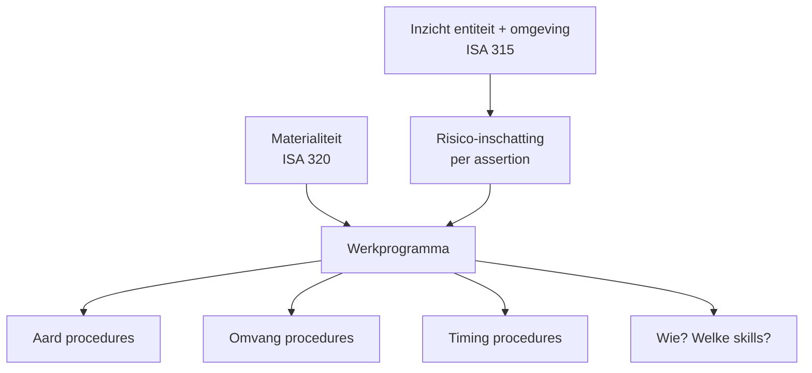

# Audit-planning

_Procedure_

🏛️ Kader · Anchors: `1.6.II` · `1.6.II.A` · `1.6.II.B` · `1.6.II.C` · `1.6.II.D` · Wave: `skeleton-controle-beroep-2026-05-28`

> [!info] 📝 **Concept** — content gevuld door cluster-extract; niet door mens-verify gegaan.

**Synoniemen**: controleplanning · engagement planning · planningsfase · audit planning — **Vertalingen**: fr: planification de l'audit · en: audit planning

## Definitie

📖 Audit-planning is fase 2 van de controleopdracht: het vaststellen van (a) een algehele controle-aanpak (overall audit strategy) — reikwijdte, timing, richting van de controle en toewijzing van middelen — en (b) een gedetailleerd controleprogramma (audit plan) dat de risico-inschattings- en verdere controlewerkzaamheden beschrijft. ISA 300 par. 7-9 verbindt deze twee niveaus. De planning is geen losse fase maar een iteratief proces dat kort na afsluiting van de vorige controle begint en doorloopt tot afronding van de lopende opdracht; nieuwe bevindingen in fase 3 kunnen de planning doen herzien.

<small>📚 ISA 300 — par. 7-9 + A3 — _norm_</small>

## Substantie

🔗 Planning vertaalt drie inputs naar werk: (1) **wat moet er gecontroleerd worden** (de financiële overzichten en hun beweringen), (2) **waar zit het risico** (op basis van inzicht in entiteit + omgeving + interne beheersing), (3) **hoe groot moet een fout zijn om relevant te zijn** (materialiteit). De output is een werkprogramma dat per audit-bewering (assertion) per materiële post specificeert: welke procedures, met welke omvang, op welk moment, door wie. Hoe hoger het ingeschatte risico op afwijking van materieel belang, hoe meer overtuigend het bewijs moet zijn — dus hoe meer of zwaardere procedures.

<small>📚 ISA 300 — par. 9 — _norm_ · ISA 330 — par. 6-7 inspelen op risico's — _norm_ · cluster-extract-agent (opus-4.7-1M) — _ai_model_ — (2026-05-28)</small>

## Rationale

🔗 Waarom een verplichte planningsfase? (1) **Efficiëntie**: 100%-controle is onmogelijk; planning richt de middelen op risico-volle zones. (2) **Effectiviteit**: zonder risicomodel zou de auditor blind procedures uitvoeren — planning zorgt dat de juiste procedures op de juiste posten landen. (3) **Bewijslast**: het werkprogramma is achteraf het document dat aantoont *waarom* deze procedures volstaan voor dit oordeel. Wie geen geargumenteerde planning heeft, kan zijn oordeel niet verdedigen. (4) **Onafhankelijkheid van uitkomst**: door materialiteit en risico-inschatting vooraf vast te leggen, voorkomt de auditor dat hij achteraf alleen ‘wat fout liep’ benadrukt of net wegfiltert.

<small>📚 ISA 300 — par. 2 + A1 — _norm_ · cluster-extract-agent (opus-4.7-1M) — _ai_model_ — (2026-05-28)</small>

## Gebruikscontext

**Status**: `in-voege` · basis: ISA 300 · ISA 315 (herzien 2019, ingangsdatum 15 december 2021) · ISA 320 · ISA 330

ISA 315 herziening 2019 vervangt voormalige versie en versterkt de focus op IT-controle-omgeving + spreadsheet-risico's en op proportionaliteit ('scalability') voor kleinere entiteiten.

**📋 Voorwaarden**
- 📖 Voorbereidende opdrachtactiviteiten (ISA 300 par. 6) moeten klaar zijn vóór planning: (a) cliëntaanvaarding/-continuering (ISA 220), (b) onafhankelijkheids- en ethiek-evaluatie, (c) overeenstemming over voorwaarden controleopdracht (ISA 210, opdrachtbrief).

**▶️ Trigger start**
- 📖 Planning start bij doorlopende controles kort na afronding van de vorige cyclus (debriefing-memo, follow-up open punten). Bij initiële controles (ISA 510) start ze na cliëntaanvaarding en kan ze uitgebreider zijn door gebrek aan eerdere ervaring met de entiteit.

## Sub-concepten

### 📦 Kennis van de entiteit en haar omgeving (ISA 315)  
_`procedure` (subconcept)_

#### Definitie

📖 Verwerven van inzicht in vijf dimensies van de entiteit: (1) sector, regelgeving en externe factoren (cyclus, fiscaal regime, concurrentie); (2) aard van de entiteit (bedrijfsmodel, eigendomsstructuur, governance); (3) IT-omgeving en informatiesysteem (welke systemen genereren financiële data, welke spreadsheets zijn kritisch); (4) toegepast verslaggevingsstelsel (BE-GAAP, IFRS-EU); (5) intern beheersingssysteem inclusief de COSO-componenten — vooral het entity-level risico-inschattingsproces, monitoring-activiteiten en beheersmaatregelen rond financiële verslaggeving. Inzicht is de basis voor risico-inschatting per assertion: zonder begrip van hoe de entiteit werkt, kan de auditor geen geargumenteerd risico-oordeel vormen.

<small>📚 ISA 315 (herzien 2019) — par. 19-27 — _norm_</small>

### 📦 Auditrisicomodel  
_`kader` (subconcept)_

#### Definitie

📖 Audit-risico = het risico dat de auditor een onjuist oordeel geeft over financiële overzichten die een afwijking van materieel belang bevatten. Conceptueel: Audit-risico = Risico op afwijking van materieel belang × Detectierisico. Het risico op afwijking van materieel belang (RMM) is zelf het product van inherent risico (kans dat een bewering een materiële fout bevat zonder rekening te houden met interne beheersing) en controle-risico (kans dat interne beheersing een materiële fout niet voorkomt of detecteert). Detectierisico is wat de auditor zelf stuurt via aard, omvang en timing van zijn procedures: hoog RMM → laag detectierisico nodig → meer/zwaardere procedures.

<small>📚 ISA 200 — Definities — audit-risico — _norm_ · ISA 330 — par. A10-A11 timing + aard — _norm_</small>

### 📦 Materialiteit  
_`kader` (subconcept)_

#### Definitie

📖 Materialiteit is de drempel waarboven een fout of weglating in de jaarrekening de beslissingen van een redelijke gebruiker kan beïnvloeden. Drie operationele niveaus:

- **Overall materialiteit (OM)**: één bedrag voor de jaarrekening als geheel. Klassieke benchmarks (ISA 320 A8): ca. 5% van winst vóór belasting uit voortgezette activiteiten voor profit-georiënteerde entiteiten; 1% van totale opbrengsten of totale lasten voor non-profit; 0,5-2% van totaal activa of eigen vermogen voor bepaalde sectoren. Percentages zijn startpunten, niet regels — auditor past professionele oordeelsvorming toe.
- **Performance materialiteit (PM)**: lager dan OM, biedt buffer voor opeenstapeling van niet-geïdentificeerde fouten. Vaak 50-75% van OM.
- **Specifieke materialiteit**: aparte (lagere) drempel voor gevoelige posten (bv. transacties met verbonden partijen, bestuurdersbezoldigingen, schendingen van convenanten).

Kwalitatieve materialiteit: ook kleine bedragen kunnen materieel zijn als ze (a) trend doen kantelen, (b) wettelijke drempel overschrijden (bv. covenant), (c) regelmatige fraude-indicaties zijn.

<small>📚 ISA 320 — par. A8 + A9 — _norm_ · ITAA-norm-kmo-controlenorm — § 3.1.3 Materialiteit — _norm_</small>

### 📦 Audit-strategie en werkprogramma  
_`instrument` (subconcept)_

#### Definitie

📖 **Algehele controle-aanpak** (audit strategy) — hoog-niveau-document dat reikwijdte, timing en richting vastlegt: welke locaties/segmenten, welk rapportagestelsel, welk tijdpad, welk team met welke skills, welke kantoor-niveau-resources (deskundigen, IT-audit, fiscale specialisten). **Werkprogramma** (audit plan) — gedetailleerde uitwerking: per cyclus (verkopen-debiteuren, aankopen-crediteuren, voorraad, ...) of per post (vaste activa, EV, voorzieningen, ...) staan de geplande procedures uitgeschreven met aard, omvang, timing en verantwoordelijke. Iteratief: bevindingen in fase 3 kunnen het werkprogramma doen herzien.

<small>📚 ISA 300 — par. 7-9 + A14 — _norm_</small>

## Bouwstenen

### 👣 Verplichte teambespreking fraude-risico  
_`stap`_

📖 ISA 240 vereist een bespreking tussen kernleden van het opdrachtteam vóór het bewijswerk over hoe en waar fraude in deze entiteit zou kunnen voorkomen. Doel: brainstorm over verdachte transactiestromen, gevoeligheden in management-incentives (bonussysteem, covenants), houdbaarheid van schattingen, ongebruikelijke journaalboekingen. De bespreking is geen formaliteit — het is het moment waarop de meest ervaren leden hun professioneel-kritische instelling overbrengen op het junior team en gezamenlijk een fraude-risico-inventaris opbouwen.

<small>📚 ISA 240 — par. 16 + Bijlage 3 indicatoren — _norm_ · ISA 300 — par. 5 betrokkenheid kernleden — _norm_</small>

### 🧭 Schaalbaarheid voor KMO  
_`vuistregel`_

**Substantie**: 📖 Voor kleinere entiteiten kan een planning kort en pragmatisch zijn (ISA 300 A13): vaak één opdrachtpartner met één junior, een korte memo bij de afronding van de voorgaande controle dat tijdens de lopende periode bijgewerkt wordt. Dit betekent niet ‘zonder planning’, maar ‘planning op maat’. De kern (risico-inschatting per assertion, materialiteit, gedocumenteerde aanpak) blijft bestaan. De ITAA-KMO-controlenorm § 3.1.3 herhaalt het ISA 320-materialiteitsprincipe maar met evenredigheidsbeginsel (§ 2.1.1).

<small>📚 ISA 300 — par. A13 — _norm_ · ITAA-norm-kmo-controlenorm — § 2.1.1 + § 3.1.3 — _norm_</small>

### ⚙️ Test of controls vs substantive procedures — keuze in planning  
_`mechanisme`_

**Substantie**: 📖 Bij planning kiest de auditor per cyclus zijn aanpak: (1) **steunen op interne beheersing** — als IB efficiënt is en hij plant test of controls, kan hij substantive procedures beperken (kleinere steekproef, cijferanalyses). (2) **substantief-only-approach** — als IB zwak is of testen niet efficiënt, gaat hij volledig substantief (volledige steekproef-test, externe bevestigingen). De keuze hangt af van: aard van de cyclus (routinematig vs schattingen), kosten van controls-tests vs substantive procedures, eerdere bevindingen.

<small>📚 ISA 330 — par. A10 + par. 8 — _norm_</small>

## Valkuilen

### ⚠️ Planning = standaard checklist invullen

**Verkeerde assumptie**: Een planning is een vinklijst die ieder jaar identiek wordt ingevuld.

**Kernpunt**: Een planning die niet entiteit-specifiek is, levert geen risico-georiënteerde controle op. ISA 315 herzien 2019 verplicht specifiek inzicht in interne beheersing, IT-omgeving en risico-inschattingsproces van *deze* entiteit. Een copy-paste van vorig jaar mist veranderingen in business, governance of IT-systemen.

<small>📚 ISA 315 (herzien 2019) — par. 19-27 (entiteit-specifiek inzicht) — _norm_</small>

### ⚠️ Materialiteit = 5% van winst — altijd

**Verkeerde assumptie**: ISA 320 geeft een vaste regel: 5% van pre-tax-winst is altijd materialiteit.

**Kernpunt**: ISA 320 A8 noemt 5% pre-tax-winst als startpunt voor profit-entiteiten, maar materialiteit vergt professionele oordeelsvorming. Bij volatiele winst kies je een gemiddelde of een andere benchmark (totaal opbrengsten, totaal activa). Bij eigenaar-bestuurde KMO's met nominale winsten (ISA 320 A9) is winst-benchmark vaak ongeschikt — kies dan omzet of EV.

<small>📚 ISA 320 — par. A8-A9 — _norm_</small>

### ⚠️ Risico = kans op fout — vergeten van impact

**Verkeerde assumptie**: Risico-inschatting gaat alleen om de kans dat iets fout zit.

**Kernpunt**: Risico is *kans × impact*. Een onwaarschijnlijke fout in een grote post (bv. waardering goodwill) is risicovol; een waarschijnlijke fout in een marginale post niet. ISA 315 herzien 2019 vereist beide dimensies bij significant risk-classificatie.

<small>📚 ISA 315 (herzien 2019) — par. 32 significant risks — _norm_</small>

## Syntheses

### 🧩 Synthese  
_`tijdslijn`_

Typische planningsactiviteiten in chronologische volgorde (voor jaarafsluiting 31/12).

## Accountant-perspectieven

### De accountant als planner van de controle

#### 🔍 Auditor

##### 👣 Werkdocumenten die uit planning voortkomen  
_`stap`_

📖 Verplicht te archiveren (ISA 230): (1) algehele controle-aanpak memo, (2) detail-werkprogramma per cyclus, (3) materialiteits-bepaling (overall + performance + specific) met onderbouwing, (4) risico-inschattings-werkdocument per assertion + significant-risk-identificatie, (5) walk-through-notes per significante cyclus, (6) IT-omgevings-evaluatie, (7) memo team-bespreking fraude, (8) lijst geselecteerde controle-procedures.

<small>📚 ISA 230 — Vereisten par. 7-11 — _norm_ · ISA 315 (herzien 2019) — documentatie-eisen par. 38 — _norm_</small>

## Verder lezen (scope-out)

- → Cyclus-context (fase 2 in 4-fase-flow) → [[controleopdracht]] _(moet-verwijzen)_
- → Bewijsverzameling (planning stuurt bewijswerk) → [[audit-bewijs]] _(moet-verwijzen)_
- → Start: opdrachtbrief → [[opdrachtaanvaarding-en-opdrachtbrief]] _(moet-verwijzen)_
- ↪ Verbonden-partijen-risico-aspect → ⏳ verbonden-partijen _(mag-verwijzen)_
- → Fraude-risico-inschatting → ⏳ fraude _(moet-verwijzen)_
- → Interne-controle-evaluatie als input controle-risico → [[interne-controle]] _(moet-verwijzen)_
- → COSO-componenten als lens voor IC-begrip → [[coso-framework]] _(moet-verwijzen)_
- ↪ IC-evaluatie-methodes (intern uitvoeren) → [[evaluatie-interne-controle]] _(mag-verwijzen)_

## Relaties

### `valt_onder`
- [[controleopdracht]]
### `triggert`
- [[audit-bewijs]]
### `beinvloed_door`
- [[interne-controle]]
- ⏳ fraude
- [[coso-framework]]
