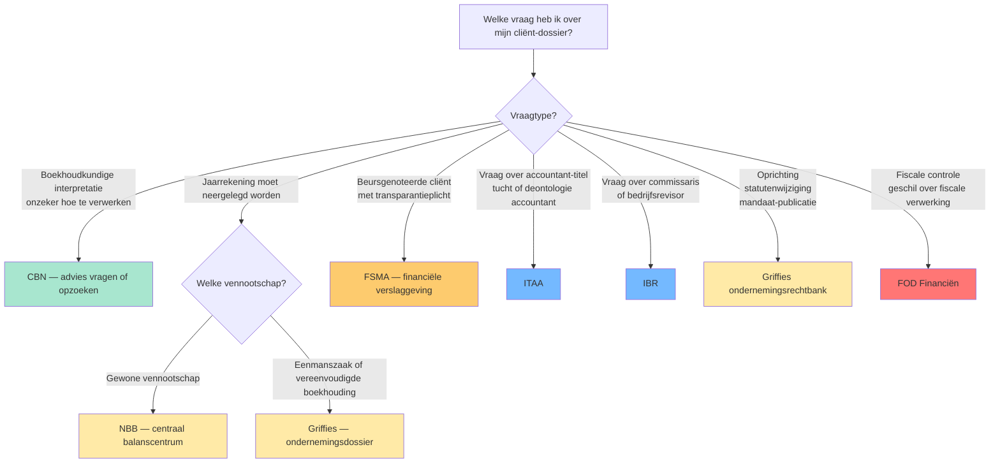

# Wie controleert wat? — Het autoriteiten-landschap van het Belgisch boekhoudrecht 🤖

Het Belgische boekhoudrecht wordt niet door één instantie bewaakt. Zeven autoriteiten verdelen de rollen: de CBN adviseert over interpretatie, de NBB ontvangt jaarrekeningen, de FSMA controleert beursgenoteerde uitgevers, het ITAA reglementeert accountants, het IBR reglementeert revisoren (commissarissen), de griffies van de ondernemingsrechtbank ontvangen ondernemingsdossiers, en de FOD Financiën controleert fiscale dimensies. Bij elk dossier is de stagiair-vraag: 'naar wie moet ik met dit probleem?' Dit synthese-record geeft de keuze-as per situatie.

## Vergelijkingstabel

| Autoriteit | Wat doet ze? | Wettelijke basis | Toepasselijk op | Wanneer raadpleeg ik haar? |
|---|---|---|---|---|
| [[commissie-boekhoudkundige-normen\|CBN]] | Adviseert over interpretatie van boekhoudwetgeving | Wet 17 juli 1975 | Alle ondernemingen | Bij twijfel over boekhoudkundige verwerking &mdash; raadpleeg CBN-advies (niet bindend, maar gezaghebbend) |
| [[nationale-bank-belgie\|NBB]] | Ontvangt en publiceert neerleggingen jaarrekeningen + voert prudentieel toezicht (banken) | KB-WVV art. 3:104; Wet 22 februari 1998 | Alle vennootschappen (neerlegging); banken/verzekeraars (prudentieel) | Bij neerlegging jaarrekening (binnen 30 dagen na AV); banken voor prudentiële verslagstaten |
| [[fsma\|FSMA]] | Toezicht op gedrag op financiële markten + transparantie uitgevers | Wet 2 augustus 2002 | Beursgenoteerde uitgevers + verzekeringstussenpersonen + pensioeninstellingen | Bij beursgenoteerde cliënt &mdash; transparantieverplichtingen, prospectus, koersgevoelige info |
| [[itaa\|ITAA]] | Reglementeert accountants en belastingadviseurs (toegang, tucht, normen) | Wet 17 maart 2019 | Accountants + gecertificeerde accountants + fiscalisten + belastingadviseurs | Voor stage, bekwaamheidsexamen, tuchtklacht, deontologische vraag accountant |
| [[ibr\|IBR]] | Reglementeert bedrijfsrevisoren (commissarissen) | Wet 7 december 2016 | Bedrijfsrevisoren | Bij commissarisopdracht of audit door revisor &mdash; nooit door ITAA-accountant |
| [[griffies-ondernemingsrechtbank\|Griffies ondernemingsrechtbank]] | Ontvangt ondernemingsdossier (oprichting, statuten, mandaten) | WER Boek III; WVV | Alle ondernemingen | Bij oprichting, statutenwijziging, neerlegging bestuursverslag/mandaten |
| [[fod-financien-boekhoudrecht\|FOD Financiën]] | Fiscale controle &mdash; boekhouding als basis voor aangifte | WIB 92; BTW-Wetboek | Alle belastingplichtigen | Bij fiscale controle of geschil over fiscale verwerking van boekhoudkundige feiten |

## Beslisboom

## Kerninzichten

- ITAA en IBR zijn niet uitwisselbaar. ITAA reglementeert accountants (kunnen contractuele KMO-controle uitvoeren); IBR reglementeert bedrijfsrevisoren (kunnen wettelijke commissarisopdracht uitvoeren). Examenvalkuil: 'mag een ITAA-accountant commissaris zijn bij Rotex Roeselare NV (groot)?' &mdash; antwoord nee, dat is voorbehouden aan IBR-revisor. ⚖️
  - _Rationale_: Wet 17 maart 2019 (ITAA) versus Wet 7 december 2016 (IBR) maken het onderscheid wettelijk.
- NBB en FSMA delen het 'Twin Peaks'-toezichtmodel maar met verschillende dimensies. NBB = prudentieel/macroprudentieel (gezondheid van financiële instellingen). FSMA = gedrag/markttransparantie (eerlijke informatie aan beleggers). Bij Belfius BV (bank): NBB controleert kapitaaltoereikendheid; FSMA controleert hoe Belfius haar producten in de markt zet. 🤖
  - _Rationale_: Wet 2 juli 2010 (Twin Peaks-hervorming) verdeelt de rollen tussen NBB en FSMA.
- Neerlegging gebeurt via twee kanalen: jaarrekeningen via NBB (centraal balanscentrum); ondernemingsdossier (oprichting, statuten, benoemingen) via de griffies van de ondernemingsrechtbank. Verwar deze niet &mdash; dezelfde Meubelzaak Mertens BV legt elk jaar bij NBB neer maar ook bij de griffie bij statutenwijziging. ⚖️
  - _Rationale_: KB-WVV art. 3:104 voor jaarrekening; WER Boek III voor ondernemingsdossier.
- CBN-adviezen zijn niet bindend maar gezaghebbend. Rechters en fiscus volgen ze in praktijk. Bij examenvraag 'wat is de boekhoudkundige verwerking van X?' is een CBN-advies vaak de beste bron &mdash; ook als de WVV/KB-WVV-tekst zwijgt of dubbelzinnig is. 🤖
  - _Rationale_: Vakdoctrine: CBN-adviezen worden in rechtsleer en CBN-praktijk consistent als interpretatie-gezag erkend.
- Bij een beursgenoteerde groep zijn doorgaans drie autoriteiten tegelijk betrokken: FSMA (transparantie), NBB (neerlegging jaarrekening + prudentieel indien financiële instelling), IBR-revisor (commissaris). Voor een gewone KMO is meestal alleen NBB + (eventueel) ITAA-accountant relevant. 🤖
  - _Rationale_: Schaalcomplexiteit van PIE (public-interest-entity) versus niet-PIE.

## Verwante competenties

- [[competenties/kiezen-juiste-autoriteit-bij-dossier-vraag]]
- [[competenties/onderscheiden-accountant-revisor]]
- [[competenties/navigeren-neerleggingsplichten]]

## Bronnen

[^1]: `anchor-1.2.II`
[^2]: `WER__art_XV_62`
[^3]: `WER__art_XV_63`
[^4]: `KB-WVV-2019__art_3_104`
