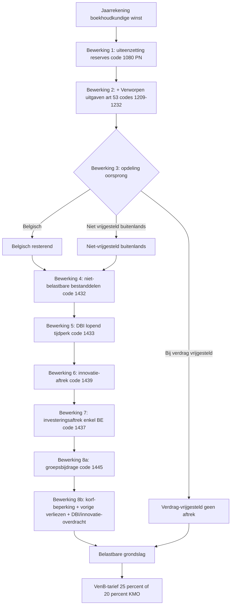

# Belastbare grondslag vennootschapsbelasting

_Procedure_

📋 Regeling · Anchors: `2.3.II` · `2.3.III` · `2.3.taak.1` · `2.3.taak.2` · Wave: `skeleton-pb-venb-2026-05-28`

> [!info] 📝 **Concept** — content gevuld door cluster-extract; niet door mens-verify gegaan.

**Synoniemen**: 8 bewerkingen VenB · base imposable ISoc · fiscale grondslag VenB — **Vertalingen**: fr: base imposable à l'impôt des sociétés

## Definitie

📖 De belastbare grondslag vennootschapsbelasting is de uitkomst van een wettelijke cascade van 8 bewerkingen (art. 206/1 WIB92 + art. 74-79 KB/WIB92) die het boekhoudkundig resultaat van de vennootschap (winst-na-belastingen uit de jaarrekening) transformeert tot het effectief belastbaar bedrag waarop het VenB-tarief wordt toegepast. De 8 bewerkingen zijn: (1) uiteenzetting van de winst — categorisering naar bestemming; (2) bijtelling verworpen uitgaven; (3) opdeling naar oorsprong (Belgisch / verdrag-vrijgesteld / niet-vrijgesteld-buitenlands); (4) aftrek niet-belastbare bestanddelen; (5) DBI-aftrek; (6) innovatie-aftrek; (7) investeringsaftrek; (8) aftrek vorige verliezen + groepsbijdrage (met korf-beperking).

<small>📚 WIB92 — art. 183 — _wettekst_ · WIB92 — art. 206/1 — _wettekst_ · WIB92 — art. 207 — _wettekst_ · KB/WIB92 — art. 74-79 — _kb_</small>

## Substantie

📖 De cascade is volgordelijk en niet-omkeerbaar — elke bewerking voedt de volgende. Bewerkingen 1-3 zijn 'opbouwend' (winst categoriseren + bijtellen verworpen uitgaven + opdelen naar oorsprong); bewerkingen 4-8 zijn 'aftrekkend' (DBI, innovatie, investering, verliezen). Een centraal element is de korf-beperking (art. 207 lid 5 WIB92): bepaalde aftrekken — DBI van vorige tijdperken, innovatie-overdrachten, vorige verliezen — zijn gezamenlijk beperkt tot een korf van 1.000.000 EUR + 70 % van het overschot van het Belgisch resterend resultaat boven 1.000.000 EUR. Hierdoor kunnen grote vennootschappen niet structureel 0 EUR VenB betalen door geaccumuleerde aftrekken. Bovendien geldt dat ALLE aftrekken (bewerkingen 4-8) ENKEL gelden op het Belgisch resterend resultaat en het niet-verdrag-vrijgesteld-buitenlands deel; niet op de bij verdrag vrijgestelde winst (die is automatisch vrijgesteld zonder aftrek). Aansluitend op de aangifte: elk van de 8 bewerkingen vertaalt zich in welbepaalde aangifte-codes (1432-1445 op formulier 275.1).

<small>📚 WIB92 — art. 207 lid 5 — _wettekst_ · aangifte-VenB-2025-uiteenzetting-winst — E. Aftrekken vaste volgorde + tabel codes 1432-1445 — _aangifte_ · aangifte-VenB-2025-uiteenzetting-winst — B. Bestanddelen waarop aftrekverbod van toepassing — _aangifte_</small>

## Rationale

🔗 De ratio legis van het 8-bewerkingen-systeem is om een gestandaardiseerde, controleerbare, en evenwichtige berekeningstemplate te bieden die: (a) de aansluiting met de boekhouding garandeert (art. 183 boekhoud-conformiteit); (b) fiscale beleidsinstrumenten (DBI vermijdt dubbele belasting binnen groepen, innovatie/investering bevordert specifieke gedrag, vorige-verliezen-aftrek verzacht resultaat-volatiliteit) op een geordende manier integreert; (c) anti-misbruik kanaliseert via korf-beperking + art. 207 §7 (verlies-overdracht bij controle-wijziging). De wettelijke volgorde is dwingend — afwijking is niet toegestaan, zelfs niet wanneer een andere volgorde fiscaal voordeliger zou zijn voor de vennootschap. Deze procedurele rigiditeit verhoogt rechtszekerheid maar beperkt fiscale planning op de aftrek-volgorde.

<small>📚 WIB92 — art. 206/1 — _wettekst_ · WIB92 — art. 207 — _wettekst_ · cluster-extract-agent (opus-4.7-1M) — _ai_model_ — (2026-05-28)</small>

## Gebruikscontext

**Status**: `in-voege` · basis: WIB92 art. 183-219bis + KB/WIB92 art. 74-79

Stabiele cascade-structuur. Belangrijke wijzigingen recent: (a) Wet 25-12-2017 — hervorming aftrekken + invoering korf-beperking; (b) Wet 22-12-2023 — afschaffing notionele interestaftrek (was bewerking-tussenstap); (c) Wet 19-12-2023 — Pijler 2-minimumbelasting parallel naast normale grondslag-berekening.

**✅ Voor**
- 📖 Elke binnenlandse vennootschap onderworpen aan VenB met een boekjaar afgesloten — de cascade wordt jaarlijks toegepast bij voorbereiding aangifte. Ook voor buitenlandse vennootschap met Belgische vaste inrichting (BNI/ven): analoog mechanisme op formulier 275.2.

**📋 Voorwaarden**
- 📖 Vooraf vereiste: goedgekeurde jaarrekening (art. 183 WIB92 — boekhoud-conformiteit). Zonder jaarrekening kan de cascade niet starten. Tijdens de cascade vereist elke specifieke aftrek eigen voorwaarden (bv. DBI vereist deelneming ≥ 10 % + houdperiode ≥ 1 jaar + onderworpenheids-eis dochter; investeringsaftrek vereist nieuwe activa in beroepsuitoefening; etc.) — detail in respectieve sub-records.

**⚠️ Risico**
- 🔗 Foute volgorde van aftrekken: bijvoorbeeld DBI aftrekken na investeringsaftrek leidt tot foutieve grondslag. De fiscus controleert de aftrek-volgorde via aangifte-code-sequentie (1432, 1433, 1439, 1437, 1445). Foute volgorde = correctie + mogelijk belastingverhoging.
- 📖 Aftrek toepassen op bij-verdrag-vrijgestelde winst: technisch verboden (art. 207). Bij multinational met buitenlands bijkantoor: aftrekken moeten op Belgisch en niet-verdrag-vrijgesteld-buitenlands worden 'gekanaliseerd' — een fout hier leidt tot grondige correctie.
- 📖 Controle-wijziging vennootschap = anti-misbruik art. 207 §7: bij overname/wijziging van controle die niet beantwoordt aan rechtmatige financiële of economische behoeften, vervalt het recht op aftrek van vorige verliezen (en sommige andere overdrachten). Bij M&A-transacties: due diligence-relevant punt.

## Sub-concepten

### 📦 Overgedragen beroepsverliezen  
_`regime` (subconcept)_

#### Definitie

📖 Wanneer een vennootschap een fiscaal verlies maakt (negatief belastbaar resultaat na bewerkingen 1-7), kan dit verlies onbeperkt in de tijd overgedragen worden naar volgende boekjaren om dan toekomstige winst te compenseren (art. 206 WIB92). Sinds Wet 25-12-2017 (hervorming VenB): aftrek-volgorde voor verliezen blijft 'oudste eerst' (FIFO), én de korf-beperking art. 207 lid 5 geldt — overgedragen verliezen tellen mee in de korf van 1.000.000 EUR + 70 % overschot.

<small>📚 WIB92 — art. 206 — _wettekst_ · WIB92 — art. 207 lid 5 — _wettekst_</small>

#### Rationale

🔗 De onbeperkte overdracht is een fiscale uitvloeier van het draagkracht-beginsel: een vennootschap die in een jaar verlies maakt zou anders zwaar getroffen worden als ze in volgende jaren winst maakt (asymmetrie fiscaliteit). De korf-beperking is een anti-misbruik-correctie om te vermijden dat grote vennootschappen via verlies-overdracht structureel 0 EUR VenB betalen.

<small>📚 cluster-extract-agent (opus-4.7-1M) — _ai_model_ — (2026-05-28)</small>

#### 🧮 Korf-beperking 1M + 70 %  
_`formule`_

📖 Maximum aftrekbare verliezen + DBI-overdracht + innovatie-overdracht in een belastbaar tijdperk = 1.000.000 EUR + 70 % × max(0; Belgisch resultaat na bewerking 7 − 1.000.000 EUR). Voorbeeld: Belgisch resultaat na bewerking 7 = 3.000.000 EUR → korf = 1.000.000 + 70 % × 2.000.000 = 2.400.000 EUR maximaal aftrekbaar. Resterend overgedragen verlies (boven korf) blijft overdraagbaar naar volgende jaren.

<small>📚 WIB92 — art. 207 lid 5 — _wettekst_</small>

#### 📜 Anti-misbruik bij controle-wijziging (art. 207 §7)  
_`regel`_

📖 Bij wijziging van controle over een vennootschap die niet beantwoordt aan rechtmatige financiële of economische behoeften, vervalt het recht om verliezen + andere overdrachten van vorige tijdperken aft te trekken (art. 207 §7 WIB92). Dit voorkomt 'verlies-handel' — kopen van een verlieslatende vennootschap enkel om de verliezen tegen eigen toekomstige winst te kunnen wegcompenseren. Bij M&A-transacties is dit een due-diligence-relevant punt: kopers moeten de zakelijke rechtvaardiging documenteren.

<small>📚 WIB92 — art. 207 §7 — _wettekst_</small>

### 📦 Specifieke winstbestanddelen (meerwaarden, onderwaarderingen, liquidatie)  
_`regime` (subconcept)_

#### Definitie

📖 Bewerking 1+2 worden aangevuld met specifieke winstbestanddelen die niet rechtstreeks uit de courant boekhoudkundig resultaat blijken: (a) onderwaarderingen van actief-bestanddelen (voorraden ondergewaardeerd, vorderingen overgewaardeerd op de credit-zijde) → bij fiscale correctie bijgeteld; (b) overschattingen passief (provisies overdreven) → idem; (c) meerwaarden — vrijgesteld (art. 192 mits voorwaarden), gespreid (art. 47 herbeleggings-vrijstelling), monetaire meerwaarden, etc.; (d) liquidatie-aandelen — bij meerwaarde op verkoop aandelen van te vereffenen vennootschap: speciale behandeling.

<small>📚 WIB92 — art. 192 — _wettekst_ · WIB92 — art. 47 — _wettekst_ · WIB92 — art. 24 — _wettekst_</small>

#### 📜 Vrijgestelde meerwaarden op aandelen (art. 192)  
_`regel`_

📖 Meerwaarden gerealiseerd op aandelen zijn vrijgesteld van VenB mits cumulatief: (1) de aandelen voldoen aan DBI-voorwaarden (onderworpenheid dochter); (2) ten minste 10 % deelneming OF aanschaffingswaarde > 2,5 M EUR; (3) houdperiode ten minste 1 jaar in volle eigendom. Vrijstelling is 100 %. Vóór 2018 was er een afzonderlijke aanslag 0,4 % voor grote vennootschappen (afgeschaft).

<small>📚 WIB92 — art. 192 — _wettekst_</small>

#### 📜 Gespreide meerwaarde art. 47 (herbeleggings-vrijstelling)  
_`regel`_

📖 Meerwaarden gerealiseerd op materiële vaste activa (gebruikt > 5 jaar in beroepsactiviteit) kunnen via art. 47 WIB92 gespreid worden in de tijd, mits de verkoopprijs binnen 3 jaar wordt herbelegd in nieuwe afschrijfbare activa (industrieel of commercieel doel). Spreiding gebeurt 'in evenredigheid met de afschrijvingen op de herbeleggingsgoederen'. De meerwaarde wordt dus gradueel belast naarmate de nieuwe activa worden afgeschreven, in plaats van in één keer in jaar van realisatie. Voorwaarde: onaantastbaarheid (geboekt op specifieke rekening klasse 132 'belastingvrije reserves' tot effectieve belasting).

<small>📚 WIB92 — art. 47 — _wettekst_</small>

## Bouwstenen

### 👣 Bewerking 1: uiteenzetting reserves (categorisering bestemming)  
_`stap`_

📖 Het boekhoudkundig resultaat wordt opgedeeld naar bestemming: (a) belaste gereserveerde winst (toevoeging belaste reserves); (b) vrijgestelde gereserveerde winst (vrijgestelde reserves zoals investeringsreserve, gespreide meerwaarden art. 47); (c) uitgekeerde winst (dividenden); (d) terugbetalingen van kapitaal. Code 1080 PN (mutatie belaste reserves) is de start-cijfer voor de fiscale grondslag. Vrijgestelde reserves zijn fiscaal niet belast voor zover ze 'onaantastbaarheidsvoorwaarde' respecteren (geboekt blijven op specifieke rekening) — verbreken voorwaarde = belastbaar als bewerking 1-bestanddeel.

<small>📚 WIB92 — art. 206/1 — _wettekst_ · aangifte-VenB-2025-uiteenzetting-winst — Vak A — Belastbare gereserveerde winst, code 1080 PN — _aangifte_</small>

### 👣 Bewerking 2: bijtelling verworpen uitgaven  
_`stap`_

📖 Verworpen uitgaven (art. 53 WIB92) zijn boekhoudkundig wel als kost geboekt maar fiscaal niet aftrekbaar — worden bij de fiscale winst gevoegd. Belangrijkste categorieën (codes 1209-1232): autokosten privé-aandeel (variabel naar CO2 — vanaf 2026 verzwakkende aftrekbaarheid niet-elektrische voertuigen), restaurantkosten 31 % verworpen (69 % aftrekbaar mits gerechtvaardigd), receptiekosten 50 % verworpen, geldboeten 100 % verworpen, niet-aftrekbare provisies, abnormale of goedgunstige voordelen, bepaalde geschenken > drempel, etc. Cumulatieve bijtelling van alle verworpen-uitgaven-categorieën = totaal bewerking 2.

<small>📚 WIB92 — art. 53 — _wettekst_ · WIB92 — art. 198 — _wettekst_</small>

### 👣 Bewerking 3: opdeling naar oorsprong  
_`stap`_

📖 Het resterend resultaat (na bewerkingen 1+2) wordt opgedeeld in drie kolommen: (a) Belgisch resterend resultaat; (b) bij verdrag vrijgesteld buitenlands resultaat (winst van vaste inrichting in land met DBV dat aan België toewijzingsrecht ontzegt); (c) niet bij verdrag vrijgesteld buitenlands resultaat (winst van vaste inrichting in land zonder DBV, of winst die volgens DBV nog wel Belgisch belastbaar is met verrekening). Aftrekken bewerkingen 4-8 grijpen ALLEEN op kolommen a + c, NIET op kolom b. Kolom b is automatisch vrijgesteld zonder aftrekverrekening.

<small>📚 WIB92 — art. 206/1 — _wettekst_ · WIB92 — art. 207 — _wettekst_</small>

### 👣 Bewerking 4: aftrek niet-belastbare bestanddelen (code 1432)  
_`stap`_

📖 Aftrek van niet-belastbare bestanddelen (art. 192 WIB92) — typisch: vrijgestelde meerwaarden op aandelen (mits voorwaarden art. 192 §1 — onderworpenheids-eis dochter, houdperiode ≥ 1 jaar, ten minste 10 % deelneming of aanschaffingswaarde > 2,5 M EUR), bepaalde gewestelijke premies, ontvangen subsidies onder bepaalde voorwaarden, fiscaal vrijgesteld personeelsdeelname. Code 1432 op aangifte.

<small>📚 WIB92 — art. 192 — _wettekst_ · aangifte-VenB-2025-uiteenzetting-winst — Code 1432 — _aangifte_</small>

### 👣 Bewerking 5: DBI-aftrek (code 1433)  
_`stap`_

📖 Definitief Belaste Inkomsten (DBI, art. 202-205 WIB92): aftrek tot 100 % van dividenden ontvangen van dochtervennootschappen waarvan de moeder ≥ 10 % aandelen houdt (of aanschaffingswaarde > 2,5 M EUR), de aandelen ten minste 1 jaar in volle eigendom houdt, en de dochter zelf is onderworpen aan een normaal belastingstelsel (DBI 'onderworpenheids-test' — geen 'belastingparadijs'). Doel: voorkomen dat winst van groep tweemaal belast wordt (eerst bij dochter, dan bij moeder). Code 1433 op aangifte; DBI-tabel als verplichte bijlage. DBI van het lopende belastbaar tijdperk = onbeperkt aftrekbaar; DBI-overdracht uit vorige tijdperken valt onder korf-beperking art. 207.

<small>📚 WIB92 — art. 202 — _wettekst_ · WIB92 — art. 203 — _wettekst_ · WIB92 — art. 205 — _wettekst_ · aangifte-VenB-2025-uiteenzetting-winst — Code 1433 — _aangifte_</small>

### 👣 Bewerking 6: innovatie-inkomsten-aftrek (code 1439)  
_`stap`_

📖 Aftrek voor innovatie-inkomsten (art. 205/1 e.v. WIB92, sinds Wet 9-2-2017 ter vervanging van octrooi-aftrek): 85 % aftrek op netto-inkomsten uit kwalificerende intellectuele eigendom (octrooien, kwekersrechten, software-auteursrechten onder voorwaarden, weesgeneesmiddelen). Voorwaarde: 'modified nexus approach' — verband tussen R&D-uitgaven en inkomsten moet zichtbaar zijn. Effectief tarief op innovatie-inkomsten: 25 % × (1 − 0,85) = 3,75 %. Code 1439 op aangifte. Bij omzetting in belastingkrediet: code 1446.

<small>📚 WIB92 — art. 205/1-205/4 — _wettekst_ · aangifte-VenB-2025-voorheffingen-belastingkredieten — Vak — Aftrek innovatie-inkomsten + OESO-informatieplicht — _aangifte_</small>

### 👣 Bewerking 7: investeringsaftrek (code 1437)  
_`stap`_

📖 Investeringsaftrek (art. 68-77 WIB92): een percentage van de aanschaffingswaarde van nieuwe activa wordt fiscaal afgetrokken bovenop de afschrijving. Percentages variëren: basisinvesteringsaftrek (geïndexeerd basistarief, voor KMO doorgaans 8 % AJ 2026), verhoogde percentages voor groene investeringen, digitale investeringen, R&D, beveiliging. Voorwaarden: nieuwe activa, langer dan 3 jaar gebruikt, beroepsdoel, niet uitgesloten categorie (geen woon-doel, geen tweedehandse activa). Code 1437 op aangifte (enkel toepasbaar op Belgisch resterend resultaat). Niet-gebruikte investeringsaftrek = overdraagbaar naar volgende jaren, met korf-beperking.

<small>📚 WIB92 — art. 68-77 — _wettekst_ · aangifte-VenB-2025-uiteenzetting-winst — Code 1437 — enkel kolom Belgisch resterend — _aangifte_</small>

### 👣 Bewerking 8: aftrek vorige verliezen + groepsbijdrage + korf-beperking (codes 1440, 1441, 1445)  
_`stap`_

📖 Laatste bewerking: aftrek vorige beroepsverliezen (art. 206 WIB92 — onbeperkt overdraagbaar in tijd, met korf-beperking art. 207 lid 5) + aftrek groepsbijdrage (art. 205/5 e.v. — sinds AJ 2020, mogelijk om winst van Belgische dochter te compenseren met verlies van Belgische zustermaatschappij mits voorwaarden) + restant DBI-overdracht uit vorige tijdperken. Korf-beperking: gezamenlijke aftrekken (DBI-overdracht, innovatie-overdracht, vorige verliezen) beperkt tot 1.000.000 EUR + 70 % × (Belgisch resultaat na bewerking 7 − 1.000.000 EUR). Resultaat = belastbare grondslag VenB.

<small>📚 WIB92 — art. 206 — _wettekst_ · WIB92 — art. 207 lid 5 — _wettekst_ · WIB92 — art. 205/5 — _wettekst_</small>

## Voorbeelden

### 💡 BV met DBI en investeringsaftrek — volledige cascade 🔗

_BV ProductivePro (kleine vennootschap, KMO-voorwaarden vervuld). Boekjaar 2024 (AJ 2025). Boekhoudkundige winst 250.000 EUR. Verworpen uitgaven 15.000 EUR. DBI van het belastbaar tijdperk: 8.000 EUR. Investeringsaftrek dit jaar: 4.000 EUR. Overgedragen verlies vorig boekjaar: 30.000 EUR._

**Berekening:**
- Bewerking 1 — uiteenzetting reserves: belastbare gereserveerde winst 250.000 EUR (code 1080 PN)
- Bewerking 2 — bijtelling verworpen uitgaven: + 15.000 → 265.000
- Bewerking 3 — opdeling oorsprong: 100 % Belgisch resterend = 265.000 EUR (geen buitenlands)
- Bewerking 4 — niet-belastbare bestanddelen (code 1432): 0 → 265.000
- Bewerking 5 — DBI-aftrek (code 1433): − 8.000 (100 % aftrek) → 257.000
- Bewerking 6 — innovatie-inkomsten-aftrek (code 1439): 0 → 257.000
- Bewerking 7 — investeringsaftrek (code 1437): − 4.000 → 253.000
- Bewerking 8 — vorige verliezen-aftrek (code 1445): 30.000 (binnen korf 1M — geen beperking) → 223.000
- Belastbare grondslag = 223.000 EUR
- Tarief KMO (eerste 100K aan 20 %, boven aan 25 %): (100.000 × 20 %) + (123.000 × 25 %) = 20.000 + 30.750 = 50.750 EUR VenB

→ **Resultaat**: Effectief tarief = 50.750 / 250.000 = 20,3 % (op boekhoudkundige winst). Of: 50.750 / 223.000 = 22,8 % (op belastbare grondslag). De cascade brengt boekhoudkundig en fiscaal in lijn — verworpen uitgaven verhogen, aftrekken verlagen.

<small>📚 WIB92 — art. 206/1 — _wettekst_ · WIB92 — art. 207 — _wettekst_ · aangifte-VenB-2025-uiteenzetting-winst — Tabel aftrekken in volgorde codes 1432-1445 — _aangifte_ · cluster-extract-agent (opus-4.7-1M) — _ai_model_ — (2026-05-28)</small>

### 💡 Grote vennootschap met korf-beperking — vorige verliezen 5 M 🔗

_NV BigCorp. Boekjaar 2024. Boekhoudkundige winst 4.000.000 EUR. Verworpen uitgaven 200.000. Geen buitenlandse activiteit. Geen DBI. Geen innovatie/investeringsaftrek. Overgedragen verlies vorige jaren: 5.000.000 EUR._

**Berekening:**
- Bewerking 1: 4.000.000
- Bewerking 2: + 200.000 → 4.200.000
- Bewerking 3: 100 % Belgisch = 4.200.000
- Bewerkingen 4-7: geen aftrekken hier (geen DBI/innovatie/investering)
- Bewerking 8 — korf-berekening: maximaal aftrekbaar = 1.000.000 + 70 % × (4.200.000 − 1.000.000) = 1.000.000 + 70 % × 3.200.000 = 1.000.000 + 2.240.000 = 3.240.000 EUR
- Verlies-aftrek effectief = min(5.000.000 beschikbaar; 3.240.000 korf) = 3.240.000 EUR
- Belastbare grondslag = 4.200.000 − 3.240.000 = 960.000 EUR
- Resterend overgedragen verlies = 5.000.000 − 3.240.000 = 1.760.000 EUR (overdraagbaar naar volgende boekjaren)
- VenB = 960.000 × 25 % = 240.000 EUR

→ **Resultaat**: Door de korf-beperking betaalt NV BigCorp 240.000 EUR VenB — ook met 5 M EUR overgedragen verlies. Zonder korf-beperking zou het volledige verlies van 4.200.000 aftrekbaar zijn → 0 EUR VenB. De korf zorgt voor een 'minimum-belasting' van grote vennootschappen, los van Pijler 2.

<small>📚 WIB92 — art. 206 — _wettekst_ · WIB92 — art. 207 lid 5 — _wettekst_ · cluster-extract-agent (opus-4.7-1M) — _ai_model_ — (2026-05-28)</small>

### 💡 Schematische cascade-flow 8 bewerkingen 🔗

_Visueel overzicht van de cascade voor stagiairs._

Cascade-flow met aangifte-codes:

Kernpunten:
- Bewerkingen 1-3 = opbouwend
- Bewerkingen 4-8 = aftrekkend
- Aftrekken NOOIT op verdrag-vrijgesteld
- Korf in bewerking 8: 1M EUR + 70 % overschot

<small>📚 WIB92 — art. 206/1 — _wettekst_ · WIB92 — art. 207 — _wettekst_ · cluster-extract-agent (opus-4.7-1M) — _ai_model_ — (2026-05-28)</small>

## Valkuilen

### ⚠️ Aftrekken in willekeurige volgorde toepassen

**Verkeerde assumptie**: De volgorde van aftrekken (DBI vs investeringsaftrek vs verlies) maakt niet uit zolang het eindresultaat klopt.

**Kernpunt**: Art. 207 WIB92 + KB/WIB92 art. 74-79 schrijven een DWINGENDE volgorde voor: bewerkingen 4 → 5 → 6 → 7 → 8. Deze volgorde is niet vrij — investeringsaftrek (code 1437) komt VOOR de groepsbijdrage en VOOR de verliesaftrek. Bij andere volgorde: berekening fout, fiscus corrigeert.

<small>📚 WIB92 — art. 207 — _wettekst_ · KB/WIB92 — art. 74-79 — _kb_</small>

### ⚠️ Korf-beperking enkel op verliezen interpreteren

**Verkeerde assumptie**: De 1M-korf geldt alleen voor overgedragen vorige verliezen.

**Kernpunt**: De korf van art. 207 lid 5 geldt voor de SOM van: (a) overgedragen DBI uit vorige tijdperken; (b) overgedragen innovatie-aftrek; (c) overgedragen vorige verliezen. Deze drie samen mogen niet meer bedragen dan 1M + 70 % × overschot. Een vennootschap met grote DBI-overdracht én verliezen kan dus in beide gebroken worden tot de gezamenlijke som binnen de korf valt.

<small>📚 WIB92 — art. 207 lid 5 — _wettekst_</small>

### ⚠️ DBI lopend tijdperk vs overdracht verwarren

**Verkeerde assumptie**: Alle DBI valt onder de korf-beperking.

**Kernpunt**: DBI van het LOPENDE belastbaar tijdperk (dividenden ontvangen DIT jaar) wordt onbeperkt afgetrokken in bewerking 5 — code 1433. Enkel DBI-OVERDRACHT (dividenden ontvangen vorig jaar die toen niet aftrekbaar waren door onvoldoende winst) valt onder de korf in bewerking 8. Onderscheid is essentieel voor de berekening.

<small>📚 WIB92 — art. 205 — _wettekst_ · WIB92 — art. 207 lid 5 — _wettekst_</small>

### ⚠️ Art. 47 herbeleggingsverplichting vergeten

**Verkeerde assumptie**: Een gespreide meerwaarde art. 47 is gewoon een 'uitstel van belasting' zonder verdere actie.

**Kernpunt**: Art. 47 vereist HERBELEGGING van de verkoopprijs binnen 3 jaar in nieuwe afschrijfbare activa. Geen herbelegging = de gespreide meerwaarde valt 'in één keer' belastbaar in het jaar van het verstrijken van de termijn (in plaats van gradueel). Bij accountant: 'art. 47-tracker' bijhouden — boekjaar-einde controleren op verstrijken herbeleggingstermijn.

<small>📚 WIB92 — art. 47 — _wettekst_</small>

## Accountant-perspectieven

### Eigen kantoor — opstellen 8-bewerkingen-cascade

_De accountant die bij voorbereiding van de VenB-aangifte de 8 bewerkingen uitvoert vanuit de jaarrekening + boekhouding._

#### 📒 Boekhouder

##### 👣 Aansluiting jaarrekening ↔ fiscale grondslag documenteren  
_`stap`_

🔗 Voor elke vennootschap-cliënt een 'aansluiting tableau' opstellen tussen jaarrekening (winst na belasting) en de cascade-stappen: (1) winst na belasting jaarrekening; (2) + belastingen + correcties; (3) + niet-fiscale provisies; (4) − niet-fiscale opbrengsten = boekhoudkundig resultaat-startpunt cascade. Daarna per bewerking documenteren met onderbouwende bronnen (autokost-overzicht, restaurantkost-staat, DBI-tabel, etc.). Dit tableau wordt bewaard in fiscaal dossier — bij controle: directe aansluiting bewijsbaar.

<small>📚 WIB92 — art. 183 — _wettekst_ · cluster-extract-agent (opus-4.7-1M) — _ai_model_ — (2026-05-28)</small>

#### 💰 Fiscaal adviseur

##### 👣 Korf-monitoring voor grote cliënten  
_`stap`_

🔗 Voor vennootschappen met Belgisch resterend resultaat > 1.000.000 EUR: jaarlijks de korf-werking simuleren. Indien grote DBI-overdracht of vorige verliezen aanwezig: bereken of de korf de aftrek beperkt, en hoeveel verlies/DBI 'in voorraad' blijft voor volgende jaren. Adviseer cliënt over implicaties op groei-pad: extra winst boven 1M wordt voor 30 % belast (zonder verdere aftrek-effect).

<small>📚 WIB92 — art. 207 lid 5 — _wettekst_ · cluster-extract-agent (opus-4.7-1M) — _ai_model_ — (2026-05-28)</small>

##### 📜 Due diligence M&A — verlies-overdracht-risico  
_`regel`_

📖 Bij overname-/fusie-mandaat: bij de due diligence checken of de target-vennootschap overgedragen verliezen heeft, en of de overname zou kunnen kwalificeren als 'wijziging van controle' (art. 207 §7). Indien overname enkel ingegeven door verlies-overdracht (geen zakelijke rationale): risico dat fiscus de aftrek weigert. Documenteer rechtmatige financiële/economische behoeften — operationele synergie, klantenbestand, technologie — als verdedigingsmechanisme.

<small>📚 WIB92 — art. 207 §7 — _wettekst_ · cluster-extract-agent (opus-4.7-1M) — _ai_model_ — (2026-05-28)</small>

### Commissaris/auditor — fiscale aansluiting

_De commissaris/auditor controleert als onderdeel van zijn opdracht of de aansluiting boekhoudkundig resultaat ↔ fiscaal resultaat correct is uitgevoerd door de vennootschap._

#### 🔍 Auditor

##### 👣 Fiscale aansluiting controleren als audit-stap  
_`stap`_

❓ Audit-stappen bij controle van de fiscale aansluiting: (1) **Reconciliatie** tussen boekhoudkundig resultaat (jaarrekening — winst na belasting) en fiscaal resultaat (aangifte VenB formulier 275.1) — alle reconciliërende posten in een audit-werkpapier. (2) **Identificatie verworpen uitgaven** (art. 53 WIB92) — sample-test: 50 % restaurantkosten verworpen (49 % toegelaten? — verifieer in Cijferzakboekje), 100 % geldboeten, auto-DNA-correctie variabel naar CO2, abnormale voordelen aan bestuurder. (3) **Toets vrijgestelde inkomsten** — gespreide taxatie meerwaarden (art. 47), DBI-aftrek (art. 202-205 — voorwaarden + DBI-tabel als bijlage), vrijgestelde meerwaarden aandelen (art. 192). (4) **Verificatie aftrekvolgorde** — DWINGEND: bewerkingen 4 → 5 (DBI) → 6 (innovation income) → 7 (investeringsaftrek) → 8 (groepsbijdrage + overgedragen verliezen vanaf taxabele basis). (5) **Toets vooruitbetalingen** + roerende voorheffing-aanrekening (formulier 275.5). (6) **Documenteer afwijkingen** tussen boekhouding-cijfer en aangifte-cijfer in audit-werkpapier — focus op materialiteit. (7) **Communiceer materiële inconsistenties** via management letter — wijs vennootschap op risico van fiscale correctie + belastingverhoging. Aansluiting [[isa-overzicht]]: **ISA 240** (fraude-risico — fiscale agressiviteit) + **ISA 315** (entiteit-inzicht inclusief fiscale aspecten + significante grondslag-keuzes).

<small>📚 WIB92 — art. 53 — _wettekst_ · WIB92 — art. 207 — _wettekst_ · ISA 240 — Fraude-risico — _norm_ · ISA 315 — Entiteit-inzicht — _norm_ · claude-opus-4-7 — _ai_model_ — (2026-05-29)</small>

## Verder lezen (scope-out)

- → Verworpen uitgaven (familie-overzicht art. 53) → [[verworpen-uitgaven]] _(moet-verwijzen)_
- → DBI-aftrek (concreet voordeel, voorwaarden) → [[dbi-aftrek]] _(moet-verwijzen)_
- → Investeringsaftrek (detail-percentages + voorwaarden) → [[investeringsaftrek]] _(moet-verwijzen)_
- → Innovatieaftrek (IP-box-regime) → [[innovatie-aftrek]] _(moet-verwijzen)_
- → Boekhouding-fiscaal correcties (input — aansluiting) → [[fiscale-boekhoud-correcties]] _(moet-verwijzen)_
- → Fiscale fusie/splitsing (impact controle-wijziging op overgedragen verliezen) → [[fiscale-fusie-splitsing]] _(moet-verwijzen)_
- → Abnormale of goedgunstige voordelen (correctie art. 26 + 79) → [[abnormale-goedgunstige-voordelen]] _(moet-verwijzen)_
- → Vennootschapsbelasting (overkoepelend kader) → [[vennootschapsbelasting]] _(moet-verwijzen)_

## Relaties

### `valt_onder`
- [[vennootschapsbelasting]]
### `vereist`
- [[jaarrekening]] — Boekhoudkundig resultaat uit goedgekeurde jaarrekening is verplicht startpunt (art. 183 WIB92).
- [[fiscale-boekhoud-correcties]] — Aansluiting boekhouding → fiscaal vereist correcties (verschillen boekhoud ↔ fiscaal — bv. afschrijvingsritme, voorzieningen).
### `triggert`
- [[aangifte-vennootschapsbelasting]] — Cascade-resultaat (belastbare grondslag) wordt op aangifte ingevuld (codes 1432-1445).
### `bevat`
- [[verworpen-uitgaven]] — Bewerking 2 — bijtelling verworpen uitgaven.
- [[dbi-aftrek]] — Bewerking 5 — DBI-aftrek voor dividenden van dochtervennootschappen.
- [[investeringsaftrek]] — Bewerking 7 — investeringsaftrek voor nieuwe activa.
- [[innovatie-aftrek]] — Bewerking 6 — innovatie-inkomsten-aftrek (85 % op IP-inkomsten).
### `beinvloed_door`
- [[abnormale-goedgunstige-voordelen]] — Abnormale of goedgunstige voordelen worden gecorrigeerd in bewerking 1-2 (art. 26 + art. 79 KB/WIB92).
- [[fiscale-fusie-splitsing]] — Bij fusie/splitsing: controle-wijziging-toets art. 207 §7 voor verlies-overdracht.
