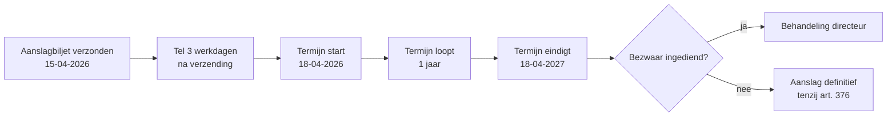

_Procedure_ · ook: administratief beroep · bezwaar tegen aanslag

## Definitie

De bezwaarprocedure is het verplicht administratief beroep tegen een gevestigde inkomstenbelastingaanslag (WIB92 art. 366). De belastingplichtige dient binnen een termijn van een jaar — te rekenen van de derde werkdag volgend op de datum van verzending van het aanslagbiljet — een gemotiveerd bezwaarschrift in bij de adviseur-generaal van de bevoegde gewestelijke directie (art. 371 WIB92). De directeur beslist (zonder dwingende beslistermijn) en die beslissing is voorwaarde om naar de rechtbank te kunnen.

<small>📖 WIB92 — art. 366-376 — _wettekst_</small>

## Substantie

Praktisch is bezwaar dé hefboom van de accountant: het is gratis, schriftelijk, en biedt de cliënt een tweede kans om feiten en argumenten naar voren te brengen die in de taxatiefase onvoldoende aan bod kwamen. Het bezwaar mag nieuwe grieven bevatten zolang de aanslag wordt betwist. De directeur kan de aanslag vernietigen, verminderen, of bevestigen — maar mag de aanslag niet verhogen (reformatio in pejus is verboden).

<small>🔗 WIB92 — art. 375 — _wettekst_ · cluster-extract-agent (opus-4.7-1M) — _ai_model_ — (2026-05-28)</small>

## Rationale

Het bezwaar is een verplichte zeef vóór de rechter: het ontlast de rechtbanken en geeft de fiscus de kans haar eigen fout te corrigeren. Het is ook een waarborg voor de belastingplichtige (geen extra kosten, geen advocatenplicht). De 1-jaars-termijn is van openbare orde — wie te laat is, verliest definitief het recht op betwisting (behoudens ambtshalve ontheffing art. 376 voor materiële vergissingen).

<small>🔗 WIB92 — art. 371 + art. 376 — _wettekst_ · cluster-extract-agent (opus-4.7-1M) — _ai_model_ — (2026-05-28)</small>

## Gebruikscontext

**Status**: `in-voege` · basis: WIB92 art. 366-376

**📋 Voorwaarden**
- 📖 (1) Er moet een gevestigde aanslag bestaan; (2) bezwaar wordt schriftelijk ingediend, gemotiveerd, en ondertekend door de belastingplichtige of zijn lasthebber; (3) bij de bevoegde adviseur-generaal (gewestelijke directie); (4) binnen de wettelijke termijn van één jaar (vanaf de derde werkdag na verzending van het aanslagbiljet).

**▶️ Trigger start**
- 📖 De bezwaartermijn-klok start op de derde werkdag volgend op de datum van verzending van het aanslagbiljet (datum vermeld op het biljet zelf). Voorbeeld: aanslagbiljet verzonden op woensdag 15-04-2026 → derde werkdag = zaterdag 18-04-2026 → vanaf die dag loopt de termijn van één jaar.

**⏹ Trigger einde**
- 📖 Kennisgeving van de directeursbeslissing (of het verstrijken van 6 maanden zonder beslissing na indiening van het bezwaar — fictieve afwijzing waarbij de belastingplichtige direct naar de rechter kan stappen, art. 1385undecies Ger.W.).

## Bouwstenen

### 📏 Termijn van één jaar

Het bezwaar moet zijn ingediend binnen een termijn van een jaar te rekenen van de derde werkdag volgend op de datum van verzending van het aanslagbiljet (art. 371 WIB92). Voorbeeld: aanslagbiljet verzonden op 15 april 2026 → de termijn start op de derde werkdag erna (18 april 2026) → einddatum = 18 april 2027. De termijn is van openbare orde: niet-verlengbaar, niet-vatbaar voor herstel (behoudens overmacht).

<small>📖 WIB92 — art. 371 — _wettekst_</small>

### 📜 Vorm en inhoud van het bezwaarschrift

Schriftelijk, ondertekend, gemotiveerd. Vermelding van: identificatie aanslag (artikel, aanslagjaar, kohier-nr), grieven (feitelijk + juridisch), gevorderd resultaat (vernietiging/vermindering). Indienen per aangetekende brief of via MyMinfin/Bizfin. Geen formulier verplicht. Een onvolledig of niet-ondertekend bezwaar is onontvankelijk.

<small>📖 WIB92 — art. 366 + art. 372 — _wettekst_</small>

### 👣 Beslissing door de directeur

De adviseur-generaal (of zijn gemachtigde ambtenaar) onderzoekt het bezwaar. Hij kan vragen om bijkomende inlichtingen of stukken. Hij kan de aanslag vernietigen, verminderen of bevestigen. Hij kan de aanslag NIET verhogen (verbod reformatio in pejus, art. 375 WIB92). De beslissing wordt schriftelijk en gemotiveerd betekend.

<small>📖 WIB92 — art. 374-375 — _wettekst_</small>

### ↪️ Ambtshalve ontheffing (art. 376)

Verlengde betwistingsmogelijkheid voor materiële vergissingen, dubbele belasting, of nieuwe bescheiden/feiten waarvan het laattijdig overleggen verantwoord is door gewettigde redenen: 5 jaar vanaf 1 januari van het jaar waarin de belasting is gevestigd (art. 376 WIB92). Dit is geen bezwaar maar een verzoek tot ambtshalve ontheffing aan de adviseur-generaal. Beperkter dan bezwaar: alleen voor materiële vergissingen, niet voor juridische geschillen of een wijziging van rechtspraak.

<small>📖 WIB92 — art. 376 — _wettekst_</small>

## Valkuilen

> [!warning]- Termijn start NIET op de datum van het aanslagbiljet
> **Verkeerde assumptie**: De bezwaartermijn loopt vanaf de datum vermeld op het aanslagbiljet, of vanaf ontvangst, of vanaf de eerste dag van de derde maand (oude regel).
>
> **Kernpunt**: De termijn start op de derde werkdag volgend op de verzendingsdatum en bedraagt één jaar (art. 371 WIB92). Reken de derde werkdag uit op basis van de verzendingsdatum op het biljet en vergrendel zowel start- als einddatum in de agenda — bij voorkeur met enkele weken veiligheidsmarge.
>
> <small>📖 WIB92 — art. 371 — _wettekst_</small>

> [!warning]- Bezwaar schorst niet automatisch invordering
> **Verkeerde assumptie**: Tijdens een lopend bezwaar moet de cliënt niets betalen.
>
> **Kernpunt**: Het 'onbetwist verschuldigd deel' blijft onmiddellijk opeisbaar. Voor het betwiste deel kan de ontvanger bewarend beslag leggen. Adviseer cliënten te betalen onder voorbehoud bij grote bedragen, om beslag te vermijden.
>
> <small>📖 WIB92 — art. 409-410 — _wettekst_</small>

> [!warning]- Reformatio in pejus is verboden — wel binnen het bezwaarvoorwerp
> **Verkeerde assumptie**: De directeur kan tijdens het bezwaar nieuwe rechtzettingen vinden en de aanslag verhogen.
>
> **Kernpunt**: De directeur mag de aanslag niet verhogen voor het deel waarover bezwaar werd ingediend (art. 375). Voor andere belastingelementen kan de fiscus wel een aanvullende aanslag vestigen binnen de algemene onderzoekstermijn.
>
> <small>📖 WIB92 — art. 375 — _wettekst_</small>

## Syntheses

### 🧩 Tijdslijn

Berekening bezwaartermijn aan de hand van een aanslagbiljet (art. 371 WIB92): 1 jaar vanaf de derde werkdag na verzending.

## Accountant-perspectieven

### Bezwaarschrift opstellen voor de cliënt

#### 💰 Fiscaal adviseur

##### 👣 Termijn-screening

Eerste actie bij ontvangst aanslagbiljet: noteer de verzendingsdatum op het biljet, tel drie werkdagen door om de startdatum te bepalen en zet einddatum (verzending + 3 werkdagen + 1 jaar, art. 371 WIB92) in de agenda — bij voorkeur met enkele weken veiligheidsmarge zodat een laattijdige ontvangst van het biljet niet fataal is.

<small>🔗 WIB92 — art. 371 — _wettekst_ · cluster-extract-agent (opus-4.7-1M) — _ai_model_ — (2026-05-28)</small>

##### 👣 Grieven structureren

Identificeer per betwist element: (a) feitelijke grief (waar zit de fout?), (b) juridische grond (welke wetsbepaling/CBN-advies/rechtspraak?), (c) gevorderd resultaat in euro's. Houd het bezwaarvoorwerp ruim om later geen grieven verloren te zien gaan voor de rechter.

<small>🔗 cluster-extract-agent (opus-4.7-1M) — _ai_model_ — (2026-05-28)</small>

##### 👣 Indienen + opvolging

Indienen per aangetekend schrijven (bewijs van verzending) of via MyMinfin/Bizfin. Bij stilzitten directeur > 6 maanden: overweeg overstap naar rechtbank (Ger.W. art. 1385undecies) of FBD-bemiddeling.

<small>📖 WIB92 — art. 366 — _wettekst_ · Ger.W. — art. 1385undecies — _wettekst_</small>

## Verder lezen (scope-out)

- → Gerechtelijke fase na afwijzing bezwaar → [[gerechtelijke-fase-belasting]] _(moet-verwijzen)_
- → Bemiddeling als parallelle weg → [[fiscale-bemiddelingsprocedure]] _(moet-verwijzen)_

## Relaties

### `valt_onder`
- [[fiscale-procedure]]
### `triggert`
- [[gerechtelijke-fase-belasting]]
### `vergelijkbaar_met`
- [[fiscale-bemiddelingsprocedure]]
