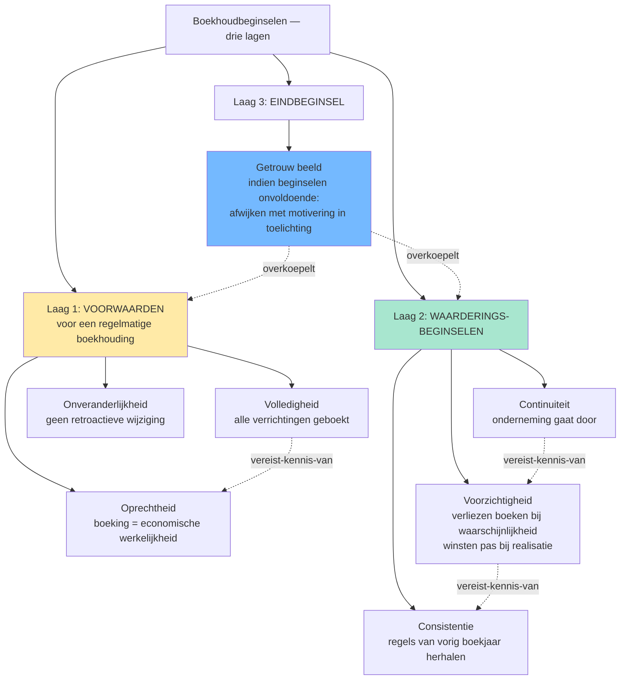

# Boekhoudbeginselen &mdash; overzicht 🤖

> [!info] Behoort tot: [[regelmatige-boekhouding]]

Een regelmatige boekhouding rust op een set boekhoudkundige beginselen die niet apart in één wetsartikel staan, maar verspreid zijn over WER art. III.83-89, KB WVV art. 3:1-3:60, CBN-advies 174/1 en Richtlijn 2013/34/EU art. 6. Stagiairs leren ze vaak los, terwijl ze juist samen werken: drie 'voorwaarden voor een betrouwbare boekhouding' (volledigheid, oprechtheid, onveranderlijkheid) + drie 'waarderingsbeginselen' (continuiteit, voorzichtigheid, consistentie) + één 'eindbeginsel' dat de andere overkoepelt (getrouw beeld). Dit overzichts-record toont de zeven beginselen naast elkaar met functie, bron en typische valkuil.

## Vergelijkingstabel

| Beginsel | Functie | Primaire bron | Vraag die het beantwoordt | Klassieke valkuil |
|---|---|---|---|---|
| [[getrouw-beeld]] | Eindbeginsel: de jaarrekening moet een getrouw beeld geven van vermogen, financiele positie en resultaat | WER art. III.89 · KB WVV art. 3:1 · Richtlijn 2013/34/EU art. 4 §3 | "Geeft mijn jaarrekening een getrouw beeld?" &mdash; eindtoets | Stagiair denkt: "als alle posten correct geboekt zijn klopt het beeld vanzelf". Fout: bij twijfel moet je afwijken van de regels mits motivering in de toelichting (KB WVV art. 3:1 derde lid). |
| [[volledigheidsbeginsel]] | Alle verrichtingen, bezittingen, rechten, schulden en verplichtingen zijn geboekt | WER art. III.83 · CBN 174/1 | "Heb ik alles opgenomen?" | Buiten-balans-rechten en -verplichtingen (klasse 0) worden vergeten &mdash; zie [[rechten-verplichtingen-buiten-balans]]. |
| [[oprechtheidsbeginsel]] | Boekingen reflecteren de werkelijke economische verrichting (niet de juridische schijn) | CBN 174/1 | "Komt mijn boeking overeen met de werkelijkheid?" | Substance over form: leasing waarbij [[Transport Tongeren BV]] het economisch eigendom heeft moet als financieringshuur geboekt worden, niet als operationele huur &mdash; ook al heet het contractueel zo. |
| [[onveranderlijkheid-boekingen]] | Eenmaal geboekt mag niet meer worden geschrapt of overschreven; correcties via tegenboeking | WER art. III.86 · CBN 174/1 | "Mag ik een vorige boeking nog wijzigen?" | Tipp-Ex of overschrijven in handgeschreven dagboek &rarr; boekhouding niet meer regelmatig. Correctie altijd via tegenboeking met datum en verwijzing. |
| [[continuiteitsbeginsel]] | Waardering veronderstelt dat de onderneming haar activiteiten voortzet | KB WVV art. 3:6 · CBN 2018/18 | "Mag ik blijven waarderen alsof we doorgaan?" | Bij twijfel over continuiteit moet bestuur uitdrukkelijk evalueren (toelichting jaarrekening); bij stopzetting overschakelen naar discontinuiteitswaarderingsregels. |
| [[voorzichtigheidsbeginsel]] | Verliezen en risico's boeken zodra waarschijnlijk; winsten pas bij realisatie | KB WVV art. 3:6 · Richtlijn 2013/34/EU art. 6 §1.c | "Mag ik deze opbrengst al boeken?" | Asymmetrie: voorzieningen aanleggen voor verwachte verliezen ja; herwaarderingsmeerwaarden boeken op niet-verkochte activa niet (behalve duurzame meerwaarde + KB-criteria). |
| [[consistentiebeginsel]] | Waarderingsregels van het ene boekjaar op het andere onveranderd toepassen | KB WVV art. 3:8 · CBN 174/1 | "Mag ik mijn afschrijvingsmethode veranderen?" | Methodewijziging mag, mits motivering in de toelichting + retroactieve aanpassing of prospectieve toepassing (afhankelijk van type wijziging). |

## Beslisboom

## Kerninzichten

- De zeven beginselen zijn niet allemaal gelijkwaardig: drie zijn voorwaarden om uberhaupt van een 'regelmatige' boekhouding te kunnen spreken (volledigheid, oprechtheid, onveranderlijkheid), drie sturen de waardering (continuiteit, voorzichtigheid, consistentie), en het getrouw-beeld-beginsel staat erboven als eindtoets. Stagiairs die ze op een rij zien staan zonder hierarchie missen die drie-lagen-structuur. 🤖
  - _Rationale_: Structuur komt naar voren uit CBN 174/1-inleiding + Richtlijn 2013/34/EU art. 6 §1 vs art. 4 §3. De boekhoudwet zelf groepeert niet expliciet, maar functioneel-pedagogisch is dit de helderste indeling.
- Het getrouw-beeld-beginsel bevat een overrule-mechanisme: als toepassing van de andere beginselen onvoldoende is om een getrouw beeld te geven, moet je afwijken &mdash; met motivering in de toelichting (KB WVV art. 3:1 derde lid). Dit is geen vrijbrief: het bestuur moet uitdrukkelijk vaststellen dat de standaardregels onvoldoende zijn. ⚖️
  - _Rationale_: Letterlijke regel in KB WVV art. 3:1 + uitwerking in CBN 2018/18 voor going-concern-context.
- Voorzichtigheid en getrouw-beeld kunnen op gespannen voet staan: pure voorzichtigheid leidt tot stille reserves (winsten onderschat, verliezen overschat), wat het getrouwe beeld verstoort. De moderne lezing (Richtlijn 2013/34/EU art. 6 §1.c): voorzichtigheid betekent geen overdreven onderwaardering, alleen waarschijnlijke verliezen + risico's opnemen. 🤖
  - _Rationale_: Stille reserves zijn historisch een Belgisch fenomeen; EU-richtlijn 2013/34 heeft daar grenzen aan gesteld. Examenrelevant: stagiairs moeten weten dat overdreven voorzichtigheid evenmin getrouw is als overdreven optimisme.
- De onveranderlijkheid van boekingen is een formele eis (geen Tipp-Ex, geen overschrijven) maar geen verbod op correcties. Een verkeerde boeking corrigeer je via een tegenboeking met datum en verwijzing &mdash; de oorspronkelijke fout blijft zichtbaar in de audit-trail. ⚖️
  - _Rationale_: CBN 174/1 expliciet over draagwijdte van het onveranderlijkheidsbeginsel + WER art. III.86 (bewaarplicht).
- Volledigheid omvat ook de rechten en verplichtingen buiten de balans (klasse 0): garanties verleend door [[Meubelzaak Mertens BV]], leaseverplichtingen, borgstellingen, pensioenverplichtingen. Wie deze vergeet schendt het volledigheidsbeginsel zonder dat de balans uit evenwicht raakt &mdash; daarom is het een silent error die makkelijk gemist wordt op examens. 🤖
  - _Rationale_: Volledigheidsbeginsel + klasse 0 + valkuil-patroon uit examenvragen. Cross-link naar [[rechten-verplichtingen-buiten-balans]].

## Verwante competenties

- [[competenties/naleven-boekhoudbeginselen]]
- [[competenties/beoordelen-getrouw-beeld]]
- [[competenties/kiezen-waarderingsregels]]

## Bronnen

[^1]: `CBN-0174-01-beginselen-van-een-regelmatige-boekhouding__sec_inleiding`
[^2]: `Richtlijn-2013-34-EU__art_6`
[^3]: `WER__art_III_70`
[^4]: `CBN-2018-18-going-concern-waarderingsregels-bij-de-stopzetting__sec_verslaggeving-over-de-beoordeling-van-continuiteitsveronders`
[^5]: `CBN-2010-12-de-toepassing-van-de-algemene-boekhoudprincipes-op-afgeleide-financiele-instrumenten__sec_hi-rarchische-rangschikking-van-de-waarderingsprincipes`
