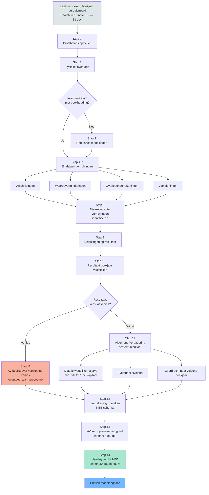

# Boekjaar afsluiten &mdash; van proefbalans tot neerlegging 🤖

> [!info] Behoort tot: [[regelmatige-boekhouding]]

Tussen de laatste maandelijkse boeking en het neergelegde jaarverslag liggen tien tot vijftien verplichte stappen. Stagiairs leren de losse boekingen (afschrijvingen, overlopende rekeningen, voorzieningen, resultaatverwerking) maar zien zelden de volledige volgorde. Een vergeten stap &mdash; bijvoorbeeld de wettelijke reserve voor het bedrag verwerkt wordt &mdash; produceert een formeel onregelmatige jaarrekening, ook al klopt elk cijfer afzonderlijk. Dit synthese-record toont de chronologie van proefbalans tot neerlegging bij de NBB.

## Vergelijkingstabel

| Stap | Wat | Wanneer | Concept-record | Output |
|---|---|---|---|---|
| 1 | Proefbalans opstellen | Direct na laatste boeking boekjaar | [[regelmatige-boekhouding]] · [[dubbel-boekhouden]] | Lijst met saldi per grootboekrekening; debet = credit |
| 2 | Fysieke inventarisopname | Op de afsluitingsdatum (in regel laatste dag boekjaar) | [[inventaris]] | Werkblad met fysieke tellingen voorraad, kas, vaste activa |
| 3 | Verschillen inventaris &harr; boekhouding regulariseren | Tussen inventaris-datum en jaarrekening-opmaak | [[inventaris]] · [[voorraden]] | Correctieboekingen (manco's, breukverliezen, inventarisverschillen) |
| 4 | Afschrijvingen boeken | Eindejaarsverrichting | [[afschrijvingen]] | Boeking 6302 / 22-28 voor materiele en immateriele vaste activa |
| 5 | Waardeverminderingen toetsen + boeken | Eindejaarsverrichting | [[waardeverminderingen]] | Boeking 631-634 voor duurzame waardeverminderingen op activa |
| 6 | Overlopende rekeningen boeken | Eindejaarsverrichting | [[overlopende-rekeningen]] | Boeking 490/491/492/493 voor toerekening kosten/opbrengsten aan juiste boekjaar |
| 7 | Voorzieningen aanleggen of terugnemen | Eindejaarsverrichting | [[voorzieningen]] · [[voorzichtigheidsbeginsel]] | Boeking 6360 / 160-163 voor risico's en kosten |
| 8 | Niet-recurrente verrichtingen identificeren | Bij opmaak resultatenrekening | [[niet-recurrente-verrichtingen]] | Boeking 66/76 (vroegere 'uitzonderlijke' rubrieken) |
| 9 | Belastingen op het resultaat berekenen + boeken | Na vaststelling resultaat voor belasting | [[bedrijfsresultaat]] | Boeking 670-679 |
| 10 | Resultaat van het boekjaar afsluiten | Sluiten rekeningen klasse 6 en 7 | [[bedrijfsresultaat]] · [[resultaatverwerking]] | Saldo op rekening 690/790 |
| 11 | Algemene vergadering: resultaat bestemmen | Binnen 6 maanden na boekjaareinde | [[resultaatverwerking]] · [[wettelijke-reserve]] | Beslissing AV: dotatie wettelijke reserve, eventueel andere reserves, dividend, overdracht naar volgend boekjaar |
| 12 | Jaarrekening opmaken in NBB-schema | Na resultaatverwerking | [[jaarrekening]] | Volledige of verkorte jaarrekening + toelichting + sociale balans |
| 13 | Goedkeuring algemene vergadering | Binnen 6 maanden na boekjaareinde | [[jaarrekening]] | AV-notulen + ondertekende jaarrekening |
| 14 | Neerlegging bij NBB | Binnen 30 dagen na goedkeuring AV (en uiterlijk 7 maanden na boekjaareinde) | [[jaarrekening]] | Neergelegde jaarrekening &mdash; publiek raadpleegbaar |

## Beslisboom

## Kerninzichten

- De volgorde is bindend: pas na de eindejaarsverrichtingen (stap 4-9) kan je het resultaat van het boekjaar vaststellen (stap 10). Pas na de algemene vergadering die het resultaat bestemt (stap 11) ken je het 'overgedragen resultaat' &mdash; pas dan is de jaarrekening volledig opmaakbaar (stap 12). Een examenvraag die zegt 'jaarrekening klaar, AV moet nog komen' bevat dus een logische fout: de jaarrekening kan niet 'klaar' zijn zonder AV-beslissing. 🤖
  - _Rationale_: Volgt uit MAR rekeningenklasse 6 + 7 (sluiten via 690/790) + KB WVV art. 3:66 voor jaarrekening-opmaak na resultaatbestemming.
- De timing is wettelijk geketend: AV binnen 6 maanden na boekjaareinde (WVV art. 3:1 §1), neerlegging binnen 30 dagen na AV (WVV art. 3:10) en uiterlijk 7 maanden na boekjaareinde. Voor [[Naaiatelier Ninove BV]] met boekjaar dat eindigt op 31 december betekent dit: AV ten laatste 30 juni, neerlegging ten laatste 31 juli. Boete-risico: laattijdige neerlegging is een veelvoorkomende cliënt-vraag. ⚖️
  - _Rationale_: WVV art. 3:1 §1 + 3:10 expliciete termijnen. Direct examenrelevant.
- Drie van de tien verplichte boekingen volgen direct uit de waarderingsbeginselen: afschrijvingen (consistentie), waardeverminderingen (voorzichtigheid), voorzieningen (voorzichtigheid). Wie de beginselen kent, kan deze stappen niet vergeten. Wie ze opvat als 'extra werk', vergeet er typisch een &mdash; bijvoorbeeld de waardeverminderingen op vorderingen. 🤖
  - _Rationale_: Cross-link [[boekhoudbeginselen-overzicht]]: drie waarderingsbeginselen -> drie typische eindejaarsverrichtingen. Pedagogisch nuttig voor stagiairs.
- De wettelijke reserve (stap 11) ontstaat bij de resultaatverwerking, niet bij de jaarrekening-opmaak. Sequentieel: AV beslist welk percentage naar wettelijke reserve gaat (min. 5% van de winst, tot de wettelijke reserve 10% van het kapitaal bereikt). Pas dan staat het bedrag op rekening 130; pas dan past het in de jaarrekening die de AV daarna goedkeurt. ⚖️
  - _Rationale_: WVV art. 7:211 + MAR rekening 130. Veelvoorkomende verwarring: stagiairs denken dat dotatie automatisch is via boekhouding &mdash; in werkelijkheid is het een AV-beslissing.

## Verwante competenties

- [[competenties/uitvoeren-jaarafsluiting]]
- [[competenties/opmaken-jaarrekening]]
- [[competenties/respecteren-wettelijke-termijnen]]
- [[competenties/begeleiden-algemene-vergadering]]

## Bronnen

[^1]: `CBN-0174-01-beginselen-van-een-regelmatige-boekhouding__sec_regels-die-voor-elke-bedrijfsboekhouding-gelden`
[^2]: `KB-WVV-2019__art_3_66`
[^3]: `MAR-ondernemingen__art_6`
[^4]: `CBN-0174-01-beginselen-van-een-regelmatige-boekhouding__sec_volledigheid-van-de-boekhouding-en-van-de-inventaris`
[^5]: `KB-WVV-2019__art_3_68`
[^6]: `MAR-ondernemingen__art_1`
