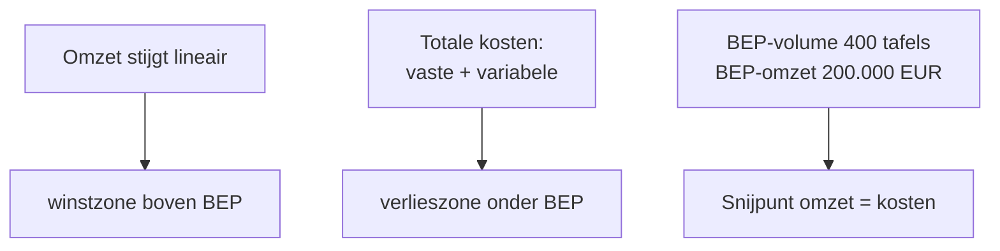

# Break-even-analyse

_Procedure_

🏛️ Kader · Anchors: `1.8.III.D` · Wave: `cluster-extract-management-accounting-2026-05-28`

> [!info] 📝 **Concept** — content gevuld door cluster-extract; niet door mens-verify gegaan.

**Afk.**: BEP — **Synoniemen**: break-even-point · kostenstructuur-analyse · cost-volume-profit-analyse · CVP-analyse — **Vertalingen**: fr: analyse du point mort

## Definitie

🔗 De break-even-analyse (ook cost-volume-profit-analyse of CVP-analyse) berekent het verkoopvolume waarbij de totale opbrengsten gelijk zijn aan de totale kosten — het break-even-punt (BEP). Onder het BEP draait de onderneming verlies; erboven winst. Het BEP-volume = vaste kosten / contributiemarge per eenheid. Het BEP-omzet = vaste kosten / contributiemarge-ratio. Daarnaast levert de analyse twee bijhorende inzichten: de veiligheidsmarge (afstand tussen huidige omzet en BEP-omzet, in procenten — hoe ver weg van verlies?) en de operationele hefboom (effect van een omzet-wijziging op het bedrijfsresultaat).

<small>📚 cluster-extract-agent (opus-4.7-1M) — _ai_model_ — (2026-05-28)</small>

## Substantie

🔗 Voor de stagiair: break-even-analyse maakt de winstgevoeligheid van een onderneming tastbaar. Een onderneming met hoge vaste kosten en lage contributiemarge per eenheid (kapitaalintensieve industrie: chemie, staal) heeft een hoog BEP — een omzet-daling van 10% kan haar in verlies brengen. Een onderneming met lage vaste kosten en hoge contributiemarge (dienstverlening, software) heeft een laag BEP — ze is veerkrachtig in moeilijke periodes. De analyse leert ook: lage prijzen verlagen de contributiemarge en duwen het BEP omhoog; hogere vaste kosten (nieuwe investering) doen hetzelfde. Een prijswijziging van 5% beweegt het BEP veel sterker dan een vaste-kostenwijziging van 5% — prijsdiscipline is essentieel.

<small>📚 cluster-extract-agent (opus-4.7-1M) — _ai_model_ — (2026-05-28)</small>

## Rationale

🔗 De analyse vertrekt vanuit één eenvoudige identiteit: winst = (verkoopprijs − variabele kost) × volume − vaste kosten. Bij winst = 0 vind je het BEP-volume. Het inzicht is dat winst pas ontstaat wanneer de cumulatieve contributiemarge (van alle verkochte eenheden) de vaste kosten heeft 'opgevuld'. Elk extra verkocht stuk daarboven is volledig contributie-bijdrage aan winst — een fenomeen dat de operationele hefboom verklaart.

<small>📚 cluster-extract-agent (opus-4.7-1M) — _ai_model_ — (2026-05-28)</small>

## Gebruikscontext

**✅ Voor**
- 🔗 Beslissingen over prijszetting · investeringen die vaste kosten doen stijgen · sensitiviteitsanalyse bij omzet-prognoses · communicatie aan kredietverleners (operationeel risicoprofiel) · go/no-go nieuwe productlijn of locatie.

**🚫 Niet voor**
- 🔗 Multi-product-ondernemingen zonder duidelijke product-mix-veronderstelling — een gewogen-gemiddelde contributiemarge is nodig en het BEP wordt mix-afhankelijk. Bovendien veronderstelt BEP-analyse lineariteit (constante prijs, constante variabele kost per eenheid, constante vaste kost) — buiten het relevant range breekt dat (volumekortingen, opschaling productiecapaciteit).

## Bouwstenen

### 🧮 Formule BEP — kern  
_`formule`_

🔗 Break-even-volume (in eenheden) = Vaste kosten / Contributiemarge per eenheid. Break-even-omzet (in EUR) = Vaste kosten / Contributiemarge-ratio. Met doelwinst W: doelvolume = (Vaste kosten + W) / Contributiemarge per eenheid. Veiligheidsmarge (in %) = (Huidige omzet − BEP-omzet) / Huidige omzet — meet hoeveel omzet kan dalen voordat verlies ontstaat.

<small>📚 cluster-extract-agent (opus-4.7-1M) — _ai_model_ — (2026-05-28)</small>

### ⚙️ Operationele hefboom (operating leverage)  
_`mechanisme`_

🔗 De operationele hefboom = Contributiemarge totaal / Bedrijfsresultaat. Hij geeft aan hoeveel procent het bedrijfsresultaat verandert bij 1% omzet-verandering. Voorbeeld: hefboom 5 = een omzetstijging van 10% geeft een resultaatstijging van 50%; een omzetdaling van 10% geeft een resultaatdaling van 50%. Hoge hefboom (hoge vaste kosten, hoge CM) = hoog rendement bij groei, hoog risico bij krimp. Lage hefboom = stabiel maar minder explosief.

<small>📚 cluster-extract-agent (opus-4.7-1M) — _ai_model_ — (2026-05-28)</small>

### 🚧 Veronderstellingen — geldigheidsgrenzen  
_`beperking`_

🔗 BEP-analyse veronderstelt: (1) constante verkoopprijs per eenheid binnen het analyse-bereik; (2) constante variabele kost per eenheid (geen volumekortingen op grondstoffen, geen leerkromme-effect); (3) constante vaste kosten binnen het relevant range (geen stapeffecten bij extra productiehal of extra ploeg); (4) bij multi-product: constante product-mix; (5) productie = verkoop (geen voorraadwijziging). Buiten deze veronderstellingen wordt het BEP onbetrouwbaar — gebruik dan piecewise-analyse per range.

<small>📚 cluster-extract-agent (opus-4.7-1M) — _ai_model_ — (2026-05-28)</small>

## Voorbeelden

### 💡 Zelena Bio NV — BEP + veiligheidsmarge + hefboom 🔗

_Zelena verkoopt tafels aan 500 EUR/stuk. Variabele kost: 250 EUR/stuk. Vaste kosten maand: 100.000 EUR. Huidige verkoop: 600 tafels/maand._

**Berekening:**
- Contributiemarge per tafel = 500 − 250 = 250 EUR
- Contributiemarge-ratio = 250 / 500 = 50%
- BEP-volume = 100.000 / 250 = 400 tafels
- BEP-omzet = 100.000 / 0,50 = 200.000 EUR
- Huidige omzet = 600 × 500 = 300.000 EUR
- Veiligheidsmarge = (300.000 − 200.000) / 300.000 = 33%
- Huidige CM totaal = 600 × 250 = 150.000 EUR
- Huidig bedrijfsresultaat = 150.000 − 100.000 = 50.000 EUR
- Operationele hefboom = 150.000 / 50.000 = 3,0

→ **Resultaat**: Zelena moet 400 tafels per maand verkopen om quitte te draaien. Ze heeft een veiligheidsmarge van 33% — een omzetdaling van 33% breekt break-even. Met een hefboom van 3,0 versterkt elke 1% omzet-wijziging het resultaat met 3% — een omzetdaling van 10% reduceert het resultaat van 50.000 naar 35.000 EUR (−30%).

Grafische voorstelling:

<small>📚 cluster-extract-agent (opus-4.7-1M) — _ai_model_ — (2026-05-28)</small>

### 💡 Sensitiviteit — prijsverlaging 10% 🔗

_Zelfde scenario: stel Zelena verlaagt de verkoopprijs van 500 naar 450 EUR (−10%). Verwachte omzet-stijging: nihil (markt-elasticiteit ≈ 0 voor deze niche)._

**Berekening:**
- Nieuwe CM = 450 − 250 = 200 EUR per tafel
- Nieuw BEP-volume = 100.000 / 200 = 500 tafels (was 400)
- Bij ongewijzigd volume (600): nieuwe omzet = 600 × 450 = 270.000; nieuwe CM totaal = 600 × 200 = 120.000; nieuw resultaat = 120.000 − 100.000 = 20.000 EUR (was 50.000)
- Effect: resultaat daalt 60% bij prijsdaling van 10% (zonder volumecompensatie)

→ **Resultaat**: Een prijsverlaging van 10% is dramatischer dan veel managers verwachten — bij ongewijzigd volume valt 60% van de winst weg. Vraag voor de directie: welk extra volume is nodig om verlies te dekken? Antwoord: nieuw doelvolume bij 50.000 EUR resultaat = (100.000 + 50.000) / 200 = 750 tafels — een volume-stijging van 25% is nodig om dezelfde winst te halen na de prijsdaling.

<small>📚 cluster-extract-agent (opus-4.7-1M) — _ai_model_ — (2026-05-28)</small>

## Valkuilen

### ⚠️ BEP-analyse extrapoleren buiten het relevant range

**Verkeerde assumptie**: Het BEP-volume blijft constant zolang we de formule maar gebruiken.

**Kernpunt**: BEP-analyse veronderstelt lineariteit binnen een bepaald bereik. Bij grote omzet-uitbreiding worden nieuwe machines + ploegen nodig — de vaste kost springt omhoog. Dan is het 'oude' BEP irrelevant; de analyse moet opnieuw per kostenstap.

<small>📚 cluster-extract-agent (opus-4.7-1M) — _ai_model_ — (2026-05-28)</small>

### ⚠️ Multi-product BEP behandelen alsof het één product is

**Verkeerde assumptie**: Bij meerdere producten kan je de gewogen CM gewoon gebruiken voor BEP.

**Kernpunt**: Bij meerdere producten is het BEP-volume afhankelijk van de product-mix. Een gewogen-gemiddelde CM geeft alleen een BEP indien de mix constant blijft. Bij verschuiving naar meer high-margin-producten daalt het BEP; bij verschuiving naar low-margin stijgt het. Communiceer expliciet 'BEP bij huidige mix' en analyseer mix-scenario's apart.

<small>📚 cluster-extract-agent (opus-4.7-1M) — _ai_model_ — (2026-05-28)</small>

### ⚠️ BEP-volume gelijkstellen aan 'minimum verkoop'

**Verkeerde assumptie**: Het BEP is het 'minimum' dat de onderneming nodig heeft.

**Kernpunt**: Het BEP geeft het volume voor nul winst — niet voor levensvatbaarheid. De onderneming heeft ook winst nodig om eigenaars te belonen, te herinvesteren en risico op te vangen. 'Strategisch BEP' bevat een doelwinst en ligt typisch 20-40% boven het rekenkundig BEP.

<small>📚 cluster-extract-agent (opus-4.7-1M) — _ai_model_ — (2026-05-28)</small>

## Accountant-perspectieven

### Advies bij investerings- of expansie-beslissing

_Cliente overweegt een investering die de vaste kosten doet stijgen — wat is het nieuwe BEP en de risico-impact?_

#### 🧭 Adviseur

##### 👣 Voor-en-na-BEP-vergelijking  
_`stap`_

🔗 Voor het investeringsbesluit: bereken het huidig BEP-volume en de huidige veiligheidsmarge. Simuleer dan het nieuw BEP met de bijkomende vaste kosten. Vergelijk: hoeveel extra volume is nodig om hetzelfde rendement te halen? Welke veiligheidsmarge blijft over? Bij krapper-wordende veiligheidsmarge (<15%): rode vlag — onderneming wordt kwetsbaarder voor conjunctuur. De cliente moet de investering kunnen rechtvaardigen op basis van een concrete, realistische volumegroei — niet op basis van 'we zien wel'.

<small>📚 cluster-extract-agent (opus-4.7-1M) — _ai_model_ — (2026-05-28)</small>

## Verder lezen (scope-out)

- → Direct costing (contributiemarge-context) → [[direct-costing]] _(moet-verwijzen)_
- ↪ Kostprijsmethoden Σ → [[kostprijsmethoden]] _(mag-verwijzen)_

## Relaties

### `valt_onder`
- [[analytische-boekhouding]]
### `vereist`
- [[direct-costing]] — BEP-analyse bouwt op de contributiemarge-redenering — die komt uit direct costing.
