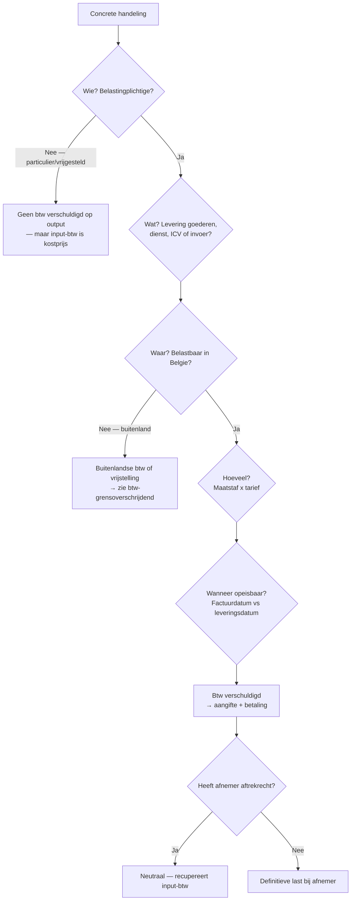

_Kader_ · afk: **BTW** · ook: BTW-stelsel · value-added tax · VAT · TVA

## Definitie

De belasting over de toegevoegde waarde (btw) is een algemene verbruiksbelasting die strikt evenredig is aan de prijs van geleverde goederen en diensten — ongeacht het aantal schakels in de productie- en distributieketen tot en met de kleinhandelsfase. Bij elke schakel wordt btw geheven op de verkoopprijs en mag de schakel zelf de btw op zijn aankopen aftrekken; per saldo draagt elke schakel slechts btw af op de toegevoegde waarde die hij creëert, en wordt de volledige eindprijs-btw economisch gedragen door de eindverbruiker.

<small>📖 Richtlijn 2006/112/EG — art. 1, lid 2 — _richtlijn_ · W.BTW — art. 2 — _wettekst_</small>

## Substantie

Economisch is btw een eindverbruikersbelasting, juridisch een ondernemersbelasting. De fiscus int via de keten van belastingplichtigen — niet via de eindconsument. Elke belastingplichtige is tegelijk inner (op verkopen → output-btw) en betaler (op aankopen → input-btw); via het aftrekrecht (art. 45 W.BTW) ontstaat een netto-saldo dat hij periodiek aan de Schatkist betaalt of terugkrijgt. Wie geen recht op aftrek heeft (particulier, vrijgestelde belastingplichtige) draagt de btw definitief. De keten breekt waar het aftrekrecht stopt — daar valt de last neer.

<small>🔗 Richtlijn 2006/112/EG — art. 1, lid 2 — _richtlijn_ · W.BTW — art. 45 — _wettekst_ · cluster-extract-agent (opus-4.7-1M) — _ai_model_ — (2026-05-28)</small>

## Rationale

Ratio legis is dubbel: (1) neutraliteit — de belasting mag de keuze tussen integratie en uitbesteding niet beïnvloeden en mag de concurrentie tussen lidstaten niet verstoren; daarom heffing op elke schakel met aftrek van voorbelasting, in plaats van een cumulatieve omzetbelasting; (2) verbruikslocalisatie — het tarief en de heffing volgen het land van verbruik, niet het land van productie. De systeemrichtlijn 2006/112/EG harmoniseert deze logica binnen de EU; lidstaten implementeren via nationaal recht (in België het W.BTW).

<small>🔗 Richtlijn 2006/112/EG — preambule + art. 1 — _richtlijn_ · cluster-extract-agent (opus-4.7-1M) — _ai_model_ — (2026-05-28)</small>

## Gebruikscontext

**Status**: `in-voege` · sinds **1971-01-01** · basis: W.BTW 03-07-1969 (in werking 01-01-1971) — geharmoniseerd via Richtlijn 2006/112/EG (opvolger van de Zesde Richtlijn 77/388/EEG)

Het btw-stelsel is sinds 1971 in werking in België. De materie is sterk Europees gestuurd: nationale wetgeving moet overeenstemmen met Richtlijn 2006/112/EG en met Uitvoeringsverordening (EU) nr. 282/2011 (rechtstreeks toepasselijk). Tarieven en bedragen worden geregeld geïndexeerd of bijgesteld.

**✅ Voor**
- 📖 Elke ondernemer (natuurlijke persoon of vennootschap) die geregeld en zelfstandig handelingen onder bezwarende titel verricht: leveringen van goederen, dienstverrichtingen, invoer en intracommunautaire verwervingen. De ondernemer registreert zich bij de btw-administratie, krijgt een btw-identificatienummer (BE0XXX.XXX.XXX) en doet periodieke aangifte.

**🚫 Niet voor**
- 📖 Particulieren en niet-belastingplichtige rechtspersonen (overheid bij gezagshandelingen) staan in beginsel buiten het stelsel — zij dragen de btw definitief als eindverbruiker. Vrijgestelde belastingplichtigen (art. 44 W.BTW: medische zorg, onderwijs, sociale dienstverlening, financiële diensten) factureren geen btw en hebben geen recht op aftrek.

**👍 Voordeel**
- 🔗 Neutraliteit voor de belastingplichtige: dankzij het aftrekrecht weegt de btw economisch niet op de ondernemingsmarge, ongeacht de lengte van de productieketen. Een geïntegreerd bedrijf en een keten van onderaannemers betalen samen evenveel btw aan de Schatkist.

**⚠️ Risico**
- 📖 Foutieve kwalificatie van een handeling (levering vs. dienst, plaats van handeling, tarief) leidt tot ofwel te weinig afgedragen btw (proportionele boete + nalatigheidsinteresten op grond van art. 70 + 91 W.BTW) ofwel te veel gefactureerde btw die de afnemer mogelijk niet kan recupereren. Btw die ten onrechte op een factuur staat is volgens art. 51, §1, 3° W.BTW gewoon verschuldigd door de uitreiker — ook al was er geen levering of dienst.
- 🔗 Voor de schakel die geen recht op aftrek heeft (vrijgestelde belastingplichtige, gemengde belastingplichtige met deelproratabreuk) is btw een kostprijs-component. Inschatting van het aftrekpercentage bij investeringen (bedrijfsmiddelen-herziening over 5 of 15 jaar) is een cruciale planningstap.

## Sub-concepten

### 📦 BTW-keten en cascade-aftrek

#### Substantie

De btw werkt als een ketting van schakels: elke belastingplichtige rekent op zijn verkoopprijs btw aan (output-btw), trekt de btw af die hij zelf op aankopen heeft betaald (input-btw) en stort het verschil aan de Schatkist. De volledige eindprijs-btw belandt zo bij de eindverbruiker, ook al heeft elke schakel slechts btw afgedragen op zijn eigen toegevoegde waarde. De keten breekt waar een schakel geen aftrekrecht heeft (vrijgestelde belastingplichtige, particulier) — daar wordt de btw definitieve last.

<small>🔗 Richtlijn 2006/112/EG — art. 1, lid 2 — _richtlijn_ · W.BTW — art. 45 — _wettekst_</small>

> [!example]- Cascade-voorbeeld: van houtkapper tot consument (tarief 21 %)
> _Drie schakels in een productieketen, alle btw-plichtig met volledig aftrekrecht. Tarief 21 %. Bedragen excl. btw._
>
> | Schakel | Aankoop excl. | Verkoop excl. | Output-btw 21 % | Input-btw 21 % | Saldo aan Schatkist |
>
> | --- | --- | --- | --- | --- | --- |
>
> | Houtkapper | 0 | 100 | 21 | 0 | 21 |
>
> | Zagerij | 100 | 150 | 31,50 | 21 | 10,50 |
>
> | Meubelmaker | 150 | 300 | 63 | 31,50 | 31,50 |
>
> | Eindverbruiker | 300 (excl.) → betaalt 363 incl. | — | — | — | — |
>
> | TOTAAL aan Schatkist |  |  |  |  | 63 |
>
> _De eindverbruiker betaalt 63 EUR btw op 300 EUR toegevoegde waarde. Dat bedrag is verdeeld over de drie schakels (21 + 10,50 + 31,50 = 63). Elke schakel droeg slechts btw af op zijn eigen toegevoegde waarde — geen cumulatie._
>
> <small>🔗 cluster-extract-agent (opus-4.7-1M) — _ai_model_ — (2026-05-28)</small>

> [!warning]- Btw is geen kostprijs voor de ondernemer
> **Verkeerde assumptie**: Een stagiair denkt dat een ondernemer 21 % btw 'extra betaalt' op zijn aankopen — dus dat de aankoopprijs duurder wordt door btw.
>
> **Kernpunt**: Voor een belastingplichtige met volledig aftrekrecht is btw géén kostprijs: de input-btw wordt teruggevorderd of verrekend. Btw is alleen kostprijs voor wie geen of beperkt aftrekrecht heeft (particulier, art. 44-vrijgestelde, gemengde belastingplichtige). Toets bij elke boekingsvraag: 'heeft deze schakel aftrekrecht?'
>
> <small>🔗 W.BTW — art. 45 — _wettekst_ · cluster-extract-agent (opus-4.7-1M) — _ai_model_ — (2026-05-28)</small>

### 📦 De vier bouwelementen van een btw-handeling

#### Substantie

Om btw correct toe te passen op een handeling moet de accountant systematisch vier vragen beantwoorden: (1) is de uitvoerder een belastingplichtige? (2) wat voor handeling is het — levering van goederen, dienst, invoer of intracommunautaire verwerving? (3) waar vindt de handeling plaats? (4) tegen welke maatstaf van heffing en welk tarief wordt geheven? Pas wanneer deze vier elementen vaststaan, volgt de vraag wanneer de btw opeisbaar wordt en wie ze moet voldoen.

<small>🔗 W.BTW — art. 2 + art. 4 + art. 10 + art. 18 + art. 21-22 + art. 26 + art. 37 — _wettekst_ · cluster-extract-agent (opus-4.7-1M) — _ai_model_ — (2026-05-28)</small>

#### 💡 1. Belastingplichtige (Wie?)

Eenieder die op zelfstandige wijze geregeld een economische activiteit uitoefent, ongeacht het oogmerk of het resultaat. Sluit in: ondernemers, vrije beroepen, vennootschappen. Sluit uit: werknemers, particulieren (occasioneel), gezagshandelingen van de overheid. Detail in afgesplitst record `btw-belastingplichtige`.

<small>📖 W.BTW — art. 4 — _wettekst_</small>

#### 💡 2. Belastbare handeling (Wat?)

Vier categorieën: (a) levering van goederen — overdracht van de macht om als eigenaar te beschikken (art. 10 W.BTW); (b) dienstverrichting — elke handeling die geen levering van goederen is (art. 18 W.BTW); (c) intracommunautaire verwerving — aankoop uit andere EU-lidstaat (art. 25bis); (d) invoer — binnenkomen in de EU vanuit een derde land (art. 23). Detail in `btw-levering-goederen` en `btw-dienstverlening`.

<small>📖 W.BTW — art. 10 + art. 18 + art. 23 + art. 25bis — _wettekst_</small>

#### 💡 3. Plaats van handeling (Waar?)

Bepaalt of België — en niet een ander land — heffingsbevoegd is. Algemene regels: levering van goederen → plaats waar het goed zich bevindt op het moment van vertrek (art. 14-15); dienst B2B → plaats waar de afnemer gevestigd is (art. 21, §2); dienst B2C → plaats waar de dienstverrichter gevestigd is (art. 21, §1); uitzonderingen voor onroerende diensten, vervoer, restaurant, evenementen. Detail in `plaats-van-handeling-btw`.

<small>📖 W.BTW — art. 14 + art. 15 + art. 21 + art. 21bis + art. 22 — _wettekst_</small>

#### 💡 4. Maatstaf van heffing en tarief (Hoeveel?)

Maatstaf = de tegenprestatie die de leverancier ontvangt of moet ontvangen, inclusief bijkomende kosten (vervoer, verpakking, verzekering) en uitgezonderd de btw zelf (art. 26 W.BTW + art. 78 Richtlijn 2006/112). Tarieven België: 0 %, 6 %, 12 % en 21 % — vastgelegd in K.B. nr. 20 (tabel A = 6 %; tabel B = 12 %; tabel C = 0 %; restcategorie = 21 % standaardtarief). Detail in `maatstaf-van-heffing-btw` en `btw-tarieven`.

<small>📖 W.BTW — art. 26 + art. 37 — _wettekst_ · K.B. nr. 20 van 20-07-1970 — art. 1 — _kb_ · Richtlijn 2006/112/EG — art. 78 — _richtlijn_</small>

### 📦 Bijzondere btw-regimes — vergelijkingsmatrix

#### Substantie

Naast het gewone btw-stelsel kent het W.BTW vier bijzondere regimes. Elk heeft eigen drempel, formele verplichtingen en aftrek-effect. De keuze wordt gestuurd door omzet, aard van de activiteit en administratieve capaciteit.

<small>🔗 W.BTW — art. 56 + art. 56bis + art. 4, §2 — _wettekst_ · cluster-extract-agent (opus-4.7-1M) — _ai_model_ — (2026-05-28)</small>

#### 🧭 Vergelijkingstabel btw-regimes

**Substantie**: Vier regimes naast het gewone stelsel — keuze afhankelijk van omzet, sector en organisatiestructuur.

<small>🔗 cluster-extract-agent (opus-4.7-1M) — _ai_model_ — (2026-05-28)</small>

### 📦 Hiërarchie van btw-rechtsbronnen

#### Definitie

Een btw-vraag wordt steeds beoordeeld door de rechtsbronnen in vaste volgorde af te toetsen: (1) EU-recht — Richtlijn 2006/112/EG en Uitvoeringsverordening (EU) nr. 282/2011 (rechtstreeks toepasselijk); (2) wet — Wetboek van de belasting over de toegevoegde waarde (W.BTW, Wet 03-07-1969); (3) koninklijk besluit (KB nr. 1 t.e.m. KB nr. 56, elk met eigen onderwerp); (4) ministerieel besluit (MB); (5) administratieve commentaar (circulaires, beslissingen, FAQ van de FOD Financiën) — niet bindend voor de rechter maar wel bindend voor de fiscus tegen zichzelf (vertrouwensbeginsel); (6) rechtspraak (HvJ-EU, Hof van Cassatie).

<small>🔗 W.BTW — art. 1 + diverse delegaties aan de Koning — _wettekst_ · Richtlijn 2006/112/EG — art. 1 — _richtlijn_ · cluster-extract-agent (opus-4.7-1M) — _ai_model_ — (2026-05-28)</small>

#### 🧭 Belangrijkste koninklijke besluiten

**Substantie**: Sleutel-KB's die de stagiair moet herkennen.

<small>🔗 cluster-extract-agent (opus-4.7-1M) — _ai_model_ — (2026-05-28)</small>

## Valkuilen

> [!warning]- Btw is geen Belgische belasting
> **Verkeerde assumptie**: De stagiair behandelt btw als een puur nationaal vraagstuk en grijpt eerst naar de Belgische wettekst. Bij twijfel zoekt hij naar een circulaire.
>
> **Kernpunt**: Btw is een sterk geharmoniseerd Europees stelsel: de Belgische wet moet conform zijn met Richtlijn 2006/112/EG en met Uitvoeringsverordening (EU) nr. 282/2011 (rechtstreeks toepasselijk). Bij conflict heeft het EU-recht voorrang. Bij twijfel kijkt men eerst naar de richtlijn en de rechtspraak van het Hof van Justitie van de EU (HvJ-EU) — niet naar een Belgische circulaire.
>
> <small>🔗 Richtlijn 2006/112/EG — art. 1 — _richtlijn_ · cluster-extract-agent (opus-4.7-1M) — _ai_model_ — (2026-05-28)</small>

> [!warning]- Btw op factuur ≠ btw aftrekbaar
> **Verkeerde assumptie**: Wat op de inkomende factuur als btw staat, mag automatisch in vak 59 van de aangifte (aftrekbare btw).
>
> **Kernpunt**: Aftrek vereist dat de inkomende factuur regelmatig is (alle vermeldingen art. 5 KB nr. 1), dat de aankoop bestemd is voor belaste uitgaande handelingen (art. 45 W.BTW) en dat er geen aftrekverbod geldt (art. 45, §2 — tabak, recepties; beperking 50 % auto's). Btw op een onregelmatige factuur is niet aftrekbaar, ook al is ze effectief betaald. Btw die ten onrechte werd aangerekend (bv. op een vrijgestelde handeling) is evenmin aftrekbaar.
>
> <small>📖 W.BTW — art. 45, §1 + §2 — _wettekst_ · K.B. nr. 1 van 29-12-1992 — art. 5 — _kb_</small>

> [!warning]- Σ-record ≠ detailrecord
> **Verkeerde assumptie**: Voor een concrete casus volstaat het om dit Σ-record te lezen.
>
> **Kernpunt**: Dit Σ-record geeft alleen de architectuur. Voor toepassing op een concrete casus moet de stagiair systematisch naar de detailrecords: `btw-belastingplichtige`, `btw-levering-goederen`, `btw-dienstverlening`, `plaats-van-handeling-btw`, `opeisbaarheid-btw`, `maatstaf-van-heffing-btw`, `btw-tarieven`, `btw-aftrek`, `btw-aangifte`, `btw-grensoverschrijdend`.
>
> <small>🤖 cluster-extract-agent (opus-4.7-1M) — _ai_model_ — (2026-05-28)</small>

## Syntheses

### 🧩 Beslisboom

Vier-stappen-beslisboom om een btw-vraag systematisch aan te pakken — gebruik dit Σ-record als kaart en navigeer naar de detailrecords.

## Accountant-perspectieven

### Eigen kantoor — cliëntdossier btw

_Wat de accountant doet wanneer hij een cliënt-dossier opent dat onder het btw-stelsel valt._

#### 📒 Boekhouder

##### 👣 Boeking output-btw en input-btw

**Substantie**: Standaardboeking bij een verkoopfactuur (output-btw): debiteren klanten (400) en crediteren verkopen (70xx) plus verschuldigde btw (451000). Bij een aankoopfactuur (input-btw): debiteren aankopen (60xx) plus aftrekbare btw (411000) en crediteren leveranciers (440). Op kwartaal- of maandeinde wordt het saldo 451 vs 411 berekend en op rekeningen 450 (te betalen) of 412 (terug te vorderen) geboekt.

<small>🔗 cluster-extract-agent (opus-4.7-1M) — _ai_model_ — (2026-05-28)</small>

#### 💰 Fiscaal adviseur

##### 👣 Voorafgaande btw-kwalificatie nieuwe activiteit

**Substantie**: Bij opstart van een nieuwe activiteit of een nieuw soort transactie loopt de accountant de vier bouwelementen langs (belastingplichtige · handeling · plaats · maatstaf+tarief) en bepaalt: (a) is btw-registratie verplicht of optioneel? (b) welk regime past best (gewoon vs KO vs forfait — zie vergelijkingstabel)? (c) is een ruling bij de Dienst Voorafgaande Beslissingen aangewezen voor onzekere kwalificaties? Deze voorafgaande kwalificatie voorkomt regularisaties achteraf met boete plus interesten.

<small>🔗 cluster-extract-agent (opus-4.7-1M) — _ai_model_ — (2026-05-28)</small>

##### 🧭 Optimaliseren aftrekrecht (gemengde belastingplichtige)

**Substantie**: Bij een gemengde belastingplichtige (deels art. 44-vrijgestelde activiteit, deels belaste activiteit) berekent de accountant het algemene verhoudingsgetal (omzet belast / totale omzet, art. 46, §1) of past hij het werkelijke gebruik toe (art. 46, §2 — verplicht sinds 01-01-2023 voor nieuwe gemengde btw-plichtigen). De keuze beïnvloedt rechtstreeks het cash-effect en moet jaarlijks worden gemonitord.

<small>🔗 cluster-extract-agent (opus-4.7-1M) — _ai_model_ — (2026-05-28)</small>

#### 🧭 Adviseur

##### 🧭 Keuze tussen gewoon stelsel, KO en BTW-eenheid

**Substantie**: Vuistregels bij regime-advies: (1) verwachte omzet onder 25 000 EUR + B2C-cliënteel → KO-regeling overwegen (geen factuur-btw vereenvoudigt prijszetting); (2) verwachte omzet boven 25 000 EUR of B2B-cliënteel → gewoon stelsel (klanten willen aftrekbare btw); (3) groep van verbonden vennootschappen met veel interne facturatie + minstens één gemengde belastingplichtige in de groep → BTW-eenheid analyseren (interne handelingen buiten btw verminderen niet-aftrekbare btw).

<small>🔗 cluster-extract-agent (opus-4.7-1M) — _ai_model_ — (2026-05-28)</small>

## Verder lezen (scope-out)

- → BTW-belastingplichtige in detail → [[btw-belastingplichtige]] _(moet-verwijzen)_
- → Levering goederen + dienstverlening → [[btw-levering-goederen]] _(moet-verwijzen)_
- → Plaats-van-handeling regels → [[plaats-van-handeling-btw]] _(moet-verwijzen)_
- → Grensoverschrijdende BTW-regimes → [[btw-grensoverschrijdend]] _(moet-verwijzen)_
- → Aftrek + herziening → [[btw-aftrek]] _(moet-verwijzen)_
- → Aangifte + controle → [[btw-aangifte]] _(moet-verwijzen)_
- ↪ Fiscale procedure-Σ (bezwaar/beroep/geschillen) → [[fiscale-procedure]] _(mag-verwijzen)_

## Relaties

### `valt_onder`
- [[fiscaal-recht]]
### `bevat`
- [[btw-belastingplichtige]]
- [[btw-levering-goederen]]
- [[btw-dienstverlening]]
- [[plaats-van-handeling-btw]]
- [[opeisbaarheid-btw]]
- [[maatstaf-van-heffing-btw]]
- [[btw-tarieven]]
- [[btw-aftrek]]
- [[btw-aangifte]]
- [[btw-grensoverschrijdend]]
### `vergelijkbaar_met`
- [[personenbelasting]] — Beide zijn fiscale stelsels in België, maar fundamenteel verschillend: btw is een indirecte verbruiksbelasting (gedragen door eindverbruiker, ondernemer is doorgever), personenbelasting is een directe inkomstenbelasting (gedragen door wie het inkomen verkrijgt).
    - **Gelijkenissen**:
        - Beide vereisen periodieke aangifte aan de FOD Financiën
        - Beide kennen vrijstellingen en bijzondere regimes
        - Beide vallen onder fiscaal recht en kennen administratieve én rechterlijke geschilbeslechting
    - **Verschillen**:
        - Directe (PB op inkomen) vs indirecte (btw op verbruik) belasting
        - PB grotendeels Belgisch geregeld (WIB92); btw sterk Europees geharmoniseerd (Richtlijn 2006/112/EG)
        - PB: jaarlijkse aangifte met aanslag door de fiscus; btw: maand- of kwartaalaangifte met zelfberekening door de belastingplichtige
        - PB: progressief tarief op gezinsinkomen; btw: vlak tarief per goed/dienst (0/6/12/21 %)
