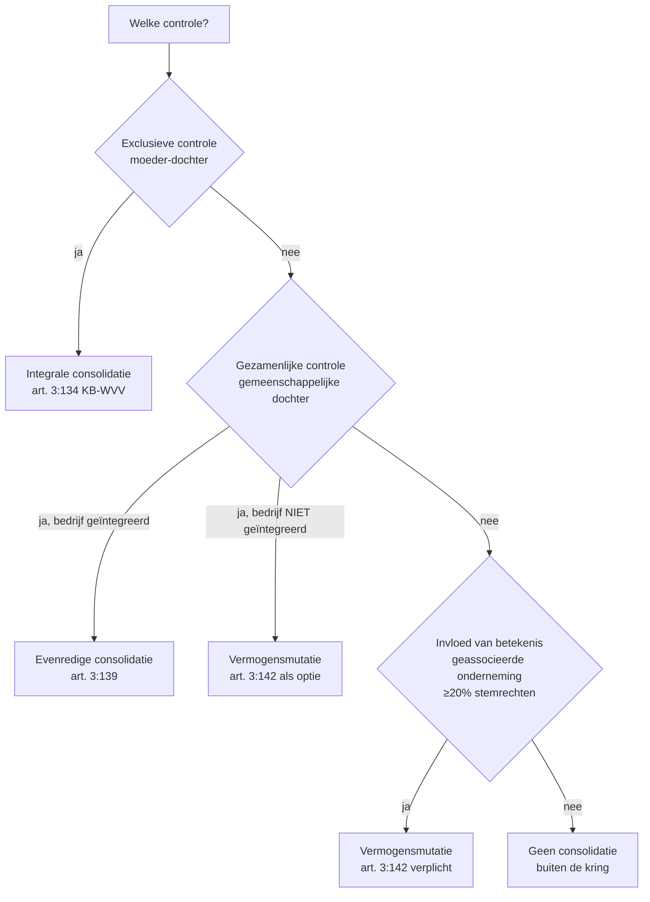

_Kader_ · ook: consolidatietechnieken

## Definitie

Consolidatiemethoden zijn de drie technieken waarmee een gecontroleerde of geassocieerde entiteit in de geconsolideerde jaarrekening wordt opgenomen: (1) integrale consolidatie — 100 % opname van activa, passiva, opbrengsten en kosten + aparte rubriek 'belangen van derden' voor de minderheidsaandeelhouders; (2) evenredige consolidatie (proportionele integratie) — opname in verhouding tot het deelnemingspercentage; (3) vermogensmutatiemethode — één lijn op de balans (deel in eigen vermogen) en één lijn in de resultatenrekening (aandeel in resultaat). Welke methode geldt, hangt af van het type controle (exclusief · gezamenlijk · invloed van betekenis), niet van een vrije keuze van de boekhouder.

<small>📖 KB-WVV — art. 3:124 — _wettekst_ · KB-WVV — art. 3:134 — _wettekst_ · KB-WVV — art. 3:139 — _wettekst_ · KB-WVV — art. 3:142 — _wettekst_</small>

## Substantie

Elke methode weerspiegelt een andere mate van groepsintegratie. Integrale consolidatie behandelt de dochter als 'volledig deel van het ons' — alle cijfers tellen mee, ook al hebben minderheidsaandeelhouders een belang (zichtbaar in 'belangen van derden'). Evenredige consolidatie behandelt een gemeenschappelijke dochter als 'half-deel van het ons' — enkel het aandeel in elke balanspost komt op de groepsbalans. Vermogensmutatie is het meest afstandelijk: de deelneming blijft één lijn, maar wordt jaarlijks bijgewerkt voor de wijziging in het eigen vermogen van de geassocieerde onderneming (one-line consolidation). De keuze tussen evenredig en vermogensmutatie voor gemeenschappelijke dochters hangt af van de mate van bedrijfs-integratie.

<small>🔗 KB-WVV — art. 3:134 — _wettekst_ · KB-WVV — art. 3:139 — _wettekst_ · KB-WVV — art. 3:142 — _wettekst_ · CBN-advies 2013/3 — Praktische uitwerking — _cbn_ · claude-sonnet-4-5 — _ai_model_ — (2026-05-28)</small>

## Rationale

De gradatie integraal → evenredig → vermogensmutatie volgt rechtstreeks uit de aard van de controle. Hoe sterker de moeder de beslissingen van de dochter dicteert, hoe meer haar cijfers tot het 'wij' van de groep behoren. Het schema vermijdt twee uitersten: (1) alle deelnemingen integraal opnemen — zou de groep doen lijken op niet-gecontroleerd vermogen; (2) alle deelnemingen tegen historische kostprijs laten staan — zou risico's en opbrengsten van de groep maskeren. Het schema operationaliseert het getrouw beeld via een controle-trapje.

<small>🔗 KB-WVV — art. 3:105 — _wettekst_ · claude-sonnet-4-5 — _ai_model_ — (2026-05-28)</small>

## Gebruikscontext

**Status**: `in-voege` · basis: KB-WVV art. 3:121 e.v. (algemene beginselen) + art. 3:124-3:142 (uitwerking per methode)

Stabiel sinds KB van 29 april 2019 (uitvoering WVV). Inhoudelijke continuïteit met KB van 30 januari 2001.

**✅ Voor**
- 🔗 Elke vennootschap die een geconsolideerde jaarrekening opstelt onder Belgisch GAAP. Voor IFRS-rapporteerders gelden IFRS 10 (control + integrale), IFRS 11 (joint arrangements) en IAS 28 (equity method) als parallelle structuur met andere terminologie maar gelijkaardige logica.

## Sub-concepten

### 📦 Beslissingsboom — controle-niveau bepaalt methode

#### Definitie

Stap 1 — type controle bepalen (zie record `controle-bij-consolidatie`). Stap 2 — methode toepassen volgens de wettelijke koppeling. Vermogensmutatie is verplicht voor geassocieerde ondernemingen (art. 1:21 WVV) en alternatief mogelijk in twee gevallen: (a) controle in feite bij strijdigheid met getrouw beeld; (b) gemeenschappelijke dochter wiens bedrijf niet nauw geïntegreerd is met de groep.

<small>📖 KB-WVV — art. 3:124 — _wettekst_ · WVV — art. 1:20 — _wettekst_ · WVV — art. 1:21 — _wettekst_</small>

### 📦 Vergelijking 3 methoden — kenmerken-matrix

#### Definitie

De drie methoden verschillen in opnamepercentage van activa/passiva, behandeling van minderheidsbelangen, presentatie in balans en resultatenrekening, en eliminatie van intercompany-transacties.

<small>🔗 KB-WVV — art. 3:134 — _wettekst_ · KB-WVV — art. 3:139 — _wettekst_ · KB-WVV — art. 3:142 — _wettekst_ · claude-sonnet-4-5 — _ai_model_ — (2026-05-28)</small>

| Kenmerk | Integrale consolidatie | Evenredige consolidatie | Vermogensmutatie |
|---|---|---|---|
| Controle-niveau | Exclusieve controle (>50 %) | Gezamenlijke controle (gemeenschappelijke dochter) | Invloed van betekenis (≥20 %) |
| Bron KB-WVV | art. 3:134 | art. 3:139 | art. 3:142 |
| Opname activa/passiva | 100 % integraal | % van deelneming lijn per lijn | Niet — één lijn 'deelneming' |
| Opname omzet/kosten | 100 % | % van deelneming | Niet — één lijn 'aandeel in resultaat' |
| Minderheidsbelangen | Aparte rubriek 'belangen van derden' op passief | Niet — proportioneel opgenomen | n.v.t. |
| Eliminatie intercompany | Volledig | Naar verhouding deelneming | Beperkt — via aandeel-in-resultaat |
| Consolidatieverschil | Integraal toegewezen aan activa/passiva (art. 3:130) | Idem, naar verhouding | Slechts toewijzen 'voor zover mogelijk' (art. 3:142 §3) |
| Bijnaam in praktijk | full consolidation | proportional consolidation | one-line consolidation / equity method |

## Voorbeelden

> [!example]- Methode-keuze bij Aurelia Holding NV
> _Aurelia Holding NV (consoliderende moeder) heeft drie deelnemingen:
> - Zelena Bio NV: 80 % stemrechten + bestuursmeerderheid → exclusieve controle
> - Vermeer Logistics SRL: 50 % stemrechten samen met groep DEF SA → gezamenlijke controle, bedrijf nauw geïntegreerd met groep
> - GreenLab Research BV: 25 % stemrechten, recht op één bestuurszetel → invloed van betekenis_
>
> | Deelneming | Type controle | Methode | Wat staat in geconsolideerde balans? |
> |---|---|---|---|
> | Zelena Bio NV | Exclusief | Integraal | 100 % activa/passiva + 'belangen van derden' (20 %) op passief |
> | Vermeer Logistics SRL | Gezamenlijk + geïntegreerd | Evenredig | 50 % van elke balanspost lijn per lijn |
> | GreenLab Research BV | Invloed van betekenis | Vermogensmutatie | Eén lijn 'deelneming' = 25 % × eigen vermogen GreenLab |
>
> <small>🔗 KB-WVV — art. 3:124 — _wettekst_ · claude-sonnet-4-5 — _ai_model_ — (2026-05-28)</small>

> [!example]- Cijferillustratie vermogensmutatie
> _GreenLab Research BV heeft op afsluitdatum een eigen vermogen van 400.000 EUR (kapitaal 100.000 + reserves 200.000 + resultaat boekjaar 100.000). Aurelia bezit 25 %._
>
> **Berekening:**
>
> - Stap 1 — aandeel in eigen vermogen: 25 % × 400.000 = 100.000 EUR.
> - Stap 2 — aandeel in resultaat boekjaar: 25 % × 100.000 = 25.000 EUR.
> - Stap 3 — boekwaarde deelneming in geconsolideerde balans: 100.000 EUR (vervangt historische kostprijs).
> - Stap 4 — in geconsolideerde resultatenrekening: rubriek 'aandeel in resultaat van geassocieerde ondernemingen' = 25.000 EUR (vervangt eventuele dividenden van GreenLab).
>
> → **Resultaat**: Eén lijn op balans (100.000 EUR), één lijn in resultatenrekening (25.000 EUR) — vandaar 'one-line consolidation'. Bij integrale opname zou daarentegen 25 % van elke balanslijn van GreenLab in de cijfers verschijnen.
>
> <small>🔗 KB-WVV — art. 3:142 — _wettekst_ · claude-sonnet-4-5 — _ai_model_ — (2026-05-28)</small>

## Valkuilen

> [!warning]- Methode-keuze 'optimaliseren' los van controle-realiteit
> **Verkeerde assumptie**: De moedervennootschap kan zelf kiezen welke methode 'het beste lijkt' voor een dochter (bv. vermogensmutatie om de balansomvang klein te houden).
>
> **Kernpunt**: De methode volgt dwingend uit het type controle. Exclusieve controle → integraal, gezamenlijk geïntegreerd → evenredig, invloed van betekenis → vermogensmutatie. Enkel bij gezamenlijke controle van niet-geïntegreerde bedrijven is er keuze tussen evenredig en vermogensmutatie (art. 3:142 §1, derde lid KB-WVV).
>
> <small>📖 KB-WVV — art. 3:124 — _wettekst_ · KB-WVV — art. 3:142 — _wettekst_</small>

> [!warning]- Vermogensmutatie verwarren met deelnemings-waardering in enkelvoudige jaarrekening
> **Verkeerde assumptie**: Vermogensmutatie is gewoon de deelnemings-rekening (klasse 28) in de enkelvoudige jaarrekening.
>
> **Kernpunt**: In de enkelvoudige jaarrekening staan deelnemingen tegen aanschaffingswaarde (eventueel met waardeverminderingen). De vermogensmutatiemethode in de geconsolideerde jaarrekening vervangt die boekwaarde door het aandeel in het eigen vermogen, dat jaarlijks meeschuift met het resultaat van de deelneming. Verschillend boekhoudkundig effect: in vermogensmutatie verschijnt het aandeel in winst zelfs zónder dividenduitkering.
>
> <small>🔗 KB-WVV — art. 3:142 — _wettekst_ · CBN-advies 2013/3 — Praktische uitwerking — _cbn_</small>

> [!warning]- Consortium-leden = enkel integrale consolidatie
> **Verkeerde assumptie**: Bij een consortium kan elke methode (integraal, evenredig of vermogensmutatie) tussen de leden worden gekozen.
>
> **Kernpunt**: Consortium-leden worden VERPLICHT integraal opgenomen (CBN-advies 2022/09, op grond van art. 3:24 lid 2 WVV + art. 3:124, 1° KB-WVV). De andere methoden gelden enkel voor dochters van consortium-leden, niet voor de consortium-leden onderling.
>
> <small>📖 CBN-advies 2022/09 — Consolidatiemethode — _cbn_ · WVV — art. 3:24, tweede lid — _wettekst_</small>

## Speelruimtes

### 🎚️ Gemeenschappelijke dochter zonder geïntegreerd bedrijf — evenredig of vermogensmutatie?

## Accountant-perspectieven

### Consoliderende vennootschap

_De accountant die de groep adviseert bij keuze en toepassing van consolidatiemethoden._

#### 📒 Boekhouder

##### 👣 Methode toewijzen per entiteit in de kring

Per dochter in de kring: (1) controle-niveau bepalen op basis van bestuurspositie + stemrechten + aandeelhoudersovereenkomsten; (2) methode toepassen volgens de wettelijke koppeling; (3) bij gezamenlijke controle: expliciet documenteer of het bedrijf 'nauw geïntegreerd' is met de groep om de keuze evenredig vs vermogensmutatie te verantwoorden; (4) eens gekozen, stelselmatig aanhouden — methode-wijziging is uitzondering en vereist motivering in de toelichting.

<small>🔗 KB-WVV — art. 3:124 — _wettekst_ · KB-WVV — art. 3:142 — _wettekst_ · claude-sonnet-4-5 — _ai_model_ — (2026-05-28)</small>

#### 🔍 Auditor

##### 👣 Audit van methode-keuze

De commissaris toetst de methode-keuze tegen het werkelijke controle-niveau. Risico-zone: dochters die net boven of onder de 50 %-grens zitten en dochters met aandeelhoudersovereenkomsten die de juridische stemverhouding overrulen. Bij vermogensmutatie nakijken of geen verkapte exclusieve controle bestaat (bv. via management-contract). De keuze van methode kan groepscijfers substantieel beïnvloeden — afwijking signaleren in management letter.

<small>🔗 ISA 600 — Audits of Group Financial Statements — §24-27 — _norm_ · claude-sonnet-4-5 — _ai_model_ — (2026-05-28)</small>

## Verder lezen (scope-out)

- → Integrale consolidatie (detail) → [[integrale-consolidatie]] _(moet-verwijzen)_
- → Evenredige consolidatie (detail) → [[evenredige-consolidatie]] _(moet-verwijzen)_
- → Vermogensmutatiemethode (detail) → [[vermogensmutatiemethode]] _(moet-verwijzen)_
- → Controle-bij-consolidatie (input controle-niveau) → [[controle-bij-consolidatie]] _(moet-verwijzen)_

## Relaties

### `valt_onder`
- [[geconsolideerde-jaarrekening]]
### `bevat`
- [[integrale-consolidatie]]
- [[evenredige-consolidatie]]
- [[vermogensmutatiemethode]]
### `vereist`
- [[controle-bij-consolidatie]] — Het controle-niveau is de input voor de methode-keuze.
