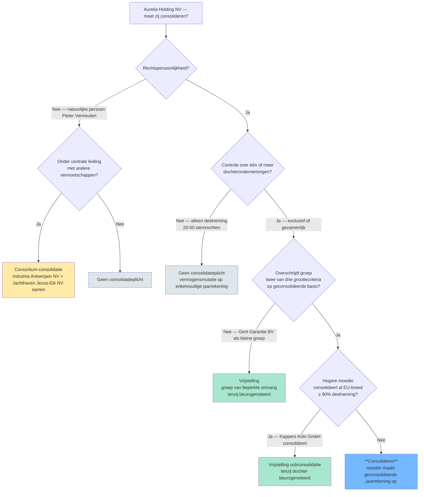

# Moet ik consolideren? — Beslisboom 🤖

De vraag 'moet mijn cliënt een geconsolideerde jaarrekening opmaken' wordt nooit door één criterium beantwoord. Vijf elementen werken samen: bestaat er controle? heeft de moeder rechtspersoonlijkheid? overschrijdt de groep de groottecriteria? geldt er een vrijstelling? is de groep een consortium? Dit synthese-record volgt de wettelijke beslissingsvolgorde en koppelt elke vraag aan het concept-record dat het beantwoordt.

## Vergelijkingstabel

| Stap | Toets | Welk concept? | Bij 'ja' | Bij 'nee' |
|---|---|---|---|---|
| 1 | Is de moeder een vennootschap met rechtspersoonlijkheid? | [[moedervennootschap]] | Door naar stap 2 | Geen consolidatieplicht (natuurlijke persoon → eventueel consortium-piste) |
| 2 | Bestaat er controle (in rechte of in feite) over één of meer dochters? | [[controle]] | Door naar stap 3 | Geen consolidatieplicht |
| 3 | Of: zijn er meerdere vennootschappen onder centrale leiding zonder onderlinge moeder-dochter? | [[consortium]] | Consortium-consolidatie (horizontaal), door naar stap 4 | Verticale groep, door naar stap 4 |
| 4 | Overschrijdt de groep meer dan één van de groottecriteria op geconsolideerde basis? | [[groottecriteria-consolidatie]] · [[groep-van-beperkte-omvang]] | Door naar stap 5 | Vrijstelling 'groep van beperkte omvang' — geen consolidatieplicht (tenzij beursgenoteerd) |
| 5 | Wordt de moeder zelf al opgenomen in een gelijkwaardige geconsolideerde jaarrekening hogerop in de EU (≥ 90 % deelneming)? | [[vrijstelling-subconsolidatie]] | Vrijstelling subconsolidatie — moeder consolideert niet zelf, tenzij dochter beursgenoteerd | **Consolideren** — moeder maakt geconsolideerde jaarrekening op |

## Beslisboom

## Kerninzichten

- Geen enkele moeder is automatisch consolidatieplichtig — er zijn altijd vijf parallelle toetsen die elk een 'nee' kunnen geven. Een examenvraag die zegt 'moeder X heeft controle over dochter Y, dus moet zij consolideren' kapt de redenering te vroeg af. 🤖
  - _Rationale_: De wettelijke architectuur (WVV art. 3:22-3:24 + art. 1:26) bouwt de plicht op uit cumulatieve voorwaarden + uitzonderingen.
- Een natuurlijke persoon kan nooit moeder zijn (geen rechtspersoonlijkheid), maar haar gecontroleerde vennootschappen kunnen samen wel een consortium vormen. De plicht verschuift dan van één entiteit naar 'de leden samen'. 🤖
  - _Rationale_: Consortium-figuur in WVV art. 3:24 lost juist deze situatie op.
- De groottecriteria zijn 'op geconsolideerde basis' — je moet dus een fictieve geconsolideerde balans opbouwen om te beslissen of je een echte moet maken. Dat is geen circulariteit maar een toetscriterium. 🤖
  - _Rationale_: Veelvoorkomende stagiair-verwarring: 'maar ik kan geen geconsolideerde balans maken zonder geconsolideerd te hebben' — antwoord: het is een aggregatie-oefening, niet een formele consolidatie.
- Beursnotering breekt zowel de 'groep van beperkte omvang'-vrijstelling als de subconsolidatie-vrijstelling. Voor genoteerde vennootschappen geldt: altijd consolideren, drempels of hogere moeder doen er niet toe. ⚖️
  - _Rationale_: WVV art. 1:26 §3 + KB WVV-specifieke bepalingen.

## Verwante competenties

- [[competenties/bepalen-consolidatieverplichting]]
- [[competenties/afbakenen-consolidatiekring]]

## Bronnen

[^1]: `WVV__art_3_22`
[^2]: `WVV__art_3_24`
[^3]: `WVV__art_1_26`
[^4]: `KB-WVV-2019__art_3_96`
