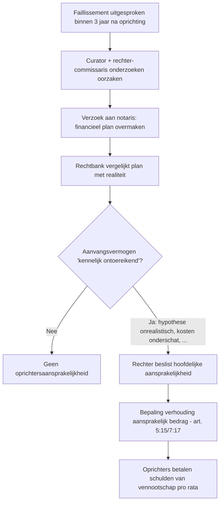

_Instrument_ · ook: financial plan · plan financier

## Definitie

Het **financieel plan** is een **verplicht document** dat de oprichters van een **BV, NV of CV** vóór de notariële akte van oprichting moeten overhandigen aan de notaris (art. 5:4 BV / 6:5 CV / 7:3 NV WVV). Het verantwoordt het **aanvangsvermogen** (BV/CV) of **aanvangskapitaal** (NV) in het licht van de voorgenomen activiteit over een **periode van ten minste twee jaar** — voor de CV is dit drie jaar. Het plan blijft in **bewaring bij de notaris**, is **niet openbaar** maar wordt op vordering van de rechter overgemaakt bij een faillissement binnen drie jaar (art. 5:15 / 7:17 WVV).

<small>📖 WVV — art. 5:4 — _wettekst_ · WVV — art. 7:3 — _wettekst_ · WVV — art. 6:5 — _wettekst_ · CBN-advies 2019/12 — Financieel plan - begroting — _advies_ — (2019-11-06)</small>

## Substantie

Het financieel plan is het **centrale anti-misbruik-instrument** van het WVV: omdat de BV en CV sinds 2019 geen wettelijk minimumkapitaal meer hebben, wordt de bescherming van schuldeisers verplaatst naar een **realistische prospectie** vóór de oprichting. Het bestuursorgaan moet aantonen dat de vennootschap een redelijk voldoende vermogen heeft om gedurende minstens twee jaar (BV/NV) of drie jaar (CV) haar verplichtingen na te komen. Bij faillissement binnen drie jaar wordt het financieel plan **vergeleken met de werkelijke evolutie**: kennelijke ontoereikendheid leidt tot **persoonlijke en hoofdelijke aansprakelijkheid** van de oprichters voor het ontbrekende deel.

<small>📖 WVV — art. 5:15 — _wettekst_ · WVV — art. 7:17 — _wettekst_</small>

## Rationale

De **ratio** van het financieel plan is tweeledig: (1) **bescherming van schuldeisers en de oprichters zelf** tegen onbezonnen oprichtingen — de verplichting dwingt tot realistische prognose vóór engagement; (2) **vervanging van het minimumkapitaal als 'minimum-dekking'** — sinds de BV-kapitaalafschaffing (WVV 2019) is het plan het enige formele garantie-instrument. De wet legt minimum-inhoud op (art. 5:4 § 2 WVV) maar geen rigide vorm — zo blijft het plan praktisch hanteerbaar voor elke ondernemingsschaal.

<small>🔗 WVV — art. 5:3, 5:4 — _wettekst_ · cluster-extract-agent (opus-4.7-1M) — _ai_model_ — (2026-05-28)</small>

## Gebruikscontext

**Status**: `in-voege` · sinds **2019-05-01** · basis: WVV (Wet 23-03-2019)

WVV verstrengde de inhoudelijke vereisten (art. 5:4 § 2 — 7 verplichte elementen, was 5 onder W.Venn. art. 215). Voor CV werd de termijn van 2 → 3 jaar verlengd.

**✅ Voor**
- 📖 Verplicht bij **oprichting van BV, NV of CV** — vóór de notariële akte aan de notaris bezorgen.

**🚫 Niet voor**
- 📖 Niet vereist bij oprichting van **VOF, CommV, maatschap, VZW, stichting** (geen kapitaalbescherming-context — onbeperkte aansprakelijkheid of ander statuut). VZW moet wel een **jaarlijkse begroting** opmaken (art. 9:23 WVV) maar dit is geen financieel plan in WVV-zin.

**📋 Voorwaarden**
- 📖 **Minimum-inhoud (art. 5:4 § 2 WVV)** — 7 elementen verplicht: (1) nauwkeurige beschrijving voorgenomen activiteit; (2) overzicht financieringsbronnen (eigen middelen + krediet) met zekerheden; (3) **prognose-balans** (openingsbalans) na 12 en 24 maanden; (4) **prognose-resultatenrekening** na 12 en 24 maanden; (5) begroting verwachte inkomsten en uitgaven over ten minste 2 jaar; (6) beschrijving van hypothese-aannames over verwachte omzet en rentabiliteit; (7) in voorkomend geval: naam van externe deskundige die heeft geholpen.
- 📖 **Bewaring bij notaris** — de notaris bewaart het plan **5 jaar** vanaf de oprichting; alleen op vordering van rechter-commissaris of procureur des Konings overgemaakt aan de rechtbank.

**⏹ Trigger einde**
- 📖 Verplichting eindigt 3 jaar na oprichting (max-termijn waarbinnen oprichtersaansprakelijkheid kan worden ingeroepen — art. 5:15 / 7:17 WVV). Na 3 jaar geen aansprakelijkheid meer op basis van financieel plan.

**⚠️ Risico**
- 📖 **Oprichtersaansprakelijkheid** — bij faillissement binnen drie jaar wegens **kennelijk ontoereikend aanvangsvermogen** zijn oprichters hoofdelijk aansprakelijk voor de schulden van de vennootschap, **naar een verhouding die de rechter vaststelt** (art. 5:15, 2° / 7:17, 2° WVV). De toets is **objectief retrospectief** maar rekening houdend met wat een redelijke oprichter ex ante kon voorzien.
- 🔗 **Ontbreken van financieel plan** = oprichting **niet nietig** (in tegenstelling tot oude W.Venn.), maar oprichters worden automatisch geacht aansprakelijk te zijn — de bewijslast keert om.

## Bouwstenen

### 📜 Minimum-inhoud — 7 elementen (art. 5:4 § 2 WVV)

**Verplichte 7 elementen** (art. 5:4 § 2 WVV — equivalent in 6:5 + 7:3):

1. **Beschrijving voorgenomen activiteit** — duidelijke aard van het project (sector, doelmarkt, product/dienst, business model).
2. **Overzicht financieringsbronnen** — eigen inbreng (geld/natura), bankkredieten, leveranciers-krediet, eventueel subsidies — met vermelding van eventuele zekerheden (hypotheek, pand, persoonlijke borg).
3. **Prognose-openingsbalans** na 12 en 24 maanden — geprojecteerde activa-passiva.
4. **Prognose-resultatenrekening** na 12 en 24 maanden — verwachte omzet, kosten, resultaat.
5. **Begroting verwachte inkomsten en uitgaven** over ten minste 2 jaar — cashflow-prognose.
6. **Hypothese-aannames** — uitleg van de aannames inzake omzetgroei, marktpenetratie, rentabiliteit (= 'verantwoordingsplicht').
7. **Naam externe deskundige** (boekhouder, accountant, fiscalist, business consultant) die heeft bijgestaan — facultatief vermelden maar in praktijk vaak verplicht 'in voorkomend geval'.

Geen wettelijk model of standaardformulier — wel inhoudelijke minimumvereisten.

<small>📖 WVV — art. 5:4, § 2 — _wettekst_</small>

### 📜 Termijn financieel plan per rechtsvorm

**Termijnen prognose-periode**:

| Vorm | Minimumperiode | Wettelijke basis |
|---|---|---|
| BV | 2 jaar | art. 5:4 § 1 WVV |
| NV | 2 jaar | art. 7:3 WVV |
| CV | 3 jaar | art. 6:5 WVV |
| VOF/CommV | n.v.t. (geen plan vereist) | — |
| Maatschap | n.v.t. | — |
| VZW | jaarlijkse begroting (geen plan) | art. 9:23 WVV |

**CV-uitzondering**: vereiste 3 jaar wordt verklaard door coöperatief karakter — meer tijd nodig om coöperatief project te bestendigen.

<small>📖 WVV — art. 5:4, 6:5, 7:3 — _wettekst_</small>

### 👣 3-jaar-faillissementstoets — werking

**Procedure oprichtersaansprakelijkheid op basis van financieel plan**:

**Toetsings-criteria** voor 'kennelijk ontoereikend':
- Was het aanvangsvermogen realistisch in verhouding tot verwachte cashbehoefte?
- Waren de inkomstenprognoses realistisch (niet overdreven optimistisch)?
- Waren de kosten en investeringen volledig opgenomen?
- Waren financieringsbronnen reëel beschikbaar?

<small>📖 WVV — art. 5:15 — _wettekst_ · WVV — art. 7:17 — _wettekst_</small>

## Voorbeelden

> [!example]- BV TechStart — voorbeeld financieel plan (verkort)
> _Oprichting BV TechStart (software development): Anna + Bart, inbreng totaal €50.000. Verwachte activiteit: webdevelopment voor KMO's. Plan geldt voor 24 maanden._
>
> **📋 Prognose-resultatenrekening (samenvatting)**
>
> | Element | Jaar 1 (€) | Jaar 2 (€) |
>
> | --- | --- | --- |
>
> | Omzet diensten (klasse 70) | 120.000 | 200.000 |
>
> | Diensten + diverse goederen (klasse 61) | -30.000 | -45.000 |
>
> | Bezoldigingen (klasse 62) — 1 zelfstandige + 1 werknemer Y2 | -50.000 | -80.000 |
>
> | Afschrijvingen (klasse 63) | -5.000 | -6.000 |
>
> | Bedrijfsresultaat | 35.000 | 69.000 |
>
> | VenB (25% kmo of 20% bij voldoende bezoldiging) | -7.000 | -13.800 |
>
> | Netto-resultaat | 28.000 | 55.200 |
>
> **📋 Prognose-balans na 24 maanden**
>
> | Rubriek | Activa (€) | Passiva (€) |
>
> | --- | --- | --- |
>
> | Materiële vaste activa (klasse 23) — laptops, server | 12.000 |  |
>
> | Handelsvorderingen (klasse 40) | 25.000 |  |
>
> | Liquide middelen (klasse 5) | 133.200 |  |
>
> | Onbeschikbare inbreng (klasse 11) |  | 50.000 |
>
> | Overgedragen winst (klasse 14) = 28.000 + 55.200 |  | 83.200 |
>
> | Leverancierschulden (klasse 44) |  | 10.000 |
>
> | Bankschulden korte termijn (klasse 43) |  | 27.000 |
>
> | TOTAAL | 170.200 | 170.200 |
>
> **Activiteit**: ontwikkeling van webapplicaties voor KMO's, focus op administratieve automatisering. Doelmarkt: Vlaamse KMO's 5-50 werknemers.
>
> **Financieringsbronnen**: inbreng €50.000 (volledig in geld). Geen externe financiering bij start; in jaar 2 voorzien: bankkrediet €20.000 voor investering in serveruitbreiding (mogelijk vanaf eind Y1 wanneer rentabiliteit blijkt).
>
> **Aannames**:
> - Y1: 6 maanden netwerk-opbouw → 15 klanten × €600/mnd gemiddeld; jaar 2: doorgroei naar 25 klanten × €700/mnd
> - Geen significante R&D-investering in jaar 1 (open-source frameworks)
> - Anna: zelfstandige bezoldiging €30k Y1, €40k Y2; Bart deeltijds Y1 (€20k) → voltijds Y2
> - Werknemer aangenomen halfweg Y2 (€40k bruto loonkost)
>
> **Externe deskundige**: opmaak begeleid door accountantskantoor X.
>
> <small>🔗 WVV — art. 5:4 — _wettekst_ · cluster-extract-agent (opus-4.7-1M) — _ai_model_ — (2026-05-28)</small>

> [!example]- Case: financieel plan dat niet voldoet — oprichtersaansprakelijkheid
> _BV OptimistCo werd opgericht in januari 2024 met inbreng €10.000. Plan voorzag €500.000 omzet jaar 1 zonder externe financiering, geen rekening met aanloopperiode, geen prognose-balans. Failliet maart 2025 met schulden €120.000._
>
> **📋 Tekortkomingen plan + rechtbank-oordeel**
>
> | Tekortkoming | Standaard | Conclusie rechter |
>
> | --- | --- | --- |
>
> | Inbreng €10.000 vs verwachte cashflow-behoefte €60.000 in Y1 | Realistisch | Kennelijk ontoereikend |
>
> | Omzet-prognose €500.000 zonder klantenlijst of pijplijn-bewijs | Realistisch + onderbouwd | Overdreven optimistisch |
>
> | Geen prognose-balans | Verplicht (art. 5:4 § 2, 3°) | Plan onvolledig |
>
> | Geen externe deskundige geconsulteerd | Aanbevolen, niet verplicht | Aggraverende factor |
>
> → **Rechter veroordeelt oprichters hoofdelijk tot 70% van de openstaande schulden = €84.000, te verdelen pro rata aandelenparticipatie. Notaris had het plan overgemaakt op verzoek rechter-commissaris (art. 5:15 WVV).**
>
> <small>🔗 WVV — art. 5:15 — _wettekst_</small>

> [!example]- Vergelijking VZW-begroting vs BV-financieel-plan
> **📋 Financieel plan (BV/NV/CV) vs jaarlijkse begroting (VZW)**
>
> | Aspect | Financieel plan (WVV art. 5:4) | Begroting VZW (WVV art. 9:23) |
>
> | --- | --- | --- |
>
> | Wanneer opstellen? | Eenmalig vóór oprichting | Jaarlijks vóór AV (binnen 6 mnd na balansdatum) |
>
> | Periode | Min. 2 jaar (BV/NV), 3 jaar (CV) | 1 jaar |
>
> | Wettelijke vorm | 7 minimumelementen | Vrije vorm; vaak in JR-formaat |
>
> | Bewaring | Bij notaris 5 jaar | Bij vereniging/AV-stukken |
>
> | Sanctie ontbreken | Oprichtersaansprakelijkheid (3 jaar) | AV kan weigeren te decharge |
>
> | Externe controle? | Geen verplichte tussenkomst | Verkort overzicht naar AV |

## Valkuilen

> [!warning]- Financieel plan = formaliteit zonder reëel belang
> **Verkeerde assumptie**: Het financieel plan is een notarismandaat-formaliteit die door de notaris wordt opgesteld; oprichters hoeven het niet zelf op te volgen.
>
> **Kernpunt**: Het plan is **het bewijsmiddel** bij oprichtersaansprakelijkheid (art. 5:15/7:17 WVV). Bij faillissement binnen 3 jaar wordt het door de rechtbank gebruikt om te oordelen over de hoofdelijke aansprakelijkheid. Een slordig of onrealistisch plan is rechtstreeks belastend bewijs tegen de oprichters.
>
> <small>📖 WVV — art. 5:15 — _wettekst_</small>

> [!warning]- Plan moet de werkelijkheid voorspellen
> **Verkeerde assumptie**: Als de werkelijke evolutie afwijkt van het plan, zijn de oprichters automatisch aansprakelijk.
>
> **Kernpunt**: De wet vereist een **ex ante redelijke prognose**, niet een correcte voorspelling. Aansprakelijkheid ontstaat alleen wanneer het aanvangsvermogen 'kennelijk ontoereikend' was — d.w.z. dat een redelijke oprichter dit op het moment van oprichting had moeten zien. Realistische plannen met onverwachte tegenvallers (covid, energiecrisis) ontsnappen aan aansprakelijkheid.
>
> <small>📖 WVV — art. 5:15, 2° — _wettekst_</small>

> [!warning]- Ontbreken plan = nietig
> **Verkeerde assumptie**: Indien het financieel plan ontbreekt of onvolledig is, is de oprichting nietig.
>
> **Kernpunt**: WVV 2019 schrapte de nietigheid-sanctie. Het ontbreken van het plan leidt tot **bewijslast-omkering** bij oprichtersaansprakelijkheid: de oprichters worden geacht aansprakelijk te zijn, tenzij zij kunnen aantonen dat het aanvangsvermogen wel toereikend was.
>
> <small>🔗 WVV — art. 5:4, 5:15 — _wettekst_ · cluster-extract-agent (opus-4.7-1M) — _ai_model_ — (2026-05-28)</small>

## Accountant-perspectieven

### Vanuit de oprichter — financieel plan opstellen

#### 🧭 Adviseur

##### 👣 Opmaak financieel plan — stappenplan

**Stappenplan accountant**:

1. **Activiteitsbeschrijving** — sector + markt + business model afkloppen met oprichter; check business plan / pitch deck.
2. **Investeringsbehoefte** schatten (CapEx) — investeringen materieel/IT, opstart-marketing, eerste maand-werkkapitaal.
3. **Werkkapitaal-behoefte** — DSO (klanten), DIO (voorraad), DPO (leveranciers) → cyclus berekenen.
4. **Omzetprognose** — bottom-up (klanten × prijs × volume) ipv top-down (% markt) — beter onderbouwd.
5. **Kostenstructuur** — vaste + variabele kosten apart; rekening houden met aanloopperiode (lagere omzet eerste 3-6 mnd).
6. **Cashflow-prognose** — maandelijks Y1, kwartaalbasis Y2; identificeer kritieke cash-momenten.
7. **Financieringsmix** — inbreng + krediet + leveranciers — controleer of inbreng minimum cashbehoefte dekt.
8. **Stress-test** — alternatief scenario met -20% omzet → blijft vennootschap solvabel?
9. **Documentatie** — alle aannames in een proza-sectie verantwoorden + bron-vermelding (markt-rapporten, vergelijkbare cases).
10. **Externe-deskundige-vermelding** — als accountant mag/moet je je naam vermelden (transparantie + reputatiekapitaal).

<small>🔗 WVV — art. 5:4, § 2 — _wettekst_ · cluster-extract-agent (opus-4.7-1M) — _ai_model_ — (2026-05-28)</small>

## Verder lezen (scope-out)

- → Oprichting van een vennootschap als trigger → [[oprichting-vennootschap]] _(moet-verwijzen)_
- → Oprichtersaansprakelijkheid bij kennelijk ontoereikend financieel plan → [[oprichtersaansprakelijkheid]] _(moet-verwijzen)_
- → Ondernemingsvormen — welke vormen vereisen financieel plan? → [[ondernemingsvormen]] _(moet-verwijzen)_

## Relaties

### `valt_onder`
- [[oprichting-vennootschap]]
### `vereist`
- [[ondernemingsvormen]]
### `vergelijkbaar_met`
- [[oprichtersaansprakelijkheid]]
    - **Gelijkenissen**:
        - Beide zijn onderdeel van het WVV-bescherming-systeem post-2019
        - Beide focussen op de 3-jaar-periode na oprichting
    - **Verschillen**:
        - Financieel plan = ex ante document; oprichtersaansprakelijkheid = ex post sanctie
        - Financieel plan is een verplichting (instrument); oprichtersaansprakelijkheid is een gevolgregime
    - ⚠️ **Verwarringsrisico**: Studenten zien financieel plan vaak los van aansprakelijkheid, terwijl ze samen één bescherming-mechanisme vormen.
