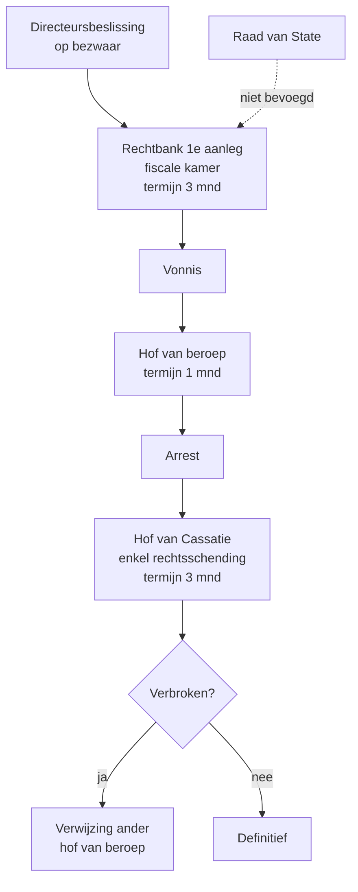

_Procedure_ · ook: fiscale rechtsgang voor de rechter · fiscaal geding

## Definitie

De gerechtelijke fase is het deel van de fiscale procedure dat zich afspeelt voor de gewone rechter — de rechtbank van eerste aanleg (fiscale kamer) in eerste instantie, het hof van beroep in hoger beroep, en het Hof van Cassatie in laatste instantie. Voor inkomstenbelastingen is de gewone rechter exclusief bevoegd (Ger.W. art. 569 16°); de Raad van State heeft geen bevoegdheid. De fase wordt geopend door een verzoekschrift tegen de directeursbeslissing of tegen het stilzitten van de fiscus.

<small>📖 Ger.W. — art. 569 16° + art. 1385decies — _wettekst_</small>

## Substantie

Voor de accountant is de gerechtelijke fase een grens: het dossier wordt overgedragen aan een advocaat (advocatenmonopolie voor pleiten). De accountant blijft cruciaal als technisch dossierbouwer — hij levert de boekhoudkundige onderbouwing, vaak in samenspraak met een fiscaal advocaat. De rechter heeft volle rechtsmacht: hij kan zowel feitelijke als juridische aspecten herzien. Procedures duren typisch 1-3 jaar in eerste aanleg en 2-4 jaar in hoger beroep.

<small>🔗 cluster-extract-agent (opus-4.7-1M) — _ai_model_ — (2026-05-28)</small>

## Rationale

De ratio is de scheiding der machten: een onafhankelijke rechter beslist over fiscale geschillen, niet de fiscus zelf. De keuze voor de gewone rechter (en niet de Raad van State) volgt uit het beginsel dat fiscale aanslagen de eigendom van de burger raken (art. 144 Grondwet: geschillen over burgerlijke rechten → gewone rechter). De cassatie-instantie waarborgt rechtseenheid: ze beoordeelt enkel rechtsschendingen, niet de feiten.

<small>🔗 Grondwet — art. 144 — _wettekst_ · cluster-extract-agent (opus-4.7-1M) — _ai_model_ — (2026-05-28)</small>

## Gebruikscontext

**Status**: `in-voege` · basis: Ger.W. art. 569 16° + art. 1385decies-undecies

**▶️ Trigger start**
- 📖 (1) Kennisgeving van de directeursbeslissing op het bezwaar → 3 maanden om verzoekschrift in te dienen bij de rechtbank van eerste aanleg; of (2) Stilzitten van de directeur > 6 maanden na bezwaar → recht om direct naar de rechter (fictieve afwijzing, Ger.W. art. 1385undecies).

## Bouwstenen

### 👣 Niveau 1 — Rechtbank van eerste aanleg (fiscale kamer)

Bevoegd voor alle geschillen over de toepassing van de fiscale wet (Ger.W. art. 569 16°). Verzoekschrift binnen 3 maanden na directeursbeslissing. Volle rechtsmacht: rechter herziet zowel feiten als recht. Vertegenwoordiging door advocaat verplicht (geen accountant pleiten). Vonnis vatbaar voor hoger beroep.

<small>📖 Ger.W. — art. 569 16° + art. 1385decies — _wettekst_</small>

### 👣 Niveau 2 — Hof van beroep

Hoger beroep tegen het vonnis van de rechtbank van eerste aanleg. Termijn: 1 maand vanaf betekening vonnis. Volle rechtsmacht ook hier — feiten en recht herbeoordeeld. Arrest vatbaar voor cassatieberoep.

<small>📖 Ger.W. — art. 1051 + Boek III Titel IV — _wettekst_</small>

### 👣 Niveau 3 — Hof van Cassatie

Cassatieberoep tegen het arrest van het hof van beroep. Termijn: 3 maanden vanaf betekening. Géén volle rechtsmacht: Cassatie beoordeelt enkel rechtsschendingen (wetsverbreking, motivering, procedurele fout) — niet de feiten. Bij verbreking → terugverwijzing naar een ander hof van beroep.

<small>📖 Ger.W. — art. 1073 + Boek III Titel V — _wettekst_</small>

### ↪️ Geen Raad van State voor inkomstenbelasting

De Raad van State is NIET bevoegd voor inkomstenbelasting (en evenmin voor BTW, registratie, successie). Voor deze federale belastingen heeft de gewone rechter de exclusieve volle rechtsmacht. Uitzondering: tegen reglementaire akten (bv. een ministerieel besluit) is wel een annulatieberoep mogelijk bij de Raad van State.

<small>📖 Ger.W. — art. 569 16° — _wettekst_</small>

## Valkuilen

> [!warning]- Geen direct beroep zonder bezwaar
> **Verkeerde assumptie**: Tegen een aanslag kan ik direct naar de rechter zonder eerst bezwaar in te dienen.
>
> **Kernpunt**: Bezwaar is een verplichte voorportaal (Ger.W. art. 1385undecies). Wie geen bezwaar indiende of de bezwaartermijn liet verstrijken, kan niet meer naar de rechter (behoudens art. 376 ambtshalve ontheffing voor materiële vergissingen).
>
> <small>📖 Ger.W. — art. 1385undecies — _wettekst_</small>

> [!warning]- Geen Raad van State voor inkomstenbelasting
> **Verkeerde assumptie**: Als de fiscus een fout maakt kan ik naar de Raad van State.
>
> **Kernpunt**: Inkomstenbelasting → gewone rechter (rechtbank van eerste aanleg → hof van beroep → Cassatie). Raad van State is voor andere administratieve geschillen (vergunningen, ambtenaren, ...). Verwarring met Frankrijk waar de Conseil d'État wél fiscaal bevoegd is.
>
> <small>📖 Ger.W. — art. 569 16° — _wettekst_</small>

> [!warning]- Cassatie ≠ derde aanleg
> **Verkeerde assumptie**: Voor Cassatie kan ik mijn feitelijke verhaal nog eens overdoen.
>
> **Kernpunt**: Cassatie beoordeelt enkel of het hof van beroep de wet correct heeft toegepast (rechtsschending, motiveringsgebrek). De feiten staan vast. Pleiten voor Cassatie is bovendien beperkt tot advocaten bij het Hof van Cassatie — een aparte specialisatie.
>
> <small>🔗 Ger.W. — art. 1073 — _wettekst_ · cluster-extract-agent (opus-4.7-1M) — _ai_model_ — (2026-05-28)</small>

## Syntheses

### 🧩 Tijdslijn

Hiërarchie van gerechtelijke instanties in inkomstenbelasting.

## Accountant-perspectieven

### Dossier voorbereiden voor de advocaat

#### 💰 Fiscaal adviseur

##### 👣 Tijdige overdracht aan advocaat

Bij ontvangst directeursbeslissing: termijn 3 maanden naar rechtbank. Niet wachten — een fiscaal advocaat heeft enkele weken nodig om verzoekschrift op te stellen. Lever het volledige dossier (bezwaar, BvW, directeursbeslissing, boekstukken) gestructureerd aan.

<small>📖 Ger.W. — art. 1385decies — _wettekst_</small>

##### 👣 Technische ondersteuning tijdens procedure

Tijdens de procedure: blijf beschikbaar voor de advocaat (boekhoudkundige uitleg, simulaties, becijferingen). Bij expertise: ondersteun de aangestelde gerechtsdeskundige met technische input. Houd cliënt regelmatig op de hoogte (procedures duren lang).

<small>🔗 cluster-extract-agent (opus-4.7-1M) — _ai_model_ — (2026-05-28)</small>

## Verder lezen (scope-out)

- → Bezwaar als voorportaal → [[bezwaarprocedure]] _(moet-verwijzen)_
- → Bemiddeling als alternatief → [[fiscale-bemiddelingsprocedure]] _(moet-verwijzen)_
- ✂ Gerechtelijke reorganisatie (totaal andere materie)

## Relaties

### `valt_onder`
- [[fiscale-procedure]]
