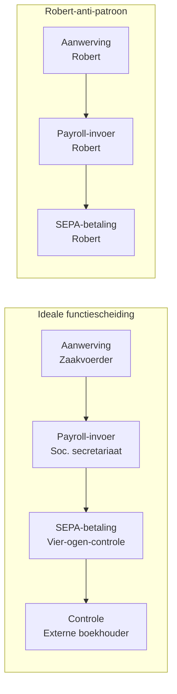

# HR-cyclus en interne controle 🤖

De HR-cyclus omvat aanwerving, contractbeheer, tijdsregistratie, loonberekening, uitbetaling en uitdiensttreding. Interne controle focust op fictieve werknemers (ghost employees), foute loonparameters en niet-aangegeven voordelen — klassieke fraude-vectoren. AVG-gevoeligheid van personeelsdata vereist gerichte technische maatregelen. Stagiairs komen dit tegen bij audits met sociaal secretariaat-uitbesteding (typisch Acerta, Securex, SD Worx) en bij anti-witwas-controles op cash-loonbetalingen.

> [!summary] Korte inhoud
> Interne controle in de HR-cyclus is het geheel van maatregelen die de stadia aanwerving → tijdsregistratie → loonberekening → betaling → uitdiensttreding beheersen, met als doel ghost employees, loonmanipulatie en parameter-fouten te voorkomen of te detecteren.

> [!info] Behoort tot: [[cyclus-analyse-ic]]

Interne controle in de HR-cyclus is het geheel van maatregelen die de stadia aanwerving → tijdsregistratie → loonberekening → betaling → uitdiensttreding beheersen, met als doel ghost employees, loonmanipulatie en parameter-fouten te voorkomen of te detecteren.

## Bouwstenen

### Aanwerving-autorisatie en headcount-control 🤖

Vacatures worden alleen geopend op basis van een goedgekeurde headcount; de arbeidsovereenkomst wordt door een bevoegd persoon getekend.

**Waarom?** Zonder formele headcount-autorisatie ontstaan ghost employees of overstaffing zonder dat iemand het ziet.

**In de praktijk**: HR opent geen vacature zonder schriftelijke goedkeuring van de algemeen directeur; de Dimona-aangifte wordt door HR gedaan, gescheiden van wie het loon berekent.

_Grondslag: Sociale zekerheidswet + Wet arbeidsovereenkomsten 3 juli 1978_

### Tijdsregistratie en parameter-controle 🤖

Werktijd wordt vastgelegd en gevalideerd door een supervisor; loonparameters (basisloon, anciënniteit, premies) worden door een tweede persoon ingegeven en goedgekeurd.

**Waarom?** Manipulatie van uren of toelagen is een klassieke loonfraude; ingangscontrole sluit dit af.

_Grondslag: RSZ-wetgeving + functiescheiding-doctrine_

### Functiescheiding HR-payroll-betaling 🤖

Wie aanwerft, wie loonparameters invoert en wie betaalt zijn drie verschillende personen of rollen.

**Waarom?** Bundeling van rollen laat een persoon toe een ghost employee aan te maken, te betalen én op eigen rekening te laten storten.

_Grondslag: [[functiescheiding]] §toepassing-payroll_

### Cross-check met Dimona-lijst RSZ 🤖

Maandelijks wordt het aantal werknemers in payroll vergeleken met de Dimona-lijst van de RSZ.

**Waarom?** Een verschil tussen payroll en Dimona is een directe indicator voor ghost employees of niet-aangegeven werk.

Bij Yperse Werkplaats BV telt de Dimona-lijst 38 actieve werknemers, het payroll-bestand 41. Onderzoek wijst uit dat drie ex-werknemers in de overdraagperiode nog loon krijgen — herstellen + actieplan voor uitdiensttreding-controle. _(Yperse Werkplaats BV)_ 🤖

_Grondslag: Anti-ghost-employee-doctrine_

## Berekening

### Procesgang HR-cyclus — stappen + IC-haakpunten

### 1. Aanwerving en autorisatie

Vacature openzetten op basis van goedgekeurde headcount; aanwervingsproces met arbeidsovereenkomst.

**Waarom?** Zonder formele headcount-autorisatie ontstaan ghost employees of overstaffing.

**📥 Input**:
- Headcount-budget → **goedgekeurde rollen** _(managementdocument)_

**📤 Output**:
- Dimona-aangifte + arbeidsovereenkomst → **werknemer** _(RSZ-record)_

**🛠️ Hoe**:

1. HR opent vacature alleen op goedgekeurde rol.
2. Arbeidsovereenkomst getekend door bevoegd persoon.
3. Dimona-aangifte door HR, gescheiden van loonberekening.

**Grondslag**: Sociale zekerheidswet + Wet arbeidsovereenkomsten

### 2. Tijdsregistratie en loonberekening

Werktijd vastleggen; sociaal secretariaat berekent lonen op basis van contractgegevens en prestaties.

**Waarom?** Manipulatie van uren of toelagen is klassieke loonfraude.

**📥 Input**:
- Tijdsregistratie + parameter-bestand → **uren, premies** _(ERP-record)_

**📤 Output**:
- Loonfiche → **bruto, netto, RSZ** _(loondocument)_

**🛠️ Hoe**:

1. Operator klokt in/uit; supervisor valideert weeklijst.
2. HR levert prestaties aan sociaal secretariaat.
3. Sociaal secretariaat berekent loonfiches.

**Grondslag**: RSZ-wetgeving

### 3. Betaling en controle

Loonbetaling uitvoeren; vergelijking betalingen versus loonfiches; periodieke review werknemerslijst.

**Waarom?** Functiescheiding HR/payroll/betaling vermijdt ghost employees en uitbetaalde fictieve lonen.

**📥 Input**:
- Loonbestand sociaal secretariaat → **bedragen, IBANs** _(betalingsorder)_

**📤 Output**:
- Bankuittreksel + loonjournaal → **uitgevoerde betalingen** _(boeking)_

**🛠️ Hoe**:

1. CFO tekent loonbestand af vóór betaling.
2. Maandelijks: vergelijk aantal werknemers in payroll versus Dimona-lijst RSZ.
3. Jaarlijks: review actieve werknemerslijst door directie.

**Grondslag**: [[functiescheiding]] §payroll

## Valkuilen

> [!warning]- Eenzelfde IBAN voor twee werknemers is een klassieke ghost-employee-indicator
> ⚠️ Eenzelfde IBAN voor twee werknemers is een klassieke ghost-employee-indicator. Substantieve test: deduplicatie van IBANs in het payroll-masterbestand. 🤖

> [!warning]- Voordelen alle aard (firmawagen, GSM, maaltijdcheques) zijn vaak onderbelicht in de loon-IC
> ⚠️ Voordelen alle aard (firmawagen, GSM, maaltijdcheques) zijn vaak onderbelicht in de loon-IC. Niet-aangegeven voordelen leiden tot bedrijfsleider-aansprakelijkheid bij fiscale controle. 🤖

## Zie ook

- **Vereist kennis van**: [[functiescheiding]]
- **Vereist kennis van**: [[avg-interne-controle]]

## Voorbeelden

### Dimona-cross-check ontmaskert ghost employee bij Transport Tongeren BV

_Personages: Transport Tongeren BV, Robert Vandenberghe, Sofie Janssens_

Transport Tongeren BV heeft 47 chauffeurs op de payroll. HR-verantwoordelijke Robert Vandenberghe verzorgt aanwerving, voert loonparameters in én is gemachtigd om de maandelijkse SEPA-betaalbestanden vrij te geven (drie rollen in één persoon). Auditor Sofie Janssens vergelijkt de payroll-lijst met de Dimona-lijst van de RSZ en stelt een verschil van 2 namen vast: twee 'chauffeurs' die wel loon en bedrijfsvoorheffing krijgen, maar nooit bij de RSZ werden aangegeven. Beide IBANs blijken op naam van Robert zelf te staan.

1. Detectie: payroll-lijst (49 namen) versus Dimona-extract (47 namen) → 2 ghost employees.
2. IBAN-deduplicatie: van de 49 IBANs zijn er 2 identiek aan Roberts privé-IBAN (klassieke valkuil-indicator uit bouwsteen 'Cross-check met Dimona-lijst RSZ').
3. Berekening fraude: € 2.800 netto/maand × 2 employees × 18 maanden = € 100.800 + werkgeversbijdragen die niet werden gedaan = aanzienlijk bedrag.
4. IC-grond-oorzaak: bouwsteen 'Functiescheiding HR-payroll-betaling' volledig ineengeklapt — één persoon doet alle drie. Geen vierde-ogen-controle op SEPA-bestand voor verzending naar de bank.
5. Remediëring: HR-aanwerving naar de zaakvoerder; loonberekening door extern sociaal secretariaat; SEPA-betalingen vereisen vanaf nu twee bevoegde handtekeningen via tokens. Maandelijkse Dimona-payroll-reconciliatie geautomatiseerd.
_Functiescheiding HR-cyclus — vier kritische rollen versus de Transport-Tongeren-anti-patroon_

🤖

