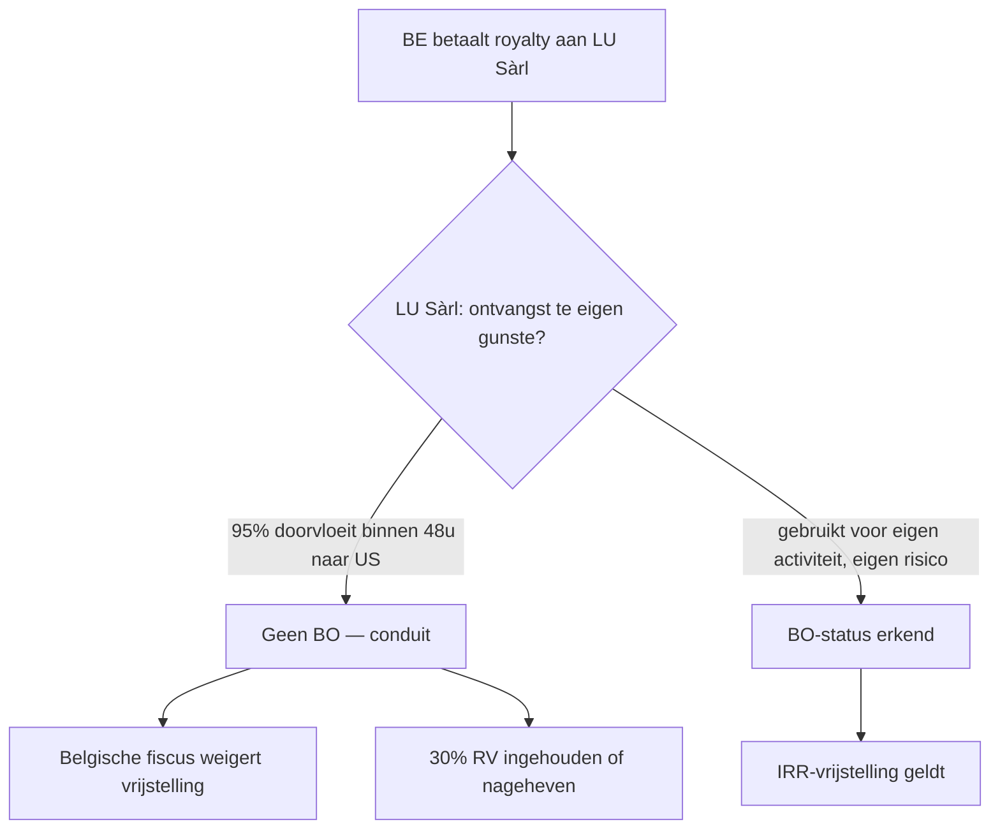

# Interest-royaltyrichtlijn

_Regime_

📋 Regeling · Anchors: `2.8.III` · Wave: `skeleton-btw-internationaal-2026-05-28`

> [!info] 📝 **Concept** — content gevuld door cluster-extract; niet door mens-verify gegaan.

**Afk.**: IRR — **Synoniemen**: interest-royalty directive · IRD · interest- en royaltyrichtlijn — **Vertalingen**: fr: directive intérêts-redevances · en: Interest and Royalties Directive

## Definitie

📖 De Interest-royaltyrichtlijn (Richtlijn 2003/49/EG) legt een gemeenschappelijke fiscale regeling op voor grensoverschrijdende betalingen van interest en royalty's tussen verbonden ondernemingen uit verschillende EU-lidstaten. Kerngedachte: zulke betalingen worden vrijgesteld van alle bronbelastingen in de bronstaat (lidstaat van de uitbetaler), op voorwaarde dat de ontvanger de uiteindelijk gerechtigde (beneficial owner) is en een verbonden onderneming is. De richtlijn voorkomt dat hetzelfde inkomen tweemaal belast wordt — één keer bij de uitbetalende vennootschap (door RV-inhouding) én één keer bij de ontvanger als belastbare opbrengst.

<small>📚 Richtlijn 2003/49/EG — art. 1 lid 1 — _richtlijn_ · Richtlijn 2003/49/EG — art. 1 lid 4 — _richtlijn_ · Richtlijn 2003/49/EG — art. 1 lid 7 — _richtlijn_ · Richtlijn 2003/49/EG — art. 2 — _richtlijn_</small>

## Substantie

🔗 Stel: een Belgische dochter betaalt een interestbedrag van 100.000 EUR aan haar Duitse moeder voor een groepslening. Zonder de richtlijn zou België op die uitbetaling een RV van 30 % inhouden = 30.000 EUR. De Duitse moeder ontvangt 70.000 EUR netto en moet die nog opnemen in haar belastbare basis in Duitsland (mits verdrag bij verrekening). Met de richtlijn houdt België géén RV in: de Duitse moeder ontvangt het volle bedrag van 100.000 EUR en betaalt enkel Duitse VenB op de netto-marge. Resultaat: één enkele belasting bij de ontvanger op zijn netto-marge, geen extra fiscale belasting bij de overdracht. Hetzelfde principe geldt voor royalty-stromen (licentievergoedingen voor IP-rechten binnen een groep).

<small>📚 Richtlijn 2003/49/EG — art. 1 lid 1 — _richtlijn_ · cluster-extract-agent (opus-4.7-1M) — _ai_model_ — (2026-05-28)</small>

## Rationale

🔗 De ratio legis sluit aan bij de Moeder-dochterrichtlijn maar voor andere kapitaalstromen: niet dividenden (vennootschappelijk rendement) maar interest (vergoeding voor schuldfinanciering) en royalty's (vergoeding voor IP-gebruik). Doel: belemmeringen voor financierings- en IP-stromen binnen grensoverschrijdende EU-groepen wegnemen, omdat zonder richtlijn elke interest- en royalty-betaling een bronbelasting kan oplopen (in België standaard 30 %, met DBV verlaagd tot 10 %). Voor de werking van de interne markt en de fiscale neutraliteit tussen binnenlandse en grensoverschrijdende groepsfinanciering moest die belasting weg. Tegelijk bouwt de richtlijn substantiële anti-misbruik-bepalingen in: enkel de 'uiteindelijk gerechtigde' krijgt het voordeel, zodat pure doorstroom-vennootschappen (conduit-structuren) niet kunnen profiteren.

<small>📚 Richtlijn 2003/49/EG — preambule + art. 1 lid 4 — _richtlijn_ · cluster-extract-agent (opus-4.7-1M) — _ai_model_ — (2026-05-28)</small>

## Gebruikscontext

**Status**: `in-voege` · sinds **2003-06-03** · basis: Richtlijn 2003/49/EG van de Raad van 3 juni 2003

De richtlijn liet overgangsregels toe voor Griekenland, Spanje en Portugal (art. 6) — die zijn intussen uitgewerkt. De richtlijn werd niet inhoudelijk gewijzigd (in tegenstelling tot de Moeder-dochterrichtlijn met haar 2015-PPT-update); een Commissievoorstel uit 2011 om de richtlijn te recasten is sinds 2024 nog niet aangenomen.

**✅ Voor**
- 📖 Uitkeringen van interest of royalty's die ontstaan in een EU-lidstaat en uitbetaald worden aan een verbonden onderneming (of vaste inrichting daarvan) in een andere EU-lidstaat die de uiteindelijk gerechtigde is.
- 📖 Interest: inkomsten uit schuldvorderingen van welke aard ook — leningen, obligaties, schuldbewijzen, inclusief premies en prijzen. Royalty's: vergoedingen voor het gebruik van auteursrecht, octrooien, merken, modellen, geheime recepten, knowhow, of industrieel/wetenschappelijke uitrusting (art. 2). Boetes voor te late betaling tellen NIET als interest.

**🚫 Niet voor**
- 📖 Betalingen aan een niet-uiteindelijk-gerechtigde (geen beneficial owner): tussenpersoon, trustee, gemachtigde van een derde. De richtlijn wijst expliciet op het 'eigen-gunste'-criterium (art. 1 lid 4) — enkel wie de stromen voor eigen rekening ontvangt, krijgt het voordeel.
- 📖 Hybride uitkeringen die in het bronland als winstuitkering of als kapitaalterugbetaling worden geherkwalificeerd; winst-deelnemende leningen; schuldvorderingen zonder terugbetalingsverplichting of met terugbetaling > 50 jaar (anti-hybriden-clausule art. 4 lid 1). Het bedrag boven een arms-length-vergoeding (art. 4 lid 2 — transferpricing-correctie).
- 🔗 Betalingen tussen niet-verbonden vennootschappen. Voor IRR-toepassing is een rechtstreekse of onrechtstreekse deelneming van minstens 25 % in kapitaal of stemrechten vereist (art. 3 b — niet in bundle-chunks; standaard uit IRR), of een gemeenschappelijke moeder met minstens 25 % deelneming in beide.

**📋 Voorwaarden**
- 🔗 Cumulatief: (1) uitbetalende én ontvangende vennootschap zijn opgenomen in de bijlage bij de richtlijn (lijst van EU-rechtsvormen — voor België: NV, CommV, BV en publiekrechtelijke lichamen); (2) beide hebben fiscale woonplaats in een EU-lidstaat; (3) beide zijn onderworpen aan één van de in art. 3 a iii vermelde vennootschapsbelastingen zonder vrijstelling; (4) verbonden vennootschap: ≥ 25 %-deelneming (kapitaal of stemrechten) — direct of via gemeenschappelijke moeder; (5) lidstaten mogen een houdperiode van 2 jaar opleggen (art. 1 lid 10); (6) de ontvanger is de uiteindelijk gerechtigde (art. 1 lid 4 — beneficial owner-criterium).

**👍 Voordeel**
- 📖 Eliminatie van bronbelasting (RV) op grensoverschrijdende interest- en royalty-stromen binnen een EU-groep. Belgisch standaardtarief op uitgaande interest is 30 % (RV), op royalty's eveneens 30 % — zonder de richtlijn zou de eerste 30 % vertrokken zijn naar de Belgische fiscus voor elke betaling.
- 📖 Vrijwaringsclausule (art. 9): bestaande verdragen of nationale regels die voor de belastingplichtige nog gunstiger zijn (volledige vrijstelling, lager verdragstarief) blijven onverlet — de richtlijn werkt als minimumstandaard, niet als plafond.

**⚠️ Risico**
- 🔗 Verlies van het voordeel bij verlies van de beneficial-owner-status: een tussenholding zonder eigen risico, eigen besluitvorming en eigen kasstromen geldt niet als uiteindelijk gerechtigde. De HvJ heeft dat streng toegepast (Deense beneficial-owner-zaken N Luxembourg 1 C-115/16). Bij twijfel: RV alsnog inhouden of vrijstellingsattest weigeren.
- 🔗 Verkeerde kwalificatie interest vs royalty vs dividend: een 'profit-participating loan' (winst-deelnemende lening) kan in het bronland als dividend worden geherkwalificeerd (art. 4 lid 1 b) — dan valt het onder de Moeder-dochterrichtlijn (10 % drempel) en NIET onder de IRR (25 % drempel). Bij 10 % < deelneming < 25 % vervalt elke richtlijn-vrijstelling.

## Bouwstenen

### 📏 Minimum-deelneming 25 %  
_`drempel`_

🔗 De richtlijn geldt enkel tussen 'verbonden ondernemingen' (art. 1 lid 7). De drempel is een rechtstreekse of onrechtstreekse deelneming van ten minste 25 % in kapitaal of stemrechten — ofwel houdt de uitbetaler ≥ 25 % in de ontvanger, ofwel omgekeerd, ofwel houdt een derde gemeenschappelijke vennootschap ≥ 25 % in beide. Belangrijk verschil met de MDR: daar volstaat 10 %.

<small>📚 Richtlijn 2003/49/EG — art. 1 lid 7 — _richtlijn_ · cluster-extract-agent (opus-4.7-1M) — _ai_model_ — (2026-05-28)</small>

### 📏 Houdperiode 2 jaar (optie lidstaat)  
_`drempel`_

🔗 Een lidstaat heeft de mogelijkheid om de richtlijn niet toe te passen op een onderneming uit een andere lidstaat indien de deelnemingsvereisten niet vervuld waren gedurende een ononderbroken periode van ten minste 2 jaar (art. 1 lid 10). België past deze 2-jaar-houdperiode toe via de Belgische uitvoering art. 107 KB-WIB. Bij vroegtijdige beëindiging vervalt de vrijstelling met terugwerkende kracht.

<small>📚 Richtlijn 2003/49/EG — art. 1 lid 10 — _richtlijn_ · cluster-extract-agent (opus-4.7-1M) — _ai_model_ — (2026-05-28)</small>

### 💡 Uiteindelijk gerechtigde (beneficial owner)  
_`begrip`_

📖 Een onderneming wordt alleen als uiteindelijk gerechtigde behandeld indien zij de interest of royalty's 'te eigen gunste' ontvangt — NIET als bemiddelende instantie, tussenpersoon, trustee of gemachtigde van een derde (art. 1 lid 4). Een vaste inrichting kan beneficial owner zijn indien (a) de schuldvordering of het IP-recht daadwerkelijk verband houdt met die vaste inrichting, EN (b) zij in haar lidstaat onderworpen is aan de bedoelde vennootschapsbelasting (art. 1 lid 5). Dit criterium is dé sleutel-anti-misbruik-bepaling van de richtlijn: het sluit conduit-structuren uit. De HvJ vereist daarbij economische substantie — eigen personeel, eigen besluitvorming, eigen risico's — vooraleer beneficial-owner-status wordt toegekend (Deense BO-zaken).

<small>📚 Richtlijn 2003/49/EG — art. 1 lid 4-5 — _richtlijn_ · cluster-extract-agent (opus-4.7-1M) — _ai_model_ — (2026-05-28)</small>

### 💡 Interest (art. 2 a)  
_`begrip`_

📖 Inkomsten uit schuldvorderingen van welke aard ook, al dan niet door hypotheek verzekerd, al dan niet aanspraak gevend op een aandeel in de winst van de schuldenaar. Inclusief: inkomsten uit leningen, obligaties, schuldbewijzen, en de aan zulke instrumenten verbonden premies en prijzen. UITGESLOTEN: boete voor te late betaling. Belangrijk: de definitie is breed en omvat alle vormen van schuld-vergoeding — ook deelnemende leningen worden in eerste instantie als interest aangemerkt, tenzij de bronstaat ze als winstuitkering herkwalificeert (art. 4 lid 1).

<small>📚 Richtlijn 2003/49/EG — art. 2 a — _richtlijn_ · Richtlijn 2003/49/EG — art. 4 lid 1 — _richtlijn_</small>

### 💡 Royalty's (art. 2 b)  
_`begrip`_

📖 Vergoedingen van welke aard ook voor het gebruik (of het recht van gebruik) van: auteursrecht op een werk van letterkunde, kunst of wetenschap (inclusief bioscoopfilms en software); octrooi; fabrieks- of handelsmerk; tekening of model; plan; geheim recept of geheime werkwijze; inlichtingen omtrent ervaringen op het gebied van nijverheid, handel of wetenschap (know-how); industriële, commerciële of wetenschappelijke uitrusting. Het concept is breed maar vereist altijd een gebruiksrecht — niet een eigendomsoverdracht.

<small>📚 Richtlijn 2003/49/EG — art. 2 b — _richtlijn_</small>

### 📜 Bronbelastingvrijstelling — door inhouding of aanslag (art. 1 lid 1)  
_`regel`_

📖 Uitkeringen van interest of royalty's die ontstaan in een lidstaat worden vrijgesteld van ALLE belastingen in die bronstaat — zowel inhouding (RV) als aanslag (heffing op het gebruik in de bedrijfsuitgave-aftrek). Voorwaarde: de ontvanger is een verbonden EU-onderneming én uiteindelijk gerechtigde. De vrijstelling werkt UITSLUITEND aan bronzijde — de moederstaat is vrij om de inkomende stroom als belastbaar inkomen te behandelen (in tegenstelling tot de MDR die ook moederzijdig werkt via vrijstelling/credit).

<small>📚 Richtlijn 2003/49/EG — art. 1 lid 1 — _richtlijn_</small>

### 📜 Arms-length-correctie (art. 4 lid 2)  
_`regel`_

📖 Wanneer wegens een bijzondere verhouding (verbondenheid) tussen uitbetaler en ontvanger het betaalde bedrag aan interest of royalty's hoger is dan wat in een normale arms-length-onderhandeling zou zijn overeengekomen, geldt de vrijstelling alleen voor het arms-length-deel. Het surplus wordt belast volgens nationaal recht (typisch: RV ingehouden, eventueel als verkapt dividend gekwalificeerd). Dit haakt aan op transferpricing-regels van art. 9 OESO-modelverdrag.

<small>📚 Richtlijn 2003/49/EG — art. 4 lid 2 — _richtlijn_</small>

### 📜 Attest-procedure voor vrijstelling (art. 1 lid 11-13)  
_`regel`_

📖 De bronstaat (België) mag eisen dat de ontvanger via een attest aantoont dat de voorwaarden vervuld zijn: bewijs van fiscale woonplaats, beneficial-owner-verklaring, taxatie-verklaring (art. 3 a iii), bewijs minimumdeelneming, vermelding hoelang die deelneming bestaat. Het attest is 1 tot 3 jaar geldig (art. 1 lid 13). Wordt het attest niet voorgelegd op het betalingstijdstip, mag de bronstaat de RV alsnog inhouden (art. 1 lid 11). De ontvanger kan dan binnen minstens 2 jaar teruggave vorderen (art. 1 lid 15-16), met rente bij vertraging.

<small>📚 Richtlijn 2003/49/EG — art. 1 lid 11-13 — _richtlijn_ · Richtlijn 2003/49/EG — art. 1 lid 15-16 — _richtlijn_</small>

## Voorbeelden

### 💡 Belgische dochter — Duitse moeder — groepslening 🔗

_Zelena Bio NV (België) heeft een lening van 5.000.000 EUR ontvangen van haar moeder Zelena Holding GmbH (Duitsland, 100 % aandeelhouder). Jaarlijkse interest aan 3 % marktconform = 150.000 EUR. Lening loopt sinds 2022. Beide voldoen aan art. 3 (rechtsvorm in bijlage) en aan art. 1 lid 7 (verbonden — 100 % > 25 %)._

**Berekening:**
- Stap 1 — kwalificatie: interest in de zin van art. 2 a (vergoeding voor schuldvordering — lening).
- Stap 2 — voorwaarden IRR: verbonden vennootschap (100 % deelneming Duitse moeder); beneficial owner (Duitse moeder ontvangt voor eigen gunste — geen tussenpersoon); houdperiode > 2 jaar (sinds 2022, dus eind 2024 voldaan).
- Stap 3 — zonder IRR: Zelena Bio houdt 30 % RV in = 45.000 EUR — Duitse moeder ontvangt 105.000 EUR netto. Daarna verrekening in Duitsland via DBV.
- Stap 4 — mét IRR (art. 107 KB-WIB): geen RV — Duitse moeder ontvangt 150.000 EUR brutto.
- Stap 5 — bij Zelena Bio NV: de interest blijft een aftrekbare bedrijfsuitgave (mits arms-length én geen thin-cap-beperking).

→ **Resultaat**: Volledige eliminatie RV. Zelena Bio NV moet wel een vrijstellingsattest van de Duitse fiscale autoriteiten verkrijgen en bewaren in haar dossier (art. 1 lid 11).

<small>📚 Richtlijn 2003/49/EG — art. 1 + art. 2 a — _richtlijn_ · cluster-extract-agent (opus-4.7-1M) — _ai_model_ — (2026-05-28)</small>

### 💡 Beneficial-owner-toets — Luxemburgse holding zonder substantie 🔗

_Aurelia BV (België) betaalt 200.000 EUR royalty's aan Aurelia IP Sàrl (Luxemburg, 100 % zustermaatschappij gehouden door dezelfde Amerikaanse moeder Aurelia Inc.). Aurelia IP Sàrl heeft één deeltijdse bestuurder, geen kantoor, geen IT, en sluist 95 % van de ontvangen royalty's binnen 48 uur door naar Aurelia Inc. via een licentie-overeenkomst._

Beneficial-owner-toets stap-voor-stap:

Key indicatoren tegen BO-status (HvJ-criteria): (1) korte tussentijd ontvangst-doorbetaling; (2) geen eigen personeel; (3) geen eigen besluitvorming over IP; (4) winstmarge < 5 % (puur conduit). Bij twijfel weigert de Belgische fiscus de vrijstelling én past algemene anti-misbruik-bepaling (art. 344 §1 WIB92) toe.

<small>📚 Richtlijn 2003/49/EG — art. 1 lid 4 — _richtlijn_ · cluster-extract-agent (opus-4.7-1M) — _ai_model_ — (2026-05-28)</small>

## Valkuilen

### ⚠️ IRR-drempel 25 % verwarren met MDR-drempel 10 %

**Verkeerde assumptie**: De drempels van MDR en IRR zijn identiek (beide 10 %).

**Kernpunt**: IRR vereist 25 % deelneming (kapitaal of stemrechten); MDR vereist 10 %. Bij groepsverbanden waar de deelneming tussen 10 % en 25 % ligt: MDR-vrijstelling geldt voor dividenden, maar IRR-vrijstelling geldt NIET voor interest of royalty's — daar valt men terug op het bilateraal dubbelbelastingverdrag (vaak 10 % verlaagd tarief).

<small>📚 Richtlijn 2003/49/EG — art. 1 lid 7 + art. 3 b — _richtlijn_ · cluster-extract-agent (opus-4.7-1M) — _ai_model_ — (2026-05-28)</small>

### ⚠️ Beneficial-owner-toets als formele check zien

**Verkeerde assumptie**: Een vrijstellingsattest van de andere lidstaat volstaat — de Belgische fiscus moet de vrijstelling toepassen.

**Kernpunt**: Het attest is een minimumvereiste (art. 1 lid 11-13), maar de Belgische fiscus mag substantie van de ontvanger toetsen. Bij gebrek aan economische realiteit (geen personeel, geen functies, geen risico's) weigert hij de vrijstelling ondanks het attest — HvJ heeft dit bevestigd in de Deense BO-zaken. Praktijk: substance-file aanleggen bij elke grensoverschrijdende intra-group interest- of royalty-stroom.

<small>📚 Richtlijn 2003/49/EG — art. 1 lid 4 — _richtlijn_ · cluster-extract-agent (opus-4.7-1M) — _ai_model_ — (2026-05-28)</small>

### ⚠️ IRR toepassen op royalty's voor uitrusting buiten EU

**Verkeerde assumptie**: De richtlijn werkt overal waar één partij EU is.

**Kernpunt**: Art. 1 lid 1 vereist dat BEIDE partijen EU-vennootschappen (of EU-vaste-inrichtingen) zijn. Een Belgische betaler met een Amerikaanse moeder valt NIET onder IRR — daar gelden het Belgisch-Amerikaans dubbelbelastingverdrag en interne Belgische RV-regels.

<small>📚 Richtlijn 2003/49/EG — art. 1 lid 1 — _richtlijn_</small>

## Accountant-perspectieven

### Belgische uitbetaler interest/royalty's aan EU-verbonden onderneming

_De accountant van een Belgische vennootschap die interest of royalty's verschuldigd is aan een EU-verbonden vennootschap._

#### 💰 Fiscaal adviseur

##### 👣 Attest opvragen vóór elke betaling  
_`stap`_

📖 Vraag de ontvanger om een vrijstellingsattest af te leveren vóór de eerste betaling. Het attest bevat (1) bewijs fiscale woonplaats EU-lidstaat, (2) beneficial-owner-verklaring, (3) taxatie-verklaring, (4) bewijs deelneming ≥ 25 %, (5) duur van de deelneming. Geldig 1-3 jaar — bij vervaldatum tijdig hernieuwen. Zonder geldig attest: RV inhouden uit voorzichtigheid; terugvordering achteraf is mogelijk maar belast het kassaverkeer.

<small>📚 Richtlijn 2003/49/EG — art. 1 lid 11-13 — _richtlijn_</small>

##### 👣 Arms-length-toets op de interestvoet of royaltyvergoeding  
_`stap`_

📖 Vóór elke intra-group betaling: documenteer dat de interestvoet (bij lening) of royaltyvergoeding (bij IP) marktconform is. Voor interest: vergelijk met externe leningstarieven van vergelijkbare looptijd/risico. Voor royalty's: gebruik benchmark-databases (RoyaltyStat, ktMINE) of een Comparable Uncontrolled Price (CUP) studie. Een te hoge vergoeding wordt geweigerd voor het surplus (art. 4 lid 2): IRR-vrijstelling geldt enkel voor het arms-length-deel, surplus wordt RV-belast en mogelijk als verkapt dividend geherkwalificeerd.

<small>📚 Richtlijn 2003/49/EG — art. 4 lid 2 — _richtlijn_ · cluster-extract-agent (opus-4.7-1M) — _ai_model_ — (2026-05-28)</small>

#### 📒 Boekhouder

##### 👣 Boeking interest zonder RV-inhouding  
_`stap`_

🔗 Bij IRR-vrijstelling: het volledige bruto-bedrag stroomt naar de ontvanger. Boeking voor een interestschuld van 100.000 EUR: 650 Kosten van schulden (interest) → 173 Schulden aan moederonderneming = 100.000 (debet 650 / credit 173); later 173 → 55 Bank = 100.000. Geen 451 'Te betalen RV' op deze stroom. Voor pro-rata-temporis-boekingen volgens CBN-advies 2013/12.

<small>📚 CBN-advies 2013/12 — Interesten en royalty's — _cbn_ · cluster-extract-agent (opus-4.7-1M) — _ai_model_ — (2026-05-28)</small>

## Verder lezen (scope-out)

- → Roerend inkomen internationaal → [[roerend-inkomen-internationaal]] _(moet-verwijzen)_
- ↪ Moeder-dochterrichtlijn (analoog) → [[moeder-dochterrichtlijn]] _(mag-verwijzen)_

## Relaties

### `valt_onder`
- [[eu-fiscale-richtlijnen]]
- [[internationaal-fiscaal]]
### `beinvloed_door`
- [[roerende-voorheffing]] — De richtlijn schrapt de RV op uitgaande interest en royalty's binnen EU (art. 1 lid 1). Belgische uitvoering: art. 107 KB-WIB.
- [[transfer-pricing]] — Art. 4 lid 2: alleen het arms-length-deel van de vergoeding krijgt de richtlijn-vrijstelling; het surplus wordt nationaal belast.
### `vergelijkbaar_met`
- [[moeder-dochterrichtlijn]]
    - **Gelijkenissen**:
        - Beide EU-richtlijnen elimineren bronbelasting op grensoverschrijdende stromen tussen verbonden vennootschappen
        - Beide vereisen verbondenheid en EU-rechtsvorm uit een bijlage
        - Beide kennen een houdperiode-optie
        - Beide werken via attest-procedure
    - **Verschillen**:
        - MDR werkt op dividenden; IRR op interest + royalty's
        - MDR-drempel 10 %; IRR-drempel 25 %
        - MDR werkt aan beide zijden (bron + moederzijde); IRR enkel aan bronzijde
        - MDR heeft expliciete PPT sinds 2015 (art. 1 lid 2-4); IRR steunt op de algemene beneficial-owner-toets (art. 1 lid 4) — minder expliciet maar door HvJ even streng toegepast
    - ⚠️ **Verwarringsrisico**: Studenten verwarren drempels (10 % vs 25 %) en behandeling moederzijde. Examen-aandachtspunt: bij deelneming 10-24 % geldt MDR voor dividenden, maar IRR geldt NIET voor interest/royalty's.
### `vereist`
- ⏳ verbonden-vennootschap — Toepassing van de richtlijn vereist dat uitbetaler en ontvanger verbonden zijn in de zin van art. 1 lid 7 (rechtstreeks of via gemeenschappelijke moeder, drempel ≥ 25 %).
- [[fiscale-residentie]] — Beide vennootschappen moeten fiscale woonplaats hebben in een EU-lidstaat — zonder fiscale residentie in de EU geen richtlijntoepassing.
