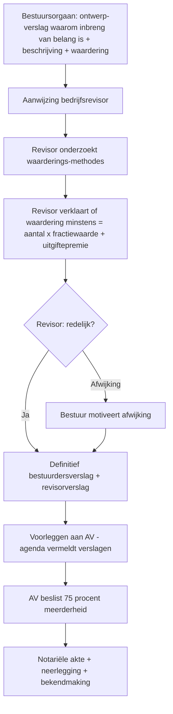

# Kapitaalverhoging in natura

_Verrichting_

📅 Gebeurtenis · 📋 Regeling · Anchors: `3.0.IV.A` · `3.0.IV.B` · Wave: `skeleton-vennootschapsrecht-2026-05-28`

> [!info] 📝 **Concept** — content gevuld door cluster-extract; niet door mens-verify gegaan.

**Synoniemen**: inbreng in natura bij kapitaalverhoging · natura-inbreng — **Vertalingen**: fr: augmentation de capital par apport en nature

## Definitie

📖 **Kapitaalverhoging in natura** is een verrichting waarbij de tegenprestatie voor de uitgifte van nieuwe aandelen bestaat uit een **niet-geldelijke inbreng**: een lichamelijk goed (machine, voertuig, vastgoed), een onlichamelijk goed (intellectueel eigendom, clientèle), een schuldvordering, of aandelen in een andere vennootschap. De verrichting volgt de algemene kapitaalverhoging-procedure (statutenwijziging + notariële akte) plus een verplicht **revisorverslag** (art. 7:183 NV / 5:112 BV WVV) dat de waardering en de waarderingsmethoden onderzoekt.

<small>📚 WVV — art. 7:183 — _wettekst_ · WVV — art. 5:112 — _wettekst_</small>

## Substantie

📖 Economisch laat de natura-inbreng toe bestaande activa van de aandeelhouder/derde (vastgoed, eenmanszaak-activa, deelneming in andere vennootschap, terugbetalingsvordering) om te zetten in eigen vermogen van de doelvennootschap zonder cash-storting. De **bedrijfsrevisor** (of commissaris) verifieert dat de **waarde van de inbreng** ten minste overeenkomt met het aantal × fractiewaarde + uitgiftepremie van de uit te geven aandelen — dit is de **anti-overwaardering**-garantie ten voordele van derden en bestaande aandeelhouders. Het bestuursorgaan stelt een eigen verslag op dat aangeeft waarom de inbreng van belang is voor de vennootschap en waarom een eventuele afwijking van de revisor-conclusies gerechtvaardigd is.

<small>📚 WVV — art. 7:183 — _wettekst_</small>

## Rationale

🔗 De verplichte revisor-controle bestaat omdat een natura-inbreng — anders dan een geld-inbreng — een **subjectief waarderings-oordeel** vereist. Zonder controle kan de inbrenger aandelen verkrijgen die niet overeenstemmen met de werkelijke economische waarde van het ingebrachte goed (overwaardering) → benadeling van de andere aandeelhouders en van de vennootschapsschuldeisers. De ratio is dezelfde als bij **quasi-inbreng**: voorkomen dat de wettelijke kapitaal-bescherming wordt omzeild via een transactie met een oprichter/bestuurder/aandeelhouder kort na de oprichting.

<small>📚 ITAA-norm fusie/splitsing — § 2 + § 4 — _norm_ · cluster-extract-agent (opus-4.7-1M) — _ai_model_ — (2026-05-28)</small>

## Gebruikscontext

**Status**: `in-voege` · sinds **2019-05-01** · basis: WVV (Wet 23-03-2019)

Procedure quasi-identiek aan vroegere W.Venn.-bepalingen (art. 444 W.Venn. → art. 7:183 WVV); WVV-hervorming heeft revisor-rol ongewijzigd gelaten.

**✅ Voor**
- 🔗 Bij **overdracht van eenmanszaak** naar een nieuwe of bestaande vennootschap (cliënteel, materieel, vorderingen → kapitaal).
- 🔗 Bij **inbreng van vastgoed** in een patrimoniumvennootschap (motieven: successieplanning, opvolging, scheiding privé/professioneel).
- 📖 Bij **capitalisatie van schuldvordering** (rekening-courant aandeelhouder → kapitaal) — schuldgraad verbetert zonder cash-uitstroom.

**📋 Voorwaarden**
- 📖 **Bestuurdersverslag** + **revisorverslag** (of commissaris-verslag indien een commissaris is benoemd) verplicht — beide verslagen worden neergelegd en bekendgemaakt (art. 2:7 + 2:13 WVV). Ontbreken = **nietigheid** van AV-besluit + verslagen (art. 7:183 § 1 lid 5 WVV).
- 📖 **Inbreng moet 'op geld waardeerbaar' en overdraagbaar** zijn (art. 1:8 WVV jo. 7:2). Inbreng in nijverheid (arbeid) is uitgesloten bij NV.

**⚠️ Risico**
- 🔗 **Overwaardering**: indien de revisor de waardering te hoog inschat, krijgen de andere aandeelhouders een verwaterend aandeel, en hebben schuldeisers minder reële dekking. De revisor draagt civielrechtelijke aansprakelijkheid (art. 3:75 + 3:99 WVV) en kan tuchtrechtelijk worden vervolgd door het IBR.
- 📖 **Fiscale realisatie van latente meerwaarden** bij inbreng vanuit eigen patrimonium: de inbreng wordt fiscaal beschouwd als een **vervreemding tegen werkelijke waarde** (art. 90, 8°/9° WIB92 voor PB; art. 184bis WIB92 voor VenB) — tenzij het regime van inbreng bedrijfstak of algemeenheid (art. 46 WIB92) wordt toegepast.

## Sub-concepten

### 📦 Inbreng van onroerend goed  
_`verrichting` (subconcept)_

#### Definitie

📖 Inbreng van een **onroerend goed** (terrein, gebouw, gemengd) tegen aandelen. Specifieke fiscale en registratierechten-regels: zuivere inbreng van een onroerend goed dat niet hoofdzakelijk voor bewoning bestemd is door een natuurlijk persoon in een Belgische vennootschap is **vrijgesteld van het verkooprecht** (12%) en valt onder het **algemeen vast recht** van €50 — art. 115bis Wb Reg + art. 169bis (gewestelijk Brussel). Bij **gemengde betaling** (deels aandelen, deels geld of schuldvordering): het 'geld'-deel valt onder gewoon verkooprecht. **BTW**: bij inbreng van een **nieuw gebouw** (geleverd binnen 2 jaar na ingebruikneming) kan de inbrenger opteren voor btw-stelsel — anders registratierecht.

<small>📚 Wb Reg — art. 115bis — _wettekst_ · Wb Reg — art. 169bis — _wettekst_</small>

#### Substantie

🔗 **Praktijk-toepassing**: art. 115bis is vooral aantrekkelijk voor inbreng van commercieel of gemengd vastgoed in een vennootschap (in plaats van een verkoop met 12% registratierechten). De vrijstelling geldt NIET voor inbreng van een woning bestemd voor bewoning door een natuurlijke persoon in een vennootschap die de woning later weer verhuurt aan diezelfde persoon — dit valt onder de 'gemengde betaling'-uitzondering en wordt fiscaal als verkoop behandeld.

<small>📚 Wb Reg — art. 115bis — _wettekst_ · cluster-extract-agent (opus-4.7-1M) — _ai_model_ — (2026-05-28)</small>

## Bouwstenen

### 👣 Revisor-procedure bij natura-inbreng  
_`stap`_

📖 **Stappen revisor-tussenkomst** (art. 7:183 WVV):



**Termijn**: verslagen moeten 15 dagen vóór de AV ter beschikking van aandeelhouders zijn (art. 5:101/7:166 WVV). Ontbreken verslagen → nietigheid AV-besluit.

<small>📚 WVV — art. 7:183 — _wettekst_ · WVV — art. 5:112 — _wettekst_</small>

### 📜 Waarderingsmethoden — cascade per goedsoort  
_`regel`_

📖 De revisor moet de **gepastheid** van de gekozen waarderingsmethode beoordelen (ITAA-norm fusie/splitsing § 2 + § 4). Per type goed:

- **Onroerend goed** — markt-vergelijkingsmethode (recente transacties) of expertisewaarde door beëdigd schatter; bij rendementspand: DCF op huurinkomsten.
- **Aandelen niet-genoteerd** — combinatie van intrinsieke waarde (NAV), rendementswaarde (DCF/EBITDA-multiples), peer-vergelijking; vaak gewogen gemiddelde.
- **Aandelen genoteerd** — beurskoers (gemiddelde 30d of laatste koers).
- **Handelsfonds / cliënteel** — multiples op winst (EBIT × factor) of overdrachtsprijs gelijkaardige zaken.
- **Schuldvordering** — nominale waarde indien volwaardig; verminderde waarde indien debiteur in moeilijkheden (CBN 2021/07).
- **Materiële vaste activa** — netto-boekwaarde, second-hand-marktwaarde of expertise.

De revisor mag NIET zelf de waardering doen (taak van bestuursorgaan) maar moet ze 'redelijk' verklaren.

<small>📚 ITAA-norm fusie/splitsing — § 2 — _norm_ · ITAA-norm fusie/splitsing — § 4 — _norm_ · CBN-advies 2021/07 — Schuldvordering nominale waarde — _advies_ — (2021-05-05)</small>

### 📜 Latente meerwaarden — fiscaal realisatiemoment  
_`regel`_

📖 Voor de inbrenger is de natura-inbreng fiscaal een vervreemding tegen werkelijke waarde: latente meerwaarden worden gerealiseerd en in principe belast op het moment van de inbreng:

- **PB inbrenger (natuurlijk persoon)** — meerwaarde op onroerend goed: art. 90, 8°/10° WIB92 (16,5% of vrijstelling na 5/8 jaar); meerwaarde op aandelen: art. 90, 9° (33% bij speculatief karakter) of belastingvrij (normaal beheer). Stopzettingsmeerwaarden op activa van eenmanszaak: art. 28 WIB92.
- **VenB inbrenger (vennootschap)** — meerwaarde op activa: belastbaar tegen 25% (of 20% kmo-tarief), tenzij gespreide belasting art. 47 WIB92 (activa >5 jaar, herbelegging binnen 3-5 jaar in afschrijfbare goederen).
- **Bedrijfstak-inbreng (art. 46 WIB92)** — fiscale neutraliteit mits voorwaarden voldaan: (1) bedrijfstak vormt autonoom geheel; (2) inbrengverkrijgende vennootschap is Belgisch of EU; (3) verkrijgt aandelen als enige vergoeding; (4) zakelijke motieven aanwezig. Dan: fiscale waarden gaan mee — geen onmiddellijke meerwaarde-belasting (zie record `inbreng-bedrijfstak-of-algemeenheid`).

<small>📚 WIB92 — art. 184bis — _wettekst_ · WIB92 — art. 47 — _wettekst_ · WIB92 — art. 46 — _wettekst_ · WIB92 — art. 90, 8°-10° — _wettekst_</small>

## Voorbeelden

### 💡 BV ProdCo — inbreng machine vanuit eenmanszaak 🔗

_Tom is eenmanszaak-eigenaar en wil zijn productie-machine (boekwaarde €30.000, marktwaarde €70.000) inbrengen in zijn nieuwe BV ProdCo. Machine 6 jaar geleden gekocht (>5j → potentiële gespreide belasting). Revisorverslag bevestigt waardering €70.000. In ruil ontvangt hij 700 nieuwe aandelen van fractiewaarde €100._

**Boeking:**


_Machine geboekt aan inbrengwaarde €70.000 (= waarde door revisor bevestigd). Aandelen 700 × €100 — geen uitgiftepremie omdat fractiewaarde = inbrengwaarde._

| Element | Waarde | Fiscaal regime |
| --- | --- | --- |
| Marktwaarde inbreng | €70.000 | Werkelijke waarde (art. 184bis WIB92) |
| Boekwaarde machine | €30.000 | Fiscale netto-waarde |
| Stopzettingsmeerwaarde | €40.000 | Art. 28 WIB92: 16,5% PB indien activum > 5 j |
| Spreiding mogelijk? | Art. 47 WIB92 — voorwaarden | Herbelegging volledige €70.000 in afschrijfbare goederen binnen 3-5 j → spreiding over afschrijvingsduur |

<small>📚 WVV — art. 5:112 — _wettekst_ · WIB92 — art. 47 — _wettekst_</small>

### 💡 BV Vastgoed Pro — inbreng commercieel pand (art. 115bis) 🔗

_Marie brengt een commercieel pand (kantoorgebouw, marktwaarde €500.000, geen woon-bestemming) in haar bestaande BV Vastgoed Pro. Revisorverslag bevestigt waardering. In ruil ontvangt ze 5.000 nieuwe aandelen × €100. Geen gemengde betaling._

**Boeking:**


**Weergave** `vergelijkingstabel`:

```json
{
  "titel": "Registratierechten — inbreng vs verkoop",
  "kolommen": [
    "Scenario",
    "Wettelijke basis",
    "Tarief / vast recht",
    "Bedrag op €500.000"
  ],
  "rijen": [
    [
      "Inbreng zuiver in vennootschap (art. 115bis)",
      "Wb Reg art. 115bis",
      "€50 algemeen vast recht",
      "€50"
    ],
    [
      "Verkoop aan vennootschap",
      "Wb Reg gewoon verkooprecht",
      "12% Vlaams / 12,5% Brussel",
      "€60.000 / €62.500"
    ],
    [
      "Gemengde inbreng (deels schuld overgenomen)",
      "115bis + gewoon recht op geld-deel",
      "Pro rata 12%",
      "Afhankelijk van geld-deel"
    ]
  ],
  "conclusie": "Vrijstelling 115bis = ca. €60.000 besparing t.o.v. verkoop. Voorwaarde: zuivere inbreng (alleen aandelen als tegenprestatie)."
}
```

<small>📚 Wb Reg — art. 115bis — _wettekst_ · WVV — art. 5:112 — _wettekst_</small>

### 💡 Holding-structurering — inbreng aandelen werkmaatschappij 🔗

_Familie Janssens bezit privé 100% van NV WerkCo (waarde €1.500.000 volgens revisor). Ze brengen deze aandelen in hun nieuwe NV HoldCo. HoldCo geeft 15.000 aandelen × €100 uit aan Familie Janssens._

**Boeking:**


_NV HoldCo nieuwe rubriek 28 'Financiële vaste activa'. Voor familie privé: latente meerwaarde op aandelen is in PB onder art. 90, 9° WIB92 — meestal vrijgesteld als 'normaal beheer privé-vermogen', behalve bij speculatie._

<small>📚 WVV — art. 7:183 — _wettekst_ · CBN-advies 2012/8 — Inbreng financiële vaste activa — _advies_ — (2012-07-04)</small>

## Valkuilen

### ⚠️ Revisor bepaalt de waardering

**Verkeerde assumptie**: De bedrijfsrevisor stelt de inbrengwaarde vast.

**Kernpunt**: Art. 7:183 § 1 lid 1 WVV: het BESTUURSORGAAN stelt de gemotiveerde waardering vast in zijn eigen verslag. De revisor onderzoekt de waardering en verklaart of ze 'redelijk' is. De revisor mag geen waardering opdringen — bestuur mag motiveren waarom het afwijkt, mits uitleg in eindverslag.

<small>📚 WVV — art. 7:183, § 1 — _wettekst_</small>

### ⚠️ Art. 115bis vrijstelling = altijd toepasselijk

**Verkeerde assumptie**: Elke inbreng van onroerend in een vennootschap is vrij van registratierecht.

**Kernpunt**: Art. 115bis Wb Reg vrijstelling werkt enkel bij **zuivere inbreng** (alleen aandelen als tegenprestatie). Bij gemengde betaling (deels aandelen, deels geld of overgenomen schuld) wordt het 'geld-deel' belast tegen gewoon verkooprecht (12%/12,5%). Bovendien geldt voor inbreng van woonruimte door een natuurlijk persoon: anti-misbruik (Wb Reg art. 18 § 2 of art. 169bis Brussel — gewest-afhankelijk).

<small>📚 Wb Reg — art. 115bis — _wettekst_ · Wb Reg — art. 169bis — _wettekst_</small>

### ⚠️ Inbreng = belastingneutraal

**Verkeerde assumptie**: Een inbreng in natura is een 'ruil' zonder fiscale realisatie.

**Kernpunt**: Art. 184bis WIB92: een inbreng wordt fiscaal beschouwd als vervreemding tegen werkelijke waarde → latente meerwaarden worden gerealiseerd en belast. Alleen onder art. 46 (inbreng bedrijfstak of algemeenheid) is er fiscale neutraliteit. Voor PB-inbrengers: art. 28 (stopzetting), 90, 8°-10° (diverse) gelden.

<small>📚 WIB92 — art. 184bis — _wettekst_</small>

## Accountant-perspectieven

### Vanuit de inbrengverkrijgende vennootschap

_Boekhouder boekt aan inbrengwaarde; auditor controleert juistheid van waardering en consistentie tussen verslagen._

#### 📒 Boekhouder

##### 👣 Boekhoudkundige verwerking  
_`stap`_

📖 Het ingebrachte goed wordt op de **inbrengwaarde** geboekt (= waarde bevestigd door revisor). Tegenboeking: rekening 100 Geplaatst kapitaal (NV) of 11 Onbeschikbare inbreng (BV) voor het fractiewaarde-deel; rekening 1100/1110 Uitgiftepremie voor het deel boven de fractiewaarde. **Aandachtspunt CBN 2012/8**: bij inbreng in een gemengde verrichting (inbreng + verkoop = ruil), wordt de meerwaarde op het verkochte deel in resultatenrekening genomen, terwijl op het behouden deel een herwaarderingsmeerwaarde kan worden geboekt (mits voorwaarden art. 3:35 KB WVV).

<small>📚 CBN-advies 2012/8 — Financiële vaste activa — _advies_ — (2012-07-04)</small>

#### 🔍 Auditor

##### 📜 Audit-aandachtspunten  
_`regel`_

🔗 **Audit-checklist** bij natura-inbreng-controle:

1. Aanwezigheid bestuurdersverslag + revisorverslag (neergelegd ter griffie?).
2. Consistentie tussen ingebracht goed en inbrengwaarde in boekhouding.
3. Waarderingsmethode gepast voor goedsoort? Gedocumenteerd?
4. Verschil tussen inbrengwaarde en fiscale waarde — herwaarderingsmeerwaarde correct geboekt? Latente belasting?
5. Volstortingsstatus — natura-inbreng is in principe volledig volstort (NV art. 7:14; BV art. 5:8).
6. Quasi-inbreng-risico: gebeurt er kort na de inbreng een verwante transactie (verkoop terug aan oprichter)?

<small>📚 WVV — art. 7:183 — _wettekst_ · cluster-extract-agent (opus-4.7-1M) — _ai_model_ — (2026-05-28)</small>

## Verder lezen (scope-out)

- → Algemene kapitaalverhoging-procedure → [[kapitaalverhoging]] _(moet-verwijzen)_
- → Quasi-inbreng als anti-misbruik tegen verkapte natura-inbreng kort na oprichting → [[quasi-inbreng]] _(moet-verwijzen)_
- → Inbreng-bedrijfstak-of-algemeenheid als alternatieve structurering → [[inbreng-bedrijfstak-of-algemeenheid]] _(moet-verwijzen)_

## Relaties

### `valt_onder`
- [[kapitaalverhoging]]
### `gecontroleerd_door`
- ⏳ bedrijfsrevisor
### `vergelijkbaar_met`
- [[quasi-inbreng]]
    - **Gelijkenissen**:
        - Beide vereisen revisorverslag + bestuursverslag (art. 7:8 vs 7:183 WVV)
        - Beide beschermen tegen verkapte voordelen aan oprichter/aandeelhouder
        - Beide zijn van toepassing op transacties met natura-element
    - **Verschillen**:
        - Kapitaalverhoging in natura = inbreng tegen aandelen; quasi-inbreng = verkoop van goed door oprichter aan vennootschap tegen prijs ≥ 10% kapitaal, binnen 2 jaar na oprichting
        - Kapitaalverhoging is initiatief van vennootschap; quasi-inbreng triggert anti-misbruik wettelijk
        - Kapitaalverhoging: aandelen → EV ↑; quasi-inbreng: cash → EV neutraal (actief-verschuiving)
    - ⚠️ **Verwarringsrisico**: Beide hebben dezelfde controle-mechaniek (revisor), wat doet vergeten dat het verschillende verrichtingen zijn.
- [[inbreng-bedrijfstak-of-algemeenheid]]
    - **Gelijkenissen**:
        - Beide zijn vormen van natura-inbreng (goederen ipv geld)
        - Beide vereisen revisorverslag
    - **Verschillen**:
        - Kapitaalverhoging in natura kan over één activum gaan; inbreng bedrijfstak vereist een autonoom geheel (organisch geheel)
        - Inbreng bedrijfstak geniet fiscale neutraliteit (art. 46 WIB92); kapitaalverhoging in natura niet automatisch
    - ⚠️ **Verwarringsrisico**: Bij overdracht van een eenmanszaak: keuze tussen 'gewone natura-inbreng' (fiscaal belastbaar) vs 'inbreng bedrijfstak' (fiscaal neutraal, strengere voorwaarden) is cruciaal.
