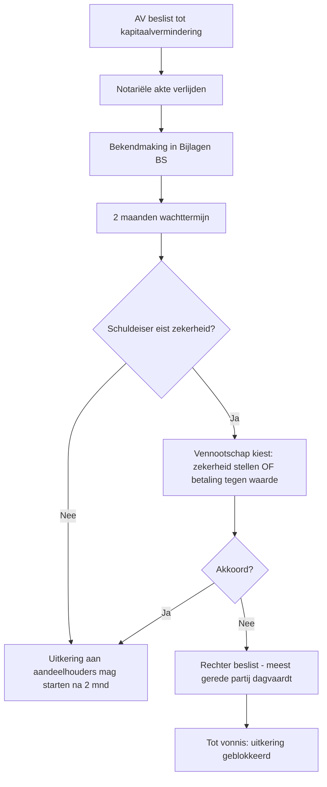

_Verrichting_ · ook: kapitaaldaling · share capital reduction · capital decrease

## Definitie

**Kapitaalvermindering** is de verrichting waarbij een vennootschap haar maatschappelijk kapitaal (NV) of haar onbeschikbare inbreng (BV/CV) verlaagt. Dit gebeurt via een **AV-besluit + statutenwijziging + notariële akte** (75%-meerderheid). De vermindering kan reëel zijn (terugbetaling aan aandeelhouders of vrijstelling van de volstortingsplicht) of formeel (aanzuivering van overgedragen verliezen). Bij NV is een **schuldeisersbeschermings-procedure** verplicht — schuldeisers hebben **2 maanden** vanaf bekendmaking om een zekerheid te eisen voor hun vorderingen (art. 7:195 WVV).

<small>📖 WVV — art. 7:195 — _wettekst_ · WVV — art. 7:208 — _wettekst_</small>

## Substantie

Economisch gaat het bij **reële vermindering** om een uitkering van eigen vermogen aan de aandeelhouders (terugbetaling kapitaal of vrijstelling nog te volstorten saldo) → de vennootschap verarmt. Bij **formele vermindering door aanzuivering verlies** verschuift het eigen vermogen binnen het EV (kapitaal ↓, verlies ↓ → totaal EV neutraal) — typische toepassing bij **alarmbel-vermindering** wanneer overgedragen verliezen het kapitaal hebben aangetast. Sinds de **Wet 25-12-2017** wordt elke reële vermindering bij NV/BV **pro rata** toegerekend aan het gestort kapitaal én aan de bestaande belaste reserves: het deel dat overeenstemt met reserves wordt fiscaal **geherkwalificeerd als dividend** en is onderworpen aan roerende voorheffing 30%.

<small>📖 WIB92 — art. 18, 2°ter — _wettekst_ · Programmawet 25-12-2017 — art. 86 — _wettekst_</small>

## Rationale

Het wettelijk kader rond kapitaalvermindering balanceert drie belangen: (1) **schuldeisersbescherming** — kapitaal is een minimumdekking voor schulden, dus uitkering verlaagt deze dekking → wachttermijn + zekerheidsrecht; (2) **flexibiliteit voor vennootschap** — overtollig kapitaal moet kunnen terugkeren naar aandeelhouders; (3) **fiscale neutraliteit** — voorkomen dat aandeelhouders dividend-belasting ontwijken via 'verkapte dividenden' onder de vorm van kapitaalvermindering (vandaar de pro-rata-regel sinds 2017). Bij **BV/CV** is het kapitaalconcept verdwenen; uitkering volgt **netto-actief-test + liquiditeitstest** (art. 5:142-5:144 WVV) — bestuur staat persoonlijk aansprakelijk bij overschatting.

<small>🔗 WVV — art. 5:142 — _wettekst_ · WVV — art. 5:143 — _wettekst_ · cluster-extract-agent (opus-4.7-1M) — _ai_model_ — (2026-05-28)</small>

## Gebruikscontext

**Status**: `in-voege` · sinds **2019-05-01** · basis: WVV (Wet 23-03-2019) + Programmawet 25-12-2017 voor fiscaal pro-rata

Pro-rata-toerekening reserves bij kapitaalvermindering is van toepassing op verminderingen waartoe vanaf 1 januari 2018 wordt besloten.

**✅ Voor**
- 🔗 Bij **overtollig kapitaal** — terugbetaling aan aandeelhouders wanneer de activiteit minder kapitaal vereist dan vroeger (krimp, opvolging, exit-vermogen).
- 📖 Bij **aanzuivering overgedragen verlies** — wanneer historische verliezen de continuïteit hypothekeren (alarmbel-trigger). De vermindering 'wist' het verlies door kapitaal-aanzuivering — geen uitstroom van middelen.
- 📖 Bij **vrijstelling volstortingsplicht** — aandeelhouders worden vrijgesteld van het saldo niet-opgevraagd kapitaal (NV — art. 7:195). Het kapitaal daalt zonder cash-uitkering.

**📋 Voorwaarden**
- 📖 **NV-procedure** — schuldeisersbescherming (art. 7:195 WVV): de schuldeisers hebben gedurende **2 maanden** na bekendmaking in het BS het recht een zekerheid te eisen voor vaststaande maar nog niet opeisbare vorderingen. De vennootschap kan dit afweren door betaling tegen waarde of door zekerheid te stellen.
- 📖 **BV/CV-procedure** — geen schuldeisersbescherming via wachttermijn, maar **dubbele test bij elke uitkering** (art. 5:142-144 WVV): (a) **netto-actief-test** — uitkering mag eigen vermogen niet onder onbeschikbare inbreng + statutair onbeschikbare reserves brengen; (b) **liquiditeitstest** — bestuur moet schriftelijk vaststellen dat de vennootschap, redelijkerwijze, gedurende minstens 12 maanden in staat is haar schulden te betalen. Beide tests worden in een **bestuursverslag** gemotiveerd; afwezigheid = persoonlijke aansprakelijkheid bestuur.
- 📖 **Notariële akte + 75%-meerderheid AV**: zelfde regel als bij verhoging (statutenwijziging).

**⚠️ Risico**
- 📖 **Bestuurdersaansprakelijkheid** wanneer netto-actief-test of liquiditeitstest verkeerd is toegepast bij BV/CV (art. 5:144 § 2 WVV — bestuurders hoofdelijk aansprakelijk tegenover de vennootschap en derden).
- 📖 **Fiscaal pro-rata-effect** — door art. 18, 2°ter WIB92 wordt elke reële vermindering deels als dividend belast (RV 30%) ook al juridisch is het 'terugbetaling kapitaal'. Onderschatten van dit effect kan leiden tot onaangename verrassingen voor aandeelhouders.

## Bouwstenen

### 📜 Drie modaliteiten van kapitaalvermindering

**Drie modaliteiten** kapitaalvermindering:

1. **Reële vermindering — terugbetaling aan aandeelhouders** (art. 7:195 NV / 5:142 BV). Cash-uitkering vanuit EV. Schuldeisersbescherming 2 maanden (NV) of dubbele test (BV).

2. **Reële vermindering — vrijstelling volstortingsplicht** (NV). Aandeelhouders hoeven het saldo niet-opgevraagd kapitaal niet meer te storten. Geen cash-uitkering nu, maar verlies van toekomstige inning. Idem schuldeisersbescherming 2 maanden.

3. **Formele vermindering — aanzuivering overgedragen verlies** (art. 7:196 WVV). Boekhoudkundige verschuiving binnen EV: D 100 Geplaatst kapitaal / C 141 Overgedragen verlies. Geen schuldeisersbescherming (geen vermogensafvloei). Vaak gebruikt bij alarmbel-herstel.

<small>📖 WVV — art. 7:195 — _wettekst_ · WVV — art. 7:196 — _wettekst_ · WVV — art. 5:142 — _wettekst_</small>

### 📜 Pro-rata-toerekening kapitaal/reserves (Wet 25-12-2017)

Sinds **Wet 25-12-2017** wordt elke reële kapitaalvermindering (NV én BV inbreng-vermindering) **pro rata** toegerekend aan:

- het **fiscaal gestort kapitaal** (deel = belastingvrij, terugbetaling kapitaal);
- de **bestaande belaste reserves** (geïncorporeerd of niet) — dit deel wordt fiscaal **geherkwalificeerd als dividend** → RV 30% (of 15% voor liquidatiereserve > 5j).

**Verhouding** = (fiscaal gestort kapitaal) / (fiscaal gestort kapitaal + belaste reserves). De aandeelhouder ontvangt het bruto bedrag, de vennootschap betaalt de RV 30% op het reserves-deel.

**Excluded**: belastingvrije reserves (bv. liquidatiereserve) volgen aparte regels; vermindering door aanzuivering verlies = geen reële vermindering, geen pro-rata.

<small>📖 WIB92 — art. 18, 2°ter — _wettekst_ · Programmawet 25-12-2017 — art. 85-88 — _wettekst_</small>

**Rationale**: Anti-misbruik: voor 2018 konden vennootschappen 'kunstmatig' kapitaal verhogen via incorporatie van belaste reserves, om dat kapitaal later belastingvrij terug te betalen. De pro-rata-regel sluit deze route af.

<small>🔗 Programmawet 25-12-2017 — art. 85-88 — _wettekst_ · cluster-extract-agent (opus-4.7-1M) — _ai_model_ — (2026-05-28)</small>

### 👣 Schuldeisersbescherming bij NV — procedure

**Schuldeisersbescherming-procedure bij NV-kapitaalvermindering** (art. 7:195 WVV):



**Welke vorderingen?** Vaststaande maar nog niet opeisbare vorderingen op het ogenblik van de bekendmaking, plus vorderingen waarvoor procedure was ingesteld vóór de AV. **Niet**: vorderingen ontstaan na de bekendmaking.

<small>📖 WVV — art. 7:195 — _wettekst_</small>

### 👣 BV/CV — netto-actief-test + liquiditeitstest

**BV/CV-vermindering van de inbreng**: omdat de BV geen kapitaal-concept meer kent, vervangt WVV de schuldeisersbescherming door **twee cumulatieve tests** (art. 5:142 + 5:143 + 5:144 WVV):

**Test 1 — Netto-actief-test (art. 5:142):** uitkering mag het netto-actief niet onder de som van (a) onbeschikbare inbreng + (b) statutair onbeschikbare reserves brengen. AV beslist op basis van laatst goedgekeurde JR of recentere staat (max. 6 mnd oud).

**Test 2 — Liquiditeitstest (art. 5:143):** bestuur stelt schriftelijk vast dat de vennootschap, gelet op de te verwachten ontwikkelingen, redelijkerwijze in staat zal zijn om gedurende een periode van **minstens 12 maanden** haar opeisbare schulden te betalen. Bestuursverslag = verplicht, eventueel met commissaris-verklaring.

**Sanctie (art. 5:144):** ontbreekt één van beide tests of zijn ze foutief → de uitkering kan worden teruggevorderd én de bestuurders zijn hoofdelijk aansprakelijk tegenover de vennootschap en derden.

<small>📖 WVV — art. 5:142 — _wettekst_ · WVV — art. 5:143 — _wettekst_ · WVV — art. 5:144 — _wettekst_</small>

## Voorbeelden

> [!example]- NV Capitaal — reële vermindering met pro-rata-toerekening
> _NV Capitaal heeft EV: kapitaal €500.000 (fiscaal gestort), belaste reserves €300.000, overgedragen winst €200.000 (= totaal EV €1.000.000). AV beslist op 30-06-2026 een vermindering van €100.000 via terugbetaling aan aandeelhouders. Notariële akte + bekendmaking 5-07-2026. Geen verzet schuldeisers binnen 2 maanden._
>
> **🧮 Pro-rata-berekening fiscaal gestort kapitaal vs reserves**
>
> - Stap 1 — Verhouding: fiscaal gestort kapitaal €500.000 / (€500.000 + €300.000 belaste reserves) = 5/8 = 62,5%
> - Stap 2 — Kapitaal-deel van vermindering: €100.000 × 62,5% = €62.500 (belastingvrij)
> - Stap 3 — Reserves-deel: €100.000 × 37,5% = €37.500 (= dividend voor RV-doeleinden)
> - Stap 4 — RV 30% × €37.500 = €11.250 (ingehouden door vennootschap, doorgestort aan FOD Financiën)
> - Stap 5 — Netto-uitkering aandeelhouders: €100.000 - €11.250 = €88.750
>
> **📒 Boekingen — kapitaalvermindering NV Capitaal**
>
> **📊 Eigen vermogen — VOOR vs NA**
>
> ```json
> {
>   "kolommen": [
>     "Rubriek",
>     "VOOR (€)",
>     "NA (€)"
>   ],
>   "rijen": [
>     [
>       "Geplaatst kapitaal",
>       "500.000",
>       "400.000"
>     ],
>     [
>       "Belaste reserves",
>       "300.000",
>       "300.000"
>     ],
>     [
>       "Overgedragen winst",
>       "200.000",
>       "200.000"
>     ],
>     [
>       "TOTAAL EV",
>       "1.000.000",
>       "900.000"
>     ]
>   ],
>   "conclusie": "Cash-uitstroom €100.000 (€88.750 aandeelhouders + €11.250 fiscus). Boekhoudkundig vermindert alleen rekening 100; de reserves blijven onaangetast in de boekhouding, maar fiscaal worden ze 'geconsumeerd' pro rata (cumulatief geheugen via 211/212 fiscale tabel)."
> }
> ```
>
> <small>🔗 WVV — art. 7:195, 7:208 — _wettekst_ · WIB92 — art. 18, 2°ter — _wettekst_</small>

> [!example]- NV HerstelCo — kapitaalvermindering door aanzuivering verlies
> _NV HerstelCo heeft kapitaal €200.000, overgedragen verlies €(-150.000), liquide middelen €5.000. EV = €50.000 — alarmbel-zone bereikt. AV beslist op 1-06-2026 om €150.000 kapitaal aan te zuiveren tegen het verlies._
>
> **📒 Boeking — Aanzuivering verlies via kapitaalvermindering**
>
> _Pure interne EV-verschuiving. Geen cash-uitstroom. Geen schuldeisersbescherming nodig (geen vermogensafvloei). Geen pro-rata-effect (geen reële vermindering)._
>
> **📊 Eigen vermogen — VOOR vs NA aanzuivering**
>
> ```json
> {
>   "kolommen": [
>     "Rubriek",
>     "VOOR (€)",
>     "NA (€)"
>   ],
>   "rijen": [
>     [
>       "Geplaatst kapitaal",
>       "200.000",
>       "50.000"
>     ],
>     [
>       "Overgedragen verlies",
>       "-150.000",
>       "0"
>     ],
>     [
>       "TOTAAL EV",
>       "50.000",
>       "50.000"
>     ]
>   ],
>   "conclusie": "Totaal EV onveranderd. Alleen de presentatie verandert: vennootschap toont nu kapitaal €50.000 zonder gecumuleerde verliezen → minder zorgwekkend signaal naar derden. Toekomstige winsten kunnen meteen uitkeerbaar worden ipv eerst verlies te recupereren."
> }
> ```
>
> <small>🔗 WVV — art. 7:196 — _wettekst_</small>

> [!example]- BV DeltaCo — vermindering van inbreng + dubbele test
> _BV DeltaCo: onbeschikbare inbreng €300.000, beschikbare reserves €100.000, liquide middelen €250.000, schulden korte termijn €200.000. AV beslist op 15-09-2026 een vermindering van inbreng met €80.000 (terugbetaling aandeelhouders)._
>
> **📋 Test 1 — Netto-actief-test (art. 5:142)**
>
> | Element | Voor (€) | Na uitkering (€) | OK? |
>
> | --- | --- | --- | --- |
>
> | Onbeschikbare inbreng (klasse 11) | 300.000 | 220.000 | — |
>
> | Beschikbare reserves (klasse 133) | 100.000 | 100.000 | — |
>
> | Statutair onbeschikbaar? | 0 | 0 | — |
>
> | Vereist EV-minimum (na uitkering) | — | 220.000 (onbeschikbare inbreng) | — |
>
> | Werkelijk EV na uitkering | — | 320.000 (220 + 100) | ✓ Voldoende |
>
> → **EV na uitkering €320.000 > onbeschikbare inbreng €220.000 → netto-actief-test PASSED.**
>
> **📋 Test 2 — Liquiditeitstest (art. 5:143)**
>
> | Element | Bedrag (€) |
>
> | --- | --- |
>
> | Liquide middelen na uitkering | 170.000 |
>
> | Verwachte cashflow uit operaties komende 12 mnd | 200.000 |
>
> | Te betalen schulden komende 12 mnd | 200.000 |
>
> | Totaal beschikbaar voor schulden | 370.000 |
>
> | Conclusie bestuur | Vennootschap kan haar opeisbare schulden gedurende minstens 12 mnd voldoen → test PASSED. Bestuursverslag opgesteld. |
>
> **📒 Boekingen BV DeltaCo**
>
> <small>🔗 WVV — art. 5:142, 5:143, 5:144 — _wettekst_</small>

## Valkuilen

> [!warning]- Kapitaalvermindering = belastingvrij
> **Verkeerde assumptie**: Geld dat de vennootschap aan aandeelhouders terugbetaalt via kapitaalvermindering is altijd belastingvrij.
>
> **Kernpunt**: Sinds Wet 25-12-2017 (art. 18, 2°ter WIB92) wordt elke reële vermindering pro rata toegerekend aan kapitaal én belaste reserves. Het reserves-deel = dividend → RV 30%. Voor de aandeelhouder kan dit duizenden EUR's verschil maken — vroegtijdig fiscaal advies inwinnen.
>
> <small>📖 WIB92 — art. 18, 2°ter — _wettekst_</small>

> [!warning]- Geen schuldeiserstest bij BV
> **Verkeerde assumptie**: Omdat BV geen schuldeisersbeschermings-wachttermijn heeft (zoals NV), is uitkering uit BV altijd vrij.
>
> **Kernpunt**: BV heeft GEEN 2-mnd-wachttermijn, MAAR de dubbele test (netto-actief + liquiditeit) is strenger in de praktijk — bestuur staat persoonlijk aansprakelijk (art. 5:144). Bovendien moet voor BV de liquiditeitstest schriftelijk worden gemotiveerd in bestuursverslag (12-maanden-prognose).
>
> <small>📖 WVV — art. 5:142-5:144 — _wettekst_</small>

> [!warning]- Aanzuivering verlies = pro-rata
> **Verkeerde assumptie**: Ook bij aanzuivering van verlies geldt de pro-rata-toerekening tussen kapitaal en reserves.
>
> **Kernpunt**: Pro-rata-regel (art. 18, 2°ter WIB92) geldt enkel bij **reële vermindering** met vermogensafvloei. Aanzuivering verlies is een interne EV-verschuiving — geen reële uitkering, geen pro-rata, geen RV. Wel: bij latere kapitaalverhoging via incorporatie reserves om het 'gesneuvelde' kapitaal te herstellen kan de pro-rata-cyclus opnieuw worden.
>
> <small>🔗 WIB92 — art. 18, 2°ter — _wettekst_ · cluster-extract-agent (opus-4.7-1M) — _ai_model_ — (2026-05-28)</small>

## Speelruimtes

### 🎚️ Reële vermindering — terugbetaling of vrijstelling volstortingsplicht?

## Accountant-perspectieven

### Vanuit de vennootschap

_Accountant adviseert over fiscale optimalisatie, voert pro-rata-berekening uit, en stelt bij BV de tests-documentatie op._

#### 💰 Fiscaal adviseur

##### 👣 Pro-rata-fiscaal advies + RV-aangifte

**Stappenplan voor accountant**:

1. **Inventarisatie EV-componenten** vóór de vermindering: opvragen 'fiscaal gestort kapitaal' uit fiscale tabel (211 + 212 aangifte VenB), belaste reserves, belastingvrije reserves, liquidatiereserve per vintage.
2. **Berekening pro-rata-verhouding**: kapitaal / (kapitaal + belaste reserves).
3. **Toepassing op vermindering-bedrag**: kapitaal-deel × 0% RV; reserves-deel × 30% RV (of 15% liquidatiereserve > 5 j).
4. **Aangifte roerende voorheffing (formulier 273A)** binnen 15 dagen na toekenning of betaling van het dividend-deel.
5. **Bijwerking fiscale tabel** (aangifte VenB van het lopende boekjaar): fiscaal gestort kapitaal ↓, belaste reserves ↓ pro rata.
6. **Notulering AV + bestuursverslag** archiveren met pro-rata-berekening (5j-bewaarplicht art. III.86 WER).

<small>🔗 WIB92 — art. 18, 2°ter, art. 269 — _wettekst_ · cluster-extract-agent (opus-4.7-1M) — _ai_model_ — (2026-05-28)</small>

#### 📒 Boekhouder

##### 👣 Boekhoudkundige verwerking

**Boekingsschema** kapitaalvermindering:

1. **Terugbetaling (NV) — na 2 mnd wachttermijn**:
```
D 100 Geplaatst kapitaal
  C 489 Te betalen aan aandeelhouders
```
Bij effectieve betaling: D 489 / C 550 Bank − 453 Ingehouden RV op reserves-deel.

2. **Aanzuivering verlies**:
```
D 100 Geplaatst kapitaal
  C 141 Overgedragen verlies
```

3. **Vrijstelling volstortingsplicht (NV)**:
```
D 100 Geplaatst kapitaal (= vermindering geplaatst kapitaal met niet-volstort deel)
  C 101 Niet-opgevraagd kapitaal (verdwijnt — vordering uitgedoofd)
```
Netto-effect op cash = nul; netto-effect op EV = nul (beide rubrieken contra-elkaar weggeboekt).

<small>🔗 cluster-extract-agent (opus-4.7-1M) — _ai_model_ — (2026-05-28)</small>

## Verder lezen (scope-out)

- → Tegenhanger: kapitaalverhoging → [[kapitaalverhoging]] _(moet-verwijzen)_
- → Alarmbel-procedure bij verlies > drempel → ⏳ alarmbel-procedure _(moet-verwijzen)_
- → Kapitaalbescherming — netto-actief-test bij uitkeringen aandeelhouders → [[kapitaalbescherming]] _(moet-verwijzen)_
- → Winstuitkering — pro-rata-herkwalificatie als dividend → [[winstuitkering]] _(moet-verwijzen)_

## Relaties

### `valt_onder`
- ⏳ vennootschapsrecht
### `vereist`
- [[kapitaalbescherming]]
### `beinvloed_door`
- [[algemene-vergadering]]
### `vergelijkbaar_met`
- [[kapitaalverhoging]]
    - **Gelijkenissen**:
        - Beide vereisen statutenwijziging + notariële akte + 75% AV-meerderheid
        - Beide volgen procedure WVV boek 7 hoofdstuk Kapitaal (NV) en boek 5 (BV)
    - **Verschillen**:
        - Verhoging = EV ↑, externe inbreng; vermindering = EV ↓, uitkering of verlies-aanzuivering
        - Verhoging kent voorkeurrecht; vermindering kent schuldeisersbescherming (NV 2 mnd) of dubbele test (BV)
        - Verhoging heeft geen pro-rata-effect; vermindering wel (art. 18, 2°ter WIB92)
    - ⚠️ **Verwarringsrisico**: Beide raken EV — de juridische procedures lijken op elkaar (notaris + 75%), maar de derden-bescherming-mechaniek is fundamenteel anders.
