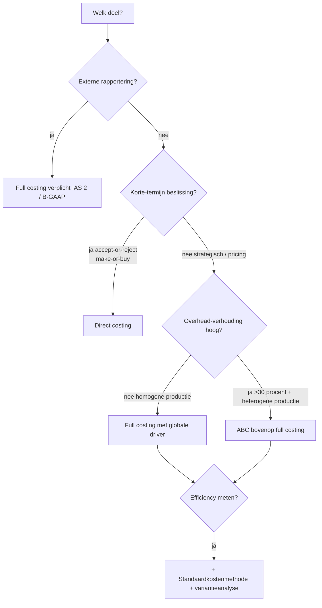

_Kader_ · ook: costing methods

## Definitie

Kostprijsmethoden zijn de gestructureerde technieken die binnen de analytische boekhouding gebruikt worden om de kostprijs van een product, dienst of project te berekenen. Vier hoofdmethodes worden onderscheiden langs twee assen. (1) Wat-wordt-meegerekend: full costing (alle kosten — vast + variabel) versus direct costing (alleen variabele kosten in de product-kostprijs). (2) Hoe-worden-de-cijfers-bepaald: vastgesteld of historisch (werkelijke kosten achteraf) versus voorafbepaald of standaard (normkosten vooraf, met variantieanalyse achteraf). Activity-Based Costing (ABC) verfijnt de toerekening van indirecte kosten via activity-pools en cost-drivers — kan in principe op zowel full als direct costing gestapeld worden.

<small>🔗 cluster-extract-agent (opus-4.7-1M) — _ai_model_ — (2026-05-28)</small>

## Substantie

De keuze van methode hangt niet af van wat 'correct' is in absolute zin — alle vier zijn coherente boekhoudkundige redeneringen — maar van het doel: prijszetting voor de markt vraagt full costing (anders dek je geen vaste kosten over de lange termijn); short-term beslissingen (extra order accepteren? eigen productie of inkopen?) vragen direct costing (alleen variabele kosten zijn beslissings-relevant); efficiency-opvolging vraagt standaardkosten (vergelijk werkelijk vs norm); precisie in heterogene productie met veel overhead vraagt ABC. Veel ondernemingen gebruiken meerdere methodes parallel — full costing voor de jaarrekening, direct costing voor de operationele dashboard, ABC voor strategische pricing.

<small>🔗 cluster-extract-agent (opus-4.7-1M) — _ai_model_ — (2026-05-28)</small>

## Rationale

Geen enkele kostprijsmethode is universeel beter — elke maakt een trade-off tussen accuratesse en eenvoud, en tussen lange-termijn-rendement (full costing) en korte-termijn-beslissingen (direct costing). De gecertificeerd accountant moet de keuze kunnen motiveren vanuit het managementdoel, niet vanuit 'wat-staat-er-in-het-handboek'. Een productie-bedrijf met homogene producten en lage overhead vaart wel met full costing; een dienstverlener met klant-specifieke projecten en hoge overhead vaart wel met ABC.

<small>🔗 cluster-extract-agent (opus-4.7-1M) — _ai_model_ — (2026-05-28)</small>

## Gebruikscontext

**✅ Voor**
- 🔗 Elke onderneming die meer wil weten dan haar globaal resultaat — die wil weten wat de kostprijs is per product, per klant of per dienst, om prijszetting te onderbouwen, marges te bewaken of beslissingen over product-mix en investeringen te maken.

## Bouwstenen

### 💡 Twee assen — wat meerekenen × hoe bepalen

As 1 (volledigheid van kostentoerekening): full costing rekent alle productiekosten (vast + variabel) toe aan het product. Direct costing rekent enkel variabele kosten toe — vaste kosten zijn periodekosten die niet in de stockwaardering komen. As 2 (tijdshorizon van de cijfers): vastgesteld of werkelijk (kosten worden achteraf bepaald uit de boekhouding) versus voorafbepaald of standaard (kosten worden vooraf vastgelegd als norm; afwijkingen ten opzichte van die norm worden geanalyseerd via variantieanalyse). De keuze op as 1 en as 2 zijn onafhankelijk: 'full + werkelijk', 'full + standaard', 'direct + werkelijk', 'direct + standaard' zijn allemaal denkbare combinaties.

<small>🔗 cluster-extract-agent (opus-4.7-1M) — _ai_model_ — (2026-05-28)</small>

### 💡 ABC als verfijning, niet als vierde alternatief

Activity-Based Costing wordt didactisch vaak naast full/direct/standaard gezet als 'vierde methode', maar het zit op een andere as. ABC zegt niets over of vaste kosten in de productkost moeten zitten (full vs direct) of of normkosten worden gebruikt (vastgesteld vs standaard). ABC zegt hoe indirecte kosten worden toegerekend: niet via één algemene cost-driver (typisch arbeidsuren of machine-uren), maar via meerdere activity-pools met elk hun eigen driver. ABC bovenop full costing geeft preciezere full-costs; ABC bovenop standaardkostenmethode geeft preciezere normen.

<small>🔗 cluster-extract-agent (opus-4.7-1M) — _ai_model_ — (2026-05-28)</small>

### 🧭 Accuratesse versus eenvoud — implementatie-kosten

Hoe meer methodes en hoe verfijnder de toerekening, hoe nauwkeuriger de kostprijs — maar hoe duurder ook de boekhoudkundige opvolging. Een ABC-systeem met 30 activity-pools geeft micro-accurate kostprijzen maar vraagt continue meting van drivers. Een eenvoudig full-costing-model met één globale overhead-coëfficiënt is grof maar bijna kosteloos in onderhoud. Vuistregel: investeer in verfijning waar de directie effectief stuurt en waar de overhead-verhouding hoog is (>30% van totale kost).

<small>🔗 cluster-extract-agent (opus-4.7-1M) — _ai_model_ — (2026-05-28)</small>

## Voorbeelden

> [!example]- Zelena Bio NV — zelfde tafel-productie, vier kostprijzen
> _Zelena Bio produceert 100 tafels in maart. Variabele kosten per tafel: 250 EUR (hout 200 + variabele arbeid 50). Vaste productiekosten maand: 20.000 EUR (huur fabriek, afschrijving CNC, kaderloon). Geen voorraadwijziging (alle 100 tafels verkocht)._
>
> | Methode | Kostprijs per tafel | Rationale | Geschikt voor |
>
> | --- | --- | --- | --- |
>
> | Full costing (werkelijk) | 250 + (20.000/100) = 450 EUR | Alle kosten gedeeld door volume | Lange-termijn prijszetting · jaarrekening-stockwaardering |
>
> | Direct costing | 250 EUR (vaste 20.000 als periodekost) | Alleen variabele kosten in productkost | Make-or-buy · accept-or-reject · break-even-analyse |
>
> | Standaardkostenmethode (full) | Norm: 220 + (18.000/100) = 400 EUR | Voorafbepaalde normkosten; afwijking 50 EUR/tafel = variantie | Efficiency-opvolging · budgetcontrole |
>
> | ABC (full) | 250 + (afwijkende overhead-allocatie via activity-pools) | Indirecte kosten via meerdere drivers | Heterogene productie · hoge overhead-verhouding |
>
> <small>🔗 cluster-extract-agent (opus-4.7-1M) — _ai_model_ — (2026-05-28)</small>

## Valkuilen

> [!warning]- Eén methode als 'de juiste' beschouwen
> **Verkeerde assumptie**: 'Full costing is correct want anders dek je geen vaste kosten' of 'direct costing is moderner'.
>
> **Kernpunt**: Geen enkele methode is intrinsiek correcter. De keuze hangt af van het beslissingsdoel. Voor de jaarrekening-stockwaardering is full costing wel verplicht (zowel onder B-GAAP als IAS 2). Voor interne beslissingen primeert relevantie boven volledigheid.
>
> <small>🔗 cluster-extract-agent (opus-4.7-1M) — _ai_model_ — (2026-05-28)</small>

> [!warning]- Direct-costing-kostprijs gebruiken voor langetermijn-prijszetting
> **Verkeerde assumptie**: Een prijs zetten op basis van variabele kost + winstmarge.
>
> **Kernpunt**: Direct costing dekt geen vaste kosten. Bij langetermijn-prijszetting moet de marge boven variabele kost groot genoeg zijn om de vaste kosten te dragen over het totale volume. Direct costing levert de contributiemarge — niet de eindprijs.
>
> <small>🔗 cluster-extract-agent (opus-4.7-1M) — _ai_model_ — (2026-05-28)</small>

> [!warning]- Standaardkosten gelijkstellen aan budgetkosten
> **Verkeerde assumptie**: Standaardkost = budget per eenheid.
>
> **Kernpunt**: Een standaardkost is een norm-kost per eenheid (engineered standard, ideaal of haalbaar). Een budget is een totaalbedrag voor een periode (volume × standaardkost + vaste budgetposten). Standaardkosten zijn input voor budgetten — niet hetzelfde concept.
>
> <small>🔗 cluster-extract-agent (opus-4.7-1M) — _ai_model_ — (2026-05-28)</small>

## Syntheses

### 🧩 Synthese

Keuze van kostprijsmethode in functie van het management-doel.

| As | Doel | Aanbevolen methode |
| --- | --- | --- |
| **** |  |  |
| **** |  |  |
| **** |  |  |
| **** |  |  |
| **** |  |  |
| **** |  |  |
| **** |  |  |

### 🧩 Beslisboom

Keuze-flow van methode.

## Accountant-perspectieven

### Kmo-cliente met sturingsvraag

_Een kmo-cliente wil weten welke kostprijsmethode bij haar past._

#### 🧭 Adviseur

##### 👣 Doel eerst bevragen — niet methode

Eerste vraag aan de cliente: 'wat wil je weten en welke beslissing wil je daarop bouwen?' — niet 'welke methode wil je?'. Pas na het doel komt de methode-keuze. Vaak blijkt de cliente in feite verschillende doelen tegelijk te willen — dan twee methodes parallel opzetten (bv. full costing in de jaarrekening, direct costing in een operationele dashboard).

<small>🔗 cluster-extract-agent (opus-4.7-1M) — _ai_model_ — (2026-05-28)</small>

## Verder lezen (scope-out)

- → Full-costing (volledige kostencalculatie) → [[full-costing]] _(moet-verwijzen)_
- → Direct-costing (variabele-kost-aanpak) → [[direct-costing]] _(moet-verwijzen)_
- → Standaardkostenmethode (voorafbepaald) → [[standaardkostenmethode]] _(moet-verwijzen)_
- → Activity-Based Costing → [[activity-based-costing]] _(moet-verwijzen)_

## Relaties

### `valt_onder`
- [[analytische-boekhouding]]
### `bevat`
- [[full-costing]]
- [[direct-costing]]
- [[standaardkostenmethode]]
- [[activity-based-costing]]
