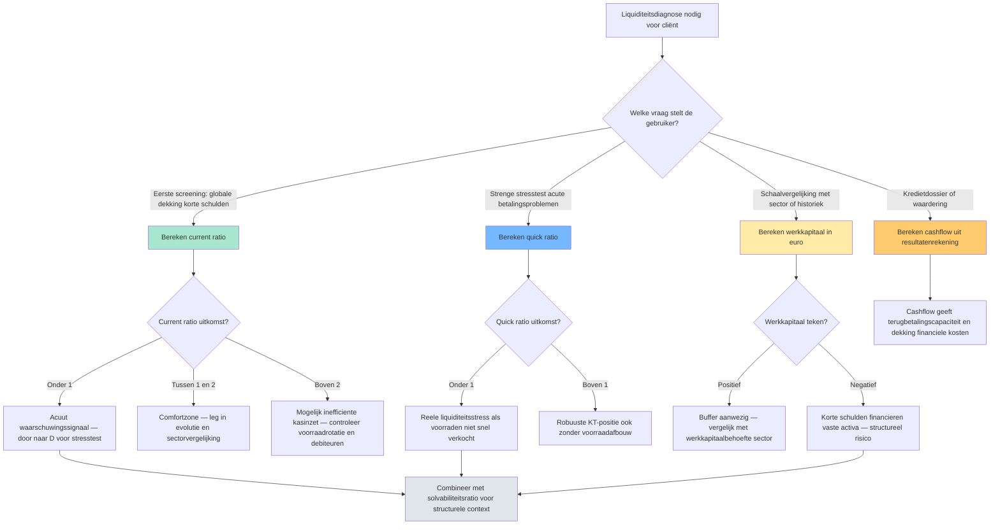

# Welke liquiditeitstoets gebruik ik? — Beslisboom 🤖

Bij een liquiditeitsdiagnose bestaan minstens drie instrumenten met overlap en verschil: current ratio (alle vlottende activa tegenover korte schulden), quick ratio (zelfde maar zonder voorraden) en werkkapitaal (zelfde verschil maar in absolute euro's). Stagiairs kiezen vaak één willekeurig en negeren de andere — dat is de kern van een examenvalkuil. Dit synthese-record geeft per scenario aan welke toets je primair gebruikt, welke je als kruis-controle leest, en welke valkuilen aan elke toets kleven. De drie toetsen zijn complementair: pas wanneer je ze samen leest krijg je een betrouwbare diagnose.

## Vergelijkingstabel

| Toets | Wat meet ze? | Formule | Sterkte | Zwakte / valkuil |
|---|---|---|---|---|
| [[current-ratio\|Current ratio]] | Brede liquiditeit in ruime zin (verhouding) | vlottende activa / schulden ≤ 1 jaar | Snelle screening; vergelijkbaar tussen bedrijven van verschillende grootte | Hoge ratio kan opgeblazen voorraden of trage debiteuren verbergen |
| [[quick-ratio\|Quick ratio]] (zuurtegraad) | Liquiditeit in enge zin — zonder voorraden | (vlottende activa − voorraden) / schulden ≤ 1 jaar | Strenger; relevant bij voorraad-intensieve sectoren | Vorderingen worden als snel-cashbaar verondersteld; bij dubieuze debiteuren overschat ze |
| [[werkkapitaal\|Werkkapitaal]] | Absolute liquiditeitsbuffer in euro | vlottende activa − schulden ≤ 1 jaar | Toont schaal die ratio's verbergen | Twee bedrijven met zelfde werkkapitaal kunnen totaal verschillende risicoprofielen hebben (sectorgevoelig) |
| [[cashflow-analyse\|Cashflow]] (winst + niet-kaskosten) | Kasgeneratie uit eigen werking | resultaat + afschrijvingen + waardeverminderingen + voorzieningen | Filtert boekhoudkundige niet-kaselementen weg | Eenmalige voorzieningen kunnen cashflow van één boekjaar fors verhogen |

## Beslisboom

## Kerninzichten

- Current ratio en quick ratio zijn geen alternatieven — ze zijn complementair. Bij Rotex Roeselare NV: current 2,0 en quick 1,375. Het verschil tussen beide (0,625) is volledig toe te schrijven aan de voorraden (€ 2.500.000 op € 4.000.000 korte schulden). Het verschil zelf is dus een ratio-component: de mate waarin de liquiditeit op voorraden steunt. 🤖
  - _Rationale_: Voorbeeldcijfers uit `current-ratio.berekeningsmethode` en `quick-ratio.berekeningsmethode`.
- Werkkapitaal als absoluut bedrag corrigeert een verborgen valkuil van ratio's: schaal. Meubelzaak Mertens BV en Rotex Roeselare NV kunnen beide current ratio rond 1,3 hebben, maar werkkapitaal € 200.000 versus € 4.000.000. Voor financierings-capaciteit en investeringsruimte is de absolute buffer relevanter dan de verhouding. 🤖
  - _Rationale_: Schaalverschil expliciet in `werkkapitaal.bouwstenen[0].voorbeeld_inline`.
- Een acute liquiditeitsstress (current ratio onder 1) zegt nog niets over levensvatbaarheid. Combineer altijd met de solvabiliteitsratio (structurele basis) en de cashflow (kasgeneratie). Een tijdelijk illiquide maar solvabel bedrijf kan financiering brugkalmen via een banklijn; een liquide maar onsolvabel bedrijf staat op een tijdbom. 🤖
  - _Rationale_: Complementariteit uit `liquiditeitsratio.vergelijkingsparen` met solvabiliteit.
- Cash ratio (geldbeleggingen + liquide middelen / korte schulden) is de strengste van de liquiditeitsfamilie maar krijgt in de standaard 1.3-records geen apart record. Voor voorraadintensieve sectoren of acute stress-scenario's is dat de meest waardevolle van de drie — zie open gap voor uitwerking. 🤖
  - _Rationale_: Cash ratio wordt aangehaald in `liquiditeitsratio.bouwstenen[0]` maar zonder eigen record (gelogd als gap).

## Bronnen

[^1]: `anchor-1.3.II.C`
[^2]: `CBN-2011-14-herwaarderingsmeerwaarden__sec_rentabiliteit-van-het-eigen-vermogen-voorbeeldmethoden`
