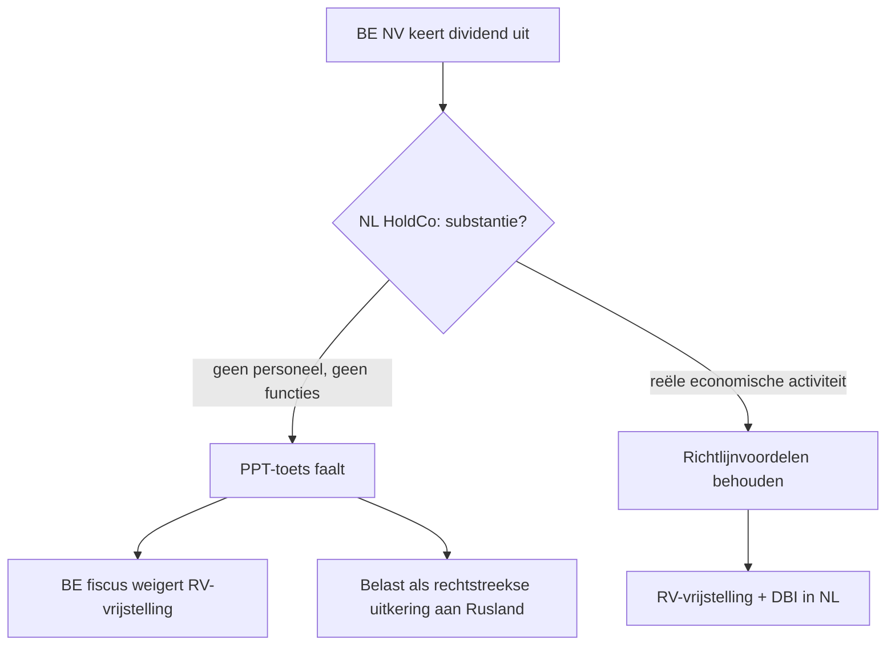

# Moeder-dochterrichtlijn

_Regime_

📋 Regeling · Anchors: `2.8.III` · Wave: `skeleton-btw-internationaal-2026-05-28`

> [!info] 📝 **Concept** — content gevuld door cluster-extract; niet door mens-verify gegaan.

**Afk.**: MDR — **Synoniemen**: parent-subsidiary directive · PSD · moeder-dochter-richtlijn — **Vertalingen**: fr: directive mère-filiale · en: Parent-Subsidiary Directive

## Definitie

📖 De Moeder-dochterrichtlijn (Richtlijn 2011/96/EU) is een EU-richtlijn die een gemeenschappelijke fiscale regeling oplegt voor dividenden tussen verbonden vennootschappen uit verschillende EU-lidstaten. Doel: dubbele belasting wegnemen op winstuitkeringen binnen een grensoverschrijdende moeder-dochter-groep in de Europese Unie. De richtlijn werkt op twee niveaus: (1) de dochter-lidstaat moet de uitgekeerde winst vrijstellen van bronbelasting (roerende voorheffing); (2) de moeder-lidstaat moet de ontvangen dividenden ofwel vrijstellen, ofwel een verrekeningskrediet geven voor de door de dochter betaalde vennootschapsbelasting. De richtlijn vervangt sinds 2011 de oorspronkelijke Richtlijn 90/435/EEG.

<small>📚 Richtlijn 2011/96/EU — art. 1 — _richtlijn_ · Richtlijn 2011/96/EU — art. 4 — _richtlijn_ · Richtlijn 2011/96/EU — art. 5 — _richtlijn_ · Richtlijn 2011/96/EU — art. 9 — _richtlijn_</small>

## Substantie

🔗 Zonder de richtlijn zou een dividend dat een Belgische dochter aan een Franse moeder uitkeert tweemaal worden belast: één keer als vennootschapsbelasting bij de dochter, één keer als bronbelasting bij de uitkering, en mogelijk een derde keer als belastbare opbrengst bij de moeder. De richtlijn schakelt twee van die drie belastingmomenten uit: geen RV op de uitkering (art. 5) en vrijstelling of verrekening bij de moeder (art. 4). Resultaat: dezelfde fiscale neutraliteit als binnen één lidstaat — de groep kan winsten van dochter naar moeder doorschuiven zonder fiscale tol bij elke grens. Voor België vertaalt zich dat moederzijdig in de DBI-aftrek (definitief belaste inkomsten) op het niveau vennootschapsbelasting, en dochterzijdig in de RV-vrijstelling van art. 106 KB-WIB.

<small>📚 Richtlijn 2011/96/EU — art. 4 — _richtlijn_ · Richtlijn 2011/96/EU — art. 5 — _richtlijn_ · cluster-extract-agent (opus-4.7-1M) — _ai_model_ — (2026-05-28)</small>

## Rationale

🔗 De ratio legis is dubbel: (1) wegnemen van fiscale belemmeringen voor de oprichting en werking van grensoverschrijdende groepen binnen de interne markt — de richtlijn hoort thuis in het kader van de vrije vestiging en het vrije kapitaalverkeer (art. 49 + 63 VWEU); (2) eliminatie van economische dubbele belasting op winst die langs verschillende vennootschappen in de keten passeert. Het idee is dat eenmaal belaste winst op het niveau van de dochter, niet opnieuw belast mag worden bij de moeder louter omdat er een grens tussenligt. De keuze tussen vrijstellings- en verrekeningsmethode (art. 4 lid 1 a/b) wordt aan de lidstaat overgelaten — België koos voor de vrijstelling via de DBI-aftrek.

<small>📚 Richtlijn 2011/96/EU — preambule (overweging 3-4) — _richtlijn_ · Richtlijn 2011/96/EU — art. 4 lid 1 — _richtlijn_ · cluster-extract-agent (opus-4.7-1M) — _ai_model_ — (2026-05-28)</small>

## Gebruikscontext

**Status**: `in-voege` · sinds **1990-07-23 (Richtlijn 90/435/EEG) — 2011-11-30 (herschikking 2011/96/EU)** · basis: Richtlijn 2011/96/EU van de Raad van 30 november 2011

Voorgangerrichtlijn 90/435/EEG werd ingetrokken en geconsolideerd in 2011/96/EU (art. 9). In 2015 werd een verplichte anti-misbruik-clausule toegevoegd via Richtlijn 2015/121/EU (PPT — principal purpose test).

**✅ Voor**
- 📖 Grensoverschrijdende dividenduitkeringen tussen een moedermaatschappij en een dochteronderneming uit verschillende EU-lidstaten, waarbij beide vennootschappen onderworpen zijn aan een vennootschapsbelasting in hun lidstaat (art. 2) en de deelneming minstens 10 % bedraagt (art. 3 lid 1 a).
- 📖 Ook van toepassing wanneer de moeder via een vaste inrichting in een andere lidstaat dividenden ontvangt of uitkeert (art. 1 lid 1 c-d en art. 3 lid 1 a ii) — vaste inrichting krijgt zelfde behandeling als de hoofdvennootschap.

**🚫 Niet voor**
- 📖 Dividenden uit derde landen (niet-EU): de richtlijn vereist dat beide vennootschappen 'van een lidstaat' zijn. Voor dividenden uit niet-EU-staten geldt nationale wetgeving + eventueel een dubbelbelastingverdrag.
- 📖 Winst uitgekeerd bij de liquidatie van de dochteronderneming: art. 4 lid 1 sluit liquidatie-uitkeringen uit van de moederzijdige behandelingsverplichting.
- 📖 Constructies waarvan het hoofddoel of een van de hoofddoelen erin bestaat een belastingvoordeel uit de richtlijn te verkrijgen en die geen geldige zakelijke redenen weerspiegelen — anti-misbruik-clausule (PPT) van art. 1 lid 2-4.

**📋 Voorwaarden**
- 📖 Cumulatief: (1) beide vennootschappen zijn opgenomen in bijlage I van de richtlijn (lijst van rechtsvormen — voor België: NV, BV, CV, ...); (2) beide hebben hun fiscale woonplaats in een EU-lidstaat en zijn niet op grond van een dubbelbelastingverdrag fiscaal gevestigd buiten de EU; (3) beide zijn onderworpen aan een van de in bijlage I-B opgesomde vennootschapsbelastingen zonder vrijstelling; (4) de moeder bezit minstens 10 % in het kapitaal van de dochter (lidstaten mogen dat criterium vervangen door 'bezit van stemrechten' via bilaterale overeenkomst — art. 3 lid 2 a); (5) optioneel houdperiode-criterium: lidstaten mogen vereisen dat de deelneming ononderbroken gedurende minstens 2 jaar wordt aangehouden (art. 3 lid 2 b) — België hanteert 1 jaar voor de DBI-aftrek.

**👍 Voordeel**
- 📖 Eliminatie van bronbelasting op uitgaande dividenden bij de dochter (art. 5) — netto cashvoordeel: 100 % van het dividend stroomt naar de moeder, geen RV-inhouding van 30 % (Belgische standaard) of het bilaterale verlaagde tarief.
- 📖 Eliminatie van economische dubbele belasting bij de moeder via vrijstelling (België: DBI-aftrek 100 % sinds AJ 2019) of verrekeningskrediet — dividenden blijven in essentie onbelast op vennootschapsniveau in de keten.

**⚠️ Risico**
- 🔗 Verlies van het voordeel door het niet-naleven van de houdperiode (in België 1 jaar): wanneer de deelneming binnen het jaar wordt vervreemd, wordt de DBI-aftrek geweigerd en/of moet de RV alsnog worden betaald. Lidstaat mag dat zelf voorzien (art. 3 lid 2 b).
- 🔗 Toepassing van de PPT (Principal Purpose Test) door de fiscus: een 'hollow' tussenholding zonder substantie kan de richtlijnvoordelen niet inroepen — de fiscus mag de feitelijke economische realiteit toetsen en zo de RV-vrijstelling weigeren.

## Bouwstenen

### 📏 Minimum-deelneming 10 %  
_`drempel`_

📖 Een vennootschap krijgt de hoedanigheid van moedermaatschappij in de zin van de richtlijn wanneer zij minstens 10 % in het kapitaal van een dochter in een andere lidstaat bezit (art. 3 lid 1 a i). Tot 2009 was de drempel hoger (initieel 25 %, later geleidelijk verlaagd). Lidstaten mogen via bilaterale overeenkomst het criterium 'kapitaalbezit' vervangen door 'bezit van stemrechten' (art. 3 lid 2 a).

<small>📚 Richtlijn 2011/96/EU — art. 3 lid 1 a — _richtlijn_ · Richtlijn 2011/96/EU — art. 3 lid 2 a — _richtlijn_</small>

### 📏 Houdperiode (optie lidstaat — België 1 jaar)  
_`drempel`_

🔗 De richtlijn laat lidstaten toe haar voordelen niet toe te passen wanneer de deelneming niet gedurende een ononderbroken periode van minstens 2 jaar wordt aangehouden (art. 3 lid 2 b). België hanteert in eigen wetgeving een houdperiode van 1 jaar voor de DBI-aftrek (art. 202 §2 WIB92) en de RV-vrijstelling (art. 106 §5 KB-WIB). Wordt de deelneming binnen die termijn vervreemd, vervalt het voordeel met terugwerkende kracht.

<small>📚 Richtlijn 2011/96/EU — art. 3 lid 2 b — _richtlijn_ · cluster-extract-agent (opus-4.7-1M) — _ai_model_ — (2026-05-28)</small>

### 📜 Bronbelastingvrijstelling bij de dochter (art. 5)  
_`regel`_

📖 De door een dochteronderneming aan haar moedermaatschappij uitgekeerde winst wordt vrijgesteld van bronbelasting. Het artikel is kort en zonder voorbehoud: zodra de partijen aan de definitie van art. 2 + art. 3 voldoen, moet de dochter-lidstaat afzien van iedere bronheffing op het dividend. België voert dit uit via art. 106 §5 KB-WIB (vrijstelling van inhouding van roerende voorheffing op dividenden aan EU-moeders).

<small>📚 Richtlijn 2011/96/EU — art. 5 — _richtlijn_ · cluster-extract-agent (opus-4.7-1M) — _ai_model_ — (2026-05-28)</small>

### 📜 Behandeling bij de moeder — keuze vrijstelling of verrekening (art. 4)  
_`regel`_

📖 De moederstaat moet één van twee methodes kiezen om dubbele belasting te elimineren op het ontvangen dividend: (a) volledige vrijstelling van het dividend bij de moeder; OF (b) belasting van het dividend, maar mét verrekeningskrediet voor de door de dochter (en kleindochters) betaalde vennootschapsbelasting tot het bedrag van de overeenstemmende moeder-belasting. België koos voor methode (a) via de DBI-aftrek. Lidstaten mogen tot 5 % van het dividend forfaitair niet-aftrekbaar maken als 'beheerskosten' (art. 4 lid 3) — België past dat toe als beperking van de DBI-aftrek tot 100 % minus voorheen 5 % (sinds AJ 2019 = 100 %).

<small>📚 Richtlijn 2011/96/EU — art. 4 lid 1 — _richtlijn_ · Richtlijn 2011/96/EU — art. 4 lid 3 — _richtlijn_</small>

### 📜 Anti-misbruik-clausule (PPT) — art. 1 lid 2-4  
_`regel`_

🔗 Lidstaten passen de richtlijnvoordelen niet toe op een constructie (of een reeks constructies) die is opgezet met als hoofddoel — of als een van de hoofddoelen — het verkrijgen van een fiscaal voordeel dat het doel of de strekking van de richtlijn ondermijnt, en die op grond van alle relevante feiten en omstandigheden niet geldig is wegens geldige zakelijke redenen die de economische realiteit weerspiegelen. Dit is de zogenaamde PPT (principal purpose test), toegevoegd in 2015 door Richtlijn (EU) 2015/121 die art. 1 wijzigde. De clausule werd in België omgezet via art. 203 §1 7° WIB92 en de algemene anti-misbruik-bepaling art. 344 §1 WIB92.

<small>📚 Richtlijn 2011/96/EU — art. 1 lid 2-4 (zoals gewijzigd door Richtlijn (EU) 2015/121) — _richtlijn_ · cluster-extract-agent (opus-4.7-1M) — _ai_model_ — (2026-05-28)</small>

### ⚙️ Belgische omzetting — twee zijden  
_`mechanisme`_

🔗 België implementeert de richtlijn aan beide zijden van de transactie. Dochterzijde (uitkering door een Belgische dochter): art. 106 §5 KB-WIB stelt dividenden vrij van inhouding van roerende voorheffing wanneer de moeder een vennootschap is uit een EU-lidstaat met minstens 10 % deelneming, gedurende minstens 1 jaar aangehouden. Moederzijde (ontvangst door een Belgische moeder): de DBI-aftrek (art. 202-205 WIB92) sluit het ontvangen dividend uit van het belastbaar resultaat — 100 % sinds AJ 2019 (voordien 95 %). De moederzijdige uitwerking valt onder een apart concept-record [[dbi-aftrek]].

<small>📚 cluster-extract-agent (opus-4.7-1M) — _ai_model_ — (2026-05-28)</small>

## Voorbeelden

### 💡 Belgische dochter — Franse moeder 🔗

_Aurelia France SA bezit sinds 2020 100 % van Zelena Bio NV (België). In 2026 keert Zelena Bio NV een dividend uit van 1.000.000 EUR aan Aurelia France SA. Beide voldoen aan art. 2 (Belgische BV en Franse SA staan in bijlage I) en aan art. 3 (deelneming > 10 % gedurende > 1 jaar)._

**Berekening:**
- Stap 1 — zonder richtlijn: Zelena houdt 30 % RV in (standaard Belgisch tarief) = 300.000 EUR voorheffing — Aurelia ontvangt netto 700.000 EUR. Daarna belasting in Frankrijk op het bruto (mogelijk met DBV-verrekening).
- Stap 2 — met richtlijn (art. 5 + art. 106 §5 KB-WIB): Zelena houdt geen RV in — Aurelia ontvangt het volledige bruto-dividend van 1.000.000 EUR.
- Stap 3 — bij Aurelia in Frankrijk (art. 4 — Frankrijk past vrijstellingsmethode toe via 'régime mère-fille' art. 145 + 216 CGI): 95 % van het dividend wordt vrijgesteld; 5 % blijft belastbaar als forfaitaire kostenquote (art. 4 lid 3 richtlijn).
- Stap 4 — netto resultaat: Aurelia ontvangt 1.000.000 EUR; betaalt Franse VenB op 50.000 EUR (5 %) tegen 25 % = 12.500 EUR. Totale fiscale druk op de uitkering: 1,25 % vs zonder richtlijn ca. 30 %.

→ **Resultaat**: De richtlijn elimineert zowat alle dubbele belasting in de keten. Voor het examen: weten dat (1) Belgische dochter geen RV inhoudt, (2) Franse moeder slechts marginaal belast wordt — exacte percentages opzoeken in Cijferzakboekje of relevante wettekst.

<small>📚 Richtlijn 2011/96/EU — art. 4 en 5 — _richtlijn_ · cluster-extract-agent (opus-4.7-1M) — _ai_model_ — (2026-05-28)</small>

### 💡 PPT-aandachtspunt — kunstmatige Nederlandse tussenholding 🔗

_Een Russische ultimate beneficial owner (UBO) richt in Nederland een holding op (NL HoldCo) zonder personeel en zonder eigen kantoor. NL HoldCo bezit 100 % van een Belgische operationele NV. De Belgische NV keert dividenden uit aan NL HoldCo die binnen 24 uur worden doorgesluisd naar Rusland._

Risico-analyse:

Key-test: NL HoldCo moet 'geldige zakelijke redenen die de economische realiteit weerspiegelen' kunnen aantonen. Bij gebrek daaraan past de Belgische fiscus art. 1 lid 2 + de algemene anti-misbruik-bepaling toe en heft alsnog 30 % RV (of het tarief uit het BE-RU verdrag).

<small>📚 Richtlijn 2011/96/EU — art. 1 lid 2-4 — _richtlijn_ · cluster-extract-agent (opus-4.7-1M) — _ai_model_ — (2026-05-28)</small>

## Valkuilen

### ⚠️ 10 %-drempel verwarren met de 5 %-drempel voor de Belgische DBI-aftrek

**Verkeerde assumptie**: Studenten denken dat de richtlijn-drempel (10 %) en de DBI-deelnemingsvoorwaarde dezelfde drempel zijn.

**Kernpunt**: De richtlijn vereist 10 % in het kapitaal voor de RV-vrijstelling. De Belgische DBI-aftrek (art. 202 §2 WIB92) heeft een eigen, alternatieve drempel: 10 % deelneming OF aanschaffingswaarde minstens 2.500.000 EUR — voor groepen met grote investeringen in kleine % deelnemingen. Voor MDR-toepassing telt enkel het 10 %-criterium uit de richtlijn (of een lager nationaal tarief — België heeft het niet verlaagd).

<small>📚 Richtlijn 2011/96/EU — art. 3 lid 1 a — _richtlijn_ · cluster-extract-agent (opus-4.7-1M) — _ai_model_ — (2026-05-28)</small>

### ⚠️ Richtlijn toepassen op derde-land-dividenden

**Verkeerde assumptie**: Studenten passen de RV-vrijstelling en de DBI-aftrek-100 % toe op dividenden uit derde landen omdat er een dubbelbelastingverdrag is.

**Kernpunt**: De richtlijn werkt UITSLUITEND binnen de EU (en EER door bilaterale uitbreiding). Voor dividenden uit derde landen geldt het Belgisch interne recht (art. 202-205 WIB92 voor DBI-aftrek) plus een eventueel dubbelbelastingverdrag. De RV-vrijstelling van art. 106 §5 KB-WIB voor EU-moeders geldt niet voor derde-land-moeders — daar geldt het verdragstarief, vaak 5-15 %.

<small>📚 Richtlijn 2011/96/EU — art. 1 lid 1 — _richtlijn_ · cluster-extract-agent (opus-4.7-1M) — _ai_model_ — (2026-05-28)</small>

### ⚠️ PPT als 'losse' bepaling vergeten

**Verkeerde assumptie**: De richtlijn-voordelen zijn quasi-automatisch zodra 10 % + 1 jaar voldaan is.

**Kernpunt**: Sinds 2015 moet de fiscus eerst de PPT (art. 1 lid 2-4) toetsen: is de structuur opgezet met als hoofddoel een belastingvoordeel + zonder geldige zakelijke redenen? Bij tussenholdings zonder substantie (geen personeel, geen functies, geen risico's) worden de richtlijn-voordelen geweigerd, ook al voldoet men formeel aan 10 % + houdperiode. De HvJ-rechtspraak (Deense beneficial-owner-zaken) past dit streng toe.

<small>📚 Richtlijn 2011/96/EU — art. 1 lid 2-4 — _richtlijn_ · cluster-extract-agent (opus-4.7-1M) — _ai_model_ — (2026-05-28)</small>

## Accountant-perspectieven

### Groep met Belgische dochter en EU-moeder

_De accountant van een Belgische operationele vennootschap die dividenden uitkeert aan een EU-moeder._

#### 💰 Fiscaal adviseur

##### 👣 Controle voorwaarden RV-vrijstelling vóór uitkering  
_`stap`_

🔗 Voor elke voorgenomen dividenduitkering naar een EU-moeder: (1) verifieer rechtsvorm moeder tegen bijlage I van de richtlijn; (2) check % deelneming uit aandelenregister — minstens 10 %; (3) verifieer dat de deelneming minstens 1 jaar aangehouden is (België) — eventueel via een schriftelijke verbintenis tot aanhouden als de termijn nog niet bereikt is (art. 106 §5 KB-WIB); (4) ontvang verklaring fiscale residentie moeder + onderworpenheid aan VenB-equivalent; (5) bewaar dossier voor controle.

<small>📚 Richtlijn 2011/96/EU — art. 2-3 — _richtlijn_ · cluster-extract-agent (opus-4.7-1M) — _ai_model_ — (2026-05-28)</small>

##### 👣 PPT-substantie-toets voor de moeder  
_`stap`_

🔗 Wanneer de moeder een holding is zonder operationele activiteit (passive holding) of de structuur 'op-stream' verder doorvloeit naar een derde-landsbestuurder: documenteer substance-indicatoren (personeel, kantoor, eigen besluitvorming, eigen kasstromen) om de PPT-toets te kunnen weerleggen indien de fiscus die opwerpt. Bij gebrek aan substantie: waarschuw de cliënt dat de RV-vrijstelling kan worden geweigerd en RV achteraf opgelegd.

<small>📚 Richtlijn 2011/96/EU — art. 1 lid 2-4 — _richtlijn_ · cluster-extract-agent (opus-4.7-1M) — _ai_model_ — (2026-05-28)</small>

#### 📒 Boekhouder

##### 👣 Boeking bruto dividend zonder RV  
_`stap`_

🔗 Bij dividenduitkering aan EU-moeder met RV-vrijstelling: het volledige bruto-bedrag wordt uitbetaald — géén RV-inhouding op de schuldrekening (rekening 451 'Te betalen RV' blijft op 0 voor deze uitkering). Voorbeeld voor een dividend van 1.000.000 EUR: 694 Bestemming resultaat → 471 Te betalen dividend = 1.000.000; later 471 → 55 Bank = 1.000.000.

<small>📚 cluster-extract-agent (opus-4.7-1M) — _ai_model_ — (2026-05-28)</small>

### Belgische moeder met EU-dochter

_De accountant van een Belgische vennootschap die dividenden ontvangt uit een EU-dochter._

#### 💰 Fiscaal adviseur

##### 👣 DBI-aftrek in VenB-aangifte  
_`stap`_

📖 Het ontvangen EU-dividend gaat in de aangifte VenB onder vak DBI (definitief belaste inkomsten). Code 1633 voor buitenlandse EER-uitkerende dividenden (netto-bedrag). De Belgische moeder krijgt 100 % aftrek mits voldaan aan de DBI-voorwaarden: 10 %-deelneming of 2,5 M EUR aanschaffingswaarde + 1 jaar houdperiode + taxatievoorwaarde (dochter onderworpen aan VenB-equivalent zonder vrijstelling).

<small>📚 aangifte-VenB-2025-dbi-detail — Codes 1633-1634 — _aangifte_ · cluster-extract-agent (opus-4.7-1M) — _ai_model_ — (2026-05-28)</small>

## Verder lezen (scope-out)

- → DBI-aftrek (Belgische uitwerking moederzijde) → [[dbi-aftrek]] _(moet-verwijzen)_
- → Roerend inkomen internationaal (RV-context) → [[roerend-inkomen-internationaal]] _(moet-verwijzen)_
- ↪ Interest-royaltyrichtlijn (verwante richtlijn) → [[interest-royalty-richtlijn]] _(mag-verwijzen)_

## Relaties

### `valt_onder`
- [[eu-fiscale-richtlijnen]]
- [[internationaal-fiscaal]]
### `triggert`
- [[dbi-aftrek]] — De richtlijn legt de moederstaat op om dubbele belasting te elimineren — België vertaalt dat in de DBI-aftrek (art. 202-205 WIB92) voor het moederniveau.
### `beinvloed_door`
- [[roerende-voorheffing]] — De richtlijn schrapt de RV op uitgaande dividenden naar EU-moeders (art. 5) — Belgische uitvoering in art. 106 §5 KB-WIB.
### `vergelijkbaar_met`
- [[interest-royalty-richtlijn]]
    - **Gelijkenissen**:
        - Beide EU-richtlijnen elimineren bronbelasting op grensoverschrijdende betalingen tussen verbonden vennootschappen
        - Beide vereisen minimum-deelneming (MDR: 10 % in kapitaal; IRR: 25 % in kapitaal of stemrechten)
        - Beide kennen een houdperiode-vereiste
        - Beide bevatten een anti-misbruik-bepaling sinds 2015
    - **Verschillen**:
        - MDR werkt op dividenden (winstuitkering); IRR werkt op interesten en royalties (vergoeding kapitaal/IP)
        - MDR-drempel 10 %; IRR-drempel 25 %
        - MDR werkt ook moederzijdig (vrijstelling/credit bij moeder); IRR werkt enkel dochterzijdig (RV-vrijstelling)
        - MDR-richting top-down (dochter → moeder); IRR-richting horizontaal of top-down (verbonden vennootschappen onderling)
    - ⚠️ **Verwarringsrisico**: Beide richtlijnen worden in handboeken naast elkaar besproken als 'de twee EU-vennootschapsfiscaliteits-richtlijnen' — examenstudenten halen drempels en richtingen door elkaar.
### `vereist`
- [[fiscale-residentie]] — Beide vennootschappen moeten fiscaal inwoner zijn van een EU-lidstaat (art. 2 b van de richtlijn) — fiscale residentie is een voorwaarde voor toepassing.
### `niet_combineerbaar_met`
- [[algemene-anti-misbruik-bepaling]] — De richtlijn-PPT (art. 1 lid 2-4) en de Belgische algemene anti-misbruik-bepaling (art. 344 §1 WIB92) overlappen — bij twijfel: substantie van de tussen-vennootschap is bepalend.
