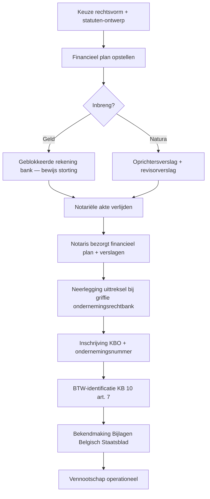

_Verrichting_ · ook: vennootschapsoprichting · incorporation · start-up vennootschap

## Definitie

**Oprichting van een vennootschap** is de rechtshandeling waarbij één of meer personen (vennoten) een vennootschap tot stand brengen door een inbreng te doen, met als doel een welbepaalde activiteit uit te oefenen en aan de vennoten een vermogensvoordeel uit te keren. De oprichting krijgt rechtspersoonlijkheid op het ogenblik van de neerlegging van het uittreksel uit de oprichtingsakte bij de griffie van de bevoegde ondernemingsrechtbank (art. 2:6 WVV).

<small>📖 WVV — art. 1:1 — _wettekst_ · WVV — art. 2:6 — _wettekst_</small>

## Substantie

Economisch ontstaat door de oprichting een nieuw rechtssubject met een eigen vermogen, dat juridisch afgescheiden is van het privé-vermogen van de oprichters (bij kapitaalvennootschappen). De oprichters ruilen hun inbreng (geld of natura) tegen aandelen die hun deelname in de winst en in het beslissingsrecht vertegenwoordigen. Vanaf de oprichting kan de vennootschap zelfstandig contracten aangaan, eigendom verwerven en in rechte optreden. De vennootschap krijgt een ondernemingsnummer (KBO), een rechtsvorm-vermelding (BV/NV/CV/...) en een fiscaal regime (vennootschapsbelasting i.p.v. personenbelasting voor de oprichters).

<small>🔗 WVV — art. 1:1 — _wettekst_ · WVV — art. 1:5 — _wettekst_ · cluster-extract-agent (opus-4.7-1M) — _ai_model_ — (2026-05-28)</small>

## Rationale

Het WVV (in werking 1 mei 2019) heeft het oude W.Venn. vervangen en de oprichting van kapitaalvennootschappen ingrijpend hervormd: voor de BV werd het kapitaal-vereiste afgeschaft (kapitaalloos, focus op 'toereikend aanvangsvermogen') terwijl de NV haar minimumkapitaal van €61.500 behoudt (art. 7:2 WVV). De ratio is een vereenvoudigd, flexibeler ondernemingsklimaat met meer aansprakelijkheid bij ontoereikend startvermogen via het financieel plan (art. 5:4 + 7:3 WVV) en de oprichtersaansprakelijkheid (art. 5:16/7:18 WVV — failliet binnen 3 jaar). De notariële akte en het revisorverslag bij inbreng in natura blijven derden-bescherming garanderen.

<small>🔗 WVV — art. 7:2 — _wettekst_ · WVV — art. 5:3 — _wettekst_ · WVV — art. 5:4 — _wettekst_ · cluster-extract-agent (opus-4.7-1M) — _ai_model_ — (2026-05-28)</small>

## Gebruikscontext

**Status**: `in-voege` · sinds **2019-05-01** · basis: Wet 23-03-2019 (WVV)

WVV is in werking sinds 1 mei 2019. Bestaande vennootschappen onder het oude W.Venn. moesten zich tegen 1 januari 2024 aanpassen (overgangstermijn). De BV-kapitaalafschaffing geldt voor BV's opgericht vanaf 1 mei 2019 én voor BVBA's die werden omgezet.

**✅ Voor**
- 🔗 Bij **start van een ondernemingsactiviteit** door een natuurlijk persoon of door meerdere personen samen, wanneer beperking van aansprakelijkheid (BV/NV/CV) of fiscale optimalisatie (apart belastingsubject) gewenst is.
- 📖 Bij **fusie door oprichting** (art. 12:36 WVV) of **splitsing door oprichting** (art. 12:74 WVV) waarbij een nieuwe vennootschap ontstaat als gevolg van een herstructurering. De oprichtingsformaliteiten van de gekozen vorm gelden, op straffe van nietigheid bij authentieke akte.

**📋 Voorwaarden**
- 📖 **Authentieke akte** verplicht bij BV/CV/NV/SE/SCE (art. 2:4 § 1 lid 2 WVV) — op straffe van **nietigheid**. VOF en CommV kunnen onderhands worden opgericht (art. 2:4 § 1 lid 1).
- 📖 **Inbreng** door elke vennoot — in geld, in natura of in nijverheid (art. 1:8 WVV). Inbreng in nijverheid is uitgesloten bij NV (art. 7:2 WVV: alleen kapitaalinbreng) en bij BV onder voorwaarden toegelaten.
- 📖 **Financieel plan** verplicht bij BV/NV/CV — overhandigd aan de notaris vóór de oprichting, met verantwoording van het aanvangsvermogen over ten minste twee jaar (art. 5:4, 6:5, 7:3 WVV).

**⏹ Trigger einde**
- 📖 De oprichting is voltrokken bij **neerlegging van het uittreksel** uit de oprichtingsakte bij de griffie van de bevoegde ondernemingsrechtbank (art. 2:6 WVV) — vanaf dat ogenblik bestaat de rechtspersoon. De **inschrijving in de KBO** (Kruispuntbank van Ondernemingen) en de **bekendmaking** in de Bijlagen bij het Belgisch Staatsblad volgen automatisch via de notaris.

**⚠️ Risico**
- 📖 **Nietigheid van de oprichting** wanneer geen authentieke akte voor BV/NV/CV (art. 2:4 WVV) of wanneer minimum-stortingseisen niet zijn voldaan. Bij vennootschap-in-oprichting (vóór neerlegging) ontstaat **persoonlijke en hoofdelijke aansprakelijkheid** van de oprichters voor verbintenissen aangegaan in naam van de vennootschap (art. 2:2 WVV).
- 📖 **Oprichtersaansprakelijkheid** bij faillissement binnen drie jaar na de oprichting wanneer het aanvangsvermogen kennelijk ontoereikend was voor de voorgenomen activiteit (art. 5:16 BV / 7:18 NV WVV) — financieel plan dient hier als bewijsmiddel.

## Sub-concepten

### 📦 Initiële inbreng bij oprichting

#### Definitie

De **initiële inbreng** is wat elke oprichter ter beschikking stelt van de vennootschap bij haar oprichting, met het oogmerk vennoot te worden en deel te nemen in de winst (art. 1:8 § 1 WVV). De inbreng kan **in geld** zijn (geldsom), **in natura** (lichamelijk of onlichamelijk goed) of **in nijverheid** (arbeid/diensten — verbintenis). De inbreng gebeurt **in eigendom** (overdracht aan vennootschap) of **in genot** (tijdelijke terbeschikkingstelling) (art. 1:8 § 2-3 WVV).

<small>📖 WVV — art. 1:8 — _wettekst_</small>

#### Substantie

De inbreng vormt het **eigen vermogen** (klasse 10-15) van de vennootschap bij oprichting. Bij **NV**: minimumkapitaal **€61.500**, volledig geplaatst en volstort vóór oprichting (art. 7:2 + 7:13 WVV). Bij **BV/CV**: **geen wettelijk minimumkapitaal** sinds WVV 2019 — wel een 'toereikend aanvangsvermogen' verantwoord in het financieel plan (art. 5:3 + 5:4 WVV). Bij inbreng in natura: verplichte **revisorverslag** + bestuurdersverslag (art. 5:7 BV / 7:7 NV WVV), op straffe van nietigheid bij ontbreken.

<small>📖 WVV — art. 7:2 — _wettekst_ · WVV — art. 7:13 — _wettekst_ · WVV — art. 5:3 — _wettekst_ · WVV — art. 5:7 — _wettekst_ · WVV — art. 7:7 — _wettekst_</small>

#### 📜 BV vs NV — minimuminbreng en historiek

**Historisch overzicht minimum-inbreng-vereisten**:

- **NV (Naamloze Vennootschap)** — minimumkapitaal **€61.500** sinds invoering W.Venn. 1999 (vroeger 1.250.000 BEF); ongewijzigd onder WVV 2019. Volledig geplaatst én volstort vóór oprichting (art. 7:13 WVV).
- **BV (Besloten Vennootschap, sinds WVV 2019)** — **geen minimumkapitaal**. De oude **BVBA** had €18.550 minimumkapitaal (waarvan €6.200 te volstorten); deze BVBA's zijn van rechtswege omgezet naar BV op 1 januari 2020 — art. 39 Wet 23-03-2019 — met het bestaande kapitaal als 'onbeschikbare inbreng' in eigen vermogen.
- **S-BVBA (Starter)** — bestond tussen 2010 en 2019 met €1 minimumkapitaal en plicht reserve-opbouw; geschrapt door WVV (vervangen door reguliere BV-kapitaalloos).
- **CV (Coöperatieve Vennootschap)** — geen minimumkapitaal sinds WVV 2019 (was €18.550 voor CVBA onder W.Venn.).

<small>🔗 WVV — art. 7:2 — _wettekst_ · WVV — art. 5:3 — _wettekst_ · Wet 23-03-2019 invoering WVV — art. 39 — _wettekst_ · cluster-extract-agent (opus-4.7-1M) — _ai_model_ — (2026-05-28)</small>

#### 👣 Revisorverslag bij inbreng in natura

Bij **inbreng in natura** (lichamelijk of onlichamelijk goed) moeten de oprichters een **bijzonder verslag** opstellen waarin zij (1) uiteenzetten waarom de inbreng van belang is voor de vennootschap, (2) elke inbreng beschrijven, (3) een gemotiveerde waardering geven, (4) aangeven welke vergoeding (aandelen) als tegenprestatie wordt verstrekt. Dit oprichtersverslag wordt in ontwerp aan een door de oprichters aangewezen **bedrijfsrevisor** meegedeeld, die zijn eigen verslag opstelt waarin hij de waardering + waarderingsmethoden onderzoekt en verklaart of waardering en vergoeding 'redelijk' zijn. Beide verslagen worden neergelegd en bekendgemaakt (art. 2:7 + 2:13 WVV). Ontbreken hiervan = **nietigheid** van de oprichtingsakte.

<small>📖 WVV — art. 5:7 — _wettekst_ · WVV — art. 7:7 — _wettekst_</small>

#### 📜 Volstortingseisen bij oprichting

**NV**: bij oprichting moeten alle aandelen die in geld worden uitgegeven **minstens een vierde** worden volstort (art. 7:13 WVV); aandelen tegen inbreng in natura **volledig** binnen vijf jaar na oprichting (art. 7:14 WVV). **BV**: er is geen wettelijk minimumkapitaal, maar **elk aandeel moet volledig en onvoorwaardelijk geplaatst** zijn (art. 5:8 WVV) — de statuten bepalen of en wanneer aandelen volstort moeten worden. Niet-volstorte inbrengen geven aanleiding tot een **vordering van de vennootschap** op de aandeelhouder (boekhoudkundig: rekening 101 'Niet-opgevraagd kapitaal' tegenover 100 'Geplaatst kapitaal').

<small>📖 WVV — art. 7:13 — _wettekst_ · WVV — art. 5:8 — _wettekst_</small>

### 📦 Oprichtingskosten

#### Definitie

**Oprichtingskosten** zijn de kosten verbonden met de oprichting, verdere ontwikkeling of herstructurering van de vennootschap — in het bijzonder de **kosten van oprichting of kapitaalverhoging**, de **kosten bij uitgifte van leningen** en **herstructureringskosten**. Concreet: notariskosten, RPR-registratierechten, publicatiekosten Belgisch Staatsblad, ereloon revisor bij natura-inbreng, advieskosten. Ze worden geboekt onder **rubriek 20 'Oprichtingskosten'** van de balans (immateriële activa) — **voor zover ze niet rechtstreeks ten laste van de resultatenrekening van het lopende boekjaar zijn gebracht** (art. 3:36 KB WVV).

<small>📖 KB 29-04-2019 WVV — art. 3:36 — _kb_ · CBN-advies 2010/15 — Oprichtingskosten — _advies_ — (2010-10-06)</small>

#### Substantie

Het is een **boekhoudkundige keuze** van de vennootschap: ofwel **activeren** (rubriek 20) en afschrijven, ofwel **direct ten laste** nemen (klasse 61 'Diensten en diverse goederen' of klasse 64 'Andere bedrijfskosten'). De keuze heeft impact op het resultaat van het oprichtingsboekjaar — activering spreidt de kost; direct ten laste verlaagt het resultaat van jaar 1 maar verhoogt dat van de volgende jaren.

<small>🔗 CBN-advies 2019/07 — Kosten bij uitgifte van leningen — _advies_ — (2019-07-03) · CBN-advies 126/2 — Inbrengprijs — _advies_ — (1980-01-01)</small>

#### 📜 Afschrijvings-regel oprichtingskosten

**Afschrijving**: passende afschrijvingen worden geboekt **per jaarlijkse tranches van ten minste 20 %** van de werkelijk uitgegeven bedragen (art. 3:37 KB WVV) — dus maximaal over **5 jaar** lineair, met **jaar 1 = volledige tranche** (geen pro-rata). De afschrijving van **kosten bij uitgifte van leningen** mag gespreid worden over de **looptijd van de lening** (afwijkende regel — economisch matching-principe).

<small>📖 KB 29-04-2019 WVV — art. 3:37 — _kb_ · CBN-advies 2010/15 — Oprichtingskosten — _advies_ — (2010-10-06)</small>

#### 👣 Boekingsschema oprichtingskosten

**Twee boekhoudkundige scenario's** voor oprichtingskosten:

**Scenario A — Activeren** (rubriek 20):
```
D 200 Kosten van oprichting en kapitaalverhoging
  C 550 Bank (of 489 Andere diverse schulden)
```
Vervolgens jaarlijks (min. 20 %):
```
D 6300 Afschrijvingen op oprichtingskosten
  C 2009 Geboekte afschrijvingen op oprichtingskosten
```

**Scenario B — Direct ten laste**:
```
D 6132 Erelonen (notaris/revisor/advies) (of 64 Andere bedrijfskosten)
  C 550 Bank
```
Geen activering, geen jaarlijkse afschrijving — volledige impact op resultaat oprichtingsjaar.

<small>🔗 KB 29-04-2019 WVV — art. 3:36 — _kb_ · CBN-advies 2010/15 — Oprichtingskosten — _advies_ — (2010-10-06) · cluster-extract-agent (opus-4.7-1M) — _ai_model_ — (2026-05-28)</small>

## Bouwstenen

### 👣 Procedure oprichting BV — stappenflow

Standaard-flow voor de oprichting van een BV (NV-flow is identiek, behalve minimumkapitaal-storting):



Kritieke termijnen: notariële akte = punt van rechtspersoonlijkheid-verkrijging (bij neerlegging uittreksel — art. 2:6 WVV); BTW-identificatie vóór start activiteit (KB 10 art. 7).

<small>🔗 WVV — art. 2:4-2:7 — _wettekst_ · WVV — art. 5:4 — _wettekst_ · WVV — art. 5:7 — _wettekst_ · cluster-extract-agent (opus-4.7-1M) — _ai_model_ — (2026-05-28)</small>

### 📜 RPR-inschrijving en verplichte vermeldingen

Na neerlegging van de oprichtingsakte wordt de vennootschap **ingeschreven in het Rechtspersonenregister (RPR)** van het rechtsgebied van haar zetel (deel van de KBO). Alle akten, facturen, websites en stukken uitgaande van de rechtspersoon moeten verplicht vermelden (art. 2:19 WVV): **(1)** naam, **(2)** rechtsvorm (voluit of afgekort), **(3)** zetel, **(4)** ondernemingsnummer, **(5)** 'RPR' gevolgd door de bevoegde rechtbank, **(6)** in voorkomend geval e-mailadres en website, **(7)** in voorkomend geval 'in vereffening'.

<small>📖 WVV — art. 2:19 — _wettekst_</small>

### 👣 BTW-identificatie bij aanvang activiteit

Elke nieuwe vennootschap die belastbare handelingen verricht moet zich **vóór de eerste activiteit** identificeren bij de FOD Financiën (BTW-administratie) via een **aangifte van aanvang van activiteit** (formulier 604A — KB nr. 10 art. 7) en krijgt een **BTW-identificatienummer** (BE + ondernemingsnummer). Wijzigingen worden gemeld via 604B; stopzetting via 604C. De aangifte kan via een erkend ondernemingsloket bij de KBO (KB 10 art. 7bis), waardoor de gegevens niet dubbel hoeven worden meegedeeld.

<small>📖 KB nr. 10 — art. 7 — _kb_ · KB nr. 10 — art. 7bis — _kb_</small>

### 👣 Aanstelling van het bestuursorgaan

De **oprichtingsakte stelt het eerste bestuursorgaan aan**: bij **BV** een of meer **bestuurders** (statutair of niet); bij **NV** keuze tussen monistisch (raad van bestuur) of duaal bestuur (raad van toezicht + directieraad — art. 7:104 e.v. WVV). De **benoeming** wordt opgenomen in het uittreksel (art. 2:7 § 2, 9° WVV) en moet binnen 30 dagen na de oprichting worden neergelegd. Latere wijzigingen van bestuursorgaan eveneens te publiceren (art. 2:7 § 1, 5°).

<small>📖 WVV — art. 2:7 — _wettekst_ · WVV — art. 7:104 — _wettekst_</small>

### 📜 Kosten van inbreng niet in inbrengprijs

Belastingen en kosten **in verband met de inbreng** (registratierechten, notarisereloon, expertise) behoren **niet** tot de inbrengprijs van de ingebrachte goederen (oude art. 23 KB 1976; bevestigd in art. 3:36 KB WVV). Ze worden geboekt in de post **oprichtingskosten** als 'Kosten van oprichting en kapitaalverhoging' (klasse 200), niet bijgevoegd bij de boekwaarde van de inbreng zelf. Reden: ze kunnen vaak niet in verband worden gebracht met welbepaalde goederen, en zouden de inbrengwaarde kunstmatig verhogen.

<small>📖 CBN-advies 126/2 — Inbrengprijs — _advies_ — (1980-01-01) · KB 29-04-2019 WVV — art. 3:36 — _kb_</small>

## Voorbeelden

> [!example]- BV Nova — oprichting met inbreng in geld, oprichtingskosten geactiveerd
> _Op 15 maart 2026 richten Anna en Bart samen BV Nova op (advieskantoor) met inbreng in geld €25.000 elk (totaal €50.000). Notariskosten + RPR + publicatie = €1.800. Ze kiezen voor activering van de oprichtingskosten (afschrijving 20%/jaar lineair)._
>
> **📒 Boeking 1 — Storting inbreng oprichters (vóór akte, op geblokkeerde rekening)**
>
> _Vóór neerlegging uittreksel: vennootschap bestaat nog niet → tussenrekening 489._
>
> **📒 Boeking 2 — Bij neerlegging uittreksel (oprichting effectief)**
>
> _BV → rubriek 11 'Onbeschikbare inbreng' i.p.v. 'kapitaal' (kapitaalloos sinds WVV). Bij NV: rubriek 100 'Geplaatst kapitaal'._
>
> **📒 Boeking 3 — Notariskosten + RPR + publicatie (activering)**
>
> **📒 Boeking 4 — Jaarlijkse afschrijving 31-12-2026 (20%, jaar 1)**
>
> _20% × €1.800 = €360. Geen pro-rata bij oprichtingskosten — volledige tranche jaar 1. Nettoboekwaarde na jaar 1 = €1.440._
>
> **📊 Beginbalans BV Nova op 15-03-2026 (na akte + boeking kosten)**
>
> _Eigen vermogen €50.000 (volledig onbeschikbare inbreng, BV-statuut). Activa zijn volledig liquide na aftrek oprichtingskosten._
>
> ```json
> {
>   "activa": {
>     "oprichtingskosten_klasse_20": 1800,
>     "liquide_middelen_klasse_5": 48200,
>     "totaal_activa": 50000
>   },
>   "passiva": {
>     "onbeschikbare_inbreng_klasse_11": 50000,
>     "totaal_passiva": 50000
>   }
> }
> ```
>
> <small>🔗 WVV — art. 5:3 — _wettekst_ · KB 29-04-2019 WVV — art. 3:36 — _kb_</small>

> [!example]- NV Atelier — oprichting met inbreng in natura (machine) + geld
> _Op 1 juni 2026 wordt NV Atelier opgericht door Carl (inbreng: industriële machine, gewaardeerd op €45.000 — revisorverslag bevestigt redelijkheid) en Diana (inbreng in geld: €30.000, waarvan €7.500 onmiddellijk volstort = 25%). Notariskosten + revisorereloon + RPR + publicatie = €3.500 — keuze: direct ten laste._
>
> **📒 Boeking 1 — Inbreng in natura (machine) bij oprichting**
>
> _Waardering = revisor-bevestigde inbrengwaarde. Aandelen direct volledig volstort (inbreng in natura)._
>
> **📒 Boeking 2 — Inbreng in geld Diana (geplaatst €30.000, volstort 1/4)**
>
> _Art. 7:13 WVV: NV-aandelen in geld minstens 1/4 volstort bij oprichting. Het niet-opgevraagde deel (€22.500) als vordering op aandeelhouder geboekt in rekening 101 (mindering op kapitaal in balansvoorstelling)._
>
> **📒 Boeking 3 — Oprichtingskosten (direct ten laste)**
>
> _Keuze direct ten laste (art. 3:36 KB WVV laat dit toe) → volledige impact op resultaat 2026._
>
> **📊 Beginbalans NV Atelier op 01-06-2026**
>
> _Eigen vermogen netto = €75.000 − €22.500 − €3.500 = €49.000. Geplaatst kapitaal €75.000 voldoet aan €61.500-minimum (ook al is niet alles volstort). Verlies €3.500 = oprichtingskosten direct ten laste._
>
> ```json
> {
>   "activa": {
>     "installaties_machines_klasse_23": 45000,
>     "liquide_middelen_klasse_5": 4000,
>     "totaal_activa": 49000
>   },
>   "passiva": {
>     "geplaatst_kapitaal_klasse_100": 75000,
>     "niet_opgevraagd_kapitaal_klasse_101_negatief": -22500,
>     "overgedragen_verlies_klasse_141": -3500,
>     "totaal_passiva": 49000
>   }
> }
> ```
>
> <small>🔗 WVV — art. 7:2 — _wettekst_ · WVV — art. 7:7 — _wettekst_ · WVV — art. 7:13 — _wettekst_</small>

> [!example]- Vergelijking — Oprichtingskosten activeren vs direct ten laste (impact 5 jaar)
> _Stel: oprichtingskosten = €5.000. Resultaat vóór deze kosten = €20.000/jaar._
>
> **📋 Resultaat over 5 jaar — scenario A (activeren 20%/jaar) vs scenario B (direct ten laste)**
>
> | Jaar | Scenario A — activeren (afschr. €1.000) | Scenario B — direct ten laste |
>
> | --- | --- | --- |
>
> | 1 | €19.000 (resultaat na €1.000 afschr.) | €15.000 (resultaat na €5.000 kost) |
>
> | 2 | €19.000 | €20.000 |
>
> | 3 | €19.000 | €20.000 |
>
> | 4 | €19.000 | €20.000 |
>
> | 5 | €19.000 | €20.000 |
>
> | Totaal 5j | €95.000 | €95.000 |
>
> → **Totale impact op resultaat is identiek (€5.000 spreiding over 5 jaar vs ineens). Verschil zit in: (a) timing impact uitkeerbaar resultaat — scenario A laat jaar 1 dividend toe; scenario B niet; (b) belastbaarheid — beide aftrekbaar in VenB, scenario B trekt alles ineens af (kasvoordeel); (c) balanspresentatie — scenario A toont actief, scenario B toont alleen kost.**
>
> <small>🔗 cluster-extract-agent (opus-4.7-1M) — _ai_model_ — (2026-05-28)</small>

## Valkuilen

> [!warning]- BV heeft 'geen kapitaal' — verwarring
> **Verkeerde assumptie**: Bij een BV is er geen eigen vermogen meer omdat het kapitaal werd afgeschaft.
>
> **Kernpunt**: Sinds WVV 2019 heeft de BV geen wettelijk minimumkapitaal-vereiste, maar wel een 'onbeschikbare inbreng' (rubriek 11) die functioneel het kapitaal vervangt. Het eigen vermogen blijft volledig aanwezig — alleen het wettelijk minimum is geschrapt. De oprichters moeten via het financieel plan verantwoorden dat het aanvangsvermogen 'toereikend' is.
>
> <small>🔗 WVV — art. 5:3 — _wettekst_ · WVV — art. 5:4 — _wettekst_</small>

> [!warning]- Oprichtingskosten ineens afschrijven = altijd OK
> **Verkeerde assumptie**: Geactiveerde oprichtingskosten mogen vrij afgeschreven worden — 20%/jaar is een minimum dus 100% in jaar 1 is toegestaan.
>
> **Kernpunt**: Art. 3:37 KB WVV legt een **minimum** van 20% per jaar op (= max. 5 jaar). Versnelde afschrijving (bv. 100% in jaar 1) is boekhoudkundig toegelaten (geen plafond) maar moet wel in de waarderingsregels staan en consistent worden toegepast. Fiscaal wordt versnelde afschrijving niet altijd aanvaard — oprichtingskosten zijn fiscaal te spreiden volgens de boekhoudregels, dus 20%/jaar lineair is de praktijk-norm.
>
> <small>🔗 KB 29-04-2019 WVV — art. 3:37 — _kb_ · cluster-extract-agent (opus-4.7-1M) — _ai_model_ — (2026-05-28)</small>

> [!warning]- Notariële akte = oprichtingsmoment
> **Verkeerde assumptie**: De vennootschap bestaat juridisch vanaf het ondertekenen van de notariële akte.
>
> **Kernpunt**: Volgens art. 2:6 WVV ontstaat de rechtspersoonlijkheid pas bij neerlegging van het uittreksel uit de oprichtingsakte bij de griffie van de bevoegde ondernemingsrechtbank. Tussen ondertekening en neerlegging (doorgaans dezelfde dag of 1-2 dagen) is er een 'vennootschap-in-oprichting' — de notaris regelt de neerlegging meestal automatisch.
>
> <small>📖 WVV — art. 2:6 — _wettekst_</small>

## Speelruimtes

### 🎚️ Oprichtingskosten — activeren of direct ten laste?

### 🎚️ Inbreng — geld of natura?

## Accountant-perspectieven

### Vanuit de oprichter/cliënt

_De accountant begeleidt de oprichter bij keuze rechtsvorm, opmaak financieel plan en boekhoudkundige inrichting._

#### 🧭 Adviseur

##### 👣 Advies rechtsvorm-keuze

**Adviescheck-list rechtsvorm**: (1) aantal oprichters (1 = mogelijk BV/eenmanszaak; >1 = ook NV/CV/VOF); (2) aansprakelijkheids-wens (beperkt = BV/NV/CV; onbeperkt = VOF/CommV/eenmanszaak); (3) startvermogen + cashflow-prognose (toereikend voor BV-financieel-plan? €61.500 voor NV?); (4) overdraagbaarheid aandelen (BV = besloten karakter; NV = vrij overdraagbaar); (5) fiscale optimalisatie (VenB-tarief 20%/25% vs PB-progressief tot 50%); (6) opvolging + corporate-governance.

<small>🔗 WVV — boek 4-7 — _wettekst_ · cluster-extract-agent (opus-4.7-1M) — _ai_model_ — (2026-05-28)</small>

##### 👣 Begeleiding opmaak financieel plan

Bij BV/NV/CV: de accountant **stelt het financieel plan op** of begeleidt de oprichter erbij — het plan verantwoordt het aanvangsvermogen over ten minste twee jaar (art. 5:4 WVV). Minimumelementen: nauwkeurige beschrijving activiteit, prognose-balans, prognose-resultatenrekening, begroting investeringen, financieringsbronnen, mogelijke andere financiële verbintenissen. Het plan wordt vóór de notariële akte overhandigd aan de notaris (bewaring 5 jaar) en is niet openbaar — wel cruciaal bewijsmiddel bij latere oprichtersaansprakelijkheid (faillissement binnen 3 jaar).

<small>📖 WVV — art. 5:4 — _wettekst_ · CBN-advies 2019/12 — Financieel plan - begroting — _advies_ — (2019-11-06)</small>

#### 📒 Boekhouder

##### 👣 Boekhoudkundige inrichting bij oprichting

**Eerste boekhoudkundige stappen** na oprichting: (1) rekeningstelsel aanmaken (MAR — Minimum Algemeen Rekeningstelsel, KB 12-09-1983, geactualiseerd door KB WVV); (2) waarderingsregels vastleggen in inventarisboek (art. III.89 WER); (3) openingsbalans boeken (inbreng → klasse 1 EV; oprichtingskosten klasse 20 of klasse 61/64); (4) BTW-identificatie + socialezekerheidsaansluiting bestuurder (zelfstandigenkas binnen 90 dagen); (5) boekjaar-keuze vastleggen (kalenderjaar of gebroken boekjaar — eerste boekjaar mag maximum 18 maanden lopen, art. III.90 WER); (6) groottecategorie-evaluatie (art. 1:24-25 WVV) → schema-keuze.

<small>🔗 WER — art. III.89 — _wettekst_ · WVV — art. 1:24 — _wettekst_ · cluster-extract-agent (opus-4.7-1M) — _ai_model_ — (2026-05-28)</small>

## Verder lezen (scope-out)

- → Keuze rechtsvorm + vergelijking vormen (BV/NV/CV/VOF/CommV/maatschap/VZW) → [[ondernemingsvormen]] _(moet-verwijzen)_
- → Financieel-plan inhoud + opmaak → [[financieel-plan]] _(moet-verwijzen)_
- → Latere kapitaalverhoging — modaliteiten → [[kapitaalverhoging]] _(moet-verwijzen)_
- → Oprichtersaansprakelijkheid bij faillissement binnen 3 jaar → [[oprichtersaansprakelijkheid]] _(moet-verwijzen)_
- → Anti-misbruik bij latere transacties met oprichters (quasi-inbreng) → [[quasi-inbreng]] _(moet-verwijzen)_

## Relaties

### `valt_onder`
- ⏳ vennootschapsrecht
### `vereist`
- [[ondernemingsvormen]]
- [[financieel-plan]]
### `triggert`
- [[oprichtersaansprakelijkheid]]
- [[quasi-inbreng]]
### `vergelijkbaar_met`
- [[kapitaalverhoging]]
    - **Gelijkenissen**:
        - Beide gaan over inbreng tegen aandelen (geld of natura)
        - Bij natura: revisorverslag (art. 5:7/7:7 vs art. 5:112/7:183 WVV) — dezelfde inhoud
        - Notariële akte vereist voor BV/NV/CV
    - **Verschillen**:
        - Oprichting = vennootschap ontstaat; kapitaalverhoging = bestaande vennootschap breidt EV uit
        - Oprichting heeft financieel-plan-verplichting (5:4 WVV); kapitaalverhoging niet
        - Voorkeurrecht bestaande aandeelhouders (5:130/7:188 WVV) geldt bij kapitaalverhoging, niet bij oprichting
    - ⚠️ **Verwarringsrisico**: Studenten verwarren beide vaak omdat boekhoudkundig (klasse 100/110/115 voor kapitaal en uitgiftepremie) en juridisch (revisorverslag) veel parallelle elementen voorkomen.
