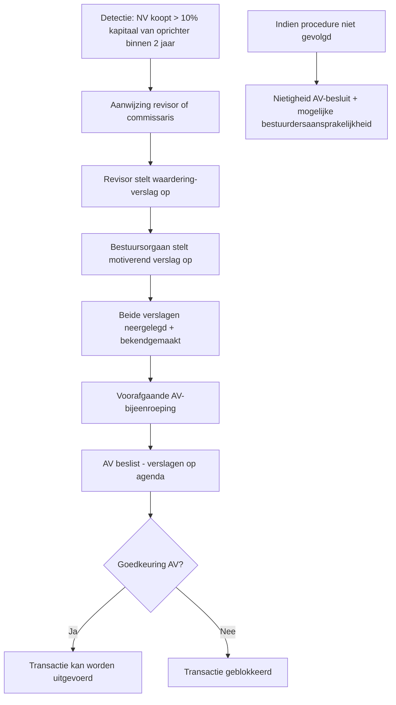

_Regime_ · ook: verkapte inbreng-in-natura · quasi-apport

## Definitie

**Quasi-inbreng** is een anti-misbruik-regel in het WVV (art. 7:8 NV) die geldt wanneer een NV binnen **twee jaar na haar oprichting** een **vermogensbestanddeel verwerft** dat toebehoort aan een **oprichter, bestuurder of aandeelhouder**, tegen een **vergoeding van ten minste 10% van het geplaatst kapitaal**. In dat geval moet de transactie behandeld worden als een verkapte inbreng in natura: verplicht **revisorverslag** + **bestuurdersverslag** + **voorafgaande AV-toestemming**. Het ontbreken van het bestuurdersverslag leidt tot **nietigheid van het AV-besluit** (art. 7:10 § 1 WVV).

<small>📖 WVV — art. 7:8 — _wettekst_ · WVV — art. 7:10 — _wettekst_</small>

## Substantie

Het quasi-inbreng-regime sluit een **omzeil-route** af: zonder deze regel zou een oprichter (die door inbreng in geld aan revisor-controle ontsnapt) korte tijd na de oprichting zijn eigen activum aan de vennootschap kunnen **verkopen** tegen een potentieel overdreven prijs — economisch hetzelfde resultaat als een natura-inbreng, maar zonder de revisor-bescherming. De drie cumulatieve voorwaarden — (1) tijd: binnen 2 jaar; (2) prijs: ≥ 10% geplaatst kapitaal; (3) persoon: oprichter/bestuurder/aandeelhouder — vormen samen het toepassingsgebied. Het regime geldt **enkel voor NV** sinds WVV 2019 — voor BV is het opgeheven (kapitaalloos → geen 10%-drempel mogelijk).

<small>📖 WVV — art. 7:8 — _wettekst_</small>

## Rationale

De ratio van quasi-inbreng is **consistente kapitaalbescherming**: aandelen tegen geld inbrengen (geen revisor) gevolgd door een transactie aan dezelfde 'inbrenger' aan een opgeklopte prijs zou de wettelijke garanties — revisorverslag, AV-toestemming, publiciteit — neutraliseren. Door dit 'samengestelde gedrag' alsnog onder de natura-procedure te plaatsen, blijft de **derden-bescherming** intact. De **2-jaar-termijn** komt van de Europese richtlijn (Tweede Richtlijn vennootschapsrecht 77/91/EEG); de **10%-drempel** wordt geacht het minimum-economisch-significante kapitaalsdeel te zijn.

<small>🔗 cluster-extract-agent (opus-4.7-1M) — _ai_model_ — (2026-05-28)</small>

## Gebruikscontext

**Status**: `in-voege` · sinds **2019-05-01** · basis: WVV (Wet 23-03-2019) art. 7:8-7:10

Sinds WVV 2019 enkel toepasselijk op NV. Voor BV (W.Venn. art. 220 — voorheen €18.550 kapitaal-criterium) is het regime **opgeheven** wegens kapitaalafschaffing. Voor BV's opgericht vóór 1-5-2019 die nog onder het oude regime vielen: overgangsregeling vervallen op 1-1-2020.

**✅ Voor**
- 📖 **Trigger**: een NV koopt binnen 2 jaar na oprichting een actief (vastgoed, machine, intellectueel eigendom, schuldvordering, ...) van een **oprichter, bestuurder, aandeelhouder** of een persoon die voor hun rekening handelt, tegen een prijs ≥ 10% van het geplaatst kapitaal.

**🚫 Niet voor**
- 📖 **Uitzonderingen** (art. 7:8 § 2 WVV) — quasi-inbreng-procedure NIET vereist bij:
- **Effecten of geldmarktinstrumenten** verkregen tegen de gewogen gemiddelde marktprijs (genoteerd op gereglementeerde markt);
- **Vermogensbestanddelen** die binnen de 6 maanden vooraf reeds door een onafhankelijke deskundige werden gewaardeerd op zijn marktwaarde;
- **Vermogensbestanddelen** waarvan de waarde rechtstreeks blijkt uit de jaarrekening (op datum vóór datum verkrijging) gecontroleerd door commissaris;
- **Verkrijgingen ter gewone bedrijfsuitoefening** van de vennootschap (courante handelingen);
- **Verkrijgingen via beurs** of via **gerechtelijke verkoop**.

**📋 Voorwaarden**
- 📖 **Drie cumulatieve criteria** (art. 7:8 § 1 WVV): (1) **NV** (geen BV/CV); (2) **binnen 2 jaar** na oprichting; (3) verkrijging van **vermogensbestanddeel** van oprichter/bestuurder/aandeelhouder; (4) **vergoeding ≥ 10% geplaatst kapitaal** (bv. NV met kapitaal €100.000 → 10% = €10.000-drempel).
- 📖 **Procedurele vereisten** (art. 7:10 WVV): (a) **bestuurdersverslag** dat de verkrijging motiveert; (b) **revisor- (of commissaris-) verslag** met waardering + verklaring dat tegenprestatie niet kennelijk hoger is dan de waardering; (c) beide verslagen worden **neergelegd en bekendgemaakt** (art. 2:7 + 2:13); (d) **voorafgaande AV-goedkeuring** — agenda vermeldt verslagen; (e) **ontbreken bestuurdersverslag = nietigheid AV-besluit**.

**▶️ Trigger start**
- 📖 **Tijdsvenster start** bij de oprichting (= neerlegging uittreksel, art. 2:6 WVV) en eindigt na **24 maanden**. Berekend per dag — niet per kalenderjaar.

**⏹ Trigger einde**
- 🔗 Na 24 maanden vanaf oprichting verdwijnt de quasi-inbreng-toepassing. Latere transacties met oprichters/bestuurders vallen alleen onder algemene **belangenconflict-regeling** (art. 7:96 WVV).

**⚠️ Risico**
- 📖 **Nietigheid AV-besluit** bij ontbreken bestuurdersverslag (art. 7:10 § 1 lid 4 WVV) — de transactie kan worden teruggedraaid.
- 🔗 **Bestuurders-aansprakelijkheid** bij benadeling van de vennootschap door overprijs (art. 2:56 WVV — bestuurdersaansprakelijkheid wegens kennelijk grove fout).

## Bouwstenen

### 📏 Drie cumulatieve criteria — quasi-inbreng-toepassing

**Toepassing quasi-inbreng** vereist **alle drie** voldaan:

1. **Tijd** — verkrijging binnen 2 jaar (24 maanden) na **oprichting** van de NV.
2. **Persoon** — wederpartij is oprichter, bestuurder of aandeelhouder van de NV (of een persoon handelend in eigen naam maar voor rekening van zo iemand — art. 7:8 § 1 lid 2).
3. **Prijs** — vergoeding ≥ 10% van het **geplaatst kapitaal** op het ogenblik van de verkrijging.

**Voorbeeld-berekening**: NV met geplaatst kapitaal €200.000 → 10%-drempel = €20.000. Verkrijging van een wagen aan oprichter Jan voor €25.000 binnen 24 mnd na oprichting → quasi-inbreng-regime VAN TOEPASSING.

<small>📖 WVV — art. 7:8, § 1 — _wettekst_</small>

### 👣 Procedure quasi-inbreng — stappenflow

**Procedure-stappen** bij vastgestelde quasi-inbreng:

**Kosten**: revisorereloon (€1.500-€5.000 afhankelijk van complexiteit) + notariskosten AV + advieskosten. Praktijk: vaak duur — daarom wordt de aankoop soms uitgesteld tot na 24 mnd-termijn (legitiem) of geherstructureerd als courante handeling.

<small>📖 WVV — art. 7:10 — _wettekst_</small>

### ↪️ BV — quasi-inbreng afgeschaft sinds WVV 2019

Voor de **BV** (en CV) is het quasi-inbreng-regime opgeheven door WVV 2019. Reden: de BV heeft geen kapitaal meer → geen '10%-van-kapitaal'-drempel mogelijk. Anti-misbruik wordt voor BV opgevangen door (a) de **algemene belangenconflict-regeling** (art. 5:76-77 WVV — bestuurder met tegenstrijdig belang moet melden, niet stemmen, bestuursorgaan motiveert besluit); en (b) de **kapitaalbescherming-mechaniek** (uitkeringen alleen volgens netto-actief + liquiditeitstest, art. 5:142-144). Voor NV blijft het quasi-inbreng-regime onverkort van kracht.

<small>🔗 WVV — art. 5:76-77 — _wettekst_ · cluster-extract-agent (opus-4.7-1M) — _ai_model_ — (2026-05-28)</small>

## Voorbeelden

> [!example]- NV ImmoStart — quasi-inbreng aankoop pand van oprichter binnen 18 mnd
> _NV ImmoStart opgericht 1-03-2025 met kapitaal €100.000. Oprichter Lucas (50% aandeelhouder) verkoopt op 15-09-2026 (= 18 mnd later) een commercieel pand aan NV ImmoStart voor €350.000. 10%-drempel = €10.000 → ruim overschreden → quasi-inbreng-regime VAN TOEPASSING._
>
> **📋 Toepassingscheck quasi-inbreng**
>
> | Criterium | Casus | Voldaan? |
>
> | --- | --- | --- |
>
> | NV-vennootschap | NV ImmoStart | ✓ |
>
> | Binnen 2 jaar na oprichting | 18 mnd na 1-3-2025 | ✓ |
>
> | Wederpartij = oprichter/bestuurder/aandeelhouder | Lucas: oprichter + 50%-aandeelhouder | ✓ |
>
> | Vergoeding ≥ 10% geplaatst kapitaal | €350.000 vs 10% × €100.000 = €10.000 | ✓ Ruim |
>
> | Uitzondering (art. 7:8 § 2) van toepassing? | Geen — vastgoed, geen recente waardering, geen courante handeling | Nee |
>
> → **Quasi-inbreng-procedure verplicht: revisorverslag + bestuursverslag + AV-toestemming vóór akte.**
>
> **📒 Boeking na voltrokken quasi-inbreng-procedure**
>
> _Normale aankoop-boeking — eigen vermogen blijft onaangetast (Lucas ontvangt cash, niet aandelen). De quasi-inbreng-procedure controleert alleen de waardering — eens correct, is het een gewone aankoop._
>
> <small>🔗 WVV — art. 7:8, 7:10 — _wettekst_</small>

> [!example]- NV BeursCo — uitzondering voor genoteerde effecten
> _NV BeursCo (opgericht jan 2026, kapitaal €500.000) koopt op 1-05-2026 een pakket genoteerde aandelen van oprichter Sara voor €80.000. Aandelen worden gewaardeerd tegen gewogen gemiddelde beurskoers laatste 30 dagen._
>
> **📋 Uitzondering-check**
>
> | Criterium | Casus | Voldaan voor uitzondering? |
>
> | --- | --- | --- |
>
> | Effecten of geldmarktinstrumenten | Genoteerde aandelen | ✓ |
>
> | Gewogen gemiddelde marktprijs | 30-dagen gemiddelde beurskoers | ✓ |
>
> | Geen uitzonderlijke omstandigheden (markt liquide, geen koersverstoring) | Geen koerssprongen | ✓ |
>
> → **Uitzondering art. 7:8 § 2, 1° van toepassing → geen revisor-procedure vereist. Wel: minderheid > 5% kan in een termijn vóór effectieve verkrijging een revisorwaardering eisen (art. 7:8 § 3 lid 3-4 WVV).**
>
> <small>📖 WVV — art. 7:8, § 2, 1° — _wettekst_</small>

> [!example]- Case: Schijn-uitzondering 'courante handeling'
> _NV BeautyCo (opgericht 6-01-2026, kapitaal €100.000) koopt op 1-06-2026 (5 mnd later) een wagen van bestuurder Eva voor €45.000. De vennootschap argumenteert: 'we kopen voortdurend bedrijfswagens — courante handeling'._
>
> **📋 Toepassings-analyse**
>
> | Argument vennootschap | Tegenargument | Conclusie |
>
> | --- | --- | --- |
>
> | 'Courante handeling' (art. 7:8 § 2, 4°) | Aankoop van EEN wagen van bestuurder is geen 'ter gewone bedrijfsuitoefening' — courante handelingen = vaste leveranciers, repetitieve aankopen aan marktprijzen | Uitzondering niet van toepassing |
>
> | Wagen aan marktprijs? | Marktprijs gemeenschappelijke wagen ~€45.000 → niet kennelijk overprijsd, MAAR vorm-vereiste blijft | Procedure quasi-inbreng vereist (revisor + AV) |
>
> | Drempel €100.000 × 10% = €10.000 | €45.000 > €10.000 | Voldaan |
>
> → **Quasi-inbreng-procedure verplicht. 'Courante handeling'-uitzondering is restrictief: bedoeld voor courante leverancierskeuzes binnen reguliere business-cycle, niet voor unieke aankopen van bestuurders. Aanbeveling: revisor-rapport (€1.500-€2.000) is goedmaak-kost voor rechtszekerheid.**
>
> <small>🔗 WVV — art. 7:8, § 2, 4° — _wettekst_</small>

## Valkuilen

> [!warning]- Quasi-inbreng geldt ook voor BV
> **Verkeerde assumptie**: Quasi-inbreng-regime is ook van toepassing op BV-vennootschappen die binnen 2 jaar van oprichting transacties doen met oprichters.
>
> **Kernpunt**: Sinds WVV 2019 is het quasi-inbreng-regime **afgeschaft voor BV** (wegens kapitaalafschaffing — geen 10%-drempel mogelijk). BV-bescherming verloopt via algemene belangenconflict-regeling (art. 5:76-77 WVV) + kapitaalbescherming (5:142-144). Voor NV blijft het regime onverkort.
>
> <small>📖 WVV — art. 7:8 — _wettekst_ · WVV — art. 5:76 — _wettekst_</small>

> [!warning]- 10% van inbreng-waarde
> **Verkeerde assumptie**: De 10%-drempel slaat op de inbreng-waarde of het EV.
>
> **Kernpunt**: De drempel is **10% van het geplaatst kapitaal** (rekening 100) — niet van het totaal EV, niet van de waardering van het ingebracht goed, niet van de uitgiftepremie. Voor een NV met kapitaal €61.500 (minimum WVV) → drempel = €6.150.
>
> <small>📖 WVV — art. 7:8, § 1 — _wettekst_</small>

> [!warning]- Na 2 jaar = volledige vrijheid
> **Verkeerde assumptie**: Na de 2-jaar-termijn vervalt elke controle op transacties tussen vennootschap en oprichter.
>
> **Kernpunt**: Na 2 jaar verdwijnt quasi-inbreng, maar de **algemene belangenconflict-regeling** (art. 7:96 NV / 5:76 BV WVV) blijft permanent gelden: bestuurder met tegenstrijdig vermogensbelang moet dat melden vóór het bestuursorgaan beraadslaagt, mag niet meestemmen, bestuursorgaan motiveert vermogenseffect in notulen.
>
> <small>📖 WVV — art. 7:96 — _wettekst_ · WVV — art. 5:76 — _wettekst_</small>

## Accountant-perspectieven

### Vanuit de NV (na oprichting, < 2 jaar)

#### 🧭 Adviseur

##### 👣 Detectie + advies quasi-inbreng-toepassing

**Quasi-inbreng-screening-checklist** voor accountant van een jonge NV:

1. **Datum oprichting** noteren → 24-maanden-deadline berekenen.
2. Bij elke voorgestelde aankoop **binnen 24 mnd**: vraag (a) wie is de verkoper? (oprichter/bestuurder/aandeelhouder?); (b) wat is de prijs vs 10%-drempel kapitaal?
3. Indien alle 3 criteria voldaan: signaleer aan bestuur dat quasi-inbreng-procedure vereist is (revisor + AV).
4. **Check uitzonderingen** — past één van de 5 uitzonderingen art. 7:8 § 2 (genoteerde effecten, recente expertisewaardering, JR-gecontroleerd, courante handeling, gerechtelijke verkoop)?
5. Indien geen uitzondering: voorstel **uitstel-strategie** (transactie na 24 mnd indien commercieel verantwoord) OF **procedure-voltrekken** (revisor aanwijzen, ondersteunen bestuursverslag, AV organiseren).
6. **Documentatie** archiveren — voor eventuele audit/inspectie.

<small>🔗 WVV — art. 7:8 — _wettekst_ · cluster-extract-agent (opus-4.7-1M) — _ai_model_ — (2026-05-28)</small>

#### 🔍 Auditor

##### 📜 Audit-controle bestaande quasi-inbreng-transacties

**Audit-checklist** voor controle op naleving:

1. Identificeer NV's < 2 jaar oud in cliëntenportefeuille.
2. Onderzoek **grootboeken klasse 20-28** (vaste activa) op aankopen > 10% kapitaal.
3. Match met **balanswijzigingen rekening-courant aandeelhouder/bestuurder**.
4. Verzeker dat voor elke quasi-inbreng-transactie verslagen aanwezig zijn + neergelegd bij griffie.
5. **Risico-rapport** in commissarisverslag (KAM-vermelding) indien onregelmatigheden gedetecteerd.
6. Bij vermoeden van overprijs: bijkomende substantieve procedures (waardering, vergelijking marktprijzen).

<small>🔗 WVV — art. 7:8-7:10 — _wettekst_ · cluster-extract-agent (opus-4.7-1M) — _ai_model_ — (2026-05-28)</small>

## Verder lezen (scope-out)

- → Oprichting van een vennootschap als trigger-context → [[oprichting-vennootschap]] _(moet-verwijzen)_
- → Kapitaalverhoging-in-natura — analoge revisor-procedure → [[kapitaalverhoging-in-natura]] _(moet-verwijzen)_

## Relaties

### `valt_onder`
- [[oprichting-vennootschap]]
### `vergelijkbaar_met`
- [[kapitaalverhoging-in-natura]]
    - **Gelijkenissen**:
        - Beide vereisen revisor- + bestuursverslag
        - Beide beschermen tegen overwaardering bij transacties met oprichters/aandeelhouders
        - Beide hebben identieke verslag-vereisten (art. 7:8 verwijst naar 7:7-7:10)
    - **Verschillen**:
        - Quasi-inbreng = verkoop voor cash (na oprichting); kapitaalverhoging in natura = inbreng tegen aandelen
        - Quasi-inbreng heeft 2-jaar-tijdsvenster + 10%-drempel; kapitaalverhoging in natura heeft geen tijdsvenster
        - Quasi-inbreng is een anti-misbruik-regime; kapitaalverhoging is een proactieve verrichting
    - ⚠️ **Verwarringsrisico**: Beide gebruiken dezelfde revisor-procedure (art. 7:7), wat doet vergeten dat het regimes met verschillende trigger zijn.
