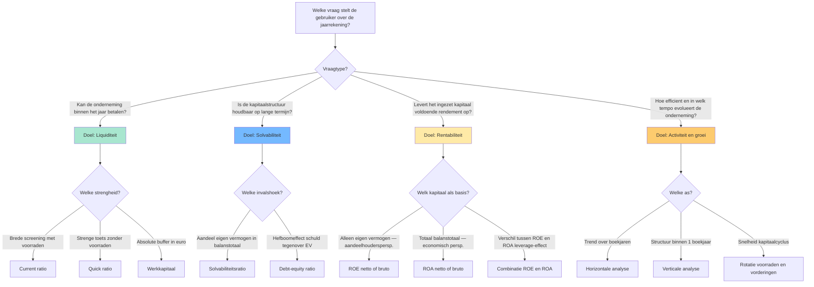

# De vier analyse-doelen en hun ratio's — overzicht 🤖

Financiële analyse van een jaarrekening hangt op vier doelen: liquiditeit (kan de onderneming haar korte schulden betalen?), solvabiliteit (is de kapitaalstructuur houdbaar?), rentabiliteit (genereert ze voldoende winst op het ingezet kapitaal?) en activiteit/groei (hoe efficiënt en in welk tempo). Bij elk doel hoort een eigen familie ratio's, met telkens een specifiek perspectief (aandeelhouder, kredietverlener, manager). Dit synthese-record toont per doel welke ratio's je inzet, welke balans-/resultaten-rekeningposten je nodig hebt, en welke vergelijkings-as je gebruikt om de uitkomst te interpreteren. Centrale examenvraag: 'welke ratio voor welke vraag?' — het antwoord begint bij het doel.

## Vergelijkingstabel

| Analyse-doel | Kernvraag | Belangrijkste ratio's | Bron-component balans/RR | Typische gebruiker |
|---|---|---|---|---|
| **Liquiditeit** (KT betaalkracht) | Kan de onderneming haar schulden ≤ 1 jaar betalen met haar vlottende activa? | [[current-ratio\|Current ratio]] · [[quick-ratio\|Quick ratio]] · [[werkkapitaal\|Werkkapitaal]] | Vlottende activa (voorraden + vorderingen ≤ 1 jaar + geldbeleggingen + liquide middelen); Schulden ≤ 1 jaar | Kredietverlener KT · leverancier · cashmanager |
| **Solvabiliteit** (LT schokbestendigheid) | Hoe groot is het eigen vermogen tegenover totaal vermogen en schulden? | [[solvabiliteitsratio\|Solvabiliteitsratio (EV / balanstotaal)]] · [[debt-equity-ratio\|Debt-equity (VV / EV)]] | Eigen vermogen totaal; Balanstotaal; Schulden totaal | Bank LT · obligatiehouder · aandeelhouder structureel risico |
| **Rentabiliteit** (winstgevendheid kapitaal) | Levert de zaak voldoende rendement op tegenover wat erin geïnvesteerd is? | [[rentabiliteit-eigen-vermogen-roe\|ROE (winst / EV)]] · [[rentabiliteit-totaal-activa-roa\|ROA (winst + kosten schulden / totaal activa)]] · Brutovarianten op [[cashflow-analyse\|cashflow]] | Winst van het boekjaar; Eigen vermogen; Balanstotaal; Kosten van schulden; Niet-kaskosten | Aandeelhouder · investeerder · interne controller |
| **Activiteit/groei** (operationele efficiëntie + dynamiek) | Hoe snel rouleren voorraden en handelsvorderingen? Groeit de omzet? | Rotatie voorraden · rotatie handelsvorderingen · [[horizontale-analyse-jaarrekening\|Horizontale analyse]] op omzet en EBITDA | Omzet meerdere boekjaren; Voorraden gemiddeld; Vorderingen gemiddeld | Operationele manager · auditor · sector-analyst |

## Beslisboom

## Kerninzichten

- De keuze van een ratio begint NOOIT bij de balans — ze begint bij de vraag van de gebruiker. Een kredietverlener op korte termijn kijkt eerst naar de quick ratio; een obligatiehouder eerst naar de solvabiliteit; een aandeelhouder eerst naar ROE. Wie eerst formules verzamelt en dan een verhaal zoekt, mist de analyse-discipline. 🤖
  - _Rationale_: Doelstellingenstructuur in `doelstellingen-financiele-analyse` koppelt elk doel expliciet aan een gebruikersrol.
- ROE en ROA SAMEN lezen ontmaskert het leverage-effect. Bij Rotex Roeselare NV is netto-ROE 20,8 % terwijl netto-ROA 13,0 % is — het gat van 7,8 procentpunten zegt dat schulden de aandeelhouderswinst versterken. Als ROE lager wordt dan ROA, werkt de hefboom omgekeerd: de kost van schulden is dan groter dan het rendement op activa. ⚖️
  - _Rationale_: Voorbeeldcijfers uit `rentabiliteit-eigen-vermogen-roe` en `rentabiliteit-totaal-activa-roa`, beide grounded in CBN-2011/14.
- Liquiditeit en solvabiliteit zijn complementair, geen synoniemen. Een vennootschap kan liquide zijn (vlottende activa > korte schulden) maar tegelijkertijd structureel zwak gefinancierd (laag eigen vermogen). Omgekeerd kan een solvabele onderneming tijdelijk illiquide zijn (cashtekort terwijl ze rijk is aan vaste activa). Examenvraag-camouflage: alleen op één van de twee letten = halve diagnose. 🤖
  - _Rationale_: Spiegeling tussen `liquiditeitsratio.vergelijkingsparen` en `solvabiliteitsratio.vergelijkingsparen`.
- Een hoge ratio is niet automatisch goed. Een current ratio > 3 kan signaleren dat middelen vastliggen in onproductieve voorraden of trage vorderingen; een solvabiliteit > 70 % kan betekenen dat de onderneming te weinig hefboom benut. Interpretatie vereist altijd sectorvergelijking en historiek — de drie analyse-assen samen. 🤖
  - _Rationale_: Valkuilen geconsolideerd uit `current-ratio.valkuilen` en `solvabiliteitsratio.in_praktijk`.
- Brutovarianten met cashflow (bruto-ROE, bruto-ROA) filteren niet-kaskosten weg en zijn moeilijker boekhoudkundig te manipuleren dan nettovarianten. Voor kredietdossiers en waarderingsvragen geven brutoratio's vaak een eerlijker beeld dan nettoratio's. Voor aandeelhoudersrendementsanalyse blijft netto-ROE de standaard. ⚖️
  - _Rationale_: CBN-2011/14 voorziet expliciet zowel netto- als brutovarianten.

## Bronnen

[^1]: `anchor-1.3.I.A`
[^2]: `anchor-1.3.II.C`
[^3]: `CBN-2011-14-herwaarderingsmeerwaarden__sec_rentabiliteit-van-het-eigen-vermogen-voorbeeldmethoden`
[^4]: `CBN-2011-14-herwaarderingsmeerwaarden__sec_rentabiliteit-van-het-totaal-van-de-activa-voorbeeldmethoden`
