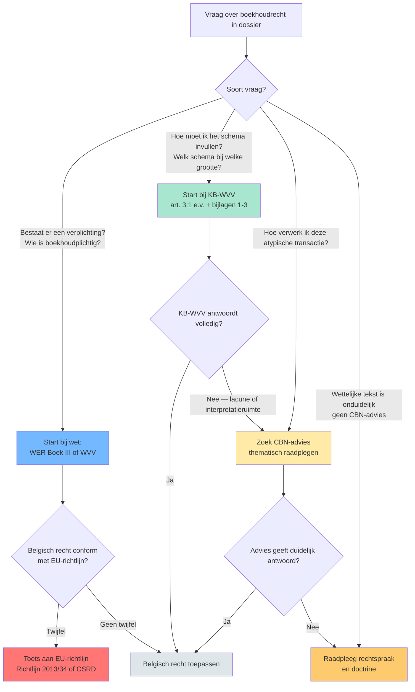

# Rechtsbronnen-piramide van het Belgisch boekhoudrecht 🤖

Het Belgisch boekhoudrecht ontstaat niet uit één bron. Vijf lagen werken cumulatief: Europese richtlijnen en verordeningen (boven), nationale wet (WER Boek III en WVV), Koninklijk Besluit ter uitvoering (KB-WVV), CBN-adviezen voor interpretatie, en rechtspraak voor twistgevallen. Elke laag heeft een eigen bindende kracht en een eigen rol bij examenredenering. Wie een boekhoudvraag krijgt, daalt af door de piramide: eerst wet, dan KB, dan advies, dan rechtspraak. Wie omgekeerd redeneert (advies eerst) mist soms een hardere wettelijke regel die voorrang heeft.

## Vergelijkingstabel

| Laag | Bron | Bindende kracht | Voorbeeld | Hoe raadpleeg ik het op examen? |
|---|---|---|---|---|
| 1 (top) | [[europees-boekhoudrecht\|EU-richtlijnen en -verordeningen]] | Hoogste &mdash; lidstaten moeten omzetten; IFRS-verordening rechtstreeks toepasselijk op PIEs | Richtlijn 2013/34/EU (jaarrekeningen); IAS-Verordening 1606/2002 (IFRS voor beursgenoteerde groepen); Richtlijn 2022/2464/EU (CSRD) | ITAA-LEX toont omzetting; check of Belgisch recht conform richtlijn is bij twijfel |
| 2 | [[wetboek-economisch-recht-boek-iii\|WER Boek III]] + [[wetboek-vennootschappen-verenigingen\|WVV]] | Wet &mdash; bindend voor alle ondernemingen | WER Boek III art. III.82-95 (boekhoudplicht ondernemingen); WVV Boek 3 (jaarrekening vennootschappen) | Eerste plaats om te zoeken bij vraag over verplichting of definitie |
| 3 | [[kb-wvv-uitvoering\|KB tot uitvoering WVV (KB-WVV)]] | KB &mdash; uitvoeringsbesluit; bindend mits binnen wettelijk kader | KB-WVV art. 3:1 t.e.m. 3:108: schema's jaarrekening, waarderingsregels, neerlegging | Bij vraag over praktische uitwerking (schema-rubrieken, waardering, bijlagen) |
| 4 | [[cbn-adviezen\|CBN-adviezen]] | Niet bindend maar gezaghebbend &mdash; door rechtspraak en fiscus gevolgd | CBN-2022/03 (groottecriteria); CBN-2017/10 (verbondenheid); CBN-2011/14 (rentabiliteit) | Bij interpretatie- of toepassingsvraag waarvoor de wet/KB onduidelijk is |
| 5 (bodem) | [[rechtspraak-boekhoudrecht\|Rechtspraak]] | Bindend in concreet geschil; gezaghebbend voor analoge gevallen (geen precedentenleer) | Cassatie-arresten over getrouw beeld, substance over form, faillissementsaansprakelijkheid bestuurders | Bij twistgeval &mdash; argumentatieve onderbouw, geen primaire bron |

## Beslisboom

## Kerninzichten

- De wettelijke piramide is geen mechanisch toepassings-algoritme maar een redeneer-as. Bij Rotex Roeselare NV met een twijfelgeval over leasing-verwerking: eerst KB-WVV art. 3:65 (financiële versus operationele lease), dan CBN-advies 2018/04 voor IFRS-stijl-bepaling, pas dan rechtspraak. Wie omgekeerd start, kan een hardere wettelijke regel missen. 🤖
  - _Rationale_: Vakdoctrine: piramide-volgorde respecteert hiërarchie der normen.
- EU-richtlijnen zijn niet rechtstreeks toepasselijk &mdash; ze worden door wet/KB omgezet. EU-verordeningen (IAS-Verordening 1606/2002) wel. Het examen kan vragen 'waarom moet beursgenoteerde Solaris Sint-Truiden NV IFRS toepassen?' &mdash; antwoord: directe werking IAS-Verordening, niet via WVV. ⚖️
  - _Rationale_: EU-rechtsleer over directe werking van richtlijnen versus verordeningen.
- CBN-adviezen hebben geen formele bindende kracht maar in de praktijk worden ze door rechters en fiscus consistent gevolgd. Een accountant die afwijkt van een CBN-advies moet uitleggen waarom &mdash; de bewijslast verschuift. Voor examen-redenering: aanhalen van een CBN-advies is zelden fout, ook al is het niet 'verplicht'. 🤖
  - _Rationale_: Praktijk-gezag CBN-adviezen volgt uit hun samenstelling (boekhoud-experten) en consistentie.
- Rechtspraak heeft in België geen precedenten-werking (geen stare decisis). Een Cassatie-arrest is gezaghebbend, geen wet. Maar voor identieke feitencomplexen geldt het praktisch wel: ondernemers en accountants stemmen hun gedrag erop af. Op examen: 'is volgens rechtspraak X verplicht?' &mdash; vermijd 'verplicht', zeg 'volgens rechtspraak verwacht'. 🤖
  - _Rationale_: Belgisch civielrecht versus common-law-onderscheid.
- Cijferzakboekje (drempels, bedragen) hoort niet in de piramide. Het is een hulpmiddel dat de WVV/KB-WVV-bedragen samenbrengt. Bij examen: gebruik altijd de cijfers uit ITAA-LEX en het Cijferzakboekje &mdash; nooit cijfers uit oudere handboeken (drempels werden in 2023-2024 met circa 25 % verhoogd door EU-delegated act). ⚖️
  - _Rationale_: Cijferzakboekje is een ITAA-publicatie ter ondersteuning &mdash; geen primaire bron.

## Verwante competenties

- [[competenties/navigeren-rechtsbronnen-boekhoudrecht]]
- [[competenties/afdalen-piramide-bij-onzekere-verwerking]]
- [[competenties/onderscheiden-bindende-kracht-per-bron]]

## Bronnen

[^1]: `anchor-1.2.I`
[^2]: `CBN-0174-01-beginselen-van-een-regelmatige-boekhouding__sec_inleiding`
