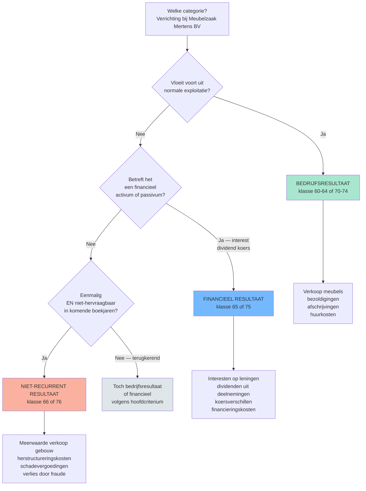

# Bedrijfs- · financieel · niet-recurrent &mdash; in welke categorie hoort deze verrichting? 🤖

> [!info] Behoort tot: [[jaarrekening]]

Sinds het KB van 21 oktober 2018 kent de resultatenrekening drie hoofdcategorieen: bedrijfsresultaat (klasse 60-64 + 70-74), financieel resultaat (65 + 75) en niet-recurrent resultaat (66 + 76). De oude 'uitzonderlijke' rubriek bestaat niet meer. Twee categorieen zorgen bij stagiairs voor twijfel: 'financieel' wordt verward met 'niet-recurrent' (bv. een uitzonderlijke meerwaarde op aandelen) en 'niet-recurrent' wordt verward met het oude 'uitzonderlijk' (dat een formele rubriek was; niet-recurrent is een feitelijke kwalificatie). Deze beslisboom toont de drie criteria die de categorie bepalen.

## Vergelijkingstabel

| Categorie | MAR-klassen | Wat hoort hier | Voorbeeld | Typische valkuil |
|---|---|---|---|---|
| [[bedrijfsresultaat\|Bedrijfsresultaat]] | 60-64 (kosten) + 70-74 (opbrengsten) | Alles wat voortvloeit uit de normale exploitatie | [[Meubelzaak Mertens BV]]: verkoop meubels &euro; 850.000 (klasse 70); bezoldigingen &euro; 380.000 (klasse 62); afschrijvingen &euro; 45.000 (klasse 6302) | Afschrijvingen horen bij bedrijfsresultaat &mdash; ook al voelen ze niet 'operationeel' aan, ze ondersteunen de normale exploitatie van de vaste activa. |
| [[financiele-verrichtingen\|Financieel resultaat]] | 65 (kosten) + 75 (opbrengsten) | Verrichtingen op financiele activa/passiva: interesten, dividenden, koersverschillen, financieringskosten | [[Solaris Sint-Truiden BV]]: dividend ontvangen op aandelen &euro; 12.000 (klasse 75); interestlasten op obligatielening &euro; 50.000 (klasse 65) | Meerwaarde bij verkoop van een financieel vast activum: NIET hier &mdash; dat is niet-recurrent als de verkoop niet tot de normale activiteit hoort, of bedrijfsresultaat als de onderneming een trader is. |
| [[niet-recurrente-verrichtingen\|Niet-recurrent resultaat]] | 66 (kosten) + 76 (opbrengsten) | Eenmalige, niet aan normale exploitatie gerelateerde verrichtingen, die niet hervraagbaar zijn in de komende boekjaren | [[Verffabriek Veurne BV]]: meerwaarde bij verkoop bedrijfsgebouw &euro; 320.000 (klasse 76); herstructureringskosten reorganisatie &euro; 180.000 (klasse 66) | Klassieke verwarring met het oude 'uitzonderlijk': sinds KB 21/10/2018 is niet-recurrent een **feitelijke** kwalificatie (eenmalig + niet-exploitatiegebonden), niet een formele rubriek. Een terugkerende meerwaarde (jaarlijkse verkoop investeringen) hoort dus NIET in 66/76. |

## Beslisboom

## Kerninzichten

- Het criterium 'normale exploitatie' is sectorafhankelijk. Voor [[Solaris Sint-Truiden BV]] (effectenportefeuille als kernactiviteit) horen koerswinsten bij het bedrijfsresultaat &mdash; voor [[Meubelzaak Mertens BV]] horen dezelfde koerswinsten bij het financieel resultaat. De rubriek-keuze is dus geen mechanische lookup, maar een redenering over wat 'normaal' is voor deze onderneming. 🤖
  - _Rationale_: MAR maakt rubrieken contextafhankelijk; CBN-adviezen bevestigen dat hoofdactiviteit beslissend is. Examenrelevant: kandidaten die mechanisch antwoorden vallen door deze valstrik.
- 'Niet-recurrent' is sinds KB 21/10/2018 niet meer hetzelfde als 'uitzonderlijk'. Het oude regime kende een formele rubriek 'uitzonderlijke kosten/opbrengsten' &mdash; daar zat veel in dat eigenlijk wel terugkwam (bv. jaarlijkse meerwaarden bij verkoop van afgeschreven vaste activa). Het nieuwe regime hanteert twee feitelijke criteria: eenmalig + niet-hervraagbaar. Een vraag op het examen die nog de term 'uitzonderlijk' gebruikt is typisch een test op kennis van de regime-wijziging. 🤖
  - _Rationale_: KB 21/10/2018 wijzigde MAR; CBN 2019/04 documenteert overgang. Veelvoorkomend examenpatroon: terminologie-verschil testen.
- De drie categorieen leiden tot drie subtotalen in de resultatenrekening, die elk apart fiscaal relevant zijn. Bij de aangifte vennootschapsbelasting (zie [[bedrijfsresultaat]] + WIB) bepaalt de categorisatie of een meerwaarde onder de gespreide taxatie kan vallen (typisch alleen voor materiele vaste activa onder bedrijfsresultaat) of niet. Verkeerde categorisatie heeft dus directe fiscale impact &mdash; geen louter cosmetische keuze. 🤖
  - _Rationale_: Cross-domein link met fiscaliteit (WIB art. 47 gespreide taxatie). Hoge examenwaarde: combineert PO 1.1 + PO 1.2 + PO 3 (fiscaliteit).

## Verwante competenties

- [[competenties/categoriseren-resultaatposten]]
- [[competenties/opmaken-resultatenrekening]]
- [[competenties/kwalificeren-niet-recurrent]]

## Bronnen

[^1]: `MAR-ondernemingen__art_6`
[^2]: `MAR-ondernemingen__art_7`
[^3]: `CBN-2019-04-gevolgen-op-gebied-van-financiele-rapportering-als-gevolg-van-de-bre__sec_afwaardering-van-vlottende-en-vaste-activa`
