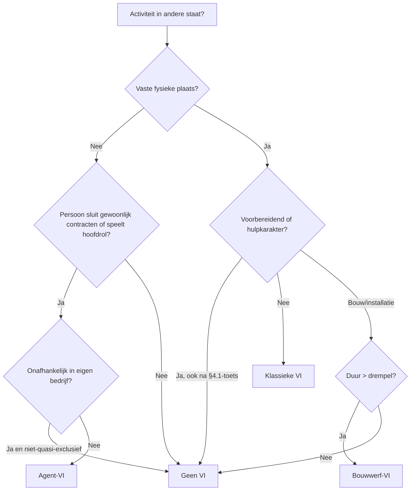

_Kader_ · afk: **VI** · ook: permanent establishment · PE · permanente vestiging · Belgische inrichting

## Definitie

Een vaste inrichting (VI) is een vaste plaats van bedrijfsuitoefening van waaruit een onderneming geheel of gedeeltelijk haar activiteit uitoefent in een ander land dan dat van haar zetel. Het is hét toerekeningspunt in het internationaal fiscaal recht: een buitenlandse onderneming wordt door een staat slechts belast op haar ondernemingswinst wanneer ze in die staat een VI heeft (art. 7 OESO-modelverdrag). De definitie staat in art. 5 van het OESO-modelverdrag en wordt in België overgenomen voor de belasting van niet-inwoners ("Belgische inrichting", art. 229 WIB92). Naast het algemene begrip kent het verdrag drie functionele varianten: de klassieke VI (fysieke bedrijfsvestiging), de bouwwerf-VI (project > 12 maanden) en de agent-VI (afhankelijke vertegenwoordiger).

<small>📖 OESO-modelverdrag — art. 5 §1 — _modelverdrag_ · WIB92 — art. 229 §1 — _wettekst_</small>

## Substantie

De VI bepaalt of een buitenland-activiteit voldoende substantie heeft om door dat buitenland fiscaal gevangen te worden. Geen VI = geen buitenlands heffingsrecht op ondernemingswinst — alle winst blijft in de woonstaat. Wel VI = de buitenlandse staat mag de aan die VI toerekenbare winst belasten; de woonstaat moet die winst dan vrijstellen of de buitenlandse belasting verrekenen (afhankelijk van het verdrag). De VI-test is daarom dé scharnier tussen 'export vanuit thuisland' (geen buitenlandse belasting) en 'actieve aanwezigheid in het buitenland' (wel buitenlandse belasting). De drempel is bewust hoog: incidentele activiteiten of louter ondersteunende functies (opslag, aankoop, informatieverzameling) creëren geen VI.

<small>🔗 OESO-modelverdrag — art. 5 + art. 7 — _modelverdrag_ · cluster-extract-agent (opus-4.7-1M) — _ai_model_ — (2026-05-28)</small>

## Rationale

De ratio legis van de VI-drempel is een evenwicht tussen twee principes: (1) bronstaatheffing — een land mag belasten wat op zijn grondgebied wordt voortgebracht, want het stelt infrastructuur en rechtsbescherming ter beschikking; (2) administratieve drempel — een land moet niet elke buitenlandse onderneming jagen voor een marginale activiteit. De VI legt de grens: voldoende duurzame aanwezigheid (12 maanden voor bouw) en effectieve commerciële beslissingsbevoegdheid (agent die contracten sluit) wettigen heffing. Sinds BEPS Action 7 (2015-2017) is die drempel verlaagd voor commissionair-structuren en gefragmenteerde activiteiten, omdat multinationals VI-status systematisch trachtten te vermijden via formele dochterstructuren.

<small>🔗 OESO-modelverdrag — art. 5 §4.1 (anti-fragmentatie) — _modelverdrag_ · cluster-extract-agent (opus-4.7-1M) — _ai_model_ — (2026-05-28)</small>

## Gebruikscontext

**Status**: `in-voege` · basis: OESO-modelverdrag art. 5 (2017-versie met BEPS-7-aanpassingen); WIB92 art. 229; MLI art. 12-15 voor verdragen die de Multilateral Instrument ratificeerden

Het VI-begrip is verdragsbepaald — het concrete DBV met de andere staat bepaalt de exacte drempels. Belgische DBV's met BEPS-MLI-implementatie hebben verlaagde drempels voor agent-VI en anti-fragmentatie.

**✅ Voor**
- 📖 Een Belgische vennootschap die in het buitenland een filiaal, kantoor, fabriek of werkplaats opent waaruit zij effectief haar bedrijf uitoefent — toetsen of dit een VI is in dat land.
- 📖 Een buitenlandse onderneming die in België een vaste bedrijfsinrichting heeft: belasting van niet-inwoners op de aan die Belgische inrichting toerekenbare winst (art. 228 §2 + 229 WIB92).

**🚫 Niet voor**
- 🔗 Loutere export vanuit België zonder enige fysieke of personele aanwezigheid in de bestemmingsstaat — geen VI, dus geen buitenlandse heffing op de exportwinst.
- 📖 Een dochtervennootschap is op zich géén VI van haar moeder — controle alleen volstaat niet (art. 5 §7 OESO-MV). Maar als de dochter handelt als afhankelijke agent met contractsluitingsbevoegdheid, kan ze tóch een agent-VI vormen voor de moeder.

**📋 Voorwaarden**
- 📖 Klassieke VI vereist cumulatief: (1) een plaats van bedrijfsuitoefening (fysieke locatie); (2) een vaste karakter (zekere duurzaamheid en geografische bestendigheid); (3) waarvan de werkzaamheden van de onderneming geheel of gedeeltelijk worden uitgeoefend (effectieve commerciële activiteit).

**⚠️ Risico**
- 🔗 Niet-erkenning van een VI waar die wel bestaat → buitenlandse belastingadministratie kan navorderen + boetes + reputatie. Omgekeerd: erkenning van een VI waar die er niet is → onnodige aangifte- en administratieve last in beide landen.

## Bouwstenen

### ⚙️ Klassieke vaste inrichting (art. 5 §2)

De klassieke VI is een fysieke, vaste plaats van bedrijfsuitoefening. Art. 5 §2 OESO-MV somt voorbeelden op: (a) plaats van leiding, (b) filiaal, (c) kantoor, (d) fabriek, (e) werkplaats, (f) mijn / olie- of gasbron / steengroeve / andere natuurlijke-rijkdommen-winning. WIB92 art. 229 §1, 1°-9° voegt voor België toe: agentuur en opslagplaats. De lijst is illustratief — elke vaste plaats die voldoet aan de algemene definitie van §1 is een VI, zelfs als ze niet in de lijst staat.

<small>📖 OESO-modelverdrag — art. 5 §2 — _modelverdrag_ · WIB92 — art. 229 §1, 1°-9° — _wettekst_</small>

### 📏 Bouwwerf-VI (12-maanden-drempel)

Een bouw- of constructie- of installatieproject vormt slechts een VI als het langer dan 12 maanden duurt (art. 5 §3 OESO-MV). De Belgische interne wet (WIB92 art. 229 §1, 8°) hanteert echter een veel lagere drempel: een ononderbroken periode van meer dan 30 dagen. Bij conflict primeert het DBV met de andere staat: voor verdragslanden geldt de 12-maanden-drempel, voor niet-verdragslanden de 30-dagen-drempel van het WIB92. Bij gelijktijdige sub-werven van dezelfde onderneming worden de periodes samengevoegd om opsplitsing tegen te gaan.

<small>📖 OESO-modelverdrag — art. 5 §3 — _modelverdrag_ · WIB92 — art. 229 §1, 8° — _wettekst_</small>

### ⚙️ Agent-VI (afhankelijke vertegenwoordiger)

Wanneer iemand in een verdragsstaat handelt namens een buitenlandse onderneming en daarbij gewoonlijk contracten afsluit — óf gewoonlijk de hoofdrol speelt bij het tot stand komen van contracten die routinematig zonder wezenlijke wijziging door de onderneming worden bekrachtigd — vormt die persoon een agent-VI voor de onderneming. De BEPS-7-aanpassing (2017) verlaagde de drempel: vroeger moest de agent letterlijk contracten in naam van de onderneming sluiten; nu volstaat een feitelijke hoofdrol. Het contract moet wel betrekking hebben op (a) eigendomsoverdracht, (b) gebruiksrecht op eigendom, of (c) dienstverrichting door de onderneming.

<small>📖 OESO-modelverdrag — art. 5 §5 — _modelverdrag_</small>

### ↪️ Onafhankelijke agent (uitzondering)

Een echt onafhankelijke agent (makelaar, commissionair, andere zelfstandige bemiddelaar) die in het gewone kader van zijn eigen bedrijf handelt, vormt géén agent-VI (art. 5 §6 OESO-MV). Maar BEPS-7 voegde een belangrijke beperking toe: wie quasi-exclusief voor één of meerdere nauw-verbonden ondernemingen werkt, wordt niet als onafhankelijk beschouwd. Nauw verbonden = > 50 % belang of gemeenschappelijke controle.

<small>📖 OESO-modelverdrag — art. 5 §6 + §8 — _modelverdrag_</small>

### ↪️ Geen-VI uitzonderingen (voorbereidend of hulpkarakter)

Art. 5 §4 OESO-MV sluit uit als VI: (a) gebruik van inrichtingen louter voor opslag, vertoning of levering; (b) een voorraad uitsluitend voor opslag, vertoning of levering; (c) een voorraad uitsluitend voor bewerking door een andere onderneming; (d) een vaste plaats louter voor aankoop van goederen of voor inwinnen van inlichtingen; (e) een vaste plaats louter voor enige andere activiteit; (f) elke combinatie van (a)-(e). Voorwaarde sinds BEPS-7: alle activiteiten moeten een voorbereidend of hulpkarakter hebben — wat vroeger automatisch werd verondersteld, moet nu effectief worden getoetst.

<small>📖 OESO-modelverdrag — art. 5 §4 — _modelverdrag_</small>

### 📜 Anti-fragmentatie-regel (BEPS Action 7)

Art. 5 §4.1 (sinds BEPS-7, 2017) verhindert dat ondernemingen één commerciële activiteit kunstmatig in stukken splitsen om elk stuk onder de voorbereidend-of-hulpkarakter-uitzondering te brengen. Als dezelfde of een nauw-verbonden onderneming op dezelfde plek of een andere plek in dezelfde staat bedrijfsactiviteiten verricht die samen complementaire functies van één samenhangend bedrijfsproces vormen, en dat geheel niet voorbereidend of hulp is, dan wordt de §4-uitzondering niet toegestaan. Voorbeeld: een buitenlandse e-commerce groep met (1) een opslagloods + (2) een aparte showroom + (3) een aankoopkantoor — vroeger drie keer hulp, nu één gefragmenteerd geheel = VI.

<small>📖 OESO-modelverdrag — art. 5 §4.1 — _modelverdrag_</small>

### 💡 VI-begrip in btw (afwijkend)

Het btw-begrip vaste inrichting is een ander concept dan de fiscale VI van art. 5 OESO-MV. In de btw (art. 11 Uitvoeringsverordening EU 282/2011) is een VI elke andere inrichting dan de zetel die wordt gekenmerkt door (1) voldoende duurzaamheid en (2) een geschikte structuur in personeel en technische middelen om diensten af te nemen óf te verrichten. Een btw-identificatienummer alleen volstaat niet om een VI vast te stellen. Praktisch belang: bepaalt waar diensten plaatsvinden voor btw-doeleinden (B2B-locatie- en verleggingsregel art. 44-45 BTW-richtlijn). Niet verwarren met de inkomstenbelasting-VI.

<small>📖 Uitvoeringsverordening (EU) 282/2011 — art. 11 — _wettekst_ · Uitvoeringsverordening (EU) 282/2011 — art. 53 — _wettekst_</small>

### ⚙️ Digitale economie en VI-uitbreiding

De traditionele VI-test gaat uit van fysieke aanwezigheid — wat tekortschiet bij volledig gedigitaliseerde businessmodellen (online platforms, streaming, cloud-diensten) die wel in een land verkopen maar daar geen fysieke aanwezigheid hebben. BEPS-1 (digitale economie) en OECD Pillar One (2021-) introduceren een Amount-A-mechanisme dat heffingsrechten herverdeelt naar marktstaten zonder fysieke VI te vereisen. Voor Belgische accountants betekent dit: voor cliënten in digitale sectoren niet enkel de klassieke VI-test toepassen, maar ook nakijken welke marktstaten unilateraal Digital Services Taxes hebben ingevoerd en wat de status is van Pillar One-implementatie in elke betrokken staat.

<small>🔗 cluster-extract-agent (opus-4.7-1M) — _ai_model_ — (2026-05-28)</small>

## Voorbeelden

> [!example]- Belgische bouwonderneming met werf in Duitsland
> _Aurelia Bouw NV uit Antwerpen voert van januari N tot mei N+1 (17 maanden) een grote installatie uit op één locatie in Duitsland. Er is geen kantoor in Duitsland — wel een tijdelijke werfdirectie ter plaatse._
>
> 1. Stap 1 — toets klassieke VI: vaste plek? Werfdirectie is een vaste plaats van bedrijfsuitoefening — ja.
> 2. Stap 2 — duurzaamheid: 17 maanden > 12 maanden DBV-drempel — ja, bouwwerf-VI in Duitsland.
> 3. Stap 3 — gevolg: Duitsland mag de aan de werf-VI toerekenbare winst belasten (art. 7 DBV).
> 4. Stap 4 — België vrijstelling met progressievoorbehoud (art. 23 DBV) — Duitse winst telt mee voor het tarief op het Belgische deel.
> 5. Stap 5 — administratie: registratie als VI in Duitsland, lokale aangifte, transfer-pricing tussen hoofdkantoor en VI.
>
> → **Resultaat**: VI-status erkennen voorkomt navordering door Duitse fiscus + correcte vrijstelling in België.
>
> <small>🔗 DBV België-Duitsland — art. 5 §3 — _modelverdrag_ · cluster-extract-agent (opus-4.7-1M) — _ai_model_ — (2026-05-28)</small>

> [!example]- Commissionair-structuur na BEPS-7
> _Een Franse moedervennootschap verkocht historisch via een Belgische commissionair (BV Comm-Be) die contracten sluitte in eigen naam maar voor rekening van Frankrijk. Pre-BEPS: geen agent-VI in België (commissionair sloot in eigen naam, niet in naam van Frankrijk)._
>
> Onder de pre-2017 OESO-versie ontsnapten commissionair-structuren aan agent-VI: de formele tekst eiste contracten 'in naam van' de buitenlandse onderneming. Post-BEPS-7 (MLI art. 12): wie 'gewoonlijk de hoofdrol speelt bij de totstandkoming van contracten die routinematig zonder wezenlijke wijziging worden bekrachtigd' is voldoende. BV Comm-Be wordt dus een agent-VI van Frankrijk in België — gevolg: Belgische heffing op de aan de VI toerekenbare winst.
>
> ```mermaid
> flowchart LR
>   A[Klant BE] --> B[BV Comm-Be commissionair]
>   B -.contract eigen naam.-> A
>   B -->|hoofdrol-totstandkoming| C[Franse moeder]
>   C -.eindbeslissing zonder wezenlijke wijziging.-> B
>   D[Post-BEPS-7: agent-VI in BE] -.gevolg.-> B
> ```
>
> <small>🔗 OESO-modelverdrag — art. 5 §5 (post-BEPS-7) — _modelverdrag_ · cluster-extract-agent (opus-4.7-1M) — _ai_model_ — (2026-05-28)</small>

> [!example]- Pure logistieke opslag — geen VI (tenzij fragmentatie)
> _Een Nederlands e-commerce bedrijf huurt in Luik een warehouse waarin enkel goederen worden opgeslagen die rechtstreeks worden verzonden naar Belgische consumenten. Geen personeel met beslissingsbevoegdheid, geen aankoopkantoor, geen showroom._
>
> **Berekening:**
>
> - Test 1 — klassieke VI: opslagplaats valt onder art. 5 §4(a) — geen VI mits voorbereidend/hulpkarakter.
> - Test 2 — anti-fragmentatie: heeft Nederlands bedrijf elders in BE complementaire activiteiten (showroom, klantendienst, aankoop)? Hier: nee.
> - Conclusie: geen VI in België — winst volledig belastbaar in Nederland.
>
> → **Resultaat**: Geen Belgische heffing. Maar: als er ook een showroom in Brussel en een klantendienst in Gent zouden zijn — dan §4.1-toetsing — samen één samenhangend bedrijfsproces = wel VI.
>
> <small>🔗 DBV België-Nederland — art. 5 §4 + §4.1 — _modelverdrag_ · cluster-extract-agent (opus-4.7-1M) — _ai_model_ — (2026-05-28)</small>

## Valkuilen

> [!warning]- VI-begrip btw en VI-begrip inkomstenbelasting verwarren
> **Verkeerde assumptie**: Studenten denken dat 'vaste inrichting' één eenvormig begrip is — als iets een btw-VI is, is het ook een fiscale VI en omgekeerd.
>
> **Kernpunt**: Twee verschillende rechtsbronnen, twee verschillende drempels. Btw-VI (art. 11 VO 282/2011): personeel + technische middelen om diensten af te nemen/leveren — drempel relatief laag. Fiscale VI (art. 5 OESO-MV): vaste plaats van bedrijfsuitoefening + 12-maanden voor bouw — drempel hoger en functioneel anders. Een btw-VI is niet automatisch een fiscale VI; een fiscale VI is meestal wel een btw-VI maar niet noodzakelijk.
>
> <small>🔗 OESO-modelverdrag — art. 5 — _modelverdrag_ · Uitvoeringsverordening (EU) 282/2011 — art. 11 — _wettekst_</small>

> [!warning]- Dochtervennootschap automatisch beschouwen als VI van de moeder
> **Verkeerde assumptie**: Als een Belgische BV een Nederlandse dochter heeft, is die dochter een VI van de BV in Nederland.
>
> **Kernpunt**: Art. 5 §7 OESO-MV is duidelijk: controle over een dochter alleen volstaat niet om de dochter als VI van de moeder te kwalificeren. De dochter is een aparte rechtspersoon met eigen fiscale residentie. Maar opgelet: als de dochter feitelijk handelt als afhankelijke agent voor de moeder (contracten sluit in naam van of bij hoofdrol-totstandkoming voor de moeder), kan ze tóch een agent-VI vormen — niet vanwege haar status als dochter maar vanwege haar activiteit.
>
> <small>📖 OESO-modelverdrag — art. 5 §5 + §7 — _modelverdrag_</small>

> [!warning]- WIB92-30-dagen-drempel voor bouwwerken automatisch toepassen
> **Verkeerde assumptie**: Voor elke buitenlandse bouwonderneming in België na 30 dagen 'VI' aannemen.
>
> **Kernpunt**: WIB92 art. 229 §1, 8° hanteert 30 dagen, maar wordt opzij gezet door het DBV met de andere staat (12 maanden in OESO-MV). De 30-dagen-drempel geldt enkel voor ondernemingen uit niet-verdragslanden. Bij Belgische bouwers in Duitsland of Frankrijk: 12-maanden-toets. Bij bouwers uit landen zonder Belgisch DBV: 30-dagen-toets.
>
> <small>🔗 WIB92 — art. 229 §1, 8° — _wettekst_ · OESO-modelverdrag — art. 5 §3 — _modelverdrag_</small>

> [!warning]- Voorbereidend/hulpkarakter automatisch aanvinken bij opslag, aankoop, info-verzameling
> **Verkeerde assumptie**: Studenten lijsten de art. 5 §4-uitzonderingen mechanisch af: opslag = geen VI; aankoop = geen VI.
>
> **Kernpunt**: Sinds BEPS-7 (art. 5 §4) is voorbereidend/hulpkarakter een effectieve toets, niet een automaat. Als opslag-activiteit een essentieel onderdeel is van het kernbedrijf (bv. distributie-onderneming waarvan opslag DE bedrijfsactiviteit is), is ze niet hulp — wel VI. Plus: anti-fragmentatie-regel §4.1 telt complementaire activiteiten samen.
>
> <small>📖 OESO-modelverdrag — art. 5 §4 + §4.1 — _modelverdrag_</small>

## Syntheses

### 🧩 Beslisboom

Beslisboom: heeft mijn buitenlandse cliënt een VI in België (of mijn Belgische cliënt een VI in het buitenland)?



## Accountant-perspectieven

### Belgische cliënt met buitenlandse activiteit

_Belgische vennootschap die in het buitenland activiteit opzet of uitbreidt — accountant moet VI-risico in beeld brengen en gevolgen voor de Belgische aangifte voorbereiden._

#### 💰 Fiscaal adviseur

##### 👣 VI-check bij elke buitenlandse uitbreiding

Bij elke nieuwe buitenlandse activiteit (kantoor, verkoper, werf, projectteam): VI-test uitvoeren in de andere staat — niet alleen art. 5 OESO-MV, ook het concrete DBV met die staat consulteren. Documenteer: type aanwezigheid, duur, contractsluitingsbevoegdheid van lokaal personeel, omvang van activiteit. Bij twijfel: ruling vragen bij de buitenlandse fiscus of Belgische DVB voor advance pricing.

<small>🔗 OESO-modelverdrag — art. 5 — _modelverdrag_ · cluster-extract-agent (opus-4.7-1M) — _ai_model_ — (2026-05-28)</small>

##### 📜 Belgische aangifte: vrijstelling met progressievoorbehoud

Wanneer in het buitenland een VI is gevestigd en het DBV een vrijstellingsmethode hanteert (klassieke Belgische verdragen): de aan de VI toerekenbare winst wordt in België vrijgesteld, maar telt mee voor de bepaling van het belastingtarief (vrijstelling met progressievoorbehoud). In de Belgische aangifte: VI-resultaat opnemen, daarna in de vrijstellings-code uitsluiten. Documenten ter ondersteuning: lokale aangifte + bewijs van belasting in andere staat.

<small>📖 OESO-modelverdrag — art. 23A — _modelverdrag_ · WIB92 — art. 155 — _wettekst_</small>

#### 🧭 Adviseur

##### 🧭 Structureringsadvies pre-VI

Voor cliënten die op het punt staan in een nieuw land actief te worden: weeg drie scenario's tegen elkaar af — (1) zuivere export zonder fysieke aanwezigheid (geen VI, alle winst in BE); (2) VI als filiaal (lokale belasting + vrijstelling/verrekening in BE); (3) dochtervennootschap (eigen belastbaarheid + DBI-aftrek bij dividenduitkering). Elk scenario heeft eigen voor- en nadelen qua belasting, aansprakelijkheid en compliance. Cijferzakboekje + lokale tarieven raadplegen voor concrete vergelijking.

<small>🔗 cluster-extract-agent (opus-4.7-1M) — _ai_model_ — (2026-05-28)</small>

### Buitenlandse cliënt met activiteit in België

_Buitenlandse onderneming met aanwezigheid in België — accountant moet VI-status, BNI-aangifteplicht en winstoerekening regelen._

#### 💰 Fiscaal adviseur

##### 👣 BNI-registratie bij Belgische VI

Wanneer art. 229 WIB92 + DBV samen leiden tot een VI in België: registratie als belastingplichtige van de belasting van niet-inwoners (BNI), aangifte 276.2 indienen. Alleen de aan de Belgische inrichting toerekenbare winst is belastbaar (art. 228 §2, 3° WIB92). Geen wereldwinst-belasting — wel volle aangifteplicht voor de Belgische tak.

<small>📖 WIB92 — art. 228 §2, 3° — _wettekst_ · WIB92 — art. 229 — _wettekst_</small>

## Verder lezen (scope-out)

- → Winst-naar-herkomst (toerekening winst aan VI) → [[winst-naar-herkomst]] _(moet-verwijzen)_
- → Buitenlandse winst-en-verlies → [[buitenlandse-winst-en-verlies]] _(moet-verwijzen)_
- ↪ BEPS Action 7 (VI-uitbreiding) → [[beps-actieplan]] _(mag-verwijzen)_
- → Dubbelbelastingverdrag (DBV bepaalt VI-begrip) → [[dubbelbelastingverdrag]] _(moet-verwijzen)_

## Relaties

### `valt_onder`
- [[internationaal-fiscaal]]
### `vereist`
- [[dubbelbelastingverdrag]] — Het concrete DBV bepaalt het toepasselijke VI-begrip; het OESO-modelverdrag is geen recht maar template.
### `triggert`
- [[winst-naar-herkomst]] — Eens een VI vaststaat, moet winst worden toegerekend aan de VI volgens art. 7 OESO-MV — separate-entity-fictie.
- [[buitenlandse-winst-en-verlies]] — VI-resultaat moet in de Belgische aangifte worden opgenomen + vrijgesteld/verrekend volgens DBV-methode.
- [[belasting-niet-inwoners]] — Een Belgische inrichting (art. 229 WIB92) is de Belgische pendant van het VI-begrip en triggert BNI-aangifteplicht.
### `beinvloed_door`
- [[beps-actieplan]] — BEPS Action 7 (commissionairs, anti-fragmentatie, voorbereidend/hulpkarakter) verlaagde de VI-drempel sinds 2017; geïmplementeerd via MLI.
- [[mli-instrument]] — Het Multilateraal Instrument past in één pen DBV's aan met de BEPS-7-VI-bepalingen.
### `vergelijkbaar_met`
- [[fiscale-residentie]]
    - **Gelijkenissen**:
        - Beide bepalen of een staat heffingsrecht heeft op een onderneming
        - Beide gebaseerd op het DBV-systeem
    - **Verschillen**:
        - Fiscale residentie: wereldwinst-belastbaarheid (subjectief)
        - Vaste inrichting: enkel toerekenbare winst (objectief, beperkt tot VI-deel)
        - Residentie geldt voor de hele onderneming; VI is een operationele onderafdeling
    - ⚠️ **Verwarringsrisico**: Studenten verwarren residentie (wie ben ik?) met VI (wat doe ik waar?). Eén onderneming kan op één plek resident zijn en op vijf andere plekken een VI hebben.
