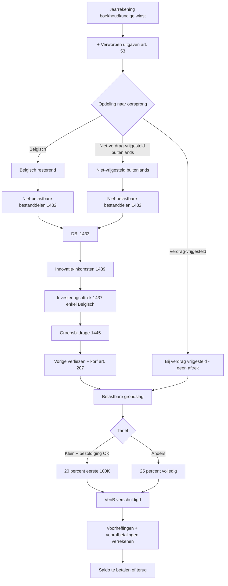

# Vennootschapsbelasting

_Kader_

🏛️ Kader · 📋 Regeling · Anchors: `2.3.I` · `2.3.II` · `2.3.III` · `2.3.IV` · `2.3.taak.1` · `2.3.taak.2` · Wave: `skeleton-pb-venb-2026-05-28`

> [!info] 📝 **Concept** — content gevuld door cluster-extract; niet door mens-verify gegaan.

**Afk.**: VenB — **Synoniemen**: impôt des sociétés · ISoc · Ven.B. — **Vertalingen**: fr: impôt des sociétés

## Definitie

📖 De vennootschapsbelasting (VenB) is de federale inkomstenbelasting die binnenlandse vennootschappen — rechtspersonen met hun voornaamste inrichting, zetel van bestuur of zetel van beheer in België — verschuldigd zijn op hun wereldwijd resultaat. Aan de VenB zijn onderworpen: alle binnenlandse vennootschappen en de organismen voor de financiering van pensioenen (art. 179 WIB92). Een 'binnenlandse vennootschap' is een vennootschap die in België haar voornaamste inrichting of haar zetel van bestuur of beheer heeft (art. 2 — 5° b WIB92).

<small>📚 WIB92 — art. 1 §1 2° — _wettekst_ · WIB92 — art. 2 — 5° — _wettekst_ · WIB92 — art. 179 — _wettekst_</small>

## Substantie

📖 De VenB werkt fundamenteel anders dan de PB: de grondslag vertrekt vanuit het boekhoudkundig resultaat (vennootschap is verplicht dubbele boekhouding te voeren) en wordt via een vaste cascade van 8 bewerkingen omgezet in het belastbaar resultaat. De cascade bevat: (1) categorisering naar bestemming (gereserveerd, dividend, kapitaal); (2) bijtelling verworpen uitgaven; (3) opdeling naar oorsprong (Belgisch / bij verdrag vrijgesteld / niet bij verdrag vrijgesteld); (4) aftrek niet-belastbare bestanddelen; (5) DBI-aftrek (definitief belaste inkomsten); (6) innovatie-aftrek; (7) investeringsaftrek; (8) aftrek vorige verliezen + groepsbijdrage. Op de finale belastbare grondslag wordt het VenB-tarief toegepast (25 % basis, 20 % KMO op eerste 100K).

<small>📚 WIB92 — art. 206/1 — _wettekst_ · WIB92 — art. 207 — _wettekst_ · aangifte-VenB-2025-uiteenzetting-winst — E. Aftrekken vaste volgorde — blz. 8 + tabel codes — _aangifte_ · WIB92 — art. 215 — _wettekst_</small>

## Rationale

🔗 De ratio legis van de VenB is om de winst die door rechtspersonen (vennootschappen) wordt gegenereerd te belasten als eigen rechtssubject, los van de natuurlijke personen achter de vennootschap. De boekhoudkundige winst is het startpunt omdat de vennootschap reeds aan de NBB-publicatieplicht onderworpen is en de jaarrekening de meest betrouwbare meting van de economische prestatie biedt. De cascade van bewerkingen brengt fiscale correcties aan (sommige boekhoudkundige kosten zijn fiscaal niet aftrekbaar — bv. verworpen uitgaven; sommige inkomsten zijn fiscaal vrijgesteld — bv. DBI om dubbele belasting van uitgekeerde winst te vermijden). Het 25 %-tarief sinds AJ 2021 (was 33 % met crisisbijdrage tot AJ 2020) en het verlaagd 20 %-KMO-tarief willen het Belgisch fiscaal regime competitief houden binnen Europa. De aandeelhouder die het netto-resultaat als dividend ontvangt, wordt bovendien getroffen door 30 % RV — wat de 'klassieke' dubbele belasting van vennootschapswinst (eerst VenB, dan RV op uitkering) verklaart.

<small>📚 WIB92 — art. 179 — _wettekst_ · WIB92 — art. 183 — _wettekst_ · WIB92 — art. 215 — _wettekst_ · cluster-extract-agent (opus-4.7-1M) — _ai_model_ — (2026-05-28)</small>

## Gebruikscontext

**Status**: `in-voege` · basis: WIB92 art. 179-219bis + KB/WIB92

Stabiel kader. Belangrijke hervormingen: (a) Wet 25-12-2017 — verlaging tarief 33 % → 25 % gespreid AJ 2019-2021 + afschaffing crisisbijdrage; (b) Wet 22-12-2023 — afschaffing notionele interestaftrek met overgangsregeling; (c) Wet 19-12-2023 — invoering Pijler 2-minimumbelasting voor groepen > 750 M EUR omzet (parallel naast VenB).

**✅ Voor**
- 📖 Elke binnenlandse vennootschap (BV, NV, CV, VOF, CommV, ... met rechtspersoonlijkheid en handeling op winstgevende basis) die haar voornaamste inrichting of zetel van bestuur of beheer in België heeft. Vennootschappen verkrijgen vermoeden van vestiging in België door inschrijving in de KBO en publicatie van statuten in het Belgisch Staatsblad. Ook organismen voor de financiering van pensioenen (OFP — wet 27-10-2006) zijn aan VenB onderworpen.

**🚫 Niet voor**
- 📖 Buitenlandse vennootschappen (geen Belgische zetel) vallen onder de belasting van niet-inwoners (BNI/vennootschap, art. 227 2° WIB92) — een aparte belasting op enkel Belgische bron-inkomsten of via Belgische vaste inrichting. Vzw's, OFP's zonder pensioendoel, gemeentebedrijven en andere Belgische rechtspersonen ≠ vennootschap vallen onder de rechtspersonenbelasting (RPB, art. 220 e.v.).
- 📖 Bepaalde Belgische vennootschappen worden van VenB uitgesloten of onderworpen aan RPB ondanks hun rechtsvorm — typisch: erkende coöperatieve vennootschappen (art. 8:4 WVV) onder bepaalde voorwaarden, ondernemingen voor sociaal oogmerk in bepaalde gevallen. Detail in art. 180-181 WIB92.

**📋 Voorwaarden**
- 📖 Onderworpenheid aan VenB vereist cumulatief: (1) rechtspersoonlijkheid; (2) statutaire of feitelijke zetel/voornaamste inrichting/zetel van bestuur in België; (3) winstgevend doel (handelend als 'vennootschap' in de zin van art. 2 — 5°); (4) niet onder een uitsluitingsregime vallen (art. 180-181).

**▶️ Trigger start**
- 🔗 VenB-onderworpenheid begint bij oprichting van de vennootschap (eerste boekjaar). De aangifteplicht geldt vanaf het eerste afgesloten boekjaar. Bij omvorming vzw → vennootschap (cv): overgang van RPB naar VenB op datum van omvorming.

**⏹ Trigger einde**
- 📖 VenB-onderworpenheid eindigt bij ontbinding en vereffening van de vennootschap (laatste aangifte op datum van sluiting vereffening). Bij grensoverschrijdende zetelverplaatsing → exit-taxatie (art. 210 §1 4°).

**👍 Voordeel**
- 🔗 Voor zelfstandige met substantiële winst (> 30-40K EUR jaarwinst): VenB-tarief 20 % (KMO eerste schijf) + uitkering via bezoldiging is doorgaans gunstiger dan PB-marginaal tarief 45-50 % + sociale bijdragen op volledig resultaat. Vennootschap biedt ook fiscale optimalisatie via DBI-aftrek bij dividenden van dochtervennootschappen.

**⚠️ Risico**
- 📖 Vennootschap kent strikte vorm-vereisten (jaarrekening neerleggen NBB, algemene vergadering, registratie bestuurders). Niet-naleving kan leiden tot administratieve boetes, niet-aftrekbaarheid van uitgaven, en bij ernstige feiten tot ambtshalve aanslag of inhouding fiscaal voordeel. Geheime commissielonen (vergoedingen niet correct gerapporteerd) worden belast aan bijzonder tarief 50 % (art. 219) bovenop normale VenB.

## Bouwstenen

### 📜 Toepassingsgebied: binnenlandse vennootschap  
_`regel`_

📖 Een binnenlandse vennootschap is een vennootschap die haar (a) voornaamste inrichting OF (b) zetel van bestuur OF (c) zetel van beheer in België heeft (art. 2 — 5° b WIB92). De drie criteria zijn alternatief — voldoen aan één volstaat. 'Zetel van bestuur of beheer' verwijst naar de werkelijke leiding (place of effective management), niet noodzakelijk de statutaire zetel. Bij dubbel-inwonerschap (Belgisch + buitenlands) past het toepasselijke DBV een tiebreaker toe (typisch: 'place of effective management').

<small>📚 WIB92 — art. 2 — 5° b — _wettekst_ · WIB92 — art. 179 — _wettekst_</small>

### 📜 Tariefstructuur VenB  
_`regel`_

📖 Basistarief = 25 % (sinds AJ 2021, art. 215 lid 1 WIB92). Voor kleine vennootschappen (in de zin van art. 1:24 §1-§6 WVV — beperkingen omzet/balanstotaal/personeel) geldt een verlaagd tarief van 20 % op de eerste schijf van 0 tot 100.000 EUR belastbaar resultaat (art. 215 lid 2). Voorwaarden om het KMO-tarief te genieten — onder andere: aandelen niet voor meer dan 50 % in handen van andere vennootschap (uitzondering: deelneming < 50 %), minimumbezoldiging zaakvoerder/bestuurder (zie record verlaagd-tarief-kleine-vennootschap). Bijzondere tarieven: 5 % en 33,99 % voor specifieke gevallen (huisvesting, financiële instellingen — art. 216). Geheime commissielonen: 50 % afzonderlijke aanslag bovenop normale VenB (art. 219).

<small>📚 WIB92 — art. 215 — _wettekst_ · WIB92 — art. 216 — _wettekst_ · WIB92 — art. 219 — _wettekst_ · aangifte-VenB-2025-tarief-voorafbetalingen — Verminderd tarief 20 % kleine vennootschap — _aangifte_</small>

### ⚙️ Grondslag-mechaniek: boekhoudkundige winst → 8 bewerkingen → belastbare grondslag  
_`mechanisme`_

**Substantie**: 📖 Vertrekpunt: het boekhoudkundig resultaat na belastingen (winst of verlies van het boekjaar conform Belgisch boekhoudrecht). Daarop wordt een cascade van 8 bewerkingen toegepast om de belastbare grondslag te bekomen — uitgewerkt in record belastbare-grondslag-vennootschapsbelasting. Overzicht: (1) bestemmingscategorisering reserves vs dividend vs kapitaal; (2) bijtelling verworpen uitgaven (autokosten, restaurant, geldboetes — art. 53 WIB92); (3) opdeling naar oorsprong (Belgisch / verdrag-vrijgesteld / niet-vrijgesteld-buitenlands); (4) aftrek niet-belastbare bestanddelen (code 1432); (5) DBI-aftrek voor dividenden van dochtervennootschappen ≥ 10 % deelneming (code 1433); (6) aftrek voor innovatie-inkomsten (code 1439); (7) investeringsaftrek (code 1437); (8) aftrek vorige verliezen + groepsbijdrage (code 1445). Aftrekken zijn beperkt tot een 'korf' (art. 207 WIB92) en mogen niet toegepast worden op bij-verdrag-vrijgestelde winst.

<small>📚 WIB92 — art. 183 — _wettekst_ · WIB92 — art. 206/1 — _wettekst_ · WIB92 — art. 207 — _wettekst_ · aangifte-VenB-2025-uiteenzetting-winst — Tabel — aftrekken in volgorde codes 1432-1445 — _aangifte_</small>

### 📜 Aanslagjaar vs boekjaar  
_`regel`_

📖 Voor VenB is het belastbaar tijdperk gelijk aan het boekjaar van de vennootschap — dat kan afwijken van het kalenderjaar (bv. boekjaar van 1 juli tot 30 juni). Aanslagjaar = jaar na afsluiting van het boekjaar wanneer dat boekjaar samenvalt met het kalenderjaar. Bij gebroken boekjaar: aanslagjaar = het jaar waarin het boekjaar wordt afgesloten (KB/WIB92 art. 200). Voorbeeld: boekjaar 1-7-2024 → 30-6-2025 = AJ 2025. Boekjaar 1-1-2025 → 31-12-2025 = AJ 2026. Dit verschilt fundamenteel van de PB waar het belastbaar tijdperk altijd het kalenderjaar is (en AJ = IJ+1).

<small>📚 WIB92 — art. 360 — _wettekst_ · KB/WIB92 — art. 200 — _kb_</small>

### ✴️ Boekhoud-conformiteit-eis  
_`principe`_

📖 De VenB-grondslag is volgens art. 183 WIB92 ten principale gebaseerd op het boekhoudkundig resultaat zoals dat blijkt uit een regelmatig gevoerde boekhouding conform het Belgisch boekhoudrecht (Wet 17-7-1975 + KB Boekhoudwet + WVV). Afwijkingen tussen boekhouding en fiscale grondslag worden expliciet bepaald door het WIB (de '8 bewerkingen'). Wat in de boekhouding niet als kost geboekt is, kan ook fiscaal niet afgetrokken worden (boekhoud-conformiteit). Dit is een centraal verschil met IFRS: voor VenB blijft Belgische BBC (Belgian Generally Accepted Accounting Principles) leidend, niet IFRS — ook voor vennootschappen die IFRS toepassen in hun geconsolideerde jaarrekening.

<small>📚 WIB92 — art. 183 — _wettekst_ · Wet 17 juli 1975 — boekhoudwet — _wettekst_</small>

**Rationale**: 🔗 Boekhoud-conformiteit voorkomt dat vennootschappen twee boekhoudingen voeren (een 'echte' en een 'fiscale'). Fiscale optimalisatie moet via boekhoudkundige keuzes (afschrijvingsritmes, voorzieningen) gebeuren, niet via een aparte fiscale berekening die afwijkt van de gepubliceerde jaarrekening. Dit verhoogt transparantie en controleerbaarheid.

<small>📚 cluster-extract-agent (opus-4.7-1M) — _ai_model_ — (2026-05-28)</small>

### ⚙️ Herstructurering: omvorming + pre-faillissement  
_`mechanisme`_

**Substantie**: 🔗 Bij ingrijpende verandering in vennootschap-statuut: (a) Omvorming vzw → cv (coöperatieve vennootschap): RPB → VenB, eerst aangifte sluit-fiscale-periode bij RPB, dan nieuwe aangifte als VenB-vennootschap; (b) Fusie/splitsing — meestal belastingneutraal mits voldaan aan voorwaarden art. 211 WIB92 (zaakgelijkheid, doel niet hoofdzakelijk fiscaal); (c) Pre-faillissement / gerechtelijke reorganisatie — fiscaal verlies blijft overdraagbaar binnen vennootschap; bij liquidatie wordt eindbeleid afgewikkeld via liquidatieboni belastbaar als roerend inkomen bij aandeelhouder (30 % RV).

<small>📚 WIB92 — art. 211 — _wettekst_ · WIB92 — art. 209 — _wettekst_ · cluster-extract-agent (opus-4.7-1M) — _ai_model_ — (2026-05-28)</small>

### ⚙️ Voorheffingen + verrekeningen + voorafbetalingen  
_`mechanisme`_

**Substantie**: 📖 Op de berekende VenB worden in volgorde verrekend: (a) onroerende voorheffing en roerende voorheffing geheven op inkomsten van de vennootschap (art. 276-296); (b) forfaitair gedeelte buitenlandse belasting (FBB) op buitenlandse roerende inkomsten; (c) voorafbetalingen (VA1-VA4 elk kwartaal). Geen of onvoldoende voorafbetaling triggert belastingvermeerdering (art. 218 WIB92 — toetsing aan referentierente × x %). VA in vroege kwartalen geeft hogere bonificatie. Voor kleine vennootschap-startup (eerste 3 boekjaren): vrijstelling van belastingvermeerdering wegens onvoldoende VA.

<small>📚 WIB92 — art. 218 — _wettekst_ · WIB92 — art. 276-296 — _wettekst_</small>

## Voorbeelden

### 💡 KMO met winst 80.000 EUR — 20 %-tarief van toepassing 🔗

_BV TechAdvies, kleine vennootschap (art. 1:24 WVV — < 50 personeelsleden, omzet < 11,25 M, balanstotaal < 6 M). Boekjaar 2024 (= AJ 2025). Boekhoudkundige winst 80.000 EUR. Verworpen uitgaven: 5.000 EUR (autokosten privé-deel + restaurant > 31 %). DBI ontvangen: 2.000 EUR (dividend dochter > 10 % deelneming). Zaakvoerder ontving 50.000 EUR bezoldiging (voldoet minimumbezoldigingsvoorwaarde)._

**Berekening:**
- Stap 1 — boekhoudkundig resultaat: 80.000 EUR
- Stap 2 — bijtelling verworpen uitgaven: + 5.000 EUR → tussenresultaat 85.000 EUR
- Stap 3 — geen verdrag-vrijgesteld inkomen; volledig Belgisch resterend = 85.000 EUR
- Stap 4 — niet-belastbare bestanddelen (code 1432): 0
- Stap 5 — DBI-aftrek (code 1433): − 2.000 (100 % aftrek mits deelneming > 10 % en houden ≥ 1 jaar) → 83.000
- Stap 6 — geen innovatie-inkomsten → 83.000
- Stap 7 — geen investeringsaftrek dit jaar → 83.000
- Stap 8 — geen vorige verliezen → belastbare grondslag = 83.000 EUR
- Stap 9 — KMO-toets: BV TechAdvies kwalificeert als kleine vennootschap, zaakvoerder kreeg ≥ minimumbezoldiging (basisbedrag 45.000 EUR niet-geïndexeerd — vervuld) → 20 % tarief van toepassing op eerste 100K
- Stap 10 — VenB: 83.000 × 20 % = 16.600 EUR
- Stap 11 — voorafbetalingen verrekenen (stel VA totaal: 16.000 EUR; tijdig gespreid → geen vermeerdering) → saldo bij te betalen = 600 EUR

→ **Resultaat**: Effectief tarief ≈ 16.600 / 83.000 = 20,0 %. Indien BV TechAdvies niet zou kwalificeren voor KMO-tarief: 83.000 × 25 % = 20.750 EUR. Voordeel KMO-tarief = 4.150 EUR per jaar.

<small>📚 WIB92 — art. 215 — _wettekst_ · WIB92 — art. 207 — _wettekst_ · cluster-extract-agent (opus-4.7-1M) — _ai_model_ — (2026-05-28)</small>

### 💡 Grote vennootschap met buitenlandse winst — DBV-vrijstelling + korf-beperking 🔗

_NV InternationalCorp (geen kleine vennootschap — omzet 50 M). Boekjaar 2024. Boekhoudkundige winst 800.000 EUR, waarvan 200.000 EUR uit Frans bijkantoor (bij verdrag vrijgesteld in België conform DBV BE-FR). Verworpen uitgaven 30.000 EUR. Investeringsaftrek beschikbaar 50.000 EUR. Overgedragen verlies vorige boekjaren: 100.000 EUR._

**Berekening:**
- Stap 1 — boekhoudkundig resultaat: 800.000 EUR
- Stap 2 — bijtelling verworpen uitgaven: + 30.000 → 830.000
- Stap 3 — opdeling oorsprong: Frans bijkantoor 200.000 (bij verdrag vrijgesteld) + Belgisch 630.000
- Stap 4 — aftrekken zijn ENKEL toepasbaar op Belgisch resterend (630.000), niet op verdrag-vrijgesteld
- Stap 5 — investeringsaftrek: − 50.000 → 580.000 Belgisch resterend
- Stap 6 — aftrek vorige verliezen: korf-beperking — eerste 1.000.000 EUR onbeperkt aftrekbaar, daarboven max 70 % (art. 207 lid 5). Hier 580.000 < 1M → volledige 100.000 EUR verlies aftrekbaar → 480.000
- Stap 7 — belastbare grondslag = 480.000 EUR Belgisch + 0 EUR (verdrag-vrijgesteld)
- Stap 8 — tarief: 25 % (geen KMO) → VenB = 480.000 × 25 % = 120.000 EUR

→ **Resultaat**: De 200.000 EUR Franse winst is in BE volledig vrijgesteld (geen progressievoorbehoud bij VenB, anders dan bij PB). Aftrekken (investeringsaftrek, vorige verliezen) konden enkel op het Belgisch resterend deel — dit is de kerngedachte van art. 207. De korf-beperking zou pas bijten als de Belgische winst > 1 M (in dat geval max 70 % van overschot voor bepaalde aftrekken).

<small>📚 WIB92 — art. 206/1 — _wettekst_ · WIB92 — art. 207 — _wettekst_ · aangifte-VenB-2025-uiteenzetting-winst — Aftrekken vaste volgorde — _aangifte_ · cluster-extract-agent (opus-4.7-1M) — _ai_model_ — (2026-05-28)</small>

### 💡 Schematische cascade VenB-berekening 🔗

_Conceptueel overzicht van de VenB-cascade voor stagiairs._

Cascade-flow:

Kernpunt: aftrekken werken steeds 'volgordelijk en beperkt'. De korf (art. 207) beperkt sommige aftrekken (DBI van vorige tijdperken, innovatie-overdrachten, vorige verliezen) tot maximum 1.000.000 EUR + 70 % van het overschot — om te vermijden dat grote vennootschappen via geaccumuleerde aftrekken structureel 0 EUR VenB betalen.

<small>📚 WIB92 — art. 206/1 — _wettekst_ · WIB92 — art. 207 — _wettekst_ · aangifte-VenB-2025-uiteenzetting-winst — Vaste volgorde — _aangifte_ · cluster-extract-agent (opus-4.7-1M) — _ai_model_ — (2026-05-28)</small>

## Valkuilen

### ⚠️ Boekjaar = kalenderjaar veronderstellen voor VenB

**Verkeerde assumptie**: Stagiairs trekken hun PB-reflex door en gaan ervan uit dat AJ = IJ + 1 ook voor VenB geldt.

**Kernpunt**: Voor VenB is het belastbaar tijdperk het boekjaar van de vennootschap — dat kan een gebroken boekjaar zijn (bv. 1 juli tot 30 juni). Het aanslagjaar is dan het jaar waarin het boekjaar werd afgesloten. Bij analyse altijd eerst nakijken in de statuten en de jaarrekening welke periode het boekjaar bestrijkt.

<small>📚 WIB92 — art. 360 — _wettekst_ · KB/WIB92 — art. 200 — _kb_</small>

### ⚠️ Aftrekken toepassen op verdrag-vrijgesteld deel

**Verkeerde assumptie**: DBI, innovatie-aftrek of vorige verliezen aftrekken van de volledige winst (inclusief buitenlandse winst bij verdrag vrijgesteld).

**Kernpunt**: Aftrekken werken ENKEL op het Belgisch en het niet-verdrag-vrijgesteld buitenlands deel (art. 207 + aangifte-toelichting blz. 31). De bij verdrag vrijgestelde winst (bv. winst van Frans bijkantoor onder DBV BE-FR) blijft buiten elke aftrekberekening en wordt volledig vrijgesteld zonder aftrekverrekening. Dit voorkomt dat vennootschappen aftrekken zouden verspillen op winst die toch al vrijgesteld is.

<small>📚 WIB92 — art. 207 — _wettekst_ · aangifte-VenB-2025-uiteenzetting-winst — E. Aftrekken vaste volgorde — 'Geen van de hierna vermelde aftrekken kan worden verricht op de bij verdrag vrijgestelde resterende winst' — _aangifte_</small>

### ⚠️ KMO-tarief automatisch toepassen voor 'kleine vennootschap'

**Verkeerde assumptie**: Elke vennootschap die als 'kleine vennootschap' kwalificeert in de zin van art. 1:24 WVV krijgt automatisch het 20 %-tarief op de eerste 100K.

**Kernpunt**: Naast de WVV-kwalificatie moeten cumulatief voldaan zijn: (a) aandelen niet voor meer dan 50 % in handen van andere vennootschap (uitzondering: financiële instellingen, niet-residenten houdende minderheidsbelang); (b) minimumbezoldiging zaakvoerder/bestuurder (basisbedrag 45.000 EUR niet-geïndexeerd of gelijk aan belastbaar resultaat indien lager dan 45.000); (c) geen vastgoedvennootschap met overwegend onroerend doel. Detail in record verlaagd-tarief-kleine-vennootschap.

<small>📚 WIB92 — art. 215 — _wettekst_</small>

### ⚠️ Boekhoud-conformiteit verwaarlozen

**Verkeerde assumptie**: Een uitgave die fiscaal aftrekbaar zou zijn, maar niet in de boekhouding opgenomen, alsnog op de aangifte aftrekken via een 'fiscale correctie'.

**Kernpunt**: De VenB-grondslag start van het boekhoudkundig resultaat — wat niet als kost geboekt is, kan ook fiscaal niet als kost worden ingebracht (boekhoud-conformiteit, art. 183 + 49 WIB92). Omgekeerd kan wat boekhoudkundig wel als kost staat maar fiscaal niet-aftrekbaar is (verworpen uitgaven, art. 53), via bewerking 2 worden bijgeteld. Het is dus eenrichtingsverkeer: boekhouding → fiscale aanpassing in plus, niet in min.

<small>📚 WIB92 — art. 183 — _wettekst_ · WIB92 — art. 49 — _wettekst_</small>

## Syntheses

### 🧩 Synthese  
_`matrix`_

Vergelijking VenB ↔ PB-zelfstandige voor structureel-keuze 'eenmanszaak of vennootschap?'

## Accountant-perspectieven

### Eigen kantoor — VenB-aangifte vennootschap

_De accountant die voor een vennootschap-cliënt de boekhouding voert, de jaarrekening opstelt, en de VenB-aangifte (Biztax) indient._

#### 📒 Boekhouder

##### 👣 Verworpen uitgaven detecteren tijdens boekhouding  
_`stap`_

🔗 Tijdens het boekjaar bij elke aankoop met privé-component (autokosten, restaurant, geschenken, geldboeten): markeer in de analytische boekhouding zodat de verworpen uitgave-bijtelling vlot kan worden gemaakt bij jaareinde. Typische verworpen uitgaven: 100 % geldboeten (klasse 641900), 31 % restaurantkosten (variabel naargelang CO2 voor autokosten — vanaf 2026 evolutie naar 100 % verworpen niet-elektrisch), niet-aftrekbare giften, fiscaal niet-aftrekbare provisies. Zonder analytische markering wordt jaareinde-bijtelling foutgevoelig.

<small>📚 WIB92 — art. 53 — _wettekst_ · cluster-extract-agent (opus-4.7-1M) — _ai_model_ — (2026-05-28)</small>

#### 💰 Fiscaal adviseur

##### 👣 Biztax-aangifte opstellen + indienen  
_`stap`_

🔗 De VenB-aangifte gebeurt verplicht elektronisch via Biztax. Termijn: 6 à 7 maanden na afsluiting boekjaar (uiterlijk 30 september voor boekjaren die met kalenderjaar samenvallen). Workflow: (1) jaarrekening conform WVV opstellen en goedkeuren AVA; (2) fiscale correcties toepassen (8 bewerkingen op basis van jaarrekening); (3) aftrek-codes invullen 1432-1445; (4) tarief-rubriek; (5) voorheffingen-rubriek; (6) elektronisch indienen + bevestiging bewaren. Bij verlies-aangifte: rapporteer alsnog voor verliesoverdracht. Detail-flow in record aangifte-vennootschapsbelasting.

<small>📚 WIB92 — art. 305 — _wettekst_ · WIB92 — art. 310 — _wettekst_ · cluster-extract-agent (opus-4.7-1M) — _ai_model_ — (2026-05-28)</small>

##### 👣 Voorafbetalingen plannen voor vennootschap  
_`stap`_

📖 Vennootschappen die de belastingvermeerdering wegens onvoldoende VA willen vermijden moeten elk kwartaal voorafbetalingen verrichten (VA1-4). De vermeerdering wordt berekend als x % × referentievoet × belasting (zie art. 218 WIB92 — referentievoet afgeleid van ECB-rente). VA1 (April) geeft de hoogste bonificatie, VA4 (December) de laagste. Vrijstelling: kleine vennootschap in de eerste 3 boekjaren (art. 218 §2). Accountant berekent geprojecteerd resultaat, bepaalt VA-bedragen, en stuurt cliënt herinnering per kwartaal.

<small>📚 WIB92 — art. 218 — _wettekst_ · cluster-extract-agent (opus-4.7-1M) — _ai_model_ — (2026-05-28)</small>

#### 🧭 Adviseur

##### 📜 Advies eenmanszaak ↔ vennootschap  
_`regel`_

🔗 Cliënt met groeiende winst: vergelijk effectieve totaal-belastingdruk eenmanszaak (PB-marginaal + sociale bijdragen ± 50-55 %) vs vennootschap (VenB 20 % KMO + uitkering via bezoldiging). Vuistregel: vanaf netto-jaarwinst ≈ 50.000 EUR begint vennootschap voordeel te bieden door tarief-verschil + winstreservering. Mits cliënt geen onmiddellijke privé-cashflow nodig heeft op volledig resultaat. Vennootschap brengt ook vorm-kosten (boekhouding zwaarder, NBB-publicatie, accountantsfee jaarrekening) — break-even-analyse maken vóór beslissing.

<small>📚 WIB92 — art. 215 — _wettekst_ · cluster-extract-agent (opus-4.7-1M) — _ai_model_ — (2026-05-28)</small>

## Verder lezen (scope-out)

- → Boekhouding-fiscaal correctie-cascade (detail) → [[fiscale-boekhoud-correcties]] _(moet-verwijzen)_
- → Belastbare grondslag — 8 bewerkingen in detail → [[belastbare-grondslag-vennootschapsbelasting]] _(moet-verwijzen)_
- → Verworpen uitgaven (familie van uitgaven) → [[verworpen-uitgaven]] _(moet-verwijzen)_
- → KMO-tarief 20 % voor kleine vennootschap (detail-voorwaarden) → [[verlaagd-tarief-kleine-vennootschap]] _(moet-verwijzen)_
- → Bijzondere aanslagen VenB (detail) → [[bijzondere-aanslagen-venb]] _(moet-verwijzen)_
- → Aangifte VenB (Biztax) — proces + codes → [[aangifte-vennootschapsbelasting]] _(moet-verwijzen)_
- → Voorafbetalingen (generiek mechanisme + tarieven) → [[voorafbetalingen]] _(moet-verwijzen)_
- → Fiscale-voordelen-vennootschap (cluster: DBI, investeringsaftrek, innovatie) → [[fiscale-voordelen-vennootschap]] _(moet-verwijzen)_
- ↪ Personenbelasting (parallelle sub-discipline) → [[personenbelasting]] _(mag-verwijzen)_
- ↪ Fusie/splitsing fiscaal regime → [[fiscale-fusie-splitsing]] _(mag-verwijzen)_

## Relaties

### `valt_onder`
- [[fiscaal-recht]] — VenB is één van de vier inkomstenbelastingen (art. 1 WIB92).
### `vergelijkbaar_met`
- [[personenbelasting]]
    - **Gelijkenissen**:
        - Beide federale inkomstenbelastingen op wereldwijd inkomen
        - Beide kennen aangifteplicht + voorafbetalingen + voorheffingen-systeem
        - Beide kennen belastingvermeerdering bij onvoldoende VA
    - **Verschillen**:
        - VenB belast rechtspersonen (vennootschappen); PB belast natuurlijke personen
        - VenB-grondslag vertrekt van boekhoudkundige winst + 8 bewerkingen; PB-grondslag = som 4 inkomenscategorieën
        - VenB-tarief proportioneel (25 % / 20 % KMO); PB-tarief progressief (schijven 25-50 %)
        - VenB kent geen opcentiemen; PB kent gemeentebelasting
        - VenB kent specifieke aftrekken (DBI, innovatie, investering); PB niet (althans niet op die manier)
        - VenB-belastbaar tijdperk = boekjaar (kan gebroken); PB altijd kalenderjaar
    - ⚠️ **Verwarringsrisico**: Bij groeiende eenmanszaak die overweegt vennootschap op te richten: stagiairs verwarren regelmatig de twee belastingstelsels, vergeten dat winst in vennootschap niet automatisch 'verdwijnt' uit PB — bezoldiging zaakvoerder/dividend zijn opnieuw PB-belastbaar bij de natuurlijke persoon.
### `bevat`
- [[belastbare-grondslag-vennootschapsbelasting]] — Detail-uitwerking 8 bewerkingen + aftrekcascade.
- [[fiscale-boekhoud-correcties]] — Aansluiting boekhoudkundige winst → fiscale grondslag.
- [[verworpen-uitgaven]] — Bijtelling bewerking 2 — limitatieve lijst art. 53 WIB92.
- [[verlaagd-tarief-kleine-vennootschap]] — KMO-20 %-tarief op eerste 100K (art. 215 lid 2).
- [[bijzondere-aanslagen-venb]] — Bijzondere aanslag geheime commissielonen 50 % (art. 219) + andere.
- [[fiscale-voordelen-vennootschap]] — Cluster: DBI, innovatie-aftrek, investeringsaftrek, vrijgestelde reserves.
- [[voorafbetalingen]] — Stelsel om belastingvermeerdering te vermijden (art. 218 WIB92).
### `triggert`
- [[aangifte-vennootschapsbelasting]] — VenB-onderworpenheid triggert jaarlijkse aangifteplicht via Biztax.
### `vereist`
- [[jaarrekening]] — Boekhoudkundige winst uit goedgekeurde jaarrekening is verplicht startpunt VenB-berekening (art. 183 + boekhoud-conformiteit).
