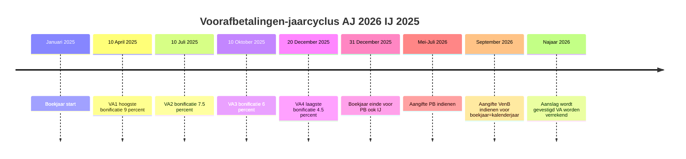

# Voorafbetalingen

_Instrument_

📋 Regeling · 📅 Gebeurtenis · Anchors: `2.2.IV` · `2.3.III` · `2.3.IV` · `2.2.taak.2` · `2.3.taak.2` · Wave: `skeleton-pb-venb-2026-05-28`

> [!info] 📝 **Concept** — content gevuld door cluster-extract; niet door mens-verify gegaan.

**Afk.**: VA — **Synoniemen**: versements anticipés · VA1-VA2-VA3-VA4 · vooruitbetaling belasting — **Vertalingen**: fr: versements anticipés

## Definitie

📖 Voorafbetalingen (VA) zijn vrijwillige vooruitbetalingen die belastingplichtigen — zelfstandigen, bedrijfsleiders, vennootschappen — in 4 kwartalen verrichten ter compensatie van de jaarlijkse belasting waarvoor geen of onvoldoende voorheffing aan bron geheven wordt. Door op tijd en voldoende vooraf te betalen vermijdt men een wettelijke 'belastingvermeerdering' (PB art. 157-158, VenB art. 218 WIB92) die wordt toegepast op de verschuldigde belasting. Vroeg betalen (VA1, april) levert een hogere bonificatie op dan laat betalen (VA4, december) — een degressieve schaal die incentiveert om kwartaal voor kwartaal te storten.

<small>📚 WIB92 — art. 157 — _wettekst_ · WIB92 — art. 175 — _wettekst_ · WIB92 — art. 218 — _wettekst_</small>

## Substantie

📖 Mechanisme: voor PB-zelfstandigen en bedrijfsleiders, en voor VenB-vennootschappen, is er geen bedrijfsvoorheffing aan bron op winst/baten (PB) of vennootschapswinst (VenB). De fiscus zou dus de volledige belasting pas via aanslagbiljet 12-18 maanden na het boekjaar innen — wat de Staatskas onaanvaardbare cashflow-vertraging zou geven. Voorafbetalingen vermijden dit door de belastingplichtige aan te zetten elke kwartaal geld over te maken aan FOD Financiën. Wettelijk-technisch: de fiscus berekent achteraf (bij aanslag) een 'globale vermeerdering' op de verschuldigde belasting (PB: art. 158 = referentievoet × x %; VenB: art. 218 = referentievoet × y %). Daartegenover worden 'bonificaties' geplaatst per kwartaal-VA volgens degressieve percentages (illustratief AJ 2026: VA1 = 9 %, VA2 = 7,5 %, VA3 = 6 %, VA4 = 4,5 % — exact via Cijferzakboekje). Som van bonificaties wordt afgetrokken van de vermeerdering. Saldo positief → effectieve vermeerdering verschuldigd. Saldo nul of negatief → geen vermeerdering, en voor PB-zelfstandigen + bedrijfsleiders een 3 %-bonificatie als 'beloning'.

<small>📚 WIB92 — art. 157 — _wettekst_ · WIB92 — art. 158 — _wettekst_ · WIB92 — art. 161 — _wettekst_ · WIB92 — art. 175 — _wettekst_ · WIB92 — art. 218 — _wettekst_</small>

## Rationale

🔗 De ratio legis is dubbel: (1) cashflow-stabilisatie voor de Staatskas — Belgische federale uitgaven (lonen ambtenaren, sociale uitkeringen) lopen continu door; zonder VA zou de Staat tijdelijk lenen om de tussentijdse periode te overbruggen tussen boekjaar-einde en aanslag-vestiging. (2) Spreiding van fiscale last bij belastingplichtigen — wie elk kwartaal een stuk betaalt, voelt het minder dan wie in één keer de hele aanslag moet ophoesten. De keuze om VA optioneel te maken (niet verplicht, men kan ook gewoon de vermeerdering accepteren) reflecteert respect voor cashflow-vrijheid: kleine vennootschappen of zelfstandigen in moeilijke jaren kunnen kiezen om de vermeerdering te dragen ipv VA te verrichten. Voor kleine vennootschap eerste 3 boekjaren: vrijstelling vermeerdering (art. 218 §2) — om startups niet te penaliseren wanneer ze nog geen winst-zekerheid hebben.

<small>📚 WIB92 — art. 218 §2 — _wettekst_ · cluster-extract-agent (opus-4.7-1M) — _ai_model_ — (2026-05-28)</small>

## Gebruikscontext

**Status**: `in-voege` · basis: WIB92 art. 157-177 (PB) + art. 218 (VenB) + KB/WIB92 art. 64-69

Stabiel kader. Belangrijkste wijziging recent: koppeling vermeerderings- + bonificatie-percentages aan ECB-referentievoet via jaarlijks KB (vroeger vast percentage). In hoge-rente-omgeving (2024-2026): vermeerdering kan hoger uitvallen — meer incentive om VA te verrichten.

**✅ Voor**
- 📖 PB-perspectief: zelfstandigen (winst/baten), bedrijfsleiders (bezoldigingen niet onderhevig aan bedrijfsvoorheffing of waar BV onvoldoende is), beoefenaars van vrij beroep. Voor werknemers met loon: VA niet relevant want bedrijfsvoorheffing aan bron volstaat doorgaans. VenB-perspectief: alle binnenlandse vennootschappen die VenB verschuldigd zijn — incl. KMO's vanaf het 4de boekjaar (eerste 3 zijn vrijgesteld).

**🚫 Niet voor**
- 📖 Werknemers met enkel loon (volledige bedrijfsvoorheffing aan bron): geen VA-relevantie. Vennootschappen in eerste 3 boekjaren ('startup vrijstelling'): geen vermeerdering, dus VA niet financieel-noodzakelijk (al kan men vrijwillig storten om belasting gespreid te betalen).

**▶️ Trigger start**
- 📖 PB-zelfstandigen: vanaf het 3de jaar van zelfstandige activiteit (eerste 2 jaren vrijgesteld van vermeerdering). VenB-vennootschappen: vanaf het 4de boekjaar (eerste 3 boekjaren als kleine vennootschap vrijgesteld).

**👍 Voordeel**
- 📖 Tijdig en voldoende VA vermijden vermeerdering — een netto-besparing die in hoge-rente-jaren tot 7-9 % van de aanslag kan oplopen. Voor PB-zelfstandigen: 3 %-bonificatie wanneer VA gedaan en vermeerdering vermeden. Bovendien: gespreide belastingbetaling = betere cashflow-planning dan één grote betaling bij aanslag.

**⚠️ Risico**
- 🔗 Te weinig VA: vermeerdering verschuldigd bij aanslag — moeilijk later te corrigeren. Te veel VA: geen 'risico' fiscaal-rechterlijk (overschot wordt teruggestort) maar wel cashflow-implicatie (geld is uitgehoofd). Verkeerde toewijzing aan AJ: VA's moeten correct gemerkt zijn met AJ-aanduiding bij betaling — fout AJ = wordt niet aangerekend op gewenst jaar.

## Bouwstenen

### ⚙️ 4-kwartalen-structuur + vermeerdering  
_`mechanisme`_

📖 Vier wettelijke betaaldata per AJ (art. 175 WIB92): VA1 = 10 april, VA2 = 10 juli, VA3 = 10 oktober, VA4 = 20 december (kalenderjaar van het inkomstenjaar voor PB, lopend boekjaar voor VenB met gebroken boekjaar). De vermeerdering (art. 157 PB / art. 218 VenB) wordt berekend als: vermeerderingsbasis = belasting verschuldigd × wettelijke vermeerderingspercentage; daartegen worden bonificaties geplaatst per VA (degressief over de kwartalen). Indien som bonificaties ≥ vermeerderingsbasis → geen vermeerdering. Indien som bonificaties < vermeerderingsbasis → het verschil is verschuldigde vermeerdering (toegevoegd aan aanslag).

<small>📚 WIB92 — art. 175 — _wettekst_ · WIB92 — art. 157-158 — _wettekst_ · WIB92 — art. 218 — _wettekst_</small>

### 🧮 Kwartaal-bonificatie-percentages (degressief)  
_`formule`_

📖 Bonificatie per VA = bedrag VA × wettelijk percentage van het kwartaal. Percentages zijn degressief — VA1 brengt het hoogste percentage op, VA4 het laagste. De percentages zijn evenredig met de positie binnen het jaar (VA1 'verdient' 4 kwartalen rente-voordeel voor de Staat, VA2 maar 3, etc.). Illustratieve percentages AJ 2026 (verifieer in Cijferzakboekje): VA1 ≈ 9 %, VA2 ≈ 7,5 %, VA3 ≈ 6 %, VA4 ≈ 4,5 %. Wettelijk: gekoppeld aan referentievoet ECB + opslag (art. 160 + 175 WIB92; jaarlijks KB).

<small>📚 WIB92 — art. 175 — _wettekst_ · WIB92 — art. 160 — _wettekst_</small>

### 📜 PB-zelfstandige: 3de jaar verplicht + 3 %-bonificatie  
_`regel`_

📖 PB-zelfstandigen + bedrijfsleiders + vrije beroepen worden VA-verplicht vanaf het 3de jaar van activiteit (art. 164 WIB92 — eerste 2 jaar vrijgesteld van vermeerdering om opstartfase niet te penaliseren). Specifiek voor PB-zelfstandige: wanneer VA voldoende zijn om vermeerdering te neutraliseren, krijgt men bovendien een BONIFICATIE van 3 % over het surplus aan VA (art. 161 WIB92) — als beloning voor het nemen van de cashflow-last. Deze 3 %-bonificatie is een PB-specifiek voordeel; VenB kent deze niet.

<small>📚 WIB92 — art. 164 — _wettekst_ · WIB92 — art. 161 — _wettekst_</small>

### 📜 VenB: bezoldigingsregel + geen bonificatie  
_`regel`_

📖 Voor vennootschappen die het verlaagd KMO-tarief (20 %) willen genieten: minimumbezoldiging bedrijfsleider geldt als voorwaarde (basisbedrag 45.000 EUR niet-geïndexeerd, art. 215 §3 — of gelijk aan belastbaar resultaat indien lager dan 45K). De vennootschap moet voor deze bezoldiging bedrijfsvoorheffing aan bron afhouden EN voorafbetalingen verrichten in de mate dat de BV onvoldoende is. VenB kent géén 3 %-bonificatie zoals PB — enkel het vermijden van de vermeerdering is het voordeel. Bezoldiging zaakvoerder telt mee in zijn eigen PB-aangifte (vak XVII).

<small>📚 WIB92 — art. 215 §3 — _wettekst_ · WIB92 — art. 32 — _wettekst_</small>

### ⚙️ Boekhoudkundige verwerking VA in vennootschap  
_`mechanisme`_

**Substantie**: 📖 Volgens CBN-advies 2018/14: VA gedurende het boekjaar worden geboekt op klasse 416 'Te ontvangen opbrengsten en over te dragen kosten' (specifiek subrekening 4160 'Voorafbetalingen op belastingen') of klasse 418 'Diverse vorderingen'. Bij jaareinde: geherclassificeerd naar klasse 678 'Belastingen' tegenover klasse 451 'BTW en andere belastingen te betalen', met het belastingbedrag in resultatenrekening + de VA als verminderingen van de schuld. Effect: in jaarrekening volledig zichtbaar (winstbelasting bruto + VA verrekend → schuld of vordering aan FOD).

<small>📚 CBN-advies 2018/14 — Voorafbetalingen — _cbn_</small>

## Voorbeelden

### 💡 VenB-vennootschap volledig VA — vermeerdering vermeden 🔗

_BV ConsultBE, niet-startup (4de boekjaar). Verwachte VenB 24.000 EUR voor AJ 2026 (boekjaar = kalenderjaar 2025). Accountant adviseert spreiding 6.000 EUR per kwartaal. Veronderstel illustratieve percentages: vermeerderingsvoet 9 %, kwartaal-bonificaties 9/7,5/6/4,5 %._

**Berekening:**
- Vermeerderingsbasis = belasting 24.000 × 9 % = 2.160 EUR (= maximum vermeerdering bij 0 VA)
- VA-betalingen: VA1 = 6.000 (10 april), VA2 = 6.000 (10 juli), VA3 = 6.000 (10 oktober), VA4 = 6.000 (20 december)
- Bonificaties: VA1 × 9 % = 540; VA2 × 7,5 % = 450; VA3 × 6 % = 360; VA4 × 4,5 % = 270
- Som bonificaties = 540 + 450 + 360 + 270 = 1.620 EUR
- Resultaat: bonificaties (1.620) < vermeerderingsbasis (2.160) → vermeerdering verschuldigd = 2.160 − 1.620 = 540 EUR
- Optimalisatie-tip: méér betalen vroeg in het jaar — bv. VA1 = 12.000 + VA2 = 6.000 + VA3 = 6.000 + VA4 = 0 zou méér bonificatie geven (12.000 × 9 % + 6.000 × 7,5 % + 6.000 × 6 % = 1.080 + 450 + 360 = 1.890) → resterende vermeerdering 270 EUR

→ **Resultaat**: Met evenredige spreiding bonificaties = 1.620 → 540 EUR vermeerdering blijft (75 % vermeden, maar niet 100 %). Met front-loading naar VA1: vermeerdering daalt tot 270 EUR. Bij volledige front-loading (24.000 VA1) zou 24.000 × 9 % = 2.160 EUR bonificatie = volledig dekken vermeerdering. Cliënt moet vergelijken: cashflow-opportuniteit vs vermeerdering vermijden.

<small>📚 WIB92 — art. 218 — _wettekst_ · WIB92 — art. 175 — _wettekst_ · cluster-extract-agent (opus-4.7-1M) — _ai_model_ — (2026-05-28)</small>

### 💡 PB-zelfstandige met 3 %-bonificatie 🔗

_Mevr. Vermeulen, fysiotherapeut zelfstandige sinds 2020 (= 6de jaar in 2025). Verwachte PB op haar baten: 15.000 EUR voor AJ 2026. Vermeerderingsvoet 9 %. Verricht VA: VA1 = 4.000, VA2 = 4.000, VA3 = 4.000, VA4 = 4.000 (totaal 16.000 EUR)._

**Berekening:**
- Vermeerderingsbasis = belasting 15.000 × 9 % = 1.350 EUR
- Bonificaties: 4.000 × 9 % + 4.000 × 7,5 % + 4.000 × 6 % + 4.000 × 4,5 % = 360 + 300 + 240 + 180 = 1.080 EUR
- Resultaat vermeerdering: 1.080 < 1.350 → 270 EUR vermeerdering
- Maar: totaal VA = 16.000 > belasting 15.000 → surplus VA = 1.000 EUR
- PB-specifiek voordeel: 3 %-bonificatie op surplus = 1.000 × 3 % = 30 EUR teruggave
- Eindrekening: Mevr. Vermeulen betaalt 15.000 belasting + 270 vermeerdering − 16.000 VA verrekend + 30 bonificatie = saldo terug te krijgen ≈ 760 EUR

→ **Resultaat**: PB-zelfstandige krijgt de 3 %-bonificatie (art. 161) als beloning voor het surplus aan VA — een fiscaal incentive om iets meer te betalen dan strikt noodzakelijk. Bij VenB-vennootschappen bestaat deze 3 %-bonificatie NIET — daar levert overschot enkel terugbetaling (zonder bonificatie).

<small>📚 WIB92 — art. 157 — _wettekst_ · WIB92 — art. 161 — _wettekst_ · cluster-extract-agent (opus-4.7-1M) — _ai_model_ — (2026-05-28)</small>

### 💡 Jaarcyclus VA — schema 📖

_Visuele timing voor stagiair._

Jaarcyclus VA (inkomstenjaar = kalenderjaar):

Kernpunt: VA worden gedaan IN het inkomstenjaar zelf (vóór aangifte). Bij voorbereiding aangifte: VA-overzicht moet beschikbaar zijn voor correcte verrekening op aanslagbiljet.

<small>📚 WIB92 — art. 175 — _wettekst_</small>

## Valkuilen

### ⚠️ VA en bedrijfsvoorheffing verwarren

**Verkeerde assumptie**: Voorafbetalingen zijn hetzelfde als bedrijfsvoorheffing — beide zijn 'vooruitbetalingen' aan FOD.

**Kernpunt**: Bedrijfsvoorheffing (BV) is een wettelijke INHOUDING aan bron door werkgever op loon (geen keuze, automatisch). Voorafbetalingen (VA) zijn VRIJWILLIGE betalingen door de belastingplichtige zelf om vermeerdering te vermijden. Werknemer met enkel loon: BV volstaat, géén VA nodig. Zelfstandige: geen BV op winst → VA nodig.

<small>📚 WIB92 — art. 270 e.v. — _wettekst_ · WIB92 — art. 175 — _wettekst_ · cluster-extract-agent (opus-4.7-1M) — _ai_model_ — (2026-05-28)</small>

### ⚠️ Bonificatie ≠ teruggave belastinggeld

**Verkeerde assumptie**: Bonificatie is een 'korting' op de belasting die direct teruggestort wordt.

**Kernpunt**: Bonificatie is een rekentechnische tegenwaarde die de wettelijke vermeerdering compenseert. Bij voldoende VA: bonificaties dekken vermeerdering → geen extra te betalen (maar ook geen teruggave puur uit bonificatie). PB-zelfstandige bonus 3 % is een uitzondering: dat is wel een effectieve teruggave als surplus aan VA werd verricht.

<small>📚 WIB92 — art. 157 — _wettekst_ · WIB92 — art. 161 — _wettekst_</small>

### ⚠️ 3 %-bonificatie verwachten in VenB

**Verkeerde assumptie**: Ook vennootschappen kunnen 3 %-bonificatie krijgen op surplus VA.

**Kernpunt**: De 3 %-bonificatie (art. 161 WIB92) geldt ENKEL voor PB — niet voor VenB. Vennootschappen kunnen alleen vermeerdering vermijden via VA; surplus wordt teruggestort maar zonder bonus. Stagiair die deze regels door elkaar haalt verliest punten op VenB-vs-PB-vragen.

<small>📚 WIB92 — art. 161 — _wettekst_ · WIB92 — art. 218 — _wettekst_</small>

### ⚠️ Startup-vrijstelling generaliseren

**Verkeerde assumptie**: Alle vennootschappen krijgen vrijstelling van vermeerdering in eerste 3 boekjaren.

**Kernpunt**: Art. 218 §2 beperkt de vrijstelling tot 'kleine vennootschap' in de zin van art. 1:24 WVV. Een grote vennootschap (omzet > 11,25 M of balanstotaal > 6 M of personeel > 50) krijgt geen vrijstelling, ook niet in haar eerste boekjaren. Net zo voor PB-zelfstandigen: vrijstelling vermeerdering eerste 2 jaar is gekoppeld aan 'eerste vestiging als zelfstandige' (art. 164) — niet aan 'eerste jaar in een nieuwe activiteit' voor een bestaande zelfstandige.

<small>📚 WIB92 — art. 218 §2 — _wettekst_ · WIB92 — art. 164 — _wettekst_</small>

## Speelruimtes

### 🎚️ Spreidings-strategie VA

## Accountant-perspectieven

### Eigen kantoor — VA-planning + monitoring

_De accountant die voor cliënten (zelfstandigen + vennootschappen) jaarlijks de VA-planning maakt en de kwartaalbetalingen opvolgt._

#### 💰 Fiscaal adviseur

##### 👣 Geprojecteerd resultaat berekenen (Q1)  
_`stap`_

🔗 Begin februari-maart van het inkomstenjaar: per cliënt een geprojecteerd jaarresultaat berekenen op basis van (a) vorig-jaar-resultaat × verwachte groei, (b) effectief Q4 vorig jaar als indicator, (c) bekende afwijkende factoren (grote investering, nieuwe klant, contract verloren). Op basis daarvan: simuleer de verwachte VenB of PB. Hieruit afgeleid: totaal VA-doel. Communiceer met cliënt vóór VA1-deadline (10 april).

<small>📚 cluster-extract-agent (opus-4.7-1M) — _ai_model_ — (2026-05-28)</small>

##### 🧭 Spreidings-advies per cliënt-archetype  
_`vuistregel`_

🔗 Per cliënt-profiel een spreidings-strategie adviseren: (a) cliënt met stabiele cashflow + hoge winst → front-load VA1 (maximum bonificatie); (b) cliënt met seizoenale cashflow (bv. landbouw, toerisme) → laat VA's volgen op grote inkomsten-momenten (eventueel grotere VA3-VA4); (c) cliënt met cashflow-spanning → minimaal VA1 + accepteer beperkte vermeerdering om liquiditeit te vrijwaren. Documenteer advies in cliëntdossier; bewaak kwartaaldeadlines via interne planning (Outlook-herinneringen of dossier-tracker).

<small>📚 cluster-extract-agent (opus-4.7-1M) — _ai_model_ — (2026-05-28)</small>

##### 👣 Kwartaal-monitoring + bijsturing  
_`stap`_

🔗 Per kwartaal: voor elke VA-pliciate cliënt een herinnering 1 week vóór deadline (10-en-20-dagen-regel zodat overschrijving op tijd toekomt — banken hebben transferdelay). Na betaling: bevestig met cliënt, registreer in dossier. Bij grote afwijking van geprojecteerd resultaat (verloren contract, verrassend grote winst): bijsturing van resterende VA's adviseren — proactief, niet reactief op aanslagbiljet.

<small>📚 cluster-extract-agent (opus-4.7-1M) — _ai_model_ — (2026-05-28)</small>

#### 📒 Boekhouder

##### 📜 Boekhoudkundige verwerking VA conform CBN 2018/14  
_`regel`_

📖 Voor vennootschap-cliënten: VA boeken op 416 'Voorafbetalingen op belastingen' (of 418) bij betaling. Bij jaarafsluiting: herclassificatie naar winstbelasting-rubriek + tegenrekening 451 belastingschuld of 416 belastingvordering naargelang netto-saldo. Conform CBN-advies 2018/14. Dit zorgt voor correcte presentatie in jaarrekening: brutowinstbelasting in resultatenrekening, restschuld of vordering correct op balans.

<small>📚 CBN-advies 2018/14 — Voorafbetalingen — boekhoudkundige behandeling — _cbn_</small>

## Verder lezen (scope-out)

- → Voorheffingen-en-verrekeningen-VenB (bredere context VenB) → [[voorheffingen-en-verrekeningen-venb]] _(moet-verwijzen)_
- → Belastingberekening-PB (PB-aanrekening) → [[belastingberekening-pb]] _(moet-verwijzen)_
- → Vennootschapsbelasting (kader) → [[vennootschapsbelasting]] _(moet-verwijzen)_
- → Personenbelasting (kader) → [[personenbelasting]] _(moet-verwijzen)_
- ↪ Concrete kwartaal-percentages (Cijferzakboekje) _(mag-verwijzen)_

## Relaties

### `valt_onder`
- [[personenbelasting]] — VA-mechanisme onder PB (art. 157-177 WIB92).
- [[vennootschapsbelasting]] — VA-mechanisme onder VenB (art. 218 WIB92 — analoog mechanisme).
### `vereist`
- [[belastingberekening-pb]] — VA worden in stap 7 (PB) en bewerking 8/voorheffingen (VenB) verrekend met de verschuldigde belasting.
### `vergelijkbaar_met`
- [[bedrijfsvoorheffing]]
    - **Gelijkenissen**:
        - Beide zijn 'vooruitbetalingen' aan FOD Financiën
        - Beide worden verrekend met de uiteindelijke aanslag
        - Beide hebben doel om jaarlijkse belasting-schuld gespreid te innen
    - **Verschillen**:
        - BV = INHOUDING AAN BRON door werkgever (verplicht, automatisch); VA = VRIJWILLIGE storting door belastingplichtige zelf
        - BV geldt op lonen + pensioenen + werkloosheid; VA geldt op winst/baten + bedrijfsleidersbezoldigingen zonder BV + vennootschapswinst
        - BV-bedragen volgen schalen vastgelegd in KB; VA-bedragen zijn vrij gekozen door belastingplichtige (mits binnen begrenzingen)
        - BV kent geen bonificatie-systeem; VA kent kwartaal-bonificaties + (PB) 3 %-bonificatie
    - ⚠️ **Verwarringsrisico**: Stagiair die BV en VA verwart bij advies: 'doe een VA bovenop het loon' kan onnodig zijn als BV al voldoende is — of omgekeerd, een zelfstandige denkt dat BV op zijn bezoldiging volstaat zonder VA op zijn winst.
### `beinvloed_door`
- [[verlaagd-tarief-kleine-vennootschap]] — Minimumbezoldigingsvoorwaarde voor KMO-tarief (art. 215 §3) verbindt VenB-VA met bezoldigingsbeleid bedrijfsleider.
