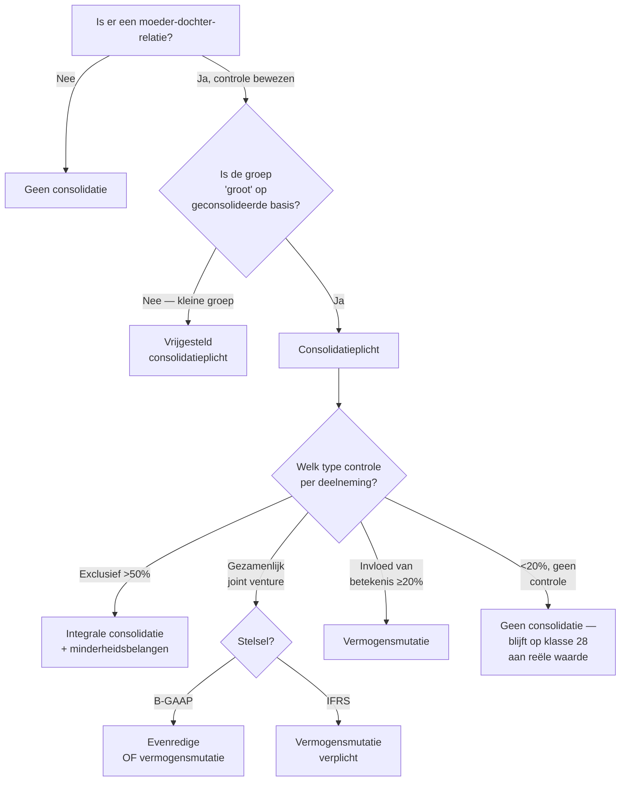

> **Samenvatting — kapstok voor herhaling.** Enkele A4 die het hele PO samenvatten in vaste blokken: essentie, vergelijking van methodes, beslisboom, formules, valkuilen. Bedoeld om in de week vóór het examen nog snel door te lopen — niet om voor het eerst te leren. Voor uitleg en doorwerking: de leerstukken van dit leerpad. Voor verhaal en routekaart: [[leerpaden/1-4|minicursus PO 1.4]].

---

## 1. Take-away (wat je écht moet weten)

- **Wat?** Moeder + dochters als **één economische eenheid** — niet door optelling, maar door **eliminatie** van intra-groep-relaties (deelnemingen, vorderingen, omzet, niet-gerealiseerde winsten) + **uniforme waarderingsregels** voor alle entiteiten.
- **Wanneer plichtig?** Twee voorwaarden samen:
  - **Controle** over één of meer dochters (verticaal of via consortium)
  - **Groep "groot"** op geconsolideerde basis (drempels — zie §4)
- **Welke methode?** Volgt het type controle:
  - Exclusief (>50%) → **Integrale consolidatie** — voor dochters
  - Gezamenlijk → **Evenredige** of VMM — voor joint ventures
  - Invloed van betekenis (≥20%) → **Vermogensmutatie** — voor geassocieerde deelnemingen
- **Eerste consolidatie**: aankoopprijs deelneming vs aandeel in EV dochter (na herwaardering tegen reële waarde). Verschil = **goodwill** (positief) of **badwill** (negatief).

---

## 2. Vergelijkingstabel — de drie consolidatiemethodes

| Aspect | Integrale consolidatie | Evenredige consolidatie | Vermogensmutatie (VMM) |
|---|---|---|---|
| **Wanneer?** | Exclusieve controle | Gezamenlijke controle (joint venture) | Invloed van betekenis (≥20%, geen controle) |
| **Hoeveel opnemen?** | 100% van alle posten | % deelneming, lijn per lijn | 1 lijn: aandeel in eigen vermogen |
| **Activa/passiva dochter zichtbaar?** | Ja, volledig | Ja, pro rata | Nee, samengevoegd op 1 balanslijn |
| **Omzet & kosten dochter zichtbaar?** | Ja, volledig | Ja, pro rata | Nee, alleen aandeel in resultaat |
| **Minderheidsbelangen?** | Ja, aparte rubriek "belangen van derden" | Nee | Nee |
| **Intercompany-eliminatie?** | Volledig | Pro rata | Beperkt (alleen niet-gerealiseerde winsten op eigen aandeel) |
| **B-GAAP rechtsgrond** | art. 3:131 KB-WVV | art. 3:134 KB-WVV | art. 3:139 KB-WVV |
| **IFRS pendant** | IFRS 10 | ⚠️ Afgeschaft — vervangen door VMM (IFRS 11) | IAS 28 |

> 💡 **B-GAAP ↔ IFRS:** onder IFRS 11 is evenredige consolidatie voor joint ventures **niet meer toegestaan** — sinds 2014 verplicht VMM. B-GAAP blijft het wel toelaten.

### Visueel — wat zie je op de geconsolideerde balans?

**Voorbeeld**: moeder M heeft **80%** van dochter D. D op enkelvoudige balans: activa 100, schulden 60, eigen vermogen 40.

| Post (van dochter D) | Integrale consolidatie | Evenredige consolidatie | Vermogensmutatie (VMM) |
|---|---|---|---|
| Activa dochter (100) | **+ 100** | + 80 (= 80% × 100) | — |
| Schulden dochter (60) | + 60 | + 48 (= 80% × 60) | — |
| Eigen vermogen groep | + 32 (= 80% × 40) | + 32 | + 32 |
| Belangen van derden | **+ 8** (= 20% × 40) | — | — |
| 1 balanslijn "Deelneming VMM" | — | — | **+ 32** |
| **Resultaat (P&L)** | 100% omzet & kosten | 80% omzet & kosten | 1 lijn: aandeel in resultaat |
| **Visueel effect** | "alle posten dochter zichtbaar, minderheid apart" | "fractioneel gemengd" | "alles samengebald op 1 lijn" |

---

## 3. Beslisboom — "moet ik consolideren, en hoe?"

---

## 4. Drempels & formules

### Drempels consolidatieplicht (groep "groot" — art. 1:26 WVV)

> Een groep is **klein** (vrijgesteld van consolidatieplicht) als zij op geconsolideerde basis **niet meer dan één** van de drempels overschrijdt, gedurende twee opeenvolgende boekjaren:

| Criterium | Drempel (geconsolideerd) |
|---|---|
| Jaargemiddelde personeel | 250 |
| Jaaromzet (excl. btw) | € 50 000 000 |
| Balanstotaal | € 25 000 000 |

⚠️ Beursgenoteerde moeders zijn **altijd** consolidatieplichtig, ongeacht omvang.

### Goodwill — eerste consolidatie

$$
\text{Goodwill} = \text{Aankoopprijs deelneming} - (\text{\% deelneming} \times \text{Netto eigen vermogen dochter}_{\text{reële waarde}})
$$

- **Positief** → goodwill → actief, afschrijven volgens economische levensduur (B-GAAP: max periode te verantwoorden; IFRS: geen afschrijving, jaarlijkse impairment-test)
- **Negatief** → badwill → passief, geleidelijk terugnemen in resultaat (B-GAAP) of onmiddellijk in resultaat (IFRS, na review)

### Minderheidsbelangen (integrale consolidatie)

$$
\text{Belangen van derden} = (1 - \text{\% moeder}) \times \text{Eigen vermogen dochter}_{\text{geconsolideerd}}
$$

Verschijnt apart op de balans (tussen eigen vermogen en schulden onder B-GAAP; ín het eigen vermogen onder IFRS).

---

## 5. Klassieke valkuilen (examen-radar)

| Valkuil | Wat klopt er niet | Wat klopt wél |
|---|---|---|
| "Geconsolideerde JR = som van enkelvoudige JR's" | Pure optelling overdrijft de groep ~2× | Optelling **+ eliminaties + uniforme waardering** |
| "Bij integrale consolidatie zie je geen minderheid" | Minderheidsbelang is wél zichtbaar — als aparte rubriek "belangen van derden" | Methode neemt 100% op, minderheid wordt apart getoond |
| "Joint venture → altijd evenredig" | Onder IFRS 11 sinds 2014 **verboden** voor joint ventures | B-GAAP: keuze tussen evenredig en VMM; IFRS: VMM verplicht |
| "Goodwill = alle synergie + merknaam" | Identificeerbare immateriële activa (merken, klantenrelaties) moeten **apart** worden geherwaardeerd vóór de goodwill-berekening | Goodwill = restpost ná herwaardering tegen reële waarde |
| "Klein-groep vrijstelling geldt altijd" | Beursgenoteerde groepen **nooit** vrijgesteld | Vrijstelling alleen voor niet-beursgenoteerde groepen onder drempels |

---

## 6. Verbinding met examen (PO 1.4)

PO 1.4 — *Geconsolideerde jaarrekening* — heeft **één taak** met 7 doelstellingen, gedeeld door individuele én geconsolideerde JR. Operationele vaardigheden specifiek voor consolidatie ("kring **bepalen**", "methode **kiezen**", "eerste consolidatie **boeken**", "intercompany **elimineren**") staan niet in deze lijst — ze leven in de concept-records via *accountant_perspectieven* (rol boekhouder/auditor/adviseur). Volg §7 voor doorklik.

**Taak 1**: Opstellen van de individuele en geconsolideerde jaarrekening

| Doelstelling | Gedekt door |
|---|---|
| 1. Uitvoeren van eindejaarsverrichtingen | → cluster **jaarrekening** |
| 2. Bepalen boekhoudkundig resultaat + bestemming | → cluster **jaarrekening** |
| 3. Opstellen proefbalans en saldibalans | → cluster **jaarrekening** |
| 4. Opstellen jaarrekening (balans, resultatenrekening, toelichting) | **Geconsolideerd**: §1, §2, §5 + [[opmaak-geconsolideerde-jaarrekening]] · **Individueel**: → cluster **jaarrekening** |
| 5. Verwerken sociale balans | → cluster **jaarrekening** |
| 6. Toepassen waarderingsregels (voorraden, afschrijving) | **Groepsbreed uniform**: §1 + [[uniforme-waarderingsregels-consolidatie]] · **Individueel**: → cluster **waarderingsregels** |
| 7. Executeren vorderingen en schulden | → cluster **jaarrekening** |

---

## 7. Verdieping

### Leerstukken — voor pedagogische opfris

Werkt iets niet meer scherp? Klik door naar het leerstuk dat het uitwerkt:

- [[wat-is-een-geconsolideerde-jaarrekening]] — wat het document is, voor wie, vier onderdelen, B-GAAP versus IFRS
- [[wie-moet-consolideren]] — controle (3 niveaus), kring (verticaal/consortium), drempels, vrijstellingen, kring-wijzigingen
- [[hoe-consolideren]] — vier stappen + drie methodes + eerste consolidatie + drie families eliminaties
- [[consolidatieverschil]] — berekening, afschrijving (B-GAAP) versus impairment (IFRS), badwill
- [[rapportering-en-controle-geconsolideerde-jaarrekening]] — opmaak-proces, geconsolideerd jaarverslag, commissarisverslag, termijnen + NBB

### Concept-fiches — voor definitorisch detail

Voor wie een wettekst-pointer of nauwkeurige definitie zoekt:

**Kaders & plicht** — [[geconsolideerde-jaarrekening]] · [[consolidatieverplichting]] · [[consolidatiekring]] · [[controle-bij-consolidatie]]

**Methodes** — [[consolidatiemethoden]] · [[integrale-consolidatie]] · [[evenredige-consolidatie]] · [[vermogensmutatiemethode]]

**Specifieke begrippen & verrichtingen** — [[eerste-consolidatie]] · [[consolidatieverschil]] · [[minderheidsbelangen]] · [[eliminatie-intercompany]] · [[uniforme-waarderingsregels-consolidatie]] · [[wijziging-consolidatiekring]]

**Opmaak & rapportering** — [[opmaak-geconsolideerde-jaarrekening]] · [[geconsolideerd-jaarverslag]]

---

*Synthese gegenereerd uit cluster `consolidatie` in granulariteit-skelet (PO 1.4). Status: voorgesteld — nog niet inhoudelijk gecureerd.*
