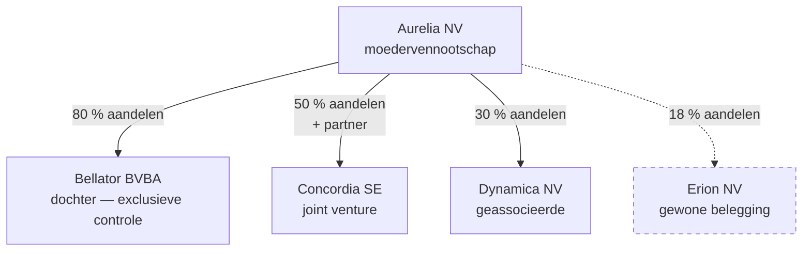

> **Leerstuk — één vraag, helemaal doorgewerkt.** Dit is de entry-fiche voor consolidatie: eerst snappen wát het document is. Wie verplicht is staat in [[wie-moet-consolideren]], hoe het technisch werkt in [[hoe-consolideren]], en wat er met het consolidatieverschil gebeurt in [[consolidatieverschil]]. Voor verhaal en routekaart: [[leerpaden/1-4|minicursus PO 1.4]].

## Antwoord in één blik

Een geconsolideerde jaarrekening presenteert een **moedervennootschap en haar dochters als één economische eenheid**. Het sleutelverschil met een ruwe optelling van afzonderlijke jaarrekeningen zit in dat éne woord: *eliminatie*. Onderlinge stromen — vorderingen, intra-groep omzet, de deelneming-lijn tegenover het eigen vermogen van de dochter — worden uit de cijfers gehaald, zodat enkel de relaties met de buitenwereld overblijven.

We illustreren doorheen dit leerstuk aan de hand van de Aurelia-groep. Het waarom achter deze rapporteringsvorm en voor wie ze bedoeld is, werken we hieronder uit.

---

## Waarom een aparte geconsolideerde jaarrekening?

Stel je voor: een moedervennootschap met tien dochters. Op je bureau liggen elf afzonderlijke jaarrekeningen. Wie de groep als geheel wil beoordelen, moet die elf documenten naast elkaar leggen, intercompany-stromen mentaal aftrekken en hopen dat er niets dubbel telt. Onbruikbaar — en niet alleen omwille van de hoeveelheid.

Het diepere probleem zit in de moederbalans zelf. Kijk naar Aurelia: op haar financiële vaste activa staat één lijn — *Deelneming Bellator: 6,0 mln*. Dat is alles. Je ziet niet welke gebouwen Bellator bezit, welke voorraden ze aanhoudt, welke klantenrelaties ze in de loop der jaren heeft opgebouwd. De moeder-jaarrekening verhult de inhoud van de dochter achter één samenvattende post.

Het eerste-instinct is een ruwe optelling: gooi de cijfers van Aurelia en Bellator gewoon op één hoop. Maar dat breekt zodra je een intra-groep transactie tegenkomt. Aurelia verkocht in 2026 voor 2,5 mln aan Bellator, en die voorraad ligt op balansdatum nog steeds bij de dochter. Bij een simpele optelling zou diezelfde economische waarde twee keer in de groep zitten: één keer als omzet bij Aurelia, één keer als voorraad bij Bellator. Je zou de groep op die post verdubbelen.

De oplossing is conceptueel eenvoudig: kijk *door* de moeder heen en haal tegelijk alle onderlinge relaties eruit. Vervang de deelneming-lijn door de werkelijke activa en passiva van de dochter, en elimineer alle intra-groep stromen. Wat overblijft is wat een buitenstaander ziet — de groep zoals ze in de markt handelt.

> **Een korte formule om mee te nemen.** Consolidatie is integratie *plus* eliminatie. Wie alleen optelt, dupliceert. Wie alleen elimineert zonder de onderliggende activa van de dochter binnen te halen, mist het hele punt. Allebei tegelijk is de truc. De technische uitwerking — eerste consolidatie, drie families eliminaties — vind je in [[hoe-consolideren]].

---

## Voor wie is ze bedoeld?

De geconsolideerde jaarrekening dient externe gebruikers die de **groep** willen begrijpen, niet één afzonderlijke entiteit. Vier typische lezers, elk met een eigen vraag:

| Stakeholder | Wat wil hij/zij weten? |
|---|---|
| Bank / kredietverstrekker | Kredietwaardigheid van de groep als geheel — niet van één entiteit. Een krediet aan de moeder leunt economisch op de dochters |
| Aandeelhouder | Rendement op de investering in de moeder, gedragen door de groepsprestaties die anders pas bij dividend-uitkering zichtbaar worden |
| Fiscus | Voor groepsregels: CFC, Pijler 2, transferprijzen — alles wat naar de groep als economisch geheel kijkt |
| Analist / belegger | Waardering van de groep, met de onderliggende activa zichtbaar in plaats van verstopt achter een deelneming-lijn |

De rode draad: één economisch verhaal voor een economisch geheel.

> **De enkelvoudige jaarrekening blijft bestaan.** De geconsolideerde JR vervángt de individuele niet — ze komt erbij. Elke vennootschap blijft verplicht haar eigen jaarrekening op te maken en neer te leggen, want die blijft de basis voor vennootschapsbelasting, dividendrecht, kapitaalbescherming en het sociaal recht. Wie met één dochter van de groep contracteert of die ene entiteit fiscaal moet beoordelen, leest het enkelvoudige document. Wie de groep als geheel wil zien, leest het geconsolideerde.

---

## Wat zit erin? Vier onderdelen

Een geconsolideerde jaarrekening onder Belgisch recht telt vier onderdelen. Elk heeft een tegenhanger in de enkelvoudige jaarrekening, maar met groep-specifieke posten en een veel zwaardere toelichting.

| Onderdeel | Wat staat erin? |
|---|---|
| Geconsolideerde balans | Activa en passiva van de hele groep, na eliminaties. Aparte rubrieken voor consolidatieverschil (goodwill/badwill) en belang van derden |
| Geconsolideerde resultatenrekening | Opbrengsten en kosten van de groep, na eliminaties. Aparte post "aandeel van derden in het resultaat" en, voor associates, "aandeel in het resultaat van vennootschappen waarop de vermogensmutatiemethode is toegepast" |
| Geconsolideerde toelichting | Verklaring van de cijfers, samenstelling van de consolidatiekring, gekozen methode per dochter, waarderingsregels en consolidatieverschillen |
| Geconsolideerd jaarverslag | Beleidsbeschrijving, voornaamste risico's, duurzaamheid en governance — opgesteld door het bestuursorgaan van de moedervennootschap op groepsniveau |

De toelichting is in geconsolideerde context veel uitgebreider dan in de enkelvoudige. Ze beschrijft niet alleen *wat* er gewaardeerd werd, maar ook *hoe* de groep is afgelijnd: welke entiteiten in de kring zitten, welke methode per entiteit gekozen werd, hoe consolidatieverschillen ontstonden en of er een organisatie van openbaar belang in de groep zit.

Het opmaakproces zelf — wie wat doet, hoe de commissaris controleert, welke termijnen gelden voor neerlegging bij de Nationale Bank — werken we niet hier uit. Zie [[rapportering-en-controle-geconsolideerde-jaarrekening]] voor die proces-kant.

> **Onder IFRS komen er extra onderdelen bij.** Wie volgens IFRS rapporteert, voegt aan de balans en resultatenrekening drie aparte overzichten toe: een overzicht van het totaalresultaat (other comprehensive income), een mutatie-overzicht van het eigen vermogen en een kasstroomoverzicht. Onder B-GAAP zit die informatie verspreid over balans, toelichting en jaarverslag — minder gestructureerd, maar in beginsel aanwezig.

---

## Twee stelsels: B-GAAP en IFRS

België kent twee mogelijke kaders. Het **Belgisch stelsel** is de standaard: opgemaakt volgens het Wetboek van Vennootschappen en Verenigingen en het KB-WVV, in euro, neergelegd bij de Nationale Bank. Voor **beursgenoteerde moedervennootschappen** is daarentegen IFRS verplicht, op grond van de Europese IAS-Verordening uit 2002. Andere groepen mogen vrijwillig voor IFRS kiezen — wat ze in de praktijk doen wanneer ze internationaal vergelijkbaar willen rapporteren of een beursgang voorbereiden.

De twee stelsels verschillen op een handvol pedagogisch zware punten. De *scope-vrijstelling* "groep van beperkte omvang" bestaat alleen onder B-GAAP — IFRS kent geen algemene drempel-vrijstelling. Het *consolidatieverschil* (positief: goodwill; negatief: badwill) wordt onder B-GAAP systematisch *afgeschreven* volgens een passend plan en eventueel bijkomend niet-recurrent afgeschreven wanneer de economische omstandigheden dat eisen, terwijl IFRS het consolidatieverschil niet afschrijft maar enkel jaarlijks op impairment toetst. En *evenredige consolidatie* voor joint ventures is onder B-GAAP toegelaten, maar onder IFRS verboden — joint ventures gaan daar verplicht via de vermogensmutatiemethode.

De technische uitwerking van die verschillen ligt elders: zie [[consolidatieverschil]] voor de behandeling van goodwill en badwill onder beide stelsels en [[hoe-consolideren]] voor de methode-keuze en wanneer welke methode toegepast wordt.

---

## Wanneer je dit snapt, ga dan naar

- [[wie-moet-consolideren]] — Wanneer is een groep verplicht een geconsolideerde JR op te maken? Controle, kring, drempels.
- [[hoe-consolideren]] — Hoe werkt het technisch? Drie methodes, eerste consolidatie, drie families van eliminaties.
- [[consolidatieverschil]] — Wat gebeurt er met het verschil (goodwill of badwill) na de eerste consolidatie? Afschrijving, impairment, B-GAAP vs IFRS.
- [[rapportering-en-controle-geconsolideerde-jaarrekening]] — Opmaakproces, jaarverslag, commissarisverslag, termijnen en NBB-publicatie.
- [[leerpaden/1-4/samenvatting|Samenvatting PO 1.4]] — voor herhaling vlak vóór het examen.

## Doorklik naar concepten

Voor wie definitorisch detail wil opzoeken:

- [[geconsolideerde-jaarrekening]] · [[jaarrekening]]

---

## Wettelijk fundament

- Verplichting tot opmaak geconsolideerde JR door de moedervennootschap: WVV art. 3:22 e.v.
- Onderdelen en inhoud van de geconsolideerde JR: KB-WVV (onderafdeling Geconsolideerde jaarrekening).
- Geconsolideerd jaarverslag, opgesteld door het bestuursorgaan van de moedervennootschap: WVV art. 3:32 e.v. (inhoudelijk detail: zie [[rapportering-en-controle-geconsolideerde-jaarrekening]]).
- IFRS-toepassing: Verordening (EG) 1606/2002 (IAS-Verordening). Verplicht voor beursgenoteerde moedervennootschappen; optioneel voor andere moeders sinds 2017.

---

*Leerstuk PO 1.4. Status: voorgesteld — entry-fiche; specifieker detail in andere 1.4-leerstukken.*
