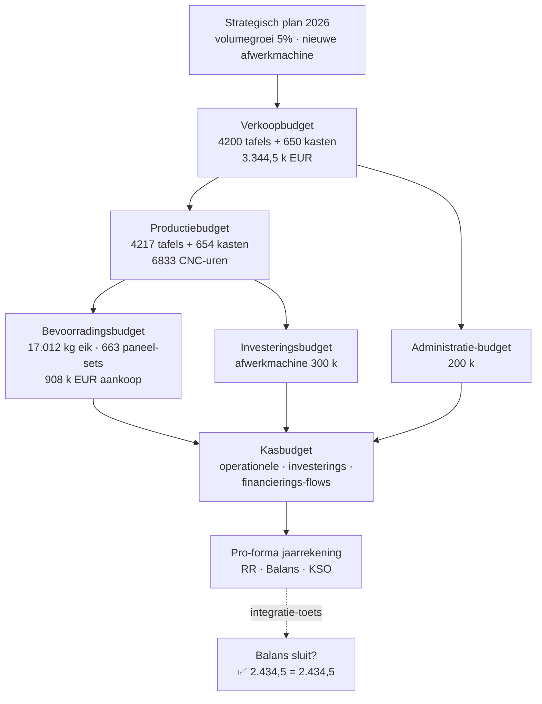

> **Leerstuk — één vraag, helemaal doorgewerkt.** Dit is het vierde en laatste leerstuk van PO 1.8 en sluit de toolkit van de analytische boekhouding rond: van de stelsel-keuze (leerstuk 1) via de kostprijsmethoden (leerstuk 2) en de beslissings-rekening (leerstuk 3) naar de sturings-cyclus zelf — budget vooraf, variantie achteraf, bijsturing waar nodig. Voor verhaal en routekaart: [[leerpaden/1-8|minicursus PO 1.8]]. Wikilinks doorheen de tekst leiden naar concept-fiches voor definitorische opzoek.

## Antwoord in één blik

Budget en variantieanalyse vormen samen **één sturings-cyclus** — vooraf leg je de norm vast (het [[masterbudget]] is zes deelbudgetten samengesnoerd tot een pro-forma jaarrekening), achteraf decomposeer je de afwijking (variantie = prijs-effect + hoeveelheids-effect), en bij een significante afwijking stuur je bij (budget-herziening). De opbouwvolgorde is vast en niet onderhandelbaar: begin bij het **verkoopbudget** (alles volgt uit volume × prijs), dan het productiebudget (verkoop + voorraadbeleid), dan bevoorrading, investering, administratie, en als sluitstuk het kasbudget. De pro-forma resultatenrekening is de plek waar het analytische werk uit de vorige leerstukken cijfermatig landt — kostprijzen en contributiemarges worden hier opnieuw zichtbaar als operationele lijnen. De [[variantieanalyse]] maakt verantwoordelijkheid zichtbaar — een prijsstijging eik komt bij inkoop terecht, een verhoogd verbruik per tafel bij productie. Bij materiële én structurele afwijking wordt het budget herzien (rolling forecast of formele heropening).

We werken alles uit op **Meridia Meubel BV** — een mock Belgische middelgrote vennootschap met twee productlijnen (tafel-eik en kast-op-maat). Eerst bouwen we het masterbudget 2026, daarna decomposeren we het Q1-variantierapport, en tot slot bekijken we wanneer en hoe je het budget herziet.

---

## Budgetbeheer — vier functies in één cyclus

Budgetbeheer is meer dan "cijfers vooraf". Het vervult tegelijk vier functies: **planning** (cijfermatige vertaling van strategie — "5 % volumegroei tafel-eik", "nieuwe afwerkmachine van 300.000 EUR"), **coördinatie** (de afdelingen op elkaar afstemmen — als verkoop 4.200 tafels verwacht, moet productie er 4.217 maken om het voorraadbeleid te respecteren), **motivatie** (concrete doelen voor afdelingsmanagers) en **controle** (afwijkingen detecteren via variantieanalyse). Een budget is in die zin een **afspraak**, geen voorspelling. Het beschrijft niet wat *zal* gebeuren — het legt vast wat de organisatie zich *voorneemt*. Daarom is een afwijking interessant management-informatie en geen "fout in de prognose". Voor de top-down ↔ bottom-up dynamiek tussen directie-kaders en afdelings-input, zie [[budgetbeheer]].

De cyclus zelf doorloopt zes fasen:

| Fase | Wie? | Wat? |
|---|---|---|
| 1. Voorbereiding | Directie | Strategische kaders, aannames (groei, prijs, investering) |
| 2. Opstelling | Afdelingen | Eigen deelbudget binnen de kaders |
| 3. Goedkeuring | Directie + RvB | Consolidatie, betwisting, validatie |
| 4. Uitvoering | Afdelingen | Werken binnen het goedgekeurde budget |
| 5. Controle | Controller | Maandelijkse vergelijking budget vs werkelijk |
| 6. Bijsturing | Directie | Budget-herziening bij materiële afwijking |

Bij Meridia loopt deze cyclus continu — voorbereiding in Q4 van het voorgaande jaar, opstelling en goedkeuring vóór Nieuwjaar, controle elke maand, bijsturing telkens wanneer een variantie de materialiteits-drempel doorbreekt.

---

## Het masterbudget — zes deelbudgetten samengeknoopt

Het masterbudget is het integrale budget dat álle deelbudgetten samenbrengt tot één pro-forma jaarrekening — resultatenrekening plus balans plus kasstroomoverzicht. Bij Meridia 2026 zijn dat zes deelbudgetten: verkoop, productie, bevoorrading, investering, administratie en kas. De **stelregel voor de opbouwvolgorde** is hard: begin altijd bij verkoop, want het verkoopbudget bepaalt alles wat erna komt. Productie volgt uit verkoop plus voorraadbeleid; bevoorrading uit productie plus grondstof-voorraadbeleid; investering staat enigszins apart (dat zijn strategische beslissingen van de directie); administratie volgt de activiteit; en kas integreert het geheel.

### 1. Verkoopbudget — vertrekpunt

Het verkoopbudget vertaalt de strategische groei-aannames naar concrete kwartaal-cijfers. Bij Meridia 2026 stijgt het tafel-eik-volume van 4.000 naar 4.200 stuks (volumegroei 5 %), en de prijs van 500 naar 510 EUR (prijsstijging 2 %). Voor kast-op-maat: van 600 naar 650 stuks (groei 8,3 %) en van 1.800 naar 1.850 EUR (stijging 2,8 %). Het totaal: 4.200 × 510 + 650 × 1.850 = **3.344.500 EUR omzet**. Q2 en Q4 liggen iets sterker dan Q1 en Q3 — lente-installaties en eindejaars-cadeaus trekken de vraag op.

| Productlijn | Q1 | Q2 | Q3 | Q4 | **Totaal 2026** |
|---|---:|---:|---:|---:|---:|
| tafel-eik volumes (eenheden) | 1.000 | 1.100 | 1.000 | 1.100 | **4.200** |
| tafel-eik omzet (× 510) | 510.000 | 561.000 | 510.000 | 561.000 | **2.142.000** |
| kast-op-maat volumes | 150 | 175 | 150 | 175 | **650** |
| kast-op-maat omzet (× 1850) | 277.500 | 323.750 | 277.500 | 323.750 | **1.202.500** |
| **Totaal omzet** | **787.500** | **884.750** | **787.500** | **884.750** | **3.344.500** |

De aannames zelf — volumegroei, prijsindex, mix — komen niet uit de afdelingen maar uit het strategisch kader dat de directie vooraf zet. Dat is fase 1 van de cyclus; zonder die kaders wordt het verkoopbudget een wensenlijst van de salesafdeling.

### 2. Productiebudget — afgeleid van verkoop + voorraad

De formule voor het productiebudget is direct: productie = verkoop + eindvoorraad − beginvoorraad. Meridia hanteert een voorraadpolicy van **1 maand verkoop in afgewerkte producten** — voor tafels betekent dat 4.200 / 12 = 350 stuks aan het einde van het jaar, tegenover een beginvoorraad van 4.000 / 12 = 333. Productie tafels = 4.200 + 350 − 333 = **4.217 stuks**. Voor kasten: 650 + 54 − 50 = **654 stuks**.

| Productlijn | Verkoop | + Eindvoorraad (1 maand) | − Beginvoorraad | **Productie 2026** |
|---|---:|---:|---:|---:|
| tafel-eik (eenheden) | 4.200 | +350 (4200/12) | −333 (4000/12) | **4.217** |
| kast-op-maat (eenheden) | 650 | +54 (650/12) | −50 (600/12) | **654** |

De capaciteits-check is hier kritiek. Aan 1 CNC-uur per tafel en 4 per kast: 4.217 × 1 + 654 × 4 = **6.833 CNC-uren** nodig. Tegenover een jaarcapaciteit van 7.000 uren is dat 98 % bezetting — krap, en het knelpunt is actief. Dit verwijst rechtstreeks terug naar [[break-even-en-marginale-beslissing]]: bij elke verschuiving van de mix moet de knelpunt-redenering (CM per CNC-uur) opnieuw gemaakt worden. Als de vraag verder oploopt en de CNC-capaciteit niet uitbreidt, krijgt tafel-eik voorrang (CM/uur 260) boven kast (CM/uur 180).

### 3. Bevoorradingsbudget — grondstoffen

Dezelfde formule, één laag dieper: aankoop = verbruik + eindvoorraad − beginvoorraad. De voorraadpolicy voor grondstoffen is **2 maanden verbruik**, zodat een onderbreking in de toelevering productie niet meteen stillegt. Voor eik komt het verbruik uit het productiebudget: 4.217 tafels × 4 kg = 16.868 kg. Met een eindvoorraad van 2.811 kg (2 maanden) en een beginvoorraad van 2.667 kg: aankoop = 17.012 kg eik. Aan 30 EUR/kg standaardprijs is dat **510.370 EUR**. Voor paneelhout-sets (kasten): 663 sets × 600 EUR = **397.800 EUR**.

| Grondstof | Verbruik (norm) | + Eindvoorr (2 mnd) | − Beginvoorr | **Aankoop 2026** |
|---|---:|---:|---:|---:|
| Eik (kg) voor tafels | 4217 × 4 = 16.868 | +2.811 | −2.667 | **17.012 kg** |
| Eik kost (× 30 EUR) | 506.040 | 84.330 | −80.000 | **510.370 EUR** |
| Paneelhout sets voor kasten | 654 sets | +109 | −100 | **663 sets** |
| Paneelhout kost (× 600 EUR) | 392.400 | 65.400 | −60.000 | **397.800 EUR** |

Totale grondstof-aankoop voor 2026: **908.170 EUR**.

### 4. Investeringsbudget — strategische input

Meridia investeert in 2026 in een nieuwe **semi-automatische lakmachine** voor 300.000 EUR (afschrijving 5 jaar lineair = 60.000 EUR/jaar). Het verwachte voordeel: 1.500 afwerk-uren per jaar vrijgemaakt. Het afwerkatelier was geen knelpunt — bezetting 12.800 op 15.000 uren beschikbaar — dus de investering bouwt geen capaciteit bij waar ze vandaag knelt, maar maakt ruimte voor volumegroei vanaf 2027. Wel komt er meteen 60.000 EUR additionele vaste overhead bij; de vaste-OH-pool stijgt van 740.000 EUR in 2025 naar **800.000 EUR in 2026**.

Het investeringsbudget volgt geen mechanische formule uit verkoop of productie — het komt uit het strategisch plan zelf. Dat maakt het de plek waar de directie de toekomst van de onderneming letterlijk in cijfers giet.

### 5 + 6. Administratie- en kasbudget

Het administratiebudget 2026 bedraagt 200.000 EUR — 180.000 EUR bestaand niveau + 20.000 EUR loonindexering en lichte uitbreiding. Het sluitstuk is het **kasbudget**: het integreert alle eerdere deelbudgetten tot één netto kaseffect en projecteert zo de liquide-positie. Bij Meridia 2026 stijgen de liquide middelen van 300 naar 614,5 k EUR (+314,5 k EUR netto), wat aantoont dat het strategisch plan financierbaar is zonder extra financiering. De techniek van het kasstroomoverzicht zelf — operationele versus investerings- versus financierings-cashflow uit elkaar trekken — hoort bij de jaarrekening-opmaak (PO 1.1/1.2) en valt buiten het analytische luik.

---

## Pro-forma resultatenrekening — waar het analytische werk landt

Een masterbudget produceert een complete pro-forma jaarrekening — resultatenrekening, balans en kasstroomoverzicht. Voor PO 1.8 is vooral de pro-forma resultatenrekening het scherpe stuk: daar landen de kostprijs- en contributiemarge-cijfers die je in [[kostprijsmethoden-kiezen]] en [[break-even-en-marginale-beslissing]] hebt opgebouwd direct als operationele lijnen. Variabele kost per eenheid maal volume plus de vaste-overhead-pool levert de twee operationele cijfers in de RR — variabele kosten en vaste overhead. Vandaaruit is de contributiemarge één optelling weg en het bedrijfsresultaat één aftrekking.

**Pro-forma resultatenrekening Meridia 2026** (in k EUR):

| | |
|---|---:|
| Omzet | 3.344,5 |
| Variabele kosten (240×4200 + 1080×650 = 1.008 + 702) | −1.710,0 |
| **Contributiemarge totaal** | **1.634,5** |
| Vaste overhead (incl. nieuwe afschr 60) | −800,0 |
| **Bedrijfsresultaat** | **+834,5** |
| Financiële kosten (rente LT-schuld) | −20,0 |
| **Resultaat voor belastingen** | **+814,5** |

Korte scope-noot: de pro-forma balans en het pro-forma kasstroomoverzicht zijn óók masterbudget-output (de balans toetst de interne integratie van het cijfermodel, het kasstroomoverzicht toont hoe de liquide-positie evolueert), maar de techniek om die staten op te maken en te laten sluiten is geen analytische-boekhouding-stof. Die hoort bij **PO 1.1/1.2 (opmaak van de jaarrekening)** en wordt later geanalyseerd in **PO 1.3 (analyse van de jaarrekening)**. Bij Meridia 2026 sluit de balans op 2.434,5 k EUR aan beide zijden — ter info. Voor het examen-luik 1.8 verwachten we eerder een vraag op de pro-forma RR ("bereken de begrote contributiemarge uit deze cijfers") dan op een balans-sluiting; wie balans-aansluiting moet kunnen, zie de leerstukken van 1.1/1.2.

---

## Variantieanalyse Q1 2026 — afwijking decomposeren

Na een kwartaal vergelijk je het budget met de realiteit. Bij Meridia Q1 2026: 1.000 tafels gepland en geproduceerd — het volume klopt dus, geen volume-variantie. Maar de standaardkost van die 1.000 tafels is 355.630 EUR (1.000 × 355,63 EUR/tafel uit de [[standaardkostenmethode|standaardkost-kaart]]), en de werkelijke kost is 377.800 EUR. Afwijking: **−22.170 EUR ongunstig** — dat is −6,2 % en daarmee net materieel volgens de praktijk-vuistregel van 5 %.

Niet meteen panikeren — eerst **decomposeren**. Per kostencategorie splits je de afwijking op naar twee oorzaken: de **prijsvariantie** (werkelijke prijs ≠ standaardprijs) en de **hoeveelheidsvariantie** (werkelijk verbruik ≠ standaardverbruik). Twee formules — leer ze allebei:

- Prijsvariantie (PV) = werkelijke hoeveelheid × (standaardprijs − werkelijke prijs)
- Hoeveelheidsvariantie (HV) = standaardprijs × (standaardhoeveelheid − werkelijke hoeveelheid)
- Som = totale variantie van die kostencategorie

Pas dit toe op materiaal (eik): de werkelijke prijs is 32 EUR/kg in plaats van norm 30 (markt-druk door bos-tekort), en het werkelijk verbruik is 4,1 kg per tafel in plaats van norm 4,0 (iets meer afval bij een nieuwe medewerker). PV = 4,1 × 1.000 × (30 − 32) = −8.200 EUR; HV = 30 × (4,0 − 4,1) × 1.000 = −3.000 EUR. Totale materiaal-variantie: **−11.200 EUR**. En meteen wordt **verantwoordelijkheid** zichtbaar: de prijsvariantie hoort bij inkoop (markt-bewegingen, hedging-vraag), de hoeveelheidsvariantie bij productie (opleidings-investering).

Hetzelfde stramien voor de andere categorieën levert het volgende rapport op:

| Variantie | Decompositie | Bedrag (EUR) | Verantwoordelijk |
|---|---|---:|---|
| Materiaal (eik) | Prijs −8.200 + Hoeveelheid −3.000 | −11.200 | Inkoop (prijs) + Productie (hoeveelheid) |
| Directe arbeid | Tarief 0 + Hoeveelheid −7.500 | −7.500 | Productie (onervaren medewerker) |
| Variabele OH | Besteding −1.000 | −1.000 | Productie |
| Vaste OH | Besteding −2.375 + Volume 0 | −2.375 | Productie + management |
| **Totaal Q1 2026** | | **−22.075** (afronding +95) | |

> **Waarom klopt de som niet exact?** Het verschil van 95 EUR tussen de decompositie-som (−22.075) en de totale variantie (−22.170) komt uit afronding van het standaardkost-tarief: 740.000 / 6.400 = 115,625 EUR/CNC-uur, in de kaart afgerond naar 115,63. Op een batch van 1.000 tafels stapelt dat micro-verschil op tot 95 EUR — minder dan 0,5 % van de totale variantie. In een examen-of-praktijk-rapport vermeld je dit expliciet als afrondingsverschil, zodat de lezer niet aan zijn berekeningen begint te twijfelen.

De vaste-overhead-categorie verdient één extra woord. Hier had de variantie ook een **volumecomponent** kunnen krijgen — namelijk wanneer de werkelijke productie afwijkt van de normale capaciteit waarop het tarief is berekend. Het standaardtarief 115,63 EUR/CNC-uur is gebouwd op een normale bezetting van 6.400 CNC-uren per jaar; werkt de fabriek minder, dan blijft een deel van de vaste OH onbenut ("idle"). In Q1 was de productie exact volgens plan (1.000 tafels = 1.000 CNC-uren), dus de volumevariantie is nul. De −2.375 EUR is zuivere bestedingsvariantie: er werd meer uitgegeven aan setup-werk dan voorzien. Voor de volledige typologie (overhead-bestedings- vs volumevariantie, opbrengst-zijde varianties, mix- en yield-varianties) zie [[variantieanalyse]].

---

## Budget-herziening — wanneer bijsturen?

Niet elke afwijking vraagt om budget-herziening. De stelregel is dubbel: bijsturen pas bij een **materiële én structurele** afwijking. Materialiteit is de relatieve grootte — de praktijk-vuistregel is groter dan 5 % van de standaard (geen wettelijke regel, een conventie). Structureel is de duurzaamheid — eenmalig of komt het terug?

Bij Meridia Q1: de totale variantie van −6,2 % is **net materieel**, maar als je decomposeert wordt het beeld genuanceerd. De arbeidshoeveelheidsvariantie van −7.500 EUR is verklaarbaar door één nieuwe medewerker die sinds januari in opleiding is — verwacht herstel vanaf Q3 wanneer zijn leerritme rijpt. Dat is **eenmalig**, geen budget-herziening nodig; gewoon doorrekenen in de prognose. De materiaal-prijsvariantie van −8.200 EUR is daarentegen markt-gedreven (bos-tekort drijft eikprijzen op): als die stijging structureel doorzet, **moet** de standaardprijs eik vanaf H2 2026 herzien worden. Doe je dat niet, dan blijven alle volgende varianties dezelfde "afwijking" tonen — wat de informatieve waarde van het systeem ondermijnt.

Drie opties zijn er voor de herziening. **Rolling forecast**: elke maand wordt de prognose voor de komende 12 maanden geactualiseerd, zonder formele heropening van het jaarbudget — handig voor structurele trends die geleidelijk doorwerken. **Herzien jaarbudget**: een formele heropening met RvB-goedkeuring — gereserveerd voor zware structurele schokken (verlies van een grote klant, nieuwe regelgeving, valuta-crisis). **Scenario-aanpassing**: parallel optimistisch/baseline/pessimistisch bouwen — vooral nuttig bij hoge onzekerheid (energiekost, exportmarkten).

Voor de Meridia-directie zou een concreet actie-advies bevatten: (1) een hedging-contract eik onderzoeken voor het restant van 2026 om markt-volatiliteit af te dekken; (2) het opleidingsplan van de nieuwe medewerker monitoren met tussentijdse evaluatie; (3) de setup-frequentie analyseren — is het aandeel kast-jobs (die per stuk een setup vragen, versus tafels die 1 setup per 20 stuks delen) recent gestegen?; (4) bij structurele eikprijs-stijging de standaardprijs aanpassen vanaf H2 2026 én de impact op verkoopprijszetting communiceren. Zo wordt de variantieanalyse niet alleen een diagnose-instrument, maar ook een **trigger** voor concrete management-acties.

> **Cross-PO-noot — variantierapportering als boordtabel.** In de praktijk landt de variantieanalyse niet als kale tabel op een directie-tafel, maar als **boordtabel**: een maandelijks management-rapport met KPI's, stoplichten (groen/oranje/rood per indicator) en korte commentaar — typisch op één A4 of dashboard-scherm. Een rapport beschrijft cijfers; een boordtabel triggert beslissingen. Dat verschil maakt "management-by-exception" mogelijk: enkel oranje en rood vragen actie, groen blijft links liggen. Voor de controller en cabinet-management is dit dé sturingsinstrument, en het is de natuurlijke brug tussen analytische boekhouding (PO 1.8) en de bredere beheers-vaardigheden van het cabinet. Dit thema komt uitgebreider terug in **PO 4.0 (Cabinet management — KPI's en dashboards)**.

---

## Drie valkuilen

> **Valkuil 1 — budget bouwen zonder kaders.** Een masterbudget zonder strategisch plan is een loutere optelling van afdelingsbudgetten — geen sturing. Verkoop wil meer marge, productie wil meer capaciteit, marketing wil meer campagnes. Zonder directie-kaders (volumegroei, prijsindex, investeringsplafond) wordt het budget een verzameling wensenlijsten zonder onderlinge consistentie. Begin altijd bij fase 1.

> **Valkuil 2 — variantie meten zonder decomposeren.** Een totale variantie van −22.170 EUR zegt op zichzelf niets. Pas bij decompositie (prijs vs hoeveelheid, per categorie) wordt zichtbaar **wie verantwoordelijk** is en **welke actie** zin heeft. Een ongedecomposeerde variantie leidt tot vingerwijzen tussen afdelingen en uiteindelijk tot inertie.

> **Valkuil 3 — elke afwijking budget-herzien.** Eenmalige of stochastische afwijkingen — een onervaren medewerker, een kortstondige energiepiek, één uitzonderlijke leveranciersfactuur — horen *niet* tot budget-herziening te leiden. Alleen **materiële én structurele** afwijkingen rechtvaardigen heropening. Anders verlies je de afspraak-functie van het budget: als de norm continu meebeweegt met de realiteit, verdwijnt elk referentiepunt.

---

## Wanneer je dit snapt, ga dan naar

- [[kostprijsmethoden-kiezen]] — de standaardkost-kaart van Meridia tafel-eik wordt daar ingevoerd, samen met het mechanisme van standaardkost-boeking en de keuze tussen full / direct / ABC.
- [[break-even-en-marginale-beslissing]] — de mix-keuze (tafel/kast) die in het verkoopbudget zit, volgt uit knelpunt-analyse. Voor de strategische logica achter de mix-aannames.
- [[wat-is-analytische-boekhouding]] — het kader-leerstuk: zonder kostentypologie geen budget en geen variantie.
- [[leerpaden/1-8/samenvatting|Samenvatting PO 1.8]] — voor herhaling vlak vóór het examen: PO-brede kapstok (2-4 A4 printbaar) met masterbudget-flow, variantie-formules en valkuilen voor het hele vak.
- [[leerpaden/1-8/oefening|Oefening — Patisserie Beauclair]] — actieve mini-case (75-90 min) met standaardkost-kaart en Q1-variantieanalyse.

## Doorklik naar concepten

Voor wie definitorisch detail wil opzoeken:

- [[budgetbeheer]] · [[masterbudget]]
- [[variantieanalyse]] · [[standaardkostenmethode]]

---

## Wettelijk fundament

- **Geen specifieke wetsbron voor budget of variantieanalyse**: bedrijfseconomische technieken — geen wettelijke regeling onder WVV / KB-WVV. Wel relevant: de pro-forma jaarrekening onder het masterbudget wordt opgemaakt conform de KB-WVV-rubricering, voor consistentie met de wettelijke jaarrekening die later wordt opgesteld.
- **Materiële variantie — voorraadcorrectie**: bij materiële afwijking (praktijk-vuistregel > 5 % van de standaardkost) moet de variantie pro-rata over voorraad én kostprijs verkopen gespreid worden om de voorraadwaardering correct te houden. Basis: CBN-advies 132/7 § 2.1 (waardering aan vervaardigingsprijs, met inbegrip van het evenredige deel van de indirecte productiekosten "voor zover deze kosten op de normale productieperiode betrekking hebben") en — voor IFRS-rapporteerders — IAS 2 § 13 (toerekening van vaste productie-overhead op basis van normale capaciteit; niet-toegerekend deel als periodekost). De 5 %-drempel is een praktijk-vuistregel, geen wettelijke materialiteitsregel.
- **Boekhoudkundige verwerking — variantierekeningen 658/758**: KB 21-10-2018 (Minimum Algemeen Rekeningenstelsel) voorziet klassen 65 / 75 voor niet-recurrente kosten en opbrengsten, waaronder productie-varianties bij standaardkost. Voor de spiegel-mechaniek tussen algemene en analytische sfeer (klassen 8 / 9): CBN-advies 132/7 (paragraaf "uitgaande voorraden") erkent expliciet de aanvulling met een analytische boekhouding "via verbindingsrekeningen — zogenaamde 'spiegelrekeningen' — op de structuur van de algemene boekhouding gebaseerd".

---

*Leerstuk PO 1.8 — lstk 4 van 4 (sluit het PO af). Status: voorgesteld.*
