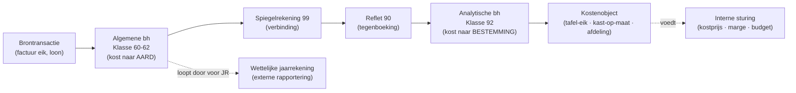

> **Leerstuk — één vraag, helemaal doorgewerkt.** Dit is de entry-fiche voor analytische boekhouding: eerst snappen wát de tweede laag is en hoe ze technisch aansluit op de algemene boekhouding. Welke methode je dan kiest leer je in [[kostprijsmethoden-kiezen]], hoe je ermee beslissingen onderbouwt in [[break-even-en-marginale-beslissing]], en hoe je vooruit budgetteert en achteraf afwijkingen analyseert in [[budget-en-variantieanalyse]]. Voor verhaal en routekaart: [[leerpaden/1-8|minicursus PO 1.8]].

## Antwoord in één blik

De analytische boekhouding herleidt dezelfde euro's uit de algemene boekhouding van **aard** (loon, huur, eikenhout) naar **bestemming** (welk product, welke afdeling, welke klant). Ze is intern bedoeld — niet voor de fiscus — en wettelijk niet verplicht. Er bestaat ook geen "juiste" methode, alleen geschikte voor het doel. Dit leerstuk werkt drie dingen uit: waarom je deze tweede laag opzet, hoe ze technisch koppelt aan klassen 6/7 via klassen 8 en 9, en met welk kostenvocabularium je verder werkt in de volgende leerstukken.

Meridia Meubel BV — een Belgische meubelmaker met twee productlijnen, *tafel-eik* in serie en *kast-op-maat* op order — loopt als rode draad door dit leerstuk en de drie volgende.

---

## Waarom een tweede boekhouding bovenop de algemene?

De algemene boekhouding antwoordt eigenlijk maar op één vraag: *waaraan hebben we geld uitgegeven?* Loon, huur, grondstoffen — netjes verdeeld over klasse 60, 61, 62 enzovoort. Voor de fiscus, de bank en de neergelegde jaarrekening volstaat dat antwoord ruimschoots. Maar zodra je als bedrijfsleider één stap verder wilt — *waaraan precies hebben we het uitgegeven?* — loop je vast.

Neem Meridia. In januari komt een factuur binnen voor 24.000 EUR eikenhout. Die boekt netjes in klasse 600 (aankoop grondstoffen). Voor de externe wereld zit het verhaal daar. Maar de zaakvoerder wil weten: hoeveel van die 24.000 zit straks verstopt in de prijs van één eikenhouten tafel? Hoeveel in een kast-op-maat? En hoeveel verdwijnt in afval of in een mal die je over meerdere series afschrijft? Op die vragen krijg je nooit antwoord uit klasse 60 alleen. Je hebt een tweede laag nodig die diezelfde euro's herverdeelt — niet naar aard, maar naar *bestemming*.

| Vraag | Algemene boekhouding | Analytische boekhouding |
|---|---|---|
| Waaraan geven we geld uit? | Ja — per aard (60, 61, 62, ...) | Ja — per bestemming (tafel, afdeling, klant) |
| Wat kost één tafel-eik? | Nee — alleen totalen | Ja — per kostendrager |
| Welke productlijn is rendabelst? | Nee | Ja — marges per lijn |
| Verplicht? | Ja — WVV + KB-WVV | Nee — vrije keuze |
| Voor wie? | Externe stakeholders | Interne directie |
| Format-vrijheid? | Strikt vastgelegd (BNB-schema) | Volledig vrij |

Vier interne vragen rechtvaardigen typisch de moeite van een analytische laag: prijszetting (kunnen we deze tafel aan 500 EUR aanbieden?), productlijn-rendabiliteit (verdienen we meer op tafels of op kasten?), afdelings-performantie (presteert de productiehal binnen budget?) en budget-opvolging (wijken we af van wat we vooropstelden?). Wie deze vragen niet kan beantwoorden, vliegt blind op de belangrijkste operationele beslissingen.

Belangrijk om vast te leggen: er bestaat **geen wettelijke verplichting** tot analytische boekhouding. Het Belgisch boekhoudrecht eist enkel de algemene boekhouding. Een onderneming *mag* analytisch werken, maar *moet* het niet. De keuze is bedrijfseconomisch — niet juridisch.

> **Samengevat.** De algemene boekhouding is voor de buitenwereld (fiscus, banken, vennoten); de analytische is voor de directie zelf. Twee verschillende publieken, twee verschillende vragen, twee verschillende lagen — gevoed door dezelfde brontransacties.

---

## Het kostenvocabularium — vier hokjes om elke kost in te leggen

Vooraleer je kunt praten over kostprijs, break-even of variantie, moet je elke kost op twee assen kunnen plaatsen. Dat vocabulaire is de gemeenschappelijke woordenschat voor de rest van PO 1.8 — de volgende leerstukken bouwen er op verder.

De eerste as is **gedrag**: hoe reageert de kost op volume? Een kost is *vast* als hij onveranderd blijft of je nu 1 of 10.000 tafels produceert — de huur van Meridia's productiehal (120.000 EUR/jaar) is daarvan het schoolvoorbeeld. Een kost is *variabel* als hij schaalt met de productie — voor elke extra tafel verbruik je 4 kg eik aan 30 EUR/kg, dus 120 EUR extra. Eén tafel meer, 120 EUR meer eikenhout.

De tweede as is **toerekenbaarheid**: kun je de kost zonder verdeelsleutel aan één product hangen? *Direct* betekent dat het verband eenduidig is — die 4 kg eik gaat letterlijk in déze tafel, zonder discussie. *Indirect* betekent dat de kost gedeeld is en je een sleutel moet hanteren om hem te verdelen — de huur van de productiehal dekt tafels én kasten, en er bestaat geen "natuurlijke" verdeelregel.

Wanneer je beide assen combineert, krijg je vier hokjes waarin elke kost zich laat plaatsen:

| | Direct (één productlijn) | Indirect (gedeeld) |
|---|---|---|
| **Variabel** | Eikenhout (tafel) · paneelhout (kast) · directe productie-uren | Energie CNC · verbruiksgoederen (boren, lak) |
| **Vast** | Afschrijving CNC-mal voor tafel-serie (indien gebruikt) · supervisor specifiek voor kast-atelier | Huur productiehal · afschrijving CNC · algemeen beheer · directie-loon · marketing |

Concreet voor Meridia: *energie CNC* is variabel én indirect — schaalt met machine-uren, maar wordt verbruikt door tafels én kasten naargelang welke job draait. *Eik voor tafels* is variabel én direct — schaalt met productie en gaat onmiskenbaar in één tafel. *Algemeen beheer* (directie, IT, marketing) is vast én indirect — onveranderd ongeacht volume en niet logisch aan één productlijn te hangen.

Onthoud deze matrix: hij bepaalt straks in [[kostprijsmethoden-kiezen]] welke kosten je waar verdeelt. *Full costing* pakt alle vier de cellen en verdeelt ze over de producten. *Direct costing* trekt alleen de variabele rij in de kostprijs. *ABC* ontmaskert binnen de indirect-vaste cel een cross-subsidie door bijvoorbeeld de setup-kosten apart te poolen.

> **Arbeid verdient een aparte vermelding.** Personeelskost kan in elk van de vier hokjes vallen, afhankelijk van het beloningssysteem en de toewijzing. Een afwerker die enkel aan de tafel-serie werkt en vast in dienst is, levert vast + direct werk. Een uitzendkracht voor één kast-job betaald per gewerkt uur is variabel + direct. De productieleider die zowel tafels als kasten superviseert op een vast loon is vast + indirect. Een variabele premie bovenop het uurloon voor alle productieuren is variabel + indirect. De boekhoudkundige hefboom is *tijdregistratie*: zonder uren-per-product wordt arbeid noodgedwongen indirect; mét tijdregistratie kan je dezelfde euro's recht toewijzen aan een product. Voor het volledige loonkost-mechanisme (klasse 62, RSZ, voordelen alle aard) zie [[personeelskosten]].

---

## Hoe koppelt de analytische sfeer aan de algemene? — klassen 8/9 en spiegelrekeningen

Een tweede boekhouding is alleen nuttig als ze *zonder divergentie* aansluit op de eerste. Anders krijg je twee waarheden die uit elkaar drijven en niemand nog vertrouwt. Het Belgisch genormaliseerd rekeningenstelsel lost dit elegant op door **klassen 8 en 9** specifiek te reserveren voor de analytische sfeer — los van klassen 0 tot 7 die de algemene boekhouding bezetten. Wie de tweede laag binnen hetzelfde rekeningenstelsel wil voeren, krijgt zo een aparte ruimte zonder de algemene boekhouding te storen.

Het mechanisme heet **spiegelrekening**. De CBN-aanbeveling schrijft het zo voor: elke kost in klasse 60-62 krijgt een tegenboeking in klasse 90 (de zogenaamde *reflet*), die meteen wordt doorgeboekt naar een klasse 92 (afdeling) of een kostenobject-rekening. Een spiegelrekening 99 sluit de loop en maakt de aansluiting met klasse 6 verifieerbaar. Bekijk wat er gebeurt met die 24.000 EUR eik van Meridia:

**Boeking — aankoop eikenhout 24.000 EUR**

*Algemene boekhouding — kost naar aard*

|  | MAR | Omschrijving | Debet | Credit |
|---|---|---|---:|---:|
|  | 600 | Aankoop grondstoffen (eik) | 24.000 |  |
| aan | 440 | Leveranciers |  | 24.000 |

*Analytische boekhouding — spiegel + bestemming (twee stappen)*

|  | MAR | Omschrijving | Debet | Credit |
|---|---|---|---:|---:|
|  | 90 | Reflet kosten (tegenboeking spiegel) | 24.000 |  |
| aan | 99 | Spiegelrekening algemene boekhouding |  | 24.000 |
|  | 92 | Kosten productiehal (toegerekend aan tafel-eik) | 24.000 |  |
| aan | 90 | Reflet kosten |  | 24.000 |

*Eenheid: EUR.*

Drie sleutelpunten om vast te leggen. Eén: klasse 6 loopt onveranderd door voor de wettelijke jaarrekening — de eerste boeking volstaat voor fiscus en BNB. Twee: klasse 9 voegt de bestemming toe — die 24.000 EUR landt nu expliciet "in de productiehal, op de tafel-eik-job". Drie: het saldo van rekening 90 wordt na de tweede stap nul (24.000 debet, 24.000 credit), terwijl het saldo van rekening 99 het totale spiegel-volume bijhoudt — controleerbaar tegen het totaal van klasse 6.

Belangrijk om correct te framen: klassen 8 en 9 zijn een **infrastructuur**, geen methode. De keuze om binnen het rekeningenstelsel analytisch te werken is een keuze voor *waar* je de cijfers houdt. De methode — full costing, direct costing, ABC, standaardkosten — zit in *wát* je in klasse 92 boekt en hoe je de kosten over kostenobjecten verdeelt. Dat onderscheid komt terug in het volgende leerstuk. Bovendien is klasse 8/9 niet wettelijk opgelegd: een onderneming mag haar analytische boekhouding evengoed in een ERP-module of een spreadsheet voeren, naast klassen 0 tot 7.

---

## Drie registratiesystemen — welke kiest een onderneming?

Eens je weet dát je analytisch wilt werken, blijft de vraag *waar* je de cijfers houdt. Die ondernemingskeuze heeft praktische gevolgen voor opzet, aansluiting en rapporteringssnelheid. Er bestaan drie klassieke patronen.

| Systeem | Hoe werkt het? | Voor | Tegen |
|---|---|---|---|
| **Niet-geïntegreerd (autonoom)** | Analytische bh in aparte ERP-module of spreadsheet, los van klassen 6/7. Maand-aansluiting verplicht. | Volledige analytische vrijheid · geen impact op wettelijke JR · geschikt voor pilots en kleine entiteiten | Reconciliatie-werk elke maand · risico op divergentie tussen beide systemen |
| **Gespiegeld (klassen 8/9 met spiegelrekeningen)** | Volwaardige analytische boekhouding in klassen 8/9 — elke kost in klasse 6 krijgt tegenboeking in klasse 9 via spiegelrekening 99. | Eén audit-trail: zelfde brontransacties feeden beide sferen · conform CBN-aanbeveling · schaal-bestendig | Initiële opzet vraagt boekhoudkundige expertise · extra codering bij elke kost-input |
| **Geïntegreerd** | Eén grootboek waar elke kost-boeking tegelijk algemeen + analytisch wordt verwerkt — vaak via verplichte analytische codering in ERP. | Geen aansluiting nodig — cijfers per definitie consistent · real-time analytische rapportering | Zware rekeningenstructuur (dubbele code per transactie) · minder flexibel voor ad-hoc analyses |

Voor Meridia is de keuze gevallen op het **gespiegelde systeem**. Het is een middelgrote BV met groeiplannen, een functionerend ERP (PackHouse Suite) en de wens om audit-friendly te werken. Een spreadsheet-aanpak zou niet meer meekunnen met het volume; een volledig geïntegreerd grootboek is alleen rendabel bij veel hogere productie-volumes of zware regulatoire druk. De maandelijkse periodeafsluiting bevat de aansluiting analytisch ↔ algemeen.

Een vaak gemiste nuance: kleine ondernemingen kunnen perfect met een spreadsheet-aanpak werken — zolang de aansluiting met klasse 6 maandelijks gebeurt. De zwaarste opzet is niet automatisch de beste; ze is alleen rendabel waar volume en regulatoire eisen het rechtvaardigen.

> **Aansluiting analytisch ↔ algemeen.** Bij elk systeem behalve het volledig geïntegreerde moet je periodiek (typisch maandelijks) reconciliëren: totaal analytische kosten = totaal klasse 6 + zogenaamde *incorporatieverschillen*. Twee soorten verschillen kunnen logisch optreden. Bepaalde algemene kosten zijn **niet-incorporeerbaar** omdat ze niet relevant zijn voor de productkost — denk aan uitzonderlijke kosten (klasse 66) of financiële kosten (klasse 65) die je nooit aan een tafel of kast wilt toerekenen. Omgekeerd kunnen er analytische **bijkomende** kosten worden ingevoerd die niet in klasse 6 staan — bijvoorbeeld een opportunity-kost voor de inzet van eigen kapitaal, intern relevant maar zonder factuur. Examen-valkuil: de aansluiting hoeft *niet* tot op de euro te kloppen — wel materieel. Een afwijking van 0,5 % op een productie-batch is normaal aanpassingswerk; meer dan 5 % is een rood signaal dat onderzoek vraagt.

---

## Wat zie je als alles draait? — twee verhalen over dezelfde euro

Na een correct opgezet analytisch systeem heeft Meridia op elk moment **twee verhalen** over dezelfde 24.000 EUR eikenhout uit januari. Beide zijn waar, beide zijn nodig, geen vervangt de andere.

Het eerste verhaal komt uit de algemene boekhouding: "we hebben in januari voor 24.000 EUR grondstoffen aangekocht (klasse 600)." Dat verschijnt netjes in de resultatenrekening onder kosten naar aard. De fiscus, de bank, de aandeelhouders en de BNB zien dat verhaal — meer hebben ze niet nodig om de externe positie van de onderneming te beoordelen.

Het tweede verhaal komt uit de analytische boekhouding: "die 24.000 EUR is gegaan naar 800 kg eik die in januari verbruikt is in de productiehal voor 200 eenheden tafel-eik = 120 EUR materiaal per tafel." Dat verschijnt nergens in de externe jaarrekening — wel in de kostprijscalculatie die straks de prijszetting onderbouwt, het budget alimenteert en de portfolio-discussie scherpstelt.

Hetzelfde geld, twee leesrichtingen. De externe wereld wil weten of de onderneming financieel gezond is en de regels respecteert; de directie wil weten waar het geld naartoe vloeit en welke productlijnen het hardst werken voor het resultaat. Een goed opgezette analytische boekhouding levert beide verhalen uit dezelfde brontransacties — zonder dat ze elkaar tegenspreken.

In [[kostprijsmethoden-kiezen]] leer je *welke techniek* je gebruikt om dat tweede verhaal te bouwen. Vier methodes naast elkaar, elk met een eigen doel en eigen sterktes en zwaktes — toegepast op exact dezelfde Meridia-cijfers.

---

## Wanneer je dit snapt, ga dan naar

- [[kostprijsmethoden-kiezen]] — Welke kostprijsmethode kies je voor welk doel? Vier methodes (full · direct · ABC · standaard) naast elkaar uitgewerkt op Meridia.
- [[break-even-en-marginale-beslissing]] — Hoe gebruik je de kostenstructuur om concrete beslissingen te onderbouwen (special order, make-or-buy, productmix)?
- [[budget-en-variantieanalyse]] — Hoe bouw je een masterbudget en hoe analyseer je achteraf de afwijkingen?
- [[themafiches/analytische-boekhouding-stelsel|Themafiche Analytische boekhouding — stelsel]] — voor herhaling vlak vóór het examen: kapstok met klassen 8/9 + drie registratiesystemen + kostentypologie.

## Doorklik naar concepten

Voor wie definitorisch detail wil opzoeken:

- [[analytische-boekhouding]]
- [[bedrijfskosten]] · [[bedrijfsopbrengsten]]
- [[personeelskosten]]

---

## Wettelijk fundament

- Boekhoudplicht — algemene boekhouding: Wetboek van Economisch Recht Boek III art. III.82 t.e.m. III.95 + KB van 29 april 2019 (KB-WVV). Het Belgisch boekhoudrecht eist een algemene boekhouding voor elke boekhoudplichtige onderneming. Analytische boekhouding wordt *niet* verplicht — alleen aanbevolen voor interne sturing.
- Minimum algemeen rekeningenstelsel (MAR) — klassen 8 en 9: KB van 21 oktober 2018 (MAR). Het MAR reserveert klassen 8 (analytische resultaten) en 9 (analytische rekeningen) voor de interne sfeer. Het stelt het *gebruik* niet verplicht; het stelt enkel ter beschikking voor wie analytisch wil werken binnen één geïntegreerd rekeningenstelsel.
- Spiegelrekening-mechaniek (klassen 8/9): CBN-advies 132/7 (boeking en waardering van voorraden) — beschrijft expliciet de optie van een analytische boekhouding in klassen 8 en 9 met "verbindingsrekeningen — zogenaamde spiegelrekeningen — op de structuur van de algemene boekhouding gebaseerd".
- Voorraadwaardering — invloed van kostprijsmethode: KB-WVV (aanschaffingswaarde en waarderingsmethodes) + CBN-advies 132/7. Voor de *wettelijke* jaarrekening moeten productiekosten in voorraad gewaardeerd worden volgens een full-costing-redenering — vaste productie-overhead hoort in de voorraadwaarde. Direct costing mag intern, niet voor de neergelegde JR.

---

*Leerstuk PO 1.8 — lstk 1 van 4. Status: voorgesteld.*
