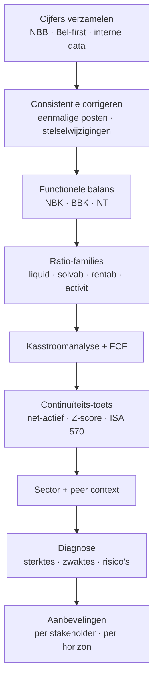

> **Leerstuk — één vraag, helemaal doorgewerkt.** Dit is het integratie-leerstuk van PO 1.9. De vorige drie leerstukken behandelden afzonderlijke stukken — werkkapitaal, krediet, continuïteit. Hier breng je alles samen tot één diagnose-rapport waar een lezer mee aan de slag kan. Lees dit nadat je de andere drie hebt verteerd. Voor verhaal en routekaart: [[leerpaden/1-9|minicursus PO 1.9]].

## Antwoord in één blik

Een financiële diagnose is een gestructureerd oordeel over de financiële gezondheid van een onderneming, met sterktes, zwaktes, risico's en aanbevelingen. Het is meer dan een ratio-overzicht en iets anders dan een audit-rapport: het is het eindproduct waarin je alle deelanalyses synthetiseert tot één verhaal voor wie moet beslissen.

Je werkt vijf bouwstenen af in vaste volgorde. (1) **Data-discipline**: bronnen kiezen en consistentie waarborgen. (2) **Consistentie corrigeren**: eenmalige posten, stelselwijzigingen, reclassificaties uitfilteren. (3) **Vier analyse-lagen**: functionele balans, ratio-families, kasstroom met vrije kasstroom, continuïteit met Z-score. (4) **Sector- en peer-context**: ratio's krijgen pas betekenis ten opzichte van de mediaan en het eerste kwartiel van vergelijkbare bedrijven. (5) **Synthese** in een financiële SWOT, gevolgd door aanbevelingen per stakeholder (bestuur, bank, aandeelhouder) en per horizon (Q1, 12 maanden, 24 maanden). Het rapport eindigt met een executive summary van maximaal één pagina — vaak het enige wat de bestuurder daadwerkelijk leest.

Dezelfde feiten leveren drie verschillende actieplannen op, afhankelijk van wie je bent. De **adviseur-analist** levert een rapport met aanbevelingen aan de cliënt. De **CFO-intern** gebruikt de diagnose als stuur-document voor herstel. De **commissaris** integreert de bevindingen in zijn controleverklaring. Belmonte 2025 is in alle drie de gevallen hetzelfde verhaal — een onderneming in distress-trend met een herstel-pad dat mogelijk maar urgent is — maar de acties die eruit volgen zijn telkens anders.

We werken de template stap voor stap door op Belmonte Industries — een familiale NV in onderaanneming machinebouw met 65 werknemers — en sluiten af met een voorbeeld-template voor de executive summary die je letterlijk kan hergebruiken.

---

## Stap 1 — Data-discipline en bronnen

Een diagnose is zo goed als haar data. Vier kanalen die je systematisch combineert.

**Officiële neerleggingen** vormen je vertrekpunt. Elke Belgische vennootschap legt haar jaarrekening neer bij de Balanscentrale van de Nationale Bank van België — je vindt daar gratis de balans, resultatenrekening, toelichting en sociale balans per onderneming. Voor één bedrijf werkt dat opzoekvenster prima; wil je peer-vergelijkingen, dan stap je over op een betaald abonnement zoals Bel-first of Trends Top dat de neergelegde data verrijkt met sector-medianen en peer-statistieken.

**Sectorrapporten** geven je het ijkpunt. Trends Top, Febiac voor automobielsector, Comeos voor retail, of branche-federaties publiceren benchmarks voor omzet-mediaan, marges, werkkapitaalcyclus, schuldgraad. De NACE-code van de onderneming is je zoeksleutel — voor Belmonte is dat NACE 25.62 (verspanende metaalbewerking voor derden).

**Kredietwaardigheid-databanken** zoals Belfius Companyweb, Graydon en Creditsafe leveren scoring plus alerts: faillissements-waarschuwingen, gepubliceerde protesten of niet-betalingen. Snel een check op "wie zijn eigenlijk de tegenpartijen van mijn cliënt?".

**Interne data** ten slotte vul je rechtstreeks bij de cliënt op. Vaak loopt de actuele boekhouding ettelijke maanden voor op de laatst gepubliceerde jaarrekening; je hebt een twaalfmaands-cashflow-prognose nodig, een overzicht van openstaande facturen per klant, en de actuele stand van de RSZ- en btw-rekening — die laatste is een early-warning-indicator die niet uit jaarrekeningen blijkt.

> **Wat als de cliënt zelf de NBB-data niet vertrouwt?** De Balanscentrale toont wat de onderneming heeft neergelegd — dat is dus de waarheid die zij zelf heeft gecommuniceerd. Twijfels over die cijfers zijn een audit-vraag, geen diagnose-vraag. Voor de diagnose werk je verder met de cijfers zoals neergelegd, en signaleer je discrepanties als observatie. Voor verdere doorklik: [[financiele-analyse-software]].

---

## Stap 2 — Consistentie corrigeren

Ruwe cijfers zijn zelden vergelijkbaar. Drie soorten correcties verdien je voor je trends interpreteert.

**Eenmalige posten** zijn de bekendste valkuil. Een onderneming verkoopt in 2024 een vastgoed met een meerwaarde van 300 k EUR. Het bedrijfsresultaat van 2024 ziet er prachtig uit; de drie-jarige trend lijkt sterk. Voor diagnose normaliseer je 2024 door die 300 k uit te sluiten — dan blijkt de onderliggende trend dalend in plaats van stijgend. Hetzelfde geldt voor uitzonderlijke voorzieningstoevoegingen, herstructureringskosten en eenmalige fiscale meevallers.

**Stelselwijzigingen** verstoren de trend op een subtielere manier. Een onderneming verlengt haar afschrijvingstermijn voor machines van 5 naar 10 jaar — de jaarlijkse afschrijving halveert, het bedrijfsresultaat stijgt, en de trend wijst plots omhoog. Dat is geen operationele verbetering. Lees altijd de toelichting bij de jaarrekening om stelselwijzigingen op te sporen.

**Reclassificaties** ten slotte: een herpresentatie van rubrieken kan een schijn-trend creëren. Wanneer een onderneming voorzieningen voor sociaal passief verschuift van rubriek IV (korte schulden) naar rubriek II (voorzieningen), verbeteren de liquiditeitsratio's zonder dat er iets aan de werkelijke situatie veranderd is.

Voor Belmonte vind je geen grote eenmalige posten in de drie boekjaren. Wel een nuance: de voorzieningen stijgen van 120 naar 150 k EUR over 2024-2025. Die toename van 30 k is gedeeltelijk technisch (sociaal passief stijgt mechanisch met de loondrift — geen managementsignaal) en gedeeltelijk discretionair (garantie-voorzieningen die het management bewust opbouwt). Voor het "echte" bedrijfsresultaat moet je die 30 k niet zomaar volledig corrigeren — splits het bedrag tussen normaal en discretionair, of vermeld de onzekerheid in je rapport.

> **Consistentie-correctie is geen audit.** Je leest waarderingsregels, maar je hertest ze niet. De techniek van jaarrekening-analyse hoort thuis in PO 1.3; de audit-vereisten in PO 1.6. Hier draait het om analyse-discipline — voorkomen dat je trends rapporteert die door boekhoudkundige keuzes vertekend zijn.

---

## Stap 3 — Vier analyse-lagen samenbrengen

Een diagnose-rapport bevat vier deelanalyses, in vaste volgorde. Elke laag bouwt op de vorige: de functionele balans zegt iets over structuur, de ratio's leggen de relaties bloot, de kasstroom toont of de winst écht cash genereert, en de continuïteits-toets vertaalt alles naar overlevingskans. Voor Belmonte 2025 ziet het beeld er als volgt uit.

| Laag | Wat meet het? | Belmonte 2025 — kerncijfer |
|---|---|---|
| 1. Functionele balans | Structureel financierings-evenwicht | NT −530 k → structurele kasovertrek |
| 2. Ratio-families | Vier dimensies (liquiditeit, solvabiliteit, rentabiliteit, activiteit) | Alle vier onder sector-mediaan + verslechterend |
| 3. Kasstroom + FCF | Cashgeneratie + investerings-capaciteit | FCFF −390 → geen vrije cash voor financiering |
| 4. Continuïteit + predictie | Risico op faillissement 1-2 jaar | Z-score 2,16 (grey zone), 4 ISA 570-indicatoren oplichten |

### Laag 1 — Functionele balans

De functionele balans van Belmonte (zie het werkkapitaal-leerstuk voor de techniek) toont een **netto bedrijfskapitaal** (NBK) van 510 k EUR, een **behoefte aan bedrijfskapitaal** (BBK) van 1.040 k EUR en een **nettothesaurie** (NT) van −530 k EUR. Lees je de drie jaartallen samen, dan zie je dat het NBK licht krimpt (van 600 in 2023 naar 510 in 2025), het BBK explodeert (van 730 naar 1.040), en de NT ineenstort (van −130 naar −530). De diagnose volgt mechanisch: de operationele cyclus vreet meer werkkapitaal op dan vroeger, en de onderneming financiert dat extra werkkapitaal met toenemende kortlopende bank-afhankelijkheid. Voor de interventie-laag: zie [[werkkapitaalbeheer-en-financieringskeuzes]].

### Laag 2 — Ratio-families (lees per familie en integreer)

Vier families, telkens in vergelijking met de sector-mediaan voor NACE 25.62.

**Liquiditeit** — current ratio 1,26 (sector 1,45), quick ratio 0,69 (sector 1,05), cash ratio 0,04 (sector 0,18). Alle drie onder de mediaan en dalend over drie jaar. De acid test onder 1 betekent: zonder voorraad-realisatie kan de kortlopende schuld niet gedekt worden. Belmonte is afhankelijk van blijvende afzet van haar voorraad — dat is een risico als de hoofdklanten verder pruttelen.

**Solvabiliteit** — eigen vermogen op totaal vermogen 31 % (sector 42 %), interest coverage 0,09 (sector 6,5). De interest coverage onder 1 is het meest ernstige cijfer in heel het dossier: de bedrijfswinst dekt zelfs de rentelast niet meer. Mechanisch betekent dat: elk volgend boekjaar zonder margeherstel teert in op het eigen vermogen.

**Rentabiliteit** — EBIT-marge 0,1 % (sector 5,8 %), ROE −6,2 % (sector 9,2 %), ROA 0,2 % (sector 7,1 %). Drie jaar van marge-compressie, en in 2025 quasi break-even op operationeel niveau gevolgd door een netto-verlies van 100 k EUR. De EBIT-marge ligt **5,7 procentpunt onder de sector-mediaan** — dat is geen kleine afwijking, dat is een sectoraal-veelzeggend signaal.

**Activiteit** — DSO 70 dagen (sector 50), DPO 70 dagen (sector 55), DIO 75 dagen (sector 60), cash conversion cycle 75 dagen (sector 55). De CCC is verlengd van 36 naar 75 dagen in twee jaar tijd. Dat is grotendeels gedreven door klanten die hun betalingstermijnen oprekken (Belmonte's twee hoofdklanten gingen van 60 naar 90 dagen) en door voorraad-traagheid die wijst op slow movers in halffabricaten.

Integratie: vier zwakke families tegelijk wijzen op een **systemisch probleem**, geen seizoens-uitschieter. Een onderneming kan tijdelijk zwak presteren op één familie zonder dat het structureel iets betekent; als alle vier familias tegelijk dalen, is dat de definitie van een bredere distress-trend.

### Laag 3 — Kasstroom en vrije kasstroom

De kasstroomanalyse 2025 toont het verhaal in cash. De bedrijfscashflow-proxy bedraagt 210 k EUR (nettoresultaat −100 + afschrijvingen 280 + voorzieningen 30) — op zich positief. Maar de werkkapitaal-mutaties slokken die proxy volledig op: voorraadstijging 250, vorderingenstijging 180, gedeeltelijk gecompenseerd door schuldenstijging 200. De **operationele kasstroom** komt uit op −20 k EUR — feitelijk nul.

Investeringen voor vervangings-CAPEX bedragen 400 k EUR (verminderd met 30 k EUR desinvestering oud machinepark): **investerings-kasstroom −370**. Resultaat: de **vrije kasstroom voor de onderneming** (FCFF) is −390 k EUR. Belmonte genereert geen cash om haar groei of haar financiering te dekken.

Hoe rolt dat tekort in de financiering? Nieuwe lange-termijnschuld 390 en een uitbreiding van de kasovertrek met 230 financieren het tekort. **Bank-afhankelijkheid groeit dus structureel** — precies wat je niet wil zien.

Een laatste cijfer dat het verhaal sluit: de **debt service coverage ratio** (DSCR) van 2025 op basis van bestaande aflossingen alleen al is 210 / 310 = 0,68. Belmonte kan haar bestaande schuldenlast zelfs zonder nieuw krediet niet meer dekken uit eigen cash. Voor de uitwerking van een nieuwe kredietaanvraag: zie [[kredietbeoordeling-en-kasstroomprognose]].

### Laag 4 — Continuïteit en faillissementspredictie

De Altman Z-score van Belmonte voor 2025 komt uit op **2,16**, met een dalende trend (2,95 in 2023, 2,55 in 2024). Dat plaatst de onderneming in de **grey zone** (1,81 < Z < 2,99) — verhoogd risico op faillissement binnen 1-2 jaar, geen acute distress, wel gerechtvaardigde monitoring.

De auditing-standaard voor going concern (ISA 570, behandeld in PO 1.6) bevat een lijst van indicatoren die een continuïteitsrisico signaleren. Voor Belmonte lichten er **vier financiële indicatoren** op: negatieve operationele kasstroom, dalende winstgevendheid, verslechterende ratio's, en groeiende afhankelijkheid van kortlopende financiering. Daarnaast één **niet-financiële indicator**: extreme klant-concentratie (60 % van de omzet bij 2 klanten). Voor de wettelijke kant en de Z-score-techniek: zie [[continuiteit-en-faillissementspredictie]].

De netto-actief-toets toont dat Belmonte met een netto-actief van 1.610 k EUR ruim boven de wettelijke alarmprocedure-drempel zit (helft van het kapitaal = 250). Geen acute trigger in 2025 dus. Maar projecteer je de verlies-trend voort (−100 in 2025, vergelijkbaar in 2026), dan komt de drempel tegen 2030 in zicht. Dat moet het bestuursorgaan signaleren in het jaarverslag onder de rubriek risico's en onzekerheden.

---

## Stap 4 — Sector- en peer-context

Een diagnose zonder sectorcontext mist de helft van haar betekenis. Een EBIT-marge van 0,1 % is dramatisch — maar wat is normaal in onderaanneming machinebouw? Sector-mediaan EBIT-marge voor NACE 25.62 ligt op 5,8 %. Belmonte zit dus 5,7 procentpunt onder de mediaan. **Dat** is het cijfer dat overtuigt in een rapport — niet de 0,1 % op zich, maar de afstand tot wat normaal zou zijn.

Een tweede aandachtspunt: niet alle posten met de mediaan vergelijken. Voor een zwakkere onderneming gebruik je **kwartielen**. Het eerste kwartiel (Q1) is de zwakste 25 % van de peer-set. Belmonte 2025 zit op of onder Q1 voor alle vier de families.

| Indicator | Belmonte 2025 | Sector-mediaan | Sector Q1 (zwakste 25 %) | Positie |
|---|---:|---:|---:|---|
| EBIT-marge | 0,1 % | 5,8 % | 2,0 % | Onder Q1 |
| Solvabiliteit | 31 % | 42 % | 28 % | Net boven Q1 |
| Current ratio | 1,26 | 1,45 | 1,05 | Tussen Q1 en mediaan |
| DSO (dagen) | 70 | 50 | 65 | Onder Q1 (slechter dan zwakste kwartiel) |

Daarnaast geef je in een diagnose-rapport altijd **macro-context** mee. De energieprijzen van 2022-2024 raakten de hele sector, niet alleen Belmonte. De werkkapitaalverlenging door de OEM-klanten is sectorbreed — dezelfde grote klanten hanteren dezelfde betaalpolitiek bij andere leveranciers. Dat verzacht het oordeel: een deel van de zwakte is sectoraal en niet specifiek Belmonte.

Maar je voegt er meteen het tegen-oordeel aan toe: Belmonte is in twee jaar tijd verschoven van Q2 (boven mediaan) in 2023 naar onder Q1 in 2025. Die **relatieve achteruitgang ten opzichte van peers** suggereert dat de concurrentie-positie zelf verzwakt, niet alleen de sector als geheel. Concurrenten weerstaan blijkbaar dezelfde macro-druk beter — dat is het echte rode signaal.

---

## Stap 5 — Synthese in financiële SWOT

Een SWOT zet je bevindingen om in een actie-getuigend formaat. Vier kwadranten: sterktes en zwaktes (intern, nu) plus kansen en bedreigingen (extern, toekomst).

|  | **Intern (nu)** | **Extern (toekomst)** |
|---|---|---|
| **Positief** | **Sterktes**: vakkennis 65 FTE met lange anciënniteit · klant-relaties >15 jaar met OEM's · eigen gebouw zonder hypotheek · technisch park modern (CNC < 8 jaar) · groene profilering via deelneming in Belmonte Energy CV | **Kansen**: nieuwe energie-efficiënte CNC-cel zou opex 80-120 k EUR/jaar reduceren · gesprekken voor 3de klant gestart · mogelijkheid van factoring-partnership met huisbank |
| **Negatief** | **Zwaktes**: extreme klant-concentratie (60 % bij 2) · werkkapitaal-spanning · geen externe aandeelhouders · familiale opvolging niet geregeld (Marc 62) | **Bedreigingen**: OEM-DSO-verlenging zou kunnen doortrekken naar 110 dagen · Oost-Europese concurrentie blijft prijsdruk uitoefenen · administratieve last EU-CBAM vanaf 2026 |

Twee dingen om vast te houden bij het schrijven van een SWOT. **Concreet** is beter dan abstract: "vakkennis" zonder cijfers is een wensdroom; "65 FTE met gemiddelde anciënniteit 12 jaar" is een sterkte die overtuigt. En **balans** is belangrijker dan symmetrie: een SWOT met evenveel sterktes als zwaktes om te tonen dat je "objectief" bent vertekent het verhaal. Voor Belmonte zijn er meer zwaktes/bedreigingen dan sterktes/kansen — en dat hoort dan ook zo in het rapport te staan.

---

## Stap 6 — Aanbevelingen per stakeholder en per horizon

Een diagnose zonder aanbevelingen is een diagnose-rapport, geen advies. Twee dimensies maken aanbevelingen bruikbaar: per **stakeholder** (welke actor kan deze actie ondernemen?) en per **horizon** (Q1 nu, 12 maanden, 24 maanden).

| Stakeholder | Q1 2026 | 12 maanden | 24 maanden |
|---|---|---|---|
| **Bestuur** | Factoring opstarten · voorraad-audit · RSZ-betalingsplan onderhandelen · commissaris betrekken | Herstel-plan formaliseren en uitvoeren | Beleid-update: klant-diversificatie + opvolgings-vraag |
| **Bank** | Quarterly monitoring-rapport afspreken | Kasovertrek consolideren in lange-termijn-krediet (eventueel met staatswaarborg Gigarant) | Investeringskrediet bespreken onder voorwaarden van herstel |
| **Aandeelhouders (Marc + Peter)** | Bespreking herstel-plan + persoonlijk engagement | Kapitaal-inbreng 200-300 k EUR beslissen | Opvolgings-vraag adresseren (externe directie of familiale verkoop) |

**Aanbevelingen aan het bestuur** zijn de meest concrete: factoring opstarten omdat de DSO-impact onmiddellijk is; een voorraad-audit en slow-mover-uitverkoop binnen twee maanden; RSZ-betalingsplan onderhandelen om de early-warning-flag weg te halen; en de commissaris vroeg betrekken in de presentatie van het herstel-plan zodat going-concern-monitoring in dialoog gebeurt en niet ex-post als een verrassing.

**Aanbevelingen aan de bank** mikken op gefaseerde aanpak. Eerst de kasovertrek consolideren in een lange-termijn-krediet — die conversie alleen al verbetert de structurele financierings-positie. Een investeringskrediet voor de nieuwe CNC-cel wachten tot de operationele cashflow op 350 k EUR of meer terug staat. Daartussen quarterly monitoring afspreken zodat de bank niet voor verrassingen komt te staan.

**Aanbevelingen aan de aandeelhouders** raken de fundamentele governance-vraag. Een kapitaal-inbreng van 200-300 k EUR zou meteen meerdere ratio's herstellen en de bank een signaal van engagement geven. De opvolgings-vraag — Marc is 62, geen externe directie — moet binnen het herstel-traject worden bekeken; eventueel via een family office of een gefaseerde verkoop aan een strategische partner.

Eén kernregel: aanbevelingen rangschikken naar urgentie maal impact. Niet twaalf acties op tafel leggen — drie tot vijf met duidelijke prioriteit. De bestuurder die door je rapport bladert moet kunnen zeggen: "OK, deze drie dingen doen we eerst."

---

## Drie rol-perspectieven op de Belmonte-diagnose

Dezelfde feiten, drie verschillende acties, naargelang wie je bent.

### Adviseur-analist (extern boekhouder of accountant)

Je produceert het diagnose-rapport, presenteert het aan het bestuur en eventueel mee aan de bank. Je hebt **geen beslissings-bevoegdheid** — wel professionele aansprakelijkheid voor de kwaliteit van je advies. De ITAA-deontologie eist zorgvuldigheid bij financieel advies: een onvolledige analyse of een aanbeveling zonder onderbouwing kan tot aansprakelijkheid leiden.

Concrete deliverables: rapport opleveren binnen vier weken, structuur volgens de template hierboven, executive summary van maximaal één pagina, eventueel een mondelinge debriefing aan het bestuur en optioneel een meeting met de bank-relatiebeheerder om het herstel-plan toe te lichten.

### CFO of boekhouder-intern (binnen Belmonte zelf)

Je gebruikt de diagnose als sturings-document. Je voert het herstel-plan uit, monitort werkkapitaal-KPI's wekelijks (DSO, voorraad-omloopsnelheid, RSZ-saldo) en rapporteert maandelijks aan het bestuur. Je coördineert met de externe partners: factoring-firma voor de DSO-versnelling, fiscalist voor de RSZ-onderhandeling, bank voor het quarterly monitoring-overleg.

De bestuursorgaan-zorgvuldigheidsplicht hangt hier samen: een diagnose-rapport dat continuïteits-risico signaleert vraagt om een **geactualiseerd herstel-plan**. Niet-actie na ontvangst van zo'n rapport kan een grove fout opleveren — net het soort onzorgvuldigheid waar bestuurders persoonlijk voor aansprakelijk kunnen worden gesteld. Het rapport zelf wordt daarmee een **handeling-uitlokkend document** voor de bestuurder.

### Commissaris (verplicht bij Belmonte sinds 2024 wegens 50-werknemers-drempel)

Je integreert de continuïteits-bevinding in je controleverklaring. De going-concern-procedure uit ISA 570 doorloop je formeel: je vraagt het bestuursorgaan om een schriftelijke continuïteits-beoordeling, je beoordeelt de redelijkheid van de gehanteerde hypotheses, je overweegt een material-uncertainty-paragraaf in de controleverklaring en je leest het jaarverslag-deel van het bestuursorgaan kritisch op consistentie met je eigen bevindingen.

Belangrijk: niet de CFO geeft het externe "going-concern-stempel", maar de commissaris — binnen de grenzen van wat auditing-zekerheid kan dragen. En een commissaris die operationeel advies zou geven voor het herstel-plan, raakt zijn **onafhankelijkheid** kwijt; de rol-grens met de adviseur-analist is hier vergrendeld door deontologie.

---

## Executive summary — wat staat op pagina 1?

Het volledige rapport kan twintig tot vijftig pagina's tellen met alle berekeningen, tabellen en cross-references. Maar de bestuurder leest **pagina 1** — de executive summary — en bladert hoogstens naar de aanbevelingen-sectie. De executive summary is daarom de kerncontent: maximaal één pagina, zelfstandig leesbaar, met een vaste vijfdelige structuur.

> **Voorbeeld-executive summary voor Belmonte 2025** (te hergebruiken als template — pas de cursieve passages aan voor jouw cliënt).
>
> **Diagnose.** *Belmonte Industries NV* vertoont een structureel verzwakkende financiële positie: werkkapitaal-stress, krimpende marges en groeiende bank-afhankelijkheid. De Z-score zit in de grey zone met dalende trend over drie boekjaren. Er is geen acute alarmprocedure-trigger, wel een verhoogd risico op continuïteits-problemen binnen 1-2 jaar zonder ingreep.
>
> **Sterktes.** Vakkennis-stabiel personeel (65 FTE, lange anciënniteit), langetermijn-klantrelaties met twee OEM's, eigen gebouw zonder hypotheek, technisch park modern.
>
> **Zwaktes en risico's.** Klant-concentratie 60 % bij twee klanten · cash conversion cycle 75 dagen tegenover sector 55 · EBIT-marge 0,1 % tegenover sector 5,8 % · interest coverage onder 1 · RSZ-achterstand 90 k EUR · familiale opvolging niet geregeld.
>
> **Aanbevelingen — top drie.** (1) Factoring opstarten en voorraad afbouwen in Q1 2026. (2) Herfinanciering van de kasovertrek naar een lange-termijn-krediet binnen H1 2026, eventueel met staatswaarborg. (3) Aandeelhouders-inbreng van 200-300 k EUR beslissen in H2 2026.
>
> **Vervolg.** Quarterly monitoring afspreken met de huisbank · herstel-plan-presentatie aan het bestuursorgaan en de bank in Q1 · vervolg-diagnose over 12 maanden om voortgang te meten.

De structuur is vast, de inhoud past zich aan. Wie deze vijf paragrafen leest, weet wat er aan de hand is, wat sterk is, wat er moet gebeuren en hoe het verder gaat. Dat is genoeg om in een bestuursvergadering een beslissing te nemen — en dat is precies het doel.

---

## Drie valkuilen

**Valkuil 1 — te veel cijfers, te weinig oordeel.** Een diagnose-rapport vol ratio-tabellen zonder een integrerend oordeel is een data-dump. Het oordeel — "structureel verzwakkend, herstel-pad mogelijk maar urgent" — is de toegevoegde waarde van het rapport. De cijfers ondersteunen het oordeel; ze maken het niet vanzelf.

**Valkuil 2 — aanbevelingen zonder verantwoordelijke of horizon.** "Verbeter de liquiditeit" is geen aanbeveling, dat is een wens. "Factoring opstarten met klant A en B vóór 31 maart 2026, verantwoordelijk: CFO" is wél een aanbeveling. Concreetheid plus accountability plus termijn — anders dwingt het rapport geen actie af en blijft het in een schuiflade liggen.

**Valkuil 3 — de rol-grens negeren.** Adviseur is geen bestuurder en geen commissaris. Een adviseur die instructies aan de bestuurder geeft overschrijdt zijn rol; een commissaris die operationeel advies geeft schaadt zijn onafhankelijkheid; een CFO die zonder bestuursmandaat een nieuwe schuld aangaat overtreedt de governance. Een diagnose is altijd "voorstellen" — beslissingen worden door wie ze mag nemen, op het juiste niveau, na voorlichting door de diagnose.

---

## Wanneer je dit snapt, ga dan naar

- [[werkkapitaalbeheer-en-financieringskeuzes]] — de interventie-laag voor de werkkapitaal-zwaktes die je in de diagnose vastlegt.
- [[kredietbeoordeling-en-kasstroomprognose]] — wanneer je diagnose krediet aanraadt (of afraadt), is dit het instrumentarium om de aanvraag te beoordelen.
- [[continuiteit-en-faillissementspredictie]] — de continuïteits-laag van de diagnose: wettelijk kader, Z-score-techniek en alarmprocedure.
- [[leerpaden/1-9/samenvatting|Samenvatting PO 1.9]] — voor herhaling: diagnose-template (data → consistentie → 4 lagen → SWOT → aanbevelingen) plus de 3 rol-perspectieven.

## Doorklik naar concepten

Voor wie definitorisch detail wil opzoeken:

- [[financiele-diagnose]] · [[ratio-interpretatie]] · [[financiele-analyse-software]]

---

## Wettelijk fundament

- Diagnose-techniek zelf: geen wettelijke regeling — bedrijfseconomische doctrine (Ooghe & Van Wymeersch, *Handboek financiële analyse van de onderneming*; CFA-Institute curriculum).
- ITAA-deontologie bij financieel advies: ITAA-norm en deontologische code — zorgvuldigheid bij financieel advies, aansprakelijkheid bij gebrekkig advies.
- Bestuurder-zorgvuldigheidsplicht bij ontvangst van het diagnose-rapport: WVV art. 2:52 — algemene zorgvuldigheidsstandaard van de bestuurder ("normaal voorzichtige en zorgvuldige bestuurders, geplaatst in dezelfde omstandigheden"). Een diagnose die continuïteits-risico signaleert vraagt om een geactualiseerd herstel-plan; niet-actie kan een grove fout opleveren.
- Sectorale databanken — wettelijke basis: WVV art. 3:10 (neerleggingsplicht jaarrekening bij de Nationale Bank van België, binnen dertig dagen na goedkeuring en uiterlijk zeven maanden na boekjaarafsluiting). Bel-first, Trends Top en Belfius Companyweb zijn commerciële databanken die NBB-data verrijken — geen wettelijke bron, wel sector-standaard.
- Cross-PO link continuïteit en audit: ISA 570 (Going Concern) voor commissaris-werk (PO 1.6); WVV art. 3:6 voor het jaarverslag (PO 1.2).

---

*Leerstuk PO 1.9 — lstk 4 van 4. Status: voorgesteld.*
