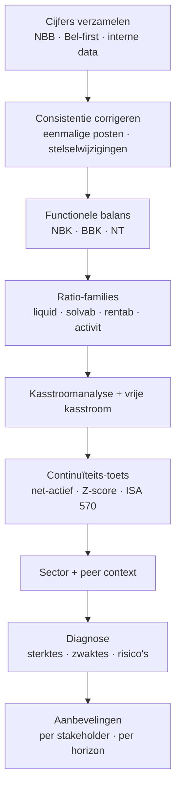

> **Leerstuk — één vraag, helemaal doorgewerkt.** Dit is het tweede leerstuk van PO 1.9. De techniek van het kasstroomoverzicht (operationeel/investerings/financiering, indirecte methode, werkkapitaal-correcties) zit in PO 1.3 — hier gebruiken we de output ervan als instrument om een krediet-beslissing te nemen. Voor verhaal en routekaart: [[leerpaden/1-9|minicursus PO 1.9]]. Wikilinks doorheen de tekst leiden naar concept-fiches voor definitorische opzoek.

## Antwoord in één blik

Een krediet-beslissing is geen ratio-vraag maar een **kasstroom-vraag**. De bank wil weten of de operationele cashflow de volledige schuldenlast — kapitaal én interest, bestaand én nieuw — over de hele looptijd dekt, met marge. Het instrument is de **Debt Service Coverage Ratio (DSCR)** = beschikbare cashflow / totale jaarlijkse schuldenlast. De bancaire vuistregel: DSCR ≥ 1,20-1,30. Twee bouwstenen leveren de cijfers: (1) de **annuïteit-formule** a = K × i / (1 − (1+i)^−n) geeft de jaarlijkse last van een nieuwe lening; (2) het **matching-principe** zegt dat de looptijd niet langer mag zijn dan de economische levensduur van het actief dat met de lening gefinancierd wordt. Wanneer de DSCR ondermaats blijkt, is "niet" geen advies — wel zijn er vier structurele alternatieven (langere looptijd, eigen inbreng, bullet-krediet, staatswaarborg) plus een vijfde, niet-krediet-route: werkkapitaal eerst herstellen om de cashflow op te krikken vóór je het krediet aanvraagt.

Voor Belmonte Industries — een Belgische industriële KMO die begin 2026 een investeringskrediet van 600 k EUR aanvraagt voor een nieuwe CNC-cel — werken we de hele redenering door:

| Bouwsteen | Belmonte 2026 |
|---|---|
| Investering | 600 k EUR (CNC-cel, 8 jaar economische levensduur) |
| Voorgestelde lening | 600 k, 5 jaar, 6 %, gelijke annuïteit |
| Annuïteit nieuwe lening | 142,4 k EUR/jaar |
| Bestaande LT-aflossingen | 310 k EUR/jaar |
| Totale debt service | 452,4 k EUR/jaar |
| Bedrijfscashflow 2025 (proxy) | 210 k EUR |
| **DSCR 2025** | **0,46** (vuistregel ≥ 1,20) |

Met een DSCR van 0,46 dekt de operationele cashflow nog niet eens de helft van de jaarlijkse schuldenlast — de voorgestelde structuur is niet haalbaar. We werken de redenering stap voor stap door, plus de alternatieven die een gezonde structuur kunnen opleveren.

---

## Waarom cashflow en niet ratio's?

Een onderneming kan winstgevend zijn én cash-tekort hebben — de literatuur noemt dat "profitable insolvency". Winst betaalt geen leveranciers; cash wel. De bank, de leverancier én de fiscus willen cash zien. Voor een krediet-beoordeling is winst dus een te zwak signaal: ze gaat over toerekening (matching kosten/opbrengsten over periodes), niet over geld dat effectief op de rekening staat. Bovendien ligt de winst bij een onderneming met spanning vaak rond nul of negatief — wat de DSCR oneindig of onbruikbaar zou maken als je hem op winst zou bouwen.

Voor je verder kan, moet je **drie cashflow-definities** uit elkaar houden die in de Belgische analyse-praktijk vaak door elkaar worden gebruikt:

| Cashflow-definitie | Formule (vereenvoudigd) | Wanneer gebruiken |
|---|---|---|
| Bedrijfscashflow (proxy) | Nettoresultaat + afschrijvingen + waardeverminderingen + Δ voorzieningen | Snelle screening, geen kasstroomoverzicht beschikbaar |
| Operationele kasstroom (indirecte methode) | Bedrijfscashflow ± mutatie werkkapitaal | Volle krediet-analyse, IFRS-rapportering |
| Vrije kasstroom (FCFF) | Operationele kasstroom − vervangingsinvesteringen | Krediet-capaciteit + waardering |

De **bedrijfscashflow** is de snelle Belgische proxy: nettoresultaat plus alle niet-kaskosten die de winst hebben gedrukt zonder dat er geld is weggevloeid. Voor Belmonte 2025: nettoresultaat −100 + afschrijvingen 280 + toevoeging voorzieningen 30 = **210 k EUR**. Die berekening werkt op basis van enkel de resultatenrekening — balans-vrij, snel, geschikt voor een eerste screening of een examen-case. De **operationele kasstroom uit het kasstroomoverzicht** corrigeert vervolgens voor wat er ondertussen met het werkkapitaal is gebeurd: een verlenging van de klantkrediet-duur slokt cash op, een verlengde betaaltermijn aan leveranciers genereert cash. Voor Belmonte sluit het kasstroomoverzicht 2025 (zie [[kasstroom-analyse]] voor de techniek) op een operationele kasstroom van −20 k EUR — de stijging van voorraden (+250) en handelsvorderingen (+180) heeft de bedrijfscashflow grotendeels opgegeten. De **vrije kasstroom** trekt daar nog de vervangingsinvesteringen van af; voor Belmonte 2025 valt die op −390 k EUR.

> **Welke cashflow gebruik je voor de DSCR?** Conservatief en gebruikelijk: de bedrijfscashflow vóór financiële kosten, of de operationele kasstroom uit het kasstroomoverzicht. De Belgische bank-praktijk en het ITAA-/BIBF-examen volgen typisch de bedrijfscashflow-proxy (in lijn met de CBN-conventie — zie wettelijk fundament onderaan). De IAS-7-operationele kasstroom is preciezer maar vergt meer data. In dit leerstuk gebruiken we de proxy 210 k voor Belmonte 2025, met de operationele kasstroom −20 k als reality-check: zelfs op de zachte maatstaf is de cashflow al krap; op de harde maatstaf is hij negatief.

---

## DSCR — het instrument

De DSCR drukt uit hoeveel keer de beschikbare cashflow de jaarlijkse schuldenlast dekt:

$$\text{DSCR} = \frac{\text{beschikbare cashflow}}{\text{kapitaal-aflossingen + interest}}$$

Een DSCR van 1,0 betekent dat de cashflow exact gelijk is aan de schuldenlast — geen marge voor tegenvallers. Banken willen marge, en de vuistregel verschilt per type krediet:

| Type kredietverstrekking | DSCR-vuistregel |
|---|---|
| Klassiek bancair KMO-krediet | ≥ 1,20-1,30 |
| Project-finance (windparken, vastgoed) | ≥ 1,30-1,40 |
| Speculatieve sectoren (start-ups) | Waarderings-ondersteunend, geen harde drempel |

De **noemer** vraagt zorgvuldigheid. In de teller hoort de kapitaal-aflossing plus de interest van álle langlopende schulden — bestaande én nieuwe. Korte schulden tellen niet mee in de DSCR (zij worden geacht door werkkapitaal te draaien), maar het deel van langlopende schulden dat binnen het jaar vervalt — in het Belgische rekeningenstelsel klasse 42 — telt wél mee. Voor Belmonte:

| Component | Belmonte 2025 (k EUR) |
|---|---:|
| Bedrijfscashflow (nettoresultaat −100 + afschrijvingen 280 + Δ voorzieningen 30) | 210 |
| Bestaande LT-aflossingen (jaar) | 310 |
| Annuïteit nieuwe lening (600 k, 5 j, 6 %) | 142,4 |
| **Totale debt service** | **452,4** |
| **DSCR** | **0,46** |

Een DSCR van 0,46 zegt: zelfs als Belmonte 100 % van haar bedrijfscashflow aan schuldaflossing besteedt, dekt ze pas 46 % van wat ze moet ophoesten. Er blijft niets over voor vervangingsinvesteringen, werkkapitaal-groei, belastingen of dividend. Dat is geen "krap" — dat is **structurele insolventie** zodra alle kredieten samen lopen. De bank zal weigeren of de structuur fundamenteel willen herzien.

> **Waarom niet kijken naar de DSCR van 2024?** Als je 2024 als basis neemt (bedrijfscashflow toen 380 k), kom je op DSCR = 380 / 452,4 = 0,84. Nog steeds onder 1, maar minder dramatisch. Het script in `kredietaanvraag_2026` rekent beide scenario's: een bank zal naar de trend kijken, niet naar één jaar. De negatieve evolutie 2024→2025 (cashflow zakt van 380 naar 210) is op zich al een rode vlag.

---

## Annuïteit en matching — twee technische bouwstenen

### De annuïteit-formule

Eén formule moet je voor het examen uit het hoofd kennen. De jaarlijkse betaling bij een gelijk-annuïteit-krediet — waarbij elk jaar hetzelfde bedrag wordt betaald, en de mix tussen kapitaal en interest schuift over de looptijd — is:

$$a = K \times \frac{i}{1 - (1+i)^{-n}}$$

Waarin K het ontleende kapitaal, i de jaarrente in decimaal, en n de looptijd in jaren. Voor Belmonte's voorgestelde 5-jarige lening van 600 k aan 6 %:

$$a = 600 \times \frac{0{,}06}{1 - 1{,}06^{-5}} = \frac{36}{1 - 0{,}7473} = \frac{36}{0{,}2527} = 142{,}4 \text{ k EUR/jaar}$$

Drie discountfactoren die altijd nuttig zijn om te onthouden voor snelle examen-rekening aan 6 %: 1,06^−5 ≈ 0,747; 1,06^−8 ≈ 0,627; 1,06^−10 ≈ 0,558. Met die drie kan je de meeste annuïteit-vragen onder een minuut beantwoorden.

### Het matching-principe

Looptijd van de lening ≤ economische levensduur van het actief. De ratio: een actief dat 8 jaar cash genereert, mag niet over 3 jaar afbetaald worden — dan ligt de aflossingsdruk veel hoger dan wat de operationele cash uit het actief zelf op dat moment kan rechtvaardigen. Omgekeerd is wél toegelaten: een lening over 5 jaar voor een actief van 8 jaar levensduur betekent dat de machine na de laatste aflossing nog 3 jaar "vrij" cash genereert. Dat is geen probleem in zichzelf, maar het impliceert dat de aflossingsdruk in de eerste 5 jaar zwaar is en zich pas vanaf jaar 6 verlicht.

Voor Belmonte: de CNC-cel heeft een economische levensduur van 8 jaar, de voorgestelde lening 5 jaar. Geen schending van het matching-principe (looptijd ≤ levensduur), maar het maakt de eerste 5 jaar wel zwaar. Een 8-jarige lening — waar de looptijd matcht met de levensduur — zou de annuïteit verlagen:

$$a_{8j} = 600 \times \frac{0{,}06}{1 - 1{,}06^{-8}} = \frac{36}{0{,}373} = 96{,}6 \text{ k EUR/jaar}$$

DSCR-impact: (310 + 96,6) = 406,6 totale debt service; 210 / 406,6 = **0,52**. Nog steeds onder 1, maar minder dramatisch. Wel let op: hoe langer de lening, hoe meer totale interest. Bij 5 jaar betaalt Belmonte in totaal 5 × 142,4 − 600 ≈ 112 k aan interest; bij 8 jaar wordt dat 8 × 96,6 − 600 ≈ 173 k. De tradeoff is dus: cashflow nu (lagere annuïteit) versus absolute kost (meer interest).

---

## Alternatieve kredietstructuren

Wanneer de DSCR niet haalbaar is, zijn er vier structurele alternatieven en een vijfde, niet-krediet-route. Elke heeft een eigen tradeoff, en samen vormen ze de toolkit van het advies aan de cliënt.

### 1. Langere looptijd

Zoals hierboven uitgewerkt: 8 jaar in plaats van 5 brengt de annuïteit van 142,4 naar 96,6 k. Voorwaarde: matching met economische levensduur respecteren. Voor Belmonte mag dat — de CNC-cel gaat 8 jaar mee. Voor een actief met 5 jaar levensduur is een 8-jarige lening niet toegelaten.

### 2. Eigen inbreng

De cliënt brengt cash in — uit eigen liquide reserves van de aandeelhouders of via een kapitaalverhoging — en het krediet zakt. Als Belmonte 200 k eigen inbreng kan vinden, blijft een krediet van 400 k over. Annuïteit op 400 k over 5 jaar aan 6 %: ongeveer 95 k. Totale debt service: 310 + 95 = 405; DSCR = 210 / 405 = **0,52**. Voordeel: minder kredietafhankelijkheid en betere bank-relatie. Nadeel: liquiditeit van de aandeelhouders wordt aangesproken, plus opportuniteitskost van die cash.

### 3. Bullet-krediet (ballonkrediet)

Tijdens de looptijd betaalt de onderneming alleen interest; het volledige kapitaal wordt op vervaldag in één keer terugbetaald. Bij Belmonte: 600 × 6 % = 36 k interest per jaar tijdens jaar 1-4, en op vervaldag 600 k kapitaal + 36 k interest = 636 k. DSCR jaar 1-4: 210 / (310 + 36) = **0,61** — beduidend beter. DSCR jaar 5: 210 / (310 + 636) = **0,22** — dramatisch slecht. Banken eisen daarom typisch een herfinancierings-clausule of een refinanciering-mechanisme dat al bij contractsluiting wordt vastgelegd. Geschikt voor situaties waar je verwacht dat de cashflow tegen vervaldag fors zal stijgen (bijvoorbeeld na de inwerkingtreding van de nieuwe CNC-cel die 80-120 k operationele besparing/jaar oplevert), of bij projecten met een duidelijke exit (vastgoed-verkoop).

### 4. Staat-gewaarborgde KMO-lening

In Vlaanderen biedt de Vlaamse Waarborgregeling (en het filiaal Gigarant NV voor grote projecten) een staatswaarborg van typisch 75 % van het krediet. De bank krijgt daardoor een andere risico-allocatie — voor 75 % van het bedrag is de Vlaamse overheid garant — en kan een gunstigere rentevoet aanbieden of minder strikte DSCR-eisen hanteren. Brussel en Wallonië hebben analoge regelingen (finance.brussels, Sowalfin). Voor een industriële KMO als Belmonte met klant-concentratie en investerings-behoefte is dit vaak een haalbare route.

### 5. Werkkapitaal eerst herstellen (geen krediet-structuur)

De vijfde route bestaat erin de bedrijfscashflow te verhogen vóór je überhaupt een krediet aanvraagt. Bij Belmonte: factoring op de twee hoofdklanten zou DSO van 90 naar bijvoorbeeld 30 dagen brengen, wat tussen 100 en 150 k cash vrijmaakt. Voorraadafbouw — 1.150 k voorraden terugbrengen naar de niveau-2023 van 750 k — voegt nog eens 200-300 k toe op eenmalige basis. Het krediet-pad gaat dan van DSCR 0,46 naar ongeveer 0,80 zonder enige verandering aan de kredietstructuur. Zie [[werkkapitaalbeheer-en-financieringskeuzes]] voor hoe je dit concreet aanpakt.

Samengevat:

| Alternatief | Annuïteit (k) | Totale debt service (k) | DSCR Belmonte 2025 | Tradeoff |
|---|---:|---:|---|---|
| Voorgesteld (5 j) | 142,4 | 452,4 | 0,46 | Basisscenario — niet haalbaar |
| 8-jarige looptijd | 96,6 | 406,6 | 0,52 | Matching OK; meer totale interest |
| Eigen inbreng 200 k + 400 k krediet 5 j | 95 | 405 | 0,52 | Aandeelhouders-cash + opportuniteit |
| Bullet 600 k, 5 j | 36 (jaar 1-4) / 636 (jaar 5) | 346 / 946 | 0,61 / 0,22 | Balloon-risico op vervaldag |
| Werkkapitaal eerst herstellen | 142,4 | 452,4 | ≈ 0,80 (na herstel) | Vergt 6-12 maanden voorbereiding |

In de praktijk is een **combinatie** vaak het advies: bijvoorbeeld factoring activeren (cashflow naar ~320 k brengen) plus 8-jarige looptijd (annuïteit 96,6 k). DSCR wordt dan 320 / (310 + 96,6) = 0,79 — nog steeds onder 1, maar het toont waar het krediet pas op een redelijke ratio uitkomt. De volgende stap is dan een herstructurering van de bestaande LT-schulden (de 310 k aflossingen) of een eigen inbreng als laatste tegenwicht.

---

## Kasstroomprognose — onderbouwing aan de bank

Een kredietaanvraag zonder kasstroomprognose is een conversatie zonder argumenten. Banken verwachten een 3- tot 5-jarige geprojecteerde balans + resultatenrekening + kasstroomoverzicht, met de aannames expliciet en het pessimistische scenario expliciet uitgewerkt. Een goede prognose heeft vijf bouwstenen, in deze volgorde:

1. **Omzet-drivers** — bouw op volume × prijs per productsegment, met scenario-spreiding. Voor Belmonte: tafel-segment 4.000 stuks × prijs vs kast-segment 600 stuks × prijs, met pessimistische versie waar de twee hoofdklanten 10 % afnemen vermindert. Niet één getal — minstens drie scenario's.
2. **Kostenstructuur** — variabele kost als percentage van de omzet (uit historische trend), vaste kost als absoluut bedrag (uit huidige loonmassa + huur + afschrijvingen). Vaste kost groeit niet automatisch met omzet — dat is precies wat operationele hefboom heet. Eventuele extra afschrijvingen door de nieuwe CNC-cel moeten expliciet toegevoegd worden.
3. **Werkkapitaalmutaties** — DSO, DPO en DIO uit historische trend, of policy-targets als je verbetering plant. Bij Belmonte zou een prognose met DSO van 90 naar 50 dagen tegen 2027 (via factoring) ongeveer 250 k cash vrijmaken — maar je moet die belofte hard maken in het businessplan, niet als wens.
4. **Investerings-plan** — vervangingsinvesteringen plus uitbreidings-CAPEX, met timing. Voor Belmonte 2026: 600 k CNC-cel, daarna jaarlijks 400 k vervanging (historisch niveau).
5. **Financierings-plan** — bestaande aflossingen plus de nieuwe lening, plus de evolutie van de kasovertrek. Sluitstuk is de pro-forma balans: heeft het eigen vermogen tegen 2027 niet onder de helft van het kapitaal gestort, vraagt de **alarmprocedure** geen aandacht? Zie [[continuiteit-en-faillissementspredictie]] voor de details.

**Sanity-checks** om in je prognose in te bouwen voor je ze aan de bank geeft:

- Is de geprojecteerde EBIT-marge plausibel op basis van de historische trend? Als Belmonte van 0,1 % marge in 2025 plots naar 5 % in 2027 springt zonder uitleg, geloof de bank dat niet.
- Blijft het werkkapitaal binnen sector-realisme? DSO van 30 dagen is ambitieus in een markt waar klanten 90 dagen betalen.
- Daalt het netto-actief onder de WVV-drempels? Het bestuursorgaan is verplicht om dit te projecteren in het jaarverslag (risico's en onzekerheden) — een prognose die dit signaal mist, is onvolledig.

**Scenario-aanpak**: minstens optimistisch / baseline / pessimistisch. De pessimist toetst of de DSCR robuust is — banken focussen op het pessimistische scenario, niet op het optimistische. Voor Belmonte zou een eerlijke prognose tonen: zonder werkkapitaal-ingreep daalt de bedrijfscashflow tegen 2027 naar negatief; mét factoring én voorraadafbouw stabiliseert ze rond 280-350 k; mét bovendien de operationele besparing uit de nieuwe CNC-cel (80-120 k/jaar vanaf 2027) gaat ze richting 400+ k. Maar alleen het mét-én-mét-pad maakt het krediet haalbaar — en dat is precies de boodschap die de bank moet horen, expliciet en met cijfers onderbouwd.

---

## Examen-case 2008 — analoge redenering

Het examen 2008-bibf vroeg exact dit type case: een onderneming met 30.000 EUR cashflow, 12.000 EUR bestaande aflossingen, vraagt een nieuwe lening van 100.000 EUR aan 5 % over 5 jaar. Beoordeel de haalbaarheid. De redenering is identiek aan Belmonte — alleen de schaal verschilt.

**Stap 1 — annuïteit-berekening:**

$$a = 100.000 \times \frac{0{,}05}{1 - 1{,}05^{-5}} = \frac{5.000}{1 - 0{,}7835} = \frac{5.000}{0{,}2165} = 23.097 \text{ EUR/jaar}$$

**Stap 2 — totale debt service:** 12.000 + 23.097 = **35.097 EUR**.

**Stap 3 — DSCR:** 30.000 / 35.097 = **0,85**. Tekort: 5.097 EUR/jaar.

**Stap 4 — advies (zoals in het modelantwoord):** niet haalbaar in de voorgestelde structuur. Mogelijke alternatieven:
- Langere looptijd (8 jaar → annuïteit zakt naar 15.473)
- Eigen inbreng om kapitaal te verlagen
- Bullet-krediet (alleen interest tijdens looptijd, 5.000 EUR/jaar)
- Cashflow-groei aantonen via businessplan post-investering

Het patroon is helder: cijfers anders, methodologie hetzelfde. Het examen test of je het **vier-stappen-protocol** beheerst — annuïteit berekenen → totale schuldenlast samentellen → DSCR berekenen → advies + alternatieven formuleren. Wie de stappen mechanisch kan reproduceren én bij elk alternatief de tradeoff kan benoemen, scoort.

---

## Drie valkuilen

> **Valkuil 1 — cashflow gelijkstellen aan "beschikbaar voor aflossingen".** De bedrijfscashflow moet ook andere zaken financieren: interesten op bestaande schulden, belastingen, vervangingsinvesteringen, werkkapitaal-groei en eventueel dividenden. De DSCR-vuistregel ≥ 1,20 impliceert precies dat — er moet 20-30 % marge overblijven na schuldaflossing. Wie de cashflow volledig op de schuldenlast plakt, ondersschat de echte benodigde marge.

> **Valkuil 2 — matching negeren.** Een 8-jarige machine met een 3-jarige lening betekent een aflossingsdruk die veel hoger ligt dan de operationele cash uit de machine zelf op dat moment rechtvaardigt. Het examen kan exact dat vragen: respecteert de voorgestelde structuur het matching-principe? Antwoord altijd met de twee bedragen — looptijd lening versus economische levensduur — en benoem het verschil expliciet.

> **Valkuil 3 — bedrijfscashflow uit het hoofd gelijkstellen aan de operationele kasstroom uit het kasstroomoverzicht.** De Belgische analyse-traditie (CBN-conventie) corrigeert niet voor werkkapitaal-mutaties; de IAS-7-indirecte methode wel. Het verschil is precies de werkkapitaal-correctie, en dat verschil kan groot zijn — bij Belmonte 2025: bedrijfscashflow 210 vs operationele kasstroom −20, een gat van 230 k door voorraad- en vorderingen-stijging. Lees de vraag: vraagt ze "cashflow" (proxy) of "operationele kasstroom" (kasstroomoverzicht-output)? Het antwoord verschilt.

---

## Wanneer je dit snapt, ga dan naar

- [[werkkapitaalbeheer-en-financieringskeuzes]] — de voorvraag van dit leerstuk: als de DSCR niet haalbaar is, werk dan eerst aan de werkkapitaal-positie. Factoring, voorraadafbouw en kasovertrek-vervanging zijn vaak de eerste hefbomen voor een gezonde krediet-structuur.
- [[continuiteit-en-faillissementspredictie]] — wat als zelfs de alternatieven niet werken? Going-concern-toets, alarmprocedure en de Z-score van Altman als faillissements-predictor.
- [[financiele-diagnose-stellen]] — hoe verpak je een "niet-haalbaar"-advies in een rapport met concrete aanbevelingen per stakeholder en per horizon?
- [[leerpaden/1-9/samenvatting|Samenvatting PO 1.9]] — voor herhaling vlak vóór het examen: PO-brede kapstok met annuïteit-formule, DSCR-formule, matching-principe en de vier alternatieven voor het hele vak.

## Doorklik naar concepten

Voor wie definitorisch detail wil opzoeken:

- [[kasstroom-analyse]] · [[free-cash-flow]]
- [[financiele-diagnose]] · [[ratio-interpretatie]]
- [[solvabiliteits-ratios]]

---

## Wettelijk fundament

- **Bedrijfscashflow — boekhoudkundige proxy**: CBN-advies 2011/14 (Herwaarderingsmeerwaarden, sectie "Rentabiliteit van het eigen vermogen") definieert cashflow expliciet als "het nettoresultaat na belastingen, verhoogd met de niet-kaskosten (zijnde de afschrijvingen, de waardeverminderingen, de voorzieningen, enzoverder)". Dit is de Belgische examen-conventie voor "bedrijfscashflow" — geen werkkapitaal-correctie.
- **Operationele kasstroom — internationale norm**: IAS 7 §10-20 (Verordening (EU) 2023/1803, geconsolideerde IFRS) voorziet zowel de directe als de indirecte methode voor het kasstroomoverzicht. De indirecte methode (§18b) start van de winst of het verlies en past die aan voor niet-kas-elementen en werkkapitaal-mutaties. Verschil met de Belgische proxy zit precies in die werkkapitaal-correctie.
- **DSCR-vuistregel + matching-principe**: geen wettelijke verankering. DSCR is internationaal aanvaarde bancaire praktijk (Bazel-conventies, kredietanalyse-doctrine). Matching is bedrijfseconomische doctrine (Brealey/Myers/Allen). Voor de Belgische krediet-praktijk: NBB Balanscentrale en Belfius Companyweb-scoring leveren peer-data.
- **Transparantie-eisen kredietverstrekking aan KMO's**: Wet 21 december 2013 betreffende diverse bepalingen inzake de financiering van kleine en middelgrote ondernemingen. Legt informatieplichten op aan kredietverstrekkers ten aanzien van KMO-klanten (toelichting kredietvoorwaarden, motivering bij weigering). Bevoegde rechtsgrondslag voor de verhouding bank–KMO; details over zekerheden zijn ondergebracht in Boek 9 BW (Zekerheden). Annuïteit-formule zelf is financiële wiskunde, geen wettelijke regeling.
- **Staatswaarborg KMO-krediet**: Vlaamse Waarborgregeling — Decreet 6 februari 2004 + uitvoeringsbesluiten. Gigarant NV biedt grote-projects-waarborgen. Brussels Hoofdstedelijk en Waals Gewest hebben analoge regelingen (finance.brussels, Sowalfin). Drempel-bedragen en waarborg-percentages — zie Cijferzakboekje.

---

*Leerstuk PO 1.9 — lstk 2 van 4. Status: voorgesteld.*
