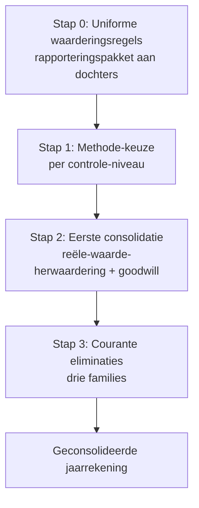

> **Leerstuk — één vraag, helemaal doorgewerkt.** Lees eerst [[wie-moet-consolideren]] — die zet de scope vast (welke vennootschappen, welke drempels). Hier ga je in op de techniek: welke methode kies je, hoe verloopt een eerste consolidatie, en hoe elimineer je de intra-groep stromen. Voor verhaal en routekaart: [[leerpaden/1.4|minicursus PO 1.4]].

## Antwoord in één blik

Consolideren is een keten van **vier stappen**. Stap 0 zet de waarderingsregels gelijk over de hele groep — anders tel je gebouwen volgens IFRS naast gebouwen volgens BE-GAAP. Stap 1 kiest de methode per controle-niveau: integrale consolidatie bij exclusieve controle (dochter), evenredige consolidatie bij gezamenlijke controle (joint venture, enkel onder B-GAAP), de vermogensmutatiemethode bij notabele invloed (associate). Stap 2 is de zwaarste verrichting — de **eerste consolidatie** op overnamedatum, met reële-waarde-herwaardering van activa en passiva en goodwill als verschil tussen aanschafprijs en aandeel in het herwaardeerd netto-eigen vermogen. Stap 3 zijn de **drie families courante eliminaties** die elke jaarafsluiting terugkeren: deelneming ↔ eigen vermogen, vorderingen ↔ schulden, en intra-groep verkopen met nog-niet-gerealiseerde marge in voorraad.

We werken alles uit op één doorlopende voorbeeldgroep — **Aurelia NV** consolideert haar 80 %-dochter **Bellator BVBA**, haar 50 %-joint-venture **Concordia SE** en haar 30 %-associate **Dynamica NV**.

---

## Stap 0 — Uniforme waarderingsregels (rapporteringspakket)

Vóór één balanslijn geconsolideerd kan worden, moet de hele groep dezelfde waarderingsregels hanteren. Dat klinkt vanzelfsprekend tot je het mechanisch uitschrijft: de groep telt straks Aurelia's gebouwen op bij Bellators gebouwen, Aurelia's voorraden bij Bellators voorraden. Doen die twee dat volgens verschillende regels — bijvoorbeeld lineair over 20 jaar bij de moeder, lineair over 30 jaar bij de dochter — dan tel je appels bij peren. Het geconsolideerde resultaat dat eruit komt is, in technische zin, onzin.

Het concrete voorbeeld. Aurelia hanteert groepsbreed een afschrijvingsplan van 20 jaar voor gebouwen. Bellator schrijft statutair lineair over 30 jaar af op haar 2,5 mln gebouwen — dat is haar eigen, lokaal verantwoorde keuze. Voor de groeps-jaarrekening moet Bellator haar afschrijvingen versnellen alsof de gebouwen al 20 jaar lang volgens groepsregel werden afgeschreven: een aanvullende afschrijving in het geconsolideerde resultaat plus een lagere geconsolideerde boekwaarde. Hetzelfde verhaal bij voorraad: een dochter die statutair de gemiddelde-aanschafprijsmethode hanteert moet voor de groep overschakelen naar FIFO als dat de groeps-regel is.

In de praktijk lost de moeder dit op met een **rapporteringspakket**: een document dat haar centraal consolidatiebureau aan elke dochter uitstuurt vóór de afsluiting. Het pakket bevat een groeps-rekeningenstelsel (welke rekening hoort waar in de geconsolideerde JR), de uniforme waarderingsregels (afschrijvingsplannen, voorraadwaardering, voorzieningenbeleid) en de intra-groep-mapping (welke posten markeren als intra-groep). Dochters leveren hun cijfers aan volgens dát pakket — niet volgens hun lokale gewoonten.

Wat als een dochter statutair anders waardeert dan groepsbreed? Dan houdt ze twee versies bij: haar eigen statutaire jaarrekening voor lokale neerlegging (gebouwen afgeschreven over 30 jaar, conform haar eigen waarderingsregels) én een groeps-gecorrigeerde versie voor consolidatie (gebouwen versneld afgeschreven naar 20 jaar groepsregel). Een **reconciliatie-document** expliciteert het verschil, zodat een auditor of moeder-controller post per post kan nakijken waar de aanpassing vandaan komt.

| Aspect | Statutair (per entiteit) | Geconsolideerd (groepsbreed) |
|---|---|---|
| Afschrijving gebouwen | Bellator: lineair 30 jaar | Aurelia-groepsregel: lineair 20 jaar → reconciliatie 10/30 versnellen |
| Voorraadwaardering | Concordia: gemiddelde aanschafprijs | Aurelia-groepsregel: FIFO → reconciliatie bij afsluiting |
| Voorzieningen | Lokale wetgeving dochter | Groeps-voorzichtigheidsbeleid voor geconsolideerde JR |

> **Stap 0 is niet alleen techniek, het is governance.** De moeder is aansprakelijk voor de consistentie van de geconsolideerde jaarrekening groepsbreed — en de wet wijst die verantwoordelijkheid expliciet aan haar toe: de consoliderende vennootschap past voor haar geconsolideerde jaarrekening **dezelfde waarderingsregels** toe als voor haar eigen enkelvoudige jaarrekening. Dat betekent in de praktijk dat de adviseur of auditor van een dochter met die moeder-keuze in conflict kan komen — wat statutair de "voorzichtigste" oplossing is voor de dochter, hoeft niet de regel te zijn die groepsbreed geldt. Wie als adviseur in een groeps-dochter zit, moet beide kaders kennen en kunnen voorrekenen waar ze uit elkaar lopen.

---

## Stap 1 — Welke methode bij welk controle-niveau?

De methode-keuze is geen vrije keuze. Ze volgt strikt het controle-niveau dat je vaststelde bij de scope-vraag in [[wie-moet-consolideren]]. Wie 80 % aandelen bezit en daarmee exclusieve controle uitoefent, kan niet "ervoor kiezen" om die dochter via vermogensmutatie te verwerken — integrale consolidatie is verplicht. Omgekeerd: een associate van 30 % mag je niet integraal binnenhalen, want dan zou je activa op de balans zetten waar je geen controle over hebt.

| Methode | Wanneer? | Wat verandert op de geconsolideerde balans? | Belang van derden? | Geldig onder IFRS? |
|---|---|---|---|---|
| **Integrale consolidatie** | Exclusieve controle (dochter) | 100 % van activa, passiva, opbrengsten en kosten regel-per-regel — deelneming-lijn verdwijnt | **Ja** — aparte rubriek in passief | Ja (IFRS 10) |
| **Evenredige consolidatie** | Gezamenlijke controle (joint venture) | Het deelnemings­percentage van élke balanslijn (pro-rata) — deelneming-lijn verdwijnt | Nee — al pro-rata uit-geschaald | **Nee** — IFRS 11 verbiedt dit voor joint ventures |
| **Vermogensmutatie­methode** | Notabele invloed (associate, ~20-50 %) | Eén balanslijn opnieuw gewaardeerd op aandeel in netto-eigen vermogen; onderliggende activa blijven onzichtbaar | Nee — geen integratie | Ja (IAS 28) |

De vetgedrukte cel in de IFRS-kolom is de examen-trap. Onder B-GAAP mag een joint venture evenredig óf via vermogensmutatie; onder IFRS is evenredig sinds 2013 verboden en gaan alle joint ventures via de vermogensmutatie. Een groep die haar B-GAAP-cijfers naar IFRS converteert, moet alle JV-cijfers herwerken — geen kleine ingreep.

Voor Aurelia: 80 % van Bellator → exclusieve controle → **integrale consolidatie**. 50 % van Concordia → gezamenlijke controle → **evenredig** onder B-GAAP (zie [stap 4](#en-de-andere-twee-methodes-zelfde-principe-andere-techniek)). 30 % van Dynamica → notabele invloed → **vermogensmutatie**.

---

## Stap 2 — Aurelia koopt Bellator (eerste consolidatie)

Een dochter die voor het eerst in de kring komt — door overname of door oprichting — krijgt een speciale behandeling vóór ze geïntegreerd kan worden. Op overnamedatum herwaardeer je haar activa en passiva naar reële waarde, je vergelijkt de aanschafprijs van de deelneming met je aandeel in dat herwaardeerd netto-eigen vermogen, en het verschil wordt geboekt als goodwill (of, omgekeerd, als badwill). Dat is dé zwaarste verrichting in het hele dossier — alles wat erna komt zijn courante eliminaties die elke jaarafsluiting terugkeren.

### Aurelia koopt Bellator — de cijfers

Aurelia betaalt **6,0 mln EUR** voor 80 % van de aandelen Bellator op 1 januari 2026. Op overnamedatum zien de boeken van Bellator er als volgt uit — links de statutaire boekwaarden, rechts de reële waarden vastgesteld bij de overname-due-diligence:

| Bellator BVBA op overnamedatum | Boekwaarde | Reële waarde | Herwaardering |
|---|---:|---:|---:|
| Gebouwen | 2,5 | 3,5 | +1,0 |
| Klantenrelaties *(immaterieel, niet eerder geboekt)* | 0,0 | 0,5 | +0,5 |
| Overige activa | 3,5 | 3,5 | 0 |
| Schulden | (2,0) | (2,0) | 0 |
| **Netto-eigen vermogen** | **4,0** | **5,5** | **+1,5** |

Twee herwaarderingen liggen aan de basis van het reële netto-eigen vermogen van 5,5 mln. De gebouwen stonden voor 2,5 mln in Bellators eigen boeken — voorzichtig afgeschreven volgens haar lokale plan — maar bezitten een marktwaarde van 3,5 mln. De klantenrelaties stonden helemaal niet op haar balans — intern opgebouwde immateriële activa mogen statutair niet geactiveerd worden — maar bezitten als overgenomen actief een onafhankelijke reële waarde van 0,5 mln. Beide bedragen worden bij de consolidatie expliciet zichtbaar gemaakt.

Aurelia's aandeel in het reëel netto-eigen vermogen bedraagt $80\% \times 5{,}5 = 4{,}4$ mln. Ze betaalde echter 6,0 mln. Het verschil is goodwill:

$$ \text{Goodwill} = 6{,}0 - 4{,}4 = 1{,}6 \text{ mln EUR} $$

Die goodwill verschijnt straks op de geconsolideerde balans als afzonderlijke post onder de immateriële vaste activa. Wat er daarna mee gebeurt — afschrijvingsplan onder B-GAAP, impairment-test onder IFRS — werk je verder uit in [[goodwill-bij-consolidatie]].

Tegelijk wordt het aandeel van de andere aandeelhouders zichtbaar gemaakt als afzonderlijke rubriek op de passiefzijde:

$$ \text{Belang van derden} = 20\% \times 5{,}5 = 1{,}1 \text{ mln EUR} $$

### Boekingsschema (vereenvoudigd)

Op geconsolideerd niveau vervangt de moeder haar deelneming-lijn van 6,0 mln door de onderliggende activa en passiva van Bellator. Dat is mechanisch wat de eerste consolidatie doet: de samenvatting "wij bezitten aandelen in X" wordt opgesplitst in de gebouwen, voorraden, vorderingen en schulden die onder die aandelen schuilgaan, mét de goodwill als premie boven het aandeel in het reëel netto-vermogen, mét het belang van derden als spiegel-rubriek aan de passiefzijde.

**Geconsolideerde boeking — eerste consolidatie**

| Debet | mln | Credit | mln |
|:---|---:|:---|---:|
| Activa Bellator *(op reële waarde)* | 9,5 | Schulden Bellator | 2,0 |
| Goodwill | 1,6 | Deelneming in Bellator *(weg)* | 6,0 |
|  |  | Belang van derden | 1,1 |
|  |  | Geconsolideerde reserves | 1,0 |
| **Totaal** | **11,1** | **Totaal** | **11,1** |

Geen wonder dat dit de zwaarste verrichting is. Daarna komen bij elke periodieke afsluiting de courante eliminaties — minder spectaculair, maar essentieel om de groep correct in beeld te brengen.

---

## Stap 3 — Eliminaties

Eenmaal de eerste consolidatie geboekt, moet je elke jaarafsluiting opnieuw alle **intra-groep stromen** wegwerken. Een verkoop van moeder aan dochter is voor de groep géén verkoop — het is gewoon een goederenverschuiving binnen dezelfde economische eenheid. Een vordering van moeder op dochter is voor de groep geen vordering — het is geld dat de groep aan zichzelf "verschuldigd" is. Wie de twee individuele balansen zomaar zou optellen, zou hetzelfde economische gegeven dubbel laten verschijnen.

Om te zien wáár die eliminaties bijten, leggen we eerst de twee individuele balansen naast elkaar — Aurelia op het einde van haar eerste consolidatiejaar, Bellator op dezelfde datum na de reële-waarde-herwaardering die bij de overname is geboekt. Daarna komt Aurelia's individuele resultatenrekening, want één van de eliminatie-families raakt vooral de omzet en de marge. De ★-lijnen markeren de intra-groep posten — die staan straks niet meer in de geconsolideerde voorstelling.

> **De volgende twee balansen volgen het schema KB-WVV.** Niet alle rubrieken zijn getoond — alleen de pedagogisch relevante. ★ markeert intra-groep posten die voor de groep niet bestaan.

### Balans A — Aurelia NV op 31-12-2026 (vereenvoudigd schema KB-WVV)

**Activa (mln EUR)**

|  |  |
|:---|---:|
| **Vaste activa** | **18,0** |
| Materiële vaste activa *Terreinen en gebouwen* | 12,0 |
| Financiële vaste activa — ★ **Deelneming Bellator BVBA (80 %)** | **6,0** |
| **Vlottende activa** | **12,0** |
| Voorraden en bestellingen in uitvoering | 5,0 |
| Vorderingen op ten hoogste één jaar | 4,0 |
| *waarvan handelsvorderingen extern* | *3,0* |
| *waarvan ★ vordering op Bellator* | *1,0* |
| Liquide middelen en overig | 3,0 |
| **Totaal activa** | **30,0** |

**Passiva (mln EUR)**

|  |  |
|:---|---:|
| **Eigen vermogen** | **18,0** |
| **Schulden** *(extern)* | **12,0** |
| **Totaal passiva** | **30,0** |

### Resultatenrekening A — Aurelia NV boekjaar 2026 (vereenvoudigd)

|  |  |
|:---|---:|
| **Bedrijfsopbrengsten — omzet** | **38,0** |
| *waarvan ★ aan Bellator (intra-groep)* | *2,5* |
| **Bedrijfskosten** | **36,2** |
| Aankopen handelsgoederen | 28,0 |
| *waarvan ★ kostprijs voor de Bellator-verkoop* | *2,0* |
| Overige bedrijfskosten *(diensten, lonen, afschrijvingen)* | 8,2 |
| **Bedrijfsresultaat** | **1,8** |

> **De winstmarge op de Bellator-verkoop zit verstopt.** Aurelia verkocht voor 2,5 mln aan Bellator wat 2,0 mln kostte — een marge van 0,5 mln. Die marge ligt nergens als aparte regel; ze zit binnen het bedrijfsresultaat van 1,8 mln. Of de groep die winst mag behouden, hangt af van wat Bellator met de gekochte goederen deed — dat zien we bij familie (c) hieronder.

### Balans B — Bellator BVBA op 31-12-2026 *(na reële-waarde-herwaardering bij eerste consolidatie)*

**Activa (mln EUR)**

|  |  |
|:---|---:|
| **Vaste activa** | **4,0** |
| Immateriële vaste activa *Klantenrelaties (erkend bij herwaardering)* | 0,5 |
| Materiële vaste activa *Gebouwen (boekw. 2,5 → reële waarde 3,5)* | 3,5 |
| **Vlottende activa** | **3,5** |
| Voorraden | 3,0 |
| *waarvan ★ gekocht van Aurelia* | *2,5* |
| *waarvan eigen handel* | *0,5* |
| Liquide middelen en overig | 0,5 |
| **Totaal activa** | **7,5** |

**Passiva (mln EUR)**

|  |  |
|:---|---:|
| **Eigen vermogen** | **5,5** |
| *waarvan aandeel moeder (80 %)* | *4,4* |
| *waarvan belang van derden (20 %)* | *1,1* |
| **Schulden** | **2,0** |
| Schulden ≤ 1 jaar — extern *(leveranciers)* | 1,0 |
| ★ Schuld aan Aurelia | 1,0 |
| **Totaal passiva** | **7,5** |

### Drie families — waar ze landen + wat schort zonder eliminatie

Met beide balansen voor je is het kort: drie families intra-groep stromen verschijnen tegelijk in de twee jaarrekeningen, drie maal moet je iets wegwerken. Familie (a) raakt de deelneming-lijn versus het eigen vermogen van de dochter. Familie (b) raakt de wederzijdse vorderingen en schulden. Familie (c) raakt de intra-groep verkopen en de winst die nog in voorraad ligt.

#### (a) Deelneming in moeder ↔ eigen vermogen van dochter

##### De situatie — wat staat er in beide balansen?

Een deelneming is op de balans van de moeder altijd **één lijn**: een samenvatting van "wij bezitten aandelen in vennootschap X". Wat onder die aandelen schuilgaat — gebouwen, voorraden, klantenrelaties — wordt niet getoond. Op de balans van de dochter staat datzelfde vermogen wél ontleed: gebouw per gebouw, voorraad per voorraad, schuld per schuld.

Vergelijk de twee blikken op de Aurelia-Bellator-band:

|  | Wat staat er? | Bedrag |
|---|---|---:|
| **In Aurelia's balans** | Eén lijn *"Deelneming Bellator BVBA (80 %)"* onder financiële vaste activa — de prijs die Aurelia op de overnamedatum betaalde voor 80 % van de aandelen | **6,0 mln** |
| **In Bellator's balans** | Eigen vermogen (na reële-waarde-herwaardering) — totaal | **5,5 mln** |
|  | *aandeel moeder = 80 % × 5,5* | *4,4 mln* |
|  | *belang van derden = 20 % × 5,5* | *1,1 mln* |

> **Waarom 6,0 versus 4,4? — goodwill.** Aurelia betaalde 6,0 mln voor wat boekhoudkundig 4,4 mln waard was. Dat verschil van 1,6 mln is geen fout — het is de premie boven het reëel netto-vermogen die Aurelia bereid was te betalen voor merknaam, een loyaal klantenbestand, verwachte synergie, alles wat economisch waarde heeft maar niet apart in Bellators boeken zat. Zo'n premie is het normale patroon bij overnames; bijna elke overname kent er één.

##### Het probleem — hetzelfde vermogen telt dubbel

Stel je telt de twee individuele balansen zomaar bij elkaar op zonder eliminatie. Wat krijg je dan?

- Activa-zijde: **Aurelia's 30,0 + Bellator's 7,5 = 37,5 mln**
- Maar wat zit er in die 37,5? Aan Aurelia's kant **6,0 mln "Deelneming Bellator"** — de aandelen-samenvatting. Aan Bellators kant **7,5 mln onderliggende activa** — gebouwen, voorraden, klantenrelaties, één laag dieper.

Beide regels beschrijven *hetzelfde economische vermogen* — één keer als aandelen-samenvatting, één keer ontleed. Een externe lezer zou de groep er 6 mln "groter" uit zien dan ze werkelijk is. Geconsolideerd betekent: kies één van de twee voorstellingen, niet beide.

##### De oplossing — vier boekingen tegelijk

Bij de consolidatie wordt de aandelen-samenvatting opgegeven ten gunste van de ontlede voorstelling. Concreet gebeuren er vier dingen in één boeking:

| Stap | Wat | Mutatie |
|---|---|---:|
| 1 | Schrap aan Aurelia's kant *"Deelneming Bellator"* | activa **−6,0** |
| 2 | Schrap aan Bellator's kant het EV-deel van de moeder (80 % × 5,5) | passiva **−4,4** |
| 3 | Boek het verschil als **goodwill** *(immaterieel vast actief)* | activa **+1,6** |
| 4 | Boek het EV-deel van de minderheidsaandeelhouders apart als **belang van derden** *(passiva-rubriek)* | passiva **+1,1** |

Deze vier mutaties zijn boekhoudkundig al uitgewerkt in [Stap 2 — Aurelia koopt Bellator](#stap-2--aurelia-koopt-bellator-eerste-consolidatie). Familie (a) is geen nieuwe verrichting — ze is de **courante variant** van diezelfde eerste-consolidatie-eliminatie, die elk volgend boekjaar opnieuw geboekt moet worden zolang Bellator in de kring zit. Wat je hier ziet is hetzelfde gebaar als op overnamedatum, met dezelfde bedragen — alleen niet meer als open-balans-act maar als jaarlijkse routine.

In T-rekening-vorm — en met Bellators activa en schulden die ongewijzigd binnenkomen — ziet dezelfde verrichting er zo uit:

**Geconsolideerde boeking — eliminatie deelneming ↔ EV dochter**

| Debet | mln | Credit | mln |
|:---|---:|:---|---:|
| Activa Bellator *(gebouwen, klantenrelaties, voorraden …)* | 7,5 | Schulden Bellator | 2,0 |
| Goodwill *(immaterieel vast actief)* | 1,6 | Deelneming Bellator *(weg)* | 6,0 |
|  |  | Belang van derden | 1,1 |
| **Totaal** | **9,1** | **Totaal** | **9,1** |

> **Wat hier echt gebeurt.** De onderliggende activa en schulden van Bellator komen *ongewijzigd* op de geconsolideerde balans terecht — geen aparte eliminatie nodig. De deelneming-lijn van 6,0 mln wordt opgesplitst in twee nieuwe rubrieken: **goodwill 1,6** (de overnamepremie) en **belang van derden 1,1** (het stuk van Bellator dat niet aan Aurelia toebehoort). Aan beide kanten van de balans worden samenvattingen vervangen door ontlede waarheid.

De diepere les: een deelneming-lijn is altijd een *samenvatting* van vermogen dat elders bestaat. Consolidatie maakt die samenvatting ongedaan en toont het vermogen "in volle uitstal" — gebouwen, klantenrelaties, voorraden — plus de twee correcties die de overname-context vereist. Het netto-effect op de geconsolideerde balans zie je verderop in de [mock geconsolideerde balans](#mock-geconsolideerde-balans-aurelia-sterk-vereenvoudigd).

#### (b) Vorderingen ↔ schulden tussen Aurelia en Bellator

##### De situatie — wat staat er in beide balansen?

Tijdens het boekjaar leverde Aurelia diensten of goederen aan Bellator die op balansdatum nog niet betaald zijn. Aan Aurelia's kant staat er een vordering, aan Bellators kant de spiegelbeeldige schuld:

|  | Wat staat er? | Bedrag |
|---|---|---:|
| **In Aurelia's balans** | *"★ Vordering op Bellator"* onder vorderingen op ten hoogste één jaar (activa-zijde) | **1,0 mln** |
| **In Bellator's balans** | *"★ Schuld aan Aurelia"* onder schulden op ten hoogste één jaar (passiva-zijde) | **1,0 mln** |

Voor elke vennootschap afzonderlijk kloppen die regels: Aurelia *moet* nog geld ontvangen, Bellator *moet* nog betalen. Niets bijzonders aan.

##### Het probleem — geen externe vordering

Voor de groep als geheel bestaat die vordering niet. Het is geld dat zij aan zichzelf "verschuldigd" is — een interne overschrijving binnen dezelfde economische eenheid. Tel je zonder eliminatie:

- Aurelia's totale activa (30) + Bellator's totale activa (7,5) = **37,5 mln**
- Aurelia's totale passiva (30) + Bellator's totale passiva (7,5) = **37,5 mln**

In die 37,5 zit aan beide kanten dezelfde 1,0 mln (vordering links, schuld rechts). Het geconsolideerde **balanstotaal is kunstmatig opgeblazen met 1,0 mln**. Externe lezers zouden de groep groter én zwaarder gefinancierd schatten dan ze werkelijk is — terwijl er aan derden niets te vorderen of verschuldigd is voor dat bedrag.

##### De oplossing — één-rij eliminatie

| Stap | Wat | Mutatie |
|---|---|---:|
| 1 | Schrap aan Aurelia's kant *"Vordering op Bellator"* | activa **−1,0** |
| 2 | Schrap aan Bellator's kant *"Schuld aan Aurelia"* | passiva **−1,0** |

In T-rekening-vorm:

**Geconsolideerde boeking — eliminatie intra-groep vordering ↔ schuld**

| Debet | mln | Credit | mln |
|:---|---:|:---|---:|
| Schuld aan Aurelia *(wegboeken)* | 1,0 | Vordering op Bellator *(wegboeken)* | 1,0 |
| **Totaal** | **1,0** | **Totaal** | **1,0** |

Per saldo dalen zowel de activa- als de passiva-kant met dezelfde 1,0 mln. Het geconsolideerde balanstotaal staat terug op niveau en toont enkel externe vorderingen en schulden — wat overeenkomt met de werkelijkheid: alleen wie *buiten* de groep staat is een echte tegenpartij.

> **Mechanisch eenvoudig, kwantitatief niet triviaal.** Een groep met veel intra-groep transacties — typisch holdings met een centrale treasury die als interne bank optreedt — kan zonder eliminatie tientallen miljoenen "fictief balanstotaal" dragen. De boeking zelf is een doodgewone debet-credit-symmetrie; de waakzaamheid zit in het volledig in kaart brengen van alle intra-groep posities.

#### (c) Intra-groep verkoop + nog-niet-gerealiseerde marge in voorraad

##### De situatie — wat is er gebeurd?

Tijdens het boekjaar verkocht Aurelia handelsgoederen aan Bellator voor **2,5 mln**. Voor Aurelia bedroeg de aanschaffingskostprijs van die goederen **2,0 mln** — een winstmarge van **0,5 mln**. Op balansdatum heeft Bellator de goederen nog niet doorverkocht aan een externe klant; ze liggen nog in haar voorraad. In de individuele jaarrekeningen ziet dat er als volgt uit:

|  | Wat staat er? | Bedrag |
|---|---|---:|
| **In Aurelia's resultatenrekening** | *"★ Omzet aan Bellator"* — verstopt in de totale omzet van 38,0 | **2,5 mln** |
| **In Aurelia's resultatenrekening** | *"★ Kostprijs voor de Bellator-verkoop"* — verstopt in de aankopen van 28,0 | **2,0 mln** |
| **In Bellator's balans** | *"★ Voorraad gekocht van Aurelia"* — geboekt op de aankoopprijs die Bellator betaalde | **2,5 mln** |

Aurelia's winstmarge van 0,5 mln zit binnen haar bedrijfsresultaat van 1,8 mln — niet als aparte regel zichtbaar, maar mathematisch aanwezig in het saldo.

##### Het probleem — niets is écht gebeurd voor de groep

Voor de groep is deze "verkoop" een interne goederenverschuiving, geen externe transactie. Vanuit groeps-perspectief moeten twee dingen rechtgezet worden:

1. **Geen externe omzet**. De 2,5 mln omzet bij Aurelia + de 2,5 mln aankoopkost bij Bellator zijn intern — geen externe klant heeft er een euro voor betaald. Beide moeten weg uit de geconsolideerde resultatenrekening.

2. **Geen gerealiseerde winst**. De 0,5 mln marge die Aurelia op haar individuele boeken realiseerde, blijft *opgesloten in voorraad* zolang Bellator de goederen niet aan een derde doorverkocht heeft. Voor de groep is dat geen winst maar een belofte. Bellators voorraad (geboekt aan 2,5) moet voor de groep gewaardeerd worden aan groepskostprijs **2,0** — anders staat er 0,5 mln te veel op de activa-zijde *én* zit er 0,5 mln te veel winst in het groepsresultaat.

##### De oplossing — drie mutaties tegelijk

| Stap | Wat | Mutatie |
|---|---|---:|
| 1 | Schrap de intra-groep omzet bij Aurelia | omzet **−2,5** |
| 2 | Schrap de bijhorende kost bij Aurelia | kost **−2,0** |
| 3 | Waardeer Bellators voorraad af naar groepskostprijs | voorraad **−0,5** |
| 4 | Verlaag het groepsresultaat met de niet-gerealiseerde marge | EV (geconsolideerd resultaat) **−0,5** |

In T-rekening-vorm (alle bewegingen samen):

**Geconsolideerde boeking — eliminatie intra-omzet + intra-marge**

| Debet | mln | Credit | mln |
|:---|---:|:---|---:|
| Omzet *(wegboeken)* | 2,5 | Kostprijs verkochte handelsgoederen | 2,0 |
|  |  | Voorraden bij Bellator *(afwaardering)* | 0,5 |
| **Totaal** | **2,5** | **Totaal** | **2,5** |

Effect op de groepsresultatenrekening: −2,5 omzet + 2,0 kost = **−0,5 op bedrijfsresultaat** (de niet-gerealiseerde marge verdwijnt). Effect op de balans: voorraad daalt −0,5 én EV (via het kleinere groepsresultaat) daalt −0,5. Beide kanten blijven sluitend.

##### Examen-favoriete valkuil

Stagiairs schrappen vaak alleen de omzet- en kost-lijnen (stap 1 + 2) en *vergeten de marge-afwaardering* (stap 3 + 4). Het saldo-effect op het bedrijfsresultaat lijkt netjes nul: −2,5 omzet + 2,0 kost = −0,5 — alsof de zaak afgesloten is. Maar zonder voorraad-afwaardering klopt de balans niet meer: groepswinst 0,5 mln te hoog *én* balanstotaal 0,5 mln te hoog. Bij groepen met veel intra-groep stromen lopen die fouten snel op. Vandaar dat dit het examen-favoriete onderdeel is — wie de drie-of-vier-stap-redenering niet volledig doortrekt, wordt gevangen.

### Mock geconsolideerde balans Aurelia (sterk vereenvoudigd)

Trek je alle eliminaties en herwaarderingen samen door, dan zie je het netto-effect lijn voor lijn:

| | Aurelia indiv. | Bellator indiv. | Eliminaties + herw. | **Geconsolideerd** |
|---|---:|---:|---:|---:|
| Goodwill | — | — | +1,6 | **1,6** |
| Gebouwen | 12,0 | 2,5 | +1,0 *(herw.)* | **15,5** |
| Klantenrelaties | — | — | +0,5 *(herw.)* | **0,5** |
| Voorraad | 5,0 | 3,0 | −0,5 *(intra-marge)* | **7,5** |
| Vorderingen | 4,0 | — | −1,0 *(intra-groep)* | **3,0** |
| Deelneming Bellator | 6,0 | — | −6,0 | **—** |
| Overige activa | 3,0 | 0,5 | 0 | **3,5** |
| **Totaal activa** | **30,0** | **7,5** |  | **31,6** |
| Eigen vermogen moeder | 18,0 | 5,5 | mutaties *(zie noot)* | **17,5** |
| Belang van derden | — | — | +1,1 | **1,1** |
| Schulden | 12,0 | 2,0 | −1,0 *(intra-groep)* | **13,0** |
| **Totaal passiva** | **30,0** | **7,5** |  | **31,6** |

> **Toelichting bij de EV-mutaties.** Aurelia's individuele eigen vermogen (18,0) wordt verlaagd met de geëlimineerde intra-groep marge (−0,5). Bellators eigen vermogen (5,5) splitst in 4,4 (aandeel moeder, weggewerkt tegen de deelneming-prijs van 6,0 via goodwill van 1,6) + 1,1 (belang van derden — eigen passiva-rubriek). Netto geconsolideerd eigen vermogen van de moeder = 18,0 − 0,5 = 17,5 mln.

Vergelijk de **deelneming Bellator** (6,0 mln in de individuele moeder) met de geconsolideerde voorstelling: die ene balanslijn is vervangen door de onderliggende activa van Bellator, plus de goodwill, plus het belang van derden aan de passiefzijde. Dát is wat consolidatie technisch doet — door de deelneming heen kijken naar wat er werkelijk onder zit.

---

## En de andere twee methodes? Zelfde principe, andere techniek

De integrale consolidatie was de zwaarste oefening. De andere twee methodes delen de centrale gedachte — "door de deelneming heen kijken" — maar verschillen in hoe ver je de deelneming opensplitst. Twee compacte cases volgen.

### Evenredige consolidatie — Aurelia's joint venture Concordia

Aurelia bezit 50 % van Concordia SE, samen met een gelijkwaardige partner. Gezamenlijke controle, geen exclusieve. De deelneming staat in Aurelia's individuele balans aan de aanschafwaarde van **2,5 mln**. Concordia zelf telt op balansdatum 8,0 mln activa en 3,0 mln schulden (dus 5,0 mln netto-eigen vermogen).

Onder evenredige consolidatie neemt Aurelia 50 % van élke balanslijn op:

| | Aurelia indiv. | + 50 % Concordia | **Geconsolideerd (deel JV)** |
|---|---:|---:|---:|
| Activa (excl. deelneming) | 30,0 | **+4,0** *(50 % × 8,0)* | 34,0 |
| Deelneming Concordia | 2,5 | **−2,5** | 0,0 |
| Schulden | (12,0) | **+(1,5)** *(50 % × 3,0)* | (13,5) |
| Netto-effect op EV | 18,0 | 0 | 18,0 |

> **Twee sleutelpunten.** Er ontstaat **geen** belang van derden — de 50 % die de partner aanhoudt zit gewoon niet in de telling, je neemt enkel jouw aandeel op. En: onder IFRS is deze methode verboden voor joint ventures. Sinds IFRS 11 (2013) gaan alle joint ventures onder IFRS verplicht via de vermogensmutatiemethode. Een groep die haar B-GAAP-cijfers naar IFRS converteert, moet alle JV-cijfers herwerken.

### Vermogensmutatiemethode — Aurelia's associate Dynamica

Aurelia bezit 30 % van Dynamica NV: notabele invloed, geen controle. De deelneming staat op de individuele balans aan aanschafwaarde **2,5 mln**. Dynamica's netto-eigen vermogen op balansdatum is 10,0 mln; het jaarresultaat is 1,0 mln. Aurelia's aandeel = $30\% \times 11{,}0 = 3{,}3$ mln.

Onder de vermogensmutatie wordt de deelneming-lijn *opnieuw gewaardeerd* — eigenlijk maar één balansbeweging:

| | Aurelia indiv. | Mutatie VMM | **Geconsolideerd (deel associate)** |
|---|---:|---:|---:|
| Deelneming Dynamica | 2,5 | **+0,8** | **3,3** |
| Geconsolideerde reserves | — | **+0,8** | +0,8 |

Plus in de geconsolideerde resultatenrekening verschijnt een aparte post *"Aandeel in het resultaat van de vennootschappen waarop vermogensmutatie is toegepast"* = $30\% \times 1{,}0 = 0{,}3$ mln.

> **Twee sleutelpunten.** De vermogensmutatie heet ook *consolidatie op één lijn*: geen enkel onderliggend balansbestanddeel van Dynamica verschijnt regel-per-regel in Aurelia's geconsolideerde balans. Er staat één bedrag, op één lijn — herwaardeerd. Voor stagiairs die vragen "waarom consolideren we überhaupt als we niet echt integreren?" — de vermogensmutatie levert vooral een correcte *waardering* van de deelneming en een correcte *resultaat-impact*, geen integratie van activa.

### Methode-keuze samengevat

| Methode | Wat verandert op de geconsolideerde balans? | Belang van derden? |
|---|---|---|
| Integraal | 100 % activa/schulden van dochter — deelneming-lijn verdwijnt | **Ja** — aparte rubriek in passief |
| Evenredig | % van élke activa/schulden-lijn van JV — deelneming-lijn verdwijnt | Nee — al pro-rata uit-geschaald |
| Vermogensmutatie | Eén balanslijn opnieuw gewaardeerd; onderliggende activa blijven onzichtbaar | Nee — geen integratie |

---

## Drie valkuilen

⚠️ **Onder IFRS bestaat evenredige consolidatie niet voor joint ventures.** Sinds IFRS 11 (2013) is proportionele consolidatie voor joint ventures verboden — alle JV's gaan via de vermogensmutatiemethode. Wie een B-GAAP-conforme groep "even" naar IFRS converteert, moet alle JV-cijfers herwerken; geen kleine ingreep, en alle activa-totalen schuiven.

⚠️ **Reële-waarde-herwaardering bij eerste consolidatie wordt gemakkelijk vergeten.** Mensen rekenen goodwill als *"prijs min aandeel in boekwaarde NEV"* — fout. Het is *"prijs min aandeel in het herwaardeerd NEV"*. Bij Aurelia: zonder herwaardering zou goodwill lijken te zijn $6{,}0 - 80\% \times 4{,}0 = 2{,}8$ mln. Met herwaardering is het 1,6 mln. Die 1,2 mln verschil zit in de identificeerbare activa (gebouw + klantenrelaties) — niet in goodwill.

⚠️ **Intra-marge in voorraad vergeten** (zie [familie (c)](#c-intra-groep-verkoop--nog-niet-gerealiseerde-marge-in-voorraad) hierboven). Stagiairs schrappen vaak alleen de omzet- en kost-lijnen en vergeten de voorraad af te waarderen. Het bedrijfsresultaat lijkt dan in orde, maar de balans klopt niet meer: groepswinst en balanstotaal allebei 0,5 mln te hoog. Bij grote groepen met veel intra-stromen lopen die fouten snel op — vandaar examen-favoriet.

---

## Wanneer je dit snapt, ga dan naar

- [[goodwill-bij-consolidatie]] — Wat doe je verder met die goodwill van 1,6 mln? Afschrijving onder B-GAAP, impairment onder IFRS, en de spiegelsituatie van badwill.
- [[rapportering-en-controle-geconsolideerde-jaarrekening]] — Welke documenten levert de groep op aan haar lezers, en hoe wordt de geconsolideerde jaarrekening gecontroleerd?
- [[themafiches/consolidatie|Themafiche Consolidatie]] — voor herhaling vlak vóór het examen.

## Doorklik naar concepten

Voor wie definitorisch detail wil opzoeken:

- [[consolidatiemethoden]] · [[integrale-consolidatie]] · [[evenredige-consolidatie]] · [[vermogensmutatiemethode]]
- [[eerste-consolidatie]] · [[consolidatieverschil]] · [[uniforme-waarderingsregels-consolidatie]]
- [[eliminatie-intercompany]] · [[minderheidsbelangen]]

---

## Wettelijk fundament

- **Drie consolidatiemethodes (B-GAAP)** — alle in KB-WVV Hoofdstuk Geconsolideerde jaarrekening, Afdeling Consolidatiemethoden:
  - Integrale consolidatie: KB-WVV art. 3:126 e.v. (Onderafdeling 2). Eerste-consolidatie, reële-waarde-herwaardering, consolidatieverschil en weglatingen binnen art. 3:127 t.e.m. 3:132.
  - Evenredige consolidatie: KB-WVV art. 3:140 — verwijst grotendeels terug naar de integrale-bepalingen (art. 3:127, a) + 3:128 t.e.m. 3:133, 3:134, 3:136, 3:138, 3:139).
  - Vermogensmutatiemethode: KB-WVV art. 3:142 t.e.m. 3:146.
- **Uniforme waarderingsregels** (consolidatie ↔ enkelvoudige jaarrekening van moeder): KB-WVV art. 3:116 — de consoliderende vennootschap past voor de geconsolideerde JR dezelfde waarderingsregels toe als voor haar eigen jaarrekening; afwijking in uitzonderingsgevallen mogelijk mits gemotiveerd in de toelichting. *(Art. 3:117 regelt iets anders — namelijk de consistentie van waarderingsregels van het ene boekjaar op het andere.)*
- **Eliminatie intra-groep stromen**: KB-WVV art. 3:127, a) (deelneming + EV-component) · art. 3:134 (onderlinge vorderingen en schulden in de balans; intra-groep winsten in activa) · art. 3:136 (onderlinge opbrengsten en kosten in de resultatenrekening; dividenden).
- **Aandeel van derden** (minderheidsbelang in resultatenrekening): KB-WVV art. 3:137.
- **Vermogensmutatie — aandeel resultaat + eliminatie verrekeningen**: KB-WVV art. 3:145 § 1 (aandeel in resultaat als afzonderlijke post) · art. 3:145 § 2 (eliminatie van resultaten van verrichtingen tussen consoliderende vennootschap en VMM-vennootschappen).
- **IFRS-pad**: IFRS 10 (integrale consolidatie + control-test) · IFRS 3 (bedrijfscombinaties + meting van goodwill) · IFRS 11 (joint arrangements: joint ventures verplicht via vermogensmutatie, geen evenredige consolidatie) · IAS 28 (associates via vermogensmutatie).
- **CBN-context**: CBN-advies 2022/11 (vermogensmutatiemethode — bevat de doorgewerkte jaarrekening-voorbeelden).

---

*Leerstuk PO 1.4. Status: voorgesteld — POC voor ADR-037, gerenderd uit script + Aurelia-voorbeeldgroep.*
