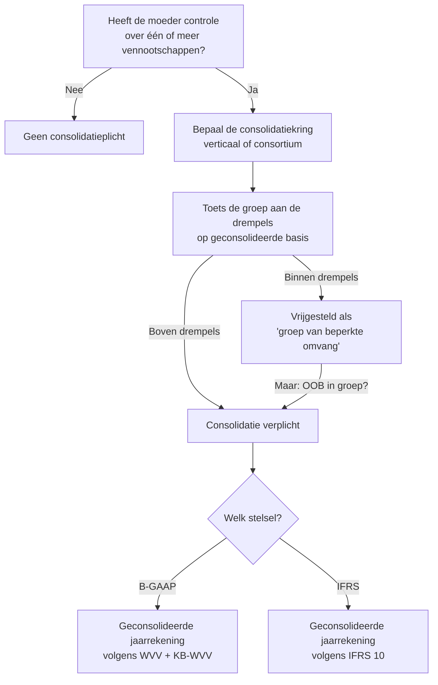
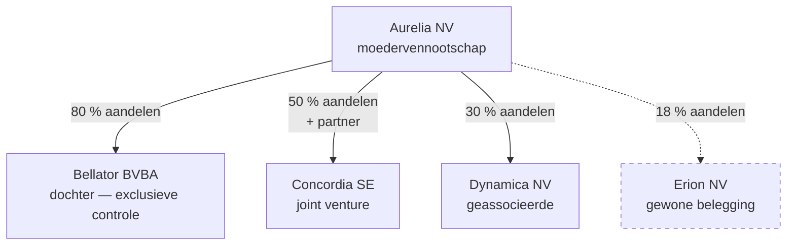

> **Leerstuk — één vraag, helemaal doorgewerkt.** Voor verhaal en routekaart: [[leerpaden/1.4|minicursus PO 1.4]]. Voor definitorische opzoek: zie wikilinks doorheen de tekst.

## Antwoord in één blik

Of een Belgische moedervennootschap moet consolideren, beslis je in **drie opeenvolgende vragen**: (1) is er controle over één of meer andere vennootschappen, (2) wie zit dan in de consolidatiekring, en (3) is de groep groot genoeg dat de wet consolidatie afdwingt? Antwoord je op één van de drie "nee", dan vervalt de plicht.

We werken de drie stappen één voor één uit op een doorgewerkte voorbeeldgroep.

---

## Stap 1 — Is er controle?

Consolidatie heeft pas zin als één vennootschap effectief *baas* is over een andere. Een aandelenpakketje van 5 % maakt je geen moeder; een meerderheid van de stemrechten wél. Tussen die twee uitersten onderscheidt de wet drie niveaus van betrokkenheid, en elk niveau heeft eigen gevolgen voor hoe een deelneming in de geconsolideerde jaarrekening landt:

| Niveau | Hoeveel macht? | Voorbeeld | Hoe in de geconsolideerde JR? |
|---|---|---|---|
| **Exclusieve controle** | Meerderheid van de stemrechten, of contractueel beslissende invloed | Aurelia bezit 80 % van Bellator | [[integrale-consolidatie\|Integrale consolidatie]] — alles 100 % opnemen + minderheidsbelang apart |
| **Gezamenlijke controle** | Twee of meer partners die samen beslissen; geen kan alleen | Aurelia en een partner runnen Concordia 50/50 | [[evenredige-consolidatie\|Evenredige consolidatie]] (B-GAAP) of [[vermogensmutatiemethode\|vermogensmutatiemethode]] (IFRS) |
| **Notabele invloed** | Geen controle, wel zichtbare inspraak (typisch 20-50 %) | Aurelia bezit 30 % van Dynamica | [[vermogensmutatiemethode\|Vermogensmutatiemethode]] — één balanslijn, geen integratie |

Onder 20 % is er geen invloed van betekenis: de deelneming blijft gewoon staan onder de financiële vaste activa van de moeder (klasse 28) en valt buiten elke consolidatiebeweging. Het percentage van 20 % is een **vermoeden**, niet een hard recht — wie met 18 % aantoonbaar de raad van bestuur stuurt, kan toch notabele invloed hebben. Voor het examen volstaat het richtcijfer.

**De controle-vraag is dus niet "is er aandelenbezit?" maar "is er beslissende invloed?".** Dat onderscheid trekt door de hele consolidatieketen heen: het bepaalt of je een entiteit méételt, hoe je ze méételt, en welke posten waar in de geconsolideerde balans landen.

---

## Stap 2 — Wie zit in de consolidatiekring?

Eens er controle is, moet de moeder de groep aflijnen. Er zijn twee mogelijke vormen — verticaal of consortium — en de overgrote meerderheid van de gevallen valt onder de eerste.

In een **verticale groep** — zoals Aurelia hierboven — staat één moeder bovenaan, met dochters, joint ventures en geassocieerde ondernemingen daaronder. De kring omvat de moeder + alle entiteiten waarover ze exclusieve, gezamenlijke of notabele invloed uitoefent. Bellator, Concordia en Dynamica zitten in de kring, elk via een eigen methode. Erion zit er met 18 % *niet* in: te weinig voor invloed van betekenis, dus een gewone belegging op klasse 28.

In een **horizontale groep** — een consortium — zijn er geen aandelenbanden bovenaan, maar bestaat er wel een centraal leidinggevend orgaan of een coördinatie-overeenkomst die meerdere zustervennootschappen aanstuurt. Voor consolidatiedoeleinden worden de consortium-leden dan samen behandeld alsof er één gemeenschappelijke moeder boven hen hing. Zeldzaam in de praktijk, maar een vaste examen-trigger — wie het herkent, wint tijd.

> **Onthoud**: de kring wordt op elke balansdatum opnieuw bepaald. Als Bellator op 31 maart wordt verkocht, valt ze vanaf dat moment uit de kring — met gevolgen voor de cijferweergave (zie verderop en [[wijziging-consolidatiekring]]).

---

## Stap 3 — Is de groep groot genoeg?

Hier zit het meest verwarrende stuk van het hele dossier. Veel stagiairs — en zelfs sommige concept-fiches — struikelen op dit punt, want de drempels die bepalen of een **groep** moet consolideren zijn **niet** dezelfde als die welke bepalen of een individuele **vennootschap** klein is.

### De twee drempel-stelsels

Naast elkaar zien ze er bedrieglijk gelijkaardig uit, maar de cijfers, de meetbasis en de gevolgen verschillen:

| Drempel | **Kleine vennootschap** *(individueel)* | **Groep van beperkte omvang** *(geconsolideerd)* |
|---|---|---|
| Jaargemiddelde werknemers | 50 | **250** |
| Jaaromzet (excl. btw) | ~11,25 mln | **~42,5 mln** |
| Balanstotaal | ~6 mln | **~21,25 mln** |
| Waar gemeten? | Op de individuele jaarrekening | **Op de geconsolideerde basis** (somming alle groepsvennootschappen, na eliminatie van interne stromen) |
| Wat als één drempel overschreden wordt? | Vennootschap blijft klein (max één mag) | Groep blijft "beperkt" (max één mag) |
| Wat als twee of meer overschreden? | Vennootschap wordt groot — pas na twee opeenvolgende boekjaren (consistentiebeginsel) | Groep wordt consolidatieplichtig — eveneens pas na twee opeenvolgende boekjaren |

> De richtcijfers hierboven weerspiegelen de verhoging door de Wet van 28 maart 2024 (omzetting EU-richtlijn 2023/2775). Voor exacte cijfers op examen: volg het Cijferzakboekje — die blijft de gezaghebbende bron, want EU-aanpassingen blijven mogelijk. Tarief-records: [[tarieven/drempels-groep-beperkte-omvang]] en [[tarieven/drempels-kleine-vennootschap]].

De groep-drempels liggen drie tot vier keer hoger dan de venn-drempels. Dat is logisch: van een *groep* verwacht de wetgever een merkbaar grotere aanwezigheid in de markt voor consolidatie wordt afgedwongen. Het praktische gevolg is dat de twee statussen volledig kunnen ontkoppelen: een kleine vennootschap kan tot een grote groep behoren, een grote vennootschap kan in een kleine groep zitten. Behandel de stelsels strikt apart.

### Twee mechanismen binnen één paragraaf (§ 2)

De wet regelt in art. 1:26 § 2 twee aparte zaken die je elk afzonderlijk moet kennen. Ze worden makkelijk door elkaar gehaald omdat ze in dezelfde paragraaf staan, maar functioneel zijn ze onafhankelijk:

| Alinea | Wat regelt het | Waarop letten |
|---|---|---|
| § 2 alinea 1 | **Meetdatum + meetbasis** — de cijfers worden getoetst op de afsluitingsdatum van de jaarrekening van de moeder, op basis van de laatst opgemaakte jaarrekeningen van de te consolideren dochters | Geen tweejaars-vereiste hier; gewoon de juiste timing en bron van de cijfers |
| § 2 alinea 2 | **Tweejaars-regel** (consistentiebeginsel) — een overschrijding (of niet meer overschrijden) heeft pas gevolg wanneer ze zich twee opeenvolgende boekjaren voordoet | Buffer tegen jojo-effect bij tijdelijke pieken; het gevolg gaat in vanaf het boekjaar volgend op het tweede overschrijdings-boekjaar |

Lees ze samen: alinea 1 zegt *waar en wanneer* je meet, alinea 2 zegt *wanneer het gevolg ingaat*. Beide regels gelden parallel. CBN-advies 2022/09 en 2022/03 bevestigen het consistentiebeginsel uitdrukkelijk voor groepen.

### Hoe pas je de drempels toe? Werk een groep door

Pak de Aurelia-groep. De drempel-toets gebeurt op geconsolideerde basis — dus pas na samenvoeging van de individuele cijfers én aftrek van interne stromen. We zetten de tussenstappen naast elkaar:

| | Aurelia NV | Bellator (100 %) | Concordia (50 %) | Intra-groep eliminaties | **Geconsolideerd** |
|---|---:|---:|---:|---:|---:|
| Jaaromzet (mln EUR) | 32 | 22 | 8 | −12 | **50** |
| Balanstotaal (mln EUR) | 16 | 10 | 4 | −4 | **26** |
| Werknemers (gem.) | 150 | 100 | 30 | 0 | **280** |

> **Wat zit waar in?** Bellator (exclusieve controle → integraal) telt volledig mee. Concordia (gezamenlijke controle → evenredig) telt voor 50 %. Dynamica (geassocieerd, vermogensmutatiemethode) telt voor de drempel-toets *niet* mee — VMM raakt de groepscijfers via één balanslijn en doet niet aan integratie. Eliminaties schrappen onderlinge verkopen en vorderingen die anders dubbel in de telling zouden zitten.

Vergelijk de geconsolideerde cijfers met de drempels:

| Drempel | Geconsolideerd | Boven? |
|---|---:|---|
| Werknemers (250) | 280 | **ja** |
| Omzet (~42,5 mln) | 50 mln | **ja** |
| Balanstotaal (~21,25 mln) | 26 mln | **ja** |

Aurelia overschrijdt **drie van de drie** drempels. Als ook het vorige boekjaar meer dan één drempel werd overschreden, dan is Aurelia *grote groep* en consolidatie-plichtig vanaf het lopende boekjaar. Eén jaar boven volstaat dus niet — de tweejaars-regel uit § 2 alinea 2 buffert tegen tijdelijke pieken.

Ter contrast: een fictieve groep Vesta met 180 werknemers, 28 mln omzet en 14 mln balanstotaal blijft op alle drie de fronten onder de drempels. Vesta is dus "groep van beperkte omvang" en vrijgesteld van consolidatie — ondanks haar duidelijke groepsstructuur met meerdere dochters. Een groep zijn maakt je *als zodanig* nog geen consolidatieplichtige groep.

### Vrijstelling kan vervallen

Eén harde uitzondering: zodra **één onderneming in de groep een organisatie van openbaar belang** is (een genoteerde vennootschap, een kredietinstelling, een verzekeraar), valt de vrijstelling volledig weg — ongeacht de drempel-toets. De gedachte is recht voor de raap: het publiek en de toezichthouders verdienen geconsolideerde cijfers, drempels of niet.

---

## Wat als de kring tijdens het boekjaar wijzigt?

De kring is geen statische foto. Een dochter wordt op 1 juli overgenomen. Een associate groeit naar 60 % aandelenbezit en wordt zelf een dochter. Een joint venture wordt verkocht. Voor elk van die scenario's heeft de consolidatie-techniek een specifieke verwerking:

| Gebeurtenis | Wat doe je technisch? |
|---|---|
| Acquisitie tijdens BJ | Eerste-consolidatie op overnamedatum, opname enkel vanaf die datum (pro rata in resultatenrekening) |
| Verkoop tijdens BJ | Opname tot overdrachtsdatum, daarna uit kring; verkoopresultaat in de geconsolideerde resultatenrekening |
| Stap-acquisitie (associate → dochter) | Herwaardering bestaande belang op overnamedatum, dan eerste-consolidatie als dochter |
| Verlies van controle (dochter → associate) | Deconsolideren, restbelang overzetten op vermogensmutatiemethode |

De cijfermatige uitwerking — eerste-consolidatie, eliminaties, deconsolidatie — hoort thuis in [[hoe-consolideren]] en [[wijziging-consolidatiekring]]. Wat hier telt is dat de kring *dynamisch* is. Een snapshot op balansdatum lijkt eenvoudig, maar zodra er midden in het boekjaar iets schuift, moet je timing én proportionaliteit correct verwerken — anders ontstaat er fictieve winst of verdwijnen er resultaten in het niets.

---

## Drie valkuilen

⚠️ **Verwar venn-drempels en groep-drempels niet.** "Klein" zijn als vennootschap is iets totaal anders dan tot een "groep van beperkte omvang" behoren. Aurelia NV individueel zou met haar 150 werknemers en 32 mln omzet wellicht zelf nét boven de venn-drempels uitkomen — maar dat zegt niets over de groep. De groep-toets gebeurt op geconsolideerd niveau, na eliminaties, met cijfers van een ander stelsel.

⚠️ **Vergeet de tweejaars-regel niet.** Eén boekjaar boven de drempels triggert *niets*. Pas wanneer de overschrijding zich twee opeenvolgende boekjaren voordoet, treden de gevolgen in — en dan nog pas vanaf het boekjaar erna. Examen-trap: een groep schiet in BJ N voor het eerst boven meerdere drempels. Moet ze consolideren? Antwoord: nog niet. Wacht op BJ N+1; het gevolg gaat in vanaf BJ N+2.

⚠️ **IFRS heeft geen "kleine groep"-vrijstelling.** Wie onder IFRS rapporteert, valt onder IFRS 10 en moet alle gecontroleerde entiteiten consolideren — drempels of niet. De enige vrijstelling onder IFRS 10 is voorbehouden voor tussenholdings van wie hogerop al een IFRS-conforme geconsolideerde jaarrekening wordt gepubliceerd. Een vaste examen-klassieker: stagiairs projecteren de B-GAAP-drempelvrijstelling op IFRS en lopen tegen een fout antwoord aan.

---

## Wanneer je dit snapt, ga dan naar

- [[hoe-consolideren]] — Hoe pas je een methode toe? Integrale stappen, eliminaties, eerste-consolidatie.
- [[goodwill-bij-consolidatie]] — Wat gebeurt er met het verschil tussen aanschafprijs en aandeel in het netto-vermogen?
- [[rapportering-en-controle-geconsolideerde-jaarrekening]] — Welke documenten levert de groep op en hoe wordt het gecontroleerd?
- [[themafiches/consolidatie|Themafiche Consolidatie]] — voor herhaling vlak vóór het examen.

## Doorklik naar concepten

Voor wie definitorisch detail wil opzoeken:

- [[consolidatieverplichting]] · [[consolidatiekring]] · [[controle-bij-consolidatie]] · [[wijziging-consolidatiekring]]
- [[integrale-consolidatie]] · [[evenredige-consolidatie]] · [[vermogensmutatiemethode]]
- [[geconsolideerde-jaarrekening]]

---

## Wettelijk fundament

- Consolidatieplicht: WVV art. 3:22 e.v. + KB-WVV.
- Definitie *groep van beperkte omvang* (= "kleine groep"): WVV art. 1:26 § 1 — drie criteria op geconsolideerde basis (werknemers, omzet, balanstotaal). Exacte bedragen: Cijferzakboekje. Drempels verhoogd door Wet 28 maart 2024 (omzetting EU-richtlijn 2023/2775).
- Meetdatum + tweejaars-regel (consistentiebeginsel): WVV art. 1:26 § 2 — alinea 1 regelt timing en bron van de cijfers; alinea 2 regelt de tweejaars-overschrijdingsregel.
- Vrijstelling kleine groep: WVV art. 3:25. Vervalt bij genoteerde vennootschap in de groep (en bij analogie OOB): WVV art. 3:27.
- Controle-test: WVV art. 1:14 (controle in rechte/feite) · art. 1:17 (exclusieve controle) · art. 1:18 (gezamenlijke controle) · art. 1:21 (notabele invloed op geassocieerde, 20 %-vermoeden).
- Vrijstelling tussenholding (Belgische dochter van EU-moeder die zelf consolideert): WVV art. 3:26.
- IFRS-pad: IFRS 10 *Consolidated Financial Statements* (controle-test + verplichting) · IAS 28 §5 (20 %-vermoeden notabele invloed). Geen algemene drempel-vrijstelling.
- Toelichting consistentiebeginsel voor groepen: CBN-advies 2022/09 + CBN-advies 2022/03.

---

*Leerstuk PO 1.4. Status: voorgesteld — POC voor ADR-037.*
