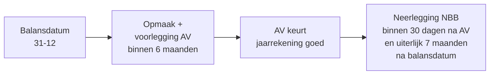

> **Leerstuk — één vraag, helemaal doorgewerkt.** Dit leerstuk dekt het **enkelvoudige** deel van PO 1.4: zes van de zeven officiële doelstellingen (eindejaarsverrichtingen, waarderingsregels, proefbalans, schema-keuze, resultaatbestemming, sociale balans). Voor consolidatie zie [[wat-is-een-geconsolideerde-jaarrekening]] en verder. Voor verhaal en routekaart: [[leerpaden/1-4|minicursus PO 1.4]].

## Antwoord in één blik

Een individuele jaarrekening rolt niet vanzelf uit de boekhouding — ze wordt **opgemaakt** in vier hoofdtaken. Eerst pas je waarderingsregels toe via een reeks **eindejaarsverrichtingen** (afschrijvingen, voorraadwaardering, voorzieningen, overlopende rekeningen). Vervolgens stel je een **proefbalans** op om te controleren dat alle saldi sluiten. Dan kies je het juiste **schema** (volledig, verkort of micro) op basis van de groottecategorie van de vennootschap, en bereid je de **resultaatbestemming** voor die de algemene vergadering zal beslissen. Daarbovenop komen afhankelijk van de grootte enkele aanvullende onderdelen — de sociale balans, een toelichting, eventueel een jaarverslag.

| Taak | Inhoud | Wettelijke deadline |
|---|---|---|
| 1. Eindejaarsverrichtingen | Afschrijvingen, voorraad, voorzieningen, overlopende posten | Voor opmaak |
| 2. Proefbalans | Controle: Σ debet = Σ credit; balans- en resultaatposten splitsen | Voor opmaak |
| 3. Schema-keuze + opmaak | Volledig / verkort / micro, naargelang grootte | **6 maanden** na balansdatum |
| 4. Resultaatbestemming voorstellen | Reserves, dividend, overdracht | Voor AV |
| 5. AV keurt goed | Stemming over jaarrekening en resultaatbestemming | **6 maanden** na balansdatum |
| 6. Neerlegging bij NBB | Digitaal via XBRL | **30 dagen** na AV, **max 7 maanden** na balansdatum |

We illustreren doorheen dit leerstuk aan de hand van **Aurelia NV** — een mock Belgische vennootschap (NV, individuele balans 30,0 mln, omzet 38,0 mln, resultaat 1,8 mln vóór bestemming). Aurelia gebruiken we hier op enkelvoudig niveau, los van haar groep.

---

## Eindejaarsverrichtingen — de hartoperatie

Zonder eindejaarsverrichtingen geeft de boekhouding op 31 december een onvolledig beeld. Het matching-beginsel vraagt dat opbrengsten en kosten worden toegerekend aan de periode waarin ze economisch thuishoren — niet aan de periode waarin het geld toevallig is binnen- of uitgegaan. Daarnaast verlangt het voorzichtigheidsbeginsel dat verwachte verliezen al worden geboekt, terwijl niet-gerealiseerde winsten dat nog niet zijn. Eindejaarsverrichtingen zijn de boekhoudkundige correcties die dat in orde brengen.

Op het examen moet je de zes families onmiddellijk kunnen opsommen en per familie weten wat ze doen. Hieronder een overzicht met telkens een concrete invulling bij Aurelia.

| Familie | Wat doe je? | Voorbeeld bij Aurelia |
|---|---|---|
| Afschrijvingen | Verminder boekwaarde vaste activa volgens het afschrijvingsplan | Gebouwen 12 mln, lineair over 30 jaar → 0,4 mln afschrijving |
| Voorraadwaardering | Inventaris + waarderen aan kostprijs of lagere marktwaarde | Voorraad 5,0 mln — handelsgoederen aan FIFO, marktwaarde-check |
| Overlopende rekeningen | Schuif vooraf betaalde kosten en nog te ontvangen opbrengsten naar de juiste periode | Vooraf betaalde verzekering: 0,1 mln overlopend actief |
| Voorzieningen | Erken toekomstige uitgaven (risico's, geschillen, herstructurering) | Voorziening voor garantieverplichtingen: 0,3 mln |
| Waardeverminderingen | Op vorderingen die mogelijk niet inbaar zijn | Dubieuze debiteuren: 0,15 mln waardevermindering |
| Wisselkoers-aanpassingen | Activa en passiva in vreemde valuta op slotkoers | Niet van toepassing bij Aurelia (enkel EUR) |

> **Afschrijving is geen kasstroom.** Een veelgemaakte denkfout: een afschrijving van 0,4 mln op de gebouwen betekent dat 0,4 mln "uit de kas" zou gaan. Dat klopt niet — de uitgave gebeurde bij aankoop. De afschrijving spreidt enkel de boekhoudkundige kost over de gebruiksjaren. Wat economisch verdwijnt, is een stuk *gebruikswaarde* van het gebouw, niet liquide middelen. Vandaar dat afschrijving in de kasstroomanalyse weer opgeteld wordt bij het resultaat.

Niet elke vennootschap kent elke familie even intens. Een dienstenvennootschap zonder voorraad heeft geen voorraadwaardering nodig; een binnenlandse vennootschap zonder buitenlandse vorderingen kent geen wisselkoersaanpassingen. Maar op het examen wordt je niet gevraagd om het toe te passen op één specifiek geval — je moet de hele matrix kennen en kunnen verklaren wát elke familie doet en wáarom.

---

## De proefbalans

De proefbalans is geen jaarrekening op zich, maar de **controletool** waarmee je vóór de opmaak nakijkt of de boekhouding intern klopt. Ze geeft per rekening (klassen 1 tot en met 9 van het MAR) de totale debet- en creditbedragen en het saldo. Als de boekhouding correct dubbel is geboekt, geldt:

$$\sum \text{debet} = \sum \text{credit}$$

Dat lijkt triviaal, maar het is de eerste hard-test op alle boekingen van het jaar. Een verschil van één eurocent betekent een fout ergens — een vergeten tegenboeking, een verkeerde rekening, een omzetting met verkeerd teken.

In de praktijk werk je met **twee** proefbalansen na elkaar. De **voorafgaande proefbalans** wordt opgesteld vóór de eindejaarsverrichtingen — ze toont de boekhouding zoals ze "ruw" stond op 31 december. Daarna boek je de eindejaarsverrichtingen (afschrijvingen, voorzieningen, overlopende posten). Op die nieuwe staat van de boekhouding bouw je de **saldibalans** — dat is de proefbalans *na* eindejaarsverrichtingen. Het is die saldibalans die de basis vormt voor de jaarrekening zelf.

De volgende stap is een denkstap, niet een boekingstap: je splitst de rekeningen tussen wat naar de **balans** gaat (klassen 1 tot 5: kapitaal en reserves, voorzieningen, schulden, activa, vorderingen) en wat naar de **resultatenrekening** gaat (klassen 6 en 7: kosten en opbrengsten). Klassen 8 en 9 (resultaatverwerking) hangen er apart aan.

Voor Aurelia ziet die overgang er versimpeld zo uit. De proefbalans toont op 31 december onder meer een saldo van 12,0 mln op de gebouwen-rekening (klasse 2) — dat wordt een actiefpost. Een saldo van 38,0 mln op de omzet-rekening (klasse 7) — dat wordt een opbrengstpost. Een saldo van 4,0 mln op de handelsdebiteuren (klasse 4) — actiefpost. En het balanstotaal van Aurelia rolt uit op 30,0 mln, met een resultaat na bedrijfskosten van 1,8 mln dat dán pas — via de resultaatverwerkings-rekeningen — verdeeld zal worden.

> **Klein technisch onderscheid op het examen.** De proefbalans (Σ debet = Σ credit per rekening) en de **balans** (activa = passiva) zijn niet hetzelfde document. De proefbalans is een interne controlestaat per rekening; de balans is een gepresenteerd overzicht volgens KB-WVV-schema (activa I-VIII, passiva I-X). Wie op een examenvraag "proefbalans" vermeldt waar "balans" gevraagd is, mist een punt.

---

## Volledig, verkort of micro?

Het Wetboek van vennootschappen en verenigingen voorziet drie schema's voor de jaarrekening. Welk schema je moet — of mag — gebruiken, hangt af van de **groottecategorie** van de vennootschap: klein, micro of niet-klein (grootte-categorie *groot*). De drempels worden gemeten op balansdatum en met de tweejaars-regel: een overschrijding heeft pas gevolgen als ze zich in **twee opeenvolgende boekjaren** voordoet.

De exacte drempelbedragen staan in het Cijferzakboekje en in de drie aparte tarief-records — niet in dit leerstuk, want ze zijn met de Wet van 28 maart 2024 verhoogd en kunnen opnieuw wijzigen.

- Drempels kleine vennootschap: [[tarieven/drempels-kleine-vennootschap]]
- Drempels microvennootschap: [[tarieven/drempels-microvennootschap]]
- Orde van grootte: ~50 werknemers VTE · ~11 mln omzet · ~6 mln balanstotaal voor "klein" sinds de verhoging 2024.

| Schema | Voor wie? | Inhoud |
|---|---|---|
| **Volledig** | Niet-kleine (grote) vennootschap | Volledige balans, volledige resultatenrekening, uitgebreide toelichting, jaarverslag, sociale balans, commissarisverslag |
| **Verkort** | Kleine vennootschap | Verkorte balans en resultatenrekening, verkorte toelichting; sociale balans alleen indien rechtsvorm dat vereist; geen verplicht jaarverslag |
| **Micro** | Microvennootschap | Micro-balans en micro-resultatenrekening, zeer beperkte toelichting; geen sociale balans; geen jaarverslag |

Aurelia heeft op enkelvoudig niveau een omzet van 38,0 mln en een balanstotaal van 30,0 mln — ruim boven de drempels voor "klein". Op enkelvoudig niveau is Aurelia dus een **grote** vennootschap en moet ze het volledige schema gebruiken.

> **Schema-keuze beïnvloedt publicatie, niet boekhouding.** De boekhoudplicht zelf — dagboeken, MAR, dubbel boekhouden — geldt voor élke vennootschap, ongeacht groottecategorie. Wat verandert per schema is uitsluitend wat je naar buiten brengt: hoeveel detail in de balans, welke staten in de toelichting, wel of geen jaarverslag, wel of geen sociale balans. Een microvennootschap voert intern dezelfde dubbele boekhouding als een grote vennootschap; ze publiceert er enkel een veel beknopter overzicht van.

De schema-keuze speelt ook door in andere domeinen dan boekhouden. Het verlaagde tarief vennootschapsbelasting (20% op de eerste schijf in plaats van 25%) is een gunst voor *kleine* vennootschappen in de zin van het WVV — niet voor middelgrote, niet voor grote. Dezelfde drempel-toets bepaalt dus tegelijk je publicatieplicht *en* je VenB-tarief. Voor wie ergens in de buurt van de drempel zit, kan een gewonnen of verloren VTE in een gegeven boekjaar fiscaal aanzienlijk wegen.

---

## Wat met de winst? Resultaatbestemming

Een vennootschap die winst maakt, moet beslissen wat ermee gebeurt. Die beslissing — de **resultaatbestemming** — is geen vrije keuze van het bestuur: de wet schrijft een **volgorde** voor die in een vaste cascade moet worden afgewerkt. Het bestuursorgaan *stelt voor*; de **algemene vergadering** *beslist*.

De cascade in haar logische volgorde, met Aurelia's 1,3 mln te-bestemmen-resultaat (na vennootschapsbelasting, illustratief) als rode draad:

| Stap | Wat? | Aurelia (illustratie) |
|---|---|---:|
| 1. Verlies aanzuiveren | Onttrekking aan reserves om historisch verlies te dekken | Niet van toepassing (winst) |
| 2. Wettelijke reserve | 5 % van het resultaat tot de reserve 10 % van het kapitaal bereikt (NV) | 0,1 mln (5 % × 1,3) |
| 3. Andere reserves | Statutair of facultatief op voorstel van het bestuur | 0,0 mln |
| 4. Dividenden | Voorgesteld door bestuur, beslist door AV | 0,8 mln |
| 5. Tantièmes | Vergoeding bestuurders, indien statutair voorzien | 0,0 mln |
| 6. Overdracht naar volgend boekjaar | Restsaldo naar "Overgedragen winst" | 0,4 mln |

> **De BV en CV vragen een dubbele uitkeringstest.** Voor de NV blijft de logica klassiek: zolang het netto-actief ná uitkering boven het volstort-of-opgevraagd kapitaal blijft, mag dividend uitgekeerd worden. Sinds de invoering van het WVV in 2019 hebben de BV en CV **geen kapitaal** meer als vermogensbescherming; in ruil moet het bestuursorgaan twee aparte testen doorlopen vóór een uitkering. De **balanstest** kijkt of het netto-actief positief blijft na de uitkering, rekening houdend met onbeschikbare reserves. De **liquiditeitstest** kijkt vooruit: kan de vennootschap haar opeisbare schulden gedurende ten minste twaalf maanden na de uitkering nog tijdig betalen? Faalt één van beide testen, dan kan en mag de uitkering niet doorgaan — zelfs als de algemene vergadering ze al had beslist. Dit verklaart waarom in een BV de zaakvoerder zijn dividend-voorstel altijd schriftelijk moet verantwoorden, en waarom commissarissen die testen op het examen graag bevragen.

De volgorde is geen suggestie. Een AV die rechtstreeks dividend zou beslissen zonder eerst de wettelijke reserve te voeden (in een NV waar de 10 %-grens nog niet bereikt is) overtreedt de wet. Hetzelfde geldt voor een BV waar de balanstest faalt: het AV-besluit krijgt dan geen uitwerking en het bestuursorgaan mag de uitkering eenvoudigweg niet uitvoeren.

---

## Sociale balans

De sociale balans is een **integrerend onderdeel** van de jaarrekening — geen apart document zoals het jaarverslag, maar een set staten die ingebed zit in de toelichting van een vennootschap die haar volledig schema indient. De wettelijke basis ligt buiten het WVV: in de Wet van 22 december 1995 en het bijbehorende uitvoeringsbesluit van 4 augustus 1996.

Inhoudelijk dekt de sociale balans drie blokken: een **staat van het tewerkgestelde personeel** (aantallen, gepresteerde uren, personeelskosten), een **staat van de personeelsbewegingen** (in- en uitstroom), en een **staat van de opleidingen** (formeel én informeel, gevolgde uren en kosten). Doelpubliek: de sociale partners, de overheid en de gebruikers van de jaarrekening die de groep willen beoordelen op werkgelegenheidsbeleid en HR-inspanningen.

Twee scope-vragen komen op het examen regelmatig terug.

Eerst: **welk personeelsbestand?** Onder de sociale-balans-regels worden de werknemers ingeschreven in DIMONA opgenomen — dat is de hoofdcategorie. Daarnaast wordt een aparte staat voorzien voor "uitzendkrachten en personen ter beschikking gesteld van de onderneming" — dat zijn de externen die feitelijk meewerken maar formeel bij een andere werkgever staan. Beide categorieën worden afzonderlijk gerapporteerd.

> **Statutair tewerkgestelden — een typische val.** Statutaire werknemers (typisch in publiekrechtelijke context) zijn in beginsel niet ingeschreven in het personeelsregister zoals bedoeld in de wet, en horen daarom niet in de hoofd-staat van de sociale balans. Het CBN-advies S100 en het herwerkte advies 2009/12 maken het expliciet: tenzij de vennootschap die statutairen *wel* in haar personeelsregister opneemt — wat sommige gemengde structuren doen — vallen ze buiten de scope van de gewone sociale-balans-staten. Wie hier mechanisch het hele personeelsbestand opneemt, rapporteert te veel.

Tweede examen-val: **welke vennootschappen?** De sociale balans is verplicht voor vennootschappen die het volledige schema indienen — dus de niet-kleine vennootschappen. Een **kleine** vennootschap moet enkel een **verkorte** sociale balans opnemen, en dan nog enkel als ze één van een aantal aangewezen rechtsvormen aanneemt (typisch NV, BV en CV). Een **microvennootschap** is daarvan vrijgesteld. Specifieke vrijstelling op de NBB-bezorging geldt voor sommige VOF's en commanditaire vennootschappen onder bepaalde voorwaarden.

Verwar de sociale balans niet met het **jaarverslag**. Het jaarverslag is een aparte beschrijvende rapportage van het bestuursorgaan over het beleid, de risico's en de duurzaamheid; de sociale balans is een ingebedde statistiek in de jaarrekening. Twee documenten, twee statuten, twee wettelijke regimes.

---

## Termijnen en publicatie bij de NBB

De jaarrekening volgt een vaste tijdslijn waarvan elke stap een eigen wettelijke deadline heeft. Wie de keten begrijpt, vergeet ze niet meer op het examen.

De **opmaak** gebeurt door het bestuursorgaan. Dat is een formele wettelijke opdracht — het bestuursorgaan is verantwoordelijk voor de juistheid van de cijfers en voor de naleving van de waarderingsregels. Voor Aurelia met balansdatum 31 december 2026 betekent dit: de jaarrekening moet uiterlijk 30 juni 2027 voorgelegd zijn aan de gewone algemene vergadering. In de praktijk wordt de AV daarom op een datum gepland binnen die termijn van zes maanden, met de bekendmaking, het verslag van de commissaris en de stemming over de resultaatbestemming op één agendapunt.

Na de goedkeuring door de AV begint een tweede klok te tikken: de **neerlegging bij de Nationale Bank van België** moet gebeuren binnen **dertig dagen** na de goedkeuring, en in elk geval uiterlijk **zeven maanden** na de balansdatum. Voor Aurelia: uiterlijk 31 juli 2027. Sinds 2022 verloopt die neerlegging uitsluitend digitaal, in **XBRL**-formaat, via de NBB-applicatie. De papieren neerlegging is afgeschaft voor de gangbare schema's.

De sancties bij overschrijding van die termijnen zijn van twee verschillende ordes — en dat onderscheid leeft typisch slecht bij stagiairs.

Een **late neerlegging** triggert in eerste instantie een **tariefverhoging** voor de publicatiekost bij de NBB zelf — een soort administratieve boete die in het Cijferzakboekje als tariefschaal staat. Bij hardnekkige niet-neerlegging kan de **ondernemingsrechtbank** op vordering van een belanghebbende of het openbaar ministerie de **gerechtelijke ontbinding** van de vennootschap uitspreken. De rechtbank verleent in dat geval een regularisatietermijn van minstens drie maanden; pas daarna kan de ontbinding effectief worden uitgesproken.

Daarnaast kan de **fiscus** vermeerderingen aanrekenen wanneer dezelfde laattijdigheid de **aangifte vennootschapsbelasting** raakt — maar dat zijn aparte sancties uit het Wetboek inkomstenbelastingen, niet uit het vennootschapsrecht. Op het examen wordt verwacht dat je het onderscheid maakt: publicatiesancties bij de NBB en gerechtelijke ontbinding op het WVV-pad, fiscale vermeerderingen op het WIB-pad.

> **De wet over de gevolgen van een laattijdige voorlegging aan de AV.** Zelfs als de zes maanden voor de voorlegging aan de AV worden overschreden, blijft de jaarrekening intern bestaan — ze is niet "nietig" door de laattijdigheid. Wel geldt een wettelijk vermoeden: door derden geleden schade wordt geacht voort te vloeien uit het verzuim, behoudens tegenbewijs. Dat is een aansprakelijkheidsregel die de bestuurder rechtstreeks raakt. Tijd-discipline is dus niet alleen een formaliteit — ze is een bescherming tegen persoonlijke aansprakelijkheid.

---

## Wanneer je dit snapt, ga dan naar

- [[wat-is-een-geconsolideerde-jaarrekening]] — als de groep-context speelt: een moeder met dochters maakt naast de individuele jaarrekening ook een geconsolideerde op.
- [[rapportering-en-controle-geconsolideerde-jaarrekening]] — voor de commissariscontrole en het jaarverslag op groepsniveau; de logica geldt grotendeels ook voor de individuele jaarrekening van een grote vennootschap met commissaris.
- [[themafiches/boekhouding|Themafiche Boekhouding]] — voor herhaling van de eindejaarsverrichtingen en de schema-keuze vlak vóór het examen.

## Doorklik naar concepten

Voor wie definitorisch detail wil opzoeken:

- [[jaarrekening]] · [[vennootschap-groottecategorieen]]

---

## Wettelijk fundament

- Verplichting tot opmaak van de jaarrekening + verantwoordelijkheid van het bestuursorgaan + voorleggingstermijn van zes maanden aan de algemene vergadering: WVV art. 3:1.
- Neerlegging bij de Nationale Bank van België — binnen dertig dagen na goedkeuring door de AV en uiterlijk zeven maanden na de afsluitingsdatum: WVV art. 3:10.
- Groottecategorieën van vennootschappen (klein, micro) + tweejaars-regel: WVV art. 1:24 (klein) · WVV art. 1:25 (micro). Exacte drempels: zie Cijferzakboekje en tarief-records [[tarieven/drempels-kleine-vennootschap]] + [[tarieven/drempels-microvennootschap]] (verhoogd door de Wet van 28 maart 2024).
- Waarderingsregels op enkelvoudig niveau (algemene beginselen + bijzondere bepalingen): KB-WVV art. 3:1 en volgende.
- Resultaatbestemming en uitkeringen — netto-actief- en liquiditeitstest voor de BV: WVV art. 5:142-5:143 · voor de CV: WVV art. 6:115-6:116 · klassieke netto-actiefregel voor de NV: WVV art. 7:212-7:214.
- Sociale balans: Wet van 22 december 1995 (art. 45 e.v.) + KB van 4 augustus 1996. Scope-vragen: CBN-advies S100 (oorspronkelijke vragenronde) en CBN-advies 2009/12 (statutaire werknemers).
- Gerechtelijke ontbinding bij niet-naleving van de neerleggingsplicht: WVV art. 2:70 (op vordering van een belanghebbende of het openbaar ministerie; regularisatietermijn van minstens drie maanden).
- Tariefverhoging publicatiekosten NBB bij laattijdige neerlegging: zie tarief-record [[tarieven/publicatiekosten-jaarrekening]].
- Sancties op fiscaal vlak bij laattijdige aangifte VenB (te onderscheiden van de WVV-sancties): WIB art. 444 (administratieve belastingverhoging) · WIB art. 218 (vermeerdering bij ontoereikende voorafbetalingen, indirect verband).

---

*Leerstuk PO 1.4. Status: nieuw — gerenderd uit script + Aurelia-voorbeeldgroep (enkelvoudig niveau).*
