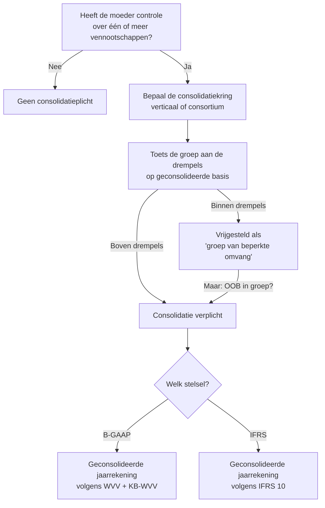
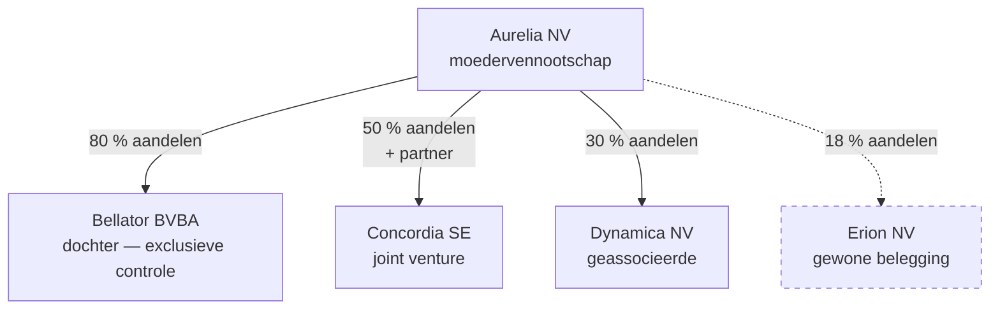

> **Leerstuk — één vraag, helemaal doorgewerkt.** Voor verhaal en routekaart: [[leerpaden/1.4|minicursus PO 1.4]]. Voor definitorische opzoek: zie wikilinks doorheen de tekst.

## Antwoord in één blik

Of een Belgische moedervennootschap moet consolideren beslis je in **drie opeenvolgende vragen**: (1) is er controle over één of meer andere vennootschappen, (2) wie zit dan in de consolidatiekring, en (3) is de groep groot genoeg dat de wet consolidatie afdwingt? Als je op één van de drie "nee" antwoordt, vervalt de plicht.

We werken de drie stappen één voor één uit, en passen ze in de loop van het leerstuk toe op een doorgewerkte voorbeeldgroep.

---

## Stap 1 — Is er controle?

Consolidatie heeft maar zin als één vennootschap echt *baas* is over een andere. Een aandelenpakket van 5 % maakt je geen moeder; een meerderheid van de stemrechten wél. De wet onderscheidt drie niveaus van betrokkenheid bij een andere vennootschap, en elk niveau heeft eigen gevolgen voor de consolidatie:

| Niveau | Hoeveel macht? | Voorbeeld | Hoe in de geconsolideerde JR? |
|---|---|---|---|
| **Exclusieve controle** | Meerderheid van de stemrechten, of contractueel beslissende invloed | Aurelia bezit 80 % van Bellator | [[integrale-consolidatie\|Integrale consolidatie]] — alles 100 % opnemen + minderheidsbelang apart |
| **Gezamenlijke controle** | Twee of meer partners die samen beslissen; geen kan alleen | Aurelia en een partner runnen Concordia 50/50 | [[evenredige-consolidatie\|Evenredige consolidatie]] (B-GAAP) of [[vermogensmutatiemethode\|vermogensmutatiemethode]] (IFRS) |
| **Notabele invloed** | Geen controle, wel zichtbare inspraak (typisch 20-50 %) | Aurelia bezit 30 % van Dynamica | [[vermogensmutatiemethode\|Vermogensmutatiemethode]] — één balanslijn, geen integratie |

Onder 20 % is er geen invloed van betekenis en valt de deelneming gewoon op klasse 28 in de individuele balans van de moeder — geen consolidatie. Het percentage is een **vermoeden**, geen hard recht: als je met 18 % toch de raad van bestuur stuurt, kan er notabele invloed zijn. Voor het examen volstaat het richtcijfer.

**De controle-vraag is dus niet "is er aandelenbezit?" maar "is er beslissende invloed?".** Dat onderscheid is voor de hele consolidatie-keten bepalend.

---

## Stap 2 — Wie zit in de consolidatiekring?

Eenmaal er controle is, moet je de groep aflijnen. Er zijn twee mogelijke vormen:

In een **verticale groep** (zoals hierboven) staat één moeder bovenaan met dochters, joint ventures en geassocieerde ondernemingen daaronder. De kring omvat de moeder + alle entiteiten waarover ze exclusieve, gezamenlijke of notabele controle uitoefent. Erion zit *niet* in de kring (geen invloed van betekenis).

In een **horizontale groep** (consortium) zijn er geen aandelenbanden bovenaan maar wel een centraal leidinggevend orgaan of een coördinatie-overeenkomst die meerdere zustervennootschappen aanstuurt. Voor consolidatiedoeleinden worden de consortium-leden samen behandeld alsof er één gemeenschappelijke moeder was. Zeldzaam in de praktijk, vaste examen-trigger.

**Onthoud**: de kring wordt opnieuw bepaald op elke balansdatum. Als Bellator op 31 maart verkocht wordt, valt ze vanaf dan uit de kring — met gevolgen voor de cijferweergave (zie [[wijziging-consolidatiekring]]).

---

## Stap 3 — Is de groep groot genoeg?

Hier zit het meest verwarrende stuk van het hele dossier — en de plek waar veel stagiairs en zelfs concept-fiches struikelen. De drempels die bepalen of een **groep** moet consolideren, zijn **niet** dezelfde als de drempels die bepalen of een **vennootschap** klein is.

### De twee drempel-stelsels

Onderstaande tabel zet de twee stelsels naast elkaar voor het begrip — voor de exact actuele bedragen verwijst elke kolom door naar het bijhorende tarief-record (single source of truth).

| Drempel | [[tarieven/drempels-kleine-vennootschap\|Kleine vennootschap]] *(individueel)* | [[tarieven/drempels-groep-beperkte-omvang\|Groep van beperkte omvang]] *(geconsolideerd)* |
|---|---|---|
| Jaargemiddelde werknemers | 50 | **250** |
| Jaaromzet (excl. btw) | ~11,25 mln | **~42,5 mln** |
| Balanstotaal | ~6 mln | **~21,25 mln** |
| Waar gemeten? | Op de individuele jaarrekening | **Op de geconsolideerde basis** (somming alle groepsvennootschappen, na eliminatie van interne stromen) |
| Wat als één drempel overschreden wordt? | Vennootschap blijft klein (max één mag) | Groep blijft "beperkt" (max één mag) |
| Wat als twee of meer overschreden? | Vennootschap wordt groot — pas na twee opeenvolgende boekjaren (consistentiebeginsel) | Groep wordt consolidatieplichtig — eveneens pas na twee opeenvolgende boekjaren |

> De exacte bedragen leven in [[tarieven/drempels-kleine-vennootschap]] en [[tarieven/drempels-groep-beperkte-omvang]] — daar staat ook de wetsverwijzing, de geldigheidsperiode en de wijzigingsbron (Wet 28 maart 2024 / EU-richtlijn 2023/2775). De richtcijfers hierboven zijn er voor het begrip van de verhouding tussen beide stelsels; bij toepassing op examen of dossier raadpleeg je het tarief-record of het Cijferzakboekje.

De groep-drempels liggen drie tot vier keer hoger dan de venn-drempels — logisch, want je verwacht van een groep méér aanwezigheid in de markt voor de wet consolidatie eist. Een kleine vennootschap kan tot een grote groep behoren; een grote vennootschap kan in een kleine groep zitten. Verwar de twee stelsels niet.

### Twee mechanismen binnen één paragraaf (§ 2)

De wet regelt in art. 1:26 § 2 twee aparte zaken die je elk apart moet onthouden — ze worden gemakkelijk door elkaar gehaald:

| Alinea | Wat regelt het | Waarop letten |
|---|---|---|
| § 2 alinea 1 | **Meetdatum + meetbasis** — de cijfers worden getoetst op de afsluitingsdatum van de jaarrekening van de moeder, op basis van de laatst opgemaakte jaarrekeningen van de te consolideren dochters | Geen tweejaars-vereiste hier; gewoon de juiste timing en bron van de cijfers |
| § 2 alinea 2 | **Tweejaars-regel** (consistentiebeginsel) — een overschrijding (of niet meer overschrijden) heeft pas gevolg wanneer ze zich twee opeenvolgende boekjaren voordoet | Buffer tegen jojo-effect bij tijdelijke pieken; het gevolg gaat in vanaf het boekjaar volgend op het tweede overschrijdings-boekjaar |

Lees ze samen: alinea 1 zegt *waar en wanneer* je meet, alinea 2 zegt *wanneer het gevolg ingaat*. Beide regels gelden parallel. CBN-advies 2022/09 + 2022/03 bevestigen het consistentiebeginsel voor groepen via uitdrukkelijke verwijzing.

### Hoe pas je de drempels toe? Werk een groep door

Neem groep Aurelia. We zetten de individuele cijfers naast de geconsolideerde berekening — pas op de geconsolideerde getallen wordt de drempel-toets gedaan.

| | Aurelia NV | Bellator (100 %) | Concordia (50 %) | Intra-groep eliminaties | **Geconsolideerd** |
|---|---:|---:|---:|---:|---:|
| Jaaromzet (mln EUR) | 32 | 22 | 8 | −12 | **50** |
| Balanstotaal (mln EUR) | 16 | 10 | 4 | −4 | **26** |
| Werknemers (gem.) | 150 | 100 | 30 | 0 | **280** |

> Bellator zit volledig in de telling (exclusieve controle → integraal). Concordia zit voor 50 % in de telling (gezamenlijke controle → evenredig). Dynamica (geassocieerd) zit *niet* in de drempel-telling — de vermogensmutatiemethode raakt de groepscijfers via één balanslijn en telt voor de drempel-toets niet mee. Eliminaties verwijderen onderlinge verkopen en vorderingen die anders dubbel zouden tellen.

Toets tegen [[tarieven/drempels-groep-beperkte-omvang]]:

| Drempel | Geconsolideerd | Boven? |
|---|---:|---|
| Werknemers (250) | 280 | **ja** |
| Omzet (~42,5 mln) | 50 mln | **ja** |
| Balanstotaal (~21,25 mln) | 26 mln | **ja** |

Aurelia overschrijdt **drie van de drie** drempels. Als ook het vorige boekjaar meer dan één drempel overschreden — dan is Aurelia een grote groep en consolidatie-plichtig. Eén jaar boven volstaat dus *niet*: de tweejaars-regel (§ 2 alinea 2) buffert tegen tijdelijke pieken.

Vergelijk met een groep Vesta met 180 werknemers, 28 mln omzet en 14 mln balanstotaal: alle drie ruim onder de drempels. Vesta blijft "groep van beperkte omvang" en is vrijgesteld van consolidatie ondanks de duidelijke groepsstructuur — drie dochters maken nog geen consolidatieplichtige groep.

### Vrijstelling kan vervallen

Eén harde uitzondering op de vrijstelling: zodra **één onderneming in de groep een organisatie van openbaar belang** is (genoteerde vennootschap, kredietinstelling, verzekeraar), valt de vrijstelling weg ongeacht de drempel-toets. De gedachte: het publiek en de toezichthouders verdienen consolidatie-cijfers, drempels of niet.

---

## Wat als de kring tijdens het boekjaar wijzigt?

Een dochter wordt overgenomen op 1 juli. Een associate groeit naar 60 % aandelenbezit (= dochter wordt). Een joint venture wordt verkocht. Telkens moet de boekhouder:

| Gebeurtenis | Wat doe je technisch? |
|---|---|
| Acquisitie tijdens BJ | Eerste-consolidatie op overnamedatum, opname enkel vanaf die datum (pro rata in resultatenrekening) |
| Verkoop tijdens BJ | Opname tot overdrachtsdatum, daarna uit kring; verkoopresultaat in de geconsolideerde resultatenrekening |
| Stap-acquisitie (associate → dochter) | Herwaardering bestaande belang op overnamedatum, dan eerste-consolidatie als dochter |
| Verlies van controle (dochter → associate) | Deconsolideren, restbelang overzetten op vermogensmutatiemethode |

Details horen in [[hoe-consolideren]] en [[wijziging-consolidatiekring]] — wat hier telt is dat de kring een *dynamisch* gegeven is. Een snapshot op balansdatum lijkt eenvoudig, maar bij wijzigingen tijdens het jaar moet je timing en proportionaliteit correct verwerken.

---

## Drie valkuilen

⚠️ **Verwar venn-drempels en groep-drempels niet.** "Klein" als vennootschap ≠ "groep van beperkte omvang". De Aurelia-groep hierboven zou met haar 240 werknemers vermoedelijk *binnen* de venn-drempel passen voor de individuele moeder, maar de groep-drempel-toets gebeurt op geconsolideerd niveau en kan gewoon plichtig zijn.

⚠️ **Vergeet de tweejaars-regel niet.** Eén boekjaar boven de drempels triggert *niets* — art. 1:26 § 2 alinea 2 wacht op een tweede opeenvolgend boekjaar. Examen-trap: een groep schiet in BJ N voor het eerst boven meer dan één drempel — moet ze consolideren? Antwoord: nog niet. Volg BJ N+1 af. Het gevolg gaat dan in vanaf BJ N+2.

⚠️ **IFRS heeft geen "kleine groep"-vrijstelling.** Wie onder IFRS rapporteert, valt onder IFRS 10 en moet alle gecontroleerde entiteiten consolideren — drempels of niet. Enige vrijstelling onder IFRS 10 is voor tussenholdings van wie hogerop al een IFRS-conforme geconsolideerde jaarrekening publiceert. Examen-klassieker.

---

## Wanneer je dit snapt, ga dan naar

- [[hoe-consolideren]] — Hoe pas je een methode toe? Integrale stappen, eliminaties, eerste-consolidatie.
- [[goodwill-bij-consolidatie]] — Wat gebeurt er met het verschil tussen aanschafprijs en aandeel in het netto-vermogen?
- [[rapportering-en-controle-geconsolideerde-jaarrekening]] — Welke documenten levert de groep op en hoe wordt het gecontroleerd?
- [[themafiches/consolidatie|Themafiche Consolidatie]] — voor herhaling vlak vóór het examen.

## Doorklik naar concepten

Voor wie definitorisch detail wil opzoeken:

- [[consolidatieverplichting]] · [[consolidatiekring]] · [[controle-bij-consolidatie]] · [[wijziging-consolidatiekring]]
- [[integrale-consolidatie]] · [[evenredige-consolidatie]] · [[vermogensmutatiemethode]]
- [[geconsolideerde-jaarrekening]]

---

## Wettelijk fundament

- Consolidatieplicht: WVV art. 3:22 e.v. + KB-WVV.
- Definitie *groep van beperkte omvang* (= "kleine groep"): WVV art. 1:26 § 1 — drie criteria op geconsolideerde basis (werknemers, omzet, balanstotaal). Exacte bedragen: [[tarieven/drempels-groep-beperkte-omvang]]. Drempels verhoogd door Wet 28 maart 2024 (omzetting EU-richtlijn 2023/2775).
- Meetdatum + tweejaars-regel (consistentiebeginsel): WVV art. 1:26 § 2 — alinea 1 regelt timing en bron van cijfers; alinea 2 regelt de tweejaars-overschrijdingsregel.
- Vrijstelling kleine groep: WVV art. 3:25 — geldt niet als de groep een organisatie van openbaar belang omvat.
- Controle-test: WVV art. 1:14 (exclusieve controle) · art. 1:18 (gezamenlijke controle) · art. 1:20 (notabele invloed).
- Vrijstelling tussenholding (Belgische dochter van EU-moeder die zelf consolideert): WVV art. 3:26.
- IFRS-pad: IFRS 10 *Consolidated Financial Statements* (controle-test + verplichting). Geen algemene drempel-vrijstelling.
- Toelichting consistentiebeginsel voor groepen: CBN-advies 2022/09 + CBN-advies 2022/03.

---

*Leerstuk PO 1.4. Status: voorgesteld — POC voor ADR-037.*
