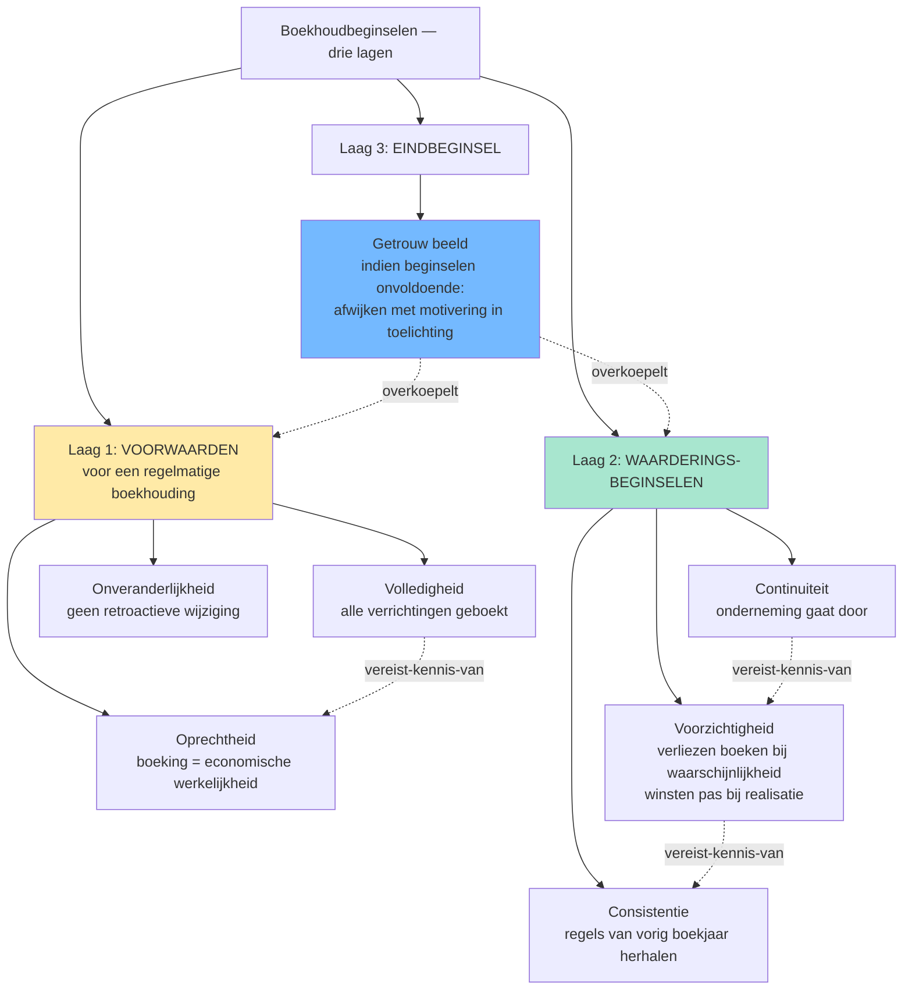
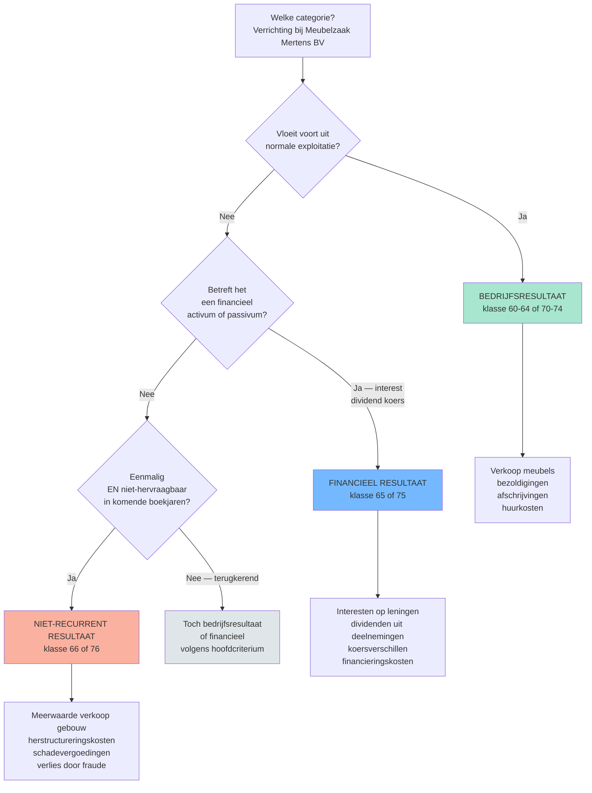
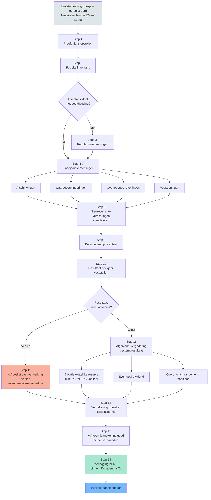

## Wat verwacht het examen van jou?

> [!abstract] Dit programmaonderdeel wordt getoetst op niveau *integratie*.
> Je moet meerdere concepten samen kunnen inzetten in complexe casussen — onderdelen herkennen, prioriteren, en tot een coherent oordeel komen.


**Taken** (uit het ITAA-examenprogramma):

> [!abstract]- **Taak 1** — De boekhouding voeren
>
> **Doelstellingen**:
> - Rekeningen openen
> - Opstellen van de journalen met inachtneming van de fiscale en analytische gevolgen
> - Centraliseren van de rekeningen
> - Opsporen en corrigeren van anomalieën
> - Verifiëren en corrigeren van de boekhouding en boekhoudkundige documenten
> - Het rekeningstelsel aanpassen aan de behoeften van de onderneming
> - Voorstellen van waarderingsregels
> - Optimaliseren van de boekhoudkundige organisatie van de onderneming
> - Opstellen van de boekhoudkundige bijlagen bij de jaarrekeningen
> - Afronden en afsluiten van de jaarrekeningen


## Leesgids

De minicursus loopt van het redeneerkader naar de uitvoering en sluit met de afsluiting van het boekjaar. Eerst de beginselen die elke boeking dragen, dan de infrastructuur, daarna balanscomponenten en gewone bedrijfsuitoefening. Bijzondere transacties en de eindejaarscyclus staan op het einde — ze veronderstellen dat je de eerdere stukken beheerst. Lees lineair en gebruik de synthese-blokken als ankerpunten.

## Waarom dit programmaonderdeel telt

Algemene boekhouding is de grondplaat van het hele beroep: zonder een [[regelmatige-boekhouding|regelmatige boekhouding]] kan geen enkele jaarrekening, fiscale aangifte of audit-conclusie op betrouwbare cijfers steunen. Op integratieniveau volstaat het niet om de boeking te plaatsen — je moet ze kunnen verdedigen via het [[continuiteitsbeginsel|continuïteits-]], [[voorzichtigheidsbeginsel|voorzichtigheids-]] en [[getrouw-beeld|getrouw-beeld-beginsel]]. De examenvragen toetsen zelden losse definities; ze toetsen of je een verrichting van begin tot eind kan doorlopen, tot en met de [[boekjaar-eindprocedure-checklist|afsluiting van het boekjaar]].

## Wat doet een boekhouding? Van enkelvoudig naar dubbel, en waarom dat ertoe doet

Een boekhouding is geen administratieve formaliteit maar een geordend geheugen: elke verrichting raakt minstens twee rekeningen via [[dubbel-boekhouden|dubbel boekhouden]], waardoor activa gelijk aan passiva per definitie klopt. Kleine ondernemingen onder de wettelijke drempel mogen werken met een [[vereenvoudigde-boekhouding|vereenvoudigde boekhouding]] in drie aparte dagboeken. Wie dat verschil doorgrondt, begrijpt waarom dubbel boekhouden onmisbaar wordt zodra voorraden, vaste activa en kapitaalbewegingen in beeld komen.

## De fundamentele beginselen: het redeneerkader achter elke boeking

> [!info] Hoort bij taak: De boekhouding voeren

De vier beginselen hieronder zijn het minimumkader bij elke twijfelvraag. Je doorgrondt hoe [[continuiteitsbeginsel|continuïteit]] en [[voorzichtigheidsbeginsel|voorzichtigheid]] samen de waardering sturen, terwijl [[getrouw-beeld|getrouw beeld]] de eindtoets is en [[onveranderlijkheid-boekingen|onveranderlijkheid]] de vormvereiste. Geen enkel beginsel staat op zichzelf — ze grijpen in elkaar in.

- [[continuiteitsbeginsel|Boekhoudkundig continuïteitsbeginsel (going concern)]] · `regel`
- [[voorzichtigheidsbeginsel|Voorzichtigheidsbeginsel]] · `regel`
- [[getrouw-beeld|Getrouw beeld]] · `regel`
- [[onveranderlijkheid-boekingen|Onveranderlijkheid van de boekingen]] · `regel`

## Boekhoudbeginselen &mdash; overzicht

Synthese die de zeven boekhoudbeginselen in drie functionele lagen ordent: voorwaarden voor regelmatigheid (volledigheid, oprechtheid, onveranderlijkheid), waarderingssturing (continuïteit, voorzichtigheid, consistentie), en het eindbeginsel (getrouw beeld). Cruciaal voor stagiairs omdat losse memorisatie hier niet helpt — examenvragen toetsen welk beginsel doorslaggevend is bij conflicten (typisch: voorzichtigheid tegenover continuïteit).


De tabel hieronder ordent de zeven beginselen volgens hun functie in de redenering: voorwaarden, waarderingssturing en eindtoets. Gebruik de "klassieke valkuil"-kolom als zelftest: als je elke valkuil kan herkennen, beheers je de scharnier tussen [[boekhoudbeginselen-overzicht|de beginselen]] en hun toepassing.

| Beginsel | Functie | Primaire bron | Vraag die het beantwoordt | Klassieke valkuil |
|---|---|---|---|---|
| [[getrouw-beeld]] | Eindbeginsel: de jaarrekening moet een getrouw beeld geven van vermogen, financiele positie en resultaat | WER art. III.89 · KB WVV art. 3:1 · Richtlijn 2013/34/EU art. 4 §3 | "Geeft mijn jaarrekening een getrouw beeld?" &mdash; eindtoets | Stagiair denkt: "als alle posten correct geboekt zijn klopt het beeld vanzelf". Fout: bij twijfel moet je afwijken van de regels mits motivering in de toelichting (KB WVV art. 3:1 derde lid). |
| [[volledigheidsbeginsel]] | Alle verrichtingen, bezittingen, rechten, schulden en verplichtingen zijn geboekt | WER art. III.83 · CBN 174/1 | "Heb ik alles opgenomen?" | Buiten-balans-rechten en -verplichtingen (klasse 0) worden vergeten &mdash; zie [[rechten-verplichtingen-buiten-balans]]. |
| [[oprechtheidsbeginsel]] | Boekingen reflecteren de werkelijke economische verrichting (niet de juridische schijn) | CBN 174/1 | "Komt mijn boeking overeen met de werkelijkheid?" | Substance over form: leasing waarbij [[Transport Tongeren BV]] het economisch eigendom heeft moet als financieringshuur geboekt worden, niet als operationele huur &mdash; ook al heet het contractueel zo. |
| [[onveranderlijkheid-boekingen]] | Eenmaal geboekt mag niet meer worden geschrapt of overschreven; correcties via tegenboeking | WER art. III.86 · CBN 174/1 | "Mag ik een vorige boeking nog wijzigen?" | Tipp-Ex of overschrijven in handgeschreven dagboek &rarr; boekhouding niet meer regelmatig. Correctie altijd via tegenboeking met datum en verwijzing. |
| [[continuiteitsbeginsel]] | Waardering veronderstelt dat de onderneming haar activiteiten voortzet | KB WVV art. 3:6 · CBN 2018/18 | "Mag ik blijven waarderen alsof we doorgaan?" | Bij twijfel over continuiteit moet bestuur uitdrukkelijk evalueren (toelichting jaarrekening); bij stopzetting overschakelen naar discontinuiteitswaarderingsregels. |
| [[voorzichtigheidsbeginsel]] | Verliezen en risico's boeken zodra waarschijnlijk; winsten pas bij realisatie | KB WVV art. 3:6 · Richtlijn 2013/34/EU art. 6 §1.c | "Mag ik deze opbrengst al boeken?" | Asymmetrie: voorzieningen aanleggen voor verwachte verliezen ja; herwaarderingsmeerwaarden boeken op niet-verkochte activa niet (behalve duurzame meerwaarde + KB-criteria). |
| [[consistentiebeginsel]] | Waarderingsregels van het ene boekjaar op het andere onveranderd toepassen | KB WVV art. 3:8 · CBN 174/1 | "Mag ik mijn afschrijvingsmethode veranderen?" | Methodewijziging mag, mits motivering in de toelichting + retroactieve aanpassing of prospectieve toepassing (afhankelijk van type wijziging). |



**Kerninzichten**:

- De zeven beginselen zijn niet allemaal gelijkwaardig: drie zijn voorwaarden om uberhaupt van een 'regelmatige' boekhouding te kunnen spreken (volledigheid, oprechtheid, onveranderlijkheid), drie sturen de waardering (continuiteit, voorzichtigheid, consistentie), en het getrouw-beeld-beginsel staat erboven als eindtoets. Stagiairs die ze op een rij zien staan zonder hierarchie missen die drie-lagen-structuur.
- Het getrouw-beeld-beginsel bevat een overrule-mechanisme: als toepassing van de andere beginselen onvoldoende is om een getrouw beeld te geven, moet je afwijken &mdash; met motivering in de toelichting (KB WVV art. 3:1 derde lid). Dit is geen vrijbrief: het bestuur moet uitdrukkelijk vaststellen dat de standaardregels onvoldoende zijn.
- Voorzichtigheid en getrouw-beeld kunnen op gespannen voet staan: pure voorzichtigheid leidt tot stille reserves (winsten onderschat, verliezen overschat), wat het getrouwe beeld verstoort. De moderne lezing (Richtlijn 2013/34/EU art. 6 §1.c): voorzichtigheid betekent geen overdreven onderwaardering, alleen waarschijnlijke verliezen + risico's opnemen.
- De onveranderlijkheid van boekingen is een formele eis (geen Tipp-Ex, geen overschrijven) maar geen verbod op correcties. Een verkeerde boeking corrigeer je via een tegenboeking met datum en verwijzing &mdash; de oorspronkelijke fout blijft zichtbaar in de audit-trail.
- Volledigheid omvat ook de rechten en verplichtingen buiten de balans (klasse 0): garanties verleend door [[Meubelzaak Mertens BV]], leaseverplichtingen, borgstellingen, pensioenverplichtingen. Wie deze vergeet schendt het volledigheidsbeginsel zonder dat de balans uit evenwicht raakt &mdash; daarom is het een silent error die makkelijk gemist wordt op examens.

_Bouwt op_: [[continuiteitsbeginsel]] · [[voorzichtigheidsbeginsel]] · [[getrouw-beeld]] · [[onveranderlijkheid-boekingen]] · [[consistentiebeginsel]] · [[oprechtheidsbeginsel]] · [[volledigheidsbeginsel]] · [[aanvullende-boekhoudbeginselen]]
## De infrastructuur van de boekhouding: stukken, dagboek, inventaris

> [!info] Hoort bij taak: De boekhouding voeren

Achter elke boeking zit een [[verantwoordingsstuk|verantwoordingsstuk]] dat in een chronologisch [[dagboek|dagboek]] belandt en op balansdatum wordt geconfronteerd met de fysieke [[inventaris|inventaris]]. Daarna geldt nog de wettelijke [[bewaring-boekhoudstukken|bewaarplicht]] — geen detail, want bij fiscale controle of audit moet alles teruggevonden worden.

- [[verantwoordingsstuk|Verantwoordingsstuk]] · `begrip`
- [[dagboek|Dagboek]] · `begrip`
- [[inventaris|Inventaris]] · `cluster`
- [[bewaring-boekhoudstukken|Bewaring van boekhoudkundige stukken]] · `regel`

## Voeren van een regelmatige dubbele boekhouding voor een onderneming

> [!info] Hoort bij taak: De boekhouding voeren

Stap voor stap doorloop je de opzet: regime-kwalificatie, [[dagboek|dagboeken]], centralisatie, periodieke [[inventaris|inventaris]] en correcte [[bewaring-boekhoudstukken|bewaring]]. De regime-kwalificatie komt eerst — pas dan ken je het verplichte minimumpakket dagboeken en het [[minimum-algemeen-rekeningenstelsel|rekeningenstelsel]].

[[competenties/voeren-regelmatige-dubbele-boekhouding|→ Volledige procedure]]

## Toepassen van de fundamentele boekhoudbeginselen op een concrete verrichting

> [!info] Hoort bij taak: De boekhouding voeren

Je beschrijft eerst het boekingsfeit en toetst het dan aan [[continuiteitsbeginsel|continuïteit]], [[voorzichtigheidsbeginsel|voorzichtigheid]], [[getrouw-beeld|getrouw beeld]] en [[onveranderlijkheid-boekingen|onveranderlijkheid]]. Bij twijfel valt de procedure terug op het eindbeginsel.

[[competenties/toepassen-fundamentele-boekhoudbeginselen|→ Volledige procedure]]

## Wie? De kleine vennootschap en het toepassingsgebied

> [!info] Hoort bij taak: De boekhouding voeren

De grootte-categorie bepaalt het jaarrekeningschema, de commissaris-plicht en de toelichtingsverplichtingen. Je doorgrondt het verband tussen de drie criteria van de [[kleine-vennootschap|kleine vennootschap]] en de praktische gevolgen.

- [[kleine-vennootschap|Kleine vennootschap (WVV art. 1:24)]] · `begrip`

## De twee synthesedocumenten: balans en resultatenrekening

> [!info] Hoort bij taak: De boekhouding voeren

De [[balans|balans]] toont het vermogen op één moment, de [[resultatenrekening|resultatenrekening]] de bewegingen over het boekjaar; samen vormen ze met de toelichting de [[jaarrekening|jaarrekening]]. Je doorgrondt waarom de balans ordent volgens liquiditeit en opeisbaarheid en waarom de resultatenrekening in vier blokken oploopt.

- [[balans|Balans (jaarrekening-component)]] · `cluster`
- [[resultatenrekening|Resultatenrekening]] · `cluster`
- [[jaarrekening|Jaarrekening (synthesedocumenten)]] · `cluster`

## De gewone bedrijfsuitoefening: aankopen, verkopen, btw en vorderingen

> [!info] Hoort bij taak: De boekhouding voeren

Het routinematige hart van de boekhouding: omzet, kostprijs, btw, [[bedrijfsvorderingen|vorderingen]] en [[schulden|schulden]]. Het [[opbrengsten-be-gaap|realisatiebeginsel]] stuurt het boekmoment, zodat het [[bedrijfsresultaat|bedrijfsresultaat]] de werkelijke exploitatie weerspiegelt.

- [[bedrijfsvorderingen|Bedrijfsvorderingen]] · `begrip`
- [[schulden|Schulden (LT en KT)]] · `cluster`
- [[bedrijfsresultaat|Bedrijfsresultaat (bedrijfskosten en bedrijfsopbrengsten)]] · `cluster`
- [[opbrengsten-be-gaap|Opbrengsten onder BE GAAP (realisatiebeginsel)]] · `cluster`

## Boeken van een aankoop en verkoop met btw en betaling

> [!info] Hoort bij taak: De boekhouding voeren

Verifieer eerst de factuur op vorm en inhoud, boek dan via [[dubbel-boekhouden|dubbel boekhouden]] in het juiste [[dagboek|dagboek]] met aanwending van het [[minimum-algemeen-rekeningenstelsel|MAR]] voor aankoop, verkoop, btw en betaling. Factuur-verificatie is de stap die studenten op het examen het vaakst overslaan.

[[competenties/boeken-aankoop-verkoop-met-btw|→ Volledige procedure]]

## Vaste activa: oprichtingskosten, materiële, immateriële en financiële

> [!info] Hoort bij taak: De boekhouding voeren

Vaste activa worden duurzaam ingezet, gewaardeerd aan [[aanschaffingswaarde|aanschaffingswaarde]] en gespreid via [[afschrijvingen|afschrijvingen]] of bij duurzaam verlies gecorrigeerd via [[waardeverminderingen|waardeverminderingen]]. Je doorgrondt het onderscheid tussen [[materiele-vaste-activa|materiële]], [[immateriele-vaste-activa|immateriële]] en [[financiele-vaste-activa|financiële]] vaste activa.

- [[oprichtingskosten|Oprichtingskosten]] · `cluster`
- [[aanschaffingswaarde|Aanschaffingswaarde]] · `begrip`
- [[materiele-vaste-activa|Materiële vaste activa]] · `begrip`
- [[immateriele-vaste-activa|Immateriële vaste activa]] · `begrip`
- [[financiele-vaste-activa|Financiële vaste activa]] · `begrip`
- [[herwaarderingsmeerwaarden|Herwaarderingsmeerwaarden]] · `cluster`
- [[afschrijvingen|Afschrijvingen]] · `cluster`
- [[waardeverminderingen|Waardeverminderingen]] · `cluster`

## Boeken van oprichtings- en kapitaalverhogingskosten en hun afschrijving

> [!info] Hoort bij taak: De boekhouding voeren

Scheid eerst [[oprichtingskosten|oprichtingskosten]] van eerste-werkings-kosten — alleen de eerste komen op rubriek 20 en worden afgeschreven binnen de marges van de [[afschrijvingen|afschrijvingsregels]]. Activeren of direct ten laste nemen is een professional-judgment-keuze.

[[competenties/boeken-oprichtings-en-kapitaalverhogingskosten|→ Volledige procedure]]

## Opstellen van het afschrijvingsplan voor materiële vaste activa

> [!info] Hoort bij taak: De boekhouding voeren

Vertrek vanuit de [[aanschaffingswaarde|aanschaffingswaarde]], schat levensduur en restwaarde, kies tussen lineair en degressief en leg de uitkomst vast in de [[waarderingsregels-jaarrekening|waarderingsregels]]. De plicht is wettelijk; de keuze van methode en levensduur is praktijkbeoordeling die bestendig moet worden toegepast.

[[competenties/opstellen-afschrijvingsplan-vaste-activa|→ Volledige procedure]]

## Vlottende activa: voorraden, geldbeleggingen en bijzondere waardevermindering

> [!info] Hoort bij taak: De boekhouding voeren

[[voorraden|Voorraden]] en [[geldbeleggingen|geldbeleggingen]] zijn de korte-termijn-tegenhangers van de vaste activa: ondersteuning van de bedrijfscyclus of tijdelijke parking van overtollige middelen. Zakt hun realiseerbare waarde duurzaam onder de boekwaarde, dan treedt de [[bijzondere-waardevermindering|bijzondere waardevermindering]] in werking — niet alleen op materiële activa.

- [[voorraden|Voorraden]] · `cluster`
- [[geldbeleggingen|Geldbeleggingen en liquide middelen]] · `begrip`
- [[bijzondere-waardevermindering|Bijzondere waardevermindering (regime-overstijgend)]] · `cluster`

## Waarderen en boeken van voorraden volgens FIFO of gewogen gemiddelde

> [!info] Hoort bij taak: De boekhouding voeren

Leg eerst per voorraadbeweging de [[aanschaffingswaarde|aanschaffingswaarde]] vast, kies dan tussen FIFO en gewogen gemiddelde en houd die bestendig aan. Beide methoden zijn toegelaten onder de [[waarderingsregels-jaarrekening|waarderingsregels]] maar leiden bij prijsschommelingen tot een ander [[voorraden|voorraadsaldo]] en dus een ander resultaat.

[[competenties/waarderen-en-boeken-voorraden-fifo-ggp|→ Volledige procedure]]

## Boeken van waardeverminderingen op vorderingen en voorraden

> [!info] Hoort bij taak: De boekhouding voeren

Identificeer dubieuze [[bedrijfsvorderingen|vorderingen]] en overgewaardeerde [[voorraden|voorraadposten]], schat het verlies en boek de [[waardeverminderingen|waardevermindering]] onder het [[voorzichtigheidsbeginsel|voorzichtigheidsbeginsel]]. De praktijkbeoordeling zit in het criterium "dubieus" en het verlies-percentage.

[[competenties/boeken-waardeverminderingen-op-vorderingen-en-voorraden|→ Volledige procedure]]

## Eigen vermogen, voorzieningen en kapitaalwijzigingen

> [!info] Hoort bij taak: De boekhouding voeren

Aan de passiefzijde clusteren we [[eigen-middelen|eigen vermogen]] met zijn componenten — kapitaal, [[uitgiftepremie|uitgiftepremies]], [[wettelijke-reserve|wettelijke reserve]], andere reserves — naast de [[voorzieningen|voorzieningen voor risico's en kosten]]. Daarbij hoort de dynamiek van [[kapitaalwijziging|kapitaalverhogingen en -verminderingen]] en hun boekhoudkundige weerslag.

- [[eigen-middelen|Eigen middelen (eigen vermogen)]] · `cluster`
- [[uitgiftepremie|Uitgiftepremie]] · `begrip`
- [[wettelijke-reserve|Wettelijke reserve]] · `regel`
- [[voorzieningen|Voorzieningen voor risico's en kosten]] · `cluster`
- [[kapitaalwijziging|Kapitaalwijziging (verhoging en vermindering)]] · `cluster`

## Boeken van een voorziening voor risico's en kosten

> [!info] Hoort bij taak: De boekhouding voeren

Identificeer eerst de potentiële last, schat waarschijnlijkheid en bedrag, en leg bij voldoende zekerheid een [[voorzieningen|voorziening]] aan onder het [[voorzichtigheidsbeginsel|voorzichtigheidsbeginsel]]. Bij te grote onzekerheid schakel je terug naar [[rechten-verplichtingen-buiten-balans|rechten en verplichtingen buiten balans]].

[[competenties/boeken-voorzieningen-voor-risicos-en-kosten|→ Volledige procedure]]

## Overlopende rekeningen en het matching-principe

> [!info] Hoort bij taak: De boekhouding voeren

[[overlopende-rekeningen|Overlopende rekeningen]] maken het verschil zichtbaar tussen kasstroom en economische toerekening: kosten en opbrengsten landen in het boekjaar waarop ze betrekking hebben, niet bij betaling of inning. Zonder hen klopt het [[bedrijfsresultaat|bedrijfsresultaat]] op periodebasis niet.

- [[overlopende-rekeningen|Overlopende rekeningen]] · `cluster`

## Verwerken van overlopende rekeningen volgens het matching-principe

> [!info] Hoort bij taak: De boekhouding voeren

Identificeer periode-overschrijdende kosten en opbrengsten, bereken het pro-rata-deel en boek op de correcte [[overlopende-rekeningen|overlopende rekening]]. De [[waarderingsregels-jaarrekening|waarderingsregels]] verplichten de toerekening; het pro-rata-aandeel inschatten is jouw analyse.

[[competenties/verwerken-overlopende-rekeningen-matching|→ Volledige procedure]]

## Drie resultaatcategorieën: bedrijfs-, financieel en niet-recurrent

> [!info] Hoort bij taak: De boekhouding voeren

De resultatenrekening kent drie strikte categorieën: bedrijfs-, [[financiele-verrichtingen|financieel]] en [[niet-recurrente-verrichtingen|niet-recurrent]] resultaat. Een verkeerde categorisatie verstoort niet alleen de leesbaarheid van de [[resultatenrekening|resultatenrekening]], maar heeft ook fiscale gevolgen.

- [[financiele-verrichtingen|Financiële verrichtingen (kosten + opbrengsten)]] · `cluster`
- [[niet-recurrente-verrichtingen|Niet-recurrente verrichtingen]] · `cluster`

## Bedrijfs- · financieel · niet-recurrent &mdash; in welke categorie hoort deze verrichting?

Een visualisatie van de drie resultaten-categorieën (bedrijfs / financieel / niet-recurrent) die direct het camouflage-mechanisme in examenvragen aanpakt: voor elke verrichting moet eerst de aard worden bepaald, pas dan de klasse. Voor een stagiair-GA: studiehulp om de meest gemaakte categorisatie-fouten (rente op 61, meerwaarde op 75, wisselresultaat verkeerd) gestructureerd te vermijden.


De [[resultaat-categorisatie-beslisboom|beslisboom hieronder]] vertaalt "normale exploitatie" naar concrete vragen — de categorie volgt uit de aard van de verrichting, niet uit het rekeningnummer.

| Categorie | MAR-klassen | Wat hoort hier | Voorbeeld | Typische valkuil |
|---|---|---|---|---|
| [[bedrijfsresultaat\|Bedrijfsresultaat]] | 60-64 (kosten) + 70-74 (opbrengsten) | Alles wat voortvloeit uit de normale exploitatie | [[Meubelzaak Mertens BV]]: verkoop meubels &euro; 850.000 (klasse 70); bezoldigingen &euro; 380.000 (klasse 62); afschrijvingen &euro; 45.000 (klasse 6302) | Afschrijvingen horen bij bedrijfsresultaat &mdash; ook al voelen ze niet 'operationeel' aan, ze ondersteunen de normale exploitatie van de vaste activa. |
| [[financiele-verrichtingen\|Financieel resultaat]] | 65 (kosten) + 75 (opbrengsten) | Verrichtingen op financiele activa/passiva: interesten, dividenden, koersverschillen, financieringskosten | [[Solaris Sint-Truiden BV]]: dividend ontvangen op aandelen &euro; 12.000 (klasse 75); interestlasten op obligatielening &euro; 50.000 (klasse 65) | Meerwaarde bij verkoop van een financieel vast activum: NIET hier &mdash; dat is niet-recurrent als de verkoop niet tot de normale activiteit hoort, of bedrijfsresultaat als de onderneming een trader is. |
| [[niet-recurrente-verrichtingen\|Niet-recurrent resultaat]] | 66 (kosten) + 76 (opbrengsten) | Eenmalige, niet aan normale exploitatie gerelateerde verrichtingen, die niet hervraagbaar zijn in de komende boekjaren | [[Verffabriek Veurne BV]]: meerwaarde bij verkoop bedrijfsgebouw &euro; 320.000 (klasse 76); herstructureringskosten reorganisatie &euro; 180.000 (klasse 66) | Klassieke verwarring met het oude 'uitzonderlijk': sinds KB 21/10/2018 is niet-recurrent een **feitelijke** kwalificatie (eenmalig + niet-exploitatiegebonden), niet een formele rubriek. Een terugkerende meerwaarde (jaarlijkse verkoop investeringen) hoort dus NIET in 66/76. |



**Kerninzichten**:

- Het criterium 'normale exploitatie' is sectorafhankelijk. Voor [[Solaris Sint-Truiden BV]] (effectenportefeuille als kernactiviteit) horen koerswinsten bij het bedrijfsresultaat &mdash; voor [[Meubelzaak Mertens BV]] horen dezelfde koerswinsten bij het financieel resultaat. De rubriek-keuze is dus geen mechanische lookup, maar een redenering over wat 'normaal' is voor deze onderneming.
- 'Niet-recurrent' is sinds KB 21/10/2018 niet meer hetzelfde als 'uitzonderlijk'. Het oude regime kende een formele rubriek 'uitzonderlijke kosten/opbrengsten' &mdash; daar zat veel in dat eigenlijk wel terugkwam (bv. jaarlijkse meerwaarden bij verkoop van afgeschreven vaste activa). Het nieuwe regime hanteert twee feitelijke criteria: eenmalig + niet-hervraagbaar. Een vraag op het examen die nog de term 'uitzonderlijk' gebruikt is typisch een test op kennis van de regime-wijziging.
- De drie categorieen leiden tot drie subtotalen in de resultatenrekening, die elk apart fiscaal relevant zijn. Bij de aangifte vennootschapsbelasting (zie [[bedrijfsresultaat]] + WIB) bepaalt de categorisatie of een meerwaarde onder de gespreide taxatie kan vallen (typisch alleen voor materiele vaste activa onder bedrijfsresultaat) of niet. Verkeerde categorisatie heeft dus directe fiscale impact &mdash; geen louter cosmetische keuze.

_Bouwt op_: [[bedrijfsresultaat]] · [[financiele-verrichtingen]] · [[niet-recurrente-verrichtingen]] · [[resultaatverwerking]]
## Bijzondere transacties: leasing, obligaties, eigen aandelen en eigendom

> [!info] Hoort bij taak: De boekhouding voeren

Deze cluster bundelt transacties waar juridische vorm en economische realiteit uit elkaar lopen: [[leasing|leasing]], [[obligatielening|obligatieleningen]], [[eigen-aandelen|eigen aandelen]] en [[opsplitsing-eigendom|opsplitsing van eigendom]]. De reflex blijft dezelfde — economische substantie boven juridische schijn — en raakt ook de [[rechten-verplichtingen-buiten-balans|rechten en verplichtingen buiten balans]].

- [[leasing|Leasing (financieel en operationeel)]] · `cluster`
- [[obligatielening|Obligatielening]] · `cluster`
- [[eigen-aandelen|Beheer van eigen aandelen]] · `cluster`
- [[opsplitsing-eigendom|Opsplitsing eigendom (vruchtgebruik, opstal, erfpacht)]] · `cluster`
- [[rechten-verplichtingen-buiten-balans|Rechten en verplichtingen buiten balans]] · `cluster`

## Kwalificeren en boeken van leasing (operationeel vs financieel)

> [!info] Hoort bij taak: De boekhouding voeren

Lees het leasingcontract, identificeer de kerngegevens en kwalificeer de [[leasing|leasing]] als financieel of operationeel. Financiële leasing landt op de balans bij de [[materiele-vaste-activa|materiële vaste activa]] met [[schulden|schuld]] en [[afschrijvingen|afschrijving]]; operationele leasing blijft huurkost.

[[competenties/kwalificeren-en-boeken-leasing|→ Volledige procedure]]

## Boeken van uitgifte en aflossing van een obligatielening

> [!info] Hoort bij taak: De boekhouding voeren

Vertrek vanuit het emissieprospectus en boek de [[obligatielening|obligatielening]] correct: nominale waarde versus uitgiftekoers, couponrente, eventueel uitgiftedisagio gespreid via [[overlopende-rekeningen|overlopende rekeningen]], en de aflossing als [[schulden|langlopende schuld]] die jaar na jaar verkortlopend wordt.

[[competenties/boeken-uitgifte-en-aflossing-obligatielening|→ Volledige procedure]]

## Voeren van de boekhouding van een VZW met economische activiteit

> [!info] Hoort bij taak: De boekhouding voeren

Kwalificeer eerst het VZW-regime (microvereniging, klein of groot) en kies dan de boekhoudvorm — [[vereenvoudigde-boekhouding|vereenvoudigd]] of [[dubbel-boekhouden|dubbel]] — plus het [[jaarrekening-vzw-stichting|jaarrekeningschema]] dat erbij hoort.

[[competenties/voeren-boekhouding-vzw-met-economische-activiteit|→ Volledige procedure]]

## Boekjaar afsluiten &mdash; van proefbalans tot neerlegging

Synthese die per stap toont wat een vennootschap aan het einde van haar boekjaar moet doen: inventaris opmaken, eindejaarsverrichtingen boeken, proef- en saldibalans opstellen, jaarrekening voorbereiden, goedkeuren en openbaarmaken. Voor de stagiair-GA is dit de praktische ruggengraat van zijn eerste boekjaar-afsluitingen.


De [[boekjaar-eindprocedure-checklist|veertien stappen hieronder]] vormen een vaste volgorde: pas na de eindejaarsverrichtingen kan je het resultaat vaststellen, pas na de algemene vergadering kan de jaarrekening klaar zijn. Gebruik de tabel als afvinkbare werkflow tijdens je eerste afsluitingen.

| Stap | Wat | Wanneer | Concept-record | Output |
|---|---|---|---|---|
| 1 | Proefbalans opstellen | Direct na laatste boeking boekjaar | [[regelmatige-boekhouding]] · [[dubbel-boekhouden]] | Lijst met saldi per grootboekrekening; debet = credit |
| 2 | Fysieke inventarisopname | Op de afsluitingsdatum (in regel laatste dag boekjaar) | [[inventaris]] | Werkblad met fysieke tellingen voorraad, kas, vaste activa |
| 3 | Verschillen inventaris &harr; boekhouding regulariseren | Tussen inventaris-datum en jaarrekening-opmaak | [[inventaris]] · [[voorraden]] | Correctieboekingen (manco's, breukverliezen, inventarisverschillen) |
| 4 | Afschrijvingen boeken | Eindejaarsverrichting | [[afschrijvingen]] | Boeking 6302 / 22-28 voor materiele en immateriele vaste activa |
| 5 | Waardeverminderingen toetsen + boeken | Eindejaarsverrichting | [[waardeverminderingen]] | Boeking 631-634 voor duurzame waardeverminderingen op activa |
| 6 | Overlopende rekeningen boeken | Eindejaarsverrichting | [[overlopende-rekeningen]] | Boeking 490/491/492/493 voor toerekening kosten/opbrengsten aan juiste boekjaar |
| 7 | Voorzieningen aanleggen of terugnemen | Eindejaarsverrichting | [[voorzieningen]] · [[voorzichtigheidsbeginsel]] | Boeking 6360 / 160-163 voor risico's en kosten |
| 8 | Niet-recurrente verrichtingen identificeren | Bij opmaak resultatenrekening | [[niet-recurrente-verrichtingen]] | Boeking 66/76 (vroegere 'uitzonderlijke' rubrieken) |
| 9 | Belastingen op het resultaat berekenen + boeken | Na vaststelling resultaat voor belasting | [[bedrijfsresultaat]] | Boeking 670-679 |
| 10 | Resultaat van het boekjaar afsluiten | Sluiten rekeningen klasse 6 en 7 | [[bedrijfsresultaat]] · [[resultaatverwerking]] | Saldo op rekening 690/790 |
| 11 | Algemene vergadering: resultaat bestemmen | Binnen 6 maanden na boekjaareinde | [[resultaatverwerking]] · [[wettelijke-reserve]] | Beslissing AV: dotatie wettelijke reserve, eventueel andere reserves, dividend, overdracht naar volgend boekjaar |
| 12 | Jaarrekening opmaken in NBB-schema | Na resultaatverwerking | [[jaarrekening]] | Volledige of verkorte jaarrekening + toelichting + sociale balans |
| 13 | Goedkeuring algemene vergadering | Binnen 6 maanden na boekjaareinde | [[jaarrekening]] | AV-notulen + ondertekende jaarrekening |
| 14 | Neerlegging bij NBB | Binnen 30 dagen na goedkeuring AV (en uiterlijk 7 maanden na boekjaareinde) | [[jaarrekening]] | Neergelegde jaarrekening &mdash; publiek raadpleegbaar |



**Kerninzichten**:

- De volgorde is bindend: pas na de eindejaarsverrichtingen (stap 4-9) kan je het resultaat van het boekjaar vaststellen (stap 10). Pas na de algemene vergadering die het resultaat bestemt (stap 11) ken je het 'overgedragen resultaat' &mdash; pas dan is de jaarrekening volledig opmaakbaar (stap 12). Een examenvraag die zegt 'jaarrekening klaar, AV moet nog komen' bevat dus een logische fout: de jaarrekening kan niet 'klaar' zijn zonder AV-beslissing.
- De timing is wettelijk geketend: AV binnen 6 maanden na boekjaareinde (WVV art. 3:1 §1), neerlegging binnen 30 dagen na AV (WVV art. 3:10) en uiterlijk 7 maanden na boekjaareinde. Voor [[Naaiatelier Ninove BV]] met boekjaar dat eindigt op 31 december betekent dit: AV ten laatste 30 juni, neerlegging ten laatste 31 juli. Boete-risico: laattijdige neerlegging is een veelvoorkomende cliënt-vraag.
- Drie van de tien verplichte boekingen volgen direct uit de waarderingsbeginselen: afschrijvingen (consistentie), waardeverminderingen (voorzichtigheid), voorzieningen (voorzichtigheid). Wie de beginselen kent, kan deze stappen niet vergeten. Wie ze opvat als 'extra werk', vergeet er typisch een &mdash; bijvoorbeeld de waardeverminderingen op vorderingen.
- De wettelijke reserve (stap 11) ontstaat bij de resultaatverwerking, niet bij de jaarrekening-opmaak. Sequentieel: AV beslist welk percentage naar wettelijke reserve gaat (min. 5% van de winst, tot de wettelijke reserve 10% van het kapitaal bereikt). Pas dan staat het bedrag op rekening 130; pas dan past het in de jaarrekening die de AV daarna goedkeurt.

_Bouwt op_: [[regelmatige-boekhouding]] · [[inventaris]] · [[overlopende-rekeningen]] · [[afschrijvingen]] · [[waardeverminderingen]] · [[voorzieningen]] · [[jaarrekening]] · [[resultaatverwerking]] · [[wettelijke-reserve]]
## Resultaatverwerking en winstbestemming

> [!info] Hoort bij taak: De boekhouding voeren

Na vaststelling van het resultaat bestemt de algemene vergadering het: dotatie aan de [[wettelijke-reserve|wettelijke reserve]], andere reserves, dividend of overdracht. Pas na deze [[resultaatverwerking|resultaatverwerking]] is de jaarrekening volledig invulbaar.

- [[resultaatverwerking|Resultaatverwerking (winst- of verliesbestemming)]] · `cluster`

## Uitvoeren van eindejaarsverrichtingen en opmaken van proefbalans

> [!info] Hoort bij taak: De boekhouding voeren

Doorloop de eindejaars-checklist: [[inventaris|inventarisopname]], [[afschrijvingen|afschrijvingen]], [[waardeverminderingen|waardeverminderingen]], [[voorzieningen|voorzieningen]] en [[overlopende-rekeningen|overlopende rekeningen]]. De proefbalans is het controlepunt vóór je naar de [[jaarrekening|jaarrekening]] doorrolt.

[[competenties/uitvoeren-eindejaarsverrichtingen-en-proefbalans|→ Volledige procedure]]

## Boeken van resultaatverwerking en bestemming (reserves, dividenden, belasting)

> [!info] Hoort bij taak: De boekhouding voeren

Bereken eerst het te bestemmen resultaat, dan in vaste volgorde [[resultaatverwerking|vennootschapsbelasting, wettelijke reserve, beschikbare reserves, dividend en overdracht]] — de volgorde is wettelijk, de verhoudingen zijn AV-beslissing.

[[competenties/boeken-resultaatverwerking-en-bestemming|→ Volledige procedure]]

## Vereffening en de levenscyclus voorbij continuïteit

> [!info] Hoort bij taak: De boekhouding voeren

Wanneer de going-concern-aanname wegvalt, schakelt de [[vereffening|vereffening]] de boekhouding over op discontinuïteits-waardering. Je doorgrondt het verband tussen het wegvallen van het [[continuiteitsbeginsel|continuïteitsbeginsel]] en de gewijzigde [[waarderingsregels-jaarrekening|waarderingsregels]].

- [[vereffening|Vereffening van een vennootschap]] · `cluster`

## Jaarrekeningpresentatie: van BE GAAP naar IFRS-context

> [!info] Hoort bij taak: De boekhouding voeren

De [[jaarrekening-presentatie|jaarrekeningpresentatie]] gehoorzaamt aan dezelfde grondbeginselen onder elk regime, maar de vorm verschilt: BE GAAP via vaste schema's, IFRS met meer ruimte voor eigen indeling. Je doorgrondt de gemeenschappelijke kern los van het regime.

- [[jaarrekening-presentatie|Jaarrekeningpresentatie (regime-overstijgend)]] · `cluster`

## Reflectie: digitalisering, e-invoicing en de boekhouding van morgen

De papieren basisregels blijven overeind, maar de vorm verschuift. Een [[verantwoordingsstuk|verantwoordingsstuk]] is vandaag vaker een gestructureerd elektronisch bestand; een [[dagboek|dagboek]] een database in een boekhoudpakket. De [[bewaring-boekhoudstukken|bewaarplicht]] verandert daardoor inhoudelijk niet, maar wel praktisch: digitale leesbaarheid en toegankelijkheid voor controle worden de nieuwe aandachtspunten.


## Synthese-stappenplan

Begin met de regime-kwalificatie: [[vereenvoudigde-boekhouding|vereenvoudigde]] of [[dubbel-boekhouden|dubbele boekhouding]], en welk jaarrekeningschema past op de groottecriteria van de [[kleine-vennootschap|kleine vennootschap]]. Organiseer dan de infrastructuur: [[verantwoordingsstuk|verantwoordingsstukken]], [[dagboek|dagboeken]] en het [[minimum-algemeen-rekeningenstelsel|MAR]]. Boek de gewone bedrijfsuitoefening — aankopen, verkopen, btw, [[bedrijfsvorderingen|vorderingen]], [[schulden|schulden]] — onder het [[opbrengsten-be-gaap|realisatiebeginsel]]. Verwerk parallel de investeringen aan [[aanschaffingswaarde|aanschaffingswaarde]] met geplande [[afschrijvingen|afschrijvingen]] volgens de [[waarderingsregels-jaarrekening|waarderingsregels]]. Op balansdatum stel je de fysieke [[inventaris|inventaris]] op en boek je de eindejaarsverrichtingen: afschrijvingen, [[waardeverminderingen|waardeverminderingen]], [[voorzieningen|voorzieningen]] en [[overlopende-rekeningen|overlopende rekeningen]] — telkens onder het [[voorzichtigheidsbeginsel|voorzichtigheidsbeginsel]]. Stel de proefbalans op, identificeer [[niet-recurrente-verrichtingen|niet-recurrente verrichtingen]], boek de belasting en sluit klassen 6 en 7. De algemene vergadering bestemt het resultaat — [[wettelijke-reserve|wettelijke reserve]], beschikbare reserves, eventueel dividend — pas dan is de [[jaarrekening|jaarrekening]] opmaakbaar, klaar voor neerlegging en [[bewaring-boekhoudstukken|wettelijke bewaring]].

## Cheatsheet

### Kritische drempelwaarden

| Concept | Naam | Waarde | Eenheid | Gevolg |
|---|---|---|---|---|
| [[jaarrekening]] | Kleine vennootschap (verkort schema toegelaten) | Maximaal 1 criterium overschreden: balanstotaal € 6.000.000, omzet € 11.250.000, gemiddeld personeel 50 VTE | WVV art. 1:24 — 1:25 | Mag jaarrekening in **verkort schema** opstellen; vrijgesteld van jaarverslag (tenzij beursgenoteerd), commissaris-vrijs… |
| [[jaarrekening]] | Micro-vennootschap (microschema toegelaten) | Maximaal 1 criterium overschreden: balanstotaal € 350.000, omzet € 700.000, gemiddeld personeel 10 VTE | WVV art. 1:25 | Mag jaarrekening in **microschema** opstellen — kortere balans, minder verplichte vermeldingen in toelichting |
| [[vereenvoudigde-boekhouding]] | Omzetdrempel voor vereenvoudigde boekhouding | € 500.000 | jaaromzet excl. BTW | Natuurlijke personen, vennootschappen onder firma (VOF) en gewone commanditaire vennootschappen (GCV) met een omzet onde… |
| [[wettelijke-reserve]] | Verplichte afhouding van de nettowinst | 5 % | van de nettowinst van het boekjaar | Verplichte toevoeging aan wettelijke reserve uit winstbestemming |
| [[wettelijke-reserve]] | Plafond wettelijke reserve | 10 % | van het maatschappelijk kapitaal (NV) of van de eigen vermogensinbreng (BV) | Wanneer de wettelijke reserve dit plafond bereikt, vervalt de verplichte jaarlijkse afhouding |

### Vergelijkingsparen-matrix

| Concept | Verwarrend met | Trigger |
|---|---|---|
| [[afschrijvingen]] | [[waardeverminderingen]] | Examen: 'gebouw' (gebruiksduur beperkt) → afschrijving. 'Terrein' (onbeperkt) → waardevermindering. 'Voorraad' (vlottend actief) → waardevermindering. |
| [[balans]] | [[resultatenrekening]] | Examen: 'op welke staat staat post X?' Toestand (saldo) → balans. Beweging (gedurende periode) → RR. |
| [[balans]] | [[analytische-balans]] | Examen: 'bereken behoefte aan bedrijfskapitaal' — eerst statutaire balans naar analytische balans omzetten. |
| [[bedrijfsresultaat]] | [[financiele-verrichtingen]] | Examen: 'intrest op leveranciersschuld te laat betaald' — financiële kost (klasse 65), NIET bedrijfskost. 'huurkost van magazijn' — bedrijfskost (klasse 61). |
| [[bedrijfsvorderingen]] | [[vorderingen-meer-dan-1-jaar-aspect]] | Examen: 'lening 3 jaar verleend in jaar 1, op 31/12/20X2 nog 18 maanden te lopen' → splitsen: 12 maanden op rubriek VII, 6 maanden op rubriek V. |
| [[bewaring-boekhoudstukken]] | [[bewaartermijn-boekhouding]] | Examen: 'hoelang bewaren?' → check of de vraag boekhoudkundig is (7j) of fiscaal/btw (10j). In twijfel: 10 jaar. |
| [[bijzondere-waardevermindering]] | [[bijzondere-waardevermindering-ifrs]] | Algemeen → 'wat is het mechanisme van bijzondere waardevermindering?'; IFRS → 'hoe bereken ik VIU?' / 'wat is CGU-allocatie?' |
| [[bijzondere-waardevermindering]] | [[bijzondere-waardevermindering-be-gaap]] | Algemeen → 'wat is het mechanisme?'; BE GAAP → 'aanvullende afschrijving of waardevermindering — welk artikel?' |
| [[dubbel-boekhouden]] | [[vereenvoudigde-boekhouding]] | Examenvraag: kleine eenmanszaak met omzet onder € 500.000 (WER drempel) — mag vereenvoudigd, hoeft geen dubbel boekhouden. |
| [[eigen-aandelen]] | [[financiele-vaste-activa]] | Examen: 'NV koopt 5% van haar eigen aandelen in voor € 80.000' → boeking als aftrek van EV, NIET als FVA. 'NV koopt 25% van een andere NV' → FVA (deelneming) op actiefzijde. |
| [[financiele-vaste-activa]] | [[geldbeleggingen]] | Examen: 'verworven met de bedoeling de groep duurzaam te ondersteunen' → FVA. 'tijdelijke parking van overtollige liquiditeiten' → geldbelegging. |
| [[geldbeleggingen]] | [[financiele-vaste-activa]] | Examen: 'wij houden 10 % aandelen in een leverancier om de bevoorrading te beveiligen' → FVA (duurzame strategische relatie). 'wij houden 1 % aandelen in een beursgenoteerde bank voor rendement' → geldbelegging. |
| [[getrouw-beeld]] | [[getrouw-beeld-jaarrekening]] | Vraag over algemeen beginsel → getrouw-beeld. Vraag over de jaarrekening-toets (vermogen/positie/resultaat) → getrouw-beeld-jaarrekening. |
| [[herwaarderingsmeerwaarden]] | [[aanschaffingswaarde]] | Examen: 'aanpassen waarde van een terrein boven aankoopprijs' → herwaardering (mits voorwaarden), niet aanschaffingswaarde wijzigen. |
| [[immateriele-vaste-activa]] | [[oprichtingskosten]] | Examen: 'notariskosten kapitaalverhoging' → 200. 'aankoop patent' → 211. |
| [[immateriele-vaste-activa]] | [[materiele-vaste-activa]] | Examen: 'aankoop industriële mengmachine € 45.000' → materieel (rubriek 23). 'aankoop licentie op patroontekening' → immaterieel (rubriek 211). |
| [[jaarrekening-presentatie]] | [[balans-presentatie-ifrs]] | Algemeen → 'welke componenten zijn verplicht?'; IFRS-specialisatie → 'welke posten op de balans onder IAS 1?' |
| [[jaarrekening]] | [[geconsolideerde-jaarrekening]] | Examen: 'jaarrekening Aurelia Holding NV' alleen = statutair. 'jaarrekening Aurelia Holding NV + dochters' = geconsolideerd. |
| [[kleine-vennootschap]] | [[microvennootschap]] | Examen: omzet € 500K → check micro-drempels eerst; als ook personeel ≤ 10 én balans ≤ € 450K én niet moeder/dochter → micro. Zo niet → klein. |
| [[kleine-vennootschap]] | [[grote-vennootschap-wvv]] | Examen: omzet € 15M, personeel 80, balans € 8M → overschrijdt 3 drempels → groot. Verkort niet meer toegestaan, commissaris verplicht. |
| [[leasing]] | [[huur-versus-leasing-aspect]] | Examen: 'gewone huur kantoor € 1.500/maand' = kostenrekening 61. 'leasing met optie tot aankoop' = onderzoek of optie ≤ 15 % → financieel of operationeel. |
| [[materiele-vaste-activa]] | [[immateriele-vaste-activa]] | Examen: 'gekocht productiehal € 480.000' → MVA (221). 'gekocht patent € 35.000' → IVA (211). |
| [[niet-recurrente-verrichtingen]] | [[bedrijfsresultaat]] | Examen: 'meerwaarde verkoop oud kantoorpand' → niet-recurrent bedrijfsmatig (76A). 'omzet uit hoofdactiviteit' → recurrent bedrijfsresultaat (70). De oude term 'uitzonderlijk resultaat' (vóór KB 2018) is afgeschaft. |
| [[opbrengsten-be-gaap]] | [[opbrengsten-ifrs]] | Examen: 'is opbrengst gerealiseerd onder BE GAAP?' → check levering + inbaarheid; 'wanneer onder IFRS 15?' → check stap 5 (voldoening van prestatieverplichting). |
| [[oprichtingskosten]] | [[immateriele-vaste-activa]] | Examen: 'patentaankoop voor € 80.000' → immaterieel vast actief (rubr. 21), NIET oprichtingskosten. |
| [[rechten-verplichtingen-buiten-balans]] | [[voorzieningen]] | Examen: 'lopende rechtsgeding met 30 % verlieskans, schadebedrag onbekend' → klasse 0 (te onzeker voor voorziening). 'lopende rechtsgeding met 70 % verlieskans, schadebedrag € 75.000' → voorziening 16. |
| [[resultatenrekening]] | [[balans]] | Examen: 'op welke staat staat post X?' — vraag jezelf: is dit een **toestand** (saldo: voorraad, schuld, kapitaal) of een **beweging** (gedurende boekjaar: omzet, kostprijs)? |
| [[uitgiftepremie]] | [[wettelijke-reserve]] | Examen: 'kunnen uitgiftepremies als dividend worden uitgekeerd?' — Niet als gewoon dividend, wel via kapitaalverminderingsprocedure. |
| [[vereenvoudigde-boekhouding]] | [[dubbel-boekhouden]] | Examen: 'eenmanszaak met omzet € 320.000' → vereenvoudigd toegelaten. 'BV met omzet € 200.000' → dubbel verplicht. |
| [[voorzieningen]] | [[waardeverminderingen]] | Examen: 'wij verwachten een verlies op een rechtsgeding' → voorziening. 'klant zal vermoedelijk niet betalen' → waardevermindering. |
| [[voorzieningen]] | [[schulden]] | Examen: 'betwiste belasting € 18.000' → voorziening 161. 'aanvaarde belasting € 18.000' → schuld 45. |
| [[waardeverminderingen]] | [[afschrijvingen]] | Examen: 'voorraad goederen waarvan marktprijs daalt' → waardevermindering (vlottend actief). 'machine waarvan technische ontwaarding sneller dan voorzien' → niet-recurrente afschrijving (beperkte gebruiksduur). |
| [[waardeverminderingen]] | [[voorzieningen]] | Examen: 'wij verwachten een vonnis tegen ons van € 80.000' → voorziening. 'klant zal vermoedelijk niet betalen' → waardevermindering. |
| [[wettelijke-reserve]] | [[beschikbare-reserves-aspect]] | Examen: 'kunnen we deze reserves uitkeren?' — Wettelijke: nee onder minimum. Beschikbare: ja na uitkeringstest. |


## Heb je deze taken in de vingers?

Loop deze taken na vóór je verder gaat met examenfocus. Twijfel je bij een taak? Lees de aangegeven secties nog eens.

- ✓ **1.1.taak.1** — De boekhouding voeren _Behandeld in §5, §6, §7, §8, §9, §10, §11, §12, §13, §14, §15, §16, §17, §18, §19, §20, §21, §22, §23, §24, §25, §26, §27, §28, §29, §30, §31, §32, §33, §34, §35._

## Examenfocus

Op integratieniveau toetst het examen of je een verrichting kan plaatsen in het juiste regime, de juiste resultaatcategorie en de juiste eindejaarsbehandeling — vaak in één gecombineerde casus. De vragen hieronder oefenen de denkpatronen waar stagiairs typisch struikelen.

### Wetgeving inzake de jaarrekening 📃

> [!question]- ITAA 2013-1 vraag 2 (tier B)
> Vraag 2 … / 6 punten
> Gelieve voor de onderstaande gevallen het juiste antwoord aan te kruisen.
> a) Onderneming A heeft een openstaande leveranciersschuld ten opzichte van
> onderneming X voor een bedrag van 100.000,00 euro. Er werd besloten om deze
> schuld in te brengen als kapitaal.
> Zij dient de volgende boeking (en) aan te brengen in haar boekhouding.
> Antwoord
> 
> |  |  |
> |---|---|
> | Zij boekt de leverancierschuld ten opzichte van een resultatenrekening tegen.
> Vervolgens zal zij via de resultaatverwerking een overboeking maken naar de
> rubriek kapitaal. |  |
> | Zij boekt de leverancierschuld rechtstreeks over naar de rubriek kapitaal. |  |
> | Zij boekt via resultaatverwerking het bedrag naar de rubriek kapitaal. |  |
> 
> b) Onderneming A besluit een kapitaalvermindering van 100.000,00 euro door te voeren
> door terugbetaling aan haar aandeelhouders.
> Antwoord
> 
> |  |  |
> |---|---|
> | Zij boekt de vermindering van kapitaal ten opzichte van een rekening terug te
> betalen kapitaal en gaat over tot de uitbetaling van de gelden. |  |
> | Zij boekt de vermindering van kapitaal ten opzichte van een rekening
> resultaatverwerking. |  |
> | Zij boekt de vermindering van kapitaal ten opzichte van een rekening terug te
> betalen kapitaal en gaat over tot de uitbetaling van de gelden na een periode van
> twee maanden na de publicatie in het Belgisch Staatsblad. |  |
> | Zij boekt de vermindering van kapitaal ten opzichte van een rekening terug te
> betalen kapitaal en gaat over tot de uitbetaling van de gelden na een periode van
> twee maanden na de notariële akte. |  |
> 
> c) Buitenlandse onderneming AB beschikt in België over een vaste inrichting, een winkel
> die exclusieve juwelen verkoopt.
> Antwoord
> 
> |  |  |
> |---|---|
> | Zij dient de boekhouding te voeren volgens de Belgische boekhoudnormen, maar
> dient geen jaarrekening neer te leggen. |  |
> | Zij dient de boekhouding te voeren volgens de Belgische boekhoudnormen, en
> dient een jaarrekening met cijfers van de vaste inrichting neer te leggen. |  |
> | Zij dient de boekhouding te voeren volgens de Belgische boekhoudnormen, en
> dient een jaarrekening van de buitenlandse onderneming in de vorm zoals
> opgesteld in het buitenland neer te leggen. Zij dient ook een sociale balans neer
> te leggen. |  |
> | Zij dient de boekhouding te voeren volgens de Belgische boekhoudnormen, en
> dient een jaarrekening van de buitenlandse onderneming en in voorkomend
> geval ook een geconsolideerde jaarrekening in de vorm zoals opgesteld in het
> buitenland neer te leggen. Zij dient ook een sociale balans neer te leggen. |  |


### Wetgeving inzake de jaarrekening 📃

> [!question]- ITAA 2013-1 vraag 3 (tier B)
> Vraag 3 … / 5 punten Een onderneming heeft een nieuw prototype ontwikkeld van een transportmiddel dat gebruikt kan worden in ondermeer fabrieken voor de verplaatsing van zware goederen. Zij heeft voor de ontwikkeling tot stand kwam een hele reeks van vooronderzoeken laten doen. Dit heeft nadien geressorteerd in een ontwikkeling, dat deels door de onderneming zelf werd geproduceerd en deels bij derden werd ontwikkeld. Zij heeft hiervoor volgende kosten gehad: - kosten van vooronderzoek: studiebureau’s 20.000 euro - ontwikkeling door derden 15.000 euro - aankopen van materiaal 180.000 euro - lonen van arbeiders inclusief patronale bijdragen 80.000 euro Gevraagd:
> 
> a) Kunnen deze kosten in aanmerking voor activering? Motiveer uw antwoord. Antwoord
> 
> b) Zo ja, welke van de bovenvermelde kosten? Antwoord
> 
> c) Op welke rekening zou u deze activering dan verwerken? U hoeft enkel de rubriek op te geven tot op 2 cijfers. Antwoord
> 
> d) Over hoeveel jaar dient de onderneming dit minimaal af te schrijven? Antwoord
> 
> e) Wat indien uit de periode na het vooronderzoek gebleken was dat het prototype niet commercieel haalbaar was en bijgevolg voortijdig besloten werd het prototype niet verder te ontwikkelen? Er werden wel reeds een aantal kosten gemaakt, zoals aankopen en personeelskosten. Antwoord
> 
> ANALYSE EN KRITISCHE BEOORDELING VAN DE 25 PUNTEN JAARREKENING - CONSOLIDATIE


### Wetgeving inzake de jaarrekening 📃

> [!question]- ITAA 2013-2 vraag 1 (tier B)
> Vraag 1 … / 3 punten
> Onderneming “Softy” BVBA is één maand actief. Zij ontwikkelt software. De onderneming wil
> de volgende transacties in haar boekhouding verwerken en vraagt u advies bij de verwerking
> hiervan. Kruis het juiste antwoord aan.
> a) Aankoop van 10 laptops met software Windows 8
> Antwoord … / 1 punt
> 
> |  |  |
> |---|---|
> | Dient zij de Windows software bij de aanschaffingswaarde van de laptops op te
> nemen? |  |
> | Dient zij de Windows software bij de immateriële vaste activa op te nemen? |  |
> 
> b) Aankoop van boekhoudsoftware bij firma XYZ.
> Antwoord … / 1 punt
> 
> |  |  |
> |---|---|
> | Kan zij dit opnemen in de rubriek materiële vaste activa? |  |
> | Kan zij dit opnemen in de rubriek immateriële vaste activa? |  |
> 
> c) Zij koopt software X aan, die zij zonder enige wijziging doorverkoopt aan haar klanten
> Antwoord … / 1 punt
> 
> |  |  |
> |---|---|
> | Te verwerken als handelsgoederen? |  |
> | Te verwerken als bestelling in uitvoering? |  |
> | Te verwerken als immateriële vaste activa? |  |


### Wetgeving inzake de jaarrekening 📃

> [!question]- ITAA 2013-2 vraag 3 (tier B)
> Vraag 3 … / 4 punten
> Vennootschap “ Final” BVBA heeft van vennootschap “DEF” een aantal activa gekocht, zoals
> machines en voorraad. Deze activa hadden de volgende marktwaarde:
> Machine A 15.000 euro
> Machine B 25.000 euro
> Voorraad 30.000 euro
> Zij heeft in totaal 100.000 euro betaald. Het bedrag van 30.000 euro is de meerprijs die zij
> betaald heeft voor de overname.
> Gevraagd:
> a) In welke rubriek van de jaarrekening zou u het bedrag van 30.000 euro meerprijs
> verwerken? U hoeft geen rekeningnummer op te geven (enkel rubriek tot op twee
> cijfers)
> Antwoord … / 1 punt
> b) Over welke periode mag de onderneming deze meerprijs van € 30.000 afschrijven?
> 
> Antwoord … / 3 punten
> 
> |  | Ja /
> Nee | Verklaar uw keuze met verwijzing naar de relevante bepalingen
> van de wetgeving inzake de jaarrekening |
> |---|---|---|
> | 3 jaar |  |  |
> | 5 jaar |  |  |
> | 10 jaar |  |  |


### Wetgeving inzake de jaarrekening 📃

> [!question]- ITAA 2013-2 vraag 4 (tier B)
> Vraag 4 … / 4 punten Een onderneming laat om de acht jaar haar gebouwen herschilderen. De schilderwerken worden geschat op 40.000 euro.
> 
> a) Kan zij in haar jaarrekening hiermee al rekening houden? Op welke manier en voor welk bedrag zal zij dit doen? Antwoord … / 2 punten
> 
> b) Wat indien na acht jaar de schilderwerken worden uitgevoerd, maar meer bedragen dan de raming van 40.000 euro? Antwoord … / 2 punten 25 PUNTEN ANALYSE EN KRITISCHE BEOORDELING VAN DE JAARREKENING - CONSOLIDATIE Bijlage: Balans


### Wetgeving inzake de jaarrekening 📃

> [!question]- ITAA 2014-1 vraag 1 (tier B)
> Vraag 1 … / 2 punten
> Vennootschap PETRUS BVBA sluit haar jaarrekening af op 31 december. De vennootschap
> wou gebruik maken van de nieuwe maatregel rond het vastklikken van reserves.
> Op 20 december 2013 heeft een bijzondere algemene vergadering de beslissing genomen om
> een gedeelte van de reserves uit te keren. Het gaat om een bruto bedrag van 1.000.000 EUR.
> Deze uitkering zal gevolgd worden door een opname van deze reserves in kapitaal voor een
> bedrag van 900.000 EUR.
> De betaalbaarstelling is vastgesteld op 27 december 2013.
> De vennootschap heeft de roerende voorheffing betaald op 2 januari 2014. Het nettodividend
> werd rechtstreeks op een geblokkeerde bankrekening overgemaakt op 2 januari 2014. De
> authentieke akte werd verleden op 24 januari 2014.
> De toestand in haar eigen vermogen voor de genomen beslissing was als volgt:
> 
> | Geplaatst kapitaal | 100.000 |
> |---|---|
> | Wettelijke reserve | 10.000 |
> | Beschikbare reserves | 1.800.000 |
> | Overgedragen winst | 1.000 |
> 
> Hoe zal de jaarrekening per 31 december 2013 eruit zien, zonder rekening te houden met het
> resultaat van het boekjaar?
> Antwoord
> 
> Het geplaatste kapitaal bedraagt 1.000.000 EUR.
> 
> Het geplaatste kapitaal bedraagt 100.000 EUR, de beschikbare reserves 1.800.000 EUR.
> We vinden in de resultaatverwerking “vergoeding van het kapitaal” voor 1.000.000 EUR, en
> op een passiefrekening “dividenden over het boekjaar” voor eenzelfde bedrag.
> 
> Het geplaatste kapitaal bedraagt 100.000 EUR, de beschikbare reserves 800.000 EUR. Er
> staat in de resultaatverwerking “vergoeding van het kapitaal” voor 1.000.000 EUR, en op een
> passiefrekening “dividenden over het boekjaar” voor een bedrag van 900.000 EUR,
> “ingehouden voorheffing” 100.000 EUR.
> 
> Het geplaatste kapitaal bedraagt 100.000 EUR, de beschikbare reserves 800.000 EUR. Er
> staat wel in de resultaatverwerking “vergoeding van het kapitaal” voor 1.000.000 EUR. Op
> het passief vinden we ook de rekening “Ontvangen voorschotten op kapitaal” voor een
> bedrag van 900.000 EUR.


### Wetgeving inzake de jaarrekening 📃

> [!question]- ITAA 2014-1 vraag 2 (tier B)
> Vraag 2 … / 2 punten
> 
> Voor de vennootschap ABC is er een authentieke akte verleden voor een kapitaalverhoging. De kapitaalverhoging is doorgevoerd door enerzijds een incorporatie van bestaande reserves en anderzijds een inbreng in speciën. Voor dit laatste lag de uitgifteprijs van de nieuwe aandelen hoger dan de bestaande fractiewaarde van de aandelen. De uitgiftepremie werd ook geïncorporeerd in kapitaal. Hoe dient zij de kapitaalverhoging door incorporatie bestaande reserves en de uitgiftepremie te verwerken in haar jaarrekening ? Antwoord  Zij boekt zowel de onttrekking van haar reserves als de volledige kapitaalverhoging via de resultaatverwerking.  Zij boekt de reserves rechtstreeks over naar kapitaal. Ook de uitgiftepremie kan zij rechtstreeks overboeken naar kapitaal.  Zij boekt zowel de onttrekking van haar reserves als de kapitaalverhoging door de incorporatie via de resultaatverwerking. De uitgiftepremie kan zij rechtstreeks naar kapitaal overboeken.  Zij boekt de reserves rechtstreeks over naar kapitaal. De uitgiftepremie blijft als afzonderlijke rekening staan op haar passief.


### Wetgeving inzake de jaarrekening 📃

> [!question]- ITAA 2014-1 vraag 3 (tier B)
> Vraag 3 … / 8 punten Vennootschap Immo-C had in 1980 een herwaardering toegepast op een octrooi. De herwaardering bedroeg 25.000 EUR en werd op rekening 120 van het passief van de balans geboekt. Het octrooi werd oorspronkelijk verworven voor 75.000 EUR. Het octrooi is thans volledig afgeschreven. Op 15 december 2013 verkoopt Immo-C het octrooi tegen 100.000 EUR.
> 
> a) Wat gebeurt er met de in 1980 geboekte herwaarderingsmeerwaarde? Antwoord  de meerwaarde wordt op het passief van de balans behouden  de meerwaarde mag niet op de balans worden behouden  de meerwaarde moet geïncorporeerd worden in het kapitaal  de meerwaarde moet gespreid over 5 jaar in resultaat genomen worden
> 
> b) Welke zijn de mogelijke bestemmingen van deze herwaarderingsmeerwaarde? Antwoord
> 
>  ofwel overboeking naar de reserves tot beloop van het nog niet afgeschreven bedrag van de meerwaarde, ofwel inlijving in het kapitaal, ofwel, bij latere minderwaarden, uitboeking tot beloop van het nog niet afgeschreven bedrag van de meerwaarde  ofwel overboeking naar de reserves tot beloop van het bedrag van de op de meerwaarde geboekte afschrijvingen, ofwel inlijving in het kapitaal, ofwel, bij latere minderwaarden, uitboeking tot beloop van het nog niet afgeschreven bedrag van de meerwaarde  ofwel overboeking naar de reserves, ofwel inlijving in het kapitaal tot beloop van het bedrag van de op de meerwaarde geboekte afschrijvingen, ofwel, bij latere minderwaarden, uitboeking tot beloop van het nog niet afgeschreven bedrag van de meerwaarde  ofwel enkel overboeking naar de reserves
> 
> c) Wat is het bedrag van de herwaarderingsmeerwaarde dat naar de reserves mag worden overgeboekt? Antwoord  25.000 EUR  75.000 EUR  50.000 EUR  0 EUR
> 
> d) Wat zou er moeten gebeuren, indien de vennootschap haar octrooi niet verkocht had en in de plaats daarvan beslist had om op dezelfde datum van 15 december 2013 een herwaardering van 100.000 EUR te boeken? Antwoord …/ 2 punten  de meerwaarde wordt op het passief van de balans op het credit van rekening 120 geboekt  de meerwaarde wordt volledig in resultaat genomen  de boeking van de meerwaarde is verboden  de boeking van de meerwaarde is facultatief
>
> > [!success]- Antwoord-motivering
> > Casus die KB WVV art. 3:35 (realisatie herwaarderingsmeerwaarde) toepast op een volledig afgeschreven octrooi dat wordt vervreemd.


### Wetgeving inzake de jaarrekening 📃

> [!question]- ITAA 2014-1 vraag 4 (tier B)
> Vraag 4 … / 3 punten Vennootschap Export heeft op 5 februari 2014 een goed verkocht tegen de prijs van 5.000.000 EUR. Het contract voorziet in de betaling van dit bedrag in 5 jaarlijkse stortingen van 1.000.000 EUR. Wegens de toegestane betalingstermijn, werd de verkoopprijs van het goed verhoogd met een interest van 4% per jaar. Die interest werd aldus berekend op 600.000 EUR. De toegepaste discontovoet bedraagt 9% (tarief toegepast op de kredietmarkt). Het disconto wordt vastgesteld op 404.706 EUR
> 
> a) Welk bedrag zult u in de omzet opnemen (boeking op 5 februari 2014)? Antwoord  5.000.000 EUR  5.600.000 EUR  4.400.000 EUR  4.595.294 EUR  5.404.706 EUR
> 
> b) Hoe worden de interest en het disconto uitgesplitst? Antwoord  de interest wordt op rekening 751 en het disconto op rekening 651 geboekt over de 5 terugbetalingstermijnen  bij de boeking van het contract (5 februari 2014) wordt de interest op rekening 70 - Omzet en het disconto op rekening 651 geboekt  de interest wordt geboekt op rekening 70 – Omzet en het disconto op rekening 751, volgens een door de Raad van Bestuur vastgesteld ritme maar over een periode die niet langer is dan 5 jaar  de interest wordt op rekening 751 en het disconto op rekening 751 geboekt over de 5 terugbetalingstermijnen  de interest en het disconto mogen niet worden gesplitst en moeten, bij de boeking van het contract (5 februari 2014), integraal op rekening 70 – Omzet worden geboekt ANALYSE EN KRITISCHE BEOORDELING VAN DE 25 PUNTEN JAARREKENING - CONSOLIDATIE


### Wetgeving inzake de jaarrekening 📃

> [!question]- ITAA 2015-1 vraag 1.A · open (tier B)
> 465.000 EUR

> [!question]- ITAA 2015-1 vraag 1.B · open (tier B)
> 470.000 EUR

> [!question]- ITAA 2015-1 vraag 1.C · open (tier B)
> 392.000 EUR

> [!question]- ITAA 2015-1 vraag 1.D · open (tier B)
> 420.000 EUR

> [!question]- ITAA 2015-1 vraag 1.E · meerkeuze (tier B)
> 452.000 EUR
>
> - Welke waarde gaat zij weerhouden op 30 april 2014 indien er geen verdere aan- en verkopen zijn geweest en de marktwaarde dan 455 EUR is?
> - 465.000 EUR
> - 470.000 EUR
> - 392.000 EUR
> - 420.000 EUR
> - 637.000 EUR


### Wetgeving inzake de jaarrekening 📃

> [!question]- ITAA 2015-1 vraag 2.A · open (tier B)
> De vennootschap neemt de maandelijkse kosten op in de resultatenrekening op het moment dat zij zich voordoen.

> [!question]- ITAA 2015-1 vraag 2.B · open (tier B)
> Op 05/12/2013 berekent de vennootschap een voorziening voor de toekomstige kosten, rekening houdend met het geslacht en de leeftijd van de werknemer. De kosten van het stelsel werkloosheid met bedrijfstoeslag komen vanaf maart 2014 in de resultatenrekening. Een gedeelte van de voorziening wordt jaarlijks teruggenomen.

> [!question]- ITAA 2015-1 vraag 2.C · open (tier B)
> Op 01/03/2014 berekent de vennootschap een voorziening voor de toekomstige kosten, rekening houdend met het geslacht en de leeftijd van de werknemer.

> [!question]- ITAA 2015-1 vraag 2.D · open (tier B)
> Op 05/12/2013 berekent de vennootschap een voorziening voor de toekomstige kosten, rekening houdend met het geslacht en de leeftijd van de werknemer. De kosten van het stelsel werkloosheid met bedrijfstoeslag worden vanaf maart 2014 in mindering gebracht van de voorziening.

> [!question]- ITAA 2015-1 vraag 2.E · open (tier B)
> Op 01/03/2014 berekent de vennootschap een voorziening voor de toekomstige kosten, rekening houdend met het geslacht en de leeftijd van de werknemer. Op het moment van het bereiken van de pensioengerechtigde leeftijd van de werknemer wordt de voorziening teruggenomen.


### Wetgeving inzake de jaarrekening 📃

> [!question]- ITAA 2015-1 vraag 3.A · open (tier B)
> De vennootschap boekt een waardevermindering op de vordering.

> [!question]- ITAA 2015-1 vraag 3.B · open (tier B)
> De vennootschap berekent de nog verschuldigde rente tot het einde van de drie jaar. Zij boekt tevens een waardevermindering voor de vordering.

> [!question]- ITAA 2015-1 vraag 3.C · open (tier B)
> De vennootschap berekent de nog verschuldigde rente tot het einde van de drie jaar. Zij boekt tevens een waardevermindering voor de vordering en de rente.

> [!question]- ITAA 2015-1 vraag 3.D · open (tier B)
> De vordering dient overgeboekt te worden naar vorderingen op korte termijn. Zij zal ook de nog verschuldigde rente die nog niet tot uiting was gebracht dienen uit te drukken. Zij boekt een waardevermindering voor de vordering en de rente.

> [!question]- ITAA 2015-1 vraag 3.E · open (tier B)
> De vennootschap berekent de nog verschuldigde rente tot het einde van de drie jaar. Zij boekt tevens een waardevermindering voor de vordering en de rente. Zij vermeldt in haar jaarrekening dat de inning onzeker is.


### Wetgeving inzake de jaarrekening 📃

> [!question]- ITAA 2015-1 vraag 4.A · open (tier B)
> De intercalaire interesten mogen enkel onder de rubriek 65 worden opgenomen.

> [!question]- ITAA 2015-1 vraag 4.B · open (tier B)
> De intercalaire interesten moeten op het actief van de balans worden geboekt.

> [!question]- ITAA 2015-1 vraag 4.C · open (tier B)
> De intercalaire interesten mogen onvoorwaardelijk op het actief van de balans worden geboekt.

> [!question]- ITAA 2015-1 vraag 4.D · open (tier B)
> De intercalaire interesten mogen, onder bepaalde voorwaarden, op het actief van de balans worden geboekt.


### Wetgeving inzake de jaarrekening 📃

> [!question]- ITAA 2015-1 vraag 5.A · open (tier B)
> Elke ontvangen betaling zal rechtstreeks geboekt worden op rekening 753 “Kapitaal- en interestsubsidies”.

> [!question]- ITAA 2015-1 vraag 5.B · open (tier B)
> Elke ontvangen betaling zal gelijktijdig geboekt worden op rekening 15 “Kapitaalsubsidies” en op rekening 1680 “Uitgestelde belastingen op kapitaalsubsidies” en zal daarop behouden blijven zolang het nieuwe productieapparaat niet is gerealiseerd.

> [!question]- ITAA 2015-1 vraag 5.C · open (tier B)
> De subsidie zal, bij ontvangst van het bericht tot bevestiging van de toekenning van de subsidie, ineens geboekt worden op rekening 753 “Kapitaal- en interestsubsidies”.

> [!question]- ITAA 2015-1 vraag 5.D · open (tier B)
> De subsidie zal, vanaf de ontvangst van het bericht tot bevestiging van de toekenning van de subsidie, ineens geboekt worden op rekening 15 “Kapitaalsubsidies” en zal in resultaat worden genomen volgens het afschrijvingsritme van het geïnvesteerde goed.

> [!question]- ITAA 2015-1 vraag 5.E · open (tier B)
> De subsidie zal, vanaf de creditering ervan op de bankrekening, ineens geboekt worden op rekening 15 “Kapitaalsubsidies” en zal in resultaat worden genomen volgens het afschrijvingsritme van het geïnvesteerde goed.


### Wetgeving inzake de jaarrekening 📃

> [!question]- ITAA 2015-1 vraag 6.A · open (tier B)
> De activering kan tot uiting worden gebracht door het crediteren van de rekeningen 61-62, die werden gebruikt voor de in resultaatneming van de uitgaven.

> [!question]- ITAA 2015-1 vraag 6.B · open (tier B)
> De activering moet tot uiting worden gebracht door het crediteren van de rekeningen 61-62, die werden gebruikt om de uitgaven in kosten te nemen.

> [!question]- ITAA 2015-1 vraag 6.C · open (tier B)
> De activering moet tot uiting worden gebracht door het crediteren van de rekening 649 of 669.

> [!question]- ITAA 2015-1 vraag 6.D · open (tier B)
> De activering kan tot uiting worden gebracht door het crediteren van de rekening 649 of 669.

> [!question]- ITAA 2015-1 vraag 6.E · open (tier B)
> De activering kan, naar keuze, tot uiting worden gebracht door het crediteren van de rekeningen 61-62, die werden gebruikt voor de in resultaatneming van de uitgaven, of door het crediteren van de rekening 649 of 669.


### Wetgeving inzake de jaarrekening 📃

> [!question]- ITAA 2015-1 vraag 7.A · open (tier B)
> Het voorschot wordt geboekt op het debet van rekening 100.

> [!question]- ITAA 2015-1 vraag 7.B · open (tier B)
> Het voorschot wordt geboekt op het credit van rekening 19.

> [!question]- ITAA 2015-1 vraag 7.C · open (tier B)
> Het voorschot wordt geboekt op het debet van rekening 416 Diverse vorderingen.

> [!question]- ITAA 2015-1 vraag 7.D · open (tier B)
> Het voorschot wordt geboekt op het credit van rekening 101.

> [!question]- ITAA 2015-1 vraag 7.E · open (tier B)
> Het voorschot wordt geboekt op het debet van rekening 19.

> [!question]- ITAA 2015-1 vraag 7.F · meerkeuze (tier B)
> Het voorschot wordt geboekt op het debet van de rekening zaakvoerder – 48.
>
> - Bijlage: Balans


### A. Algemene boekhouding 📃

> [!question]- ITAA 2003-bibf vraag A.1 (tier C)
> A.1. Kapitaalsubsidies. Gedurende het boekjaar 2002 werd een machine aangekocht voor 100.000,00 euro. De overheid heeft in dat jaar een kapitaalsubsidie definitief toegezegd van 10.000 euro. Deze subsidies zullen in twee schijven van 5.000,00 euro worden betaald in het jaar 2003 en 2004. De machine wordt tegen 10 % afgeschreven. We gaan uit van een eenvormig belastingstarief van 40 %. Vraag : geef de afsluitingsboekingen voor de boekjaren 2002 en 2003. 5 PUNTEN


### A. Algemene boekhouding 📃

> [!question]- ITAA 2003-bibf vraag A.2 (tier C)
> Op de proef- en saldibalans staan volgende bedragen: 32 Goederen in bewerking D 500,00 euro 34 Handelsgoederen D 7.000,00 euro De inventaris per einde boekjaar geeft - goederen in bewerking 400,00 - handelsgoederen 8.500,00 De marktprijs van de handelsgoederen bedraagt 8.250,00 euro. Er werd ook vastgesteld dat bepaalde goederen moeten afgeprijsd worden voor een totaal bedrag van 75,00 euro. Vraag : geef de afsluitingsboekingen. 5 PUNTEN


### A. Algemene boekhouding 📃

> [!question]- ITAA 2008-bibf vraag A.1 (tier C)
> A.1 In 2007 bedragen de bruto bezoldigingen betaald aan de bedienden 112.000,00 EUR waarvan 10.000,00 EUR voor de eindejaarspremies. Boek het vakantiegeld verschuldigd voor 2007. Wanneer boekt u dit vakantiegeld?
>
> > [!success]- Antwoord-motivering
> > Het vakantiegeld wordt berekend op 112.000 – 10.000 = 102.000 EUR Te betalen vakantiegeld: 18,8 % van 102.000 = 19.176,00 EUR 623 Voorzieningen vakantiegeld 19.176,00 456 Aan Vakantiegeld 19.176,00 Het te betalen vakantiegeld moet op 31 december 2007 worden geboekt.


### A. Algemene boekhouding 📃

> [!question]- ITAA 2008-bibf vraag A.2 (tier C)
> A.2 In januari 2008, ontvangt u een factuur voor 1.210,00 EUR, BTW inbegrepen, m.b.t. de levering in 2007 van publiciteitsartikelen. Wat boekt u in 2008 en, in voorkomend geval, in 2007?
>
> > [!success]- Antwoord-motivering
> > In 2007: 61 Diensten en diverse goederen 1.000,00 444 Aan Te ontvangen facturen 1.000,00 In 2008 444 Te ontvangen facturen 1.000,00 411 Terug te vorderen BTW 210,00 440 Aan Leveranciers 1.210,00


### A. Algemene boekhouding 📃

> [!question]- ITAA 2008-bibf vraag A.3 (tier C)
> A.3 De voorraden bedragen op 1 januari N: 12.000 EUR grondstoffen 30.000 EUR goederen in bewerking 28.000 EUR gereed produkt 6.000 EUR handelsgoederen Per 31 december N bedraagt voorraad: 17.000 EUR grondstoffen 26.000 EUR goederen in bewerking 31.000 EUR gereed produkt 4.000 EUR handelsgoederen Boek de voorraadwijzigingen.
>
> > [!success]- Antwoord-motivering
> > 300 Grondstoffen 5.000,00 6094 Voorraadwijziging van handelsgoederen 2.000,00 6090 Aan Voorraadwijziging van grondstoffen 5.000,00 340 Handelsgoederen 2.000,00 712 Voorraadwijziging van goederen in 4.000,00 bewerking 330 Gereed produkt 3.000,00 320 Aan Goederen in bewerking 4.000,00 713 Aan Voorraadwijziging gereed produkt 3.000,00


### A. Algemene boekhouding 📃

> [!question]- ITAA 2008-bibf vraag A.4 (tier C)
> A.4 Een kleine vennootschap heeft de rechtspersoonlijkheid verkregen op 1 maart 2008 en ze sluit haar eerste boekjaar af op 31 december 2008. De oprichtingskosten bedragen 1.200 EUR; ze werden per bank betaald dd. 10 maart en op het actief geboekt. Een personenwagen van 20.000 EUR exclusief BTW werd op 31 maart 2008 gekocht met een economische levensduur van vijf jaar. Boek beide verrichtingen. Boek de afschrijvingen.
>
> > [!success]- Antwoord-motivering
> > 200 Oprichtingskosten 1.200,00 550 Aan Bank 1.200,00 240 Meubilair en rollend materieel 22.100,00 411 Terug te vorderen BTW 2.100,00 440 Aan Leveranciers 24.200,00 6300 Afschrijvingen op oprichtingskosten 200,00 6302 Afschrijvingen op materiële vaste activa 3.683,33 2009 Aan Afschrijvingen op oprichtingskosten 200,00 2409 Àan Afschrijvingen op rollend materieel 3.683,33 Commentaar: een kleine vennootschap mag volledige annuïteiten afschrijven, maar het boekjaar telt slechts 10 maanden; bijgevolg moet de annuïteit met 10/12den worden vermenigvuldigd. De oprichtingskosten worden afgeschreven over een periode van maximum vijf jaar.


### B. Wetgeving op de boekhouding en de jaarrekening + opstellen, analyse en kritische beoordeling van de jaarrekening 📃

> [!question]- ITAA 2003-bibf vraag B.4 (tier C)
> B.4. Vraag: Een onderneming heeft kosten van inrichting gedaan in door haar gehuurde gebouwen. In welke post(en) worden deze kosten geboekt? 2 PUNTEN
>
> > [!success]- Antwoord-motivering
> > **Welke rekening?**
> > 
> > Onder het minimum-algemeen-rekeningstelsel (MAR) worden inrichtingskosten in gehuurde gebouwen geboekt op **rekening 264 "Inrichtingskosten van gehuurde gebouwen"** — een subrekening van klasse **26 "Andere materiële vaste activa"**. ⚖️
> > 
> > Andere MAR-subrekeningen in klasse 26:
> > - 260 — Onroerende goederen aangehouden als reserve
> > - 262 — Buiten gebruik of buiten exploitatie gestelde materiële vaste activa
> > - **264 — Inrichtingskosten van gehuurde gebouwen** ⚖️
> > 
> > **Waarom in klasse 26 (Andere MVA) en niet 22 (Terreinen en gebouwen)?**
> > 
> > De gebouwen zélf zijn niet eigendom van de huurder — die kan dus geen 'Terreinen en gebouwen' (rek 22) op zijn balans hebben. Wat hij wél activeert zijn de **inrichtingswerken** die hij in andermans pand heeft uitgevoerd (verbouwingen, vaste inrichting, technische installaties die niet afkoppelbaar zijn). Die werken zijn **economisch eigendom** van de huurder voor de duur van de huur, ook al zijn ze juridisch onroerend door bestemming. 🤖
> > 
> > **Waardering en afschrijving**:
> > 
> > - Geactiveerd aan **aanschaffingsprijs** (alle directe kosten verbouwing + erelonen) ⚖️
> > - Afschrijving over de **kortere** van:
> >   - De **huurtermijn** (juridisch gegeven: bv. handelshuur 9 jaar, gewone huurovereenkomst 3 of 9 jaar)
> >   - De **economische gebruiksduur** van de inrichtingen (bv. technische installaties 10 jaar)
> >   
> >   In de praktijk: vaak gelijk aan de huurtermijn want bij einde huur kan de huurder de inrichtingen niet meenemen. 🤖
> > - Bij vroegtijdig einde huur: niet-afgeschreven saldo wordt **uitzonderlijk afgeschreven** (rek 663) of als verlies bij verkoop geboekt. 🤖
> > 
> > _Grondslag: [[materiele-vaste-activa]] §Bouwstenen — Onderverdeling klasse 26; KB MAR (KB 12 september 1983); KB WVV art. 3:38 + 3:42 (waardering MVA)._


### B. Wetgeving op de boekhouding en de jaarrekening + opstellen, analyse en kritische beoordeling van de jaarrekening 📃

> [!question]- ITAA 2008-bibf vraag B.1 (tier C)
> B.1 In een groep controleert vennootschap A twee dochters B en C. Vennootschap B koopt voor 50.000,00 EUR aandelen aan die 12% vertegenwoordigen van het stemrecht in C. Boek deze aankoop in de onderneming B.
>
> > [!success]- Antwoord-motivering
> > **Kwalificatie van de relatie** (stap 1):
> > Vennootschap A controleert exclusief zowel B als C → B en C zijn beide dochters van A → B en C zijn **verbonden vennootschappen** (zustervennootschappen onder dezelfde moeder, WVV art. 1:20). ⚖️
> > 
> > **Kwalificatie van de aandelen** (stap 2):
> > B koopt 12 % aandelen in C, waarmee een **duurzame band** tot stand komt met een verbonden onderneming. Onder het MAR (KB van 12 september 1983) worden aandelen die de onderneming aanhoudt om duurzaam de bedrijfsuitoefening van een andere onderneming te ondersteunen, geboekt onder rubriek **28 Financiële vaste activa**, subcategorie **280 Deelnemingen in verbonden ondernemingen**. ⚖️
> > 
> > **Waardering** (stap 3):
> > De deelneming wordt geboekt aan **aanschaffingsprijs** — niet aan marktwaarde. Latere afwaardering enkel bij duurzame minderwaarde of ontwaarding (KB WVV art. 3:42 + art. 3:45). ⚖️
> > 
> > **Boeking in de onderneming B**:
> > 
> > ```
> > Debet  280  Deelnemingen in verbonden ondernemingen   50.000,00
> > Credit 550  Kredietinstellingen (Bank)                            50.000,00
> > ```
> > 
> > 🤖 Tegenboeking 550 Bank verondersteld; indien de aankoop nog niet betaald is, zou de tegenboeking 489 'Overige diverse schulden' of een vergelijkbare schuld-rekening zijn. De vraagtekst specificeert geen betalingsvorm, default-aanname = cash via bankrekening.
> > 
> > _Grondslag: MAR-rubriek 28 (KB 12 september 1983, inmiddels geïntegreerd in KB WVV 2019 art. 3:42 + bijlage); WVV art. 1:20 voor de definitie van verbonden vennootschappen._
> > 
> > **Historische context**: deze vraag (2008) verwijst implicit naar de oude Wetboek van vennootschappen (vóór 2019). Onder huidige WVV (2019) is de oplossing identiek: art. 1:20 definieert verbonden vennootschappen, MAR-rekening 280 is ongewijzigd.


### D. Organisatie van de boekhouding en de administratieve diensten van de onderneming 📃

> [!question]- ITAA 2003-bibf vraag D.1 (tier C)
> D.1 Een persoon vestigt zich als zelfstandige om een taverne-restaurant uit te baten. Na alle administratieve formaliteiten te hebben verricht , opteert hij bij de BTW administratie voor het statuut van normale trimesteriele BTW- belastingplichtige. Hij vraagt U om zijn boekhoudkundig dossier te beheren. Vanaf het beginstadium dient U zijn boekhouding te organiseren alsook hem duidelijk te maken op welke manier hij U hierin dient bij te staan. Vraag: Leg hem uit welke zijn wettelijke verplichtingen zijn waaraan hij zich dient te houden alsook welke stukken/informatie U ieder trimester van hem wenst te ontvangen. 3 PUNTEN


### D. Organisatie van de boekhouding en de administratieve diensten van de onderneming 📃

> [!question]- ITAA 2003-bibf vraag D.2 (tier C)
> D.2 Een zelfstandige schrijnwerker stelt offertes op voor zijn cliënten met prijsaanduidingen. Wanneer de offerte aanvaard wordt, vraagt hij een eerste voorschot alvorens de werkzaamheden aan te vangen. Een tweede voorschot wordt gevraagd wanneer de werken halfweg zijn en het saldo wordt afgerekend bij het einde van de werken. Hij stelt vervolgens een factuur op met vermelding “voldaan” voor het totaal der uitgevoerde werken. Vraag: Is er een reden om hem te adviseren zijn werkwijze aan te passen ? Welk zijn de documenten die hij dient te bewaren? 2 PUNTEN


### D. Organisatie van de boekhouding en de administratieve diensten van de onderneming 📃

> [!question]- ITAA 2008-bibf vraag D.1 (tier C)
> D.1 Een persoon vestigt zich als zelfstandige om een taverne– restaurant uit te baten. Na alle administratieve formaliteiten te hebben verricht, opteert hij bij de BTW administratie voor het statuut van normale kwartaal BTW- belastingplichtige. Hij vraagt U om zijn boekhoudkundig dossier te beheren. Vanaf het beginstadium dient U zijn boekhouding te organiseren alsook hem duidelijk te maken op welke manier hij U hierin dient bij te staan. Leg hem uit welke zijn wettelijke verplichtingen zijn waaraan hij zich dient te houden alsook welke stukken/informatie U ieder kwartaal/jaar van hem wenst te ontvangen.
> 
> 1. bewaren van de geregistreerde kastickets
> 
> 2. bewaren van de btw bonnetjes (met datum, bedrag en aantal couverts)
> 
> 3. overzicht en overeenstemming van de betalingen met elektronische kaarten
> 
> 4. bijhouden van een ontvangstenboek met uitsplitsing per toepasselijk BTW tarief
> 
> a. ontvangsten aan 6 % voor meegenomen bereidingen
> 
> b. ontvangsten aan 21 % voor ter plaatse geserveerde bereidingen en dranken
> 
> c. ontvangsten aan 21 % voor dranken die los werden verkocht
> 
> d. ontvangsten van de speelautomaten
> 
> e. ontvangsten van gebruik telefoon
> 
> 5. bijhouden van een kasboek (in, uit, saldo….)
> 
> 6. bewaren en klasseren van de verschillende bankuittreksels
> 
> 7. vermelding op bankuittreksels van de oorsprong of bestemming van de verschillende bankbewegingen
> 
> 8. bewaren en klasseren van de inkomende facturen op datum
> 
> 9. bewaren en klasseren (desgevallend) van de uitgaande facturen op datum 10.berekeningsdocument van de lonen door het sociaal secretariaat sociale balans op het einde van het boekjaar 11.inventaris op einde boekjaar 12.……..
>
> > [!success]- Antwoord-motivering
> > 1. bewaren van de geregistreerde kastickets
> > 
> > 2. bewaren van de btw bonnetjes (met datum, bedrag en aantal couverts)
> > 
> > 3. overzicht en overeenstemming van de betalingen met elektronische kaarten
> > 
> > 4. bijhouden van een ontvangstenboek met uitsplitsing per toepasselijk BTW tarief a. ontvangsten aan 6 % voor meegenomen bereidingen b. ontvangsten aan 21 % voor ter plaatse geserveerde bereidingen en dranken c. ontvangsten aan 21 % voor dranken die los werden verkocht d. ontvangsten van de speelautomaten e. ontvangsten van gebruik telefoon
> > 
> > 5. bijhouden van een kasboek (in, uit, saldo….)
> > 
> > 6. bewaren en klasseren van de verschillende bankuittreksels
> > 
> > 7. vermelding op bankuittreksels van de oorsprong of bestemming van de verschillende bankbewegingen
> > 
> > 8. bewaren en klasseren van de inkomende facturen op datum
> > 
> > 9. bewaren en klasseren (desgevallend) van de uitgaande facturen op datum
> > 
> > 10. berekeningsdocument van de lonen door het sociaal secretariaat sociale balans op het einde van het boekjaar
> > 
> > 11. inventaris op einde boekjaar
> > 
> > 12. …….


### D. Organisatie van de boekhouding en de administratieve diensten van de onderneming 📃

> [!question]- ITAA 2008-bibf vraag D.2 (tier C)
> D.2 Een zelfstandige schrijnwerker stelt offertes op voor zijn cliënten met prijsaanduidingen. Wanneer de offerte aanvaard wordt, vraagt hij een eerste voorschot alvorens de werkzaamheden aan te vangen. Een tweede voorschot wordt gevraagd wanneer de werken halfweg zijn en het saldo wordt afgerekend bij het einde van de werken. Hij stelt vervolgens een factuur op met vermelding “voldaan” voor het totaal der uitgevoerde werken. Is er een reden om hem te adviseren zijn werkwijze aan te passen ? Welk zijn de documenten die hij dient te bewaren? - De voorschotten moeten gefactureerd worden wanneer zij werden ontvangen, uiterlijk de vijfde werkdag van elke maand volgend op de ontvangst (art. 4 §1 §3 en KB 1) - Op het einde van de werken, moet enkel nog het resterende saldo worden gefactureerd - Alle opgemaakte offertes moeten bewaard worden onafhankelijk van het feit of de cliënt al dan niet inging op het aanbod. - Alle facturen dienen eveneens bewaard te worden
>
> > [!success]- Antwoord-motivering
> > - De voorschotten moeten gefactureerd worden wanneer zij werden ontvangen, uiterlijk de vijfde werkdag van elke maand volgend op de ontvangst (art. 4 §1 §3 en KB 1) - Op het einde van de werken, moet enkel nog het resterende saldo worden gefactureerd - Alle opgemaakte offertes moeten bewaard worden onafhankelijk van het feit of de cliënt al dan niet inging op het aanbod. - Alle facturen dienen eveneens bewaard te worden


## Competentie-index

<div class="two-column-list">

- [[competenties/boeken-aankoop-verkoop-met-btw|Boeken van een aankoop en verkoop met btw en betaling]]
- [[competenties/boeken-voorzieningen-voor-risicos-en-kosten|Boeken van een voorziening voor risico's en kosten]]
- [[competenties/boeken-oprichtings-en-kapitaalverhogingskosten|Boeken van oprichtings- en kapitaalverhogingskosten en hun afschrijving]]
- [[competenties/boeken-resultaatverwerking-en-bestemming|Boeken van resultaatverwerking en bestemming (reserves, dividenden, belasting)]]
- [[competenties/boeken-uitgifte-en-aflossing-obligatielening|Boeken van uitgifte en aflossing van een obligatielening]]
- [[competenties/boeken-waardeverminderingen-op-vorderingen-en-voorraden|Boeken van waardeverminderingen op vorderingen en voorraden]]
- [[competenties/kwalificeren-en-boeken-leasing|Kwalificeren en boeken van leasing (operationeel vs financieel)]]
- [[competenties/opstellen-afschrijvingsplan-vaste-activa|Opstellen van het afschrijvingsplan voor materiële vaste activa]]
- [[competenties/toepassen-fundamentele-boekhoudbeginselen|Toepassen van de fundamentele boekhoudbeginselen op een concrete verrichting]]
- [[competenties/uitvoeren-eindejaarsverrichtingen-en-proefbalans|Uitvoeren van eindejaarsverrichtingen en opmaken van proefbalans]]
- [[competenties/verwerken-overlopende-rekeningen-matching|Verwerken van overlopende rekeningen volgens het matching-principe]]
- [[competenties/voeren-boekhouding-vzw-met-economische-activiteit|Voeren van de boekhouding van een VZW met economische activiteit]]
- [[competenties/voeren-regelmatige-dubbele-boekhouding|Voeren van een regelmatige dubbele boekhouding voor een onderneming]]
- [[competenties/waarderen-en-boeken-voorraden-fifo-ggp|Waarderen en boeken van voorraden volgens FIFO of gewogen gemiddelde]]

</div>

## Concept-index

<div class="two-column-list">

- [[aanschaffingswaarde|Aanschaffingswaarde]] · `begrip`
- [[afschrijvingen|Afschrijvingen]] · `cluster`
- [[balans|Balans (jaarrekening-component)]] · `cluster`
- [[resultaat-categorisatie-beslisboom|Bedrijfs- · financieel · niet-recurrent &mdash; in welke categorie hoort deze verrichting?]] · `synthese`
- [[bedrijfsresultaat|Bedrijfsresultaat (bedrijfskosten en bedrijfsopbrengsten)]] · `cluster`
- [[bedrijfsvorderingen|Bedrijfsvorderingen]] · `begrip`
- [[eigen-aandelen|Beheer van eigen aandelen]] · `cluster`
- [[bewaring-boekhoudstukken|Bewaring van boekhoudkundige stukken]] · `regel`
- [[bijzondere-waardevermindering|Bijzondere waardevermindering (regime-overstijgend)]] · `cluster`
- [[boeken-aankoop-verkoop-met-btw|Boeken van een aankoop en verkoop met btw en betaling]] · `competentie`
- [[boeken-voorzieningen-voor-risicos-en-kosten|Boeken van een voorziening voor risico's en kosten]] · `competentie`
- [[boeken-oprichtings-en-kapitaalverhogingskosten|Boeken van oprichtings- en kapitaalverhogingskosten en hun afschrijving]] · `competentie`
- [[boeken-resultaatverwerking-en-bestemming|Boeken van resultaatverwerking en bestemming (reserves, dividenden, belasting)]] · `competentie`
- [[boeken-uitgifte-en-aflossing-obligatielening|Boeken van uitgifte en aflossing van een obligatielening]] · `competentie`
- [[boeken-waardeverminderingen-op-vorderingen-en-voorraden|Boeken van waardeverminderingen op vorderingen en voorraden]] · `competentie`
- [[boekhoudbeginselen-overzicht|Boekhoudbeginselen &mdash; overzicht]] · `synthese`
- [[continuiteitsbeginsel|Boekhoudkundig continuïteitsbeginsel (going concern)]] · `regel`
- [[boekjaar-eindprocedure-checklist|Boekjaar afsluiten &mdash; van proefbalans tot neerlegging]] · `synthese`
- [[dagboek|Dagboek]] · `begrip`
- [[dubbel-boekhouden|Dubbel boekhouden]] · `cluster`
- [[eigen-middelen|Eigen middelen (eigen vermogen)]] · `cluster`
- [[financiele-vaste-activa|Financiële vaste activa]] · `begrip`
- [[financiele-verrichtingen|Financiële verrichtingen (kosten + opbrengsten)]] · `cluster`
- [[geldbeleggingen|Geldbeleggingen en liquide middelen]] · `begrip`
- [[getrouw-beeld|Getrouw beeld]] · `regel`
- [[herwaarderingsmeerwaarden|Herwaarderingsmeerwaarden]] · `cluster`
- [[immateriele-vaste-activa|Immateriële vaste activa]] · `begrip`
- [[inventaris|Inventaris]] · `cluster`
- [[jaarrekening|Jaarrekening (synthesedocumenten)]] · `cluster`
- [[jaarrekening-presentatie|Jaarrekeningpresentatie (regime-overstijgend)]] · `cluster`
- [[kapitaalwijziging|Kapitaalwijziging (verhoging en vermindering)]] · `cluster`
- [[kleine-vennootschap|Kleine vennootschap (WVV art. 1:24)]] · `begrip`
- [[kwalificeren-en-boeken-leasing|Kwalificeren en boeken van leasing (operationeel vs financieel)]] · `competentie`
- [[leasing|Leasing (financieel en operationeel)]] · `cluster`
- [[materiele-vaste-activa|Materiële vaste activa]] · `begrip`
- [[niet-recurrente-verrichtingen|Niet-recurrente verrichtingen]] · `cluster`
- [[obligatielening|Obligatielening]] · `cluster`
- [[onveranderlijkheid-boekingen|Onveranderlijkheid van de boekingen]] · `regel`
- [[opbrengsten-be-gaap|Opbrengsten onder BE GAAP (realisatiebeginsel)]] · `cluster`
- [[oprichtingskosten|Oprichtingskosten]] · `cluster`
- [[opsplitsing-eigendom|Opsplitsing eigendom (vruchtgebruik, opstal, erfpacht)]] · `cluster`
- [[opstellen-afschrijvingsplan-vaste-activa|Opstellen van het afschrijvingsplan voor materiële vaste activa]] · `competentie`
- [[overlopende-rekeningen|Overlopende rekeningen]] · `cluster`
- [[rechten-verplichtingen-buiten-balans|Rechten en verplichtingen buiten balans]] · `cluster`
- [[regelmatige-boekhouding|Regelmatige boekhouding]] · `cluster`
- [[resultaatverwerking|Resultaatverwerking (winst- of verliesbestemming)]] · `cluster`
- [[resultatenrekening|Resultatenrekening]] · `cluster`
- [[schulden|Schulden (LT en KT)]] · `cluster`
- [[toepassen-fundamentele-boekhoudbeginselen|Toepassen van de fundamentele boekhoudbeginselen op een concrete verrichting]] · `competentie`
- [[uitgiftepremie|Uitgiftepremie]] · `begrip`
- [[uitvoeren-eindejaarsverrichtingen-en-proefbalans|Uitvoeren van eindejaarsverrichtingen en opmaken van proefbalans]] · `competentie`
- [[verantwoordingsstuk|Verantwoordingsstuk]] · `begrip`
- [[vereenvoudigde-boekhouding|Vereenvoudigde boekhouding]] · `begrip`
- [[vereffening|Vereffening van een vennootschap]] · `cluster`
- [[verwerken-overlopende-rekeningen-matching|Verwerken van overlopende rekeningen volgens het matching-principe]] · `competentie`
- [[voeren-boekhouding-vzw-met-economische-activiteit|Voeren van de boekhouding van een VZW met economische activiteit]] · `competentie`
- [[voeren-regelmatige-dubbele-boekhouding|Voeren van een regelmatige dubbele boekhouding voor een onderneming]] · `competentie`
- [[voorraden|Voorraden]] · `cluster`
- [[voorzichtigheidsbeginsel|Voorzichtigheidsbeginsel]] · `regel`
- [[voorzieningen|Voorzieningen voor risico's en kosten]] · `cluster`
- [[waarderen-en-boeken-voorraden-fifo-ggp|Waarderen en boeken van voorraden volgens FIFO of gewogen gemiddelde]] · `competentie`
- [[waardeverminderingen|Waardeverminderingen]] · `cluster`
- [[wettelijke-reserve|Wettelijke reserve]] · `regel`

</div>
