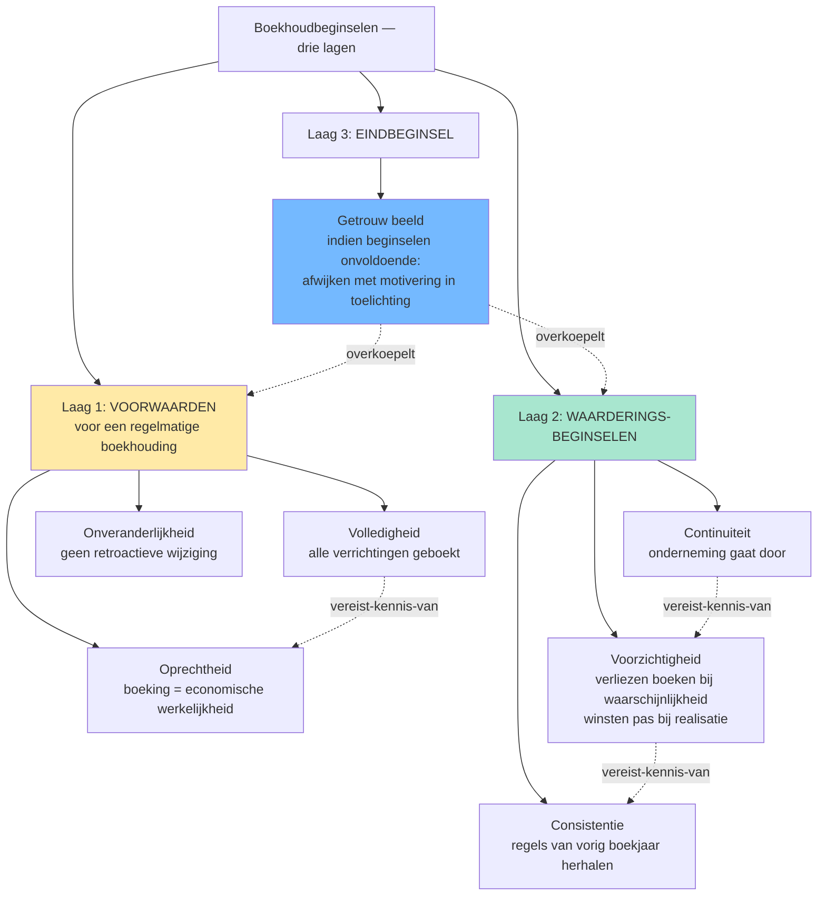
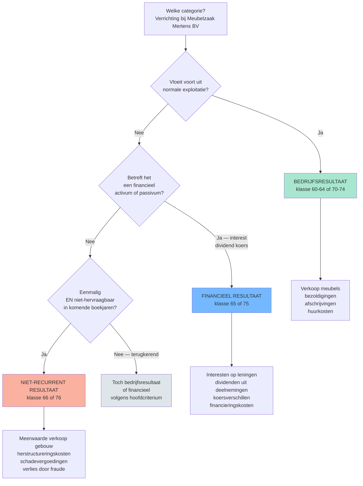
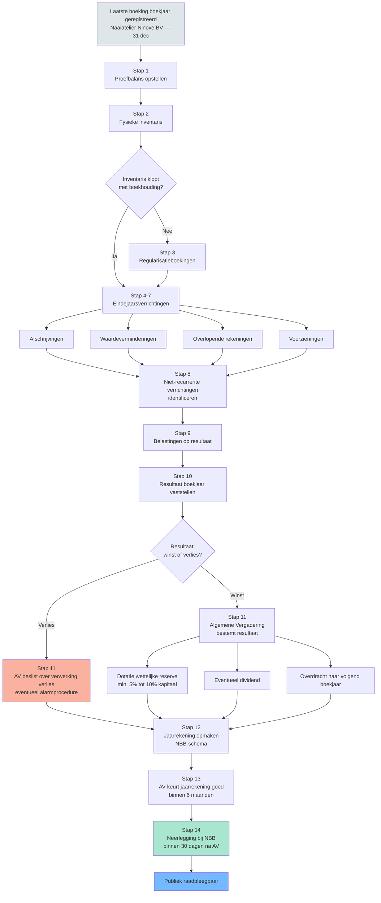

> [!warning]- Open beslissingen
> De volgende gaps zijn nog open voor dit programmaonderdeel — inhoud kan onvolledig zijn:
> - `edges.target-ontbreekt` op `continuiteitsbeginsel`: edges[].target verwijst naar 'boekhoudkundige-beginselen', 'vereffening' en 'waarderingsregels' — ge…
> - `edges.target-ontbreekt` op `voorzichtigheidsbeginsel`: edges[].target naar 'boekhoudkundige-beginselen', 'overeenstemmingsprincipe' en 'waarderingsregels' …
> - `edges.target-ontbreekt` op `getrouw-beeld`: edges[].target naar 'boekhoudkundige-beginselen' — bestaat niet. Canoniek: 'aanvullende-boekhoudbegi…
> - `edges.target-ontbreekt` op `onveranderlijkheid-boekingen`: edges[].target verwijst naar 'boekhoudkundige-beginselen' — bestaat niet. Vervang door 'aanvullende-…
> - `edges.target-ontbreekt` op `inventaris`: edges[].target naar 'jaarafsluiting' en 'waarderingsregels' — beide bestaan niet als record. 'jaaraf…
> - `edges.target-ontbreekt` op `overlopende-rekeningen`: edges[].target naar 'jaarafsluiting' (= eindejaarsverrichtingen) en 'matching-principe' (bestaat nie…
> - `edges.target-ontbreekt` op `oprichtingskosten`: edges[].target naar 'obligatielening' — bestaat niet. Mogelijk records.ontbreekt-gap voor PO 1.1 (op…
> - `edges.target-ontbreekt` op `dagboek`: edges[].target naar 'verantwoordingsstuk' — bestaat niet als record. Centraal begrip in dubbel-boekh…
> - `edges.target-ontbreekt` op `regelmatige-boekhouding`: edges[].target naar 'verantwoordingsstuk' — bestaat niet. Zelfde gap als dagboek (records.ontbreekt-…
> - `records.overlappend-fenomeen` op `getrouw-beeld`: Sterke conceptuele overlap met `getrouw-beeld-jaarrekening` (parallelle PO 1.2-run): beide beschrijv…
> - `records.overlappend-fenomeen` op `bewaring-boekhoudstukken`: Sterke overlap met `bewaartermijn-boekhouding` (PO 1.2): beide steunen op WER art. III.86 (7-jaars b…
> - `records.overlappend-fenomeen` op `rechten-verplichtingen-buiten-balans`: Drie records voor hetzelfde fenomeen: `rechten-verplichtingen-buiten-balans` (PO 1.1) + `klasse-0-ni…
> - `records.overlappend-fenomeen` op `jaarrekening`: Overlap met `jaarrekening-schema` en `samenstelling-statutaire-jaarrekening` (PO 1.2). PO 1.1-record…
> - `edges.target-ontbreekt` op `eigen-middelen`: Edge (type=`getriggerd-door`) → `alarmprocedure` wijst naar een niet-bestaand record. ENRICH-actie: …
> - `edges.target-ontbreekt` op `financiele-vaste-activa`: Edge (type=`bevat`) → `deelneming` wijst naar een niet-bestaand record. ENRICH-actie: ofwel record `…
> - `edges.target-ontbreekt` op `financiele-vaste-activa`: Edge (type=`vergelijkt-met`) → `geldbelegging` wijst naar een niet-bestaand record. ENRICH-actie: of…
> - `edges.target-ontbreekt` op `financiele-verrichtingen`: Edge (type=`onderdeel-van`) → `resultatenrekening` wijst naar een niet-bestaand record. ENRICH-actie…
> - `edges.target-ontbreekt` op `immateriele-vaste-activa`: Edge (type=`bevat`) → `goodwill` wijst naar een niet-bestaand record. ENRICH-actie: ofwel record `go…
> - `edges.target-ontbreekt` op `resultaatverwerking`: Edge (type=`getriggerd-door`) → `jaarafsluiting` wijst naar een niet-bestaand record. ENRICH-actie: …
> - `edges.target-ontbreekt` op `bedrijfsresultaat`: Edge (type=`onderdeel-van`) → `resultatenrekening` wijst naar een niet-bestaand record. ENRICH-actie…
> - `edges.target-ontbreekt` op `materiele-vaste-activa`: Edge (type=`bevat`) → `terrein` wijst naar een niet-bestaand record. ENRICH-actie: ofwel record `ter…
> - `edges.target-ontbreekt` op `niet-recurrente-verrichtingen`: Edge (type=`onderdeel-van`) → `resultatenrekening` wijst naar een niet-bestaand record. ENRICH-actie…
> - `edges.target-ontbreekt` op `jaarrekening`: Edge (type=`bevat`) → `balans` wijst naar een niet-bestaand record. ENRICH-actie: ofwel record `bala…
> - `edges.target-ontbreekt` op `jaarrekening`: Edge (type=`bevat`) → `resultatenrekening` wijst naar een niet-bestaand record. ENRICH-actie: ofwel …
> - `edges.target-ontbreekt` op `jaarrekening`: Edge (type=`bevat`) → `toelichting` wijst naar een niet-bestaand record. ENRICH-actie: ofwel record …
> - `edges.target-ontbreekt` op `jaarrekening`: Edge (type=`getriggerd-door`) → `jaarafsluiting` wijst naar een niet-bestaand record. ENRICH-actie: …
> - `vergelijkingsparen.target-ontbreekt` op `financiele-vaste-activa`: vergelijkingsparen[].vergelijking_met = `geldbelegging` wijst naar niet-bestaand record.…
> - `vergelijkingsparen.target-ontbreekt` op `leasing`: vergelijkingsparen[].vergelijking_met = `huur` wijst naar niet-bestaand record.…
> - `vergelijkingsparen.target-ontbreekt` op `uitgiftepremie`: vergelijkingsparen[].vergelijking_met = `beschikbare-reserves` wijst naar niet-bestaand record.…
> - `vergelijkingsparen.target-ontbreekt` op `bedrijfsvorderingen`: vergelijkingsparen[].vergelijking_met = `vorderingen-op-meer-dan-een-jaar` wijst naar niet-bestaand …
> - `vergelijkingsparen.target-ontbreekt` op `wettelijke-reserve`: vergelijkingsparen[].vergelijking_met = `beschikbare-reserves` wijst naar niet-bestaand record.…
> - `vergelijkingsparen.target-ontbreekt` op `voorzichtigheidsbeginsel`: vergelijkingsparen[].vergelijking_met = `overeenstemmingsprincipe` wijst naar niet-bestaand record.…
> - `vergelijkingsparen.ontbreekt` op `niet-recurrente-verrichtingen`: Stagiairs verwarren `niet-recurrent` met het oude `uitzonderlijk`. Record mist een vergelijkingspaar…
> - `vergelijkingsparen.ontbreekt` op `eigen-aandelen`: Eigen aandelen vs gewone deelnemingen / financiele-vaste-activa is een klassieke valstrik (eigen aan…
> - `vergelijkingsparen.ontbreekt` op `bewaring-boekhoudstukken`: Bewaartermijn van boekhoudstukken (7 jaar, WER art. III.86) versus fiscale bewaarplicht (10 jaar, WI…
> - `bron-corpus-uitbreiding` op `financiele-verrichtingen`: Bundle 1.1.II.O bevatte vooral MAR-fragmenten + WIB-art. 2 definities; weinig CBN-adviezen over fina…
> - `bron-corpus-uitbreiding` op `kapitaalwijziging`: Bundle 1.1.II.T bevatte veel CBN-fusie/splitsings-adviezen (2021/10, 2022/12, 2022/13). Niet in deze…

## Leesgids

De minicursus volgt de balanspost-logica: na de beginselen werk je je van boven naar beneden door de balans (vaste activa, vlottende activa, eigen vermogen, schulden), met telkens een synthese die het cluster aaneenrijgt. Lees eerst de oriëntatie en de beginselen aandachtig — die geven het redeneerkader waarop elk volgend hoofdstuk leunt. De competenties zijn werkprocedures: gebruik ze als check of je de concepten kan toepassen, niet als losse leerstof. Eindig met de twee syntheses over resultaat-categorisatie en boekjaar-einde — daar valt de hele cursus pas echt op zijn plek.

## Waarom dit programmaonderdeel telt

Algemene boekhouding is het fundament waarop elk ander programmaonderdeel rust: zonder een regelmatige boekhouding is er geen jaarrekening, geen fiscale aangifte, geen audit en geen revisorale opdracht denkbaar. De wet maakt van de boekhouding bovendien een bewijsmiddel met juridische gevolgen — een onregelmatigheid hier is geen administratieve slordigheid maar tast de waarde aan van wat erop volgt. De stof is breed maar herhaalt steeds dezelfde patronen: elke balanspost vraagt om identificatie, waardering, periodisering en correcte categorisatie van het resultaat. Wie die symmetrie ziet, hoeft niet elk hoofdstuk apart te memoriseren maar herkent dezelfde redeneerstappen op nieuwe situaties. Het examen test precies dat herkenningsvermogen: niet de tarieven, maar het juiste kader kiezen voor een verrichting die je nooit eerder zag.

## Wat doet een boekhouding? Van enkelvoudig naar dubbel, en waarom dat ertoe doet

Een boekhouding is geen interne stuurmaatregel maar een wettelijk verankerd informatie-instrument: aandeelhouders, schuldeisers, werknemers, fiscus en NBB lezen erin wat in de onderneming gebeurd is, en de wet kent eraan bewijswaarde toe. Wie kiest tussen vereenvoudigde en dubbele boekhouding kiest dus niet voor minder werk maar voor een ander wettelijk regime — bepaald door grootte-criteria, niet door voorkeur. De rest van dit programmaonderdeel werkt één gedachte uit: zorgen dat die boekhouding getrouw weergeeft wat economisch gebeurd is.

## De fundamentele beginselen: het redeneerkader achter elke boeking

De boekhoudbeginselen zijn geen losse regels maar het redeneerkader dat elke boeking en elke waardering stuurt — van een eenvoudige aankoop tot een complexe leasing-kwalificatie. Lees ze daarom niet als een lijst om te memoriseren, maar als de bril waardoor je naar elke verrichting kijkt. De synthese die hierop volgt maakt expliciet hoe de beginselen drie lagen vormen: voorwaarden, waarderingsregels en eindtoets.

- [[continuiteitsbeginsel|Boekhoudkundig continuïteitsbeginsel (going concern)]] · `beginsel`
- [[voorzichtigheidsbeginsel|Voorzichtigheidsbeginsel]] · `beginsel`
- [[getrouw-beeld|Getrouw beeld]] · `beginsel`
- [[onveranderlijkheid-boekingen|Onveranderlijkheid van de boekingen]] · `beginsel`
- [[consistentiebeginsel]] — record niet gevonden
- [[oprechtheidsbeginsel]] — record niet gevonden
- [[volledigheidsbeginsel]] — record niet gevonden
- [[aanvullende-boekhoudbeginselen]] — record niet gevonden

## Boekhoudbeginselen &mdash; overzicht

Acht beginselen op een rij zien is niet hetzelfde als hun samenhang doorgronden. Deze synthese ordent ze in drie lagen — voorwaarden, waarderingsregels en eindtoets — zodat zichtbaar wordt waarom geen enkel beginsel een ander dubbelt.

**Kerninzichten**:
- De zeven beginselen zijn niet allemaal gelijkwaardig: drie zijn voorwaarden om uberhaupt van een 'regelmatige' boekhouding te kunnen spreken (volledigheid, oprechtheid, onveranderlijkheid), drie sturen de waardering (continuiteit, voorzichtigheid, consistentie), en het getrouw-beeld-beginsel staat erboven als eindtoets. Stagiairs die ze op een rij zien staan zonder hierarchie missen die drie-lagen-structuur.
- Het getrouw-beeld-beginsel bevat een overrule-mechanisme: als toepassing van de andere beginselen onvoldoende is om een getrouw beeld te geven, moet je afwijken &mdash; met motivering in de toelichting (KB WVV art. 3:1 derde lid). Dit is geen vrijbrief: het bestuur moet uitdrukkelijk vaststellen dat de standaardregels onvoldoende zijn.
- Voorzichtigheid en getrouw-beeld kunnen op gespannen voet staan: pure voorzichtigheid leidt tot stille reserves (winsten onderschat, verliezen overschat), wat het getrouwe beeld verstoort. De moderne lezing (Richtlijn 2013/34/EU art. 6 §1.c): voorzichtigheid betekent geen overdreven onderwaardering, alleen waarschijnlijke verliezen + risico's opnemen.
- De onveranderlijkheid van boekingen is een formele eis (geen Tipp-Ex, geen overschrijven) maar geen verbod op correcties. Een verkeerde boeking corrigeer je via een tegenboeking met datum en verwijzing &mdash; de oorspronkelijke fout blijft zichtbaar in de audit-trail.
- Volledigheid omvat ook de rechten en verplichtingen buiten de balans (klasse 0): garanties verleend door [[Meubelzaak Mertens BV]], leaseverplichtingen, borgstellingen, pensioenverplichtingen. Wie deze vergeet schendt het volledigheidsbeginsel zonder dat de balans uit evenwicht raakt &mdash; daarom is het een silent error die makkelijk gemist wordt op examens.

[[boekhoudbeginselen-overzicht|→ Volledige synthese-fiche]]

## Voeren van een regelmatige dubbele boekhouding voor een onderneming

Deze procedure operationaliseert de beginselen tot een dagelijkse werkroutine: van verantwoordingsstuk over dagboek naar grootboek en proefbalans. Het is de basiscyclus waarop alle latere competenties in dit programmaonderdeel voortbouwen.

[[competenties/voeren-regelmatige-dubbele-boekhouding|→ Volledige procedure]]

## Toepassen van de fundamentele boekhoudbeginselen op een concrete verrichting

Waar de vorige competentie de routine vastlegt, oefent deze het oordeel: welk beginsel weegt zwaarder als er spanning ontstaat tussen voorzichtigheid en getrouw beeld, of tussen continuïteit en realisatie? Zonder dit denkwerk blijven de beginselen abstract; mét dit denkwerk wordt elke boeking een gemotiveerde keuze.

[[competenties/toepassen-fundamentele-boekhoudbeginselen|→ Volledige procedure]]

## De gewone bedrijfsuitoefening: aankopen, verkopen, btw en vorderingen

Dit is het hart van de operationele cyclus: de stroom van transacties die de exploitatie voedt, met aan de actiefzijde vorderingen en aan de passiefzijde schulden, en in de resultatenrekening het bedrijfsresultaat. De drie concepten hieronder vormen één economisch geheel — een aankoop creëert een schuld én een kost, een verkoop creëert een vordering én een opbrengst.

- [[bedrijfsvorderingen|Bedrijfsvorderingen]] · `begrip`
- [[schulden|Schulden (LT en KT)]] · `fenomeen`
- [[bedrijfsresultaat|Bedrijfsresultaat (bedrijfskosten en bedrijfsopbrengsten)]] · `fenomeen`

## Boeken van een aankoop en verkoop met btw en betaling

De aankoop-verkoop-cyclus is de meest voorkomende verrichting in elke onderneming en daarmee ook de meest geteste op het examen. De truc zit in de symmetrie: dezelfde boeking-logica geldt voor beide kanten, met btw als doorlopende post die nooit echt tot je resultaat behoort.

[[competenties/boeken-aankoop-verkoop-met-btw|→ Volledige procedure]]

## Vaste activa: oprichtingskosten, materiële, immateriële en financiële

Vaste activa zijn de duurzame productiemiddelen — bedoeld om de onderneming jaren te dienen, niet om te verkopen. De drie hoofdcategorieën (materieel, immaterieel, financieel) volgen dezelfde redeneerstappen: aanschaffingswaarde bepalen, gebruiksduur inschatten, periodisering via afschrijving regelen en bij externe waardedaling waardevermindering of herwaardering toepassen. Die symmetrie keert later identiek terug bij vlottende activa — alleen met andere termijnen.

- [[oprichtingskosten|Oprichtingskosten]] · `fenomeen`
- [[aanschaffingswaarde|Aanschaffingswaarde]] · `begrip`
- [[materiele-vaste-activa|Materiële vaste activa]] · `begrip`
- [[immateriele-vaste-activa|Immateriële vaste activa]] · `begrip`
- [[financiele-vaste-activa|Financiële vaste activa]] · `begrip`
- [[herwaarderingsmeerwaarden|Herwaarderingsmeerwaarden]] · `fenomeen`
- [[afschrijvingen|Afschrijvingen]] · `methode`
- [[waardeverminderingen|Waardeverminderingen]] · `methode`

## Boeken van oprichtings- en kapitaalverhogingskosten en hun afschrijving

Oprichtingskosten zijn een atypisch vast actief: ze representeren geen verkoopbaar goed maar opgelopen kosten die je over meerdere jaren wil spreiden. Hun bijzondere boekhoudkundige behandeling toont waarom de wet hier afwijkt van het kostenbeginsel en wat dat betekent voor je afschrijvingsplan.

[[competenties/boeken-oprichtings-en-kapitaalverhogingskosten|→ Volledige procedure]]

## Opstellen van het afschrijvingsplan voor materiële vaste activa

Het afschrijvingsplan is geen wiskundige formule maar een verantwoorde schatting van gebruiksduur en restwaarde, vastgelegd vóór ingebruikname en consistent toegepast. Wie de keuze tussen lineair, degressief of gebruiksgebonden goed motiveert, beschermt het getrouw beeld én sluit fiscale discussies uit.

[[competenties/opstellen-afschrijvingsplan-vaste-activa|→ Volledige procedure]]

## Vlottende activa: voorraden, vorderingen, geldbeleggingen en liquide middelen

Vlottende activa zijn bedoeld om binnen één bedrijfscyclus weer in liquide middelen om te zetten. De waarderingslogica spiegelt die van de vaste activa — aanschaffingswaarde, periodische herziening, waardevermindering bij externe verlaging — maar zonder afschrijving omdat de gebruiksduur kort is. Let bij elke post op de scheidslijn naar de vaste-activa-zijde, want intentie en termijn bepalen de rubriek.

- [[voorraden|Voorraden]] · `fenomeen`
- [[geldbeleggingen|Geldbeleggingen en liquide middelen]] · `begrip`

## Waarderen en boeken van voorraden volgens FIFO of gewogen gemiddelde

Voorraden zijn het schoolvoorbeeld waar de methodekeuze direct doorwerkt in zowel balans als resultaat. De competentie oefent niet één formule maar de redenering: welke methode past bij de aard van de voorraad, en hoe hou je die consistent vol over boekjaren heen.

[[competenties/waarderen-en-boeken-voorraden-fifo-ggp|→ Volledige procedure]]

## Boeken van waardeverminderingen op vorderingen en voorraden

Een waardevermindering is de boekhoudkundige vertaling van het voorzichtigheidsbeginsel op vlottende activa: pas aan zodra de realiseerbare waarde lager ligt, niet wachten op de definitieve afboeking. De truc is het onderscheid met afschrijving en voorziening helder voor ogen houden, want examenvragen draaien hier vaak op een verkeerd gekozen instrument.

[[competenties/boeken-waardeverminderingen-op-vorderingen-en-voorraden|→ Volledige procedure]]

## Eigen vermogen, voorzieningen en lange-termijn-schulden

De passiefzijde van de balans toont waar de financiering vandaan komt: eigen middelen, voorzieningen voor toekomstige verplichtingen en schulden. Eigen vermogen heeft een strikte juridische opbouw met regels over kapitaal, reserves en uitkeerbaarheid; voorzieningen vragen om voorzichtige inschatting van waarschijnlijke verliezen. De kapitaalwijziging laat zien hoe deze rubrieken in beweging komen bij beslissingen van de algemene vergadering.

- [[eigen-middelen|Eigen middelen (eigen vermogen)]] · `fenomeen`
- [[uitgiftepremie|Uitgiftepremie]] · `begrip`
- [[wettelijke-reserve|Wettelijke reserve]] · `regel`
- [[voorzieningen|Voorzieningen voor risico's en kosten]] · `fenomeen`
- [[kapitaalwijziging|Kapitaalwijziging (verhoging en vermindering)]] · `procedure`

## Boeken van een voorziening voor risico's en kosten

Een voorziening boek je niet wanneer iets zou kunnen gebeuren, maar wanneer het waarschijnlijk is én redelijk te schatten. Wie de drempel te laag legt creëert stille reserves, wie hem te hoog legt schendt voorzichtigheid — daartussen ligt de oordeelszone die deze competentie traint.

[[competenties/boeken-voorzieningen-voor-risicos-en-kosten|→ Volledige procedure]]

## Overlopende rekeningen en het matching-principe

Overlopende rekeningen lijken een technisch detail, maar ze belichamen het hart van periodisering: kosten en opbrengsten toerekenen aan het boekjaar waarop ze economisch slaan, niet aan het boekjaar waarin de betaling valt. Zonder deze rekeningen valt het matching-principe in duigen en wordt het resultaat een functie van de toevallige timing van facturen.

- [[overlopende-rekeningen|Overlopende rekeningen]] · `methode`

## Verwerken van overlopende rekeningen volgens het matching-principe

Bij boekjaareinde komen alle vooruitbetaalde of nog te ontvangen bedragen op tafel: vier scenario's, vier symmetrische boekingen. De procedure traint vooral het herkennen van welk scenario van toepassing is — fout categoriseren is de meest gemaakte fout op deze leerstof.

[[competenties/verwerken-overlopende-rekeningen-matching|→ Volledige procedure]]

## Bedrijfs- · financieel · niet-recurrent &mdash; in welke categorie hoort deze verrichting?

De vorige hoofdstukken hebben elke verrichtingstype apart geboekt; nu komt de samenhang in beeld. De resultatenrekening rangschikt alle kosten en opbrengsten in drie categorieën met directe fiscale en analytische gevolgen — deze beslisboom maakt expliciet welk criterium dominant is in twijfelgevallen.

**Kerninzichten**:
- Het criterium 'normale exploitatie' is sectorafhankelijk. Voor [[Solaris Sint-Truiden BV]] (effectenportefeuille als kernactiviteit) horen koerswinsten bij het bedrijfsresultaat &mdash; voor [[Meubelzaak Mertens BV]] horen dezelfde koerswinsten bij het financieel resultaat. De rubriek-keuze is dus geen mechanische lookup, maar een redenering over wat 'normaal' is voor deze onderneming.
- 'Niet-recurrent' is sinds KB 21/10/2018 niet meer hetzelfde als 'uitzonderlijk'. Het oude regime kende een formele rubriek 'uitzonderlijke kosten/opbrengsten' &mdash; daar zat veel in dat eigenlijk wel terugkwam (bv. jaarlijkse meerwaarden bij verkoop van afgeschreven vaste activa). Het nieuwe regime hanteert twee feitelijke criteria: eenmalig + niet-hervraagbaar. Een vraag op het examen die nog de term 'uitzonderlijk' gebruikt is typisch een test op kennis van de regime-wijziging.
- De drie categorieen leiden tot drie subtotalen in de resultatenrekening, die elk apart fiscaal relevant zijn. Bij de aangifte vennootschapsbelasting (zie [[bedrijfsresultaat]] + WIB) bepaalt de categorisatie of een meerwaarde onder de gespreide taxatie kan vallen (typisch alleen voor materiele vaste activa onder bedrijfsresultaat) of niet. Verkeerde categorisatie heeft dus directe fiscale impact &mdash; geen louter cosmetische keuze.

[[resultaat-categorisatie-beslisboom|→ Volledige synthese-fiche]]

## Bijzondere transacties: leasing, obligaties, eigen aandelen en eigendom

Deze cluster bundelt verrichtingen waar de juridische vorm en de economische realiteit kunnen uiteenlopen — en waar de boekhoudkundige verwerking altijd de economische realiteit volgt. Leasing kan huur lijken maar koop zijn; eigen aandelen lijken activa maar verlagen het eigen vermogen; opsplitsing van eigendom doorbreekt het eenvoudige eigenaarsbegrip. Wie hier de kwalificatie correct uitvoert, beheerst meteen ook de moeilijkste examenvragen van dit programmaonderdeel.

- [[leasing|Leasing (financieel en operationeel)]] · `fenomeen`
- [[obligatielening|Obligatielening]] · `fenomeen`
- [[eigen-aandelen|Beheer van eigen aandelen]] · `fenomeen`
- [[opsplitsing-eigendom|Opsplitsing eigendom (vruchtgebruik, opstal, erfpacht)]] · `fenomeen`
- [[rechten-verplichtingen-buiten-balans|Rechten en verplichtingen buiten balans]] · `fenomeen`

## Kwalificeren en boeken van leasing (operationeel vs financieel)

De leasing-kwalificatie is een tweetraps-redenering: eerst toets je of de overeenkomst de economische eigendom overdraagt, daarna bepaal je de boekhoudkundige verwerking. Verkeerd kwalificeren zet zowel balans als resultatenrekening op het verkeerde been — bij operationeel staat er niets op de balans, bij financieel staat het volledige actief erop met bijbehorende schuld.

[[competenties/kwalificeren-en-boeken-leasing|→ Volledige procedure]]

## Boeken van uitgifte en aflossing van een obligatielening

Een obligatielening loopt over meerdere boekjaren en vraagt periodisering van zowel de hoofdsom als de intresten, met mogelijke uitgifte- of terugbetalingspremies die afzonderlijk worden afgeschreven. De procedure leert je de lening doorheen haar hele levensduur te volgen — van uitgifte over jaarlijkse rente tot eindaflossing.

[[competenties/boeken-uitgifte-en-aflossing-obligatielening|→ Volledige procedure]]

## Voeren van de boekhouding van een VZW met economische activiteit

Een VZW met economische activiteit volgt grotendeels dezelfde regels als een commerciële onderneming, maar met eigen accenten rond bestemming van het resultaat en specifieke rubrieken zoals fondsen. De competentie maakt zichtbaar waar het algemene kader gewoon doorloopt en waar het VZW-statuut afwijkende boekingen oplegt.

[[competenties/voeren-boekhouding-vzw-met-economische-activiteit|→ Volledige procedure]]

## Boekjaar afsluiten &mdash; van proefbalans tot neerlegging

Alle voorgaande hoofdstukken komen samen in één chronologische opvolging: van laatste boeking tot publicatie bij de NBB. Deze checklist laat zien dat de boekjaareinde-stappen niet onderling verwisselbaar zijn — elke stap levert input voor de volgende.

**Kerninzichten**:
- De volgorde is bindend: pas na de eindejaarsverrichtingen (stap 4-9) kan je het resultaat van het boekjaar vaststellen (stap 10). Pas na de algemene vergadering die het resultaat bestemt (stap 11) ken je het 'overgedragen resultaat' &mdash; pas dan is de jaarrekening volledig opmaakbaar (stap 12). Een examenvraag die zegt 'jaarrekening klaar, AV moet nog komen' bevat dus een logische fout: de jaarrekening kan niet 'klaar' zijn zonder AV-beslissing.
- De timing is wettelijk geketend: AV binnen 6 maanden na boekjaareinde (WVV art. 3:1 §1), neerlegging binnen 30 dagen na AV (WVV art. 3:10) en uiterlijk 7 maanden na boekjaareinde. Voor [[Naaiatelier Ninove BV]] met boekjaar dat eindigt op 31 december betekent dit: AV ten laatste 30 juni, neerlegging ten laatste 31 juli. Boete-risico: laattijdige neerlegging is een veelvoorkomende cliënt-vraag.
- Drie van de tien verplichte boekingen volgen direct uit de waarderingsbeginselen: afschrijvingen (consistentie), waardeverminderingen (voorzichtigheid), voorzieningen (voorzichtigheid). Wie de beginselen kent, kan deze stappen niet vergeten. Wie ze opvat als 'extra werk', vergeet er typisch een &mdash; bijvoorbeeld de waardeverminderingen op vorderingen.
- De wettelijke reserve (stap 11) ontstaat bij de resultaatverwerking, niet bij de jaarrekening-opmaak. Sequentieel: AV beslist welk percentage naar wettelijke reserve gaat (min. 5% van de winst, tot de wettelijke reserve 10% van het kapitaal bereikt). Pas dan staat het bedrag op rekening 130; pas dan past het in de jaarrekening die de AV daarna goedkeurt.

[[boekjaar-eindprocedure-checklist|→ Volledige synthese-fiche]]

## Uitvoeren van eindejaarsverrichtingen en opmaken van proefbalans

Eindejaarsverrichtingen vormen de operationele kern van de afsluit-procedure: afschrijvingen, waardeverminderingen, voorzieningen en overlopende rekeningen volgen elk uit een eerder bestudeerd beginsel. De competentie traint de discipline om ze systematisch te overlopen, want vergeten regularisaties zijn de meest voorkomende fout in boekjaarafsluitingen.

[[competenties/uitvoeren-eindejaarsverrichtingen-en-proefbalans|→ Volledige procedure]]

## Boeken van resultaatverwerking en bestemming (reserves, dividenden, belasting)

Resultaatverwerking is geen technische boeking maar de uitvoering van een AV-beslissing met een wettelijk verplichte volgorde: eerst de wettelijke reserve, dan eventuele statutaire reserves, dan dividenden en overdracht. De competentie leert je deze sequentie te respecteren en de uitkeringstest correct toe te passen.

[[competenties/boeken-resultaatverwerking-en-bestemming|→ Volledige procedure]]

## Vereffening en de levenscyclus voorbij continuïteit

Wanneer het continuïteitsbeginsel niet langer houdbaar is, kantelt de hele boekhoudkundige logica: van going-concern-waardering naar liquidatiewaarde. Deze afsluitende thematiek toont dat de beginselen geen statisch kader zijn maar afhangen van de levensfase van de onderneming.

- [[vereffening|Vereffening van een vennootschap]] · `procedure`

## Reflectie: digitalisering, e-invoicing en de boekhouding van morgen

De technische uitvoering van de boekhouding verandert sneller dan ooit — verplichte e-invoicing, real-time rapportering, automatische OCR-boekingen en AI-categorisatie veranderen het takenpakket van de boekhouder ingrijpend. Maar de wettelijke beginselen blijven dezelfde: onveranderlijkheid, volledigheid en bewaarplicht gelden voor digitale stromen even strikt als voor papieren dagboeken. Wie de logica van dit programmaonderdeel beheerst, kan elke nieuwe tool toetsen aan dezelfde vraag: levert dit een regelmatige boekhouding op? Dat oordeelsvermogen is precies wat de stagiair onderscheidt van de software.

## Synthese-stappenplan

Bij een onbekende verrichting volg je telkens dezelfde route. Eerst identificeer je het economische fenomeen: wat is er werkelijk gebeurd, los van de juridische vorm? Vervolgens kies je het juiste kader — vast of vlottend, eigen of vreemd vermogen, recurrent of niet-recurrent — door de boekhoudbeginselen op de feiten toe te passen. Daarna bepaal je de waardering volgens de relevante regel en boek je de verrichting met respect voor het dubbel-boekhoudbeginsel. Bij boekjaareinde toets je elke balanspost tegen het voorzichtigheids- en matching-principe: zijn afschrijvingen, waardeverminderingen, voorzieningen en overlopende posten correct geboekt? Eindig met de resultaatcategorisatie en de bestemming: pas dan is de jaarrekening opmaakbaar. Wie deze zes stappen consequent volgt, mist geen enkele eindejaarsverrichting en houdt het getrouw beeld overeind.

## Cheatsheet

### Kritische drempelwaarden

| Concept | Naam | Waarde | Eenheid | Gevolg |
|---|---|---|---|---|
| [[jaarrekening]] | Kleine vennootschap (verkort schema toegelaten) | Maximaal 1 criterium overschreden: balanstotaal € 6.000.000, omzet € 11.250.000, gemiddeld personeel 50 VTE | WVV art. 1:24 — 1:25 | Mag jaarrekening in **verkort schema** opstellen; vrijgesteld van jaarverslag (tenzij beursgenoteerd), commissaris-vrijs… |
| [[jaarrekening]] | Micro-vennootschap (microschema toegelaten) | Maximaal 1 criterium overschreden: balanstotaal € 350.000, omzet € 700.000, gemiddeld personeel 10 VTE | WVV art. 1:25 | Mag jaarrekening in **microschema** opstellen — kortere balans, minder verplichte vermeldingen in toelichting |
| [[vereenvoudigde-boekhouding]] | Omzetdrempel voor vereenvoudigde boekhouding | € 500.000 | jaaromzet excl. BTW | Natuurlijke personen, vennootschappen onder firma (VOF) en gewone commanditaire vennootschappen (GCV) met een omzet onde… |
| [[wettelijke-reserve]] | Verplichte afhouding van de nettowinst | 5 % | van de nettowinst van het boekjaar | Verplichte toevoeging aan wettelijke reserve uit winstbestemming |
| [[wettelijke-reserve]] | Plafond wettelijke reserve | 10 % | van het maatschappelijk kapitaal (NV) of van de eigen vermogensinbreng (BV) | Wanneer de wettelijke reserve dit plafond bereikt, vervalt de verplichte jaarlijkse afhouding |

### Vergelijkingsparen-matrix

| Concept | Verwarrend met | Trigger |
|---|---|---|
| [[afschrijvingen]] | [[waardeverminderingen]] | Examen: 'gebouw' (gebruiksduur beperkt) → afschrijving. 'Terrein' (onbeperkt) → waardevermindering. 'Voorraad' (vlottend actief) → waardevermindering. |
| [[bedrijfsresultaat]] | [[financiele-verrichtingen]] | Examen: 'intrest op leveranciersschuld te laat betaald' — financiële kost (klasse 65), NIET bedrijfskost. 'huurkost van magazijn' — bedrijfskost (klasse 61). |
| [[bedrijfsvorderingen]] | [[vorderingen-op-meer-dan-een-jaar]] | Examen: 'lening 3 jaar verleend in jaar 1, op 31/12/20X2 nog 18 maanden te lopen' → splitsen: 12 maanden op rubriek VII, 6 maanden op rubriek V. |
| [[dubbel-boekhouden]] | [[vereenvoudigde-boekhouding]] | Examenvraag: kleine eenmanszaak met omzet onder € 500.000 (WER drempel) — mag vereenvoudigd, hoeft geen dubbel boekhouden. |
| [[financiele-vaste-activa]] | [[geldbelegging]] | Examen: 'verworven met de bedoeling de groep duurzaam te ondersteunen' → FVA. 'tijdelijke parking van overtollige liquiditeiten' → geldbelegging. |
| [[geldbeleggingen]] | [[financiele-vaste-activa]] | Examen: 'wij houden 10 % aandelen in een leverancier om de bevoorrading te beveiligen' → FVA (duurzame strategische relatie). 'wij houden 1 % aandelen in een beursgenoteerde bank voor rendement' → geldbelegging. |
| [[herwaarderingsmeerwaarden]] | [[aanschaffingswaarde]] | Examen: 'aanpassen waarde van een terrein boven aankoopprijs' → herwaardering (mits voorwaarden), niet aanschaffingswaarde wijzigen. |
| [[immateriele-vaste-activa]] | [[oprichtingskosten]] | Examen: 'notariskosten kapitaalverhoging' → 200. 'aankoop patent' → 211. |
| [[immateriele-vaste-activa]] | [[materiele-vaste-activa]] | Examen: 'aankoop industriële mengmachine € 45.000' → materieel (rubriek 23). 'aankoop licentie op patroontekening' → immaterieel (rubriek 211). |
| [[jaarrekening]] | [[geconsolideerde-jaarrekening]] | Examen: 'jaarrekening Aurelia Holding NV' alleen = statutair. 'jaarrekening Aurelia Holding NV + dochters' = geconsolideerd. |
| [[leasing]] | [[huur]] | Examen: 'gewone huur kantoor € 1.500/maand' = kostenrekening 61. 'leasing met optie tot aankoop' = onderzoek of optie ≤ 15 % → financieel of operationeel. |
| [[materiele-vaste-activa]] | [[immateriele-vaste-activa]] | Examen: 'gekocht productiehal € 480.000' → MVA (221). 'gekocht patent € 35.000' → IVA (211). |
| [[oprichtingskosten]] | [[immateriele-vaste-activa]] | Examen: 'patentaankoop voor € 80.000' → immaterieel vast actief (rubr. 21), NIET oprichtingskosten. |
| [[rechten-verplichtingen-buiten-balans]] | [[voorzieningen]] | Examen: 'lopende rechtsgeding met 30 % verlieskans, schadebedrag onbekend' → klasse 0 (te onzeker voor voorziening). 'lopende rechtsgeding met 70 % verlieskans, schadebedrag € 75.000' → voorziening 16. |
| [[uitgiftepremie]] | [[beschikbare-reserves]] | Examen: 'kunnen uitgiftepremies als dividend worden uitgekeerd?' — Niet als gewoon dividend, wel via kapitaalverminderingsprocedure. |
| [[vereenvoudigde-boekhouding]] | [[dubbel-boekhouden]] | Examen: 'eenmanszaak met omzet € 320.000' → vereenvoudigd toegelaten. 'BV met omzet € 200.000' → dubbel verplicht. |
| [[voorzichtigheidsbeginsel]] | [[overeenstemmingsprincipe]] | Examen: 'mogen we de winst op een nog niet voltooid contract al boeken als de bijbehorende kosten al gemaakt zijn?' — nee, voorzichtigheid/realisatie primeert. |
| [[voorzieningen]] | [[waardeverminderingen]] | Examen: 'wij verwachten een verlies op een rechtsgeding' → voorziening. 'klant zal vermoedelijk niet betalen' → waardevermindering. |
| [[voorzieningen]] | [[schulden]] | Examen: 'betwiste belasting € 18.000' → voorziening 161. 'aanvaarde belasting € 18.000' → schuld 45. |
| [[waardeverminderingen]] | [[afschrijvingen]] | Examen: 'voorraad goederen waarvan marktprijs daalt' → waardevermindering (vlottend actief). 'machine waarvan technische ontwaarding sneller dan voorzien' → niet-recurrente afschrijving (beperkte gebruiksduur). |
| [[waardeverminderingen]] | [[voorzieningen]] | Examen: 'wij verwachten een vonnis tegen ons van € 80.000' → voorziening. 'klant zal vermoedelijk niet betalen' → waardevermindering. |
| [[wettelijke-reserve]] | [[beschikbare-reserves]] | Examen: 'kunnen we deze reserves uitkeren?' — Wettelijke: nee onder minimum. Beschikbare: ja na uitkeringstest. |

## Examenfocus

Drie denkpatronen keren stelselmatig terug op examenvragen over dit programmaonderdeel. Het eerste is kwalificatie vóór waardering: voordat je een bedrag boekt moet je weten in welke rubriek de verrichting hoort, want dezelfde euro kan in verschillende balansposten landen afhankelijk van intentie en termijn. Het tweede is de symmetrie tussen instrumenten — afschrijving versus waardevermindering, voorziening versus schuld, leasing versus huur — waar één criterium de kwalificatie kantelt en de rest volgt. Het derde is de chronologische logica van boekjaareinde: examenvragen die de volgorde van eindejaarsverrichtingen omkeren of een stap overslaan, bevatten typisch een logische fout die je moet detecteren. Beheers deze drie patronen en je herkent het juiste kader ook bij verrichtingen die je nooit eerder zag.

<!-- TODO: examenvragen via classify_vragen_naar_programmaonderdelen.py -->

## Competentie-index

- [[competenties/boeken-aankoop-verkoop-met-btw|Boeken van een aankoop en verkoop met btw en betaling]]
- [[competenties/boeken-voorzieningen-voor-risicos-en-kosten|Boeken van een voorziening voor risico's en kosten]]
- [[competenties/boeken-oprichtings-en-kapitaalverhogingskosten|Boeken van oprichtings- en kapitaalverhogingskosten en hun afschrijving]]
- [[competenties/boeken-resultaatverwerking-en-bestemming|Boeken van resultaatverwerking en bestemming (reserves, dividenden, belasting)]]
- [[competenties/boeken-uitgifte-en-aflossing-obligatielening|Boeken van uitgifte en aflossing van een obligatielening]]
- [[competenties/boeken-waardeverminderingen-op-vorderingen-en-voorraden|Boeken van waardeverminderingen op vorderingen en voorraden]]
- [[competenties/kwalificeren-en-boeken-leasing|Kwalificeren en boeken van leasing (operationeel vs financieel)]]
- [[competenties/opstellen-afschrijvingsplan-vaste-activa|Opstellen van het afschrijvingsplan voor materiële vaste activa]]
- [[competenties/toepassen-fundamentele-boekhoudbeginselen|Toepassen van de fundamentele boekhoudbeginselen op een concrete verrichting]]
- [[competenties/uitvoeren-eindejaarsverrichtingen-en-proefbalans|Uitvoeren van eindejaarsverrichtingen en opmaken van proefbalans]]
- [[competenties/verwerken-overlopende-rekeningen-matching|Verwerken van overlopende rekeningen volgens het matching-principe]]
- [[competenties/voeren-boekhouding-vzw-met-economische-activiteit|Voeren van de boekhouding van een VZW met economische activiteit]]
- [[competenties/voeren-regelmatige-dubbele-boekhouding|Voeren van een regelmatige dubbele boekhouding voor een onderneming]]
- [[competenties/waarderen-en-boeken-voorraden-fifo-ggp|Waarderen en boeken van voorraden volgens FIFO of gewogen gemiddelde]]

## Concept-index

- [[aanschaffingswaarde|Aanschaffingswaarde]] · `begrip`
- [[afschrijvingen|Afschrijvingen]] · `methode`
- [[resultaat-categorisatie-beslisboom|Bedrijfs- · financieel · niet-recurrent &mdash; in welke categorie hoort deze verrichting?]] · `synthese`
- [[bedrijfsresultaat|Bedrijfsresultaat (bedrijfskosten en bedrijfsopbrengsten)]] · `fenomeen`
- [[bedrijfsvorderingen|Bedrijfsvorderingen]] · `begrip`
- [[eigen-aandelen|Beheer van eigen aandelen]] · `fenomeen`
- [[bewaring-boekhoudstukken|Bewaring van boekhoudkundige stukken]] · `regel`
- [[boekhoudbeginselen-overzicht|Boekhoudbeginselen &mdash; overzicht]] · `synthese`
- [[continuiteitsbeginsel|Boekhoudkundig continuïteitsbeginsel (going concern)]] · `beginsel`
- [[boekjaar-eindprocedure-checklist|Boekjaar afsluiten &mdash; van proefbalans tot neerlegging]] · `synthese`
- [[dagboek|Dagboek]] · `begrip`
- [[dubbel-boekhouden|Dubbel boekhouden]] · `methode`
- [[eigen-middelen|Eigen middelen (eigen vermogen)]] · `fenomeen`
- [[financiele-vaste-activa|Financiële vaste activa]] · `begrip`
- [[financiele-verrichtingen|Financiële verrichtingen (kosten + opbrengsten)]] · `fenomeen`
- [[geldbeleggingen|Geldbeleggingen en liquide middelen]] · `begrip`
- [[getrouw-beeld|Getrouw beeld]] · `beginsel`
- [[herwaarderingsmeerwaarden|Herwaarderingsmeerwaarden]] · `fenomeen`
- [[immateriele-vaste-activa|Immateriële vaste activa]] · `begrip`
- [[inventaris|Inventaris]] · `procedure`
- [[jaarrekening|Jaarrekening (synthesedocumenten)]] · `fenomeen`
- [[kapitaalwijziging|Kapitaalwijziging (verhoging en vermindering)]] · `procedure`
- [[leasing|Leasing (financieel en operationeel)]] · `fenomeen`
- [[materiele-vaste-activa|Materiële vaste activa]] · `begrip`
- [[niet-recurrente-verrichtingen|Niet-recurrente verrichtingen]] · `fenomeen`
- [[obligatielening|Obligatielening]] · `fenomeen`
- [[onveranderlijkheid-boekingen|Onveranderlijkheid van de boekingen]] · `beginsel`
- [[oprichtingskosten|Oprichtingskosten]] · `fenomeen`
- [[opsplitsing-eigendom|Opsplitsing eigendom (vruchtgebruik, opstal, erfpacht)]] · `fenomeen`
- [[overlopende-rekeningen|Overlopende rekeningen]] · `methode`
- [[rechten-verplichtingen-buiten-balans|Rechten en verplichtingen buiten balans]] · `fenomeen`
- [[regelmatige-boekhouding|Regelmatige boekhouding]] · `fenomeen`
- [[resultaatverwerking|Resultaatverwerking (winst- of verliesbestemming)]] · `procedure`
- [[schulden|Schulden (LT en KT)]] · `fenomeen`
- [[uitgiftepremie|Uitgiftepremie]] · `begrip`
- [[vereenvoudigde-boekhouding|Vereenvoudigde boekhouding]] · `begrip`
- [[vereffening|Vereffening van een vennootschap]] · `procedure`
- [[voorraden|Voorraden]] · `fenomeen`
- [[voorzichtigheidsbeginsel|Voorzichtigheidsbeginsel]] · `beginsel`
- [[voorzieningen|Voorzieningen voor risico's en kosten]] · `fenomeen`
- [[waardeverminderingen|Waardeverminderingen]] · `methode`
- [[wettelijke-reserve|Wettelijke reserve]] · `regel`

