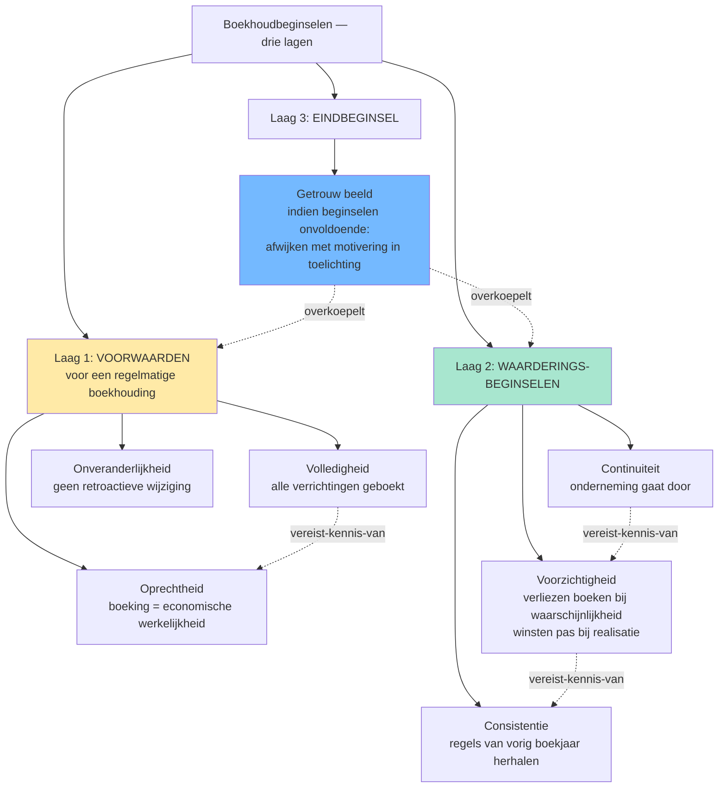
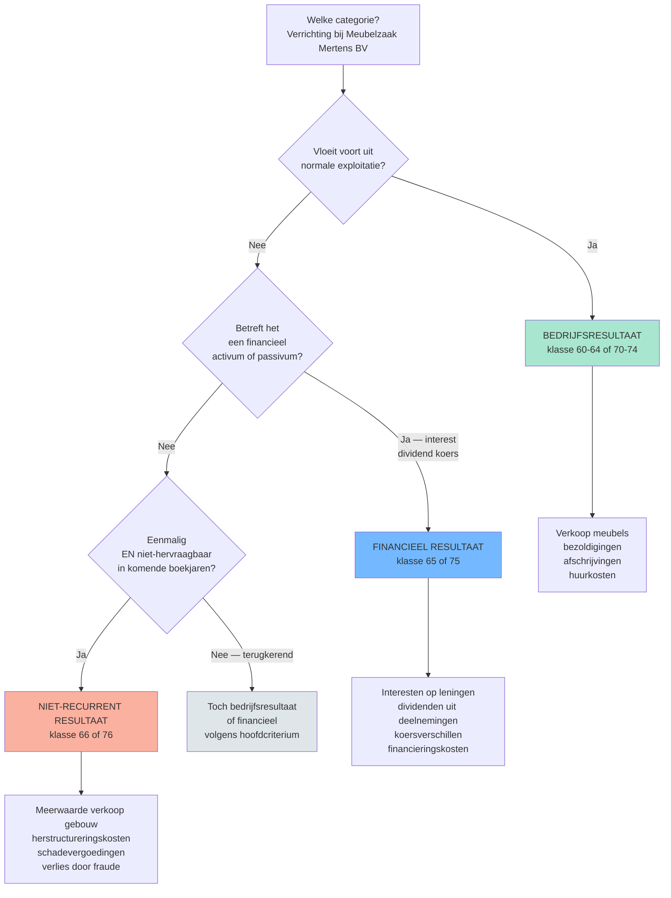
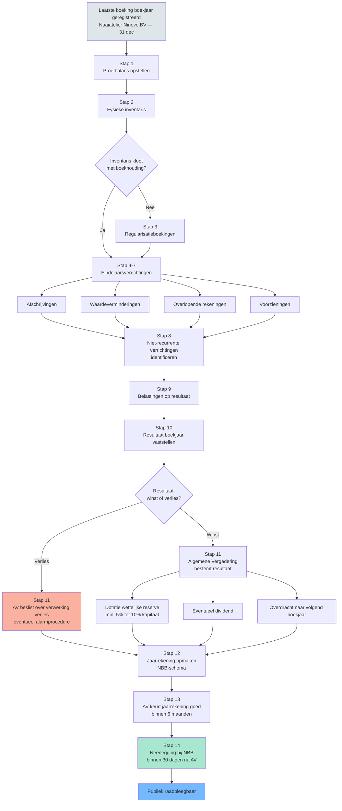

## Wat verwacht het examen van jou?

> [!abstract] Dit programmaonderdeel wordt getoetst op niveau *integratie*.
> Je moet meerdere concepten samen kunnen inzetten in complexe casussen — onderdelen herkennen, prioriteren, en tot een coherent oordeel komen.

**Taken** (uit het ITAA-examenprogramma):

> [!abstract]- **Taak 1** — De boekhouding voeren
>
> **Doelstellingen**:
> - Rekeningen openen
> - Opstellen van de journalen met inachtneming van de fiscale en analytische gevolgen
> - Centraliseren van de rekeningen
> - Opsporen en corrigeren van anomalieën
> - Verifiëren en corrigeren van de boekhouding en boekhoudkundige documenten
> - Het rekeningstelsel aanpassen aan de behoeften van de onderneming
> - Voorstellen van waarderingsregels
> - Optimaliseren van de boekhoudkundige organisatie van de onderneming
> - Opstellen van de boekhoudkundige bijlagen bij de jaarrekeningen
> - Afronden en afsluiten van de jaarrekeningen

## Leesgids

<!-- TODO: Opus-glue leesgids -->

## Waarom dit programmaonderdeel telt

<!-- TODO: Opus-glue waarom_po -->

## Wat doet een boekhouding? Van enkelvoudig naar dubbel, en waarom dat ertoe doet

<!-- TODO: Opus-glue oriëntatie -->

## De fundamentele beginselen: het redeneerkader achter elke boeking

> [!info] Hoort bij taak: De boekhouding voeren

<!-- TODO: Opus-glue thematisch-intro -->

- [[continuiteitsbeginsel|Boekhoudkundig continuïteitsbeginsel (going concern)]] · `regel`
- [[voorzichtigheidsbeginsel|Voorzichtigheidsbeginsel]] · `regel`
- [[getrouw-beeld|Getrouw beeld]] · `regel`
- [[onveranderlijkheid-boekingen|Onveranderlijkheid van de boekingen]] · `regel`

## Boekhoudbeginselen &mdash; overzicht

Synthese die de zeven boekhoudbeginselen in drie functionele lagen ordent: voorwaarden voor regelmatigheid (volledigheid, oprechtheid, onveranderlijkheid), waarderingssturing (continuïteit, voorzichtigheid, consistentie), en het eindbeginsel (getrouw beeld). Cruciaal voor stagiairs omdat losse memorisatie hier niet helpt — examenvragen toetsen welk beginsel doorslaggevend is bij conflicten (typisch: voorzichtigheid tegenover continuïteit).

<!-- TODO: Opus-glue synthese-intro -->

| Beginsel | Functie | Primaire bron | Vraag die het beantwoordt | Klassieke valkuil |
|---|---|---|---|---|
| [[getrouw-beeld]] | Eindbeginsel: de jaarrekening moet een getrouw beeld geven van vermogen, financiele positie en resultaat | WER art. III.89 · KB WVV art. 3:1 · Richtlijn 2013/34/EU art. 4 §3 | "Geeft mijn jaarrekening een getrouw beeld?" &mdash; eindtoets | Stagiair denkt: "als alle posten correct geboekt zijn klopt het beeld vanzelf". Fout: bij twijfel moet je afwijken van de regels mits motivering in de toelichting (KB WVV art. 3:1 derde lid). |
| [[volledigheidsbeginsel]] | Alle verrichtingen, bezittingen, rechten, schulden en verplichtingen zijn geboekt | WER art. III.83 · CBN 174/1 | "Heb ik alles opgenomen?" | Buiten-balans-rechten en -verplichtingen (klasse 0) worden vergeten &mdash; zie [[rechten-verplichtingen-buiten-balans]]. |
| [[oprechtheidsbeginsel]] | Boekingen reflecteren de werkelijke economische verrichting (niet de juridische schijn) | CBN 174/1 | "Komt mijn boeking overeen met de werkelijkheid?" | Substance over form: leasing waarbij [[Transport Tongeren BV]] het economisch eigendom heeft moet als financieringshuur geboekt worden, niet als operationele huur &mdash; ook al heet het contractueel zo. |
| [[onveranderlijkheid-boekingen]] | Eenmaal geboekt mag niet meer worden geschrapt of overschreven; correcties via tegenboeking | WER art. III.86 · CBN 174/1 | "Mag ik een vorige boeking nog wijzigen?" | Tipp-Ex of overschrijven in handgeschreven dagboek &rarr; boekhouding niet meer regelmatig. Correctie altijd via tegenboeking met datum en verwijzing. |
| [[continuiteitsbeginsel]] | Waardering veronderstelt dat de onderneming haar activiteiten voortzet | KB WVV art. 3:6 · CBN 2018/18 | "Mag ik blijven waarderen alsof we doorgaan?" | Bij twijfel over continuiteit moet bestuur uitdrukkelijk evalueren (toelichting jaarrekening); bij stopzetting overschakelen naar discontinuiteitswaarderingsregels. |
| [[voorzichtigheidsbeginsel]] | Verliezen en risico's boeken zodra waarschijnlijk; winsten pas bij realisatie | KB WVV art. 3:6 · Richtlijn 2013/34/EU art. 6 §1.c | "Mag ik deze opbrengst al boeken?" | Asymmetrie: voorzieningen aanleggen voor verwachte verliezen ja; herwaarderingsmeerwaarden boeken op niet-verkochte activa niet (behalve duurzame meerwaarde + KB-criteria). |
| [[consistentiebeginsel]] | Waarderingsregels van het ene boekjaar op het andere onveranderd toepassen | KB WVV art. 3:8 · CBN 174/1 | "Mag ik mijn afschrijvingsmethode veranderen?" | Methodewijziging mag, mits motivering in de toelichting + retroactieve aanpassing of prospectieve toepassing (afhankelijk van type wijziging). |

**Kerninzichten**:

- De zeven beginselen zijn niet allemaal gelijkwaardig: drie zijn voorwaarden om uberhaupt van een 'regelmatige' boekhouding te kunnen spreken (volledigheid, oprechtheid, onveranderlijkheid), drie sturen de waardering (continuiteit, voorzichtigheid, consistentie), en het getrouw-beeld-beginsel staat erboven als eindtoets. Stagiairs die ze op een rij zien staan zonder hierarchie missen die drie-lagen-structuur.
- Het getrouw-beeld-beginsel bevat een overrule-mechanisme: als toepassing van de andere beginselen onvoldoende is om een getrouw beeld te geven, moet je afwijken &mdash; met motivering in de toelichting (KB WVV art. 3:1 derde lid). Dit is geen vrijbrief: het bestuur moet uitdrukkelijk vaststellen dat de standaardregels onvoldoende zijn.
- Voorzichtigheid en getrouw-beeld kunnen op gespannen voet staan: pure voorzichtigheid leidt tot stille reserves (winsten onderschat, verliezen overschat), wat het getrouwe beeld verstoort. De moderne lezing (Richtlijn 2013/34/EU art. 6 §1.c): voorzichtigheid betekent geen overdreven onderwaardering, alleen waarschijnlijke verliezen + risico's opnemen.
- De onveranderlijkheid van boekingen is een formele eis (geen Tipp-Ex, geen overschrijven) maar geen verbod op correcties. Een verkeerde boeking corrigeer je via een tegenboeking met datum en verwijzing &mdash; de oorspronkelijke fout blijft zichtbaar in de audit-trail.
- Volledigheid omvat ook de rechten en verplichtingen buiten de balans (klasse 0): garanties verleend door [[Meubelzaak Mertens BV]], leaseverplichtingen, borgstellingen, pensioenverplichtingen. Wie deze vergeet schendt het volledigheidsbeginsel zonder dat de balans uit evenwicht raakt &mdash; daarom is het een silent error die makkelijk gemist wordt op examens.

_Bouwt op_: [[continuiteitsbeginsel]] · [[voorzichtigheidsbeginsel]] · [[getrouw-beeld]] · [[onveranderlijkheid-boekingen]] · [[consistentiebeginsel]] · [[oprechtheidsbeginsel]] · [[volledigheidsbeginsel]] · [[aanvullende-boekhoudbeginselen]]
## De infrastructuur van de boekhouding: stukken, dagboek, inventaris

> [!info] Hoort bij taak: De boekhouding voeren

<!-- TODO: Opus-glue thematisch-intro -->

- [[verantwoordingsstuk|Verantwoordingsstuk]] · `begrip`
- [[dagboek|Dagboek]] · `begrip`
- [[inventaris|Inventaris]] · `cluster`
- [[bewaring-boekhoudstukken|Bewaring van boekhoudkundige stukken]] · `regel`

## Voeren van een regelmatige dubbele boekhouding voor een onderneming

> [!info] Hoort bij taak: De boekhouding voeren

<!-- TODO: Opus-glue competentie-intro -->

[[competenties/voeren-regelmatige-dubbele-boekhouding|→ Volledige procedure]]

## Toepassen van de fundamentele boekhoudbeginselen op een concrete verrichting

> [!info] Hoort bij taak: De boekhouding voeren

<!-- TODO: Opus-glue competentie-intro -->

[[competenties/toepassen-fundamentele-boekhoudbeginselen|→ Volledige procedure]]

## Wie? De kleine vennootschap en het toepassingsgebied

> [!info] Hoort bij taak: De boekhouding voeren

<!-- TODO: Opus-glue thematisch-intro -->

- [[kleine-vennootschap|Kleine vennootschap (WVV art. 1:24)]] · `begrip`

## De twee synthesedocumenten: balans en resultatenrekening

> [!info] Hoort bij taak: De boekhouding voeren

<!-- TODO: Opus-glue thematisch-intro -->

- [[balans|Balans (jaarrekening-component)]] · `cluster`
- [[resultatenrekening|Resultatenrekening]] · `cluster`
- [[jaarrekening|Jaarrekening (synthesedocumenten)]] · `cluster`

## De gewone bedrijfsuitoefening: aankopen, verkopen, btw en vorderingen

> [!info] Hoort bij taak: De boekhouding voeren

<!-- TODO: Opus-glue thematisch-intro -->

- [[bedrijfsvorderingen|Bedrijfsvorderingen]] · `begrip`
- [[schulden|Schulden (LT en KT)]] · `cluster`
- [[bedrijfsresultaat|Bedrijfsresultaat (bedrijfskosten en bedrijfsopbrengsten)]] · `cluster`
- [[opbrengsten-be-gaap|Opbrengsten onder BE GAAP (realisatiebeginsel)]] · `cluster`

## Boeken van een aankoop en verkoop met btw en betaling

> [!info] Hoort bij taak: De boekhouding voeren

<!-- TODO: Opus-glue competentie-intro -->

[[competenties/boeken-aankoop-verkoop-met-btw|→ Volledige procedure]]

## Vaste activa: oprichtingskosten, materiële, immateriële en financiële

> [!info] Hoort bij taak: De boekhouding voeren

<!-- TODO: Opus-glue thematisch-intro -->

- [[oprichtingskosten|Oprichtingskosten]] · `cluster`
- [[aanschaffingswaarde|Aanschaffingswaarde]] · `begrip`
- [[materiele-vaste-activa|Materiële vaste activa]] · `begrip`
- [[immateriele-vaste-activa|Immateriële vaste activa]] · `begrip`
- [[financiele-vaste-activa|Financiële vaste activa]] · `begrip`
- [[herwaarderingsmeerwaarden|Herwaarderingsmeerwaarden]] · `cluster`
- [[afschrijvingen|Afschrijvingen]] · `cluster`
- [[waardeverminderingen|Waardeverminderingen]] · `cluster`

## Boeken van oprichtings- en kapitaalverhogingskosten en hun afschrijving

> [!info] Hoort bij taak: De boekhouding voeren

<!-- TODO: Opus-glue competentie-intro -->

[[competenties/boeken-oprichtings-en-kapitaalverhogingskosten|→ Volledige procedure]]

## Opstellen van het afschrijvingsplan voor materiële vaste activa

> [!info] Hoort bij taak: De boekhouding voeren

<!-- TODO: Opus-glue competentie-intro -->

[[competenties/opstellen-afschrijvingsplan-vaste-activa|→ Volledige procedure]]

## Vlottende activa: voorraden, geldbeleggingen en bijzondere waardevermindering

> [!info] Hoort bij taak: De boekhouding voeren

<!-- TODO: Opus-glue thematisch-intro -->

- [[voorraden|Voorraden]] · `cluster`
- [[geldbeleggingen|Geldbeleggingen en liquide middelen]] · `begrip`
- [[bijzondere-waardevermindering|Bijzondere waardevermindering (regime-overstijgend)]] · `cluster`

## Waarderen en boeken van voorraden volgens FIFO of gewogen gemiddelde

> [!info] Hoort bij taak: De boekhouding voeren

<!-- TODO: Opus-glue competentie-intro -->

[[competenties/waarderen-en-boeken-voorraden-fifo-ggp|→ Volledige procedure]]

## Boeken van waardeverminderingen op vorderingen en voorraden

> [!info] Hoort bij taak: De boekhouding voeren

<!-- TODO: Opus-glue competentie-intro -->

[[competenties/boeken-waardeverminderingen-op-vorderingen-en-voorraden|→ Volledige procedure]]

## Eigen vermogen, voorzieningen en kapitaalwijzigingen

> [!info] Hoort bij taak: De boekhouding voeren

<!-- TODO: Opus-glue thematisch-intro -->

- [[eigen-middelen|Eigen middelen (eigen vermogen)]] · `cluster`
- [[uitgiftepremie|Uitgiftepremie]] · `begrip`
- [[wettelijke-reserve|Wettelijke reserve]] · `regel`
- [[voorzieningen|Voorzieningen voor risico's en kosten]] · `cluster`
- [[kapitaalwijziging|Kapitaalwijziging (verhoging en vermindering)]] · `cluster`

## Boeken van een voorziening voor risico's en kosten

> [!info] Hoort bij taak: De boekhouding voeren

<!-- TODO: Opus-glue competentie-intro -->

[[competenties/boeken-voorzieningen-voor-risicos-en-kosten|→ Volledige procedure]]

## Overlopende rekeningen en het matching-principe

> [!info] Hoort bij taak: De boekhouding voeren

<!-- TODO: Opus-glue thematisch-intro -->

- [[overlopende-rekeningen|Overlopende rekeningen]] · `cluster`

## Verwerken van overlopende rekeningen volgens het matching-principe

> [!info] Hoort bij taak: De boekhouding voeren

<!-- TODO: Opus-glue competentie-intro -->

[[competenties/verwerken-overlopende-rekeningen-matching|→ Volledige procedure]]

## Drie resultaatcategorieën: bedrijfs-, financieel en niet-recurrent

> [!info] Hoort bij taak: De boekhouding voeren

<!-- TODO: Opus-glue thematisch-intro -->

- [[financiele-verrichtingen|Financiële verrichtingen (kosten + opbrengsten)]] · `cluster`
- [[niet-recurrente-verrichtingen|Niet-recurrente verrichtingen]] · `cluster`

## Bedrijfs- · financieel · niet-recurrent &mdash; in welke categorie hoort deze verrichting?

Een visualisatie van de drie resultaten-categorieën (bedrijfs / financieel / niet-recurrent) die direct het camouflage-mechanisme in examenvragen aanpakt: voor elke verrichting moet eerst de aard worden bepaald, pas dan de klasse. Voor een stagiair-GA: studiehulp om de meest gemaakte categorisatie-fouten (rente op 61, meerwaarde op 75, wisselresultaat verkeerd) gestructureerd te vermijden.

<!-- TODO: Opus-glue synthese-intro -->

| Categorie | MAR-klassen | Wat hoort hier | Voorbeeld | Typische valkuil |
|---|---|---|---|---|
| [[bedrijfsresultaat\|Bedrijfsresultaat]] | 60-64 (kosten) + 70-74 (opbrengsten) | Alles wat voortvloeit uit de normale exploitatie | [[Meubelzaak Mertens BV]]: verkoop meubels &euro; 850.000 (klasse 70); bezoldigingen &euro; 380.000 (klasse 62); afschrijvingen &euro; 45.000 (klasse 6302) | Afschrijvingen horen bij bedrijfsresultaat &mdash; ook al voelen ze niet 'operationeel' aan, ze ondersteunen de normale exploitatie van de vaste activa. |
| [[financiele-verrichtingen\|Financieel resultaat]] | 65 (kosten) + 75 (opbrengsten) | Verrichtingen op financiele activa/passiva: interesten, dividenden, koersverschillen, financieringskosten | [[Solaris Sint-Truiden BV]]: dividend ontvangen op aandelen &euro; 12.000 (klasse 75); interestlasten op obligatielening &euro; 50.000 (klasse 65) | Meerwaarde bij verkoop van een financieel vast activum: NIET hier &mdash; dat is niet-recurrent als de verkoop niet tot de normale activiteit hoort, of bedrijfsresultaat als de onderneming een trader is. |
| [[niet-recurrente-verrichtingen\|Niet-recurrent resultaat]] | 66 (kosten) + 76 (opbrengsten) | Eenmalige, niet aan normale exploitatie gerelateerde verrichtingen, die niet hervraagbaar zijn in de komende boekjaren | [[Verffabriek Veurne BV]]: meerwaarde bij verkoop bedrijfsgebouw &euro; 320.000 (klasse 76); herstructureringskosten reorganisatie &euro; 180.000 (klasse 66) | Klassieke verwarring met het oude 'uitzonderlijk': sinds KB 21/10/2018 is niet-recurrent een **feitelijke** kwalificatie (eenmalig + niet-exploitatiegebonden), niet een formele rubriek. Een terugkerende meerwaarde (jaarlijkse verkoop investeringen) hoort dus NIET in 66/76. |

**Kerninzichten**:

- Het criterium 'normale exploitatie' is sectorafhankelijk. Voor [[Solaris Sint-Truiden BV]] (effectenportefeuille als kernactiviteit) horen koerswinsten bij het bedrijfsresultaat &mdash; voor [[Meubelzaak Mertens BV]] horen dezelfde koerswinsten bij het financieel resultaat. De rubriek-keuze is dus geen mechanische lookup, maar een redenering over wat 'normaal' is voor deze onderneming.
- 'Niet-recurrent' is sinds KB 21/10/2018 niet meer hetzelfde als 'uitzonderlijk'. Het oude regime kende een formele rubriek 'uitzonderlijke kosten/opbrengsten' &mdash; daar zat veel in dat eigenlijk wel terugkwam (bv. jaarlijkse meerwaarden bij verkoop van afgeschreven vaste activa). Het nieuwe regime hanteert twee feitelijke criteria: eenmalig + niet-hervraagbaar. Een vraag op het examen die nog de term 'uitzonderlijk' gebruikt is typisch een test op kennis van de regime-wijziging.
- De drie categorieen leiden tot drie subtotalen in de resultatenrekening, die elk apart fiscaal relevant zijn. Bij de aangifte vennootschapsbelasting (zie [[bedrijfsresultaat]] + WIB) bepaalt de categorisatie of een meerwaarde onder de gespreide taxatie kan vallen (typisch alleen voor materiele vaste activa onder bedrijfsresultaat) of niet. Verkeerde categorisatie heeft dus directe fiscale impact &mdash; geen louter cosmetische keuze.

_Bouwt op_: [[bedrijfsresultaat]] · [[financiele-verrichtingen]] · [[niet-recurrente-verrichtingen]] · [[resultaatverwerking]]
## Bijzondere transacties: leasing, obligaties, eigen aandelen en eigendom

> [!info] Hoort bij taak: De boekhouding voeren

<!-- TODO: Opus-glue thematisch-intro -->

- [[leasing|Leasing (financieel en operationeel)]] · `cluster`
- [[obligatielening|Obligatielening]] · `cluster`
- [[eigen-aandelen|Beheer van eigen aandelen]] · `cluster`
- [[opsplitsing-eigendom|Opsplitsing eigendom (vruchtgebruik, opstal, erfpacht)]] · `cluster`
- [[rechten-verplichtingen-buiten-balans|Rechten en verplichtingen buiten balans]] · `cluster`

## Kwalificeren en boeken van leasing (operationeel vs financieel)

> [!info] Hoort bij taak: De boekhouding voeren

<!-- TODO: Opus-glue competentie-intro -->

[[competenties/kwalificeren-en-boeken-leasing|→ Volledige procedure]]

## Boeken van uitgifte en aflossing van een obligatielening

> [!info] Hoort bij taak: De boekhouding voeren

<!-- TODO: Opus-glue competentie-intro -->

[[competenties/boeken-uitgifte-en-aflossing-obligatielening|→ Volledige procedure]]

## Voeren van de boekhouding van een VZW met economische activiteit

> [!info] Hoort bij taak: De boekhouding voeren

<!-- TODO: Opus-glue competentie-intro -->

[[competenties/voeren-boekhouding-vzw-met-economische-activiteit|→ Volledige procedure]]

## Boekjaar afsluiten &mdash; van proefbalans tot neerlegging

Synthese die per stap toont wat een vennootschap aan het einde van haar boekjaar moet doen: inventaris opmaken, eindejaarsverrichtingen boeken, proef- en saldibalans opstellen, jaarrekening voorbereiden, goedkeuren en openbaarmaken. Voor de stagiair-GA is dit de praktische ruggengraat van zijn eerste boekjaar-afsluitingen.

<!-- TODO: Opus-glue synthese-intro -->

| Stap | Wat | Wanneer | Concept-record | Output |
|---|---|---|---|---|
| 1 | Proefbalans opstellen | Direct na laatste boeking boekjaar | [[regelmatige-boekhouding]] · [[dubbel-boekhouden]] | Lijst met saldi per grootboekrekening; debet = credit |
| 2 | Fysieke inventarisopname | Op de afsluitingsdatum (in regel laatste dag boekjaar) | [[inventaris]] | Werkblad met fysieke tellingen voorraad, kas, vaste activa |
| 3 | Verschillen inventaris &harr; boekhouding regulariseren | Tussen inventaris-datum en jaarrekening-opmaak | [[inventaris]] · [[voorraden]] | Correctieboekingen (manco's, breukverliezen, inventarisverschillen) |
| 4 | Afschrijvingen boeken | Eindejaarsverrichting | [[afschrijvingen]] | Boeking 6302 / 22-28 voor materiele en immateriele vaste activa |
| 5 | Waardeverminderingen toetsen + boeken | Eindejaarsverrichting | [[waardeverminderingen]] | Boeking 631-634 voor duurzame waardeverminderingen op activa |
| 6 | Overlopende rekeningen boeken | Eindejaarsverrichting | [[overlopende-rekeningen]] | Boeking 490/491/492/493 voor toerekening kosten/opbrengsten aan juiste boekjaar |
| 7 | Voorzieningen aanleggen of terugnemen | Eindejaarsverrichting | [[voorzieningen]] · [[voorzichtigheidsbeginsel]] | Boeking 6360 / 160-163 voor risico's en kosten |
| 8 | Niet-recurrente verrichtingen identificeren | Bij opmaak resultatenrekening | [[niet-recurrente-verrichtingen]] | Boeking 66/76 (vroegere 'uitzonderlijke' rubrieken) |
| 9 | Belastingen op het resultaat berekenen + boeken | Na vaststelling resultaat voor belasting | [[bedrijfsresultaat]] | Boeking 670-679 |
| 10 | Resultaat van het boekjaar afsluiten | Sluiten rekeningen klasse 6 en 7 | [[bedrijfsresultaat]] · [[resultaatverwerking]] | Saldo op rekening 690/790 |
| 11 | Algemene vergadering: resultaat bestemmen | Binnen 6 maanden na boekjaareinde | [[resultaatverwerking]] · [[wettelijke-reserve]] | Beslissing AV: dotatie wettelijke reserve, eventueel andere reserves, dividend, overdracht naar volgend boekjaar |
| 12 | Jaarrekening opmaken in NBB-schema | Na resultaatverwerking | [[jaarrekening]] | Volledige of verkorte jaarrekening + toelichting + sociale balans |
| 13 | Goedkeuring algemene vergadering | Binnen 6 maanden na boekjaareinde | [[jaarrekening]] | AV-notulen + ondertekende jaarrekening |
| 14 | Neerlegging bij NBB | Binnen 30 dagen na goedkeuring AV (en uiterlijk 7 maanden na boekjaareinde) | [[jaarrekening]] | Neergelegde jaarrekening &mdash; publiek raadpleegbaar |

**Kerninzichten**:

- De volgorde is bindend: pas na de eindejaarsverrichtingen (stap 4-9) kan je het resultaat van het boekjaar vaststellen (stap 10). Pas na de algemene vergadering die het resultaat bestemt (stap 11) ken je het 'overgedragen resultaat' &mdash; pas dan is de jaarrekening volledig opmaakbaar (stap 12). Een examenvraag die zegt 'jaarrekening klaar, AV moet nog komen' bevat dus een logische fout: de jaarrekening kan niet 'klaar' zijn zonder AV-beslissing.
- De timing is wettelijk geketend: AV binnen 6 maanden na boekjaareinde (WVV art. 3:1 §1), neerlegging binnen 30 dagen na AV (WVV art. 3:10) en uiterlijk 7 maanden na boekjaareinde. Voor [[Naaiatelier Ninove BV]] met boekjaar dat eindigt op 31 december betekent dit: AV ten laatste 30 juni, neerlegging ten laatste 31 juli. Boete-risico: laattijdige neerlegging is een veelvoorkomende cliënt-vraag.
- Drie van de tien verplichte boekingen volgen direct uit de waarderingsbeginselen: afschrijvingen (consistentie), waardeverminderingen (voorzichtigheid), voorzieningen (voorzichtigheid). Wie de beginselen kent, kan deze stappen niet vergeten. Wie ze opvat als 'extra werk', vergeet er typisch een &mdash; bijvoorbeeld de waardeverminderingen op vorderingen.
- De wettelijke reserve (stap 11) ontstaat bij de resultaatverwerking, niet bij de jaarrekening-opmaak. Sequentieel: AV beslist welk percentage naar wettelijke reserve gaat (min. 5% van de winst, tot de wettelijke reserve 10% van het kapitaal bereikt). Pas dan staat het bedrag op rekening 130; pas dan past het in de jaarrekening die de AV daarna goedkeurt.

_Bouwt op_: [[regelmatige-boekhouding]] · [[inventaris]] · [[overlopende-rekeningen]] · [[afschrijvingen]] · [[waardeverminderingen]] · [[voorzieningen]] · [[jaarrekening]] · [[resultaatverwerking]] · [[wettelijke-reserve]]
## Resultaatverwerking en winstbestemming

> [!info] Hoort bij taak: De boekhouding voeren

<!-- TODO: Opus-glue thematisch-intro -->

- [[resultaatverwerking|Resultaatverwerking (winst- of verliesbestemming)]] · `cluster`

## Uitvoeren van eindejaarsverrichtingen en opmaken van proefbalans

> [!info] Hoort bij taak: De boekhouding voeren

<!-- TODO: Opus-glue competentie-intro -->

[[competenties/uitvoeren-eindejaarsverrichtingen-en-proefbalans|→ Volledige procedure]]

## Boeken van resultaatverwerking en bestemming (reserves, dividenden, belasting)

> [!info] Hoort bij taak: De boekhouding voeren

<!-- TODO: Opus-glue competentie-intro -->

[[competenties/boeken-resultaatverwerking-en-bestemming|→ Volledige procedure]]

## Vereffening en de levenscyclus voorbij continuïteit

> [!info] Hoort bij taak: De boekhouding voeren

<!-- TODO: Opus-glue thematisch-intro -->

- [[vereffening|Vereffening van een vennootschap]] · `cluster`

## Jaarrekeningpresentatie: van BE GAAP naar IFRS-context

> [!info] Hoort bij taak: De boekhouding voeren

<!-- TODO: Opus-glue thematisch-intro -->

- [[jaarrekening-presentatie|Jaarrekeningpresentatie (regime-overstijgend)]] · `cluster`

## Reflectie: digitalisering, e-invoicing en de boekhouding van morgen

<!-- TODO: Opus-glue oriëntatie -->

## Synthese-stappenplan

<!-- TODO: Opus-glue synthese -->

## Cheatsheet

### Kritische drempelwaarden

| Concept | Naam | Waarde | Eenheid | Gevolg |
|---|---|---|---|---|
| [[jaarrekening]] | Kleine vennootschap (verkort schema toegelaten) | Maximaal 1 criterium overschreden: balanstotaal € 6.000.000, omzet € 11.250.000, gemiddeld personeel 50 VTE | WVV art. 1:24 — 1:25 | Mag jaarrekening in **verkort schema** opstellen; vrijgesteld van jaarverslag (tenzij beursgenoteerd), commissaris-vrijs… |
| [[jaarrekening]] | Micro-vennootschap (microschema toegelaten) | Maximaal 1 criterium overschreden: balanstotaal € 350.000, omzet € 700.000, gemiddeld personeel 10 VTE | WVV art. 1:25 | Mag jaarrekening in **microschema** opstellen — kortere balans, minder verplichte vermeldingen in toelichting |
| [[vereenvoudigde-boekhouding]] | Omzetdrempel voor vereenvoudigde boekhouding | € 500.000 | jaaromzet excl. BTW | Natuurlijke personen, vennootschappen onder firma (VOF) en gewone commanditaire vennootschappen (GCV) met een omzet onde… |
| [[wettelijke-reserve]] | Verplichte afhouding van de nettowinst | 5 % | van de nettowinst van het boekjaar | Verplichte toevoeging aan wettelijke reserve uit winstbestemming |
| [[wettelijke-reserve]] | Plafond wettelijke reserve | 10 % | van het maatschappelijk kapitaal (NV) of van de eigen vermogensinbreng (BV) | Wanneer de wettelijke reserve dit plafond bereikt, vervalt de verplichte jaarlijkse afhouding |

### Vergelijkingsparen-matrix

| Concept | Verwarrend met | Trigger |
|---|---|---|
| [[afschrijvingen]] | [[waardeverminderingen]] | Examen: 'gebouw' (gebruiksduur beperkt) → afschrijving. 'Terrein' (onbeperkt) → waardevermindering. 'Voorraad' (vlottend actief) → waardevermindering. |
| [[balans]] | [[resultatenrekening]] | Examen: 'op welke staat staat post X?' Toestand (saldo) → balans. Beweging (gedurende periode) → RR. |
| [[balans]] | [[analytische-balans]] | Examen: 'bereken behoefte aan bedrijfskapitaal' — eerst statutaire balans naar analytische balans omzetten. |
| [[bedrijfsresultaat]] | [[financiele-verrichtingen]] | Examen: 'intrest op leveranciersschuld te laat betaald' — financiële kost (klasse 65), NIET bedrijfskost. 'huurkost van magazijn' — bedrijfskost (klasse 61). |
| [[bedrijfsvorderingen]] | [[vorderingen-meer-dan-1-jaar-aspect]] | Examen: 'lening 3 jaar verleend in jaar 1, op 31/12/20X2 nog 18 maanden te lopen' → splitsen: 12 maanden op rubriek VII, 6 maanden op rubriek V. |
| [[bewaring-boekhoudstukken]] | [[bewaartermijn-boekhouding]] | Examen: 'hoelang bewaren?' → check of de vraag boekhoudkundig is (7j) of fiscaal/btw (10j). In twijfel: 10 jaar. |
| [[bijzondere-waardevermindering]] | [[bijzondere-waardevermindering-ifrs]] | Algemeen → 'wat is het mechanisme van bijzondere waardevermindering?'; IFRS → 'hoe bereken ik VIU?' / 'wat is CGU-allocatie?' |
| [[bijzondere-waardevermindering]] | [[bijzondere-waardevermindering-be-gaap]] | Algemeen → 'wat is het mechanisme?'; BE GAAP → 'aanvullende afschrijving of waardevermindering — welk artikel?' |
| [[dubbel-boekhouden]] | [[vereenvoudigde-boekhouding]] | Examenvraag: kleine eenmanszaak met omzet onder € 500.000 (WER drempel) — mag vereenvoudigd, hoeft geen dubbel boekhouden. |
| [[eigen-aandelen]] | [[financiele-vaste-activa]] | Examen: 'NV koopt 5% van haar eigen aandelen in voor € 80.000' → boeking als aftrek van EV, NIET als FVA. 'NV koopt 25% van een andere NV' → FVA (deelneming) op actiefzijde. |
| [[financiele-vaste-activa]] | [[geldbeleggingen]] | Examen: 'verworven met de bedoeling de groep duurzaam te ondersteunen' → FVA. 'tijdelijke parking van overtollige liquiditeiten' → geldbelegging. |
| [[geldbeleggingen]] | [[financiele-vaste-activa]] | Examen: 'wij houden 10 % aandelen in een leverancier om de bevoorrading te beveiligen' → FVA (duurzame strategische relatie). 'wij houden 1 % aandelen in een beursgenoteerde bank voor rendement' → geldbelegging. |
| [[getrouw-beeld]] | [[getrouw-beeld-jaarrekening]] | Vraag over algemeen beginsel → getrouw-beeld. Vraag over de jaarrekening-toets (vermogen/positie/resultaat) → getrouw-beeld-jaarrekening. |
| [[herwaarderingsmeerwaarden]] | [[aanschaffingswaarde]] | Examen: 'aanpassen waarde van een terrein boven aankoopprijs' → herwaardering (mits voorwaarden), niet aanschaffingswaarde wijzigen. |
| [[immateriele-vaste-activa]] | [[oprichtingskosten]] | Examen: 'notariskosten kapitaalverhoging' → 200. 'aankoop patent' → 211. |
| [[immateriele-vaste-activa]] | [[materiele-vaste-activa]] | Examen: 'aankoop industriële mengmachine € 45.000' → materieel (rubriek 23). 'aankoop licentie op patroontekening' → immaterieel (rubriek 211). |
| [[jaarrekening-presentatie]] | [[balans-presentatie-ifrs]] | Algemeen → 'welke componenten zijn verplicht?'; IFRS-specialisatie → 'welke posten op de balans onder IAS 1?' |
| [[jaarrekening]] | [[geconsolideerde-jaarrekening]] | Examen: 'jaarrekening Aurelia Holding NV' alleen = statutair. 'jaarrekening Aurelia Holding NV + dochters' = geconsolideerd. |
| [[kleine-vennootschap]] | [[microvennootschap]] | Examen: omzet € 500K → check micro-drempels eerst; als ook personeel ≤ 10 én balans ≤ € 450K én niet moeder/dochter → micro. Zo niet → klein. |
| [[kleine-vennootschap]] | [[grote-vennootschap-wvv]] | Examen: omzet € 15M, personeel 80, balans € 8M → overschrijdt 3 drempels → groot. Verkort niet meer toegestaan, commissaris verplicht. |
| [[leasing]] | [[huur-versus-leasing-aspect]] | Examen: 'gewone huur kantoor € 1.500/maand' = kostenrekening 61. 'leasing met optie tot aankoop' = onderzoek of optie ≤ 15 % → financieel of operationeel. |
| [[materiele-vaste-activa]] | [[immateriele-vaste-activa]] | Examen: 'gekocht productiehal € 480.000' → MVA (221). 'gekocht patent € 35.000' → IVA (211). |
| [[niet-recurrente-verrichtingen]] | [[bedrijfsresultaat]] | Examen: 'meerwaarde verkoop oud kantoorpand' → niet-recurrent bedrijfsmatig (76A). 'omzet uit hoofdactiviteit' → recurrent bedrijfsresultaat (70). De oude term 'uitzonderlijk resultaat' (vóór KB 2018) is afgeschaft. |
| [[opbrengsten-be-gaap]] | [[opbrengsten-ifrs]] | Examen: 'is opbrengst gerealiseerd onder BE GAAP?' → check levering + inbaarheid; 'wanneer onder IFRS 15?' → check stap 5 (voldoening van prestatieverplichting). |
| [[oprichtingskosten]] | [[immateriele-vaste-activa]] | Examen: 'patentaankoop voor € 80.000' → immaterieel vast actief (rubr. 21), NIET oprichtingskosten. |
| [[rechten-verplichtingen-buiten-balans]] | [[voorzieningen]] | Examen: 'lopende rechtsgeding met 30 % verlieskans, schadebedrag onbekend' → klasse 0 (te onzeker voor voorziening). 'lopende rechtsgeding met 70 % verlieskans, schadebedrag € 75.000' → voorziening 16. |
| [[resultatenrekening]] | [[balans]] | Examen: 'op welke staat staat post X?' — vraag jezelf: is dit een **toestand** (saldo: voorraad, schuld, kapitaal) of een **beweging** (gedurende boekjaar: omzet, kostprijs)? |
| [[uitgiftepremie]] | [[wettelijke-reserve]] | Examen: 'kunnen uitgiftepremies als dividend worden uitgekeerd?' — Niet als gewoon dividend, wel via kapitaalverminderingsprocedure. |
| [[vereenvoudigde-boekhouding]] | [[dubbel-boekhouden]] | Examen: 'eenmanszaak met omzet € 320.000' → vereenvoudigd toegelaten. 'BV met omzet € 200.000' → dubbel verplicht. |
| [[voorzieningen]] | [[waardeverminderingen]] | Examen: 'wij verwachten een verlies op een rechtsgeding' → voorziening. 'klant zal vermoedelijk niet betalen' → waardevermindering. |
| [[voorzieningen]] | [[schulden]] | Examen: 'betwiste belasting € 18.000' → voorziening 161. 'aanvaarde belasting € 18.000' → schuld 45. |
| [[waardeverminderingen]] | [[afschrijvingen]] | Examen: 'voorraad goederen waarvan marktprijs daalt' → waardevermindering (vlottend actief). 'machine waarvan technische ontwaarding sneller dan voorzien' → niet-recurrente afschrijving (beperkte gebruiksduur). |
| [[waardeverminderingen]] | [[voorzieningen]] | Examen: 'wij verwachten een vonnis tegen ons van € 80.000' → voorziening. 'klant zal vermoedelijk niet betalen' → waardevermindering. |
| [[wettelijke-reserve]] | [[beschikbare-reserves-aspect]] | Examen: 'kunnen we deze reserves uitkeren?' — Wettelijke: nee onder minimum. Beschikbare: ja na uitkeringstest. |

## Heb je deze taken in de vingers?

Loop deze taken na vóór je verder gaat met examenfocus. Twijfel je bij een taak? Lees de aangegeven secties nog eens.

- ✓ **1.1.taak.1** — De boekhouding voeren _Behandeld in §5, §6, §7, §8, §9, §10, §11, §12, §13, §14, §15, §16, §17, §18, §19, §20, §21, §22, §23, §24, §25, §26, §27, §28, §29, §30, §31, §32, §33, §34, §35._

## Examenfocus

<!-- TODO: Opus-glue examenfocus -->

> [!question]- Afsluitingsboekingen bij kapitaalsubsidie op een afschrijfbaar actief
> *Examen 2003-bibf · PO 1.1*
>
> > Gedurende het boekjaar 2002 werd een machine aangekocht voor 100.000,00 euro. De overheid heeft in dat jaar een kapitaalsubsidie definitief toegezegd van 10.000 euro. Deze subsidies zullen in twee schijven van 5.000,00 euro worden betaald in het jaar 2003 en 2004. De machine wordt tegen 10 % afgeschreven. We gaan uit van een eenvormig belastingstarief van 40 %.
>
> Geef de afsluitingsboekingen voor de boekjaren 2002 en 2003.
>
> > [!success]- Antwoord (klik om te openen)
> > Casus-parameters: machine aangekocht in 2002 voor 100.000,00 EUR; kapitaalsubsidie 10.000,00 EUR definitief toegezegd in 2002 (twee schijven van 5.000,00 EUR in 2003 en 2004); afschrijving 10% lineair; belastingstarief 40%. Bij toezegging wordt de kapitaalsubsidie netto na uitgestelde belasting geboekt: 60% op rekening 15 (netto kapitaalsubsidie) en 40% op rekening 168 (uitgestelde belastingen). Jaarlijkse afschrijving machine: 10.000,00 EUR. Pro rata in resultaatname kapitaalsubsidie volgt het afschrijvingsritme: 10% per jaar van 10.000 = 1.000,00 EUR bruto, waarvan 600,00 EUR via 753 (in resultaat genomen kapitaalsubsidies) en 400,00 EUR via 780 (onttrekking aan uitgestelde belastingen). ⚠️ te verifiëren - rekeningnummers volgen het MAR; exacte codes te valideren. 🤖
> > 
> > | Zijde | Rekening | Naam | Bedrag |
> > | --- | --- | --- | --- |
> > | D | 416 | Diverse vorderingen - te ontvangen kapitaalsubsidie | 10.000 |
> > | C | 15 | Kapitaalsubsidies (netto) | 6.000 |
> > | C | 168 | Uitgestelde belastingen op kapitaalsubsidies | 4.000 | 🤖
> > 
> > 2002 (toezeggingsboeking, in de loop van het boekjaar): definitieve toezegging kapitaalsubsidie 10.000,00 EUR opgesplitst in netto-subsidie (60%) en uitgestelde belastingen (40%).
> > 
> > | Zijde | Rekening | Naam | Bedrag |
> > | --- | --- | --- | --- |
> > | D | 6302 | Afschrijvingen op materiele vaste activa | 10.000 |
> > | C | 2309 | Geboekte afschrijvingen op installaties, machines en uitrusting | 10.000 | 🤖
> > 
> > Afsluitingsboeking 31/12/2002 - jaarlijkse afschrijving machine 10% x 100.000,00.
> > 
> > | Zijde | Rekening | Naam | Bedrag |
> > | --- | --- | --- | --- |
> > | D | 15 | Kapitaalsubsidies (netto) | 600 |
> > | C | 753 | In resultaat genomen kapitaalsubsidies | 600 | 🤖
> > 
> > Afsluitingsboeking 31/12/2002 - pro rata in resultaatname van de netto kapitaalsubsidie (10% van 6.000,00).
> > 
> > | Zijde | Rekening | Naam | Bedrag |
> > | --- | --- | --- | --- |
> > | D | 168 | Uitgestelde belastingen op kapitaalsubsidies | 400 |
> > | C | 780 | Onttrekking aan de uitgestelde belastingen | 400 | 🤖
> > 
> > Afsluitingsboeking 31/12/2002 - pro rata onttrekking aan uitgestelde belastingen (10% van 4.000,00).
> > 
> > | Zijde | Rekening | Naam | Bedrag |
> > | --- | --- | --- | --- |
> > | D | 6302 | Afschrijvingen op materiele vaste activa | 10.000 |
> > | C | 2309 | Geboekte afschrijvingen op installaties, machines en uitrusting | 10.000 | 🤖
> > 
> > Afsluitingsboeking 31/12/2003 - jaarlijkse afschrijving machine.
> > 
> > | Zijde | Rekening | Naam | Bedrag |
> > | --- | --- | --- | --- |
> > | D | 15 | Kapitaalsubsidies (netto) | 600 |
> > | C | 753 | In resultaat genomen kapitaalsubsidies | 600 | 🤖
> > 
> > Afsluitingsboeking 31/12/2003 - pro rata in resultaatname netto kapitaalsubsidie.
> > 
> > | Zijde | Rekening | Naam | Bedrag |
> > | --- | --- | --- | --- |
> > | D | 168 | Uitgestelde belastingen op kapitaalsubsidies | 400 |
> > | C | 780 | Onttrekking aan de uitgestelde belastingen | 400 | 🤖
> > 
> > Afsluitingsboeking 31/12/2003 - pro rata onttrekking aan uitgestelde belastingen.

> [!question]- Afsluitingsboekingen voor voorraden met waardeverminderingen
> *Examen 2003-bibf · PO 1.1*
>
> > Op de proef- en saldibalans staan volgende bedragen: rekening 32 Goederen in bewerking (D) 500,00 EUR en rekening 34 Handelsgoederen (D) 7.000,00 EUR. De inventaris per einde boekjaar geeft: goederen in bewerking 400,00 EUR en handelsgoederen 8.500,00 EUR. Marktwaarde handelsgoederen: 8.250,00 EUR. Er werd ook vastgesteld dat bepaalde goederen moeten worden afgeprijsd voor een totaal bedrag van 75,00 EUR.
>
> Geef de afsluitingsboekingen.
>
> > [!success]- Antwoord (klik om te openen)
> > _Antwoord wacht op concept-laag._

> [!question]- Boeking van inrichtingskosten in gehuurde gebouwen
> *Examen 2003-bibf · PO 1.1*
>
> > Een onderneming heeft kosten van inrichting gedaan in door haar gehuurde gebouwen.
>
> In welke post(en) worden deze kosten geboekt?
>
> > [!success]- Antwoord (klik om te openen)
> > _Antwoord wacht op concept-laag._

> [!question]- Boeking van het vakantiegeld voor bedienden
> *Examen 2008-bibf · PO 1.1*
>
> > In 2007 bedragen de bruto bezoldigingen betaald aan de bedienden 112.000,00 EUR waarvan 10.000,00 EUR voor de eindejaarspremies.
>
> Boek het vakantiegeld verschuldigd voor 2007.
>
> > [!success]- Antwoord (klik om te openen)
> > Berekening forfaitaire voorziening vakantiegeld bedienden boekjaar 2007 volgens CBN-advies 148/3 (later bevestigd via CBN-advies 2018/22): vertrekbasis = bruto bezoldigingen bedienden - eindejaarspremies = 112.000,00 - 10.000,00 = 102.000,00 EUR. Forfaitair percentage = 18,20% x 102.000,00 = 18.564,00 EUR. ⚠️ te verifiëren - exacte percentage CBN-advies 148/3 (klassiek 18,20%, maar later geactualiseerd) te valideren tegen brondocument; rekeningnummers (623 vs 6202/6203, 456 'Te betalen vakantiegeld') te valideren tegen MAR. 🤖
> > 
> > | Zijde | Rekening | Naam | Bedrag |
> > | --- | --- | --- | --- |
> > | D | 623 | Andere personeelskosten - voorziening vakantiegeld bedienden | 18.564 |
> > | C | 456 | Te betalen vakantiegeld | 18.564 | 🤖
> > 
> > Afsluitingsboeking 31/12/2007 - forfaitaire raming vakantiegeld bedienden: 18,20% x (112.000,00 - 10.000,00) = 18,20% x 102.000,00 = 18.564,00 EUR.
>
> Wanneer boekt u dit vakantiegeld?
>
> > [!success]- Antwoord (klik om te openen)
> > - De boeking wordt verricht als afsluitingsboeking op 31 december van het boekjaar waarin de bedienden de prestaties hebben verricht (in casu: 31/12/2007).
> > - Reden: het vakantiegeld is een kost die economisch toerekenbaar is aan het boekjaar waarin het is opgebouwd door de prestaties, ook al wordt het pas in het volgende vakantiejaar (2008) effectief uitbetaald. Toepassing van het matching-beginsel.
> > - Bij de effectieve uitbetaling in 2008 wordt de schuldrekening 456 'Te betalen vakantiegeld' tegengeboekt; afwijkingen tussen de forfaitaire raming 2007 en het werkelijk uitbetaalde bedrag in 2008 worden in 2008 via dezelfde personeelskostenrekening verwerkt (correctie van de raming). 🤖
> > 
> > Het voorzichtigheidsbeginsel en het matching-beginsel uit het Belgisch boekhoudrecht vereisen dat alle kosten die betrekking hebben op het boekjaar worden geboekt, ook als ze nog niet werden uitbetaald op afsluitdatum. Het vakantiegeld voor bedienden volgt economisch het jaar van de prestaties (2007), niet het jaar van de uitbetaling (2008). CBN-advies 148/3 (later bevestigd in CBN-advies 2018/22) geeft de forfaitaire ramingsmethode op afsluitdatum om dit consistent toe te passen. 🤖

> [!question]- Boekhouding van een laattijdige aankoopfactuur over twee boekjaren
> *Examen 2008-bibf · PO 1.1*
>
> > In januari 2008 ontvangt u een factuur voor 1.210,00 EUR BTW inbegrepen, met betrekking tot de levering in 2007 van publiciteitsartikelen.
>
> Wat boekt u in 2008 en, in voorkomend geval, in 2007?
>
> > [!success]- Antwoord (klik om te openen)
> > _Antwoord wacht op concept-laag._

> [!question]- Boeking van voorraadwijzigingen
> *Examen 2008-bibf · PO 1.1*
>
> **Voorraden per 1 januari N**
>
> | Label | Bedrag |
> | --- | --- |
> | Grondstoffen | 12.000 |
> | Goederen in bewerking | 30.000 |
> | Gereed product | 28.000 |
> | Handelsgoederen | 6.000 |
>
> **Voorraden per 31 december N**
>
> | Label | Bedrag |
> | --- | --- |
> | Grondstoffen | 17.000 |
> | Goederen in bewerking | 26.000 |
> | Gereed product | 31.000 |
> | Handelsgoederen | 4.000 |
>
> Boek de voorraadwijzigingen.
>
> > [!success]- Antwoord (klik om te openen)
> > _Antwoord wacht op concept-laag._

> [!question]- Boeking van oprichtingskosten en afschrijvingen bij een nieuwe vennootschap
> *Examen 2008-bibf · PO 1.1*
>
> > Een kleine vennootschap heeft de rechtspersoonlijkheid verkregen op 1 maart 2008 en sluit haar eerste boekjaar af op 31 december 2008. De oprichtingskosten bedragen 1.200 EUR; ze werden per bank betaald op 10 maart en op het actief geboekt. Een personenwagen van 20.000 EUR exclusief BTW werd op 31 maart 2008 gekocht met een economische levensduur van vijf jaar.
>
> Boek beide verrichtingen (oprichtingskosten en aankoop personenwagen).
>
> > [!success]- Antwoord (klik om te openen)
> > _Antwoord wacht op concept-laag._
>
> Boek de afschrijvingen.
>
> > [!success]- Antwoord (klik om te openen)
> > _Antwoord wacht op concept-laag._

> [!question]- Boeking van aandelenaankoop in een verbonden groepsstructuur
> *Examen 2008-bibf · PO 1.1*
>
> > In een groep controleert vennootschap A twee dochters B en C. Vennootschap B koopt voor 50.000,00 EUR aandelen aan die 12% vertegenwoordigen van het stemrecht in C.
>
> Boek deze aankoop in de onderneming B.
>
> > [!success]- Antwoord (klik om te openen)
> > _Antwoord wacht op concept-laag._

> [!question]- Boekingen bij kapitaaloperaties en buitenlandse vaste inrichting
> *Examen 2013-1 · PO 1.1*
>
> > Gelieve voor de onderstaande gevallen het juiste antwoord aan te kruisen.
>
> Onderneming A heeft een openstaande leveranciersschuld ten opzichte van onderneming X voor een bedrag van 100.000,00 euro. Er werd besloten om deze schuld in te brengen als kapitaal. Zij dient de volgende boeking(en) aan te brengen in haar boekhouding.
>
> - **a)** Zij boekt de leveranciersschuld ten opzichte van een resultatenrekening tegen. Vervolgens zal zij via de resultaatverwerking een overboeking maken naar de rubriek kapitaal.
> - **b)** Zij boekt de leveranciersschuld rechtstreeks over naar de rubriek kapitaal.
> - **c)** Zij boekt via resultaatverwerking het bedrag naar de rubriek kapitaal.
>
> > [!success]- Antwoord (klik om te openen)
> > _Antwoord wacht op concept-laag._
>
> Onderneming A besluit een kapitaalvermindering van 100.000,00 euro door te voeren door terugbetaling aan haar aandeelhouders.
>
> - **a)** Zij boekt de vermindering van kapitaal ten opzichte van een rekening terug te betalen kapitaal en gaat over tot de uitbetaling van de gelden.
> - **b)** Zij boekt de vermindering van kapitaal ten opzichte van een rekening resultaatverwerking.
> - **c)** Zij boekt de vermindering van kapitaal ten opzichte van een rekening terug te betalen kapitaal en gaat over tot de uitbetaling van de gelden na een periode van twee maanden na de publicatie in het Belgisch Staatsblad.
> - **d)** Zij boekt de vermindering van kapitaal ten opzichte van een rekening terug te betalen kapitaal en gaat over tot de uitbetaling van de gelden na een periode van twee maanden na de notariële akte.
>
> > [!success]- Antwoord (klik om te openen)
> > _Antwoord wacht op concept-laag._
>
> Buitenlandse onderneming AB beschikt in België over een vaste inrichting, een winkel die exclusieve juwelen verkoopt. Welke boekhouding dient zij te voeren?
>
> - **a)** Zij dient de boekhouding te voeren volgens de Belgische boekhoudnormen, maar dient geen jaarrekening neer te leggen.
> - **b)** Zij dient de boekhouding te voeren volgens de Belgische boekhoudnormen, en dient een jaarrekening met cijfers van de vaste inrichting neer te leggen.
> - **c)** Zij dient de boekhouding te voeren volgens de Belgische boekhoudnormen, en dient een jaarrekening van de buitenlandse onderneming in de vorm zoals opgesteld in het buitenland neer te leggen. Zij dient ook een sociale balans neer te leggen.
> - **d)** Zij dient de boekhouding te voeren volgens de Belgische boekhoudnormen, en dient een jaarrekening van de buitenlandse onderneming en in voorkomend geval ook een geconsolideerde jaarrekening in de vorm zoals opgesteld in het buitenland neer te leggen. Zij dient ook een sociale balans neer te leggen.
>
> > [!success]- Antwoord (klik om te openen)
> > _Antwoord wacht op concept-laag._

> [!question]- Activering van ontwikkelingskosten voor een prototype
> *Examen 2013-1 · PO 1.1*
>
> > Een onderneming heeft een nieuw prototype ontwikkeld van een transportmiddel dat gebruikt kan worden in ondermeer fabrieken voor de verplaatsing van zware goederen. Zij heeft voor de ontwikkeling tot stand kwam een hele reeks van vooronderzoeken laten doen. Dit heeft nadien geressorteerd in een ontwikkeling, dat deels door de onderneming zelf werd geproduceerd en deels bij derden werd ontwikkeld. Zij heeft hiervoor volgende kosten gehad: [niet gespecificeerd in tekst — kosten vermeld op bijlage]
>
> Kunnen deze kosten in aanmerking voor activering?
>
> > [!success]- Antwoord (klik om te openen)
> > _Antwoord wacht op concept-laag._
>
> Zo ja, welke van de bovenvermelde kosten kunnen geactiveerd worden?
>
> > [!success]- Antwoord (klik om te openen)
> > _Antwoord wacht op concept-laag._
>
> Op welke rekening zou u deze activering dan verwerken? U hoeft enkel de rubriek op te geven tot op 2 cijfers.
>
> > [!success]- Antwoord (klik om te openen)
> > _Antwoord wacht op concept-laag._
>
> Over hoeveel jaar dient de onderneming dit minimaal af te schrijven?
>
> > [!success]- Antwoord (klik om te openen)
> > _Antwoord wacht op concept-laag._
>
> Wat indien uit de periode na het vooronderzoek gebleken was dat het prototype niet commercieel haalbaar was en bijgevolg voortijdig besloten werd het prototype niet verder te ontwikkelen? Er werden wel reeds een aantal kosten gemaakt, zoals aankopen en personeelskosten.
>
> > [!success]- Antwoord (klik om te openen)
> > _Antwoord wacht op concept-laag._

> [!question]- Boekhoudkundige verwerking van software-aankopen
> *Examen 2013-2 · PO 1.1*
>
> > Onderneming 'Softy' BVBA is één maand actief. Zij ontwikkelt software. De onderneming wil de volgende transacties in haar boekhouding verwerken en vraagt u advies bij de verwerking hiervan. Kruis het juiste antwoord aan.
>
> Aankoop van 10 laptops met software Windows 8: hoe verwerkt u de Windows-software?
>
> - **a)** Dient zij de Windows software bij de aanschaffingswaarde van de laptops op te nemen?
> - **b)** Dient zij de Windows software bij de immateriële vaste activa op te nemen?
>
> > [!success]- Antwoord (klik om te openen)
> > _Antwoord wacht op concept-laag._
>
> Aankoop van boekhoudsoftware bij firma XYZ: in welke rubriek wordt dit opgenomen?
>
> - **a)** Kan zij dit opnemen in de rubriek materiële vaste activa?
> - **b)** Kan zij dit opnemen in de rubriek immateriële vaste activa?
>
> > [!success]- Antwoord (klik om te openen)
> > _Antwoord wacht op concept-laag._
>
> Zij koopt software X aan, die zij zonder enige wijziging doorverkoopt aan haar klanten. Hoe te verwerken?
>
> - **a)** Te verwerken als handelsgoederen?
> - **b)** Te verwerken als bestelling in uitvoering?
> - **c)** Te verwerken als immateriële vaste activa?
>
> > [!success]- Antwoord (klik om te openen)
> > _Antwoord wacht op concept-laag._

> [!question]- Goodwill (meerprijs bij overname): rubricering en afschrijvingstermijn
> *Examen 2013-2 · PO 1.1*
>
> > Vennootschap 'Final' BVBA heeft van vennootschap 'DEF' een aantal activa gekocht, zoals machines en voorraad. Deze activa hadden de volgende marktwaarde:
> > - Machine A: 15.000 euro
> > - Machine B: 25.000 euro
> > - Voorraad: 30.000 euro
> > Zij heeft in totaal 100.000 euro betaald. Het bedrag van 30.000 euro is de meerprijs die zij betaald heeft voor de overname.
>
> In welke rubriek van de jaarrekening zou u het bedrag van 30.000 euro meerprijs verwerken? U hoeft geen rekeningnummer op te geven (enkel rubriek tot op twee cijfers).
>
> > [!success]- Antwoord (klik om te openen)
> > _Antwoord wacht op concept-laag._
>
> Over welke periode mag de onderneming deze meerprijs van € 30.000 afschrijven? Geef voor elke optie aan (Ja/Nee) en verklaar uw keuze met verwijzing naar de relevante bepalingen van de wetgeving inzake de jaarrekening.
>
> - **a)** 3 jaar
> - **b)** 5 jaar
> - **c)** 10 jaar
>
> > [!success]- Antwoord (klik om te openen)
> > _Antwoord wacht op concept-laag._

> [!question]- Voorzieningen voor groot onderhoud (periodieke schilderwerken)
> *Examen 2013-2 · PO 1.1*
>
> > Een onderneming laat om de acht jaar haar gebouwen herschilderen. De schilderwerken worden geschat op 40.000 euro.
>
> Kan zij in haar jaarrekening hiermee al rekening houden? Op welke manier en voor welk bedrag zal zij dit doen?
>
> > [!success]- Antwoord (klik om te openen)
> > _Antwoord wacht op concept-laag._
>
> Wat indien na acht jaar de schilderwerken worden uitgevoerd, maar meer bedragen dan de raming van 40.000 euro?
>
> > [!success]- Antwoord (klik om te openen)
> > _Antwoord wacht op concept-laag._

> [!question]- Vastklikken van reserves — verwerking in jaarrekening bij liquidatiereserve-maatregel
> *Examen 2014-1 · PO 1.1*
>
> > Vennootschap PETRUS BVBA sluit haar jaarrekening af op 31 december. De vennootschap wou gebruik maken van de nieuwe maatregel rond het vastklikken van reserves. Op 20 december 2013 heeft een bijzondere algemene vergadering de beslissing genomen om een gedeelte van de reserves uit te keren (bruto 1.000.000 EUR). Deze uitkering zal gevolgd worden door een opname van deze reserves in kapitaal voor 900.000 EUR. De betaalbaarstelling is vastgesteld op 27 december 2013. De vennootschap heeft de roerende voorheffing betaald op 2 januari 2014. Het nettodividend werd rechtstreeks op een geblokkeerde bankrekening overgemaakt op 2 januari 2014. De authentieke akte werd verleden op 24 januari 2014.
>
> **Eigen vermogen vóór beslissing**
>
> | Label | Bedrag |
> | --- | --- |
> | Geplaatst kapitaal | 100.000 |
> | Wettelijke reserve | 10.000 |
> | Beschikbare reserves | 1.800.000 |
> | Overgedragen winst | 1.000 |
>
> Hoe zal de jaarrekening per 31 december 2013 eruit zien, zonder rekening te houden met het resultaat van het boekjaar?
>
> - **a)** Het geplaatste kapitaal bedraagt 1.000.000 EUR.
> - **b)** Het geplaatste kapitaal bedraagt 100.000 EUR, de beschikbare reserves 1.800.000 EUR. We vinden in de resultaatverwerking 'vergoeding van het kapitaal' voor 1.000.000 EUR, en op een passiefrekening 'dividenden over het boekjaar' voor eenzelfde bedrag.
> - **c)** Het geplaatste kapitaal bedraagt 100.000 EUR, de beschikbare reserves 800.000 EUR. Er staat in de resultaatverwerking 'vergoeding van het kapitaal' voor 1.000.000 EUR, en op een passiefrekening 'dividenden over het boekjaar' voor een bedrag van 900.000 EUR, 'ingehouden voorheffing' 100.000 EUR.
> - **d)** Het geplaatste kapitaal bedraagt 100.000 EUR, de beschikbare reserves 800.000 EUR. Er staat wel in de resultaatverwerking 'vergoeding van het kapitaal' voor 1.000.000 EUR. Op het passief vinden we ook de rekening 'Ontvangen voorschotten op kapitaal' voor een bedrag van 900.000 EUR.
>
> > [!success]- Antwoord (klik om te openen)
> > _Antwoord wacht op concept-laag._

> [!question]- Kapitaalverhoging door incorporatie reserves en uitgiftepremie — boekhoudkundige verwerking
> *Examen 2014-1 · PO 1.1*
>
> > Voor de vennootschap ABC is er een authentieke akte verleden voor een kapitaalverhoging. De kapitaalverhoging is doorgevoerd door enerzijds een incorporatie van bestaande reserves en anderzijds een inbreng in speciën. Voor dit laatste lag de uitgifteprijs van de nieuwe aandelen hoger dan de bestaande fractiewaarde van de aandelen. De uitgiftepremie werd ook geïncorporeerd in kapitaal.
>
> Hoe dient zij de kapitaalverhoging door incorporatie bestaande reserves en de uitgiftepremie te verwerken in haar jaarrekening?
>
> - **a)** Zij boekt zowel de onttrekking van haar reserves als de volledige kapitaalverhoging via de resultaatverwerking.
> - **b)** Zij boekt de reserves rechtstreeks over naar kapitaal. Ook de uitgiftepremie kan zij rechtstreeks overboeken naar kapitaal.
> - **c)** Zij boekt zowel de onttrekking van haar reserves als de kapitaalverhoging door de incorporatie via de resultaatverwerking. De uitgiftepremie kan zij rechtstreeks naar kapitaal overboeken.
> - **d)** Zij boekt de reserves rechtstreeks over naar kapitaal. De uitgiftepremie blijft als afzonderlijke rekening staan op haar passief.
>
> > [!success]- Antwoord (klik om te openen)
> > _Antwoord wacht op concept-laag._

> [!question]- Herwaarderingsmeerwaarden op immateriële vaste activa — verwerking bij realisatie en bij nieuwe herwaardering
> *Examen 2014-1 · PO 1.1*
>
> > Vennootschap Immo-C had in 1980 een herwaardering toegepast op een octrooi. De herwaardering bedroeg 25.000 EUR en werd op rekening 120 van het passief van de balans geboekt. Het octrooi werd oorspronkelijk verworven voor 75.000 EUR. Het octrooi is thans volledig afgeschreven. Op 15 december 2013 verkoopt Immo-C het octrooi tegen 100.000 EUR.
>
> Wat gebeurt er met de in 1980 geboekte herwaarderingsmeerwaarde?
>
> - **a)** de meerwaarde wordt op het passief van de balans behouden
> - **b)** de meerwaarde mag niet op de balans worden behouden
> - **c)** de meerwaarde moet geïncorporeerd worden in het kapitaal
> - **d)** de meerwaarde moet gespreid over 5 jaar in resultaat genomen worden
>
> > [!success]- Antwoord (klik om te openen)
> > **Antwoord: a**
>
> Welke zijn de mogelijke bestemmingen van deze herwaarderingsmeerwaarde?
>
> - **a)** ofwel overboeking naar de reserves tot beloop van het nog niet afgeschreven bedrag van de meerwaarde, ofwel inlijving in het kapitaal, ofwel, bij latere minderwaarden, uitboeking tot beloop van het nog niet afgeschreven bedrag van de meerwaarde
> - **b)** ofwel overboeking naar de reserves tot beloop van het bedrag van de op de meerwaarde geboekte afschrijvingen, ofwel inlijving in het kapitaal, ofwel, bij latere minderwaarden, uitboeking tot beloop van het nog niet afgeschreven bedrag van de meerwaarde
> - **c)** ofwel overboeking naar de reserves, ofwel inlijving in het kapitaal tot beloop van het bedrag van de op de meerwaarde geboekte afschrijvingen, ofwel, bij latere minderwaarden, uitboeking tot beloop van het nog niet afgeschreven bedrag van de meerwaarde
> - **d)** ofwel enkel overboeking naar de reserves
>
> > [!success]- Antwoord (klik om te openen)
> > **Antwoord: b**
>
> Wat is het bedrag van de herwaarderingsmeerwaarde dat naar de reserves mag worden overgeboekt?
>
> - **a)** 25.000 EUR
> - **b)** 75.000 EUR
> - **c)** 50.000 EUR
> - **d)** 0 EUR
>
> > [!success]- Antwoord (klik om te openen)
> > **Antwoord: a**
>
> Wat zou er moeten gebeuren, indien de vennootschap haar octrooi niet verkocht had en in de plaats daarvan beslist had om op dezelfde datum van 15 december 2013 een herwaardering van 100.000 EUR te boeken?
>
> - **a)** de meerwaarde wordt op het passief van de balans op het credit van rekening 120 geboekt
> - **b)** de meerwaarde wordt volledig in resultaat genomen
> - **c)** de boeking van de meerwaarde is verboden
> - **d)** de boeking van de meerwaarde is facultatief
>
> > [!success]- Antwoord (klik om te openen)
> > **Antwoord: c**

> [!question]- Verkoop op termijn met interest en disconto — omzetbedrag en boekhoudkundige uitsplitsing
> *Examen 2014-1 · PO 1.1*
>
> > Vennootschap Export heeft op 5 februari 2014 een goed verkocht tegen de prijs van 5.000.000 EUR. Het contract voorziet in de betaling van dit bedrag in 5 jaarlijkse stortingen van 1.000.000 EUR. Wegens de toegestane betalingstermijn werd de verkoopprijs verhoogd met een interest van 4% per jaar, aldus berekend op 600.000 EUR. De toegepaste discontovoet bedraagt 9% (tarief toegepast op de kredietmarkt). Het disconto wordt vastgesteld op 404.706 EUR.
>
> Welk bedrag zult u in de omzet opnemen (boeking op 5 februari 2014)?
>
> - **a)** 5.000.000 EUR
> - **b)** 5.600.000 EUR
> - **c)** 4.400.000 EUR
> - **d)** 4.595.294 EUR
> - **e)** 5.404.706 EUR
>
> > [!success]- Antwoord (klik om te openen)
> > _Antwoord wacht op concept-laag._
>
> Hoe worden de interest en het disconto uitgesplitst?
>
> - **a)** De interest wordt op rekening 751 en het disconto op rekening 651 geboekt over de 5 terugbetalingstermijnen.
> - **b)** Bij de boeking van het contract (5 februari 2014) wordt de interest op rekening 70 - Omzet en het disconto op rekening 651 geboekt.
> - **c)** De interest wordt geboekt op rekening 70 – Omzet en het disconto op rekening 751, volgens een door de Raad van Bestuur vastgesteld ritme maar over een periode die niet langer is dan 5 jaar.
> - **d)** De interest wordt op rekening 751 en het disconto op rekening 751 geboekt over de 5 terugbetalingstermijnen.
> - **e)** De interest en het disconto mogen niet worden gesplitst en moeten, bij de boeking van het contract (5 februari 2014), integraal op rekening 70 – Omzet worden geboekt.
>
> > [!success]- Antwoord (klik om te openen)
> > _Antwoord wacht op concept-laag._

> [!question]- Voorraadwaardering FIFO-methode en lager-van-kostprijs-of-marktwaarde
> *Examen 2015-1 · PO 1.1*
>
> > Onderneming XYZ verkoopt producten voor klein meubilair en hanteert de FIFO-methode. Aankopen en verkopen op één voorraadartikel in 2013: aankoop 15 januari 2013 van 1.000 stuks aan 350,00 EUR; aankoop 31 maart 2013 van 500 stuks aan 300,00 EUR; verkoop 31 mei 2013 van 100 stuks aan 480,00 EUR. Marktwaarde op 31 december 2013: 280,00 EUR per artikel. Marktwaarde op 30 april 2014: 300,00 EUR. Algemene vergadering: 5 mei 2014.
>
> Voor welke waarde neemt zij dit artikel op in haar voorraad per 31 december 2013?
>
> - **a)** 465.000 EUR
> - **b)** 470.000 EUR
> - **c)** 392.000 EUR
> - **d)** 420.000 EUR
> - **e)** 452.000 EUR
>
> > [!success]- Antwoord (klik om te openen)
> > _Antwoord wacht op concept-laag._
>
> Welke waarde gaat zij weerhouden op 30 april 2014 indien er geen verdere aan- en verkopen zijn geweest en de marktwaarde dan 455 EUR is?
>
> - **a)** 465.000 EUR
> - **b)** 470.000 EUR
> - **c)** 392.000 EUR
> - **d)** 420.000 EUR
> - **e)** 637.000 EUR
>
> > [!success]- Antwoord (klik om te openen)
> > _Antwoord wacht op concept-laag._

> [!question]- Boekhoudkundige verwerking stelsel werkloosheid met bedrijfstoeslag (brugpensioen)
> *Examen 2015-1 · PO 1.1*
>
> > Werknemer de heer Janssens van vennootschap XYZ ontvangt ontslag op 5 december 2013 en kan vanaf 1 maart 2014 genieten van het stelsel werkloosheid met bedrijfstoeslag (oud brugpensioenstelsel). Vanaf 1 maart 2014 betaalt de vennootschap 2.000 EUR bruto per maand.
>
> Hoe wordt dit stelsel werkloosheid met bedrijfstoeslag verwerkt in de boekhouding?
>
> - **a)** De vennootschap neemt de maandelijkse kosten op in de resultatenrekening op het moment dat zij zich voordoen.
> - **b)** Op 05/12/2013 berekent de vennootschap een voorziening voor de toekomstige kosten, rekening houdend met het geslacht en de leeftijd van de werknemer. De kosten van het stelsel werkloosheid met bedrijfstoeslag komen vanaf maart 2014 in de resultatenrekening. Een gedeelte van de voorziening wordt jaarlijks teruggenomen.
> - **c)** Op 01/03/2014 berekent de vennootschap een voorziening voor de toekomstige kosten, rekening houdend met het geslacht en de leeftijd van de werknemer.
> - **d)** Op 05/12/2013 berekent de vennootschap een voorziening voor de toekomstige kosten, rekening houdend met het geslacht en de leeftijd van de werknemer. De kosten van het stelsel werkloosheid met bedrijfstoeslag worden vanaf maart 2014 in mindering gebracht van de voorziening.
> - **e)** Op 01/03/2014 berekent de vennootschap een voorziening voor de toekomstige kosten, rekening houdend met het geslacht en de leeftijd van de werknemer. Op het moment van het bereiken van de pensioengerechtigde leeftijd van de werknemer wordt de voorziening teruggenomen.
>
> > [!success]- Antwoord (klik om te openen)
> > _Antwoord wacht op concept-laag._

> [!question]- Boekhoudkundige behandeling dubieuze vordering op meer dan één jaar bij faillissement klant
> *Examen 2015-1 · PO 1.1*
>
> > Vennootschap XYZ heeft een machine verkocht aan een klant voor 121.000,00 EUR incl. 21% btw op 1 juli 2012. Betaling na drie jaar, rente 8% zesmaandelijks. Vordering op rekening 290000 'Handelsdebiteuren op meer dan één jaar'. Op 15/07/2013 worden financiële moeilijkheden van de klant bekend en vraagt de klant het faillissement aan.
>
> Wat zal de onderneming met de vordering op meer dan één jaar in haar boekhouding doen?
>
> - **a)** De vennootschap boekt een waardevermindering op de vordering.
> - **b)** De vennootschap berekent de nog verschuldigde rente tot het einde van de drie jaar. Zij boekt tevens een waardevermindering voor de vordering.
> - **c)** De vennootschap berekent de nog verschuldigde rente tot het einde van de drie jaar. Zij boekt tevens een waardevermindering voor de vordering en de rente.
> - **d)** De vordering dient overgeboekt te worden naar vorderingen op korte termijn. Zij zal ook de nog verschuldigde rente die nog niet tot uiting was gebracht dienen uit te drukken. Zij boekt een waardevermindering voor de vordering en de rente.
> - **e)** De vennootschap berekent de nog verschuldigde rente tot het einde van de drie jaar. Zij boekt tevens een waardevermindering voor de vordering en de rente. Zij vermeldt in haar jaarrekening dat de inning onzeker is.
>
> > [!success]- Antwoord (klik om te openen)
> > _Antwoord wacht op concept-laag._

> [!question]- Boekhoudkundige verwerking intercalaire interesten op investeringskrediet
> *Examen 2015-1 · PO 1.1*
>
> > In de boekhouding werd onder rubriek '499 – wachtrekening' een bedrag van 125.000,00 EUR opgenomen met de vermelding 'intercalaire interesten per 31/08/2014 op het investeringskrediet 15-237584-22'.
>
> Welke van onderstaande instructies moet u aan de boekhouder geven om dit bedrag correct op te nemen?
>
> - **a)** De intercalaire interesten mogen enkel onder de rubriek 65 worden opgenomen.
> - **b)** De intercalaire interesten moeten op het actief van de balans worden geboekt.
> - **c)** De intercalaire interesten mogen onvoorwaardelijk op het actief van de balans worden geboekt.
> - **d)** De intercalaire interesten mogen, onder bepaalde voorwaarden, op het actief van de balans worden geboekt.
>
> > [!success]- Antwoord (klik om te openen)
> > _Antwoord wacht op concept-laag._

> [!question]- Boekhoudkundige verwerking kapitaalsubsidies
> *Examen 2015-1 · PO 1.1*
>
> > Een vennootschap wenst te investeren in een nieuw productieapparaat. Kosten investering: 80.000 EUR. Mogelijke subsidie: 12.800 EUR, uitbetaald in twee stortingen van 40% en 60% in functie van het investeringsritme.
>
> De vennootschap vraagt uw advies over de boekhoudkundige verwerking van de subsidie. Welke optie is correct?
>
> - **a)** Elke ontvangen betaling zal rechtstreeks geboekt worden op rekening 753 'Kapitaal- en interestsubsidies'.
> - **b)** Elke ontvangen betaling zal gelijktijdig geboekt worden op rekening 15 'Kapitaalsubsidies' en op rekening 1680 'Uitgestelde belastingen op kapitaalsubsidies' en zal daarop behouden blijven zolang het nieuwe productieapparaat niet is gerealiseerd.
> - **c)** De subsidie zal, bij ontvangst van het bericht tot bevestiging van de toekenning van de subsidie, ineens geboekt worden op rekening 753 'Kapitaal- en interestsubsidies'.
> - **d)** De subsidie zal, vanaf de ontvangst van het bericht tot bevestiging van de toekenning van de subsidie, ineens geboekt worden op rekening 15 'Kapitaalsubsidies' en zal in resultaat worden genomen volgens het afschrijvingsritme van het geïnvesteerde goed.
> - **e)** De subsidie zal, vanaf de creditering ervan op de bankrekening, ineens geboekt worden op rekening 15 'Kapitaalsubsidies' en zal in resultaat worden genomen volgens het afschrijvingsritme van het geïnvesteerde goed.
>
> > [!success]- Antwoord (klik om te openen)
> > _Antwoord wacht op concept-laag._

> [!question]- Activering herstructureringskosten: tegenboekingmethode
> *Examen 2015-1 · PO 1.1*
>
> > Vennootschap 'Koffie van het Noorden' herstructureert haar afdeling 'Fabricatie van Koffiemolens'. Kosten: ontmanteling bestaande productielijn 150.000 EUR, elektronische automatisatie nieuwe productielijn 300.000 EUR, technische werkloosheid fabriekspersoneel 250.000 EUR.
>
> Aan de hand van welke tegenboeking kunnen deze uitgaven naar het actief van de balans worden overgeboekt?
>
> - **a)** De activering kan tot uiting worden gebracht door het crediteren van de rekeningen 61-62, die werden gebruikt voor de in resultaatneming van de uitgaven.
> - **b)** De activering moet tot uiting worden gebracht door het crediteren van de rekeningen 61-62, die werden gebruikt om de uitgaven in kosten te nemen.
> - **c)** De activering moet tot uiting worden gebracht door het crediteren van de rekening 649 of 669.
> - **d)** De activering kan tot uiting worden gebracht door het crediteren van de rekening 649 of 669.
> - **e)** De activering kan, naar keuze, tot uiting worden gebracht door het crediteren van de rekeningen 61-62, die werden gebruikt voor de in resultaatneming van de uitgaven, of door het crediteren van de rekening 649 of 669.
>
> > [!success]- Antwoord (klik om te openen)
> > _Antwoord wacht op concept-laag._

> [!question]- Boekhoudkundige verwerking voorschot op liquidatiesaldo bij vereffening bvba
> *Examen 2015-1 · PO 1.1*
>
> > Bij de vereffening van een bvba wordt een voorschot op het uiteindelijk te verdelen bedrag uitgekeerd.
>
> Welke van de onderstaande voorstellen geeft de juiste boekhoudkundige verwerking weer?
>
> - **a)** Het voorschot wordt geboekt op het debet van rekening 100.
> - **b)** Het voorschot wordt geboekt op het credit van rekening 19.
> - **c)** Het voorschot wordt geboekt op het debet van rekening 416 Diverse vorderingen.
> - **d)** Het voorschot wordt geboekt op het credit van rekening 101.
> - **e)** Het voorschot wordt geboekt op het debet van rekening 19.
> - **f)** Het voorschot wordt geboekt op het debet van de rekening zaakvoerder – 48.
>
> > [!success]- Antwoord (klik om te openen)
> > _Antwoord wacht op concept-laag._

## Competentie-index

- [[competenties/boeken-aankoop-verkoop-met-btw|Boeken van een aankoop en verkoop met btw en betaling]]
- [[competenties/boeken-voorzieningen-voor-risicos-en-kosten|Boeken van een voorziening voor risico's en kosten]]
- [[competenties/boeken-oprichtings-en-kapitaalverhogingskosten|Boeken van oprichtings- en kapitaalverhogingskosten en hun afschrijving]]
- [[competenties/boeken-resultaatverwerking-en-bestemming|Boeken van resultaatverwerking en bestemming (reserves, dividenden, belasting)]]
- [[competenties/boeken-uitgifte-en-aflossing-obligatielening|Boeken van uitgifte en aflossing van een obligatielening]]
- [[competenties/boeken-waardeverminderingen-op-vorderingen-en-voorraden|Boeken van waardeverminderingen op vorderingen en voorraden]]
- [[competenties/kwalificeren-en-boeken-leasing|Kwalificeren en boeken van leasing (operationeel vs financieel)]]
- [[competenties/opstellen-openingsbalans-vennootschap|Opstellen van de openingsbalans van een nieuwe vennootschap]]
- [[competenties/opstellen-afschrijvingsplan-vaste-activa|Opstellen van het afschrijvingsplan voor materiële vaste activa]]
- [[competenties/opstellen-financieel-plan-oprichting|Opstellen van het financieel plan bij oprichting van een vennootschap]]
- [[competenties/toepassen-fundamentele-boekhoudbeginselen|Toepassen van de fundamentele boekhoudbeginselen op een concrete verrichting]]
- [[competenties/uitvoeren-eindejaarsverrichtingen-en-proefbalans|Uitvoeren van eindejaarsverrichtingen en opmaken van proefbalans]]
- [[competenties/verwerken-overlopende-rekeningen-matching|Verwerken van overlopende rekeningen volgens het matching-principe]]
- [[competenties/voeren-boekhouding-vzw-met-economische-activiteit|Voeren van de boekhouding van een VZW met economische activiteit]]
- [[competenties/voeren-regelmatige-dubbele-boekhouding|Voeren van een regelmatige dubbele boekhouding voor een onderneming]]
- [[competenties/waarderen-en-boeken-voorraden-fifo-ggp|Waarderen en boeken van voorraden volgens FIFO of gewogen gemiddelde]]

## Concept-index

- [[aanschaffingswaarde|Aanschaffingswaarde]] · `begrip`
- [[afschrijvingen|Afschrijvingen]] · `cluster`
- [[balans|Balans (jaarrekening-component)]] · `cluster`
- [[resultaat-categorisatie-beslisboom|Bedrijfs- · financieel · niet-recurrent &mdash; in welke categorie hoort deze verrichting?]] · `synthese`
- [[bedrijfsresultaat|Bedrijfsresultaat (bedrijfskosten en bedrijfsopbrengsten)]] · `cluster`
- [[bedrijfsvorderingen|Bedrijfsvorderingen]] · `begrip`
- [[eigen-aandelen|Beheer van eigen aandelen]] · `cluster`
- [[bewaring-boekhoudstukken|Bewaring van boekhoudkundige stukken]] · `regel`
- [[bijzondere-waardevermindering|Bijzondere waardevermindering (regime-overstijgend)]] · `cluster`
- [[boeken-aankoop-verkoop-met-btw|Boeken van een aankoop en verkoop met btw en betaling]] · `competentie`
- [[boeken-voorzieningen-voor-risicos-en-kosten|Boeken van een voorziening voor risico's en kosten]] · `competentie`
- [[boeken-oprichtings-en-kapitaalverhogingskosten|Boeken van oprichtings- en kapitaalverhogingskosten en hun afschrijving]] · `competentie`
- [[boeken-resultaatverwerking-en-bestemming|Boeken van resultaatverwerking en bestemming (reserves, dividenden, belasting)]] · `competentie`
- [[boeken-uitgifte-en-aflossing-obligatielening|Boeken van uitgifte en aflossing van een obligatielening]] · `competentie`
- [[boeken-waardeverminderingen-op-vorderingen-en-voorraden|Boeken van waardeverminderingen op vorderingen en voorraden]] · `competentie`
- [[boekhoudbeginselen-overzicht|Boekhoudbeginselen &mdash; overzicht]] · `synthese`
- [[continuiteitsbeginsel|Boekhoudkundig continuïteitsbeginsel (going concern)]] · `regel`
- [[boekhoudkundige-verwerking-insolventie-akkoord|Boekhoudkundige verwerking van een insolventie-akkoord]] · `regel`
- [[boekjaar-eindprocedure-checklist|Boekjaar afsluiten &mdash; van proefbalans tot neerlegging]] · `synthese`
- [[dagboek|Dagboek]] · `begrip`
- [[dubbel-boekhouden|Dubbel boekhouden]] · `cluster`
- [[eigen-middelen|Eigen middelen (eigen vermogen)]] · `cluster`
- [[financieel-plan-oprichting|Financieel plan bij oprichting van een kapitaalvennootschap]] · `cluster`
- [[financiele-vaste-activa|Financiële vaste activa]] · `begrip`
- [[financiele-verrichtingen|Financiële verrichtingen (kosten + opbrengsten)]] · `cluster`
- [[geldbeleggingen|Geldbeleggingen en liquide middelen]] · `begrip`
- [[getrouw-beeld|Getrouw beeld]] · `regel`
- [[herwaarderingsmeerwaarden|Herwaarderingsmeerwaarden]] · `cluster`
- [[immateriele-vaste-activa|Immateriële vaste activa]] · `begrip`
- [[inventaris|Inventaris]] · `cluster`
- [[jaarrekening|Jaarrekening (synthesedocumenten)]] · `cluster`
- [[jaarrekening-presentatie|Jaarrekeningpresentatie (regime-overstijgend)]] · `cluster`
- [[kapitaalwijziging|Kapitaalwijziging (verhoging en vermindering)]] · `cluster`
- [[kleine-vennootschap|Kleine vennootschap (WVV art. 1:24)]] · `begrip`
- [[kwalificeren-en-boeken-leasing|Kwalificeren en boeken van leasing (operationeel vs financieel)]] · `competentie`
- [[leasing|Leasing (financieel en operationeel)]] · `cluster`
- [[materiele-vaste-activa|Materiële vaste activa]] · `begrip`
- [[niet-recurrente-verrichtingen|Niet-recurrente verrichtingen]] · `cluster`
- [[obligatielening|Obligatielening]] · `cluster`
- [[onveranderlijkheid-boekingen|Onveranderlijkheid van de boekingen]] · `regel`
- [[opbrengsten-be-gaap|Opbrengsten onder BE GAAP (realisatiebeginsel)]] · `cluster`
- [[oprichtingskosten|Oprichtingskosten]] · `cluster`
- [[opsplitsing-eigendom|Opsplitsing eigendom (vruchtgebruik, opstal, erfpacht)]] · `cluster`
- [[opstellen-openingsbalans-vennootschap|Opstellen van de openingsbalans van een nieuwe vennootschap]] · `competentie`
- [[opstellen-afschrijvingsplan-vaste-activa|Opstellen van het afschrijvingsplan voor materiële vaste activa]] · `competentie`
- [[overlopende-rekeningen|Overlopende rekeningen]] · `cluster`
- [[rechten-verplichtingen-buiten-balans|Rechten en verplichtingen buiten balans]] · `cluster`
- [[regelmatige-boekhouding|Regelmatige boekhouding]] · `cluster`
- [[resultaatverwerking|Resultaatverwerking (winst- of verliesbestemming)]] · `cluster`
- [[resultatenrekening|Resultatenrekening]] · `cluster`
- [[schulden|Schulden (LT en KT)]] · `cluster`
- [[toepassen-fundamentele-boekhoudbeginselen|Toepassen van de fundamentele boekhoudbeginselen op een concrete verrichting]] · `competentie`
- [[uitgiftepremie|Uitgiftepremie]] · `begrip`
- [[uitvoeren-eindejaarsverrichtingen-en-proefbalans|Uitvoeren van eindejaarsverrichtingen en opmaken van proefbalans]] · `competentie`
- [[verantwoordingsstuk|Verantwoordingsstuk]] · `begrip`
- [[vereenvoudigde-boekhouding|Vereenvoudigde boekhouding]] · `begrip`
- [[vereffening|Vereffening van een vennootschap]] · `cluster`
- [[verwerken-overlopende-rekeningen-matching|Verwerken van overlopende rekeningen volgens het matching-principe]] · `competentie`
- [[voeren-boekhouding-vzw-met-economische-activiteit|Voeren van de boekhouding van een VZW met economische activiteit]] · `competentie`
- [[voeren-regelmatige-dubbele-boekhouding|Voeren van een regelmatige dubbele boekhouding voor een onderneming]] · `competentie`
- [[voorraden|Voorraden]] · `cluster`
- [[voorzichtigheidsbeginsel|Voorzichtigheidsbeginsel]] · `regel`
- [[voorzieningen|Voorzieningen voor risico's en kosten]] · `cluster`
- [[waarderen-en-boeken-voorraden-fifo-ggp|Waarderen en boeken van voorraden volgens FIFO of gewogen gemiddelde]] · `competentie`
- [[waardeverminderingen|Waardeverminderingen]] · `cluster`
- [[wettelijke-reserve|Wettelijke reserve]] · `regel`

