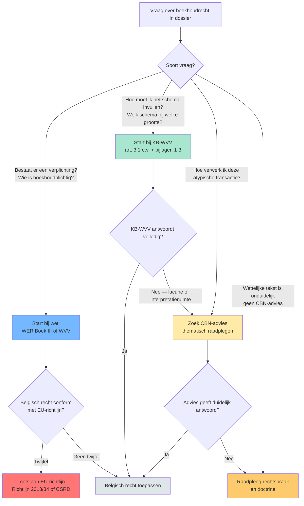
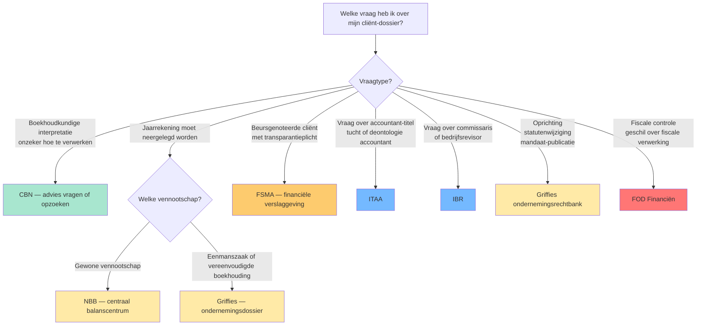
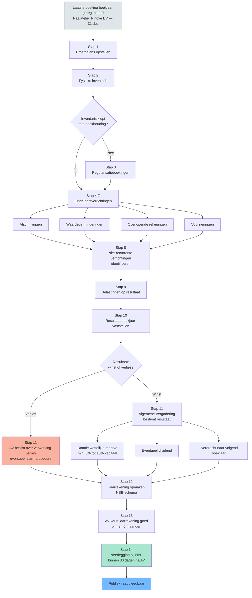
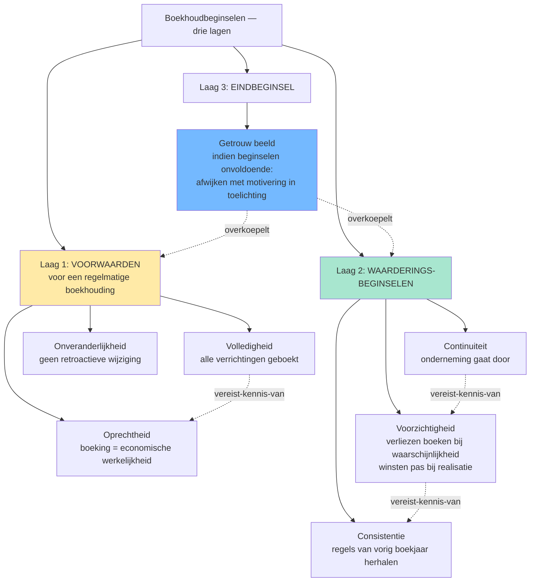

## Wat verwacht het examen van jou?

> [!abstract] Dit programmaonderdeel wordt getoetst op niveau *integratie*.
> Je moet meerdere concepten samen kunnen inzetten in complexe casussen — onderdelen herkennen, prioriteren, en tot een coherent oordeel komen.


**Taken** (uit het ITAA-examenprogramma):

> [!abstract]- **Taak 1** — Opstellen van de individuele jaarrekening
>
> **Subtaken**:
> - Herstructureren van de balans en de resultatenrekening
> - Identificeren en interpreteren van de balansaggregaten
> - Berekenen van de elementen die nodig zijn voor een interpretatie van de kasstromen en die interpreteren
> - Berekenen van de ratio's en ze interpreteren
> - Contextualiseren van de interpretaties naargelang van het bedrijfsdomein en de nationale en internationale context
>
> **Doelstellingen**:
> - Een beginsel van boekhoudrecht of een wettelijke bepaling uit Belgische of Europese bron opzoeken, grondig analyseren en toepassen, in voorkomend geval met inachtneming van internationale normen.
> - Verifiëren en waarborgen van de conformiteit van de boekhouding en de documenten met de wettelijke en reglementaire vereisten.


## Leesgids

Deze minicursus bouwt van buiten naar binnen: eerst de [[rechtsbronnen-boekhoudrecht-piramide|rechtsbronnen]] en het [[autoriteiten-boekhoudrecht-landschap|autoriteiten-landschap]], dan de [[boekhoudplichtige-onderneming|boekhoudplicht]] en de [[vennootschapsgrootte-cascade|grootte-cascade]], en tot slot de [[samenstelling-statutaire-jaarrekening|jaarrekening]] met haar [[boekhoudbeginselen-overzicht|beginselen]] en [[openbaarmaking-jaarrekening|openbaarmaking]]. Op niveau *integratie* moet je deze concepten samen kunnen inzetten: een casus tegelijk juridisch (welke bron?), institutioneel (welke autoriteit?) én boekhoudkundig (welk beginsel?) ontleden.

## Waarom dit programmaonderdeel telt

Het boekhoudrecht is het stelsel waarbinnen elke vennootschap haar economische werkelijkheid in cijfers giet — en dat stelsel ontleent zijn betrouwbaarheid aan het [[getrouw-beeld|getrouw beeld]] van de jaarrekening. Voor een gecertificeerd accountant is dit het werkterrein waarbinnen je elk cliëntendossier opent. Een verkeerde keuze bij de [[groottecriteria-jaarrekening|groottecriteria]] sleept meteen schema, jaarverslag, [[commissaris|commissaris]], [[sociale-balans|sociale balans]] en openbaarmakingstermijn mee. Een gemiste [[onveranderlijkheid-boekingen|correctie-discipline]] of vergeten [[volledigheidsbeginsel|buiten-balans-verplichting]] ondermijnt de [[regelmatige-boekhouding|regelmatigheid]] van de hele boekhouding. Het examen toetst dit op integratie-niveau: niet één regel kennen, maar regels in onderlinge spanning kunnen wegen.

## Waarom een boekhoudrecht? Regelmatige en getrouwe boekhouding als spil

Het [[belgisch-boekhoudrecht|Belgisch boekhoudrecht]] dwingt af dat elke onderneming haar verrichtingen vastlegt in een [[regelmatige-boekhouding|regelmatige boekhouding]] die uitmondt in een jaarrekening met [[getrouw-beeld|getrouw beeld]]. Die spil bedient tegelijk schuldeisers, fiscus, vennoten en — via [[openbaarmaking-jaarrekening|openbaarmaking]] — de markt zelf. Zonder gemeenschappelijke spelregels valt het hele economisch verkeer terug op privé-vertrouwen.

## Rechtsbronnen van het Belgisch boekhoudrecht: van EU tot rechtspraak

> [!info] Hoort bij taak: Opstellen van de individuele jaarrekening

Je leert in een dossier herkennen welke rechtsbron primair antwoord geeft: gaat het om een verplichting ([[wetboek-economisch-recht-boek-iii|WER Boek III]] / [[wetboek-vennootschappen-verenigingen|WVV]]), om een schema-rubriek ([[kb-wvv-uitvoering|KB-WVV]]), om een interpretatie ([[cbn-adviezen|CBN-adviezen]]) of om een twistgeval ([[rechtspraak-boekhoudrecht|rechtspraak]])? Het [[europees-boekhoudrecht|Europees boekhoudrecht]] zit erboven via richtlijnen en de IAS-verordening. Wie deze lagen door elkaar haalt, mist op examen de hardere regel hogerop.

- [[belgisch-boekhoudrecht|Belgisch boekhoudrecht]] · `begrip`
- [[europees-boekhoudrecht|Europees boekhoudrecht]] · `begrip`
- [[wetboek-economisch-recht-boek-iii|Wetboek van Economisch Recht — Boek III (boekhouding)]] · `begrip`
- [[wetboek-vennootschappen-verenigingen|Wetboek van Vennootschappen en Verenigingen (WVV)]] · `begrip`
- [[kb-wvv-uitvoering|KB tot uitvoering van het WVV (KB-WVV)]] · `begrip`
- [[cbn-adviezen|CBN-adviezen]] · `begrip`
- [[rechtspraak-boekhoudrecht|Rechtspraak inzake boekhoudrecht]] · `begrip`

## Rechtsbronnen-piramide van het Belgisch boekhoudrecht

Synthese van de **vijfgelaagde hiërarchie** waaruit het Belgisch boekhoudrecht ontstaat: EU-bronnen → WER + WVV → KB-WVV → CBN-adviezen → rechtspraak. Voor de stagiair onmisbaar om te weten waar je in welke vraag in moet duiken; conflict tussen lagen wordt opgelost van boven naar beneden.


De tabel hieronder maakt de hiërarchie operationeel: per laag zie je wat je raadpleegt, met welke bindende kracht, en op welk soort vraag ze het sterkste antwoord biedt. De beslisboom toont de redeneer-as bij twijfel — niet alle vragen starten in dezelfde laag.

| Laag | Bron | Bindende kracht | Voorbeeld | Hoe raadpleeg ik het op examen? |
|---|---|---|---|---|
| 1 (top) | [[europees-boekhoudrecht\|EU-richtlijnen en -verordeningen]] | Hoogste &mdash; lidstaten moeten omzetten; IFRS-verordening rechtstreeks toepasselijk op PIEs | Richtlijn 2013/34/EU (jaarrekeningen); IAS-Verordening 1606/2002 (IFRS voor beursgenoteerde groepen); Richtlijn 2022/2464/EU (CSRD) | ITAA-LEX toont omzetting; check of Belgisch recht conform richtlijn is bij twijfel |
| 2 | [[wetboek-economisch-recht-boek-iii\|WER Boek III]] + [[wetboek-vennootschappen-verenigingen\|WVV]] | Wet &mdash; bindend voor alle ondernemingen | WER Boek III art. III.82-95 (boekhoudplicht ondernemingen); WVV Boek 3 (jaarrekening vennootschappen) | Eerste plaats om te zoeken bij vraag over verplichting of definitie |
| 3 | [[kb-wvv-uitvoering\|KB tot uitvoering WVV (KB-WVV)]] | KB &mdash; uitvoeringsbesluit; bindend mits binnen wettelijk kader | KB-WVV art. 3:1 t.e.m. 3:108: schema's jaarrekening, waarderingsregels, neerlegging | Bij vraag over praktische uitwerking (schema-rubrieken, waardering, bijlagen) |
| 4 | [[cbn-adviezen\|CBN-adviezen]] | Niet bindend maar gezaghebbend &mdash; door rechtspraak en fiscus gevolgd | CBN-2022/03 (groottecriteria); CBN-2017/10 (verbondenheid); CBN-2011/14 (rentabiliteit) | Bij interpretatie- of toepassingsvraag waarvoor de wet/KB onduidelijk is |
| 5 (bodem) | [[rechtspraak-boekhoudrecht\|Rechtspraak]] | Bindend in concreet geschil; gezaghebbend voor analoge gevallen (geen precedentenleer) | Cassatie-arresten over getrouw beeld, substance over form, faillissementsaansprakelijkheid bestuurders | Bij twistgeval &mdash; argumentatieve onderbouw, geen primaire bron |



**Kerninzichten**:

- De wettelijke piramide is geen mechanisch toepassings-algoritme maar een redeneer-as. Bij Rotex Roeselare NV met een twijfelgeval over leasing-verwerking: eerst KB-WVV art. 3:65 (financiële versus operationele lease), dan CBN-advies 2018/04 voor IFRS-stijl-bepaling, pas dan rechtspraak. Wie omgekeerd start, kan een hardere wettelijke regel missen.
- EU-richtlijnen zijn niet rechtstreeks toepasselijk &mdash; ze worden door wet/KB omgezet. EU-verordeningen (IAS-Verordening 1606/2002) wel. Het examen kan vragen 'waarom moet beursgenoteerde Solaris Sint-Truiden NV IFRS toepassen?' &mdash; antwoord: directe werking IAS-Verordening, niet via WVV.
- CBN-adviezen hebben geen formele bindende kracht maar in de praktijk worden ze door rechters en fiscus consistent gevolgd. Een accountant die afwijkt van een CBN-advies moet uitleggen waarom &mdash; de bewijslast verschuift. Voor examen-redenering: aanhalen van een CBN-advies is zelden fout, ook al is het niet 'verplicht'.
- Rechtspraak heeft in België geen precedenten-werking (geen stare decisis). Een Cassatie-arrest is gezaghebbend, geen wet. Maar voor identieke feitencomplexen geldt het praktisch wel: ondernemers en accountants stemmen hun gedrag erop af. Op examen: 'is volgens rechtspraak X verplicht?' &mdash; vermijd 'verplicht', zeg 'volgens rechtspraak verwacht'.
- Cijferzakboekje (drempels, bedragen) hoort niet in de piramide. Het is een hulpmiddel dat de WVV/KB-WVV-bedragen samenbrengt. Bij examen: gebruik altijd de cijfers uit ITAA-LEX en het Cijferzakboekje &mdash; nooit cijfers uit oudere handboeken (drempels werden in 2023-2024 met circa 25 % verhoogd door EU-delegated act).

_Bouwt op_: [[belgisch-boekhoudrecht]] · [[europees-boekhoudrecht]] · [[wetboek-economisch-recht-boek-iii]] · [[wetboek-vennootschappen-verenigingen]] · [[kb-wvv-uitvoering]] · [[cbn-adviezen]] · [[rechtspraak-boekhoudrecht]]
## Identificeren van de toepasselijke rechtsbron bij een vraag uit het boekhoudrecht

> [!info] Hoort bij taak: Opstellen van de individuele jaarrekening

Bij integratie-vragen moet je in een complexe casus stap voor stap kunnen verantwoorden welke bron je raadpleegt en waarom — start met het vraagtype kwalificeren, daal dan van wet via KB naar [[cbn-adviezen|CBN]] en eventueel [[rechtspraak-boekhoudrecht|rechtspraak]]. De volledige procedure schetst die afdaling op een herhaalbare manier.

[[competenties/identificeren-rechtsbron-boekhoudrecht|→ Volledige procedure]]

## Actoren van het boekhoudrecht: wie maakt, wie controleert, wie publiceert?

> [!info] Hoort bij taak: Opstellen van de individuele jaarrekening

Naast bronnen lopen er ook bevoegdheden door het boekhoudrecht: de [[commissie-boekhoudkundige-normen|CBN]] interpreteert, de [[nationale-bank-belgie|NBB]] ontvangt neerleggingen, de [[fsma|FSMA]] bewaakt markttransparantie, [[itaa|ITAA]] en [[ibr|IBR]] reglementeren de beroepen, de [[griffies-ondernemingsrechtbank|griffies]] beheren het ondernemingsdossier en de [[fod-financien-boekhoudrecht|FOD Financiën]] sluit fiscaal aan. Het examen camoufleert die afbakening graag — je moet bij elke vraag de juiste instantie eruit kunnen filteren.

- [[commissie-boekhoudkundige-normen|Commissie voor Boekhoudkundige Normen (CBN)]] · `autoriteit`
- [[nationale-bank-belgie|Nationale Bank van België (NBB)]] · `autoriteit`
- [[fsma|Financial Services and Markets Authority (FSMA)]] · `autoriteit`
- [[itaa|Instituut van de Belastingadviseurs en Accountants (ITAA)]] · `autoriteit`
- [[ibr|Instituut van de Bedrijfsrevisoren (IBR)]] · `autoriteit`
- [[fod-financien-boekhoudrecht|FOD Financiën (boekhoudrechtelijke rol)]] · `autoriteit`
- [[griffies-ondernemingsrechtbank|Griffies van de ondernemingsrechtbank]] · `autoriteit`

## Wie controleert wat? — Het autoriteiten-landschap van het Belgisch boekhoudrecht

Synthese-overzicht van de zeven autoriteiten die samen het Belgisch boekhoudrecht bewaken (CBN, NBB, FSMA, ITAA, IBR, griffies ondernemingsrechtbank, FOD Financiën). Voor stagiairs-GA cruciaal omdat de eerste vraag bij elk praktisch dossier is: 'naar welke autoriteit ga ik?' — examenvragen camoufleren regelmatig wie waarvoor bevoegd is.


De matrix legt per autoriteit de bevoegdheid, de wettelijke basis en het toepassingsgebied naast elkaar; de beslisboom routeert een concrete cliënt-vraag naar de juiste instantie. Gebruik beide samen: in een dossier kunnen meerdere autoriteiten naast elkaar bevoegd zijn (typisch bij beursgenoteerde groepen).

| Autoriteit | Wat doet ze? | Wettelijke basis | Toepasselijk op | Wanneer raadpleeg ik haar? |
|---|---|---|---|---|
| [[commissie-boekhoudkundige-normen\|CBN]] | Adviseert over interpretatie van boekhoudwetgeving | Wet 17 juli 1975 | Alle ondernemingen | Bij twijfel over boekhoudkundige verwerking &mdash; raadpleeg CBN-advies (niet bindend, maar gezaghebbend) |
| [[nationale-bank-belgie\|NBB]] | Ontvangt en publiceert neerleggingen jaarrekeningen + voert prudentieel toezicht (banken) | KB-WVV art. 3:104; Wet 22 februari 1998 | Alle vennootschappen (neerlegging); banken/verzekeraars (prudentieel) | Bij neerlegging jaarrekening (binnen 30 dagen na AV); banken voor prudentiële verslagstaten |
| [[fsma\|FSMA]] | Toezicht op gedrag op financiële markten + transparantie uitgevers | Wet 2 augustus 2002 | Beursgenoteerde uitgevers + verzekeringstussenpersonen + pensioeninstellingen | Bij beursgenoteerde cliënt &mdash; transparantieverplichtingen, prospectus, koersgevoelige info |
| [[itaa\|ITAA]] | Reglementeert accountants en belastingadviseurs (toegang, tucht, normen) | Wet 17 maart 2019 | Accountants + gecertificeerde accountants + fiscalisten + belastingadviseurs | Voor stage, bekwaamheidsexamen, tuchtklacht, deontologische vraag accountant |
| [[ibr\|IBR]] | Reglementeert bedrijfsrevisoren (commissarissen) | Wet 7 december 2016 | Bedrijfsrevisoren | Bij commissarisopdracht of audit door revisor &mdash; nooit door ITAA-accountant |
| [[griffies-ondernemingsrechtbank\|Griffies ondernemingsrechtbank]] | Ontvangt ondernemingsdossier (oprichting, statuten, mandaten) | WER Boek III; WVV | Alle ondernemingen | Bij oprichting, statutenwijziging, neerlegging bestuursverslag/mandaten |
| [[fod-financien-boekhoudrecht\|FOD Financiën]] | Fiscale controle &mdash; boekhouding als basis voor aangifte | WIB 92; BTW-Wetboek | Alle belastingplichtigen | Bij fiscale controle of geschil over fiscale verwerking van boekhoudkundige feiten |



**Kerninzichten**:

- ITAA en IBR zijn niet uitwisselbaar. ITAA reglementeert accountants (kunnen contractuele KMO-controle uitvoeren); IBR reglementeert bedrijfsrevisoren (kunnen wettelijke commissarisopdracht uitvoeren). Examenvalkuil: 'mag een ITAA-accountant commissaris zijn bij Rotex Roeselare NV (groot)?' &mdash; antwoord nee, dat is voorbehouden aan IBR-revisor.
- NBB en FSMA delen het 'Twin Peaks'-toezichtmodel maar met verschillende dimensies. NBB = prudentieel/macroprudentieel (gezondheid van financiële instellingen). FSMA = gedrag/markttransparantie (eerlijke informatie aan beleggers). Bij Belfius BV (bank): NBB controleert kapitaaltoereikendheid; FSMA controleert hoe Belfius haar producten in de markt zet.
- Neerlegging gebeurt via twee kanalen: jaarrekeningen via NBB (centraal balanscentrum); ondernemingsdossier (oprichting, statuten, benoemingen) via de griffies van de ondernemingsrechtbank. Verwar deze niet &mdash; dezelfde Meubelzaak Mertens BV legt elk jaar bij NBB neer maar ook bij de griffie bij statutenwijziging.
- CBN-adviezen zijn niet bindend maar gezaghebbend. Rechters en fiscus volgen ze in praktijk. Bij examenvraag 'wat is de boekhoudkundige verwerking van X?' is een CBN-advies vaak de beste bron &mdash; ook als de WVV/KB-WVV-tekst zwijgt of dubbelzinnig is.
- Bij een beursgenoteerde groep zijn doorgaans drie autoriteiten tegelijk betrokken: FSMA (transparantie), NBB (neerlegging jaarrekening + prudentieel indien financiële instelling), IBR-revisor (commissaris). Voor een gewone KMO is meestal alleen NBB + (eventueel) ITAA-accountant relevant.

_Bouwt op_: [[commissie-boekhoudkundige-normen]] · [[nationale-bank-belgie]] · [[fsma]] · [[itaa]] · [[ibr]] · [[griffies-ondernemingsrechtbank]] · [[fod-financien-boekhoudrecht]] · [[commissaris]] · [[public-interest-entity]]
## Identificeren van de juiste administratieve autoriteit bij een boekhoudrechtelijke vraag

> [!info] Hoort bij taak: Opstellen van de individuele jaarrekening

Op integratie-niveau moet je in een gemengde casus tegelijk meerdere autoriteiten kunnen activeren — typisch bij een beursgenoteerde groep waar [[fsma|FSMA]], [[nationale-bank-belgie|NBB]] en [[ibr|IBR]]-revisor samen optreden. De procedure leert je de routering systematisch op vraagtype te baseren.

[[competenties/identificeren-administratieve-autoriteit|→ Volledige procedure]]

## Grondslag van de boekhoudplicht: wie moet boekhouden en hoe?

> [!info] Hoort bij taak: Opstellen van de individuele jaarrekening

Hier zit de operationele kern van het boekhoudrecht: de [[boekhoudplichtige-onderneming|boekhoudplicht]], de keuze tussen [[dubbel-boekhouden|dubbele]] en [[vereenvoudigde-boekhouding|vereenvoudigde boekhouding]], en de drie technische pijlers ([[minimum-algemeen-rekeningenstelsel|MAR]], [[dagboek|dagboeken]], [[verantwoordingsstuk|verantwoordingsstukken]]) die samen de [[regelmatige-boekhouding|regelmatigheid]] dragen. Daar bovenop staan procedurele regels — [[onveranderlijkheid-boekingen|onveranderlijkheid]], [[bewaartermijn-boekhouding|bewaartermijn]] en [[eindejaarsverrichtingen|eindejaarsverrichtingen]] — die het cyclische karakter van een boekjaar vormgeven.

- [[boekhoudplichtige-onderneming|Boekhoudplichtige onderneming]] · `begrip`
- [[regelmatige-boekhouding|Regelmatige boekhouding]] · `cluster`
- [[dubbel-boekhouden|Dubbel boekhouden]] · `cluster`
- [[vereenvoudigde-boekhouding|Vereenvoudigde boekhouding]] · `begrip`
- [[minimum-algemeen-rekeningenstelsel|Minimum Algemeen Rekeningenstelsel (MAR)]] · `begrip`
- [[dagboek|Dagboek]] · `begrip`
- [[hulpdagboeken|Hulpdagboeken]] · `begrip`
- [[verantwoordingsstuk|Verantwoordingsstuk]] · `begrip`
- [[inventaris|Inventaris]] · `cluster`
- [[proef-en-saldibalans|Proef- en saldibalans]] · `begrip`
- [[eindejaarsverrichtingen|Eindejaarsverrichtingen (jaarafsluiting)]] · `procedure`
- [[onveranderlijkheid-boekingen|Onveranderlijkheid van de boekingen]] · `regel`
- [[bewaartermijn-boekhouding|Bewaartermijn van boeken en verantwoordingsstukken]] · `regel`

## Boekjaar afsluiten &mdash; van proefbalans tot neerlegging

Synthese die per stap toont wat een vennootschap aan het einde van haar boekjaar moet doen: inventaris opmaken, eindejaarsverrichtingen boeken, proef- en saldibalans opstellen, jaarrekening voorbereiden, goedkeuren en openbaarmaken. Voor de stagiair-GA is dit de praktische ruggengraat van zijn eerste boekjaar-afsluitingen.


De stappentabel en flowchart zetten de keten op één lijn — let vooral op de wettelijke timing-keten (boekjaar → AV → neerlegging) en op de [[eindejaarsverrichtingen|eindejaarsverrichtingen]] die direct uit de waarderingsbeginselen volgen. Wie de volgorde verstoort, breekt de logica van de jaarrekening.

| Stap | Wat | Wanneer | Concept-record | Output |
|---|---|---|---|---|
| 1 | Proefbalans opstellen | Direct na laatste boeking boekjaar | [[regelmatige-boekhouding]] · [[dubbel-boekhouden]] | Lijst met saldi per grootboekrekening; debet = credit |
| 2 | Fysieke inventarisopname | Op de afsluitingsdatum (in regel laatste dag boekjaar) | [[inventaris]] | Werkblad met fysieke tellingen voorraad, kas, vaste activa |
| 3 | Verschillen inventaris &harr; boekhouding regulariseren | Tussen inventaris-datum en jaarrekening-opmaak | [[inventaris]] · [[voorraden]] | Correctieboekingen (manco's, breukverliezen, inventarisverschillen) |
| 4 | Afschrijvingen boeken | Eindejaarsverrichting | [[afschrijvingen]] | Boeking 6302 / 22-28 voor materiele en immateriele vaste activa |
| 5 | Waardeverminderingen toetsen + boeken | Eindejaarsverrichting | [[waardeverminderingen]] | Boeking 631-634 voor duurzame waardeverminderingen op activa |
| 6 | Overlopende rekeningen boeken | Eindejaarsverrichting | [[overlopende-rekeningen]] | Boeking 490/491/492/493 voor toerekening kosten/opbrengsten aan juiste boekjaar |
| 7 | Voorzieningen aanleggen of terugnemen | Eindejaarsverrichting | [[voorzieningen]] · [[voorzichtigheidsbeginsel]] | Boeking 6360 / 160-163 voor risico's en kosten |
| 8 | Niet-recurrente verrichtingen identificeren | Bij opmaak resultatenrekening | [[niet-recurrente-verrichtingen]] | Boeking 66/76 (vroegere 'uitzonderlijke' rubrieken) |
| 9 | Belastingen op het resultaat berekenen + boeken | Na vaststelling resultaat voor belasting | [[bedrijfsresultaat]] | Boeking 670-679 |
| 10 | Resultaat van het boekjaar afsluiten | Sluiten rekeningen klasse 6 en 7 | [[bedrijfsresultaat]] · [[resultaatverwerking]] | Saldo op rekening 690/790 |
| 11 | Algemene vergadering: resultaat bestemmen | Binnen 6 maanden na boekjaareinde | [[resultaatverwerking]] · [[wettelijke-reserve]] | Beslissing AV: dotatie wettelijke reserve, eventueel andere reserves, dividend, overdracht naar volgend boekjaar |
| 12 | Jaarrekening opmaken in NBB-schema | Na resultaatverwerking | [[jaarrekening]] | Volledige of verkorte jaarrekening + toelichting + sociale balans |
| 13 | Goedkeuring algemene vergadering | Binnen 6 maanden na boekjaareinde | [[jaarrekening]] | AV-notulen + ondertekende jaarrekening |
| 14 | Neerlegging bij NBB | Binnen 30 dagen na goedkeuring AV (en uiterlijk 7 maanden na boekjaareinde) | [[jaarrekening]] | Neergelegde jaarrekening &mdash; publiek raadpleegbaar |



**Kerninzichten**:

- De volgorde is bindend: pas na de eindejaarsverrichtingen (stap 4-9) kan je het resultaat van het boekjaar vaststellen (stap 10). Pas na de algemene vergadering die het resultaat bestemt (stap 11) ken je het 'overgedragen resultaat' &mdash; pas dan is de jaarrekening volledig opmaakbaar (stap 12). Een examenvraag die zegt 'jaarrekening klaar, AV moet nog komen' bevat dus een logische fout: de jaarrekening kan niet 'klaar' zijn zonder AV-beslissing.
- De timing is wettelijk geketend: AV binnen 6 maanden na boekjaareinde (WVV art. 3:1 §1), neerlegging binnen 30 dagen na AV (WVV art. 3:10) en uiterlijk 7 maanden na boekjaareinde. Voor [[Naaiatelier Ninove BV]] met boekjaar dat eindigt op 31 december betekent dit: AV ten laatste 30 juni, neerlegging ten laatste 31 juli. Boete-risico: laattijdige neerlegging is een veelvoorkomende cliënt-vraag.
- Drie van de tien verplichte boekingen volgen direct uit de waarderingsbeginselen: afschrijvingen (consistentie), waardeverminderingen (voorzichtigheid), voorzieningen (voorzichtigheid). Wie de beginselen kent, kan deze stappen niet vergeten. Wie ze opvat als 'extra werk', vergeet er typisch een &mdash; bijvoorbeeld de waardeverminderingen op vorderingen.
- De wettelijke reserve (stap 11) ontstaat bij de resultaatverwerking, niet bij de jaarrekening-opmaak. Sequentieel: AV beslist welk percentage naar wettelijke reserve gaat (min. 5% van de winst, tot de wettelijke reserve 10% van het kapitaal bereikt). Pas dan staat het bedrag op rekening 130; pas dan past het in de jaarrekening die de AV daarna goedkeurt.

_Bouwt op_: [[regelmatige-boekhouding]] · [[inventaris]] · [[overlopende-rekeningen]] · [[afschrijvingen]] · [[waardeverminderingen]] · [[voorzieningen]] · [[jaarrekening]] · [[resultaatverwerking]] · [[wettelijke-reserve]]
## Kwalificeren of een onderneming boekhoudplichtig is en welk type boekhouding zij moet voeren

> [!info] Hoort bij taak: Opstellen van de individuele jaarrekening

Je leert in een casus de juridische vorm en omzet samen wegen om te kiezen tussen [[dubbel-boekhouden|dubbele boekhouding]] en [[vereenvoudigde-boekhouding|vereenvoudigde boekhouding]] — een rechtspersoon valt altijd onder dubbele boekhouding, een natuurlijke persoon onder de wettelijke drempel mag versimpelen. De procedure begeleidt die kwalificatie stap voor stap.

[[competenties/kwalificeren-boekhoudplichtige-onderneming|→ Volledige procedure]]

## Kwalificeren welk boekhoud- en jaarrekeningregime van toepassing is op een VZW, IVZW of stichting

> [!info] Hoort bij taak: Opstellen van de individuele jaarrekening

Voor verenigingen geldt een eigen drie-regime-cascade ([[jaarrekening-vzw-stichting|VZW-jaarrekening]]): zeer klein → vereenvoudigd, klein → verkort VZW-schema, groot → volledig VZW-schema. In een complexe casus moet je gelijktijdig de aard van de activiteiten en de drie grootte-criteria kunnen toetsen.

[[competenties/kwalificeren-jaarrekeningregime-vzw-stichting|→ Volledige procedure]]

## Vennootschapsvormen en groottecategorieën: de cascade in cijfers

> [!info] Hoort bij taak: Opstellen van de individuele jaarrekening

Hier komen [[vennootschapsvormen-typologie|vorm-keuze]] en [[groottecriteria-jaarrekening|grootte-toets]] samen tot het allesbepalende beslispunt van het dossier: is de vennootschap [[microvennootschap|micro]], [[kleine-vennootschap|klein]] of groot? Die ene kwalificatie stuurt het [[jaarrekening-schema|jaarrekening-schema]] én het volledige cascade-pakket van verplichtingen aan. Voor [[jaarrekening-vzw-stichting|VZW's en stichtingen]] geldt een parallelle cascade met eigen drempels.

- [[vennootschapsvormen-typologie|Typologie van vennootschaps- en verenigingsvormen]] · `begrip`
- [[groottecriteria-jaarrekening|Groottecriteria (jaarrekening-context)]] · `regel`
- [[microvennootschap|Microvennootschap (WVV art. 1:25)]] · `begrip`
- [[kleine-vennootschap|Kleine vennootschap (WVV art. 1:24)]] · `begrip`
- [[jaarrekening-schema|Jaarrekening-schema (volledig, verkort, micro)]] · `begrip`
- [[jaarrekening-vzw-stichting|Jaarrekening van VZW, IVZW en stichtingen]] · `begrip`

## Vennootschapsgrootte-cascade: micro &mdash; klein &mdash; groot

Synthese die in één beslisboom toont hoe de groottecategorie (micro/klein/groot) doorwerkt op jaarrekening-schema, commissaris-verplichting, jaarverslag-plicht en consolidatieverplichting. Voor stagiair-GA praktische ruggengraat bij elk vennootschapsdossier.


De vergelijkingstabel zet de zes parallelle verplichtingen per categorie naast elkaar; de beslisboom voegt de groep-context en de PIE-test toe. Wie alleen op schema-keuze focust, vergeet typisch de [[commissaris|commissaris]]-vrijstelling of de [[sociale-balans|sociale balans]].

| Aspect | [[microvennootschap\|Micro]] | [[kleine-vennootschap\|Klein]] | Groot |
|---|---|---|---|
| Drempels (max 1 overschrijden) | ≤ 10 VTE · ≤ € 900.000 omzet · ≤ € 450.000 balans | ≤ 50 VTE · ≤ € 11.250.000 omzet · ≤ € 6.000.000 balans | Boven de kleine-drempels (2 of 3 overschreden) |
| Extra voorwaarde | Mag geen moeder of dochter zijn | Verbondenheid telt op geconsolideerde basis | &mdash; |
| [[jaarrekening-schema\|Schema]] | Microschema (Bijlage 3 KB-WVV) | Verkort schema (Bijlage 2) | Volledig schema (Bijlage 1) |
| [[jaarverslag\|Jaarverslag]] | Vrijgesteld | Vrijgesteld | Verplicht (WVV art. 3:32) |
| [[commissaris\|Commissaris]] | Niet verplicht | Niet verplicht (tenzij groep groot is) | Verplicht (WVV art. 3:72) |
| [[sociale-balans\|Sociale balans]] | Vereenvoudigd | Verplicht (WVV art. 3:31) | Verplicht |
| [[openbaarmaking-jaarrekening\|Neerlegging NBB]] | Verplicht binnen 7 maanden na boekjaar | Verplicht binnen 7 maanden na boekjaar | Verplicht binnen 7 maanden na boekjaar |
| CSRD-duurzaamheidsrapportering | Niet van toepassing | Niet van toepassing | Vanaf 2024 voor grote vennootschappen die voldoen aan EU-omvangscriteria |

```mermaid
flowchart TD
  A[Cliënt-vennootschap &mdash; welke verplichtingen?] --> B[Verzamel 3 cijfers van afgesloten boekjaar:<br/>VTE &mdash; omzet excl. BTW &mdash; balanstotaal]
  B --> C{Behoort vennootschap tot groep?}
  C -->|Ja| D[Tel op geconsolideerde basis<br/>verbondenheid trekt cijfers op]
  C -->|Nee| E[Gebruik enkelvoudige cijfers]
  D --> F{Boven kleine-drempel<br/>op meer dan 1 criterium?}
  E --> F
  F -->|Ja| G[Groot: volledig schema<br/>jaarverslag + commissaris + sociale balans]
  F -->|Nee &mdash; max 1 criterium boven| H{Onder microdrempels<br/>op meer dan 1 criterium?}
  H -->|Ja én geen moeder/dochter| I[Micro: microschema<br/>geen jaarverslag<br/>geen commissaris]
  H -->|Ja maar moeder of dochter| J[Klein: verkort schema<br/>geen jaarverslag<br/>geen commissaris tenzij groep groot]
  H -->|Nee| J
  G --> K{Beursgenoteerd<br/>of grote PIE?}
  K -->|Ja| L[Bijkomend: CSRD-duurzaamheidsrapport<br/>via [[fsma\|FSMA]] toezicht]
  K -->|Nee| M[Enkel WVV-verplichtingen<br/>via [[nationale-bank-belgie\|NBB]] neerlegging]
  style I fill:#a8e6cf
  style J fill:#ffeaa7
  style G fill:#fdcb6e
  style L fill:#ff7675
  style M fill:#dfe6e9
```

**Kerninzichten**:

- Eén grootteklassering = zes parallelle verplichtingen. Stagiairs maken vaak de fout schema te kiezen en de cascade te vergeten. Voor Meubelzaak Mertens BV (klein) volgt uit de classering: verkort schema + geen jaarverslag + geen commissaris + verplichte sociale balans + neerlegging NBB binnen 7 maand. Vergeet je commissaris-vrijstelling, dan misbillijk je de cliënt met onnodige kosten.
- Microvennootschap heeft een extra voorwaarde die klein-vennootschap niet heeft: GEEN moeder of dochter zijn. Oprichtingen Oostende BV (omzet € 400K, 4 VTE) is micro &mdash; maar als ze morgen 60% van Industria Antwerpen NV verwerft, kantelt ze automatisch naar klein. De groottecascade is dynamisch.
- Twee opeenvolgende boekjaren-regel beschermt tegen heen-en-weer-schommelen. Eénmalige overschrijding kantelt status niet. Bij Brugse Brouwerij BV met uitschieter omzet in 2024: pas vanaf 2026 kantelen als 2025 ook overschrijdt. Examenvraag-camouflage: 'in 2024 had vennootschap X 55 VTE, dus is ze groot' &mdash; mis, je moet 2023 erbij hebben.
- Kleine groep beïnvloedt kleine vennootschap. Een kleine dochter van een grote groep wordt voor jaarrekening behandeld als groot (consolidatie-perspectief: WVV art. 1:24 § 5). Aurelia Holding NV (klein op zich) met 4 dochters die samen 60 VTE en € 18M omzet hebben &mdash; wordt voor jaarrekening grote vennootschap. Dit is de meest gemiste examen-valkuil.
- Onderscheid [[groottecriteria-jaarrekening\|groottecriteria-jaarrekening]] (WVV art. 1:24-1:25) en [[groottecriteria-consolidatie\|groottecriteria-consolidatie]] (WVV art. 1:26). Eerste bepaalt schema en cascade-verplichtingen van enkelvoudige jaarrekening. Tweede bepaalt vrijstelling consolidatieplicht. Andere drempels, ander doel &mdash; verwar nooit.

_Bouwt op_: [[groottecriteria-jaarrekening]] · [[kleine-vennootschap]] · [[microvennootschap]] · [[jaarrekening-schema]] · [[jaarverslag]] · [[commissaris]] · [[openbaarmaking-jaarrekening]] · [[sociale-balans]]
## Klasseren van een vennootschap als micro, klein of groot volgens de groottecriteria

> [!info] Hoort bij taak: Opstellen van de individuele jaarrekening

Stap voor stap doorloop je de drie criteria op balansdatum, pas je de twee-opeenvolgende-boekjaren-regel toe en activeer je waar nodig de [[groottecriteria-jaarrekening|verbondenheidstoets]] op geconsolideerde basis. Vergeet bij twijfel niet de extra micro-voorwaarde (geen moeder of dochter zijn).

[[competenties/klasseren-vennootschap-naar-groottecategorie|→ Volledige procedure]]

## Bepalen welk jaarrekening-schema (volledig, verkort, micro) een vennootschap moet gebruiken

> [!info] Hoort bij taak: Opstellen van de individuele jaarrekening

Eenmaal de [[groottecriteria-jaarrekening|grootteklasse]] bekend is, volgt het schema bijna deterministisch — maar je moet ook kunnen omgaan met overgangsperiodes en met de doorwerking op [[sociale-balans|sociale balans]] en [[toelichting-jaarrekening|toelichting]]. De procedure benoemt die randvoorwaarden expliciet.

[[competenties/bepalen-jaarrekeningschema|→ Volledige procedure]]

## De jaarrekening als studieobject: bestanddelen en samenstelling

> [!info] Hoort bij taak: Opstellen van de individuele jaarrekening

De jaarrekening is geen rapport maar een samenstel: [[balans|balans]], [[resultatenrekening|resultatenrekening]] en [[toelichting-jaarrekening|toelichting]] vormen de kern, [[sociale-balans|sociale balans]] en [[bestuursverslag|bestuursverslag]] (synoniem [[jaarverslag|jaarverslag]]) komen er als verplichte aanvullingen bij. De [[samenstelling-statutaire-jaarrekening|samenstellingsprocedure]] vertrekt steeds van de [[proef-en-saldibalans|proef- en saldibalans]] na [[eindejaarsverrichtingen|eindejaarsverrichtingen]]. Vergeet ook de [[klasse-0-niet-in-balans|niet-balans-rubrieken]] niet — daar zit het stille volledigheidsrisico.

- [[jaarrekening-als-studieobject|Jaarrekening als studieobject van financiële analyse]] · `begrip`
- [[samenstelling-statutaire-jaarrekening|Samenstelling van de statutaire jaarrekening]] · `procedure`
- [[balans|Balans (jaarrekening-component)]] · `cluster`
- [[resultatenrekening|Resultatenrekening]] · `cluster`
- [[toelichting-jaarrekening|Toelichting bij de jaarrekening]] · `begrip`
- [[sociale-balans|Sociale balans]] · `begrip`
- [[bestuursverslag|Bestuursverslag (jaarverslag)]] · `procedure`
- [[jaarverslag|Jaarverslag]] · `begrip`
- [[klasse-0-niet-in-balans|Klasse 0 — niet in de balans opgenomen rekeningen]] · `begrip`
- [[niet-in-balans-opgenomen-rechten-verplichtingen|Niet in de balans opgenomen rechten en verplichtingen]] · `regel`

## Boekhoudbeginselen en waarderingsregels: het redeneerkader bij twijfel

> [!info] Hoort bij taak: Opstellen van de individuele jaarrekening

De [[boekhoudbeginselen-overzicht|beginselen]] zijn geen catechismus maar het kompas dat richting geeft wanneer de wet zwijgt of meerdere wegen openlaat. Vier waarderingsbeginselen ([[voorzichtigheidsbeginsel|voorzichtigheid]], [[continuiteitsbeginsel|continuïteit]], [[oprechtheidsbeginsel|oprechtheid]], [[consistentiebeginsel|consistentie]]) sturen de [[waarderingsregels-jaarrekening|waarderingsregels]] — uitgewerkt in [[aanschaffingswaarde|aanschaffingswaarde]], [[afschrijvingen|afschrijvingen]], [[waardeverminderingen|waardeverminderingen]], [[herwaarderingsmeerwaarden|herwaarderingen]], [[voorzieningen|voorzieningen]] en [[overlopende-rekeningen|overlopende rekeningen]]. Boven alles staat het [[getrouw-beeld|getrouw beeld]] als eindtoets.

- [[getrouw-beeld|Getrouw beeld]] · `regel`
- [[getrouw-beeld-jaarrekening|Getrouw beeld van de jaarrekening]] · `regel`
- [[voorzichtigheidsbeginsel|Voorzichtigheidsbeginsel]] · `regel`
- [[continuiteitsbeginsel|Boekhoudkundig continuïteitsbeginsel (going concern)]] · `regel`
- [[oprechtheidsbeginsel|Oprechtheidsbeginsel (boekhouding)]] · `regel`
- [[consistentiebeginsel|Consistentiebeginsel]] · `regel`
- [[volledigheidsbeginsel|Volledigheidsbeginsel (boekhouding)]] · `regel`
- [[waarderingsregels-jaarrekening|Waarderingsregels (algemeen)]] · `begrip`
- [[aanschaffingswaarde|Aanschaffingswaarde]] · `begrip`
- [[afschrijvingen|Afschrijvingen]] · `cluster`
- [[waardeverminderingen|Waardeverminderingen]] · `cluster`
- [[herwaarderingsmeerwaarden|Herwaarderingsmeerwaarden]] · `cluster`
- [[voorzieningen|Voorzieningen voor risico's en kosten]] · `cluster`
- [[oprichtingskosten|Oprichtingskosten]] · `cluster`
- [[overlopende-rekeningen|Overlopende rekeningen]] · `cluster`

## Aanvullende boekhoudbeginselen (voorzichtigheid, oprechtheid, continuïteit, consistentie)

Naast de drie 'voorwaardelijke' boekhoudbeginselen (volledigheid, oprechtheid, onveranderlijkheid) zijn er vier aanvullende beginselen die de **waarderings- en presentatiekeuzes** sturen: voorzichtigheid, oprechtheid, continuïteit en consistentie. Ze staan niet in één wetsartikel maar zijn verspreid in KB-WVV art. 3:6 en 3:35 e.v. Voor het examen is dit cluster één van de meest getoetste theorie-blokken: vragen vertrekken meestal vanuit een concreet waarderings-dilemma en peilen welk beginsel je toepast.


De vier beginselen werken complementair en remmen elkaar: [[voorzichtigheidsbeginsel|voorzichtigheid]] zonder [[oprechtheidsbeginsel|oprechtheid]] vervalt in stille reserves; [[continuiteitsbeginsel|continuïteit]] zonder [[consistentiebeginsel|consistentie]] maakt boekjaren onvergelijkbaar. In een waarderings-casus identificeer je dus eerst welk beginsel primair geactiveerd wordt — pas dan zoek je de uitwerking in de [[waarderingsregels-jaarrekening|waarderingsregels]].

**Kerninzichten**:

- De vier beginselen werken **complementair**: voorzichtigheid (geen overschatting) is begrensd door oprechtheid (geen onderschatting als camouflage); continuïteit verklaart waarom waarderingen op going-concern-basis mogen; consistentie waarborgt vergelijkbaarheid tussen boekjaren.
- Bij conflict: **getrouw beeld** is het einddoel waaraan alle vier worden afgemeten. Een 'voorzichtige' onderwaardering die het beeld vertekent, schendt oprechtheid en uiteindelijk het getrouw beeld.
- Voor het examen: identificeer in elke waarderings-casus welke beginsel(s) primair geactiveerd worden — niet alle vier tegelijk.

_Bouwt op_: [[voorzichtigheidsbeginsel]] · [[oprechtheidsbeginsel]] · [[continuiteitsbeginsel]] · [[consistentiebeginsel]]
## Boekhoudbeginselen &mdash; overzicht

Synthese die de zeven boekhoudbeginselen in drie functionele lagen ordent: voorwaarden voor regelmatigheid (volledigheid, oprechtheid, onveranderlijkheid), waarderingssturing (continuïteit, voorzichtigheid, consistentie), en het eindbeginsel (getrouw beeld). Cruciaal voor stagiairs omdat losse memorisatie hier niet helpt — examenvragen toetsen welk beginsel doorslaggevend is bij conflicten (typisch: voorzichtigheid tegenover continuïteit).


De tabel koppelt elk beginsel aan zijn primaire bron en de typische valkuil; de drie-lagen-flowchart maakt zichtbaar welke beginselen meer ondersteunend zijn (regelmatigheid) en welke meer richting geven (waardering), met [[getrouw-beeld|getrouw beeld]] als overkoepelende eindtoets.

| Beginsel | Functie | Primaire bron | Vraag die het beantwoordt | Klassieke valkuil |
|---|---|---|---|---|
| [[getrouw-beeld]] | Eindbeginsel: de jaarrekening moet een getrouw beeld geven van vermogen, financiele positie en resultaat | WER art. III.89 · KB WVV art. 3:1 · Richtlijn 2013/34/EU art. 4 §3 | "Geeft mijn jaarrekening een getrouw beeld?" &mdash; eindtoets | Stagiair denkt: "als alle posten correct geboekt zijn klopt het beeld vanzelf". Fout: bij twijfel moet je afwijken van de regels mits motivering in de toelichting (KB WVV art. 3:1 derde lid). |
| [[volledigheidsbeginsel]] | Alle verrichtingen, bezittingen, rechten, schulden en verplichtingen zijn geboekt | WER art. III.83 · CBN 174/1 | "Heb ik alles opgenomen?" | Buiten-balans-rechten en -verplichtingen (klasse 0) worden vergeten &mdash; zie [[rechten-verplichtingen-buiten-balans]]. |
| [[oprechtheidsbeginsel]] | Boekingen reflecteren de werkelijke economische verrichting (niet de juridische schijn) | CBN 174/1 | "Komt mijn boeking overeen met de werkelijkheid?" | Substance over form: leasing waarbij [[Transport Tongeren BV]] het economisch eigendom heeft moet als financieringshuur geboekt worden, niet als operationele huur &mdash; ook al heet het contractueel zo. |
| [[onveranderlijkheid-boekingen]] | Eenmaal geboekt mag niet meer worden geschrapt of overschreven; correcties via tegenboeking | WER art. III.86 · CBN 174/1 | "Mag ik een vorige boeking nog wijzigen?" | Tipp-Ex of overschrijven in handgeschreven dagboek &rarr; boekhouding niet meer regelmatig. Correctie altijd via tegenboeking met datum en verwijzing. |
| [[continuiteitsbeginsel]] | Waardering veronderstelt dat de onderneming haar activiteiten voortzet | KB WVV art. 3:6 · CBN 2018/18 | "Mag ik blijven waarderen alsof we doorgaan?" | Bij twijfel over continuiteit moet bestuur uitdrukkelijk evalueren (toelichting jaarrekening); bij stopzetting overschakelen naar discontinuiteitswaarderingsregels. |
| [[voorzichtigheidsbeginsel]] | Verliezen en risico's boeken zodra waarschijnlijk; winsten pas bij realisatie | KB WVV art. 3:6 · Richtlijn 2013/34/EU art. 6 §1.c | "Mag ik deze opbrengst al boeken?" | Asymmetrie: voorzieningen aanleggen voor verwachte verliezen ja; herwaarderingsmeerwaarden boeken op niet-verkochte activa niet (behalve duurzame meerwaarde + KB-criteria). |
| [[consistentiebeginsel]] | Waarderingsregels van het ene boekjaar op het andere onveranderd toepassen | KB WVV art. 3:8 · CBN 174/1 | "Mag ik mijn afschrijvingsmethode veranderen?" | Methodewijziging mag, mits motivering in de toelichting + retroactieve aanpassing of prospectieve toepassing (afhankelijk van type wijziging). |



**Kerninzichten**:

- De zeven beginselen zijn niet allemaal gelijkwaardig: drie zijn voorwaarden om uberhaupt van een 'regelmatige' boekhouding te kunnen spreken (volledigheid, oprechtheid, onveranderlijkheid), drie sturen de waardering (continuiteit, voorzichtigheid, consistentie), en het getrouw-beeld-beginsel staat erboven als eindtoets. Stagiairs die ze op een rij zien staan zonder hierarchie missen die drie-lagen-structuur.
- Het getrouw-beeld-beginsel bevat een overrule-mechanisme: als toepassing van de andere beginselen onvoldoende is om een getrouw beeld te geven, moet je afwijken &mdash; met motivering in de toelichting (KB WVV art. 3:1 derde lid). Dit is geen vrijbrief: het bestuur moet uitdrukkelijk vaststellen dat de standaardregels onvoldoende zijn.
- Voorzichtigheid en getrouw-beeld kunnen op gespannen voet staan: pure voorzichtigheid leidt tot stille reserves (winsten onderschat, verliezen overschat), wat het getrouwe beeld verstoort. De moderne lezing (Richtlijn 2013/34/EU art. 6 §1.c): voorzichtigheid betekent geen overdreven onderwaardering, alleen waarschijnlijke verliezen + risico's opnemen.
- De onveranderlijkheid van boekingen is een formele eis (geen Tipp-Ex, geen overschrijven) maar geen verbod op correcties. Een verkeerde boeking corrigeer je via een tegenboeking met datum en verwijzing &mdash; de oorspronkelijke fout blijft zichtbaar in de audit-trail.
- Volledigheid omvat ook de rechten en verplichtingen buiten de balans (klasse 0): garanties verleend door [[Meubelzaak Mertens BV]], leaseverplichtingen, borgstellingen, pensioenverplichtingen. Wie deze vergeet schendt het volledigheidsbeginsel zonder dat de balans uit evenwicht raakt &mdash; daarom is het een silent error die makkelijk gemist wordt op examens.

_Bouwt op_: [[continuiteitsbeginsel]] · [[voorzichtigheidsbeginsel]] · [[getrouw-beeld]] · [[onveranderlijkheid-boekingen]] · [[consistentiebeginsel]] · [[oprechtheidsbeginsel]] · [[volledigheidsbeginsel]] · [[aanvullende-boekhoudbeginselen]]
## Toepassen van de boekhoudbeginselen op een concreet waarderingsvraagstuk

> [!info] Hoort bij taak: Opstellen van de individuele jaarrekening

In een complexe casus moet je het waarderingsvraagstuk eerst typeren, dan de relevante beginselen activeren en hun onderlinge spanning wegen — typisch [[voorzichtigheidsbeginsel|voorzichtigheid]] tegen [[oprechtheidsbeginsel|oprechtheid]] of [[continuiteitsbeginsel|continuïteit]] tegen [[consistentiebeginsel|consistentie]]. De procedure laat zien hoe je tot een coherent oordeel komt zonder in fabriceren te vervallen.

[[competenties/toepassen-boekhoudbeginselen-op-waarderingsvraagstuk|→ Volledige procedure]]

## Toezicht en openbaarmaking: de externe controle-keten

> [!info] Hoort bij taak: Opstellen van de individuele jaarrekening

De keten sluit op twee niveaus: intern via de [[commissaris|commissaris]] (verplicht bij grote vennootschappen en [[public-interest-entity|PIE's]]) en extern via [[openbaarmaking-jaarrekening|openbaarmaking]] bij de [[nationale-bank-belgie|NBB]]. Voor een gecertificeerd accountant is dit waar het hele dossier publiek wordt — getrouw beeld is hier geen abstract beginsel meer, maar een aansprakelijkheidsdrager.

- [[commissaris|Commissaris]] · `autoriteit`
- [[public-interest-entity|Public Interest Entity (PIE)]] · `begrip`
- [[openbaarmaking-jaarrekening|Openbaarmaking van de jaarrekening]] · `procedure`

## Beoordelen of een vennootschap een commissaris moet benoemen en welk regime van toepassing is

> [!info] Hoort bij taak: Opstellen van de individuele jaarrekening

In een complexe casus weeg je grootte én groep-context én eventueel PIE-statuut samen — een kleine vennootschap in een grote groep kan alsnog een [[commissaris|commissaris]] moeten benoemen. De procedure leert je dat onderscheid systematisch maken.

[[competenties/beoordelen-commissaris-verplichting|→ Volledige procedure]]

## Uitvoeren van de openbaarmaking van de jaarrekening bij de Nationale Bank

> [!info] Hoort bij taak: Opstellen van de individuele jaarrekening

Stap voor stap stel je het neerleggingsdossier samen, dien je het tijdig in bij de [[nationale-bank-belgie|NBB]] en volg je technische rejects op. De procedure dwingt af dat je alle verplichte stukken (jaarrekening + eventueel [[jaarverslag|jaarverslag]] en commissarisverslag) consistent bundelt vóór neerlegging.

[[competenties/uitvoeren-openbaarmaking-jaarrekening|→ Volledige procedure]]

## Reflectie: een levend rechtsdomein — CBN-adviezen in de praktijk

Het boekhoudrecht oogt strak gecodificeerd, maar leeft door [[cbn-adviezen|CBN-adviezen]] die op nieuwe vraagstukken antwoorden. Een actueel dossier kan zelden gesloten worden met enkel [[wetboek-vennootschappen-verenigingen|WVV]] en [[kb-wvv-uitvoering|KB-WVV]] in de hand — thematisch CBN-adviezen raadplegen hoort tot het basisritueel. Het examen toetst die reflex impliciet door vragen waarbij de wettekst zwijgt en alleen de doctrine richting geeft.


## Synthese-stappenplan

Een coherente werkwijze voor elk dossier uit dit programmaonderdeel. Begin met het [[identificeren-rechtsbron-boekhoudrecht|kwalificeren]] van het vraagtype: verplichting, schema, waardering of procedure? Stel dan de bron vast langs de [[rechtsbronnen-boekhoudrecht-piramide|piramide]] — start bij wet, daal af naar KB-WVV, raadpleeg [[cbn-adviezen|CBN]] bij interpretatieruimte. [[klasseren-vennootschap-naar-groottecategorie|Klasseer]] de onderneming op grootte (eventueel op geconsolideerde basis) en lees daaruit [[jaarrekening-schema|schema]] en cascade-verplichtingen af. Bij waarderings- of presentatievragen activeer je het juiste [[boekhoudbeginselen-overzicht|beginsel]]; bij conflict primeert het [[getrouw-beeld|getrouw beeld]]. Voor procedure-vragen volg je de [[boekjaar-eindprocedure-checklist|boekjaar-keten]] van proefbalans tot neerlegging en routeer je de externe stap naar de juiste [[autoriteiten-boekhoudrecht-landschap|autoriteit]]. Als de standaardregels onvoldoende blijken, hoort de afwijking thuis in de [[toelichting-jaarrekening|toelichting]].

## Cheatsheet

### Kritische drempelwaarden

| Concept | Naam | Waarde | Eenheid | Gevolg |
|---|---|---|---|---|
| [[bewaartermijn-boekhouding]] | Bewaartermijn boeken + verantwoordingsstukken | 7 jaar | vanaf 1 januari na afsluitingsdatum boekjaar | Voorlegging mogelijk bij fiscale controle, accounting-audit, civiel of strafrechtelijk onderzoek |
| [[bewaartermijn-boekhouding]] | Bewaartermijn stukken zonder bewijswaarde t.a.v. derden | 3 jaar | vanaf 1 januari na afsluitingsdatum boekjaar | Beperkter regime voor interne stukken die geen externe bewijskracht hebben |
| [[groottecriteria-jaarrekening]] | Drempels kleine vennootschap (na update 2024) | Personeelsbezetting ≤ 50; jaaromzet excl. BTW ≤ € 11.250.000; balanstotaal ≤ € 6.000.000 | drie criteria — max 1 mag overschreden worden | Mag verkort schema gebruiken; geen jaarverslag verplicht; geen commissaris verplicht (tenzij ze deel uitmaakt van een gr… |
| [[groottecriteria-jaarrekening]] | Drempels microvennootschap | Personeelsbezetting ≤ 10; jaaromzet excl. BTW ≤ € 900.000; balanstotaal ≤ € 450.000 | drie criteria — max 1 mag overschreden worden | Mag microschema gebruiken (kleinste schema) |
| [[vereenvoudigde-boekhouding]] | Omzetdrempel voor vereenvoudigde boekhouding | € 500.000 | jaaromzet excl. BTW | Natuurlijke personen, vennootschappen onder firma (VOF) en gewone commanditaire vennootschappen (GCV) met een omzet onde… |

### Vergelijkingsparen-matrix

| Concept | Verwarrend met | Trigger |
|---|---|---|
| [[afschrijvingen]] | [[waardeverminderingen]] | Examen: 'gebouw' (gebruiksduur beperkt) → afschrijving. 'Terrein' (onbeperkt) → waardevermindering. 'Voorraad' (vlottend actief) → waardevermindering. |
| [[balans]] | [[resultatenrekening]] | Examen: 'op welke staat staat post X?' Toestand (saldo) → balans. Beweging (gedurende periode) → RR. |
| [[balans]] | [[analytische-balans]] | Examen: 'bereken behoefte aan bedrijfskapitaal' — eerst statutaire balans naar analytische balans omzetten. |
| [[bestuursverslag]] | [[jaarverslag]] | Twee namen, één document. Term-keuze hangt af van regelgevings-context (BE/EU). |
| [[cbn-adviezen]] | [[rechtspraak-boekhoudrecht]] | Examenvraag 'welke bron bindt de partijen?' → rechtspraak (in de zaak). 'Wat zegt de doctrine?' → CBN-advies + andere rechtsleer. |
| [[commissaris]] | [[itaa]] | Wettelijke controle grote NV → commissaris. KMO-boekhouding en advies → accountant. |
| [[dubbel-boekhouden]] | [[vereenvoudigde-boekhouding]] | Examenvraag: kleine eenmanszaak met omzet onder € 500.000 (WER drempel) — mag vereenvoudigd, hoeft geen dubbel boekhouden. |
| [[europees-boekhoudrecht]] | [[belgisch-boekhoudrecht]] | Examenvraag over 'welke bron primeert' bij conflict tussen EU-richtlijn en Belgisch KB: → EU-recht na directe werking of richtlijn-conforme interpretatie. |
| [[fod-financien-boekhoudrecht]] | [[fsma]] | 'Vennootschapsbelasting-aangifte fout' → FOD Financiën. 'Beursgenoteerde uitgever publiceert te laat' → FSMA. |
| [[fod-financien-boekhoudrecht]] | [[commissaris]] | 'Wie controleert het getrouw beeld?' → commissaris. 'Wie controleert de belastbare basis?' → FOD Financiën. |
| [[fsma]] | [[nationale-bank-belgie]] | Examenvraag 'wie controleert wat?': verslaggeving van beursgenoteerde uitgever → FSMA. Solvabiliteit van een bank → NBB. Een KMO zonder beursnotering → noch FSMA, noch NBB (commissaris of fiscus). |
| [[fsma]] | [[commissaris]] | 'Wie geeft een oordeel over getrouw beeld?' → commissaris. 'Wie controleert tijdige publicatie en transparantie van een beursgenoteerde uitgever?' → FSMA. |
| [[getrouw-beeld-jaarrekening]] | [[voorzichtigheidsbeginsel]] | Bij een examenvraag 'welk beginsel?' — getrouw beeld als algemeen doel; voorzichtigheid als specifieke voorschrift om risico's volledig op te nemen. |
| [[getrouw-beeld]] | [[getrouw-beeld-jaarrekening]] | Vraag over algemeen beginsel → getrouw-beeld. Vraag over de jaarrekening-toets (vermogen/positie/resultaat) → getrouw-beeld-jaarrekening. |
| [[griffies-ondernemingsrechtbank]] | [[nationale-bank-belgie]] | 'Bestuurdersverandering' → griffie. 'Jaarrekening 2023' → NBB. Beide publiek raadpleegbaar maar via aparte portalen. |
| [[groottecriteria-jaarrekening]] | [[groottecriteria-consolidatie]] | Examen 'welk schema moet X gebruiken?' → 1:24/1:25. 'Mag groep X afzien van consolideren?' → 1:26. |
| [[herwaarderingsmeerwaarden]] | [[aanschaffingswaarde]] | Examen: 'aanpassen waarde van een terrein boven aankoopprijs' → herwaardering (mits voorwaarden), niet aanschaffingswaarde wijzigen. |
| [[ibr]] | [[itaa]] | 'Grote NV moet commissaris benoemen' → IBR-revisor. 'KMO heeft boekhouder/adviseur nodig' → ITAA-accountant. 'KMO wil contractuele controle door externe partij' → ITAA-gecertificeerd accountant kan dit ook. |
| [[itaa]] | [[ibr]] | Examenvraag 'mag een ITAA-accountant commissarisopdracht uitvoeren?' → **neen** (alleen IBR-revisor). 'Mag een ITAA-gecertificeerd accountant een contractuele KMO-controle doen?' → ja (ITAA-KMO-controlenorm). 'Wie controleert de jaarrekening van een grote NV?' → commissaris-revisor → IBR. 'Wie helpt een KMO met boekhouding en aangiftes?' → accountant → ITAA. |
| [[jaarverslag]] | [[geconsolideerd-jaarverslag]] | Vraag over individuele vennootschap → jaarverslag (3:32). Vraag over groep → geconsolideerd jaarverslag (3:34). |
| [[jaarverslag]] | [[bestuursverslag]] | Beide termen zijn synoniemen — gebruik 'jaarverslag' in WVV-context, 'bestuursverslag' in EU-context. |
| [[kleine-vennootschap]] | [[microvennootschap]] | Examen: omzet € 500K → check micro-drempels eerst; als ook personeel ≤ 10 én balans ≤ € 450K én niet moeder/dochter → micro. Zo niet → klein. |
| [[kleine-vennootschap]] | [[grote-vennootschap-wvv]] | Examen: omzet € 15M, personeel 80, balans € 8M → overschrijdt 3 drempels → groot. Verkort niet meer toegestaan, commissaris verplicht. |
| [[microvennootschap]] | [[kleine-vennootschap]] | Examen: 'cijfers onder klein-drempels' → ook check micro-drempels + groep-statuut. |
| [[niet-in-balans-opgenomen-rechten-verplichtingen]] | [[voorzieningen]] | Examenvraag 'voorziening of niet in balans?': becijferbaar + waarschijnlijk = voorziening (balans); onzeker of onbecijferbaar = niet in balans (toelichting). |
| [[oprechtheidsbeginsel]] | [[voorzichtigheidsbeginsel]] | Bij waardering twijfelt iemand → voorzichtig → mag niet zo ver gaan dat het beeld vertekend wordt → oprechtheid bepaalt de bovengrens van voorzichtigheid. |
| [[oprichtingskosten]] | [[immateriele-vaste-activa]] | Examen: 'patentaankoop voor € 80.000' → immaterieel vast actief (rubr. 21), NIET oprichtingskosten. |
| [[public-interest-entity]] | [[groottecriteria-jaarrekening]] | Vraag 'verkort schema toegestaan?' → eerst PIE-test (zo ja: nooit verkort) → dan groottetest. |
| [[resultatenrekening]] | [[balans]] | Examen: 'op welke staat staat post X?' — vraag jezelf: is dit een **toestand** (saldo: voorraad, schuld, kapitaal) of een **beweging** (gedurende boekjaar: omzet, kostprijs)? |
| [[vereenvoudigde-boekhouding]] | [[dubbel-boekhouden]] | Examen: 'eenmanszaak met omzet € 320.000' → vereenvoudigd toegelaten. 'BV met omzet € 200.000' → dubbel verplicht. |
| [[voorzieningen]] | [[waardeverminderingen]] | Examen: 'wij verwachten een verlies op een rechtsgeding' → voorziening. 'klant zal vermoedelijk niet betalen' → waardevermindering. |
| [[voorzieningen]] | [[schulden]] | Examen: 'betwiste belasting € 18.000' → voorziening 161. 'aanvaarde belasting € 18.000' → schuld 45. |
| [[waarderingsregels-jaarrekening]] | [[aanschaffingswaarde]] | Vraag 'wat is aanschaffingswaarde precies?' → aanschaffingswaarde-record. Vraag 'welke regel pas ik toe in scenario X?' → waarderingsregels-record. |
| [[waardeverminderingen]] | [[afschrijvingen]] | Examen: 'voorraad goederen waarvan marktprijs daalt' → waardevermindering (vlottend actief). 'machine waarvan technische ontwaarding sneller dan voorzien' → niet-recurrente afschrijving (beperkte gebruiksduur). |
| [[waardeverminderingen]] | [[voorzieningen]] | Examen: 'wij verwachten een vonnis tegen ons van € 80.000' → voorziening. 'klant zal vermoedelijk niet betalen' → waardevermindering. |
| [[wetboek-vennootschappen-verenigingen]] | [[kb-wvv-uitvoering]] | Examenvraag 'welk schema?' → eerst WVV (Boek 3 zegt 'drie schema's: volledig/verkort/micro'), dan KB-WVV (de exacte rubrieken). |
| [[wetboek-vennootschappen-verenigingen]] | [[wetboek-economisch-recht-boek-iii]] | Vraag over een eenmanszaak (Praktijk Persenaire) → WER. Vraag over een NV of vzw → WVV. |


## Heb je deze taken in de vingers?

Loop deze taken na vóór je verder gaat met examenfocus. Twijfel je bij een taak? Lees de aangegeven secties nog eens.

- ✓ **1.2.taak.1** — Opstellen van de individuele jaarrekening _Behandeld in §5, §6, §7, §8, §9, §10, §11, §12, §13, §14, §15, §16, §17, §18, §19, §20, §21, §22, §23, §24, §25, §26._

## Examenfocus

De examenvragen testen vooral je vermogen om in één casus tegelijk juridisch, institutioneel en boekhoudkundig te redeneren — typisch via groottecriteria, waarderingsdilemma's en formele vereisten zoals waarderingsregel-wijzigingen of [[vereenvoudigde-boekhouding|vereenvoudigde boekhouding]]. Verwacht meervoudige antwoorden: niet alleen *of* iets mag, maar *onder welke voorwaarden* en *welke verantwoording* in de toelichting hoort. Zoek de scharnier — het beginsel of de cascade — vóór je een specifiek antwoord kiest.

### Wetgeving inzake de jaarrekening 📃

> [!question]- ITAA 2013-2 vraag 2 (tier B)
> Vraag 2 … / 4 punten
> Gelieve voor de onderstaande gevallen het juiste antwoord aan te kruisen.
> a) Tijdens het afgelopen boekjaar hebben een aantal bestuursleden ontslag genomen. Er
> werden ter vervanging nieuwe bestuurders benoemd. In de jaarrekening over het
> afgelopen jaar neemt zij volgende bestuurders op de eerste bladzijde op:
> 
> Antwoord … / 2 punten
> 
> |  |  |
> |---|---|
> | Zij neemt enkel de nieuwe bestuurders op en diegene die in functie zijn
> gebleven. |  |
> | Zij neemt alle bestuurders op met vermelding van begin- en einddata (dus
> nieuwe benoemde bestuurders en diegene die ontslag genomen hebben,
> alsook diegene die zonder wijziging in functie zijn gebleven) |  |
> | Zij neemt de bestuurders op die ontslag genomen hebben en diegene die
> in functie zijn gebleven |  |
> 
> b) Onderneming ABC wil de afschrijvingspercentages van de machines wijzigen wegens
> een langere economische levensduur.
> Antwoord … / 2 punten
> 
> |  |  |
> |---|---|
> | Zij kan de afschrijvingsregels die bepaald werden bij de oprichting van de
> vennootschap niet meer wijzigen. |  |
> | Het bestuursorgaan dient hieromtrent een formele beslissing te nemen. De
> vennootschap zal in haar jaarrekening bij de waarderingsregels melding
> maken van de wijziging. |  |
> | Zij kan de waarderingsregels wijzigen mits een formele beslissing van het
> bestuursorgaan en een bekendmaking aan de fiscus. |  |
> | Het bestuursorgaan dient hieromtrent een formele beslissing te nemen. De
> vennootschap zal in haar jaarrekening bij de waarderingsregels niet enkel
> melding maken van de wijziging met de verantwoording, maar ook van het
> effect op het vermogen en het resultaat. |  |


### B. Wetgeving op de boekhouding en de jaarrekening + opstellen, analyse en kritische beoordeling van de jaarrekening 📃

> [!question]- ITAA 2003-bibf vraag B.1 (tier C)
> B.1. Vraag: Welke ondernemingen mogen een vereenvoudigde boekhouding voeren en uit wat bestaat deze? 3 PUNTEN
>
> > [!success]- Antwoord-motivering
> > **Wie mag een vereenvoudigde boekhouding voeren?**
> > 
> > Onder Boek III WER (art. III.85) mogen kleine ondernemingen een vereenvoudigde boekhouding voeren. Concreet:
> > - **Natuurlijke personen** met een zelfstandige beroepsactiviteit ⚖️
> > - **VOF's en CommV's** (vennootschappen onder firma / gewone commanditaire vennootschappen) — geen rechtspersonen met beperkte aansprakelijkheid 🤖
> > - Op voorwaarde dat de **jaaromzet onder een wettelijke drempel** blijft (historisch was die ca. € 500.000, sedert 2014 verhoogd; exacte cijfer in WER art. III.85 § 2 + uitvoerings-KB) 🤖
> > 
> > **Boekhoudplichtige ondernemingen** met rechtspersoonlijkheid (NV, BV, ...) moeten **altijd dubbel** boekhouden — vereenvoudigd is niet toegelaten. ⚖️
> > 
> > **Waaruit bestaat de vereenvoudigde boekhouding?**
> > 
> > Drie verplichte hulpdagboeken + één centraal boek ([[hulpdagboeken]] §Soorten):
> > 
> > 1. **Aankoopdagboek** — alle inkomende leveranciersfacturen + andere aankoopdocumenten ⚖️
> > 2. **Verkoopdagboek** — alle uitgaande klantenfacturen + andere verkoop-documenten ⚖️
> > 3. **Financieel dagboek** — alle bewegingen op bankrekeningen + kas (één dagboek per bankrekening + één voor kas) ⚖️
> > 4. **Centraal boek** — periodieke centralisatie van de hulpdagboeken (zie vrB2 hieronder) ⚖️
> > 
> > **Wat ontbreekt** ten opzichte van een volledige dubbele boekhouding:
> > - Geen algemeen rekeningstelsel (MAR) verplicht
> > - Geen jaarrekening volgens schema KB WVV — wel een **vereenvoudigde fiscale staat** voor aangifte personenbelasting + BTW
> > - Wel: bewaring van alle stukken (10 jaar) + inventaris
> > 
> > _Grondslag: WER art. III.82 + III.85; [[boekhoudplichtige-onderneming]]; [[hulpdagboeken]] §Centralisatie._
> > 
> > **Historische context** (vraag uit 2003): destijds gold het oude KB van 8 oktober 1976 en het Wetboek van vennootschappen. Inhoudelijk **identiek**: drie hulpdagboeken + driemaandelijkse centralisatie. Alleen omzet-drempels werden meerdere malen aangepast. 🤖


### B. Wetgeving op de boekhouding en de jaarrekening + opstellen, analyse en kritische beoordeling van de jaarrekening 📃

> [!question]- ITAA 2003-bibf vraag B.2 (tier C)
> B.2. Vraag: Wat wordt in het "centraal boek" geregistreerd en in welke frequentie? 2 PUNTEN
>
> > [!success]- Antwoord-motivering
> > **Wat wordt in het centraal boek geregistreerd?**
> > 
> > Het centraal boek (algemeen dagboek) bevat de **geconsolideerde periodieke totalen** van alle hulpdagboeken — niet individuele transacties (die staan in de detail-dagboeken). Per periode wordt **één recapitulatieboeking** opgenomen die de saldi van elk hulpdagboek samenvat: ⚖️
> > 
> > - Totaal aankoopdagboek (per debetrekening + tegenpost crediteur)
> > - Totaal verkoopdagboek (per creditrekening + tegenpost debiteur)
> > - Totaal financieel dagboek (per bankrekening + kas)
> > - Totaal diversen-dagboek (loonjournaal, afschrijvingsboekingen, correcties)
> > 
> > **Waarom?** Het centraal boek geeft het **globaal overzicht** dat moet aansluiten op het algemeen rekeningstelsel en uiteindelijk de jaarrekening. Hulpdagboeken zijn de detail-bronnen; het centraal boek de chronologische samenvatting. ⚖️
> > 
> > **Frequentie van centralisatie**:
> > 
> > - **Volledige dubbele boekhouding** (NV, BV, grote ondernemingen): **minstens maandelijks** ⚖️
> > - **Vereenvoudigde boekhouding** (zie vrB1: kleine zelfstandigen, VOF's): **minstens driemaandelijks** ⚖️ — minder frequent toegestaan omdat de transactievolumes typisch lager zijn
> > 
> > **Wettelijke onderbouwing**: WER art. III.84-III.85 (vóór 2018: Wet boekhoudrecht 1975 art. 4) verplicht een chronologische registratie en periodieke centralisatie. CBN-advies 174/1 geeft de procedure-details. ⚖️
> > 
> > ⚠️ Het centraal boek is **niet** hetzelfde als het algemeen rekeningstelsel (MAR). MAR = nomenclatuur van rekeningen. Centraal boek = chronologische opslag van boekingen die naar het MAR worden geprojecteerd.
> > 
> > _Grondslag: WER art. III.84; CBN-advies 174/1; [[hulpdagboeken]] §Centralisatie minstens maandelijks._


### B. Wetgeving op de boekhouding en de jaarrekening + opstellen, analyse en kritische beoordeling van de jaarrekening 📃

> [!question]- ITAA 2003-bibf vraag B.3 (tier C)
> B.3. Vraag: Welke activa mogen geherwaardeerd worden en onder welke voorwaarden? 5 PUNTEN
>
> > [!success]- Antwoord-motivering
> > **Welke activa mogen geherwaardeerd worden?** Onder Belgisch boekhoudrecht (KB WVV art. 3:30 + art. 3:35):
> > - **Materiële vaste activa** (gebouwen, terreinen, machines) ⚖️
> > - **Immateriële vaste activa** (octrooien, merken, ontwikkelingskosten) — KB WVV art. 3:35 expliciet ⚖️
> > - **Financiële vaste activa** — deelnemingen, vorderingen op verbonden ondernemingen ⚖️
> > 
> > Vlottende activa (voorraden, vorderingen op klanten, geldmiddelen) mogen NIET geherwaardeerd worden — voorzichtigheidsbeginsel verbiedt het boeken van latente meerwaarden buiten de strikt opgesomde uitzonderingen.
> > 
> > **Onder welke voorwaarden?** Drie **cumulatieve** voorwaarden (KB WVV art. 3:35):
> > 
> > 1. **Zeker** — de meerwaarde is niet hypothetisch, niet gebaseerd op een vermoeden, maar reëel en aantoonbaar. ⚖️
> > 2. **Duurzaam** — geen tijdelijke marktschommeling of conjuncturele opwaartse beweging die wellicht zou kunnen terugkeren. ⚖️
> > 3. **Onontbeerlijk voor de continuïteit** van de bedrijfsactiviteit — de boekhoudkundige waarde geeft anders een misleidend beeld; herwaardering corrigeert dat. ⚖️
> > 
> > **Boekhoudkundige gevolgen**:
> > - Geboekt op rekening 12 'Herwaarderingsmeerwaarden' (eigen vermogen, niet-uitkeerbaar). ⚖️
> > - Verantwoording in toelichting verplicht. ⚖️
> > - Realisatie via afschrijvingen (gespreid) of bij vervreemding (eenmalig); kan ingelijfd worden in kapitaal of overgeboekt naar uitkeerbare reserves. ⚖️
> > - Bij latere minderwaarde: uitboeking tot beloop van het nog niet afgeschreven bedrag.
> > 
> > **Historische context** (vraag uit 2003): de regels onder het toenmalige KB van 8 oktober 1976 en latere wijzigingen waren inhoudelijk **identiek** — zeker, duurzaam, onontbeerlijk. Alleen de artikelnummering is veranderd door de integratie in KB WVV 2019.
> > 
> > _Grondslag: KB WVV art. 3:30 + art. 3:35; [[herwaarderingsmeerwaarden]] §Strikte voorwaarden + §Toepassingsgebied._


### B. Wetgeving op de boekhouding en de jaarrekening + opstellen, analyse en kritische beoordeling van de jaarrekening 📃

> [!question]- ITAA 2003-bibf vraag B.5 (tier C)
> B.5. Vraag: Welke meldingen moeten in de toelichting gedaan worden voor het boekjaar 2002 en 2003 voor de kapitaalsubsidies van geval A.1 hierboven? 3 PUNTEN


### B. Wetgeving op de boekhouding en de jaarrekening + opstellen, analyse en kritische beoordeling van de jaarrekening 📃

> [!question]- ITAA 2008-bibf vraag B.2 (tier C)
> B.2 De hierboven vermelde vennootschap B stelt 5 voltijdse equivalenten tewerk en heeft een jaarlijkse omzet van 2.000.000 EUR. De moedervennootschap A telt 120 werknemers, berekend in voltijdse equivalenten. Welk schema moet / mag de vennootschap A voor haar jaarrekening gebruiken? Welk schema moet / mag de vennootschap B voor haar jaarrekening gebruiken?
>
> > [!success]- Antwoord-motivering
> > **Stap 1: Groottecriteria-toets voor vennootschap A (afzonderlijk)**
> > 
> > A heeft 120 voltijdse equivalenten — dat overschrijdt de drempel voor 'klein' (≤ 50 werknemers). ⚖️ Omzet en balanstotaal van A zijn niet gegeven; **echter**, A is **moedervennootschap** (controleert B en C), wat de **verbondenheidstoets** activeert (WVV art. 1:24, § 5): de groottecriteria moeten worden getoetst op **geconsolideerde basis**, niet afzonderlijk. ⚖️
> > 
> > **Stap 2: Groottecriteria-toets voor vennootschap B (afzonderlijk)**
> > 
> > B heeft 5 voltijdse equivalenten en € 2.000.000 jaaromzet — beide ruim onder de 'klein'-drempels. Op zich zou B als 'klein' kwalificeren (mogelijk zelfs 'micro' indien balanstotaal ≤ € 450.000 en geen moeder/dochter). 🤖 Maar B is **dochter** van A → **automatisch geen micro** (WVV art. 1:25, § 2: een microvennootschap mag géén dochter zijn). ⚖️ Daarnaast moet ook B haar groottetoets op **geconsolideerde basis** doen (WVV art. 1:24, § 5). ⚖️
> > 
> > **Stap 3: Geconsolideerde toets voor de groep A + B (+ C)**
> > 
> > - Personeel geconsolideerd: A (120) + B (5) = minstens **125 voltijdse equivalenten** → ver boven de drempel 50 → criterium overschreden. ⚖️
> > - Omzet en balanstotaal van A en C niet gegeven, maar 125 werknemers impliceert sterk dat omzet > € 11.250.000 (drempel klein). 🤖
> > - Conclusie: geconsolideerd is de groep **groot** — minstens twee criteria (zeker personeel, zeer waarschijnlijk omzet) overschreden. ⚖️
> > 
> > **Stap 4: Gevolgen voor de jaarrekening**
> > 
> > Onder huidig recht (WVV art. 1:24-1:26 + KB WVV art. 3:1):
> > 
> > - **Vennootschap A** → groot (afzonderlijk én geconsolideerd) → **verplicht het volledig schema** te gebruiken. ⚖️
> > - **Vennootschap B** → groot (op geconsolideerde basis, ook al is ze op zich klein) → **verplicht het volledig schema** te gebruiken. ⚖️
> > 
> > Geen vennootschap mag het verkort of microschema kiezen.
> > 
> > _Grondslag: WVV art. 1:24 (groottecriteria + verbondenheidstoets), WVV art. 1:25 (microvennootschap niet als dochter), KB WVV art. 3:1 e.v. (jaarrekeningschema-keuze)._
> > 
> > **Historische context**: deze vraag (2008) verwijst impliciet naar artikel 15 van het oude Wetboek van vennootschappen (vóór 2019). De inhoudelijke regel is **identiek** onder huidige WVV (verbondenheidstoets + drie criteria). Drempel-cijfers werden ondertussen aangepast (laatst: 2024-update) — de nieuwste 'klein'-drempels zijn 50 wn / € 11.250.000 omzet / € 6.000.000 balanstotaal.


### B. Wetgeving op de boekhouding en de jaarrekening + opstellen, analyse en kritische beoordeling van de jaarrekening 📃

> [!question]- ITAA 2008-bibf vraag B.3 (tier C)
> B.3 De hierboven vermelde vennootschap A heeft 12.000 EUR, exclusief BTW, ereloon betaald voor de commissaris opdracht. In welke rubriek wordt deze bezoldiging geboekt? Moeten hieromtrent inlichtingen worden opgenomen in de jaarrekening?
>
> > [!success]- Antwoord-motivering
> > De bezoldiging wordt geboekt onder rubriek 613 Diensten en diverse goederen In overeenstemming met artikel 134, § 2 Wetboek van vennootschappen, moet de bezoldiging van de commissaris worden vermeld in de toelichting bij de jaarrekening.


### B. Wetgeving op de boekhouding en de jaarrekening + opstellen, analyse en kritische beoordeling van de jaarrekening 📃

> [!question]- ITAA 2008-bibf vraag B.4 (tier C)
> B.4 In de sociale balans heeft een rubriek betrekking op de kosten van de vennootschap voor de opleiding van de werknemers. In de veronderstelling dat personeelsleden, tijdens de diensturen, seminaries hebben gevolgd buiten de onderneming, hoe gaat u de kost bepalen die in de sociale balans moet worden vermeld?
>
> > [!success]- Antwoord-motivering
> > De totale kost van de bezoldiging voor de opleidingsuren moet worden gewaardeerd; de eventuele terugbetaalde verplaatsingskosten worden eraan toegevoegd alsook de deelnamekosten aan het seminarie.


## Competentie-index

<div class="two-column-list">

- [[competenties/beoordelen-commissaris-verplichting|Beoordelen of een vennootschap een commissaris moet benoemen en welk regime van toepassing is]]
- [[competenties/bepalen-jaarrekeningschema|Bepalen welk jaarrekening-schema (volledig, verkort, micro) een vennootschap moet gebruiken]]
- [[competenties/identificeren-administratieve-autoriteit|Identificeren van de juiste administratieve autoriteit bij een boekhoudrechtelijke vraag]]
- [[competenties/identificeren-rechtsbron-boekhoudrecht|Identificeren van de toepasselijke rechtsbron bij een vraag uit het boekhoudrecht]]
- [[competenties/klasseren-vennootschap-naar-groottecategorie|Klasseren van een vennootschap als micro, klein of groot volgens de groottecriteria]]
- [[competenties/kwalificeren-boekhoudplichtige-onderneming|Kwalificeren of een onderneming boekhoudplichtig is en welk type boekhouding zij moet voeren]]
- [[competenties/kwalificeren-jaarrekeningregime-vzw-stichting|Kwalificeren welk boekhoud- en jaarrekeningregime van toepassing is op een VZW, IVZW of stichting]]
- [[competenties/toepassen-boekhoudbeginselen-op-waarderingsvraagstuk|Toepassen van de boekhoudbeginselen op een concreet waarderingsvraagstuk]]
- [[competenties/uitvoeren-openbaarmaking-jaarrekening|Uitvoeren van de openbaarmaking van de jaarrekening bij de Nationale Bank]]

</div>

## Concept-index

<div class="two-column-list">

- [[aanschaffingswaarde|Aanschaffingswaarde]] · `begrip`
- [[aanvullende-boekhoudbeginselen|Aanvullende boekhoudbeginselen (voorzichtigheid, oprechtheid, continuïteit, consistentie)]] · `synthese`
- [[afschrijvingen|Afschrijvingen]] · `cluster`
- [[balans|Balans (jaarrekening-component)]] · `cluster`
- [[belgisch-boekhoudrecht|Belgisch boekhoudrecht]] · `begrip`
- [[beoordelen-commissaris-verplichting|Beoordelen of een vennootschap een commissaris moet benoemen en welk regime van toepassing is]] · `competentie`
- [[bepalen-jaarrekeningschema|Bepalen welk jaarrekening-schema (volledig, verkort, micro) een vennootschap moet gebruiken]] · `competentie`
- [[bestuursverslag|Bestuursverslag (jaarverslag)]] · `procedure`
- [[bewaartermijn-boekhouding|Bewaartermijn van boeken en verantwoordingsstukken]] · `regel`
- [[boekhoudbeginselen-overzicht|Boekhoudbeginselen &mdash; overzicht]] · `synthese`
- [[continuiteitsbeginsel|Boekhoudkundig continuïteitsbeginsel (going concern)]] · `regel`
- [[boekhoudplichtige-onderneming|Boekhoudplichtige onderneming]] · `begrip`
- [[boekjaar-eindprocedure-checklist|Boekjaar afsluiten &mdash; van proefbalans tot neerlegging]] · `synthese`
- [[cbn-adviezen|CBN-adviezen]] · `begrip`
- [[commissaris|Commissaris]] · `autoriteit`
- [[commissie-boekhoudkundige-normen|Commissie voor Boekhoudkundige Normen (CBN)]] · `autoriteit`
- [[consistentiebeginsel|Consistentiebeginsel]] · `regel`
- [[dagboek|Dagboek]] · `begrip`
- [[dubbel-boekhouden|Dubbel boekhouden]] · `cluster`
- [[eindejaarsverrichtingen|Eindejaarsverrichtingen (jaarafsluiting)]] · `procedure`
- [[europees-boekhoudrecht|Europees boekhoudrecht]] · `begrip`
- [[fod-financien-boekhoudrecht|FOD Financiën (boekhoudrechtelijke rol)]] · `autoriteit`
- [[fsma|Financial Services and Markets Authority (FSMA)]] · `autoriteit`
- [[getrouw-beeld|Getrouw beeld]] · `regel`
- [[getrouw-beeld-jaarrekening|Getrouw beeld van de jaarrekening]] · `regel`
- [[griffies-ondernemingsrechtbank|Griffies van de ondernemingsrechtbank]] · `autoriteit`
- [[groottecriteria-jaarrekening|Groottecriteria (jaarrekening-context)]] · `regel`
- [[herwaarderingsmeerwaarden|Herwaarderingsmeerwaarden]] · `cluster`
- [[hulpdagboeken|Hulpdagboeken]] · `begrip`
- [[identificeren-administratieve-autoriteit|Identificeren van de juiste administratieve autoriteit bij een boekhoudrechtelijke vraag]] · `competentie`
- [[identificeren-rechtsbron-boekhoudrecht|Identificeren van de toepasselijke rechtsbron bij een vraag uit het boekhoudrecht]] · `competentie`
- [[ibr|Instituut van de Bedrijfsrevisoren (IBR)]] · `autoriteit`
- [[itaa|Instituut van de Belastingadviseurs en Accountants (ITAA)]] · `autoriteit`
- [[inventaris|Inventaris]] · `cluster`
- [[jaarrekening-als-studieobject|Jaarrekening als studieobject van financiële analyse]] · `begrip`
- [[jaarrekening-vzw-stichting|Jaarrekening van VZW, IVZW en stichtingen]] · `begrip`
- [[jaarrekening-schema|Jaarrekening-schema (volledig, verkort, micro)]] · `begrip`
- [[jaarverslag|Jaarverslag]] · `begrip`
- [[kb-wvv-uitvoering|KB tot uitvoering van het WVV (KB-WVV)]] · `begrip`
- [[klasse-0-niet-in-balans|Klasse 0 — niet in de balans opgenomen rekeningen]] · `begrip`
- [[klasseren-vennootschap-naar-groottecategorie|Klasseren van een vennootschap als micro, klein of groot volgens de groottecriteria]] · `competentie`
- [[kleine-vennootschap|Kleine vennootschap (WVV art. 1:24)]] · `begrip`
- [[kwalificeren-boekhoudplichtige-onderneming|Kwalificeren of een onderneming boekhoudplichtig is en welk type boekhouding zij moet voeren]] · `competentie`
- [[kwalificeren-jaarrekeningregime-vzw-stichting|Kwalificeren welk boekhoud- en jaarrekeningregime van toepassing is op een VZW, IVZW of stichting]] · `competentie`
- [[microvennootschap|Microvennootschap (WVV art. 1:25)]] · `begrip`
- [[minimum-algemeen-rekeningenstelsel|Minimum Algemeen Rekeningenstelsel (MAR)]] · `begrip`
- [[nationale-bank-belgie|Nationale Bank van België (NBB)]] · `autoriteit`
- [[niet-in-balans-opgenomen-rechten-verplichtingen|Niet in de balans opgenomen rechten en verplichtingen]] · `regel`
- [[onveranderlijkheid-boekingen|Onveranderlijkheid van de boekingen]] · `regel`
- [[openbaarmaking-jaarrekening|Openbaarmaking van de jaarrekening]] · `procedure`
- [[oprechtheidsbeginsel|Oprechtheidsbeginsel (boekhouding)]] · `regel`
- [[oprichtingskosten|Oprichtingskosten]] · `cluster`
- [[overlopende-rekeningen|Overlopende rekeningen]] · `cluster`
- [[proef-en-saldibalans|Proef- en saldibalans]] · `begrip`
- [[public-interest-entity|Public Interest Entity (PIE)]] · `begrip`
- [[rechtsbronnen-boekhoudrecht-piramide|Rechtsbronnen-piramide van het Belgisch boekhoudrecht]] · `synthese`
- [[rechtspraak-boekhoudrecht|Rechtspraak inzake boekhoudrecht]] · `begrip`
- [[regelmatige-boekhouding|Regelmatige boekhouding]] · `cluster`
- [[resultatenrekening|Resultatenrekening]] · `cluster`
- [[samenstelling-statutaire-jaarrekening|Samenstelling van de statutaire jaarrekening]] · `procedure`
- [[sociale-balans|Sociale balans]] · `begrip`
- [[toelichting-jaarrekening|Toelichting bij de jaarrekening]] · `begrip`
- [[toepassen-boekhoudbeginselen-op-waarderingsvraagstuk|Toepassen van de boekhoudbeginselen op een concreet waarderingsvraagstuk]] · `competentie`
- [[vennootschapsvormen-typologie|Typologie van vennootschaps- en verenigingsvormen]] · `begrip`
- [[uitvoeren-openbaarmaking-jaarrekening|Uitvoeren van de openbaarmaking van de jaarrekening bij de Nationale Bank]] · `competentie`
- [[vennootschapsgrootte-cascade|Vennootschapsgrootte-cascade: micro &mdash; klein &mdash; groot]] · `synthese`
- [[verantwoordingsstuk|Verantwoordingsstuk]] · `begrip`
- [[vereenvoudigde-boekhouding|Vereenvoudigde boekhouding]] · `begrip`
- [[volledigheidsbeginsel|Volledigheidsbeginsel (boekhouding)]] · `regel`
- [[voorzichtigheidsbeginsel|Voorzichtigheidsbeginsel]] · `regel`
- [[voorzieningen|Voorzieningen voor risico's en kosten]] · `cluster`
- [[waarderingsregels-jaarrekening|Waarderingsregels (algemeen)]] · `begrip`
- [[waardeverminderingen|Waardeverminderingen]] · `cluster`
- [[wetboek-economisch-recht-boek-iii|Wetboek van Economisch Recht — Boek III (boekhouding)]] · `begrip`
- [[wetboek-vennootschappen-verenigingen|Wetboek van Vennootschappen en Verenigingen (WVV)]] · `begrip`
- [[autoriteiten-boekhoudrecht-landschap|Wie controleert wat? — Het autoriteiten-landschap van het Belgisch boekhoudrecht]] · `synthese`

</div>
