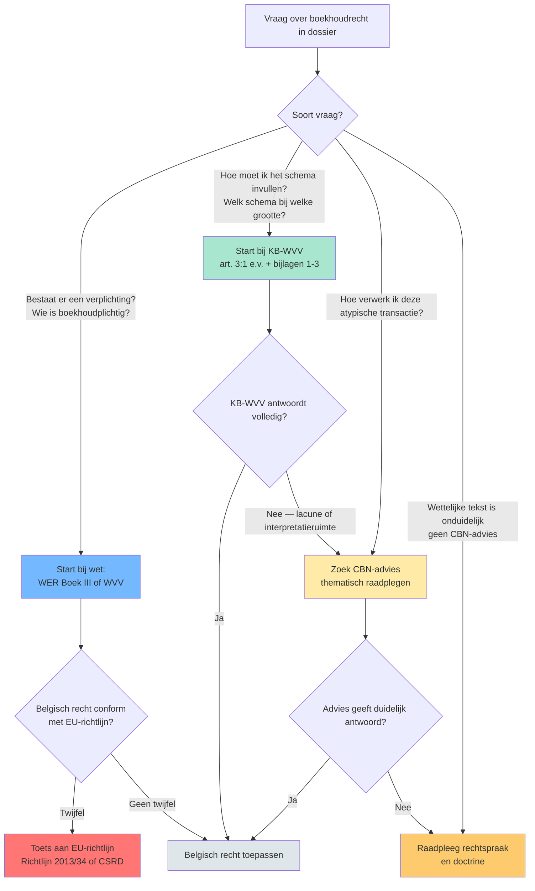
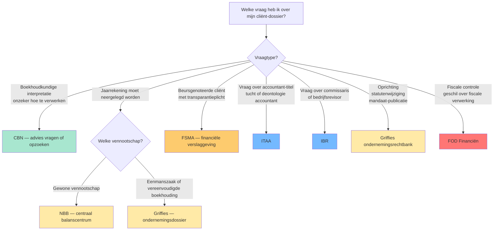
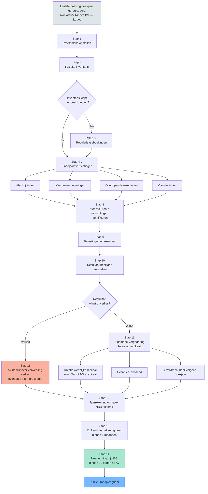
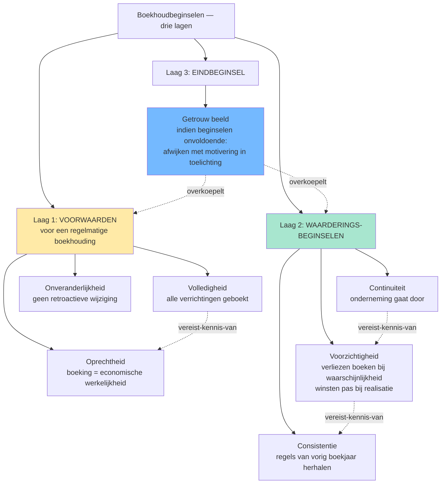

> [!warning]- Open beslissingen
> De volgende gaps zijn nog open voor dit programmaonderdeel — inhoud kan onvolledig zijn:
> - `edges.target-ontbreekt` op `getrouw-beeld-jaarrekening`: edges[0].target = 'materieel-belang-financiele-analyse' maar dat record bestaat niet in records/. He…
> - `records.overlappend-fenomeen` op `getrouw-beeld-jaarrekening`: Twee records voor hetzelfde fenomeen 'getrouw beeld van de jaarrekening' (cross-PO duplicate): 'getr…
> - `records.overlappend-fenomeen` op `jaarverslag`: jaarverslag (PO 1.2-record, node_type begrip, WVV art. 3:32) en bestuursverslag (PO 1.3-record, node…
> - `records.overlappend-fenomeen` op `bestuursverslag`: Spiegel-entry van jaarverslag-overlap. Bestuursverslag heeft de procedure-stappen + corporate-govern…
> - `vergelijkingsparen.ontbreekt` op `fsma`: FSMA wordt in de praktijk vaak verward met NBB (Nationale Bank van België) — beide zijn financiële t…
> - `edges.geen-types` op `fsma`: FSMA heeft slechts één edge (vereist-kennis-van naar europees-boekhoudrecht). Mist edges naar nation…
> - `in_praktijk.ontbreekt` op `fsma`: FSMA heeft geen in_praktijk-blok. Voor een autoriteit-record is dit cruciaal: stagiair moet weten 'w…
> - `vergelijkingsparen.ontbreekt` op `itaa`: ITAA (accountants) ↔ IBR (revisoren) is een klassieke verwarring voor stagiairs. ITAA-record heeft é…
> - `in_praktijk.ontbreekt` op `ibr`: IBR-record (Instituut van Bedrijfsrevisoren) mist in_praktijk én valkuilen én vergelijkingsparen. Du…
> - `in_praktijk.ontbreekt` op `fod-financien-boekhoudrecht`: FOD Financiën-record (boekhoudrecht-perspectief) mist in_praktijk + valkuilen + vergelijkingsparen. …
> - `in_praktijk.ontbreekt` op `griffies-ondernemingsrechtbank`: Griffies-record mist in_praktijk, valkuilen en vergelijkingsparen. Voor stagiair: wanneer neerleggen…
> - `in_praktijk.ontbreekt` op `public-interest-entity`: PIE-record mist in_praktijk én valkuilen. Voor een centraal begrip (definieert toepassingsgebied van…
> - `in_praktijk.ontbreekt` op `kleine-vennootschap`: kleine-vennootschap mist in_praktijk + valkuilen + vergelijkingsparen. Centrale concept met directe …
> - `in_praktijk.ontbreekt` op `oprechtheidsbeginsel`: oprechtheidsbeginsel mist in_praktijk én valkuilen. Centraal beginsel (substance-over-form). Zustert…
> - `in_praktijk.ontbreekt` op `hulpdagboeken`: hulpdagboeken-record mist in_praktijk + valkuilen. Voor stagiair: welke hulpdagboeken zijn standaard…
> - `records.overlappend-fenomeen` op `aanvullende-boekhoudbeginselen`: aanvullende-boekhoudbeginselen aggregeert 4 bestaande records (voorzichtigheidsbeginsel, oprechtheid…
> - `edges.target-ontbreekt` op `wetboek-economisch-recht-boek-iii`: edges[].target verwijst naar 'dubbele-boekhouding' — bestaat niet als record. Canonieke slug is 'dub…
> - `edges.target-ontbreekt` op `boekhoudplichtige-onderneming`: edges[].target wijst naar 'dubbele-boekhouding' — bestaat niet (gebruik 'dubbel-boekhouden').…
> - `edges.target-ontbreekt` op `continuiteitsbeginsel`: edges[].target verwijst naar 'boekhoudkundige-beginselen', 'vereffening' en 'waarderingsregels' — ge…
> - `edges.target-ontbreekt` op `voorzichtigheidsbeginsel`: edges[].target naar 'boekhoudkundige-beginselen', 'overeenstemmingsprincipe' en 'waarderingsregels' …
> - `edges.target-ontbreekt` op `getrouw-beeld`: edges[].target naar 'boekhoudkundige-beginselen' — bestaat niet. Canoniek: 'aanvullende-boekhoudbegi…
> - `edges.target-ontbreekt` op `onveranderlijkheid-boekingen`: edges[].target verwijst naar 'boekhoudkundige-beginselen' — bestaat niet. Vervang door 'aanvullende-…
> - `edges.target-ontbreekt` op `commissaris`: edges[].target naar 'accountant-itaa' — bestaat niet als record. Canoniek: 'itaa' (actor-record). De…
> - `edges.target-ontbreekt` op `itaa`: edges[].target naar 'itaa-normen' — bestaat niet als record. Optie 1: schrap edge. Optie 2: maak rec…
> - `edges.target-ontbreekt` op `europees-boekhoudrecht`: edges[].target naar 'ifrs-toepassingsgebied' — bestaat niet. Mogelijk records.ontbreekt-gap voor PO …
> - `edges.target-ontbreekt` op `inventaris`: edges[].target naar 'jaarafsluiting' en 'waarderingsregels' — beide bestaan niet als record. 'jaaraf…
> - `edges.target-ontbreekt` op `overlopende-rekeningen`: edges[].target naar 'jaarafsluiting' (= eindejaarsverrichtingen) en 'matching-principe' (bestaat nie…
> - `edges.target-ontbreekt` op `niet-in-balans-opgenomen-rechten-verplichtingen`: edges[].target naar 'voorzieningen-voor-risicos-en-kosten' — bestaat niet. Canoniek: 'voorzieningen'…
> - `edges.target-ontbreekt` op `oprichtingskosten`: edges[].target naar 'obligatielening' — bestaat niet. Mogelijk records.ontbreekt-gap voor PO 1.1 (op…
> - `edges.target-ontbreekt` op `dagboek`: edges[].target naar 'verantwoordingsstuk' — bestaat niet als record. Centraal begrip in dubbel-boekh…
> - `edges.target-ontbreekt` op `regelmatige-boekhouding`: edges[].target naar 'verantwoordingsstuk' — bestaat niet. Zelfde gap als dagboek (records.ontbreekt-…
> - `edges.target-ontbreekt` op `getrouw-beeld-jaarrekening`: edges[].target naar 'materieel-belang-financiele-analyse' — bestaat niet. Mogelijk records.ontbreekt…
> - `records.overlappend-fenomeen` op `getrouw-beeld`: Sterke conceptuele overlap met `getrouw-beeld-jaarrekening` (parallelle PO 1.2-run): beide beschrijv…
> - `vergelijkingsparen.target-ontbreekt` op `voorzichtigheidsbeginsel`: vergelijkingsparen[].vergelijking_met = `overeenstemmingsprincipe` wijst naar niet-bestaand record.…

## Leesgids

De minicursus volgt de logica van het boekhoudrecht zelf: eerst de rechtsbronnen en autoriteiten, daarna de verplichtingen die eruit voortvloeien. Thematische clusters wisselen af met synthese-fiches die het cluster vergelijkend ordenen en competentie-fiches die de redenering tot één toepasbare stappenreeks samenballen. Lees in volgorde — elk hoofdstuk bouwt voort op de juridische kaart die ervóór is opgespannen.

## Waarom dit programmaonderdeel telt

Boekhoudrecht is een wettelijke kwalificatie-oefening: het bepaalt wie moet boekhouden, volgens welke regels, met welke uitstraling naar derden. Alles wat een accountant in de praktijk doet — een schema kiezen, een waardering verdedigen, een commissaris voorstellen, een neerlegging uitvoeren — vertrekt bij een rechtsbron en eindigt bij een autoriteit. Wie de gelaagdheid van die regelgeving niet doorziet, vergelijkt drempels zonder te weten wélke bron primeert. Het examen toetst precies dit redeneervermogen: of je bij een dossier de juiste laag aanspreekt en de bindende kracht van elke bron juist inschat. Het redeneerkader uit dit programmaonderdeel keert in elk volgend PO terug.

## Waarom een boekhoudrecht? Regelmatige en getrouwe boekhouding als spil

Een boekhouding is in België nooit louter intern: zodra een onderneming boekhoudplichtig is, dient ze ook als wettelijk informatie-instrument voor derden. Twee begrippen dragen dat dubbele gebruik: "regelmatige boekhouding" (formeel correct) en "getrouw beeld" (inhoudelijk waarheidsgetrouw). De rest van dit programmaonderdeel is een afdaling van wet naar advies naar rechtspraak om die twee begrippen concreet te maken.

## Rechtsbronnen-piramide van het Belgisch boekhoudrecht

Het boekhoudrecht is gelaagd — geen monoliet. De volgende kaart toont de vijf bronnen die de stagiair in elke casus zal hergebruiken, telkens met hun bindende kracht en hun typische rol. Onthoud deze piramide vroeg: alle latere hoofdstukken verwijzen ernaar terug.



**Kerninzichten**:
- De wettelijke piramide is geen mechanisch toepassings-algoritme maar een redeneer-as. Bij Rotex Roeselare NV met een twijfelgeval over leasing-verwerking: eerst KB-WVV art. 3:65 (financiële versus operationele lease), dan CBN-advies 2018/04 voor IFRS-stijl-bepaling, pas dan rechtspraak. Wie omgekeerd start, kan een hardere wettelijke regel missen.
- EU-richtlijnen zijn niet rechtstreeks toepasselijk &mdash; ze worden door wet/KB omgezet. EU-verordeningen (IAS-Verordening 1606/2002) wel. Het examen kan vragen 'waarom moet beursgenoteerde Solaris Sint-Truiden NV IFRS toepassen?' &mdash; antwoord: directe werking IAS-Verordening, niet via WVV.
- CBN-adviezen hebben geen formele bindende kracht maar in de praktijk worden ze door rechters en fiscus consistent gevolgd. Een accountant die afwijkt van een CBN-advies moet uitleggen waarom &mdash; de bewijslast verschuift. Voor examen-redenering: aanhalen van een CBN-advies is zelden fout, ook al is het niet 'verplicht'.
- Rechtspraak heeft in België geen precedenten-werking (geen stare decisis). Een Cassatie-arrest is gezaghebbend, geen wet. Maar voor identieke feitencomplexen geldt het praktisch wel: ondernemers en accountants stemmen hun gedrag erop af. Op examen: 'is volgens rechtspraak X verplicht?' &mdash; vermijd 'verplicht', zeg 'volgens rechtspraak verwacht'.
- Cijferzakboekje (drempels, bedragen) hoort niet in de piramide. Het is een hulpmiddel dat de WVV/KB-WVV-bedragen samenbrengt. Bij examen: gebruik altijd de cijfers uit ITAA-LEX en het Cijferzakboekje &mdash; nooit cijfers uit oudere handboeken (drempels werden in 2023-2024 met circa 25 % verhoogd door EU-delegated act).

[[rechtsbronnen-boekhoudrecht-piramide|→ Volledige synthese-fiche]]

## Identificeren van de toepasselijke rechtsbron bij een vraag uit het boekhoudrecht

Eens de piramide gekend is, blijft de vraag praktisch: bij welke laag begin je in een concreet dossier? Deze competentie zet die afdaling om in een gestructureerde stappenreeks, zodat je niet bij rechtspraak begint waar de wet al klaar antwoord geeft.

[[competenties/identificeren-rechtsbron-boekhoudrecht|→ Volledige procedure]]

## Wie controleert wat? — Het autoriteiten-landschap van het Belgisch boekhoudrecht

Naast de bronnen-piramide bestaat er een parallelle actor-piramide: wie maakt regels, wie houdt toezicht, wie controleert, wie publiceert, wie taxeert. De volgende kaart koppelt elke autoriteit aan de laag van de piramide waarin ze handelt — zodat je per casus weet bij welk loket aan te kloppen.



**Kerninzichten**:
- ITAA en IBR zijn niet uitwisselbaar. ITAA reglementeert accountants (kunnen contractuele KMO-controle uitvoeren); IBR reglementeert bedrijfsrevisoren (kunnen wettelijke commissarisopdracht uitvoeren). Examenvalkuil: 'mag een ITAA-accountant commissaris zijn bij Rotex Roeselare NV (groot)?' &mdash; antwoord nee, dat is voorbehouden aan IBR-revisor.
- NBB en FSMA delen het 'Twin Peaks'-toezichtmodel maar met verschillende dimensies. NBB = prudentieel/macroprudentieel (gezondheid van financiële instellingen). FSMA = gedrag/markttransparantie (eerlijke informatie aan beleggers). Bij Belfius BV (bank): NBB controleert kapitaaltoereikendheid; FSMA controleert hoe Belfius haar producten in de markt zet.
- Neerlegging gebeurt via twee kanalen: jaarrekeningen via NBB (centraal balanscentrum); ondernemingsdossier (oprichting, statuten, benoemingen) via de griffies van de ondernemingsrechtbank. Verwar deze niet &mdash; dezelfde Meubelzaak Mertens BV legt elk jaar bij NBB neer maar ook bij de griffie bij statutenwijziging.
- CBN-adviezen zijn niet bindend maar gezaghebbend. Rechters en fiscus volgen ze in praktijk. Bij examenvraag 'wat is de boekhoudkundige verwerking van X?' is een CBN-advies vaak de beste bron &mdash; ook als de WVV/KB-WVV-tekst zwijgt of dubbelzinnig is.
- Bij een beursgenoteerde groep zijn doorgaans drie autoriteiten tegelijk betrokken: FSMA (transparantie), NBB (neerlegging jaarrekening + prudentieel indien financiële instelling), IBR-revisor (commissaris). Voor een gewone KMO is meestal alleen NBB + (eventueel) ITAA-accountant relevant.

[[autoriteiten-boekhoudrecht-landschap|→ Volledige synthese-fiche]]

## Identificeren van de juiste administratieve autoriteit bij een boekhoudrechtelijke vraag

Wie de juiste rechtsbron heeft gevonden, moet vervolgens weten welke autoriteit dat antwoord oplegt, controleert of registreert. Deze competentie maakt die loket-keuze expliciet, op basis van het vraagtype en het profiel van de cliënt-vennootschap.

[[competenties/identificeren-administratieve-autoriteit|→ Volledige procedure]]

## Grondslag van de boekhoudplicht: wie moet boekhouden en hoe?

Nu de juridische kaart vastligt, kantelt de minicursus naar de inhoud: welke ondernemingen vallen onder de boekhoudplicht en welke boeken en procedures legt de wet hen op. Dit cluster verzamelt de bouwstenen — boekhoudplichtige onderneming, dubbel versus vereenvoudigd boekhouden, dagboek en inventaris — die je in latere competenties gaat combineren.

- [[boekhoudplichtige-onderneming|Boekhoudplichtige onderneming]] · `begrip`
- [[regelmatige-boekhouding|Regelmatige boekhouding]] · `fenomeen`
- [[dubbel-boekhouden|Dubbel boekhouden]] · `methode`
- [[vereenvoudigde-boekhouding|Vereenvoudigde boekhouding]] · `begrip`
- [[minimum-algemeen-rekeningenstelsel|Minimum Algemeen Rekeningenstelsel (MAR)]] · `begrip`
- [[dagboek|Dagboek]] · `begrip`
- [[hulpdagboeken|Hulpdagboeken]] · `begrip`
- [[inventaris|Inventaris]] · `procedure`
- [[proef-en-saldibalans|Proef- en saldibalans]] · `begrip`
- [[eindejaarsverrichtingen|Eindejaarsverrichtingen (jaarafsluiting)]] · `procedure`
- [[onveranderlijkheid-boekingen|Onveranderlijkheid van de boekingen]] · `beginsel`
- [[bewaartermijn-boekhouding|Bewaartermijn van boeken en verantwoordingsstukken]] · `regel`

## Boekjaar afsluiten &mdash; van proefbalans tot neerlegging

De afzonderlijke boeken en verrichtingen uit het vorige cluster volgen elkaar in een wettelijk geketende volgorde op tot het boekjaar formeel afgesloten is. De volgende checklist zet die volgorde van proefbalans tot neerlegging in één procedureel overzicht.



**Kerninzichten**:
- De volgorde is bindend: pas na de eindejaarsverrichtingen (stap 4-9) kan je het resultaat van het boekjaar vaststellen (stap 10). Pas na de algemene vergadering die het resultaat bestemt (stap 11) ken je het 'overgedragen resultaat' &mdash; pas dan is de jaarrekening volledig opmaakbaar (stap 12). Een examenvraag die zegt 'jaarrekening klaar, AV moet nog komen' bevat dus een logische fout: de jaarrekening kan niet 'klaar' zijn zonder AV-beslissing.
- De timing is wettelijk geketend: AV binnen 6 maanden na boekjaareinde (WVV art. 3:1 §1), neerlegging binnen 30 dagen na AV (WVV art. 3:10) en uiterlijk 7 maanden na boekjaareinde. Voor [[Naaiatelier Ninove BV]] met boekjaar dat eindigt op 31 december betekent dit: AV ten laatste 30 juni, neerlegging ten laatste 31 juli. Boete-risico: laattijdige neerlegging is een veelvoorkomende cliënt-vraag.
- Drie van de tien verplichte boekingen volgen direct uit de waarderingsbeginselen: afschrijvingen (consistentie), waardeverminderingen (voorzichtigheid), voorzieningen (voorzichtigheid). Wie de beginselen kent, kan deze stappen niet vergeten. Wie ze opvat als 'extra werk', vergeet er typisch een &mdash; bijvoorbeeld de waardeverminderingen op vorderingen.
- De wettelijke reserve (stap 11) ontstaat bij de resultaatverwerking, niet bij de jaarrekening-opmaak. Sequentieel: AV beslist welk percentage naar wettelijke reserve gaat (min. 5% van de winst, tot de wettelijke reserve 10% van het kapitaal bereikt). Pas dan staat het bedrag op rekening 130; pas dan past het in de jaarrekening die de AV daarna goedkeurt.

[[boekjaar-eindprocedure-checklist|→ Volledige synthese-fiche]]

## Kwalificeren of een onderneming boekhoudplichtig is en welk type boekhouding zij moet voeren

De wettelijke kwalificatie als "boekhoudplichtige onderneming" loopt langs een reeks beslispunten: ondernemingshoedanigheid, rechtsvorm, omzetdrempel, type boekhouding. Deze competentie zet die toets om in één stappenreeks die je per cliënt doorloopt.

[[competenties/kwalificeren-boekhoudplichtige-onderneming|→ Volledige procedure]]

## Kwalificeren welk boekhoud- en jaarrekeningregime van toepassing is op een VZW, IVZW of stichting

Verenigingen en stichtingen volgen een eigen regelgevend spoor binnen het WVV, met andere drempels en eigen jaarrekeningschema's. Deze competentie maakt expliciet wanneer een vereenvoudigd regime volstaat en wanneer het vennootschapsregime van toepassing wordt.

[[competenties/kwalificeren-jaarrekeningregime-vzw-stichting|→ Volledige procedure]]

## Vennootschapsgrootte-cascade: micro &mdash; klein &mdash; groot

Zodra de boekhoudplicht vaststaat, kantelt de regelgeving naar een tweede toets: hoe groot is de vennootschap? De volgende cascade toont in één schema hoe omzet, balanstotaal en personeelsbezetting samen het jaarrekeningschema, de commissaris-verplichting en de openbaarmakingsvorm vastleggen.

```mermaid
flowchart TD
  A[Cliënt-vennootschap &mdash; welke verplichtingen?] --> B[Verzamel 3 cijfers van afgesloten boekjaar:<br/>VTE &mdash; omzet excl. BTW &mdash; balanstotaal]
  B --> C{Behoort vennootschap tot groep?}
  C -->|Ja| D[Tel op geconsolideerde basis<br/>verbondenheid trekt cijfers op]
  C -->|Nee| E[Gebruik enkelvoudige cijfers]
  D --> F{Boven kleine-drempel<br/>op meer dan 1 criterium?}
  E --> F
  F -->|Ja| G[Groot: volledig schema<br/>jaarverslag + commissaris + sociale balans]
  F -->|Nee &mdash; max 1 criterium boven| H{Onder microdrempels<br/>op meer dan 1 criterium?}
  H -->|Ja én geen moeder/dochter| I[Micro: microschema<br/>geen jaarverslag<br/>geen commissaris]
  H -->|Ja maar moeder of dochter| J[Klein: verkort schema<br/>geen jaarverslag<br/>geen commissaris tenzij groep groot]
  H -->|Nee| J
  G --> K{Beursgenoteerd<br/>of grote PIE?}
  K -->|Ja| L[Bijkomend: CSRD-duurzaamheidsrapport<br/>via [[fsma\|FSMA]] toezicht]
  K -->|Nee| M[Enkel WVV-verplichtingen<br/>via [[nationale-bank-belgie\|NBB]] neerlegging]
  style I fill:#a8e6cf
  style J fill:#ffeaa7
  style G fill:#fdcb6e
  style L fill:#ff7675
  style M fill:#dfe6e9
```

**Kerninzichten**:
- Eén grootteklassering = zes parallelle verplichtingen. Stagiairs maken vaak de fout schema te kiezen en de cascade te vergeten. Voor Meubelzaak Mertens BV (klein) volgt uit de classering: verkort schema + geen jaarverslag + geen commissaris + verplichte sociale balans + neerlegging NBB binnen 7 maand. Vergeet je commissaris-vrijstelling, dan misbillijk je de cliënt met onnodige kosten.
- Microvennootschap heeft een extra voorwaarde die klein-vennootschap niet heeft: GEEN moeder of dochter zijn. Oprichtingen Oostende BV (omzet € 400K, 4 VTE) is micro &mdash; maar als ze morgen 60% van Industria Antwerpen NV verwerft, kantelt ze automatisch naar klein. De groottecascade is dynamisch.
- Twee opeenvolgende boekjaren-regel beschermt tegen heen-en-weer-schommelen. Eénmalige overschrijding kantelt status niet. Bij Brugse Brouwerij BV met uitschieter omzet in 2024: pas vanaf 2026 kantelen als 2025 ook overschrijdt. Examenvraag-camouflage: 'in 2024 had vennootschap X 55 VTE, dus is ze groot' &mdash; mis, je moet 2023 erbij hebben.
- Kleine groep beïnvloedt kleine vennootschap. Een kleine dochter van een grote groep wordt voor jaarrekening behandeld als groot (consolidatie-perspectief: WVV art. 1:24 § 5). Aurelia Holding NV (klein op zich) met 4 dochters die samen 60 VTE en € 18M omzet hebben &mdash; wordt voor jaarrekening grote vennootschap. Dit is de meest gemiste examen-valkuil.
- Onderscheid [[groottecriteria-jaarrekening\|groottecriteria-jaarrekening]] (WVV art. 1:24-1:25) en [[groottecriteria-consolidatie\|groottecriteria-consolidatie]] (WVV art. 1:26). Eerste bepaalt schema en cascade-verplichtingen van enkelvoudige jaarrekening. Tweede bepaalt vrijstelling consolidatieplicht. Andere drempels, ander doel &mdash; verwar nooit.

[[vennootschapsgrootte-cascade|→ Volledige synthese-fiche]]

## Klasseren van een vennootschap als micro, klein of groot volgens de groottecriteria

De cascade hierboven toont het mechanisme; deze competentie zet het om in de concrete toets per dossier. Let op de twee-boekjaren-regel en op het groep-statuut: ze veranderen de uitkomst zonder dat de cijfers op zich verschuiven.

[[competenties/klasseren-vennootschap-naar-groottecategorie|→ Volledige procedure]]

## Bepalen welk jaarrekening-schema (volledig, verkort, micro) een vennootschap moet gebruiken

De grootteklassering bepaalt principieel het schema, maar uitzonderingen (PIE-statuut, groep-effecten, beursnotering) kunnen die principiele uitkomst overrulen. Deze competentie schikt die uitzonderingen in de juiste toets-volgorde.

[[competenties/bepalen-jaarrekeningschema|→ Volledige procedure]]

## De jaarrekening als studieobject: bestanddelen en samenstelling

De jaarrekening is meer dan een set financiële tabellen: ze is een wettelijk omschreven document met vaste bestanddelen, vereiste toelichtingen en — afhankelijk van de grootte — aanvullende verslagen. Dit cluster verzamelt de begrippen die je nodig hebt om elke bouwsteen van die statutaire jaarrekening juist te benoemen.

- [[jaarrekening-als-studieobject|Jaarrekening als studieobject van financiële analyse]] · `begrip`
- [[samenstelling-statutaire-jaarrekening|Samenstelling van de statutaire jaarrekening]] · `procedure`
- [[toelichting-jaarrekening|Toelichting bij de jaarrekening]] · `begrip`
- [[sociale-balans|Sociale balans]] · `begrip`
- [[bestuursverslag|Bestuursverslag (jaarverslag)]] · `procedure`
- [[jaarverslag|Jaarverslag]] · `begrip`
- [[klasse-0-niet-in-balans|Klasse 0 — niet in de balans opgenomen rekeningen]] · `begrip`
- [[niet-in-balans-opgenomen-rechten-verplichtingen|Niet in de balans opgenomen rechten en verplichtingen]] · `regel`

## Boekhoudbeginselen en waarderingsregels: het redeneerkader bij twijfel

Waar de wet en het KB geen pasklaar antwoord geven, bepalen de boekhoudbeginselen hoe je redeneert. Dit cluster brengt de beginselen samen met de concrete waarderingstechnieken (aanschaffingswaarde, afschrijvingen, voorzieningen) waarop ze inwerken — de twee samen vormen het redeneerkader dat je in elke twijfelcasus aanspreekt.

- [[getrouw-beeld|Getrouw beeld]] · `beginsel`
- [[getrouw-beeld-jaarrekening|Getrouw beeld van de jaarrekening]] · `beginsel`
- [[voorzichtigheidsbeginsel|Voorzichtigheidsbeginsel]] · `beginsel`
- [[continuiteitsbeginsel|Boekhoudkundig continuïteitsbeginsel (going concern)]] · `beginsel`
- [[oprechtheidsbeginsel|Oprechtheidsbeginsel (boekhouding)]] · `beginsel`
- [[consistentiebeginsel|Consistentiebeginsel]] · `beginsel`
- [[volledigheidsbeginsel|Volledigheidsbeginsel (boekhouding)]] · `beginsel`
- [[aanvullende-boekhoudbeginselen|Aanvullende boekhoudbeginselen (voorzichtigheid, oprechtheid, continuïteit, consistentie)]] · `begrip`
- [[waarderingsregels-jaarrekening|Waarderingsregels (algemeen)]] · `begrip`
- [[aanschaffingswaarde|Aanschaffingswaarde]] · `begrip`
- [[afschrijvingen|Afschrijvingen]] · `methode`
- [[waardeverminderingen|Waardeverminderingen]] · `methode`
- [[herwaarderingsmeerwaarden|Herwaarderingsmeerwaarden]] · `fenomeen`
- [[voorzieningen|Voorzieningen voor risico's en kosten]] · `fenomeen`
- [[oprichtingskosten|Oprichtingskosten]] · `fenomeen`
- [[overlopende-rekeningen|Overlopende rekeningen]] · `methode`

## Boekhoudbeginselen &mdash; overzicht

De beginselen zijn niet allemaal gelijkwaardig: enkele zijn voorwaarden voor regelmatigheid, enkele sturen de waardering, en één overkoepelt het geheel als eindtoets. Het volgende overzicht legt die drie-lagen-structuur expliciet vast vóór de toepassingscompetentie ze in een concreet vraagstuk laat samenspelen.



**Kerninzichten**:
- De zeven beginselen zijn niet allemaal gelijkwaardig: drie zijn voorwaarden om uberhaupt van een 'regelmatige' boekhouding te kunnen spreken (volledigheid, oprechtheid, onveranderlijkheid), drie sturen de waardering (continuiteit, voorzichtigheid, consistentie), en het getrouw-beeld-beginsel staat erboven als eindtoets. Stagiairs die ze op een rij zien staan zonder hierarchie missen die drie-lagen-structuur.
- Het getrouw-beeld-beginsel bevat een overrule-mechanisme: als toepassing van de andere beginselen onvoldoende is om een getrouw beeld te geven, moet je afwijken &mdash; met motivering in de toelichting (KB WVV art. 3:1 derde lid). Dit is geen vrijbrief: het bestuur moet uitdrukkelijk vaststellen dat de standaardregels onvoldoende zijn.
- Voorzichtigheid en getrouw-beeld kunnen op gespannen voet staan: pure voorzichtigheid leidt tot stille reserves (winsten onderschat, verliezen overschat), wat het getrouwe beeld verstoort. De moderne lezing (Richtlijn 2013/34/EU art. 6 §1.c): voorzichtigheid betekent geen overdreven onderwaardering, alleen waarschijnlijke verliezen + risico's opnemen.
- De onveranderlijkheid van boekingen is een formele eis (geen Tipp-Ex, geen overschrijven) maar geen verbod op correcties. Een verkeerde boeking corrigeer je via een tegenboeking met datum en verwijzing &mdash; de oorspronkelijke fout blijft zichtbaar in de audit-trail.
- Volledigheid omvat ook de rechten en verplichtingen buiten de balans (klasse 0): garanties verleend door [[Meubelzaak Mertens BV]], leaseverplichtingen, borgstellingen, pensioenverplichtingen. Wie deze vergeet schendt het volledigheidsbeginsel zonder dat de balans uit evenwicht raakt &mdash; daarom is het een silent error die makkelijk gemist wordt op examens.

[[boekhoudbeginselen-overzicht|→ Volledige synthese-fiche]]

## Toepassen van de boekhoudbeginselen op een concreet waarderingsvraagstuk

Een examenvraag noemt zelden het beginsel met naam; je moet zelf herkennen welk beginsel domineert bij een gegeven waarderingsvraag. Deze competentie leert je dat herkennen en motiveren in een vaste argumentatie-volgorde.

[[competenties/toepassen-boekhoudbeginselen-op-waarderingsvraagstuk|→ Volledige procedure]]

## Toezicht en openbaarmaking: de externe controle-keten

Wanneer de jaarrekening intern is opgemaakt, kantelt het dossier naar de externe controle-keten: een wettelijke commissaris die zekerheid verschaft, een PIE-statuut dat bijkomende eisen oplegt, en een openbaarmaking die het document publiek raadpleegbaar maakt. De drie begrippen hieronder vormen samen die laatste schakel van het boekhoudrechtelijk traject.

- [[commissaris|Commissaris]] · `actor`
- [[public-interest-entity|Public Interest Entity (PIE)]] · `begrip`
- [[openbaarmaking-jaarrekening|Openbaarmaking van de jaarrekening]] · `procedure`

## Beoordelen of een vennootschap een commissaris moet benoemen en welk regime van toepassing is

De commissaris-verplichting volgt principieel uit de grootteklassering, maar PIE-statuut, groep-effecten en sector-regelgeving kunnen ze ook in andere richting forceren. Deze competentie schikt die toetsen tot één beslis-volgorde die je per cliënt-dossier doorloopt.

[[competenties/beoordelen-commissaris-verplichting|→ Volledige procedure]]

## Uitvoeren van de openbaarmaking van de jaarrekening bij de Nationale Bank

De openbaarmaking is een wettelijke procedure met eigen termijnen, schema-keuzes en aansprakelijkheidsrisico's. Deze competentie loopt de neerlegging stap voor stap af, zodat je zowel de tijdsketen als de keuze tussen schema's beheerst.

[[competenties/uitvoeren-openbaarmaking-jaarrekening|→ Volledige procedure]]

## Reflectie: een levend rechtsdomein — CBN-adviezen in de praktijk

WER Boek III en het WVV zijn stabiele kaders, maar het boekhoudrecht evolueert voortdurend langs drie randen: CBN-adviezen die nieuwe transacties duiden, Europese richtlijnen die rapporteringsplichten uitbreiden, en cassatierechtspraak die getrouw-beeld en substance-over-form verder afbakent. Voor de stagiair betekent dit dat een CBN-advies geen wet is, maar bij twistgeval wél het eerste argumentatieve anker. Dezelfde rechtsbronnen-piramide keert terug in PO 1.3 (analyse) en PO 1.4 (consolidatie): de begrippen wisselen, het redeneerkader blijft.


## Synthese-stappenplan

Elke boekhoudrechtelijke casus volgt dezelfde redeneer-as. Bepaal eerst het vraagtype: kwalificatie, waardering of procedure. Daal vervolgens af in de rechtsbronnen-piramide — wet, uitvoerings-KB, CBN-advies bij lacune, rechtspraak pas als de wet zwijgt. Identificeer parallel de relevante autoriteit. Pas pas dan de grootteklassering toe en lees daaruit de parallelle gevolgen af (schema, jaarverslag, commissaris, openbaarmaking). Bij waarderingstwijfel toets je tegen de boekhoudbeginselen, met getrouw beeld als eindtoets. Sluit af met een expliciete bronvermelding: welke laag draagt de conclusie, welke autoriteit handhaaft ze.

## Cheatsheet

### Kritische drempelwaarden

| Concept | Naam | Waarde | Eenheid | Gevolg |
|---|---|---|---|---|
| [[bewaartermijn-boekhouding]] | Bewaartermijn boeken + verantwoordingsstukken | 7 jaar | vanaf 1 januari na afsluitingsdatum boekjaar | Voorlegging mogelijk bij fiscale controle, accounting-audit, civiel of strafrechtelijk onderzoek |
| [[bewaartermijn-boekhouding]] | Bewaartermijn stukken zonder bewijswaarde t.a.v. derden | 3 jaar | vanaf 1 januari na afsluitingsdatum boekjaar | Beperkter regime voor interne stukken die geen externe bewijskracht hebben |
| [[groottecriteria-jaarrekening]] | Drempels kleine vennootschap (na update 2024) | Personeelsbezetting ≤ 50; jaaromzet excl. BTW ≤ € 11.250.000; balanstotaal ≤ € 6.000.000 | drie criteria — max 1 mag overschreden worden | Mag verkort schema gebruiken; geen jaarverslag verplicht; geen commissaris verplicht (tenzij ze deel uitmaakt van een gr… |
| [[groottecriteria-jaarrekening]] | Drempels microvennootschap | Personeelsbezetting ≤ 10; jaaromzet excl. BTW ≤ € 900.000; balanstotaal ≤ € 450.000 | drie criteria — max 1 mag overschreden worden | Mag microschema gebruiken (kleinste schema) |
| [[vereenvoudigde-boekhouding]] | Omzetdrempel voor vereenvoudigde boekhouding | € 500.000 | jaaromzet excl. BTW | Natuurlijke personen, vennootschappen onder firma (VOF) en gewone commanditaire vennootschappen (GCV) met een omzet onde… |

### Vergelijkingsparen-matrix

| Concept | Verwarrend met | Trigger |
|---|---|---|
| [[afschrijvingen]] | [[waardeverminderingen]] | Examen: 'gebouw' (gebruiksduur beperkt) → afschrijving. 'Terrein' (onbeperkt) → waardevermindering. 'Voorraad' (vlottend actief) → waardevermindering. |
| [[cbn-adviezen]] | [[rechtspraak-boekhoudrecht]] | Examenvraag 'welke bron bindt de partijen?' → rechtspraak (in de zaak). 'Wat zegt de doctrine?' → CBN-advies + andere rechtsleer. |
| [[commissaris]] | [[accountant-itaa]] | Wettelijke controle grote NV → commissaris. KMO-boekhouding en advies → accountant. |
| [[dubbel-boekhouden]] | [[vereenvoudigde-boekhouding]] | Examenvraag: kleine eenmanszaak met omzet onder € 500.000 (WER drempel) — mag vereenvoudigd, hoeft geen dubbel boekhouden. |
| [[europees-boekhoudrecht]] | [[belgisch-boekhoudrecht]] | Examenvraag over 'welke bron primeert' bij conflict tussen EU-richtlijn en Belgisch KB: → EU-recht na directe werking of richtlijn-conforme interpretatie. |
| [[getrouw-beeld-jaarrekening]] | [[voorzichtigheidsbeginsel]] | Bij een examenvraag 'welk beginsel?' — getrouw beeld als algemeen doel; voorzichtigheid als specifieke voorschrift om risico's volledig op te nemen. |
| [[groottecriteria-jaarrekening]] | [[groottecriteria-consolidatie]] | Examen 'welk schema moet X gebruiken?' → 1:24/1:25. 'Mag groep X afzien van consolideren?' → 1:26. |
| [[herwaarderingsmeerwaarden]] | [[aanschaffingswaarde]] | Examen: 'aanpassen waarde van een terrein boven aankoopprijs' → herwaardering (mits voorwaarden), niet aanschaffingswaarde wijzigen. |
| [[itaa]] | [[ibr]] | Examenvraag 'wie controleert de jaarrekening van een grote NV?' → commissaris-revisor → IBR. 'Wie helpt een KMO met boekhouding en advies?' → accountant → ITAA. |
| [[jaarverslag]] | [[geconsolideerd-jaarverslag]] | Vraag over individuele vennootschap → jaarverslag (3:32). Vraag over groep → geconsolideerd jaarverslag (3:34). |
| [[kleine-vennootschap]] | [[microvennootschap]] | Examen: omzet € 500K → check micro-drempels eerst; als ook personeel ≤ 10 én balans ≤ € 450K én niet moeder/dochter → micro. Zo niet → klein. |
| [[microvennootschap]] | [[kleine-vennootschap]] | Examen: 'cijfers onder klein-drempels' → ook check micro-drempels + groep-statuut. |
| [[niet-in-balans-opgenomen-rechten-verplichtingen]] | [[voorzieningen-voor-risicos-en-kosten]] | Examenvraag 'voorziening of niet in balans?': becijferbaar + waarschijnlijk = voorziening (balans); onzeker of onbecijferbaar = niet in balans (toelichting). |
| [[oprechtheidsbeginsel]] | [[voorzichtigheidsbeginsel]] | Bij waardering twijfelt iemand → voorzichtig → mag niet zo ver gaan dat het beeld vertekend wordt → oprechtheid bepaalt de bovengrens van voorzichtigheid. |
| [[oprichtingskosten]] | [[immateriele-vaste-activa]] | Examen: 'patentaankoop voor € 80.000' → immaterieel vast actief (rubr. 21), NIET oprichtingskosten. |
| [[public-interest-entity]] | [[groottecriteria-jaarrekening]] | Vraag 'verkort schema toegestaan?' → eerst PIE-test (zo ja: nooit verkort) → dan groottetest. |
| [[vereenvoudigde-boekhouding]] | [[dubbel-boekhouden]] | Examen: 'eenmanszaak met omzet € 320.000' → vereenvoudigd toegelaten. 'BV met omzet € 200.000' → dubbel verplicht. |
| [[voorzichtigheidsbeginsel]] | [[overeenstemmingsprincipe]] | Examen: 'mogen we de winst op een nog niet voltooid contract al boeken als de bijbehorende kosten al gemaakt zijn?' — nee, voorzichtigheid/realisatie primeert. |
| [[voorzieningen]] | [[waardeverminderingen]] | Examen: 'wij verwachten een verlies op een rechtsgeding' → voorziening. 'klant zal vermoedelijk niet betalen' → waardevermindering. |
| [[voorzieningen]] | [[schulden]] | Examen: 'betwiste belasting € 18.000' → voorziening 161. 'aanvaarde belasting € 18.000' → schuld 45. |
| [[waarderingsregels-jaarrekening]] | [[aanschaffingswaarde]] | Vraag 'wat is aanschaffingswaarde precies?' → aanschaffingswaarde-record. Vraag 'welke regel pas ik toe in scenario X?' → waarderingsregels-record. |
| [[waardeverminderingen]] | [[afschrijvingen]] | Examen: 'voorraad goederen waarvan marktprijs daalt' → waardevermindering (vlottend actief). 'machine waarvan technische ontwaarding sneller dan voorzien' → niet-recurrente afschrijving (beperkte gebruiksduur). |
| [[waardeverminderingen]] | [[voorzieningen]] | Examen: 'wij verwachten een vonnis tegen ons van € 80.000' → voorziening. 'klant zal vermoedelijk niet betalen' → waardevermindering. |
| [[wetboek-vennootschappen-verenigingen]] | [[kb-wvv-uitvoering]] | Examenvraag 'welk schema?' → eerst WVV (Boek 3 zegt 'drie schema's: volledig/verkort/micro'), dan KB-WVV (de exacte rubrieken). |
| [[wetboek-vennootschappen-verenigingen]] | [[wetboek-economisch-recht-boek-iii]] | Vraag over een eenmanszaak (Praktijk Persenaire) → WER. Vraag over een NV of vzw → WVV. |


## Examenfocus

Examenvragen op PO 1.2 toetsen drie denkpatronen meer dan feitenkennis. Eerste: bronnen-identificatie — welke laag van de piramide draagt de conclusie, en hoe verhoudt een CBN-advies zich tot een wettelijke regel die zwijgt of dubbelzinnig is. Tweede: kwalificatie-cascade — eerst boekhoudplichtig, dan grootte, pas dan schema en commissaris. Derde: beginselen-redenering — bij waarderingsvragen selecteer en motiveer je het juiste beginsel tegenover getrouw beeld. Camouflages spelen vaak op deze patronen: een cijfer net boven een drempel, een groep-statuut dat de kleine-toets kantelt, of rechtspraak die wordt aangeroepen terwijl het KB-WVV al antwoord geeft.

<!-- TODO: examenvragen via classify_vragen_naar_programmaonderdelen.py -->

## Competentie-index

<div class="two-column-list">

- [[competenties/beoordelen-commissaris-verplichting|Beoordelen of een vennootschap een commissaris moet benoemen en welk regime van toepassing is]]
- [[competenties/bepalen-jaarrekeningschema|Bepalen welk jaarrekening-schema (volledig, verkort, micro) een vennootschap moet gebruiken]]
- [[competenties/identificeren-administratieve-autoriteit|Identificeren van de juiste administratieve autoriteit bij een boekhoudrechtelijke vraag]]
- [[competenties/identificeren-rechtsbron-boekhoudrecht|Identificeren van de toepasselijke rechtsbron bij een vraag uit het boekhoudrecht]]
- [[competenties/klasseren-vennootschap-naar-groottecategorie|Klasseren van een vennootschap als micro, klein of groot volgens de groottecriteria]]
- [[competenties/kwalificeren-boekhoudplichtige-onderneming|Kwalificeren of een onderneming boekhoudplichtig is en welk type boekhouding zij moet voeren]]
- [[competenties/kwalificeren-jaarrekeningregime-vzw-stichting|Kwalificeren welk boekhoud- en jaarrekeningregime van toepassing is op een VZW, IVZW of stichting]]
- [[competenties/toepassen-boekhoudbeginselen-op-waarderingsvraagstuk|Toepassen van de boekhoudbeginselen op een concreet waarderingsvraagstuk]]
- [[competenties/uitvoeren-openbaarmaking-jaarrekening|Uitvoeren van de openbaarmaking van de jaarrekening bij de Nationale Bank]]

</div>

## Concept-index

<div class="two-column-list">

- [[aanschaffingswaarde|Aanschaffingswaarde]] · `begrip`
- [[aanvullende-boekhoudbeginselen|Aanvullende boekhoudbeginselen (voorzichtigheid, oprechtheid, continuïteit, consistentie)]] · `begrip`
- [[afschrijvingen|Afschrijvingen]] · `methode`
- [[belgisch-boekhoudrecht|Belgisch boekhoudrecht]] · `begrip`
- [[bestuursverslag|Bestuursverslag (jaarverslag)]] · `procedure`
- [[bewaartermijn-boekhouding|Bewaartermijn van boeken en verantwoordingsstukken]] · `regel`
- [[boekhoudbeginselen-overzicht|Boekhoudbeginselen &mdash; overzicht]] · `synthese`
- [[continuiteitsbeginsel|Boekhoudkundig continuïteitsbeginsel (going concern)]] · `beginsel`
- [[boekhoudplichtige-onderneming|Boekhoudplichtige onderneming]] · `begrip`
- [[boekjaar-eindprocedure-checklist|Boekjaar afsluiten &mdash; van proefbalans tot neerlegging]] · `synthese`
- [[cbn-adviezen|CBN-adviezen]] · `begrip`
- [[commissaris|Commissaris]] · `actor`
- [[commissie-boekhoudkundige-normen|Commissie voor Boekhoudkundige Normen (CBN)]] · `actor`
- [[consistentiebeginsel|Consistentiebeginsel]] · `beginsel`
- [[dagboek|Dagboek]] · `begrip`
- [[dubbel-boekhouden|Dubbel boekhouden]] · `methode`
- [[eindejaarsverrichtingen|Eindejaarsverrichtingen (jaarafsluiting)]] · `procedure`
- [[europees-boekhoudrecht|Europees boekhoudrecht]] · `begrip`
- [[fod-financien-boekhoudrecht|FOD Financiën (boekhoudrechtelijke rol)]] · `actor`
- [[fsma|Financial Services and Markets Authority (FSMA)]] · `actor`
- [[getrouw-beeld|Getrouw beeld]] · `beginsel`
- [[getrouw-beeld-jaarrekening|Getrouw beeld van de jaarrekening]] · `beginsel`
- [[griffies-ondernemingsrechtbank|Griffies van de ondernemingsrechtbank]] · `actor`
- [[groottecriteria-jaarrekening|Groottecriteria (jaarrekening-context)]] · `drempel`
- [[herwaarderingsmeerwaarden|Herwaarderingsmeerwaarden]] · `fenomeen`
- [[hulpdagboeken|Hulpdagboeken]] · `begrip`
- [[ibr|Instituut van de Bedrijfsrevisoren (IBR)]] · `actor`
- [[itaa|Instituut van de Belastingadviseurs en Accountants (ITAA)]] · `actor`
- [[inventaris|Inventaris]] · `procedure`
- [[jaarrekening-als-studieobject|Jaarrekening als studieobject van financiële analyse]] · `begrip`
- [[jaarrekening-vzw-stichting|Jaarrekening van VZW, IVZW en stichtingen]] · `begrip`
- [[jaarrekening-schema|Jaarrekening-schema (volledig, verkort, micro)]] · `begrip`
- [[jaarverslag|Jaarverslag]] · `begrip`
- [[kb-wvv-uitvoering|KB tot uitvoering van het WVV (KB-WVV)]] · `begrip`
- [[klasse-0-niet-in-balans|Klasse 0 — niet in de balans opgenomen rekeningen]] · `begrip`
- [[kleine-vennootschap|Kleine vennootschap (WVV art. 1:24)]] · `begrip`
- [[microvennootschap|Microvennootschap (WVV art. 1:25)]] · `begrip`
- [[minimum-algemeen-rekeningenstelsel|Minimum Algemeen Rekeningenstelsel (MAR)]] · `begrip`
- [[nationale-bank-belgie|Nationale Bank van België (NBB)]] · `actor`
- [[niet-in-balans-opgenomen-rechten-verplichtingen|Niet in de balans opgenomen rechten en verplichtingen]] · `regel`
- [[onveranderlijkheid-boekingen|Onveranderlijkheid van de boekingen]] · `beginsel`
- [[openbaarmaking-jaarrekening|Openbaarmaking van de jaarrekening]] · `procedure`
- [[oprechtheidsbeginsel|Oprechtheidsbeginsel (boekhouding)]] · `beginsel`
- [[oprichtingskosten|Oprichtingskosten]] · `fenomeen`
- [[overlopende-rekeningen|Overlopende rekeningen]] · `methode`
- [[proef-en-saldibalans|Proef- en saldibalans]] · `begrip`
- [[public-interest-entity|Public Interest Entity (PIE)]] · `begrip`
- [[rechtsbronnen-boekhoudrecht-piramide|Rechtsbronnen-piramide van het Belgisch boekhoudrecht]] · `synthese`
- [[rechtspraak-boekhoudrecht|Rechtspraak inzake boekhoudrecht]] · `begrip`
- [[regelmatige-boekhouding|Regelmatige boekhouding]] · `fenomeen`
- [[samenstelling-statutaire-jaarrekening|Samenstelling van de statutaire jaarrekening]] · `procedure`
- [[sociale-balans|Sociale balans]] · `begrip`
- [[toelichting-jaarrekening|Toelichting bij de jaarrekening]] · `begrip`
- [[vennootschapsvormen-typologie|Typologie van vennootschaps- en verenigingsvormen]] · `begrip`
- [[vennootschapsgrootte-cascade|Vennootschapsgrootte-cascade: micro &mdash; klein &mdash; groot]] · `synthese`
- [[vereenvoudigde-boekhouding|Vereenvoudigde boekhouding]] · `begrip`
- [[volledigheidsbeginsel|Volledigheidsbeginsel (boekhouding)]] · `beginsel`
- [[voorzichtigheidsbeginsel|Voorzichtigheidsbeginsel]] · `beginsel`
- [[voorzieningen|Voorzieningen voor risico's en kosten]] · `fenomeen`
- [[waarderingsregels-jaarrekening|Waarderingsregels (algemeen)]] · `begrip`
- [[waardeverminderingen|Waardeverminderingen]] · `methode`
- [[wetboek-economisch-recht-boek-iii|Wetboek van Economisch Recht — Boek III (boekhouding)]] · `begrip`
- [[wetboek-vennootschappen-verenigingen|Wetboek van Vennootschappen en Verenigingen (WVV)]] · `begrip`
- [[autoriteiten-boekhoudrecht-landschap|Wie controleert wat? — Het autoriteiten-landschap van het Belgisch boekhoudrecht]] · `synthese`

</div>
