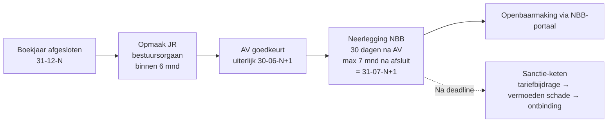

> **Leerstuk — één vraag, helemaal doorgewerkt.** Hoe gaat een jaarrekening van afsluitdatum naar publiek document — en wat als die weg niet correct wordt afgelegd? We werken de drie blokken samen uit: wat er **in en bij** de jaarrekening hoort, het **vier-stappen-proces** richting de Nationale Bank, en de **drie sanctie-trappen** bij niet-neerlegging. Voor verhaal en routekaart: [[studiemateriaal/1-2|minicursus PO 1.2]].

## Antwoord in één blik

Een jaarrekening doorloopt na boekjaar-einde een vaste weg: het bestuursorgaan **maakt op** binnen zes maanden, de algemene vergadering **keurt goed** binnen diezelfde termijn, het bestuur **legt neer** bij de Nationale Bank binnen dertig dagen na goedkeuring én ten laatste zeven maanden na afsluitdatum, en de Nationale Bank **publiceert** via haar Centraal Balanscentrum. Drie deadlines lopen parallel — de eerstvallende telt.

Wordt de jaarrekening niet of laattijdig neergelegd, dan loopt een sanctieketen van **drie trappen**: een progressieve **tariefbijdrage** bij elke laattijdige neerlegging, een **vermoeden van schade derden** (omkering van de bewijslast) bij elk verzuim, en — in het uiterste geval — **gerechtelijke ontbinding** door de ondernemingsrechtbank. Elke trap heeft een eigen rechtsgrond en een eigen drempel.

We werken eerst de **inhoud** uit (wat moet er in en bij?), dan het **proces** (AV → neerlegging → publicatie), dan de **sancties** (drie trappen) — telkens met Bourdon BV als concreet ankerpunt. Bourdon is een engineering-bureau (klein, BV, dochter van Vermeer NV) waarvan de jaarrekening boekjaar N-1 met 37 dagen vertraging werd neergelegd: een levend voorbeeld om elk blok aan te toetsen.

## Inhoud — wat zit er in (en bij) de jaarrekening?

Voor je over neerlegging en sancties kunt denken, moet je weten wát er precies neergelegd wordt. De wet maakt een scherp onderscheid tussen de **jaarrekening zelf** (drie onverbreekbare delen) en de **stukken die mee neergelegd worden** (bijkomende verklaringen en verslagen). Dat onderscheid wordt op het examen geregeld bevraagd — niet elk stuk steunt op dezelfde rechtsbron.

De **jaarrekening** bestaat uit drie onlosmakelijke onderdelen: balans, resultatenrekening en toelichting. Drie samen — een "jaarrekening" met alleen een balans is geen jaarrekening. Het schema (volledig, verkort of micro) volgt uit de groottecategorie die je in [[vennootschap-grootte-en-schema-keuze]] hebt vastgesteld; je kiest niet apart welk schema.

Daarnaast worden bij die jaarrekening, in dezelfde neerleggings-procedure, een aantal extra stukken meegestuurd: een **bestuurdersvermelding**, een **bestemmingsoverzicht** van het resultaat, een **jaarverslag** (alleen groot), een **commissarisverklaring** (alleen waar een commissaris is aangesteld) en een **sociale balans** (zodra er personeel is). De inhoud-tabel hieronder vat het samen.

| Onderdeel | Rol | Wie wordt geraakt? | Rechtsbron |
|---|---|---|---|
| Balans | Deel van de jaarrekening | Alle vennootschappen | WVV + KB-WVV, schema-afhankelijk |
| Resultatenrekening | Deel van de jaarrekening | Alle vennootschappen | WVV + KB-WVV, schema-afhankelijk |
| Toelichting | Deel van de jaarrekening | Alle vennootschappen | WVV + KB-WVV, omvang afhankelijk van grootte |
| Bestuurdersvermelding | Bijkomend stuk | Alle vennootschappen | WVV art. 3:12 1° |
| Bestemmingsoverzicht | Bijkomend stuk | Indien niet uit de JR blijkt | WVV art. 3:12 2° |
| Jaarverslag | Bijkomend stuk | Alleen groot | WVV art. 3:5 + 3:6 |
| Commissarisverklaring | Bijkomend stuk | Waar commissaris benoemd | WVV art. 3:74 |
| Sociale balans | Bijkomend stuk | Vanaf één werknemer | KB-WVV art. 3:24 |

### Balans en resultatenrekening — schema-afhankelijk

De **balans** en de **resultatenrekening** vertrekken vanuit een vast wettelijk model: bijlage 3 van het KB-WVV bevat het volledige schema voor grote vennootschappen, bijlage 4 het verkorte en het micro-schema. Verenigingen volgen bijlagen 6-7. Het onderscheid zit in de granulariteit: het volledige schema heeft veel meer rubrieken, verplichte sub-rubrieken, en deelt de resultatenrekening soms in twee tabellen op (RR1 en RR2). Het verkorte schema voegt enkele aggregaten samen en is daardoor compacter.

Voor Bourdon BV in boekjaar N — een kleine vennootschap (omzet € 9,6 mln, balans € 4,8 mln, 52 FTE op het kantelmoment, maar nog niet voor twee opeenvolgende jaren boven de drempels) — volstaat het **verkort schema**. Voor de moedervennootschap Vermeer NV, die op geconsolideerde basis groot is, geldt het volledige schema voor de geconsolideerde jaarrekening — een aanknopingspunt voor [[rapportering-en-controle-geconsolideerde-jaarrekening]].

### Toelichting — kwantitatief én kwalitatief

De **toelichting** is veel meer dan een appendix. Ze brengt informatie die voor het inzicht in de jaarrekening materieel belang heeft, maar die niet in balans of resultatenrekening past. Vier kernblokken vormen haar ruggengraat: (1) een samenvatting van de **waarderingsregels**, (2) aanvullende vermeldingen voor specifieke rubrieken (staat van vaste activa, evolutie van voorzieningen, kapitaalstaat), (3) verbintenissen **buiten balans**, en (4) niet-courante posten. Bij grote vennootschappen is dit blok volledig uitgewerkt; bij kleine is het beperkt tot wat het verkorte schema oplegt.

De waarderingsregels-samenvatting is de kern. Hier verantwoordt het bestuursorgaan zijn afschrijvingsmethoden en -termijnen, zijn waardevermindering-toetsen, de gehanteerde voorraadmethode (FIFO of gewogen gemiddelde prijs), valuta-omrekening en — cruciaal — elke **wijziging** ten opzichte van het vorige boekjaar. Het bestendigheidsbeginsel uit [[wie-moet-boekhouden-en-hoe]] werkt hier door: regels mogen niet zomaar veranderen, en wanneer ze veranderen moet dat hier verantwoord worden.

> **Bestendigheid versus schattings-wijziging — een examen-klassieker.** Bourdon BV besluit per 1-1-N voor nieuwe machines het afschrijvingspercentage te verhogen van 10 % naar 12,5 %, wegens snellere technologische veroudering. Is dat een wijziging van de waarderingsregel (retroactief herrekenen) of een schattings-wijziging (prospectief verwerken)? Het antwoord is: een **schattings-wijziging**. De waarderingsregel ("lineair afschrijven over de economische levensduur") blijft dezelfde — alleen de geschatte levensduur is bijgesteld. CBN-advies 2019/04 bevestigt dit: een gewijzigde inschatting van de economische levensduur wegens technologische slijtage raakt de schatting, niet de regel. Verwerking gebeurt prospectief, met vermelding van aard en bedrag in de toelichting bij de waarderingsregels. Het bestendigheidsbeginsel geldt voor de regel, niet voor elke schatting binnen die regel — een nuance die in examenvragen graag wordt uitgespeeld.

### Jaarverslag — alleen voor groot

Het **jaarverslag** is geen onderdeel van de jaarrekening, maar een aparte verslagvorm waarin het bestuursorgaan rekenschap geeft van zijn beleid. Het wordt **samen met** de jaarrekening neergelegd, maar staat er juridisch los van. Voor **kleine** vennootschappen — zoals Bourdon in N — geldt een **vrijstelling**. Voor grote vennootschappen is het verplicht; de inhoud is uitgewerkt in het WVV en omvat minstens: een getrouw overzicht van ontwikkeling, resultaten en positie, een beschrijving van de voornaamste risico's en onzekerheden, een analyse die in evenwicht is met omvang en complexiteit van de vennootschap, en relevante (financiële én niet-financiële) prestatie-indicatoren.

Zodra Bourdon in N+2 zou kantelen naar groot (twee opeenvolgende jaren meer dan één drempel overschreden), wordt het jaarverslag verplicht. Voor de moedervennootschap Vermeer NV geldt bovendien een **geconsolideerd** jaarverslag — een aspect dat in PO 1.4 wordt uitgediept.

### Sociale balans — bij personeel

De **sociale balans** is verplicht zodra er personeel is. Ze wordt mee neergelegd met de jaarrekening en bestaat uit vier hoofdblokken: gegevens over het personeelsbestand, mutaties (in- en uitstroom), opleidingen en ontslagen. Net als bij de jaarrekening zelf is er een onderscheid tussen **verkort** (klein) en **volledig** (groot) schema.

Voor Bourdon in N (52 FTE, klein) volstaat het verkort schema. De opleidingskost voor het boekjaar bedraagt € 18.500. Een examen-klassieker (vraag 2008-BIBF): wélke bestanddelen tellen mee voor de opleidingskost? In het verkorte schema gaat het om de **directe** kost (facturen van opleidingsverstrekkers, inschrijvingsgelden). Het volledige schema vult dat aan met **indirecte** kost (de personeelskost van de werknemers tijdens opleidingsuren) én reis- en verblijfskosten verbonden aan opleidingen. Zodra Bourdon kantelt, breidt de cijfer-uiteenzetting uit.

### Bestuurdersvermelding — een stuk BIJ de neerlegging

> [!warning] Bestuurdersvermelding is GEEN "eerste blad jaarrekening"
> Een hardnekkige populaire formulering: "op het eerste blad van de jaarrekening staan de bestuurders". Dat klopt **niet** met de wettekst. Het bedoelde stuk is een **afzonderlijk neer te leggen document** — opgesomd in de lijst van stukken die samen met de jaarrekening moeten worden ingediend. Wie het onder "eerste blad jaarrekening" plaatst, haalt verschillende artikelen door elkaar — een fout die op het examen graag wordt aangegrepen.

De **bestuurdersvermelding** is dus een apart stuk. Het bevat vier soorten gegevens: (1) naam, voornamen, beroep en woonplaats van elke zaakvoerder of bestuurder, (2) dezelfde gegevens voor de commissaris in functie, (3) indien de jaarrekening werd geverifieerd of gecorrigeerd door een externe accountant of bedrijfsrevisor: naam, voornamen, beroep, professioneel adres én **lidmaatschapsnummer** bij hun instituut, en (4) indien geen externe controle heeft plaatsgevonden: een vermelding daarvan.

Voor Bourdon in N: vermelding van Karel Bourdon (zaakvoerder/CEO), Sophie Aerts (bestuurder), Marc Vermeer (bestuurder, namens Vermeer NV). Geen commissaris — Bourdon is klein in N. Wel wordt de externe accountant met ITAA-lidmaatschapsnummer vermeld. Vanaf de kanteling naar groot in N+2 komt daar de commissaris bij.

## Neerleggingsproces — vier stappen + timing

De weg van de afsluitdatum naar het publieke document loopt over vier stappen. Elk heeft zijn eigen actor, zijn eigen deadline en zijn eigen risico bij verzuim. We werken ze chronologisch af, met Bourdon (boekjaar N afgesloten op 31-12-N) als ankerpunt.

| Stap | Wie | Wat | Deadline | Bourdon in N |
|---|---|---|---|---|
| 1 | Bestuursorgaan | Opmaak van de jaarrekening | Binnen 6 maanden na afsluit | Tegen 30-06-N+1 |
| 2 | AV (na evt. commissariscontrole) | Goedkeuring | Binnen 6 maanden na afsluit | AV op 23-05-N+1 |
| 3 | Bestuursorgaan | Neerlegging bij NBB | 30 d na AV én ≤ 7 mnd na afsluit | Uiterlijk 22-06-N+1 (30 d na AV); deadline 31-07-N+1 |
| 4 | NBB | Acceptatie + openbaarmaking | 8 werkdagen na ontvangst | Automatisch indien geen bericht |

### Stap 1 — Opmaak door bestuursorgaan

Het bestuursorgaan stelt de jaarrekening **op** binnen zes maanden na afsluit van het boekjaar. De aansprakelijkheid voor opmaak ligt bij het bestuur — niet bij de boekhouder, niet bij de externe accountant. De externe accountant kán opmaken of helpen, maar het bestuur draagt de juridische verantwoordelijkheid. Bij grote vennootschappen wordt parallel het jaarverslag opgemaakt; bij vennootschappen met personeel ook de sociale balans.

Voor de techniek van het opmaken — eindejaarsverrichtingen, resultaatbestemming, waarderingen — verwijst dit leerstuk door naar [[individuele-jaarrekening-opmaken]] (PO 1.4).

### Stap 2 — Eventuele controle + AV-goedkeuring

Bij **grote** vennootschappen controleert de **commissaris** de jaarrekening volgens een ISA-conform schema en levert een **controleverklaring**. Bij kleine vennootschappen is geen commissaris-solo verplicht (al kan een controle worden aangevraagd door minderheidsaandeelhouders of door de ondernemingsraad). De controleverklaring wordt mee neergelegd.

De **algemene vergadering** wordt opgeroepen volgens de statuten — typisch jaarlijks, binnen zes maanden na afsluit. De AV keurt de jaarrekening **goed** of weigert ze. Zodra goedgekeurd is de jaarrekening boekhoudkundig afgesloten en kan de neerleggings-stap starten.

Wat als de AV niet tijdig vergadert? Het bestuursorgaan blijft aansprakelijk voor de wettelijke termijn. Een laattijdige AV werkt door op de hele rest: het bestuursorgaan haalt dan niet alleen de AV-deadline niet, maar mogelijk ook de NBB-deadline. Bestuurdersaansprakelijkheid kan in beeld komen.

### Stap 3 — Neerlegging bij NBB

Dit is het hart van het proces. Het bestuursorgaan moet **binnen dertig dagen** na de goedkeuring door de AV én **ten laatste zeven maanden** na de afsluitdatum de stukken neerleggen. Twee deadlines parallel — de eerstvallende telt. Voor Bourdon (afsluit 31-12-N, AV op 23-05-N+1): de neerlegging moet uiterlijk op 22-06-N+1 (30 dagen na AV) gebeuren — ruim binnen de absolute deadline van 31-07-N+1.

Wat wordt neergelegd? De jaarrekening + alle bijkomende stukken die de wet oplijst: bestuurdersvermelding, bestemmingsoverzicht van het resultaat, (bij groot) jaarverslag, commissarisverklaring (waar relevant), sociale balans (bij personeel), en andere wettelijk voorgeschreven stukken.

De vorm is **elektronisch** via het NBB-portaal, in XBRL-formaat. Een PDF-neerlegging blijft mogelijk voor specifieke uitzonderingen (buitenlandse jaarrekening, vereenvoudigde VZW met een afwijkend model).

### Stap 4 — Acceptatie en openbaarmaking

De Nationale Bank verwerkt elke neerlegging binnen **acht werkdagen** na ontvangst. Krijg je in die termijn geen bericht? Dan wordt de neerlegging geacht aanvaard te zijn op de datum van neerlegging. Doorloopt de NBB haar rekenkundige en logische controles en vindt ze **wezenlijke fouten**, dan brengt ze die ter kennis. De vennootschap heeft dan twee maanden om te corrigeren.

Eenmaal aanvaard wordt de jaarrekening opgenomen in het Centraal Balanscentrum — een publiek register. Iedereen kan inkijken (gratis voor lezing; voor downloads geldt een tarief). Dat publieke karakter is geen detail: krediet-beoordelaars, leveranciers, banken en concurrenten lezen mee. In de praktijk neigen bestuursorganen daarom naar **zo laat mogelijk** binnen de wettelijke termijn — geen juridische verplichting, wel een commercieel motief.

## Sanctie-keten — drie trappen bij niet-neerlegging

Wat als de jaarrekening níét, of niet tijdig, wordt neergelegd? Dan loopt een sanctie-keten op drie niveaus. Veel adviseurs missen één trap — wie zijn cliënt over neerleggings-verzuim adviseert, moet alle drie samen kunnen overzien. Hieronder de tabel; daarna werken we elke trap uit, met Bourdon (37 dagen te laat neergelegd voor N-1) als concreet ankerpunt.

| Trap | Wanneer geactiveerd? | Rechtsbron | Gevolg |
|---|---|---|---|
| 1. Tariefbijdrage | Neerlegging > 30 d na AV of > 7 mnd na afsluit | KB-WVV art. 3:13 + KB 27-09-2009 | Vast bedrag, progressief verhoogd bij langere vertraging en grotere vennootschap |
| 2. Vermoeden schade derden | Bij elke niet-neerlegging volgens termijn | WVV art. 3:10 lid 3 | Omkering bewijslast — derden hoeven causaal verband niet meer te bewijzen |
| 3. Gerechtelijke ontbinding | Aanhoudend verzuim (typisch ≥ 3 boekjaren) | WVV art. 2:70 | Ondernemingsrechtbank kan ontbinding uitspreken, na regularisatietermijn |

### Trap 1 — Tariefbijdrage

Zodra een vennootschap haar jaarrekening **later dan dertig dagen** na de AV-goedkeuring (of later dan zeven maanden na afsluit) neerlegt, is een **tariefbijdrage** verschuldigd. Het bedrag is vast — maar **progressief verhoogd** naargelang de vertraging oploopt, en naargelang het schema (klein, groot). De juridische basis is een artikel van het KB-WVV, uitgewerkt in een afzonderlijk koninklijk besluit van 2009.

De exacte bedragen citeer je **niet uit het hoofd** op het examen — daarvoor heb je het [Cijferzakboekje](https://www.itaa.be) bij de hand. Orde van grootte: voor een kleine vennootschap praat je over enkele tientallen tot enkele honderden euro per maand vertraging; voor grote vennootschappen ligt het substantieel hoger. De bijdrage is verschuldigd bij neerlegging zelf — geen aparte aanslagprocedure.

Voor Bourdon: de jaarrekening N-1 werd op 02-09-N neergelegd. De deadline lag op 31-07-N (zeven maanden na de afsluit van 31-12-N-1). Vertraging: 33 dagen — net in de eerste opslag-categorie van het KB 27-09-2009. Het exacte bedrag check je in het Cijferzakboekje voor "kleine vennootschap, vertraging tot één maand". De bijdrage werd bij de neerlegging mee betaald.

### Trap 2 — Vermoeden schade derden (omkering bewijslast)

> [!warning] Vermoeden schade derden = art. 3:10 lid 3 WVV, NIET art. 3:43 §3
> Een veelgemaakte fout — ook in oudere themafiches en handboeken — is om dit vermoeden onder **art. 3:43 § 3** WVV te plaatsen. Dat klopt niet. Art. 3:43 regelt **strafsancties** (geldboete van € 50 tot € 10.000) voor bestuurders die de artikelen 3:1, 3:10 of 3:12 overtreden — een andere materie. Het **civielrechtelijke vermoeden** zit rechtstreeks in art. 3:10 zelf, derde lid. De letterlijke wettekst luidt: *"Indien de jaarrekening niet werd neergelegd zoals bepaald in het tweede lid, wordt de door derden geleden schade, behoudens tegenbewijs, geacht voort te vloeien uit dit verzuim."* Citeer altijd 3:10 lid 3 — niet 3:43.

Het effect is technisch maar zwaar: schade die een derde lijdt na een niet-neerlegging wordt **vermoed** te zijn veroorzaakt door dat verzuim. Klassieke bewijslast-rollen draaien om: de derde hoeft alleen schade aan te tonen + dat de jaarrekening niet werd neergelegd. Het causaal verband (had de neerlegging plaatsgevonden, zou de schade niet opgetreden zijn) wordt verondersteld. Het bestuursorgaan kan **tegenbewijs** leveren — maar de bewijslast staat omgekeerd.

Een typische toepassing: een leverancier kan niet inschatten of een vennootschap in moeilijkheden verkeert, omdat geen recente jaarrekening beschikbaar is. Hij levert op krediet; later blijkt insolventie. De leverancier vordert dan tegen het bestuursorgaan persoonlijk, op grond van art. 3:10 lid 3: had ik de cijfers gehad, dan had ik niet op krediet geleverd. De bestuursorgaan-aansprakelijkheid uit het algemene WVV-systeem (art. 2:56) werkt parallel, en dan zonder de bescherming van de business-judgement-rule — een wettelijke verplichting niet naleven is geen marginale beoordeling, maar een duidelijke overtreding.

Praktisch advies aan de cliënt: niet-neerlegging is **niet alleen** tariefbijdrage. Het opent de bestuurders voor civielrechtelijke vorderingen door elke derde (leveranciers, klanten, banken) die geleden schade kan aantonen. De tariefbijdrage betaal je aan de overheid; de vermoeden-schade kan miljoenen kosten.

### Trap 3 — Gerechtelijke ontbinding

> [!warning] Gerechtelijke ontbinding niet-neerlegging = art. 2:70 WVV, NIET art. 2:74
> Beide artikelen leiden tot ontbinding via de ondernemingsrechtbank, maar de **rechtsgrond verschilt**. Art. **2:70** regelt ontbinding wegens **niet-neerlegging** van de jaarrekening; art. **2:74** regelt ontbinding wegens **eigen vermogen onder het wettelijk minimum** voor BV of NV — een andere categorie van verzuim. In oudere themafiches verschijnt 2:74 soms verkeerd; check de wettekst zelf bij twijfel.

De **derde trap** is de zwaarste. De ondernemingsrechtbank kan, op vraag van iedere belanghebbende, het openbaar ministerie of na mededeling door de kamer voor ondernemingen in moeilijkheden, de **ontbinding uitspreken** van een vennootschap die haar verplichting om de jaarrekening neer te leggen (volgens art. 3:10 en art. 3:12) niet is nagekomen.

Eén laattijdige neerlegging activeert die mogelijkheid **niet** — de drempel is hoger. In de praktijk gaat het om drie opeenvolgende boekjaren zonder neerlegging, conform de traditie van deze zware sanctie. De rechtbank kent eerst een **regularisatietermijn** toe (typisch drie maanden) vooraleer ze tot ontbinding overgaat. Bij een verzoek van belanghebbende of OM is die regularisatietermijn verplicht; bij mededeling door de kamer voor ondernemingen in moeilijkheden kan de rechtbank ook meteen ontbinden.

Voor Bourdon: één laattijdige neerlegging activeert geen art. 2:70-procedure — te licht. Maar **drie opeenvolgende** verzuim creëert reëel risico. De boodschap aan de cliënt: na het eerste verzuim de tariefbijdrage betalen en de rest van de neerleggings-discipline herstellen — niet wachten tot het derde verzuim.

### Parallel — bestuursaansprakelijkheid en tucht

Naast de drie WVV-trappen lopen twee andere trajecten parallel. **Civielrechtelijke bestuursaansprakelijkheid** (algemene regeling in het WVV, met een cap volgens grootte-categorie): het verzuim van neerlegging is een duidelijke wets-overtreding, dus géén marginale beslissing onder de business-judgement-rule. De bestuurders kunnen op die grond persoonlijk worden aangesproken.

En **tucht**: voor de externe accountant van Bourdon die zijn cliënt niet waarschuwt voor de neerleggings-termijn, ligt een ITAA-tuchtmaatregel op de loer. Voor de commissaris (zodra Bourdon kantelt) bestaat bovendien een eigen meldingsplicht bij wettelijke niet-naleving.

Pedagogische kapstok: WVV-sancties (de drie trappen) zijn de **rechtstreekse** sancties; bestuursaansprakelijkheid en tucht zijn de **afgeleide** sancties — beide trajecten kunnen tegelijk lopen.

## Drie valkuilen

> [!warning] Drie examen-traffic-stoppers
>
> 1. **Vermoeden schade derden onder art. 3:43 §3 plaatsen.** De juiste rechtsgrond is art. **3:10 lid 3** WVV — direct in het neerleggingsartikel zelf. Art. 3:43 regelt iets anders: strafsancties bij overtreding van art. 3:1, 3:10 of 3:12. Citeer 3:10 lid 3 voor het civiele vermoeden.
> 2. **Gerechtelijke ontbinding onder art. 2:74 plaatsen.** De juiste grond is art. **2:70** WVV — verwijst expliciet naar art. 3:10 én 3:12 als grond-overtreding. Art. 2:74 regelt een andere ontbinding (eigen vermogen onder wettelijk minimum) voor BV en NV. Beide leiden tot ontbinding, via verschillende rechtsfeiten.
> 3. **Bestuurdersvermelding gelijkstellen met "eerste blad jaarrekening" onder art. 3:5.** Art. 3:5 regelt het **jaarverslag** (opmaak-plicht), niet de bestuurdersvermelding. Dat laatste is een afzonderlijk stuk uit art. **3:12 1°** — mee neergelegd, dezelfde lijst voor commissaris en externe accountant of bedrijfsrevisor. Wie "eerste blad" formuleert, haalt twee artikelen door elkaar.

## Wanneer je dit snapt, ga dan naar

- [[wat-is-belgisch-boekhoudrecht]] — het bronnen-veld: WVV als wettelijke basis + plaats van CBN-adviezen bij interpretatie van waarderingsregels.
- [[wie-moet-boekhouden-en-hoe]] — de boekhoudbeginselen (bestendigheid, voorzichtigheid) waarop de verantwoording van waarderingsregels in de toelichting steunt.
- [[vennootschap-grootte-en-schema-keuze]] — de cascade-keten waaruit schema-keuze, jaarverslag-plicht, commissaris-plicht en sociale-balans-versie voortvloeien.
- [[individuele-jaarrekening-opmaken]] — cross-PO naar PO 1.4: de techniek van het opmaken zelf (eindejaarsverrichtingen, resultaatbestemming).
- [[wat-is-jaarrekeninganalyse]] — cross-PO naar PO 1.3: wat er met de gepubliceerde jaarrekening gebeurt (analyse, kengetallen).
- [[studiemateriaal/1-2/samenvatting|Samenvatting PO 1.2]] — voor herhaling vlak voor het examen: neerleggings-tijdslijn + sanctie-tabel + welke stukken horen bij welk schema.

## Doorklik naar concepten

Voor wie definitorisch detail wil opzoeken:

- [[jaarrekening]] · [[eindejaarsverrichtingen]]
- [[boekhoudbeginselen]] · [[commissaris]]
- [[algemene-vergadering]] · [[bestuurdersaansprakelijkheid]]

---

## Wettelijk fundament

- Opmaak jaarrekening + AV-goedkeuring binnen 6 maanden: WVV art. 3:1. Het bestuursorgaan stelt de jaarrekening op en legt ze ter goedkeuring voor aan de AV binnen zes maanden na afsluitdatum.
- Inhoud jaarrekening — balans + resultatenrekening + toelichting: KB-WVV art. 3:1 + bijlage 3 (volledig) + bijlage 4 (verkort + micro). Voor vereniging: bijlagen 6-7 KB-WVV.
- Toelichting — inhoud + waarderingsregels-samenvatting: KB-WVV art. 3:6 § 1 (waarderingsregels + afwijking) + art. 3:61 (toelichting-inhoud). Wijziging waarderingsregel of schatting motiveren — CBN-advies 2019/04 als interpretatie.
- Jaarverslag — opmaak-plicht voor groot: WVV art. 3:5. Het bestuursorgaan stelt een verslag op waarin het rekenschap geeft van zijn beleid.
- Vrijstelling jaarverslag voor klein: WVV art. 3:4.
- Inhoud jaarverslag: WVV art. 3:6. Getrouw overzicht ontwikkeling/resultaten/positie + risico's + niet-financiële prestatie-indicatoren waar relevant.
- Sociale balans — verkort vs volledig: KB-WVV art. 3:24. Opleidingskost-bestanddelen: direct (verkort) of direct + indirect + reis/verblijf (volledig).
- Bestuurdersvermelding — neer te leggen stuk: WVV art. 3:12 1°. Naam, voornamen, beroep en woonplaats van bestuurders + commissaris + (waar relevant) externe accountant of bedrijfsrevisor met lidmaatschapsnummer. NIET "eerste blad jaarrekening" onder art. 3:5.
- Neerlegging bij NBB — termijn: WVV art. 3:10 lid 2. Binnen 30 dagen na AV-goedkeuring én ten laatste 7 maanden na afsluit. Twee deadlines parallel — de eerstvallende telt.
- Vermoeden schade derden bij niet-neerlegging: WVV art. 3:10 lid 3. Schade door derden geleden wordt geacht voort te vloeien uit het verzuim, behoudens tegenbewijs. Bron is art. 3:10 zelf — NIET art. 3:43 (een veelvoorkomende verkeerde verwijzing).
- Acceptatie door NBB: WVV art. 3:14. Binnen 8 werkdagen na ontvangst — bij wezenlijke fouten correctie binnen 2 maanden door de vennootschap.
- Welke stukken worden neergelegd: WVV art. 3:12 2°-10°. Bestemmingsoverzicht resultaat (indien niet uit jaarrekening blijkt) + jaarverslag (groot) + commissarisverklaring + sociale balans + andere wettelijk voorgeschreven stukken.
- Strafsancties bij overtreding 3:1, 3:10, 3:12: WVV art. 3:43 § 1. Geldboete € 50 tot € 10.000 voor de bestuurders/zaakvoerders. NIET de civiele vermoeden-bepaling (die zit in 3:10 lid 3).
- Tariefbijdrage bij laattijdige neerlegging: KB-WVV art. 3:13 + KB 27-09-2009. Vast bedrag — progressief verhoogd bij langere vertraging en bij grote vennootschap. Cijfers via Cijferzakboekje.
- Gerechtelijke ontbinding bij niet-neerlegging: WVV art. 2:70. Ondernemingsrechtbank kan ontbinding uitspreken op vraag van belanghebbende, openbaar ministerie of kamer voor ondernemingen in moeilijkheden. Regularisatietermijn mogelijk. NIET art. 2:74 (die regelt eigen-vermogen-ontbinding — andere grond).
- Correctie van neergelegde jaarrekening: WVV art. 3:19. Materiële fouten of dwaling in rechte of feite — correctie ter goedkeuring AV (behalve loutere materiële fouten door bestuursorgaan zelf).
- Wettelijke controle door commissaris: WVV art. 3:72. Verplicht bij grote vennootschappen en bij groep > 50 werknemers. Controleverklaring volgens vast schema.
- Aansprakelijkheid bestuursorgaan: WVV art. 2:56 + art. 2:57 (cap). Voor wettelijke verplichtingen-overtreding zoals niet-neerlegging: niet onder business-judgement-rule. Cap volgens grootte-categorie.
- Schattings-wijziging bij waarderingsregel-aanpassing: CBN-advies 2019/04 + KB-WVV art. 3:6. Schattings-wijziging = prospectief; vermelding aard + bedrag in toelichting (waarderingsregels).

---

*Leerstuk PO 1.2 — proces + sanctie. Status: voorgesteld volgens ADR-037.*
