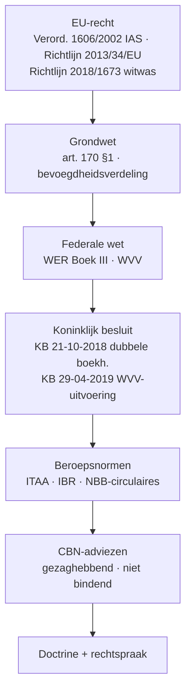
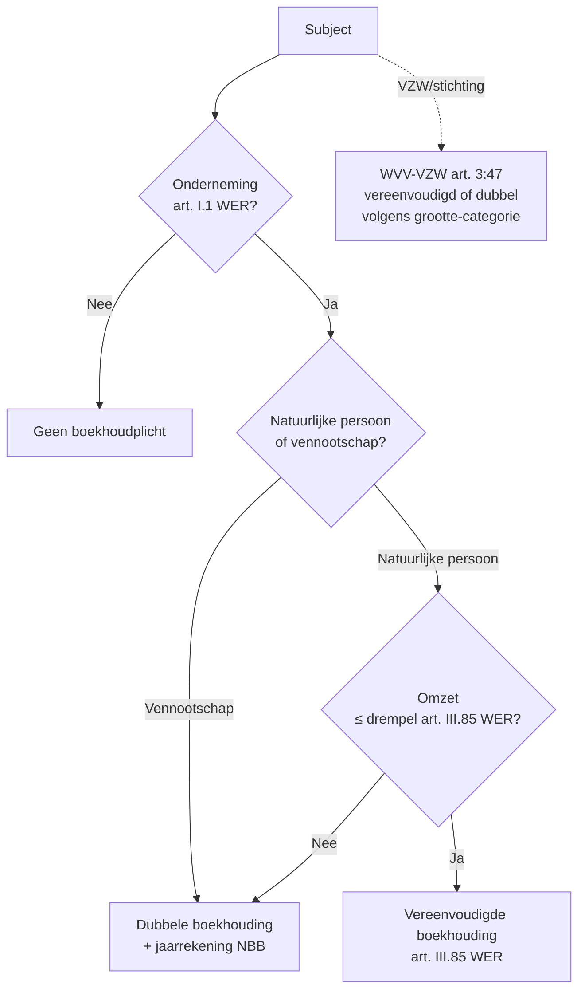
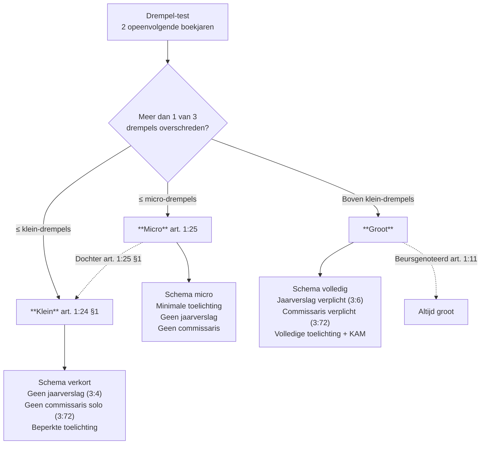
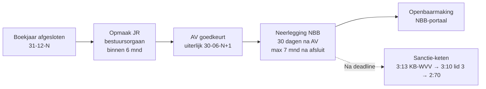

> **Samenvatting — kapstok voor herhaling.** Enkele A4 die het hele PO samenvatten in vaste blokken: take-away, bronnen-piramide, autoriteiten-tabel, boekhoudplicht-beslisboom, vereenvoudigd-vs-dubbel, acht beginselen, grootte-cascade, schema-drieluik, scharnier-uitzonderingen, publicatie-tijdslijn, sancties, verplichte vermeldingen, valkuilen. Bedoeld om snel door te lopen, niet om voor het eerst te leren. Alle drempelcijfers (grootte, vereenvoudigd, tariefbijdrage) komen uit het Cijferzakboekje bij examen — hier alleen referentie-orden van grootte. Voor uitleg en doorwerking: de leerstukken van dit leerpad. Voor verhaal en routekaart: [[studiemateriaal/1-2|overzicht PO 1.2]].

---

## 1. Take-away — wat je écht moet weten

- **Bronnenhiërarchie als kompas.** EU-verordening werkt rechtstreeks, richtlijn via Belgische omzetting; WER + WVV zijn federale wet; KB 21-10-2018 + KB 29-04-2019 zijn uitvoeringsregels; **CBN-advies is gezaghebbend maar niet bindend** — rechter kan motiveren-en-afwijken.
- **Boekhoudplicht is onderneming-test, geen handel-test.** Sinds Wet 15-04-2018 valt elke "onderneming" (art. I.1 WER) eronder — inclusief vrije beroepen en VZW's. Kapitaalvennootschappen altijd dubbele boekhouding; natuurlijke personen onder omzet-drempel mogen vereenvoudigd.
- **Drempel-test = "meer dan één van drie"** over twee opeenvolgende boekjaren. Twee criteria overschrijden volstaat al om uit klein te vallen. Acht beginselen + bestendigheid sturen waardering.
- **Groottecategorie is de motor.** Eén cascade: schema → toelichting-omvang → jaarverslag-plicht → commissaris-plicht → sociale-balans-vorm. Beursgenoteerde vennootschappen ALTIJD groot, ongeacht drempels (art. 1:11).
- **Vier kritische scharnier-uitzonderingen** waar het examen op mikt: (a) moeder geconsolideerd getoetst (art. 1:24 §6); (b) dochter NOOIT micro (art. 1:25 §1); (c) beursgenoteerd altijd groot (art. 1:11); (d) vereniging eigen drempels (WVV-VZW art. 3:47).
- **Publicatie-keten: 30 dagen na AV, max 7 maanden na afsluit** — neerleggen bij NBB. Te laat ⇒ tariefbijdrage + **vermoeden schade derden (art. 3:10 lid 3 WVV)** + na drie boekjaren verzuim **gerechtelijke ontbinding (art. 2:70 WVV)** mogelijk.

---

## 2. Bronnen-piramide — wie zegt wat

Zes lagen, één hiërarchie. Onthou de twee scharnieren: verordening werkt rechtstreeks (richtlijn moet omgezet), CBN-advies bindt niet (rechter kan motiveren-en-afwijken).

---

## 3. Zes autoriteiten — wie doet wat

| Instituut | Rol | Wat doe je hier? |
|---|---|---|
| **NBB** (Nationale Bank) | Balanscentrale · neerlegging jaarrekeningen · statistieken | Neerleggen + opzoeken |
| **CBN** (Comm. Boekhoudk. Normen) | Interpretatie boekhoudrecht · adviezen (ambtshalve of op vraag) | Doctrineraadpleging |
| **ITAA** | Beroepsorganisatie GA + GBA · normen · tucht · toezicht | Beroepsnormen + tucht |
| **IBR** (Inst. Bedrijfsrev.) | Bedrijfsrevisoren · auditnormen ISA | Commissaris-norm |
| **FSMA** | Toezicht beursgenoteerde + financieel toezicht | Beurs + financiële markt |
| **Griffies ondernemingsrechtbank** | KBO-inschrijving · vennootschapsakten + kleine-VZW-neerlegging | Vennootschapsformaliteiten |

---

## 4. Wie moet boekhouden?

Onderneming-test (art. I.1 WER) eerst, dan rechtsvorm. Natuurlijke persoon onder omzet-drempel mag vereenvoudigd; vennootschappen altijd dubbel.

---

## 5. Vereenvoudigd vs dubbel — wat verandert?

| Aspect | Vereenvoudigde boekhouding | Dubbele boekhouding |
|---|---|---|
| **Wettelijke basis** | art. III.85 WER + KB 12-09-1983 | art. III.82-95 WER + KB 21-10-2018 |
| **Verplichte boeken** | Financieel dagboek + inkopen + verkopen + inventarisboek | Algemeen dagboek + hulpdagboeken + grootboek + inventaris + **centralisatieboek** |
| **MAR-rekeningen** | Nee | Ja (KB 29-04-2019) |
| **Centralisatie** | n.v.t. | Minstens **maandelijks** (art. 5 KB 21-10-2018) |
| **Jaarrekening NBB** | Geen verplichting | Ja, volgens grootte-schema |
| **Wie?** | Natuurlijke persoon onder omzet-drempel | Alle vennootschappen + grote zelfstandigen |

> **Noot.** Drempel vereenvoudigd ≈ € 500 000 (€ 620 000 brandstof) — Cijferzakboekje bij examen voor exact bedrag.

---

## 6. Acht boekhoudbeginselen — KB-WVV

| Beginsel | Wat zegt het? | Klassieke toepassing |
|---|---|---|
| **1. Entiteit** | Onderneming = boekhouding-subject, los van eigenaar | Privé-vermogen scheiden van vennootschap |
| **2. Continuïteit** | Going concern — onderneming voortgezet, tenzij contra-bewijs | Waardering aan continuïteitswaarde tenzij liquidatie zichtbaar |
| **3. Bestendigheid** | Eenmaal gekozen waarderingsregel = volhouden, motivering vereist bij wijziging | Afschrijvingstermijn niet zomaar veranderen |
| **4. Voorzichtigheid** | Voorzienbare risico's boeken, voorzienbare winsten pas bij realisatie | Voorraadwaardering LIFO/FIFO/gewogen + voorzieningen |
| **5. Matching** | Opbrengsten + bijhorende kosten in zelfde periode | Overlopende rekeningen + afschrijvingen + voorzieningen |
| **6. Individualisering** | Elke transactie afzonderlijk boeken — geen samenvoegingen | Geen netto-boeking van debit + credit zonder grondslag |
| **7. Waarheid (getrouw beeld)** | Boekhouding moet realiteit weergeven — art. 3:1 WVV | Substance over form bij grensgevallen |
| **8. Niet-compensatie** | Activa en passiva, opbrengsten en kosten niet onderling verrekenen | Bruto presenteren, niet netto |

> **Noot.** Wijziging waarderingsregel ≠ schatting-wijziging. CBN-advies 2019/04: schatting-wijziging (bv. afschrijvingspercentage 10 → 12,5 %) is PROSPECTIEF, geen retroactieve correctie. Bestendigheid geldt voor de REGEL, niet voor de schatting.

---

## 7. Groottecategorie-cascade (art. 1:24-25 WVV)

Drempel-test = meer dan één van drie criteria over twee opeenvolgende boekjaren. Eén cascade stuurt schema + jaarverslag + commissaris + sociale balans.

---

## 8. Drie schema's — wat verandert?

| Aspect | Volledig | Verkort | Micro |
|---|---|---|---|
| **Wie?** | Grote vennootschappen | Kleine vennootschappen | Microvennootschappen |
| **Balans** | Volledige rubrieken | Samengevoegde posten | Sterk vereenvoudigd |
| **Resultatenrekening** | Volledig (RR1+RR2) | Verkort | Sterk verkort |
| **Toelichting** | Volledig | Beperkt | Minimaal |
| **Sociale balans** | Volledig schema | Verkort schema | Verkort schema |
| **Jaarverslag** | Verplicht (art. 3:6 WVV) | Vrijgesteld (art. 3:4 WVV) | Vrijgesteld |
| **Commissaris-controle** | Verplicht (art. 3:72 WVV) | Vrijgesteld behalve groep | Vrijgesteld |

> **Noot.** Drempels zelf — Cijferzakboekje (geïndexeerd). Twee opeenvolgende boekjaren + meer dan één van drie overschrijden = kanteling.

---

## 9. Vier scharnier-uitzonderingen op de drempel-test

| Scharnier | Wat verandert? | Bron |
|---|---|---|
| **Moeder van groep** | Geconsolideerd getoetst — aggregatie + 20 %-correctie (CBN 2017/10 / 2022/03) of volledige consolidatie | art. 1:24 §6 WVV |
| **Dochter** | Kan NOOIT micro zijn — minimum klein | art. 1:25 §1 WVV |
| **Beursgenoteerd** | Altijd groot, ongeacht drempels | art. 1:11 WVV |
| **Vereniging (VZW/stichting)** | Eigen drempels (lager) — onder = vereenvoudigd-vereniging (KB 26-06-2003); boven = dubbele + jaarrekening volgens VZW-schema | art. 3:47 WVV-VZW |

> **Noot.** Op de "groep van beperkte omvang" bij consolidatie (art. 1:26 WVV) niet verwarren met art. 1:24 §6 (moeder-grootte-toetsing).

---

## 10. Publicatie-tijdslijn

Vier stappen, twee deadlines: 6 maanden na afsluit voor AV + 30 dagen na AV (max 7 mnd na afsluit) voor NBB-neerlegging.

---

## 11. Sancties-keten bij niet-neerlegging

| Sanctie | Grondslag | Timing / drempel |
|---|---|---|
| **Tariefbijdrage** | art. 3:13 KB-WVV + KB 27-09-2009 | Bij neerlegging > 30 dagen na AV; progressief verhoogd voor grote vennootschap |
| **Vermoeden schade derden** | art. 3:10 lid 3 WVV | Bij verzuim — omkering bewijslast; derde hoeft schade-link niet te bewijzen |
| **Bestuurdersaansprakelijkheid** | art. 2:56 WVV + art. 3:10 WVV | Civielrechtelijk + tucht via beroepsorde |
| **Gerechtelijke ontbinding** | art. 2:70 WVV | Na 3 boekjaren niet-neerlegging — vordering OM of belanghebbende |

> **Noot.** Tariefbijdrage-bedragen — Cijferzakboekje. Bedragen zijn periodiek geïndexeerd.

---

## 12. Verplichte vermeldingen in/op de jaarrekening

### Bestuurdersvermelding (art. 3:12 1° WVV)

| Veld | Voor groot ook |
|---|---|
| Naam + voornaam + adres elke bestuurder/zaakvoerder | ✓ |
| Datum begin + einde mandaat | ✓ |
| Datum AV die JR heeft goedgekeurd | ✓ |
| Commissaris + IBR-lidmaatschap | ✓ (alleen groot) |

### Waarderingsregels-verantwoording

| Schema | Waar verantwoorden? |
|---|---|
| Klein | In toelichting (verkort) + motivering bij wijziging |
| Groot | In toelichting (volledig) + jaarverslag-narratief (art. 3:6 WVV) + KAM |

### Sociale balans — opleidingskost

- Verplichte bijlage zodra personeel — verkort schema voor klein, volledig voor groot.
- Verkort: alleen DIRECT-kost (facturen + inschrijvingsgelden + reis-/verblijfskost).
- Volledig: ook INDIRECT-kost (personeelskost werknemers in opleiding tijdens werkuren).

---

## 13. Klassieke valkuilen

| Valkuil | Wat klopt er niet | Wat klopt wél |
|---|---|---|
| **Bestuurdersvermelding = art. 3:5 WVV** | Art. 3:5 WVV regelt hoofdelijkheid bestuurders bij onregelmatige jaarrekening — niet de eerste-blad-vermelding | Bestuurdersvermelding = art. 3:12 1° WVV (neer-te-leggen stuk) |
| **Vermoeden schade derden = art. 3:43 §3 WVV** | Art. 3:43 §3 bestaat niet in deze betekenis — verwarring met oude bron | Vermoeden schade derden bij niet-neerlegging = art. 3:10 lid 3 WVV (omkering bewijslast) |
| **Gerechtelijke ontbinding = art. 2:74 WVV** | Art. 2:74 regelt iets anders (alarmbel-procedure-aspect) | Gerechtelijke ontbinding wegens 3 boekjaren niet-neerlegging = art. 2:70 WVV |
| **Dochter erft grootte van moeder** | Een dochter wordt enkelvoudig getoetst (drempels op haar eigen cijfers) | Wel: een dochter kan NOOIT micro zijn (art. 1:25 §1) — minimum klein |
| **Aggregatie = consolidatie** | Aggregatie is simpele optelling (dubbele tellingen + intra-groep blijven) | Moeder-grootte-toets: aggregatie + 20 %-correctie (CBN 2017/10/2022/03) OF volledige consolidatie |
| **CBN-advies = wet** | CBN-advies is gezaghebbend maar niet bindend — rechter kan motiveren-en-afwijken | Standaardpraktijk volgt CBN tenzij andere wet voorrang |
| **Vrije beroepen vrijgesteld** | Sinds Wet 15-04-2018 (effectief 01-11-2018) is elke "onderneming" (art. I.1 WER) boekhoudplichtig — incl. dokter/advocaat/architect | Dubbele boekhouding, tenzij omzet onder drempel art. III.85 WER |
| **Beursgenoteerd kan klein zijn** | Drempels gelden niet voor beursgenoteerde vennootschap | Beursgenoteerd = altijd groot (art. 1:11 WVV) — volledig schema + commissaris + jaarverslag verplicht |
| **Drempel-test = alle drie overschrijden** | Test is "meer dan één" — twee criteria volstaat om uit klein te vallen | Twee opeenvolgende boekjaren + meer dan één drempel = niet-klein |
| **Wijziging afschrijvingspercentage = wijziging waarderingsregel** (retroactief) | Afschrijvingspercentage = SCHATTING — bestendigheidsbeginsel geldt voor de regel, niet voor de schatting | CBN-advies 2019/04: schatting-wijziging verwerken PROSPECTIEF — geen retroactieve correctie. Toelichting motiveert |
| **EU-richtlijn rechtstreeks toepasbaar** | Richtlijn bindt staten in resultaat, niet rechtstreeks burgers/vennootschappen | Verordening (bv. 1606/2002 IAS) wél rechtstreeks |
| **VZW = geen boekhouding** | WVV-VZW art. 1:28-29 + art. 3:47 — vereenvoudigd OF dubbel afhankelijk grootte | Grote VZW = volledig schema + neerlegging NBB. Kleine VZW = griffie ondernemingsrechtbank |

---

## 14. Verdieping

### Leerstukken — voor pedagogische opfris

Werkt iets niet meer scherp? Klik door naar het leerstuk dat het uitwerkt:

- [[wat-is-belgisch-boekhoudrecht]] — Bronnen + autoriteiten + bindend-vs-gezaghebbend
- [[wie-moet-boekhouden-en-hoe]] — Boekhoudplicht + dubbel/vereenvoudigd + 8 beginselen + bewaarplicht
- [[vennootschap-grootte-en-schema-keuze]] — Drempels + cascade + vier scharnier-uitzonderingen
- [[jaarrekening-publiceren-en-sancties]] — Jaarrekening-inhoud + 4-stap-procedure + sanctie-keten
- [[individuele-jaarrekening-opmaken]] — Cross-PO (PO 1.4) — techniek: eindejaarsverrichtingen + resultaatbestemming + proefbalans

### Concept-fiches — voor definitorisch detail

Voor wie een wettekst-pointer of nauwkeurige definitie zoekt:

**Kader + bronnen** — [[belgisch-boekhoudrecht]] · [[autoriteiten-boekhoudrecht]]

**Plicht + techniek** — [[boekhoudplicht]] · [[boekhouding]] · [[dubbele-boekhouding]] · [[boekhoudbeginselen]]

**Grootte + schema** — [[vennootschap-groottecategorieen]] · [[groottecategorie-vereniging]]

**Documenten + publicatie** — [[jaarrekening]] · [[eindejaarsverrichtingen]]

---

*Samenvatting PO 1.2. Status: voorgesteld (2026-06-01). Migratie uit themafiches boekhoudplicht-en-rechtsbronnen + jaarrekening-schema-en-publicatie per ADR-039.*
