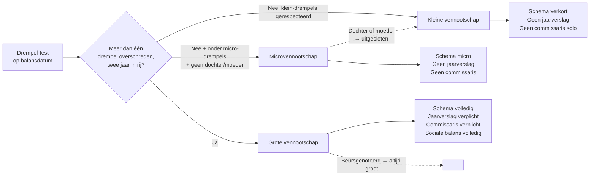

> **Leerstuk — één vraag, helemaal doorgewerkt.** Welke groottecategorie krijgt een vennootschap, en wat verandert er daardoor aan haar verslaggevingsplichten? Voor verhaal en routekaart: [[studiemateriaal/1-2|overzicht PO 1.2]]. Voor definitorische opzoek: zie wikilinks doorheen de tekst.

## Antwoord in één blik

Drie cijfers bepalen de categorie: het jaargemiddelde van het aantal werknemers, de jaaromzet exclusief btw en het balanstotaal. Overschrijdt een vennootschap er **niet meer dan één**, dan blijft ze klein — of zelfs micro, als ze ook onder de strengere micro-drempels blijft én géén dochter of moeder is. Pas wanneer ze gedurende **twee opeenvolgende boekjaren** meer dan één drempel overschrijdt, kantelt ze naar de hogere categorie, en dat geldt vanaf het boekjaar dat volgt op die tweede overschrijding. De drempelbedragen vind je in het Cijferzakboekje; de regels in [[concept-vennootschap-groottecategorieen|de WVV-bepalingen rond groottecriteria]].

Vijf scharnier-uitzonderingen kleuren dit standaardverhaal — en het examen toetst ze graag:

- een **moeder** wordt op geconsolideerde basis getoetst, niet enkelvoudig;
- een **dochter** kan nooit microvennootschap zijn — minimaal klein;
- een **beursgenoteerde** vennootschap is altijd groot, ongeacht haar enkelvoudige cijfers;
- een **vereniging** volgt een eigen drempel-cascade onder het WVV-VZW;
- de **cascade-gevolgen** — schema, jaarverslag, commissaris, sociale balans — schakelen samen mee.

We werken eerst de drempel-test uit op Bourdon, daarna de cascade-gevolgen, daarna de vijf scharnier-uitzonderingen, en sluiten af met de hele Bourdon-Vermeer-groep tegelijk doorgewerkt.

---

## De drempel-test — micro, klein, groot

De wet vertrekt niet van de grote vennootschap, maar definieert eerst de **kleine** en de **micro**. Wat geen van beide is, wordt automatisch groot. Die negatieve definitie van "groot" verklaart waarom je in het wetboek geen aparte drempels voor grote vennootschappen vindt: ze zijn de restcategorie.

De drie criteria gelden voor beide positieve categorieën, en je toetst ze op de balansdatum van het laatst afgesloten boekjaar:

- het **jaargemiddelde van het aantal werknemers**, uitgedrukt in voltijdsequivalenten;
- de **jaaromzet excl. btw** — voor vennootschappen waarvan de opbrengsten voor meer dan de helft niet aan de definitie van netto-omzet beantwoorden, gelden de bedrijfs- en financiële opbrengsten samen, exclusief niet-recurrente opbrengsten;
- het **balanstotaal**.

De toetsregel zelf is kort maar tricky: zolang een vennootschap **niet meer dan één** van deze drie drempels overschrijdt, blijft ze in haar categorie. Wie twee of drie drempels overschrijdt, is *kandidaat* om te kantelen — maar de kanteling treedt niet meteen in.

> **Waarom een twee-jaars-buffer?** De wet bouwt een rustzone in tegen het jojo-effect van een toevallig piekjaar. Pas wanneer de overschrijding van meer dan één drempel zich **twee opeenvolgende boekjaren** voordoet, treedt het gevolg in. En zelfs dan: het gevolg gaat in vanaf het boekjaar dat *volgt* op het tweede overschrijdings-boekjaar. Dezelfde buffer werkt omgekeerd voor wie weer onder de drempels zakt.

De exacte cijfers staan niet in dit leerstuk: ze zijn recent verhoogd (omzetting EU-richtlijn 2023/2775) en blijven indexeerbaar. Voor examen-actuele bedragen: raadpleeg het Cijferzakboekje of de tarief-records [[tarieven/drempels-kleine-vennootschap|drempels kleine vennootschap]] en [[tarieven/drempels-microvennootschap|drempels microvennootschap]].

### Bourdon in cijfers — een doorgewerkte test

Bourdon BV maakt elk jaar opnieuw de oefening. Drie achtereenvolgende boekjaren liggen er nu cijfers op tafel:

| Boekjaar | FTE | Omzet (excl. btw) | Balanstotaal | Drempels overschreden? | Categorie |
|---|---:|---:|---:|---|---|
| N-1 | 46 | € 8.400.000 | € 4.200.000 | geen | Klein |
| N | 52 | € 9.600.000 | € 4.800.000 | drie — **eerste keer** | Klein (kanteling nog niet) |
| N+1 (prognose) | 55 | € 10.200.000 | € 5.100.000 | drie — **tweede keer in rij** | Klein **— kantelt naar groot vanaf N+2** |

Lees de tabel met de twee-jaars-regel in het hoofd. Boekjaar N is voor Bourdon het eerste jaar waarin ze meer dan één drempel overschrijdt. Op zich gebeurt er dan nog niets: ze blijft klein. Boekjaar N+1 zet de overschrijding voort — opnieuw drie drempels boven de grens. Pas dan is de twee-jaars-voorwaarde vervuld. Het gevolg gaat in vanaf het *daaropvolgende* boekjaar: vanaf N+2 maakt Bourdon haar jaarrekening op volgens het volledig schema, komt er een jaarverslag bij, moet ze een commissaris benoemen en levert ze haar sociale balans af in het volledig schema.

Het examen heeft dit patroon al meermaals getoetst. De val zit telkens in de timing: stagiairs die "vanaf N" antwoorden, missen de bewuste rust-zone die de wet inbouwt. Eerste overschrijding = nog niets. Tweede overschrijding = pas vanaf het *volgende* boekjaar gevolgen.

---

## De cascade — wat verandert er met de groottecategorie?

De groottecategorie is geen label-met-prestige. Ze is een trigger die vier wettelijke gevolgen samen activeert: het jaarrekening-schema, de jaarverslag-plicht, de commissarisplicht en het sociale-balans-schema. Wie kantelt op één regel, kantelt op alle vier.

| Cascade-veld | Microvennootschap | Kleine vennootschap | Grote vennootschap |
|---|---|---|---|
| **Jaarrekening-schema** | micro | verkort | volledig |
| **Jaarverslag** | vrijgesteld | vrijgesteld (niet-genoteerd) | verplicht |
| **Commissaris** | vrijgesteld | vrijgesteld behoudens groep-uitzonderingen | verplicht |
| **Sociale balans** | verkort | verkort | volledig |
| **Toelichting** | minimaal | beperkt | volledig |

Drie pedagogische sleutels helpen je de tabel onthouden. Micro is het lichtste regime: het schema is sterk vereenvoudigd, er komt geen jaarverslag aan te pas, geen commissaris in zicht. Klein is een tussenregime: het schema is verkort, het jaarverslag blijft achterwege voor wie niet-genoteerd is, en commissaris hoeft niet — tenzij een groepscontext de drempel forceert. Groot is het volledige regime: volledig schema, jaarverslag verplicht, commissaris verplicht, sociale balans in het volledig schema.

Eén belangrijke nuance verdient aandacht. Het *schema* bepaalt welke rubrieken in de jaarrekening verschijnen, niet **of** er een jaarrekening is. Elke vennootschap maakt een jaarrekening op; alleen de detailgraad verschilt. En het *boekhoud-regime* (vereenvoudigd versus dubbel) staat los van de groottecategorie: een kleine vennootschap voert nog altijd een dubbele boekhouding, alleen haar jaarrekening is verkort. De techniek van het opmaken (eindejaarsverrichtingen, waardering) zit in [[wie-moet-boekhouden-en-hoe]] en in PO 1.4 in [[individuele-jaarrekening-opmaken]]. Dit leerstuk regelt alleen welk schema je toepast.

---

## De vijf scharnier-uitzonderingen

Vijf patronen breken het standaardverhaal, en het examen toetst ze één voor één. We werken ze stuk voor stuk uit, telkens met de wetstekst in het achterhoofd.

| Pad | Hoe getoetst? | Belangrijkste regel |
|---|---|---|
| **Solo-vennootschap** | enkelvoudig over twee jaar | standaardcascade |
| **Moedervennootschap** | geconsolideerd (aggregatie + 20 %-correctie of volledige consolidatie) | enkelvoudig klein, geconsolideerd groot → groot |
| **Dochter** | enkelvoudig — maar nooit micro | dochter kan nooit microvennootschap zijn |
| **Beursgenoteerd** | altijd groot | drempels niet relevant |
| **Vereniging (vzw/ivzw/stichting)** | eigen drempels | volgt WVV-VZW, niet WVV |

### Moedervennootschap — geconsolideerde toetsing

De wetgever heeft een misbruik willen voorkomen: een grote groep die zichzelf in een dozijn kleine dochters opdeelt, zou anders elke dochter als "klein" kunnen kwalificeren en zo aan de zware verslaggevingsplichten ontsnappen. Daarom geldt voor een moedervennootschap een aparte regel: haar groottecategorie wordt op **geconsolideerde basis** beoordeeld, niet op enkelvoudige.

Praktisch betekent dat: voor de drempel-test tel je de eigen cijfers van de moeder samen met die van haar dochtervennootschappen en met de andere vennootschappen waarmee verbondenheid bestaat — na eliminatie van de intra-groep verrichtingen. Twee methodes zijn toegelaten. De eerste is een **volledige consolidatie** volgens de bepalingen van het KB-WVV (zoals voor een geconsolideerde jaarrekening). De tweede is een **aggregatie**: de cijfers worden samen geteld, en de drempelgrenzen waaraan getoetst wordt, worden voor de aggregatie-methode met 20 % verhoogd. De keuze tussen beide werkmethodes is een bestuurskeuze in functie van de praktische haalbaarheid.

> **Voorbeeld dat het verschil zichtbaar maakt.** Vermeer NV zou op enkelvoudige basis nog klein zijn. Geconsolideerd met Bourdon BV en Vermeer Services SRL stijgen de cijfers ver boven de klein-drempels. Conclusie: Vermeer NV is **groot**. Vanaf het lopend boekjaar (na de twee-jaars-buffer) maakt ze haar enkelvoudige jaarrekening op volgens het volledig schema, voegt ze een jaarverslag toe en stelt ze een commissaris aan. De moeder mag *niet* via haar klein-enkelvoudige cijfers ontsnappen.

De techniek van de eigenlijke consolidatie hoort bij PO 1.4: zie [[wie-moet-consolideren]] voor wie er moet, en [[hoe-consolideren]] voor de boekhoudkundige methodes. Hier gaat het strikt om het effect op de grootte-toets — een aparte vraag van die naar de consolidatieplicht zelf, ook al volgen ze deels uit dezelfde wetslogica.

### Dochter — kan nooit micro zijn

De microcategorie is bewust voorbehouden voor de allerkleinste stand-alone vennootschap. Het zit al in de **definitie**: een microvennootschap is een kleine vennootschap die géén dochter- of moedervennootschap is. Een dochter kan dus per definitie geen micro zijn — minimaal klein.

Het praktische gevolg is verrassend: een dochter wiens eigen enkelvoudige cijfers ver onder de micro-drempels liggen, is toch een kleine vennootschap. Niet wegens haar cijfers, wel wegens haar dochter-status.

Let goed op het verschil met de moeder-regel hierboven. Voor de dochter wordt de klein/groot-grens *niet* geconsolideerd getoetst: voor de keuze tussen klein en groot blijven haar enkelvoudige cijfers leidend. Twee verschillende regels dus, die makkelijk door elkaar lopen:

> **Synthese.** De **moeder** wordt geconsolideerd getoetst voor de hele drempelcascade. De **dochter** wordt enkelvoudig getoetst voor klein/groot, maar krijgt nooit micro-status. Wie deze twee regels omdraait of door elkaar haalt, geeft een fout examenantwoord.

Toegepast op Bourdon: zij is dochter van Vermeer en zit met haar enkelvoudige cijfers boven de micro-drempels — de dochter-uitsluiting verandert daar dus niets aan in de praktijk. Maar de regel is principieel belangrijk, en duikt op examens met andere casuïstiek (een mini-dochter met enkelvoudig 200.000 euro balanstotaal blijft kleine vennootschap, geen micro).

### Beursgenoteerde vennootschap — altijd groot

Een vennootschap waarvan aandelen, winstbewijzen of certificaten zijn toegelaten tot verhandeling op een gereglementeerde markt — een **genoteerde vennootschap** in de zin van het WVV — is altijd groot, ongeacht haar enkelvoudige cijfers. Drempel-toetsing is hier niet relevant: het volledige regime is van rechtswege van toepassing.

De rationale is recht voor de raap. Publiek en toezichthouders verdienen volledige verslaggeving. Een vennootschap die de beurs op gaat, vraagt aan beleggers vertrouwen — dat krijg je niet met een verkort schema. Het volledig schema, het jaarverslag, het commissarisverslag en de volledige sociale balans zijn allemaal verplicht. Daar bovenop komt voor de geconsolideerde jaarrekening de IFRS-verplichting uit de EU-verordening (zie [[wat-is-belgisch-boekhoudrecht]] voor het bredere bronnenkader).

Bourdon noch Vermeer noteren — voor onze voorbeeldgroep speelt deze regel dus niet. Maar het examen voert vaak een "genoteerd" als verrassings-element op, met de bedoeling te toetsen of je de drempel-test dan wel of niet nog uitvoert. Het juiste reflex is: zodra "genoteerd" valt, zet je de cijfers opzij. Drempel-toetsing overbodig — groot.

### Vereniging (vzw/ivzw/stichting) — eigen drempels

Verenigingen vallen niet onder het vennootschaps-regime van Boek 1 WVV, maar onder het verenigings-regime van Boek 3 WVV-VZW. De grootte-toetsing volgt dezelfde logica (drie criteria, twee-jaars-buffer), maar de drempelbedragen zijn anders — en in de praktijk **lager**. Een vereniging met cijfers waarbij een vennootschap nog klein zou zijn, kan al een grote vereniging zijn.

Drie regimes leven naast elkaar voor verenigingen:

- de **vereenvoudigde boekhouding** voor zeer kleine vzw — toegelaten zolang de vereniging onder de drempels van art. 3:47 §2 WVV-VZW blijft, en gevoerd volgens het KB van 26 juni 2003 (model in artikel I.1 KB);
- de **dubbele boekhouding met verkort schema** voor kleine vzw — vanaf de drempels van art. 3:47 §2 WVV-VZW overschreden zijn, of vrijwillig vroeger;
- de **dubbele boekhouding met volledig schema** voor grote vzw — boven hogere drempels (commissaris-trigger inbegrepen).

Cascade-gevolgen lopen parallel met die voor vennootschappen. Eén verschil verdient bijzondere aandacht: de **plaats van neerlegging**. Een grote vereniging legt haar jaarrekening neer bij de **Nationale Bank van België**, net als een vennootschap. Een kleine vereniging blijft neerleggen bij de **griffie van de ondernemingsrechtbank** — niet bij de NBB. Die splitsing leidt tot administratieve verwarring bij stagiairs die de NBB-route automatisch toepassen.

> **Buurthuis Linde VZW kantelt — bijna.** In boekjaar N haalt de vereniging voor het eerst ontvangsten boven de drempel uit art. 3:47 §2 WVV-VZW. Eén jaar overschrijding volstaat niet: de twee-jaars-buffer werkt hier net als bij vennootschappen. Pas wanneer ook boekjaar N+1 boven de drempel uitkomt, kantelt Linde naar het zwaardere regime — en gaan vanaf N+2 de dubbele boekhouding, het volledig vzw-schema en de neerlegging bij de NBB in. Drempelbedragen zelf: zie Cijferzakboekje.

Voor de exacte drempelbedragen + de hele cascade-tabel voor verenigingen: zie het concept-fiche [[concept-groottecategorie-vereniging|groottecategorie vereniging]] (drempels exact + welk schema bijlage 6 of 7 KB-WVV).

### Speciale regel — starters

Een laatste, kortere uitzondering: voor vennootschappen die met hun bedrijf *starten*, worden de drempelcijfers bij het begin van het boekjaar **te goeder trouw geschat**. Een eerste-jaars-vennootschap heeft nog geen voorgaand boekjaar om aan te toetsen — dus baseert het bestuursorgaan zich op een redelijke prognose van het lopende. Dat bepaalt of de starter meteen klein of groot is, voor schema-keuze en commissarisplicht.

Komt de werkelijkheid hoger uit dan de prognose? Geen automatische sanctie. Wel een correctie vanaf het volgende boekjaar op basis van de werkelijke cijfers. In een startup-context is dit relevant: een vennootschap met sterke groei-prognoses kan al in haar eerste boekjaar als groot kwalificeren — met de bijhorende commissarisplicht.

---

## Casus Bourdon-Vermeer — volledig doorgewerkt

Drie entiteiten, drie verschillende statussen, telkens een andere bron-regel. Dat is wat één concern in werkelijkheid oplevert — en wat het examen graag toetst in één geïntegreerd patroon.

**Vermeer NV** (moeder, 100 % familie-aandeelhouder, met Bourdon 60 % en Vermeer Services 100 % als dochters): geconsolideerd te toetsen. De geconsolideerde cijfers — omzet 14,8 mln, balanstotaal 8,2 mln, 78 FTE — liggen ver boven de klein-drempels. Conclusie: **groot** op geconsolideerde basis. Vanaf het lopende boekjaar: volledig schema, jaarverslag verplicht, commissaris verplicht.

**Bourdon BV** (60 %-dochter van Vermeer, eigen activiteit engineering): enkelvoudig te toetsen voor klein/groot. In boekjaar N drie drempels overschreden, voor het eerst. Status N: nog klein. In boekjaar N+1 opnieuw drie drempels boven de grens — tweede opeenvolgende overschrijding. Kantelt vanaf N+2 naar groot. De dochter-status verandert haar klein/groot-classificatie niet (alleen de micro-categorie was haar al ontnomen, maar dat speelt hier niet omdat haar cijfers ver boven micro zitten).

**Vermeer Services SRL** (100 %-dochter in Luik, kleine operationele entiteit): enkelvoudig te toetsen. Cijfers onder klein-drempels, geen overschrijding. Status: klein. Maar geen micro — want dochter.

Het synthese-beeld:

| Entiteit | Test-basis | Cijfers-status | Categorie | Schema |
|---|---|---|---|---|
| Vermeer NV (moeder) | geconsolideerd | ver boven drempels | **Groot** | volledig + jaarverslag + commissaris |
| Bourdon BV (dochter) | enkelvoudig | drempels overschreden N + N+1 | Klein nu, **groot vanaf N+2** | verkort nu, volledig vanaf N+2 |
| Vermeer Services SRL (dochter) | enkelvoudig | onder klein-drempels | Klein (geen micro: dochter) | verkort |

Eén concern, drie cascades. Aan de accountant en de commissaris om voor elke entiteit afzonderlijk het juiste schema, jaarverslag en commissaris-regime te bepalen. Het toepassingsgebied loopt dwars door de groepsstructuur — niet er overheen.

---

## Drie valkuilen

⚠️ **Aggregatie en consolidatie verwarren.** Aggregatie is geen simpele optelling. Voor de moeder-grootte-toets mag je werken met aggregatie + 20 %-correctie (CBN-adviezen 2017/10 en 2022/03 leveren de methodologie) of met volledige consolidatie volgens het KB-WVV. Wie aggregatie verwart met een platte somming onderschat de drempel-toets: intra-groep stromen zouden de cijfers anders kunstmatig opblazen, en bij aggregatie compenseert de 20 %-correctie precies daarvoor.

⚠️ **De dochter erft de grootte van de moeder.** Onjuist. De dochter wordt enkelvoudig getoetst voor haar eigen klein/groot-keuze. De moeder-status van Vermeer maakt Bourdon niet automatisch groot. Wel: Bourdon kan nooit microvennootschap zijn, want dochter. Twee aparte regels — moedertoets is geconsolideerd, dochtertoets is enkelvoudig met micro-uitsluiting. Wie ze omkeert, faalt.

⚠️ **CBN-advies behandelen als wet.** De geconsolideerde-grootte-methodologie voor moeders is uitgewerkt in CBN-advies 2017/10 en 2022/03. Die adviezen zijn gezaghebbend, niet bindend. De bindende rechtsgrond is de wettekst zelf — dezelfde paragraaf waarmee we deze sectie begonnen. Wie het CBN-advies citeert als rechtsgrond, plaatst het gezag verkeerd. Citeer de wet, met het advies als interpretatie.

---

## Wanneer je dit snapt, ga dan naar

- [[wat-is-belgisch-boekhoudrecht]] — Het bronnen-veld: WVV als wettelijke basis en waar CBN-adviezen passen in de hiërarchie.
- [[wie-moet-boekhouden-en-hoe]] — Het boekhoud-regime (vereenvoudigd vs dubbel) staat los van de groottecategorie. Beide samen geven het volledige plichtenpakket.
- [[jaarrekening-publiceren-en-sancties]] — Volgend leerstuk: wat je rapporteert volgens je schema-keuze, hoe je het neerlegt en wat als het niet gebeurt.
- [[individuele-jaarrekening-opmaken]] — Cross-PO: de techniek van het opmaken (PO 1.4). Hoe je waardeert binnen het gekozen schema.
- [[wie-moet-consolideren]] — Cross-PO: consolidatieplicht en kring-afbakening (PO 1.4). Voor moeders die boven de groep-van-beperkte-omvang-drempels uitkomen — een andere drempel-set dan die van dit leerstuk.
- [[studiemateriaal/1-2/samenvatting|Samenvatting PO 1.2]] — Voor herhaling vlak vóór het examen: drempel-cascade + scharnier-uitzonderingen + cascade-tabel op één blad.

## Doorklik naar concepten

Voor wie definitorisch detail wil opzoeken:

- [[concept-vennootschap-groottecategorieen|vennootschap-groottecategorieen]] · [[concept-groottecategorie-vereniging|groottecategorie-vereniging]]
- [[concept-ondernemingsvormen|ondernemingsvormen]] · [[concept-commissaris|commissaris]]
- [[concept-jaarrekening|jaarrekening]] · [[concept-boekhoudplicht|boekhoudplicht]]

---

## Wettelijk fundament

- Kleine vennootschap — drie drempels enkelvoudig: WVV art. 1:24 § 1. Drie criteria: jaargemiddelde werknemers · jaaromzet excl. btw · balanstotaal. Cijfers via Cijferzakboekje of tarief-record [[tarieven/drempels-kleine-vennootschap]]; verhoogd door Wet 28 maart 2024 en KB 21 maart 2024 ter omzetting EU-richtlijn 2023/2775.
- Drempel-werking + twee-jaars-buffer: WVV art. 1:24 § 2 en art. 1:25 § 2. Meer dan één drempel overschreden, twee opeenvolgende boekjaren, geeft pas gevolg vanaf het boekjaar volgend op de tweede overschrijding.
- Microvennootschap — eigen drempels + dochter/moeder-uitsluiting: WVV art. 1:25 § 1. De uitsluiting "geen dochter- of moedervennootschap" zit in de definitie zelf — niet in een aparte paragraaf. Tarief-record: [[tarieven/drempels-microvennootschap]].
- Moedervennootschap — geconsolideerde grootte-toetsing: WVV art. 1:24 § 6 (verbondenheid via art. 1:20). Toepassing via aggregatie + 20 %-correctie of via volledige consolidatie.
- Geconsolideerde grootte-toetsing — methodologie: CBN-advies 2017/10 (verbonden vennootschappen, verschillende afsluitingsdata) + CBN-advies 2022/03 (beoordeling groottecriteria art. 1:24-1:25 WVV). Gezaghebbend, niet bindend.
- Definitie netto-omzet voor de drempel-test: WVV art. 1:26/1. Bij opbrengsten waarvan meer dan de helft niet aan netto-omzet beantwoordt: totaal van bedrijfs- en financiële opbrengsten exclusief niet-recurrente opbrengsten.
- Genoteerde vennootschap — definitie: WVV art. 1:11 (aandelen of certificaten toegelaten tot verhandeling op een gereglementeerde markt). Gevolg: volledige verslaggevings-regime van toepassing (volledig schema, jaarverslag, commissaris, sociale balans volledig + IFRS voor geconsolideerd via Verordening 1606/2002).
- Starters — drempels te goeder trouw geschat: WVV art. 1:24 § 3 en art. 1:25 § 3.
- Groep van beperkte omvang (andere drempel-set — trigger voor consolidatieplicht): WVV art. 1:26 § 1. Andere cijfers dan art. 1:24, hogere bedragen, geconsolideerd getoetst. Niet hetzelfde als art. 1:24 § 6, dat de moeder-toets binnen art. 1:24 betreft.
- Jaarverslag — verplicht voor groot: WVV art. 3:5 (jaarverslag opmaken) met vrijstelling voor niet-genoteerde kleine vennootschappen in art. 3:4. Inhoud uitgewerkt in art. 3:6 e.v.
- Commissarisplicht: WVV art. 3:72. Verplicht voor grote vennootschappen en voor vennootschappen in een groep met meer dan 50 werknemers; kleine vennootschap solo: vrijgesteld.
- Sociale balans — verkort versus volledig: KB-WVV art. 3:24. Verkort voor klein en micro, volledig voor groot. Onderscheid relevant voor de opleidingskost-bestanddelen.
- Vereniging — groottecategorieën: WVV-VZW art. 3:47, met verwijzing naar het KB van 26 juni 2003 voor het model van vereenvoudigde boekhouding. Aparte drempels (geïndexeerd via Cijferzakboekje). Cascade naar boekhoud-regime (vereenvoudigd → dubbel) + schema (vereenvoudigd → verkort → volledig) + neerlegging (griffie voor klein, NBB voor groot).
- Vereniging — neerlegging grote vzw bij NBB: WVV-VZW art. 3:48.

---

*Leerstuk PO 1.2 — scharnier. Status: voorgesteld volgens ADR-037.*
